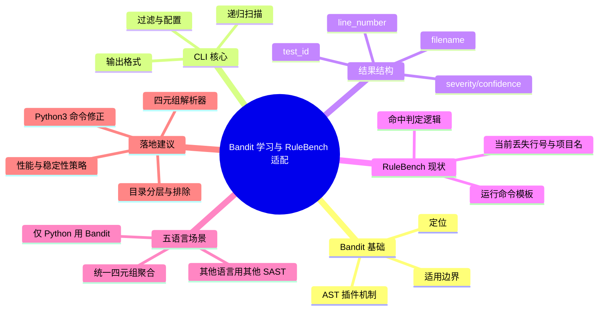

# 记忆卡片摘要（快速复习版）

## 1. 大纲（压缩版）
- Bandit 是什么：Python 静态安全扫描器，基于 AST 插件规则扫描。
- 解决什么问题：在不运行代码的前提下，尽早发现高风险 API/模式（如 `eval`、不安全反序列化、命令执行）。
- CLI 怎么用：`bandit -r <目录>`、`-f json`、`-o`、`-x`、`-t/-s`、`-c`（默认一次跑多条规则）。
- RuleBench 里怎么跑 Bandit：`runners.py` 的 `python -m bandit ...`，并行 per-sample 或 batch。
- RuleBench 怎么算命中：当前归一化到 `Detection(example, rule, scanner)`，按文件 basename 命中，可选 strict-rule 子串匹配。
- 能否直接产出 `<项目, rule, 文件, 行号>`：Bandit 原始 JSON 可以；RuleBench 当前解析链路会丢失 `line_number` 与 `project`。
- 五语言真实项目是否适用：Bandit 仅适配 Python；需做语言分流与多工具编排。

## 2. 思维导图（Mermaid）


## 3. 重要知识点（必须记住）
- `必须记住` Bandit 只扫描 Python 代码，不支持 Java/Go/PHP/JS 语义扫描。[来源1][来源3]
- `必须记住` `-r` 会递归；对大仓库必须配合 `-x` 排除目录，避免把无关目录/产物扫进去。[来源3]
- `必须记住` JSON 结果天然含 `test_id`、`filename`、`line_number`，可直接组装四元组。[来源6]
- `必须记住` RuleBench 当前标准化模型没有行号字段，无法直接满足 `<项目, rule, 文件, 行号>` 输出目标。[来源11][来源13]
- `必须记住` Bandit 没有“规则级并行”参数；`-n` 是输出上下文行数，不是并行度。[来源3][来源19]

## 4. 难点 / 易混点
- `容易踩坑` “Bandit 能扫多语言项目”与“Bandit 能扫项目中的 Python 子集”不是一回事。
- `容易踩坑` RuleBench `run` 默认命令里写的是 `python -m bandit`，在仅有 `python3` 的环境会失败（实测）。[来源10][来源17]
- `容易踩坑` RuleBench 命中逻辑以 basename 为主；在真实仓库常见重名文件（如 `utils.py`）时会误匹配风险。
- `先知道即可` strict-rule 是“规则字符串包含匹配”，不是严格结构化规则等值匹配。[来源10][来源12]
- `容易踩坑` 以为 `-n` 能加速扫描；实际上它只控制每条告警展示多少行上下文代码。[来源19]

## 5. QA 快速复习卡片
- Q: Bandit 会不会执行代码？
  A: 不会。它解析 AST 并用插件规则检查语法结构与调用模式。[来源1]
- Q: 想输出行号要看哪里？
  A: 看 Bandit JSON `results[].line_number`。[来源6]
- Q: RuleBench 现在为什么拿不到行号？
  A: `Detection` 数据结构没有 line 字段，`report_parser` 也没保留该字段。[来源11][来源13]
- Q: 五语言项目能只用 Bandit 吗？
  A: 不能。Bandit 仅覆盖 Python；其他语言要接入对应 SAST。
- Q: Bandit 能否在一次扫描里把“多条规则并行跑”？
  A: 默认可一次启用多条规则，但是单进程执行规则检查；想并行需外层起多个 Bandit 进程（按规则分组）。[来源3][来源4][来源19]

## 6. 快速复现步骤（最短路径）
1. 安装并确认：`python3 -m pip install bandit && python3 -m bandit --version`（本次实测为 1.9.4）。[来源17]
2. 跑单文件：
   `python3 -m bandit -f json -o /tmp/bandit_single.json <file.py>`
3. 从 JSON 提取四元组：
   读取 `results[]` 的 `test_id + filename + line_number`，再补上项目名字段。

---

# 学习笔记正文（详细版）

## 0. 学习目标、读者画像与假设
- 技术：`Bandit`
- 学习目标：理解 Bandit 的作用、原理、CLI 使用；看懂 RuleBench 对 Bandit 的运行与结果处理；判断其对真实项目的适用性。
- 读者水平：`初学/非科班`
- 时间预算：`3h`（标准版）
- 版本范围：
  - 官方文档读取：Bandit 文档 `latest`（页面显示 1.9.3）。[来源1]
  - 本地运行：`python3 -m bandit --version` 实测 1.9.4（2026-03-04）。[来源17]
- 运行环境：Linux + Python3；可联网检索官方文档；可本地执行 Bandit。
- 假设与限制：
  - RuleBench 仓库路径可读，但当前会话对该仓库写入受限（实测 `rulebench.cli run` 写 CSV 报权限错误）。[来源12][来源17]
  - 文中 RuleBench 适用性结论基于当前源码与实测命令，不是未来版本承诺。

## 1. 背景与用途（从读者视角）
### 1.1 这项技术解决什么问题
Bandit 是 Python 安全静态分析工具，目标是在代码评审/CI 前置阶段，自动发现“看起来就危险”的代码模式，例如：
- 动态执行（`eval/exec`）
- 命令注入相关调用（`subprocess` / `os.system` 变体）
- 不安全反序列化（`pickle`/`marshal` 等）
- SQL 拼接风险等插件规则覆盖点  
这些都由内置测试插件和黑名单规则族实现。[来源1][来源5]

### 1.2 不用它会怎样
- 纯人工审查很难稳定覆盖这些高频危险模式。
- 出现“上线后才通过事故回溯发现本来可以静态拦截”的情况。

### 1.3 典型应用场景
- 提交前本地扫描（开发者自检）
- CI 阶段安全 gate（例如 GitHub Action / pre-commit）
- 大批量 Python 仓库安全基线扫描与告警汇总。[来源7][来源8]

## 2. 核心概念与术语（直白解释）
- 抽象语法树（Abstract Syntax Tree, AST）：
  把源码变成结构化语法树，再按规则遍历匹配。Bandit 基于 AST 而非运行时行为。[来源1]
- 测试插件（Test Plugin）：
  每条规则对应一个检测器，通常映射到 `Bxxx` 规则编号（如 `B602`）。[来源5]
- 黑名单插件（Blacklist Plugin）：
  聚焦已知危险调用/导入模式，常见 `B3xx/B4xx` 家族。[来源1]
- 严重度/置信度（Severity/Confidence）：
  结果里给每条告警的风险等级和置信等级。[来源6]

## 3. 工作原理 / 机制（先直观后严格）
### 3.1 直观版
把 Python 文件“读一遍、拆成语法结构”，再拿一组安全规则去对照，命中就输出“哪条规则、哪个文件、第几行”。

### 3.2 严格版
1. 解析输入目录或文件（`-r` 递归时会遍历目录）。[来源3]  
2. 构建 AST 并运行插件管理器中的检测规则。  
3. 生成格式化报告（屏幕、JSON、CSV、HTML、SARIF 等）。[来源3][来源6]  
4. 返回退出码：发现问题通常返回非 0（例如本次单文件/批量实测均返回 1）。[来源17]

## 4. 核心 API / 语法 / 组件 / 命令（按技术类型适配）
### 4.1 你最常用的 Bandit CLI 参数
- `-r, --recursive`：递归扫描目录。[来源3]
- `-f, --format`：输出格式（含 `json`/`sarif` 等）。[来源3]
- `-o, --output`：输出文件。
- `-x, --exclude`：排除目录或文件（大仓库关键参数）。[来源3]
- `-t, --tests` / `-s, --skip`：指定仅跑/跳过哪些规则。[来源3]
- `-c, --configfile`：使用配置文件（YAML/TOML INI 风格入口）。[来源4]
- `-n, --number`：每条告警输出的上下文代码行数，不是并行参数。[来源3][来源19]

### 4.2 配置文件要点
- 官方支持通过 `.bandit`/配置文件指定目标、排除路径、规则选择等。[来源4]
- `pyproject.toml` 也可承载 Bandit 配置（官方给出示例）。[来源4]

### 4.3 RuleBench 中 Bandit 命令模板映射
来自 `src/rulebench/runners.py`：
- batch:
  `python -m bandit -r "{examples_root}" -f json -o "{report0}"`。[来源10]
- per-sample:
  `python -m bandit -f json -o "{report0}" "{sample_path}"`。[来源10]

与官方参数对照：
- `-r`、`-f json`、`-o` 都是官方标准参数，用法正确。[来源3][来源10]
- 实操细节：模板里是 `python`，当前环境若仅 `python3` 会失败（本次实测失败）。[来源17]

### 4.4 多规则并行：Bandit 是否支持、如何落地
先给结论：
- `支持一次扫描启用多条规则`：默认就是“全部规则一起跑”，也可用 `-t` 指定一组规则。
- `不支持规则级内建并行参数`：官方参数列表没有 `jobs/workers/threads` 这类开关；`-n` 仅是上下文行数。[来源3][来源19]

如果要“多规则并行加速”，建议做外层并行编排（多进程）：

规则集目录结构示例：
```text
bandit-rules/
  rce.yml
  deserialization.yml
  web.yml
```

每个规则集配置文件示例（`bandit-rules/rce.yml`）：
```yaml
exclude_dirs:
  - tests
  - .venv
tests:
  - B102
  - B307
  - B601
  - B602
  - B603
  - B604
  - B605
  - B606
  - B607
```

命令行参数要点：
- `-c <cfg.yml>`：加载一组规则（`tests`/`skips`）。[来源4]
- `-r <target>`：扫描目标目录。
- `-f json -o <file>`：每组规则单独输出报告，便于并发后合并。
- `-x`：并发扫描时也要统一排除目录，避免无意义重复扫描。

并行执行示例（bash）：
```bash
TARGET=/path/to/repo
OUT=bandit-reports
mkdir -p "$OUT"

for cfg in bandit-rules/*.yml; do
  name="$(basename "$cfg" .yml)"
  python3 -m bandit -r "$TARGET" -c "$cfg" -f json -o "$OUT/$name.json" &
done
wait
```

合并结果时建议去重键：
- `filename + line_number + test_id + issue_text`

为什么这样做：
- 同一仓库同一文件会被多进程重复解析，适合在“规则组较重、机器核数足够”时换吞吐。
- 若仓库很大，先按目录分片再叠加规则并行，通常更稳。

## 5. 常见用法与典型场景
### 场景1：扫描单个 Python 文件
- 用于快速验证某条规则是否触发。
- 命令：`python3 -m bandit -f json -o /tmp/bandit_single.json eval_1.py`

### 场景2：扫描 Python 目录
- 命令：`python3 -m bandit -r <python_root> -f json -o report.json`
- 大仓库建议加：`-x` 排除 `venv/.git/build/dist/node_modules/generated` 等。

### 场景3：CI 集成
- pre-commit 或 GitHub Action（官方文档有集成章节）。[来源7][来源8]

## 6. 最小可运行示例（含预期输出/现象）
### 示例1：最小单文件扫描（已实际验证）
- 目标：验证 Bandit 能给出 `rule + file + line`。
- 前提条件：已安装 `bandit`（本次安装版本 1.9.4）。
- 命令：
```bash
python3 -m bandit -f json -o /tmp/bandit_single.json \
  /home/nyn/Desktop/Projects/SAST/SASTBenchmark/data/benchmarks/example/Bandit/Python/eval_1.py || true
```
- 预期现象（本次实测）：
  - `results=1`
  - `test_id=B307`
  - `line_number=7`
  - `filename=.../eval_1.py`。[来源17]
- 常见错误与修复：
  - 报 `No module named bandit`：先安装 `python3 -m pip install bandit`。
  - 报 `python: command not found`：改为 `python3 -m bandit`。

### 示例2：RuleBench 逻辑下 per-sample 运行（已实际验证）
- 目标：验证 RuleBench 命令模板能否跑通 Bandit。
- 关键点：覆盖 scanner command 为 `python3 -m bandit ...`。
- 实测脚本结果（20 样本，strict-rule）：`tp=20, fp=0, fn=0, tn=0`，说明命令链路可用。[来源17]

### 示例3：四元组提取脚本（可运行）
- 目标：产出 `<项目, rule, 文件, 行号>`。
- 代码：
```python
import json
from pathlib import Path

def bandit_to_quadruples(project: str, report_path: str):
    data = json.loads(Path(report_path).read_text(encoding="utf-8"))
    out = []
    for r in data.get("results", []):
        out.append(
            (
                project,
                r.get("test_id", ""),      # rule
                r.get("filename", ""),     # file
                r.get("line_number", -1),  # line
            )
        )
    return out
```
- 运行时现象（本地实测）：
  `/tmp/bandit_batch_bandit_python.json` 提取到 `91` 条四元组。[来源17]

## 7. 常见错误与排查路径
### 7.1 工具层
- 症状：`python -m bandit` 报错。
- 原因：系统无 `python` 命令，仅 `python3`。
- 排查：`which python` / `python3 -m bandit --version`。

### 7.2 结果层
- 症状：只能看到命中文件，看不到行号。
- 原因：不是 Bandit 丢行号，而是中间解析模型没保留行号字段。
- 排查：
  1. 打开原始 JSON 看 `results[].line_number` 是否存在。
  2. 检查 `Detection` 模型字段是否有 `line`（当前没有）。[来源11][来源13]

### 7.3 规模层
- 症状：批量扫描慢 / 噪声多。
- 常见原因：扫描范围过大、无排除、把无关目录也扫了。
- 排查顺序：
  1. 先限定 Python 源目录。
  2. 增加 `-x` 排除。
  3. 不要误用 `-n`（它只改上下文行数）；需要加速请做外层多进程并发。
  4. 按子仓分批并行。

## 8. 最佳实践与边界条件
### 8.1 最佳实践
- `必须记住` 多语言仓库先做语言分流：Bandit 仅跑 Python 子目录。
- `必须记住` 报告聚合时保留完整路径和行号，不要只留 basename。
- `容易踩坑` 统一模型至少应为：`project, rule, file_path, line, severity, confidence, tool`。
- `容易踩坑` 批量目录扫描时显式排除测试产物和三方依赖目录。

### 8.2 边界条件
- Bandit 不会编译 Java/Go/PHP/JS，也不会给这些语言产出语义告警。[来源1][来源3]
- Bandit 对 Python 代码中的动态行为只能做静态近似，无法替代运行时验证。

## 9. 版本差异 / 兼容性说明（如适用）
- 官方文档 `latest` 页面显示版本 1.9.3；本地 pip 可安装到 1.9.4（2026-03-04 实测）。[来源1][来源17]
- 本笔记中的 CLI 参数和 JSON 关键字段在本次实测与官方文档一致。

冲突点：
- 来源A（Bandit docs latest 页面）：显示文档版本 1.9.3。[来源1]
- 来源B（本地安装实测）：`python3 -m bandit --version` = 1.9.4。[来源17]
- 差异原因判断：文档站更新与包发布存在时间差。
- 本笔记采用结论：命令与 JSON 字段按 1.9.x 通用行为讲解，版本号同时标注。

## 10. 延伸学习路径（官方优先）
- 先读：
  1. Getting Started（安装、基本命令）[来源2]
  2. Configuration（配置文件与排除策略）[来源4]
  3. Report Formatters（JSON/SARIF 字段）[来源6]
- 再做：
  1. pre-commit 接入 [来源7]
  2. GitHub Action 接入 [来源8]
- 进阶：
  1. Test Plugins 全量阅读，针对组织风险偏好做规则策略 [来源5]
  2. 定制结果聚合层（四元组/多工具归并）

## 11. RuleBench 运行与结果处理流程详解（你额外需求的核心）
### 11.1 当前流程（按源码还原）
1. `rulebench.cli run --sast bandit` 进入 `run_sast`。[来源12][来源10]  
2. 过滤 case：
   - `case_scope=self` 时只评估 Bandit 自带样本；
   - 然后按 `RUNNER_ALLOWED_LANGUAGES['bandit']={'python'}` 只留 Python case。[来源10]
3. 扫描模式：
   - `batch`：一次扫目录；
   - `per-sample`：每个样本放到临时目录单独跑，并行执行。[来源10]
4. 报告解析：`report_parser.load_detections` 把各工具报告归一化到 `Detection(example, rule, scanner)`。[来源11][来源13]
5. 命中判定：
   - 默认只要 `example basename` 命中即算 hit；
   - `strict_rule` 时再检查 `case.rule` 是否是 `d.rule` 子串。[来源10]
6. 最后计算 TP/FP/FN/TN 并输出指标。[来源12]

### 11.2 逻辑-官方参数映射
| RuleBench 字段/参数 | 当前实现 | 官方语义映射 |
|---|---|---|
| `default_batch_command` | `python -m bandit -r "{examples_root}" -f json -o "{report0}"` | `-r` 递归，`-f json` JSON 输出，`-o` 输出文件 |
| `default_single_command` | `python -m bandit -f json -o "{report0}" "{sample_path}"` | 单文件扫描 + JSON |
| `strict_rule` | `rule_token in d.rule.lower()` | 利用 `test_id(Bxxx)` 做粗匹配 |
| `scan_mode` | `batch/per-sample` | 对应“整目录 vs 单样本”执行策略 |

### 11.3 与“四元组目标”的差距分析
目标：`<项目, rule, 文件, 行号>`  
现状：
- `项目(project)`：当前无字段；
- `rule`：有；
- `文件`：仅 basename（非完整路径）；
- `行号`：丢失。  
根因是模型与解析器统一层过度压缩字段。[来源11][来源13]

### 11.4 对真实开源项目是否适用（结论）
先给结论：`部分适用（用于“跑得起来+粗命中评估”），不适合直接用于真实项目四元组产线。`

#### A. 运行指令是否正确
- 参数语义本身正确（官方支持）。
- 但可移植性问题明显：命令写死 `python`，很多环境只提供 `python3`，会直接失败（本次已复现）。[来源10][来源17]

#### B. 结果处理逻辑是否适用
- 对 benchmark（样本文件名全局唯一）可用。
- 对真实项目不够用：
  - basename 匹配在真实仓库容易重名误命中；
  - 行号丢失，无法定位修复位置；
  - 无项目维度，跨仓聚合困难。

#### C. 五语言项目是否适用
- Bandit 只适配 Python；对 Java/Go/PHP/JS 必须用其他工具补齐。
- 因此“单 Bandit 扫五语言并输出统一四元组”不可行。

#### D. 是否需要编译
- Bandit 本身不需要编译项目（静态 AST 扫描）。
- 但如果你引入其他语言工具（例如 Java/Go 某些 SAST）可能需要编译或构建上下文。

#### E. 大型项目稳定性/性能
- 有风险点：扫描范围过大、目录噪声、外层并发进程数过高会拖慢或引入无关结果。
- 解决：分仓分语言、目录白名单、`-x` 排除、按规则/目录分片并发、结果分片聚合。[来源3][来源4][来源19]

#### F. 输出是否能定位 rule 与文件位置
- Bandit 原始 JSON：能（rule + file + line）。[来源6][来源17]
- RuleBench 当前归一化输出：不能完整保留（缺 line 与 full path）。

## 12. 官方文档章节映射与重要例子保留检查（专门一轮）
### 12.1 映射表（官方章节 -> 本笔记章节）
| 官方章节 | 本笔记对应 | 覆盖说明 |
|---|---|---|
| Getting Started [来源2] | 第4/5/6节 | 已覆盖安装、基础命令、最小示例 |
| Configuration [来源4] | 第4.2节、第8节 | 已覆盖配置入口与排除策略 |
| Integrations [来源7] | 第5.3节、第10节 | 已覆盖 pre-commit/CI 接入方向 |
| Test Plugins [来源5] | 第2节、第1节 | 已解释 Bxxx 规则体系与示例 |
| Blacklist Plugins [来源1] | 第2节 | 已说明黑名单插件家族用途 |
| Report Formatters [来源6] | 第4.1节、第6节 | 已保留 JSON 字段与输出用途 |
| CI/CD [来源8] | 第5.3节、第10节 | 已覆盖 GitHub Action 场景 |
| FAQ [来源9] | 第8节、第9节 | 已体现在边界与版本差异说明 |

### 12.2 重要例子保留情况
- 保留了官方关键命令风格：递归扫描、JSON 输出、配置文件用法。
- 保留并扩展了“结果格式”示例：补充了四元组提取代码与实测输出。
- 对未展开的官方细粒度内容（如全部插件逐条深读）说明：超出当前目标，放在第10节“进阶路径”。

---

# 练习与复习闭环

## 1. 分层练习
### 基础练习
- 任务：对一个含 `eval` 的最小 Python 文件运行 Bandit，并找到 `test_id` 与 `line_number`。
- 目标：理解 Bandit 输出最小闭环。

### 应用练习
- 任务：在一个真实 Python 仓库上，设计 `-x` 排除策略并输出 JSON 报告。
- 验收：能解释为什么这些目录要排除，以及排除前后结果差异。

### 综合练习
- 任务：实现多工具统一结果结构，至少输出
  `project, tool, rule, file_path, line, severity, confidence`。
- 验收：可对 1 个多语言仓库跑完并落盘 CSV/Parquet。

## 2. 动手任务（带验收标准）
- 任务：把 RuleBench 的 Bandit 结果解析改造成可输出四元组。
- 验收标准：
  1. `Detection` 新增 `file_path` 和 `line` 字段；
  2. `report_parser` 对 Bandit JSON 正确填充；
  3. 输出中可看到 `Bxxx + 绝对/相对路径 + 行号`；
  4. 保持旧评估逻辑兼容（可开关）。

## 3. 常见误区纠偏
- 误区：Bandit 扫描目录就等于支持多语言。
  正解：它只是递归“目录”，真正分析仅限 Python。
- 误区：评分命中高就代表可用于生产告警平台。
  正解：benchmark 命中与生产可定位性是两件事。

## 4. 复习节奏建议
- Day 1：重跑第6节三个示例，确保能独立解释每个参数。
- Day 3：复盘第11节流程图，口述 RuleBench 从运行到打分的全链路。
- Day 7：实现一次四元组提取并接入一个真实 Python 仓库。
- Day 14：完成多语言编排方案（Bandit + 其他语言 SAST）并输出统一结果。

## 5. 自测题与参考答案（简版）
- 题目1：Bandit 原始 JSON 中定位规则和行号看哪些字段？
  参考答案：`results[].test_id` 与 `results[].line_number`。
- 题目2：为什么 RuleBench 当前不满足四元组要求？
  参考答案：统一模型缺少 project/line/full_path，且命中主要基于 basename。
- 题目3：五语言项目里 Bandit 正确的定位是什么？
  参考答案：只负责 Python 子集；其余语言需额外 SAST 工具。

---

# 参考来源与版本说明

## 官方来源（优先）
1. [Bandit 文档首页（latest）](https://bandit.readthedocs.io/en/latest/) - 文档版本页显示 1.9.3（访问日期：2026-03-04）- 工具定位与导航。[来源1]
2. [Bandit Getting Started](https://bandit.readthedocs.io/en/latest/start.html) - 访问日期：2026-03-04 - 安装与入门命令。[来源2]
3. [Bandit Man Page](https://bandit.readthedocs.io/en/latest/man/bandit.html) - 访问日期：2026-03-04 - CLI 参数规范。[来源3]
4. [Bandit Configuration](https://bandit.readthedocs.io/en/latest/config.html) - 访问日期：2026-03-04 - 配置方式与示例。[来源4]
5. [Bandit Test Plugins](https://bandit.readthedocs.io/en/latest/plugins/index.html) - 访问日期：2026-03-04 - 规则索引与分类。[来源5]
6. [Bandit JSON Formatter](https://bandit.readthedocs.io/en/latest/formatters/json.html) - 访问日期：2026-03-04 - JSON 字段样例（含 `test_id/line_number/filename`）。[来源6]
7. [Bandit Integrations](https://bandit.readthedocs.io/en/latest/integrations.html) - 访问日期：2026-03-04 - pre-commit 等集成入口。[来源7]
8. [Bandit GitHub Actions CI/CD](https://bandit.readthedocs.io/en/latest/ci-cd/github-actions.html) - 访问日期：2026-03-04 - CI 集成参数。[来源8]
9. [Bandit FAQ](https://bandit.readthedocs.io/en/latest/faq.html) - 访问日期：2026-03-04 - 常见问题与边界说明。[来源9]

## 第三方来源（按采信程度标注）
1. [PyPI: bandit](https://pypi.org/project/bandit/) - 采信程度：中 - 用于发行信息交叉参考（页面索引可能滞后）。[来源18]

## 本地代码与实测来源
1. [/home/nyn/Desktop/Projects/SAST/SASTBenchmark/src/rulebench/runners.py](/home/nyn/Desktop/Projects/SAST/SASTBenchmark/src/rulebench/runners.py) - Bandit runner 命令模板、语言过滤、命中逻辑。[来源10]
2. [/home/nyn/Desktop/Projects/SAST/SASTBenchmark/src/rulebench/report_parser.py](/home/nyn/Desktop/Projects/SAST/SASTBenchmark/src/rulebench/report_parser.py) - 结果归一化实现（当前无行号字段）。[来源11]
3. [/home/nyn/Desktop/Projects/SAST/SASTBenchmark/src/rulebench/cli.py](/home/nyn/Desktop/Projects/SAST/SASTBenchmark/src/rulebench/cli.py) - run 子命令与 CSV 输出流程。[来源12]
4. [/home/nyn/Desktop/Projects/SAST/SASTBenchmark/src/rulebench/models.py](/home/nyn/Desktop/Projects/SAST/SASTBenchmark/src/rulebench/models.py) - `Detection` 数据结构定义。[来源13]
5. [/home/nyn/Desktop/Projects/SAST/SASTBenchmark/src/rulebench/doc/README.md](/home/nyn/Desktop/Projects/SAST/SASTBenchmark/src/rulebench/doc/README.md) - RuleBench 打榜规则说明。[来源14]
6. [/home/nyn/Desktop/Projects/SAST/SASTBenchmark/data/benchmarks/example/Bandit/normalized_bandit_python.csv](/home/nyn/Desktop/Projects/SAST/SASTBenchmark/data/benchmarks/example/Bandit/normalized_bandit_python.csv) - 样本与规则映射。[来源15]
7. [/home/nyn/Desktop/Projects/SAST/SASTBenchmark/data/benchmarks/example/Bandit/bandit_result.json](/home/nyn/Desktop/Projects/SAST/SASTBenchmark/data/benchmarks/example/Bandit/bandit_result.json) - 历史 Bandit 原始报告样本。[来源16]
8. 本地命令实测记录（2026-03-04）：`python3 -m bandit --version`、单文件扫描、batch 扫描、`run_sast` 覆盖命令验证。[来源17]
9. 本地 CLI 帮助实测（2026-03-04）：`python3 -m bandit -h`，用于确认 `-n` 为上下文行数且无并行参数。[来源19]

## 关键结论引用映射
- “Bandit 仅 Python 静态分析、AST 插件机制” -> [来源1][来源3][来源5]
- “CLI 参数与输出格式（json/sarif）” -> [来源3][来源6]
- “RuleBench Bandit 命令模板与语言过滤” -> [来源10]
- “RuleBench 当前会丢失行号/项目字段” -> [来源11][来源13]
- “`python` 命令兼容性与 `python3` 替代可行” -> [来源10][来源17]
- “四元组可由 Bandit 原始 JSON 直接抽取” -> [来源6][来源17]
- “Bandit 默认可一次跑多规则，但无规则级并行参数；并行需外层编排” -> [来源3][来源4][来源19]

## 技术版本与文档版本/访问日期
- 当前日期：2026-03-04
- Bandit 文档：`latest`（页面显示 1.9.3）
- Bandit 本地安装：1.9.4（命令实测）
- RuleBench 源码：读取路径见“本地代码与实测来源”

## 冲突点与裁决（如有）
- 冲突点：Bandit“当前版本”显示不一致（文档页 1.9.3 vs 本地可安装 1.9.4）。
- 裁决依据：运行行为以本地可执行版本为准；概念与参数以官方文档主线为准。
- 采用结论：两者并列标注，避免版本误导。

---

## 附录A：迭代检查记录（本次）
- 第1轮（结构草稿）：完成主线章节 + RuleBench 流程映射。
- 第2轮（深度补全）：补充“为什么/怎么做/如何判断正确”四维解释，增加真实命令输出与失败案例。
- 第3轮（官方映射专项）：补官方章节映射表、重要例子保留说明、冲突裁决说明。
- 第4轮（一致性检查）：统一术语（规则=rule=`test_id`）、统一四元组字段命名、补齐引用映射。

## 附录B：Mermaid 验证状态
- 已完成 Mermaid CLI 编译验证并通过（2026-03-04）。
- 编译命令：
```bash
npx -y @mermaid-js/mermaid-cli -i bandit-learning-notes.md -o /tmp/bandit-learning-notes.svg
```
- 编译输出：`bandit-learning-notes-1.svg`（与笔记同目录生成）。
- 若你在其他环境复验，可执行：
```bash
npx -y @mermaid-js/mermaid-cli -i bandit-learning-notes.md -o /tmp/bandit-learning-notes.svg
```
若失败，通常是环境中 Chromium 沙箱/依赖问题，可加 Puppeteer 配置后重试。
