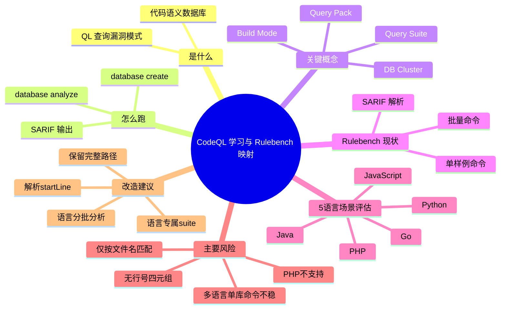

# 记忆卡片摘要（快速复习版）

## 1. 大纲（压缩版）
- CodeQL 是什么、解决什么问题
- CodeQL 的核心机制（数据库 + 查询）
- CLI 主链路（`database create` -> `database analyze`）
- SARIF 结果如何映射到 `<项目, rule, 文件, 行号>`
- Rulebench 现有 CodeQL 逻辑的真实流程
- Rulebench 在真实开源项目上的适用性结论（5 语言场景）
- 推荐改造方案与排障清单

## 2. 思维导图（Mermaid）


## 3. 重要知识点（必须记住）
- `CodeQL` 不是直接扫源码字符串，而是先抽取语义数据库再跑查询。[来源1][来源3]
- `database create` 的 `build-mode` 必须按语言选；编译型语言常需 `autobuild/manual`，解释型语言通常可 `none`。[来源3][来源6]
- Rulebench 当前 CodeQL 只允许 `java/javascript/python/go`，不含 `php`。[本地证据1]
- SARIF 里天然有 `ruleId + artifactLocation.uri + region.startLine`，可以形成 `<rule, 文件, 行号>`。[来源4][本地证据2]
- Rulebench 当前 `report_parser` 只保留文件 basename，不保留目录和行号，无法直接输出你要求的四元组。[本地证据3]

## 4. 难点 / 易混点
- `codeql-security-and-quality.qls` 不是通用全语言入口；实际应使用语言包/suite 规范（如 `codeql/java-queries:codeql-suites/java-security-and-quality.qls`）。[来源5][本地证据4]
- “多语言扫描”不是把所有语言随便拼到一个命令就完事；要考虑 `--db-cluster`、按语言分析和 `sarif-category` 区分结果。[来源3][来源7]
- “命中文件”不等于“命中规则行号”；评估命中逻辑和告警定位逻辑是两层问题。

## 5. QA 快速复习卡片
- Q: CodeQL 扫描的最小闭环是什么？
  A: `database create` 构建数据库 -> `database analyze` 跑查询/查询套件 -> 输出 SARIF。[来源3][来源4]
- Q: 为什么 Rulebench 目前不能直接给 `<项目, rule, 文件, 行号>`？
  A: 解析器只抽 `example/rule/scanner`，并把路径降成 basename，没抽 `startLine`。[本地证据3]
- Q: 5 语言里哪一个会直接卡住？
  A: PHP。当前 CodeQL 文档支持语言列表不含 PHP，且本机 `codeql resolve languages` 也无 PHP。[来源2][本地证据5]
- Q: 真实开源项目最容易翻车在哪？
  A: 编译链（Java/Go）、多语言结果归并、同名文件冲突、资源参数不足（RAM/线程）。[来源3][来源6][本地证据6]

## 6. 快速复现步骤（最短路径）
1. 检查环境：`codeql version`、`codeql resolve languages`
2. 用单语言样例建库：`codeql database create ... --language=python --build-mode=none`
3. 跑一个查询并导出 SARIF：`codeql database analyze ... --format=sarif-latest`
4. 读取 SARIF `ruleId/uri/startLine`，确认四元组字段可提取
5. 对照 Rulebench `runners.py` 和 `report_parser.py`，定位当前损失字段

---

# 学习笔记正文（详细版）

## 0. 学习目标、读者画像与假设
- 技术：`CodeQL`
- 学习目标：理解 CodeQL 的作用、原理、CLI 用法；并准确评估 Rulebench 当前 CodeQL 逻辑在真实开源项目中的可用性。
- 读者水平：初学（默认），非科班可读。
- 时间预算：标准版（约 3h 学习）。
- 版本范围：
  - 本地实测 CLI：`2.23.3`（2026-03-04 实测）[本地证据7]
  - 在线参考：CodeQL CLI Releases 页面显示近期版本（检索到 `v2.23.5`）。[来源8]
- 运行环境：本地 Linux（本次含实际命令验证）。
- 假设与限制：
  - 已联网查官方文档。
  - Mermaid 在当前环境缺少 `mmdc`，但已通过 `npx @mermaid-js/mermaid-cli` 完成编译验证。

## 1. 背景与用途（从读者视角）
- 你可以把 CodeQL 看成“先把代码变成可查询数据库，再用查询语句找漏洞模式”的 SAST 工具。
- 典型用途：
  - 批量扫描仓库里的已知漏洞模式
  - 安全基线检查（安全 + 质量规则）
  - 在 CI/CD 里持续产出 SARIF 供平台展示
- 不用它会怎样：
  - 你仍可用普通 SAST，但很难获得同等灵活的“可编程查询能力”和跨语言统一查询框架。

## 2. 核心概念与术语（直白解释）
- 语义数据库（CodeQL Database）
  - 含义：从源码中提取出的语义信息（调用、数据流、AST 等）。
  - 为什么重要：查询不是直接 grep 代码，而是在语义层匹配模式。[来源1][来源3]
- 查询包（Query Pack）
  - 含义：一组查询和元数据的打包单位（例如 `codeql/python-queries`）。[来源3]
- 查询套件（Query Suite, `.qls`）
  - 含义：预先组织好的查询集合（如 security-and-quality）。[来源3][来源5]
- SARIF（Static Analysis Results Interchange Format）
  - 含义：标准化静态分析输出格式，包含规则、文件、位置等字段。[来源4]
- 构建模式（Build Mode）
  - `none`：不显式构建源码（常用于解释型语言）。
  - `autobuild`：自动尝试构建（常用于编译型语言）。
  - `manual`：你提供构建命令（复杂项目最稳）。[来源3][来源6]

## 3. 工作原理 / 机制（先直观后严格）
### 3.1 直观版
1. 把代码喂给 `database create`。
2. CodeQL 提取信息，建好数据库。
3. 用 `database analyze` 跑查询。
4. 输出 SARIF，拿到规则 ID、文件、行号等告警信息。

### 3.2 严格版
- 数据准备阶段（Extraction）
  - `database create` 会按语言提取语义；对编译型语言，是否可成功提取依赖构建过程。[来源3][来源6]
- 查询执行阶段（Evaluation）
  - `database analyze` 可接收：单查询、目录、`.qls` 套件、pack 规范。[来源3]
- 结果阶段（Interpretation）
  - `--format=sarif-latest` 生成 SARIF JSON。
  - SARIF 结果项中可包含 `ruleId`、`locations[].physicalLocation.artifactLocation.uri`、`locations[].physicalLocation.region.startLine`，满足你关心的规则与定位粒度。[来源4][本地证据2]

## 4. 核心 CLI / 参数（与你的场景强相关）
### 4.1 `codeql database create`
- 关键参数：
  - `--language=<lang>`：语言选择（可多语言，配合 `--db-cluster`）。[来源3]
  - `--build-mode=<none|autobuild|manual>`：构建模式。[来源3]
  - `--source-root=<dir>`：源码根目录。[来源3]
  - `--command=<build cmd>`：手工构建命令（等价 manual）。[来源3]

### 4.2 `codeql database analyze`
- 关键参数：
  - 查询输入：可传 query / directory / `.qls` / pack 规范。[来源3]
  - `--format=sarif-latest`：输出 SARIF。[来源3]
  - `--output=<file>`：输出路径。[来源3]
  - `--threads`、`--ram`：性能控制。
  - `--sarif-category`：多轮/多语言结果分类时建议使用。[来源7]

### 4.2.1 是否原生支持“一次并行跑多条规则”？
- 支持，且是 CodeQL CLI 的原生能力。
- 一次命令可输入“查询套件（`.qls`）/ 查询目录 / query pack”，这本质上就是多条规则（多条 query）批量运行。[来源3]
- 并行能力通过 `-j, --threads` 控制，官方帮助文本为“Use this many threads to evaluate queries.”（使用多个线程评估查询）。[本地证据12]
- 结论：
  - “一次性运行多条规则” = 支持（原生）
  - “并行运行多条规则” = 支持（通过 `--threads`）
  - 并行效率受机器 CPU/RAM 与查询复杂度影响，需配合 `--ram` 调参。

### 4.3 查询套件的正确写法（实操）
- 推荐按语言写：
  - `codeql/java-queries:codeql-suites/java-security-and-quality.qls`
  - `codeql/go-queries:codeql-suites/go-security-and-quality.qls`
  - `codeql/python-queries:codeql-suites/python-security-and-quality.qls`
  - `codeql/javascript-queries:codeql-suites/javascript-security-and-quality.qls`
- 本地验证：以上可 `codeql resolve queries` 成功解析；`codeql-security-and-quality.qls` 直接解析失败。[本地证据4]

### 4.4 如何把“某语言的零散规则”组织成一个 `.qls`（实操流程）
> 适用场景：你手里有一批分散的 CodeQL 规则，想固定成可复用的一套语言扫描基线。

#### 4.4.1 推荐流程（从需求到可执行）
1. 先固定语言与规则来源
   - 例：Python -> `codeql/python-queries`。
   - 把候选规则整理成“查询文件路径清单”或“规则 ID 清单”。
2. 新建一个“自定义 query pack”（不要直接改官方 pack）
   - 这样可版本化管理、便于团队复用。
3. 在 pack 下新建 `codeql-suites/*.qls`
   - 稀疏规则（零散少量）优先用 `- query: ...` 明确白名单。
   - 大规模规则（几十上百条）可 `apply` 官方 suite，再做 include/exclude 裁剪。
4. 每次修改后做两步校验
   - `codeql resolve queries <your.qls>`：先看是否能解析、实际会跑哪些 query。
   - `codeql database analyze <db> <your.qls> ...`：再做端到端执行验证。
5. 把规则集分层
   - `*-baseline.qls`：日常 CI 用，关注稳定与性能。
   - `*-extended.qls`：夜间/专项任务用，覆盖更广。

#### 4.4.2 建议目录结构（最终形态）
```text
custom-codeql/
  python/
    qlpack.yml
    README.md
    codeql-suites/
      python-security-baseline.qls
      python-security-extended.qls
    queries/                       # 可选：仅当你有自定义 .ql 时需要
      org/
        custom/
          MyCustomRule.ql
```

#### 4.4.3 `qlpack.yml` 最小模板（Python 示例）
```yaml
name: org/custom-python-queries
version: 0.1.0
dependencies:
  codeql/python-all: "*"
  codeql/python-queries: "*"
  codeql/suite-helpers: "*"
suites: codeql-suites
```

#### 4.4.4 `.qls` 两种写法
- 写法 A（最推荐给“零散规则”）：显式白名单（强可控）
```yaml
- description: Org Python baseline (explicit whitelist)
- query: Expressions/UseofInput.ql
  from: codeql/python-queries
- query: Security/CWE-113/HeaderInjection.ql
  from: codeql/python-queries
- query: Security/CWE-215/FlaskDebug.ql
  from: codeql/python-queries
```

- 写法 B（适合“先继承官方再裁剪”）：基于官方 suite
```yaml
- description: Org Python extended based on official suite
- apply: codeql-suites/python-security-and-quality.qls
  from: codeql/python-queries
- exclude:
    id:
      - py/some-expensive-query-id
```

#### 4.4.5 运行方式（与你当前 Rulebench 习惯一致）
```bash
# 先解析，确认会执行哪些查询
codeql resolve queries /path/to/custom-codeql/python/codeql-suites/python-security-baseline.qls

# 再分析
codeql database analyze <db_path> \
  /path/to/custom-codeql/python/codeql-suites/python-security-baseline.qls \
  --format=sarif-latest \
  --output=result.sarif \
  --threads=4 --ram=8192
```

#### 4.4.6 常见坑（你这个场景最容易踩）
- 把 `queries: .` 放在“空 pack”里：会出现 `No queries found in query suite`（因为本 pack 没有 `.ql`）。[本地证据13]
- 只写规则 ID 不写路径映射：不同版本可能因重命名造成维护困难，建议同时维护“ID + 查询路径”清单。
- 不做 `resolve queries` 预检：会在 `analyze` 阶段才暴露语法/路径问题，排障成本高。
- 混用多语言规则到单语言 suite：可解析但不一定可执行，建议“一语言一 pack/一组 suites”。

## 5. 常见用法与典型场景
- 场景 A：单语言仓库（最简单）
  - 例如 Python：`create --language=python --build-mode=none` + `analyze codeql/python-queries:...`
- 场景 B：编译型仓库（Java/Go）
  - 推荐先保证可构建，再选择 `autobuild/manual`，否则数据库质量或扫描完整性会受影响。[来源6]
- 场景 C：多语言仓库
  - 更稳做法：按语言分别分析并用 `--sarif-category` 标记，避免结果混淆。[来源7]

## 6. 最小可运行示例（含预期输出/现象）
### 示例 1：验证环境能力（已实测）
- 目标：确认本地 CodeQL 安装与语言能力。
- 命令：
```bash
codeql version
codeql resolve languages
```
- 预期现象：能输出版本与语言列表；本机列表不含 PHP。[本地证据5][本地证据7]
- 常见错误：`codeql: command not found`
- 修复：把 CodeQL 可执行加入 `PATH`。

### 示例 2：验证 SARIF 字段可提供 rule/file/line（已实测）
- 目标：证明 CodeQL 结果可支撑 `<rule, 文件, 行号>`。
- 前提：本机可运行 CodeQL CLI。
- 步骤（本次实测）：
  1. 创建最小 Python 源码目录。
  2. `database create` 建库。
  3. 使用一个最小自定义查询导出 SARIF。
  4. 读取 JSON 字段。
- 实测现象（截要）：
  - `results_count=2`
  - `sample_ruleId=demo/python/all-calls`
  - `sample_uri=demo.py`
  - `sample_startLine=4`
- 结论：CodeQL 结果层面可以给出规则+文件+行号；是否丢字段取决于你后处理脚本。[本地证据2]

### 示例 3：验证 Rulebench 当前解析结果（已实测）
- 目标：确认 Rulebench 是否保留行号。
- 命令：
```bash
PYTHONPATH=/home/nyn/Desktop/Projects/SAST/SASTBenchmark/src \
python3 - <<'PY'
from pathlib import Path
from rulebench.report_parser import load_detections
print(load_detections([Path('/tmp/codeql_demo/result_calls.sarif')])[0])
PY
```
- 实测现象：对象只有 `Detection(example='demo.py', rule='...', scanner='')`。
- 结论：当前解析层没有行号字段，且路径被 basename 化。[本地证据3]

## 7. Rulebench 对 CodeQL 的流程拆解 + 官方映射

### 7.1 Rulebench 当前流程（基于源码）
1. CLI 入口 `rulebench.cli run --sast codeql` 收集参数并调用 `run_sast`。[本地证据8]
2. `run_sast` 根据 `scan-mode`：
   - `batch`：执行 CodeQL 批量命令模板。[本地证据9]
   - `per-sample`：按样例文件扩展名推断 `codeql_lang`，逐个扫描。[本地证据10]
3. 结果解析 `load_detections`：
   - 对 SARIF 仅取文件 basename + ruleId，不保留行号。[本地证据3]
4. 命中判定：
   - 默认按“文件名命中”；`--strict-rule` 才检查规则 token 子串。[本地证据11]
5. 导出 CSV：`Example/Rule/Hit`，仍不含行号。[本地证据8]

### 7.2 指令与参数映射（Rulebench -> 官方含义）
| Rulebench 片段 | 官方语义 | 结论 |
|---|---|---|
| `database create ... --language=javascript,python,java,go --build-mode=autobuild`（batch） | `--language`/`--build-mode` 合法；多语言更推荐结合 `--db-cluster` 管理。 [来源3] | 语义基本可行，但缺少更清晰的多语言结果分流策略。 |
| `database analyze ... codeql-security-and-quality.qls`（batch） | `analyze` 支持 `.qls/pack`，但该字符串并非通用解析入口。 [来源3] | 本机实测解析失败，存在命令正确性风险。 [本地证据4] |
| `database analyze ... "codeql/{codeql_lang}-queries"`（single） | pack 规范支持。 [来源3] | 可跑，但未限定 security-and-quality，结果范围可能偏广。 |
| `--ram=12288` | 控制查询内存预算。 [来源3] | 大仓库可能仍不足；需结合并行策略。 |
| `codeql_lang` 由扩展名推断（含 `.php`） | 官方支持语言不含 PHP。 [来源2] | `.php` 会映射到不存在 pack，存在直接失败风险。 [本地证据5] |

## 8. 5 语言开源项目场景评估（Java/Go/PHP/Python/JS）

### 8.1 结论先行
- 现状“部分适用”：
  - Java/Go/Python/JS：在“项目可构建、命令修正、结果解析增强”前提下可用。
  - PHP：当前 CodeQL 路径不适用（语言与 pack 均不成立）。

### 8.2 逐项评估
- Java：
  - 需要有效构建链，`autobuild` 可能失败，复杂工程建议 `manual --command`。[来源6]
- Go：
  - 同样受构建和依赖影响；官方也将 Go 归入需要构建流程关注的语言。[来源6]
- Python/JavaScript：
  - 通常可 `build-mode=none`，但查询质量仍受框架模型、依赖结构影响。
- PHP：
  - 官方支持语言列表无 PHP；本机也无 PHP language pack，Rulebench 的 `.php -> php` 推断会失效。[来源2][本地证据5]

### 8.3 你关心的关键问题逐条回答
- 是否需要编译项目？
  - 编译型语言通常需要可构建（尤其 Java/Go）。[来源6]
- 多语言项目是否有适配问题？
  - 有。需要按语言组织分析与结果分类（`sarif-category`），否则混杂难追踪。[来源7]
- 大型项目是否有稳定性/性能风险？
  - 有。需调 `--threads/--ram`，并做好失败重试与分批扫描。
- 输出能否定位 rule 与文件位置？
  - CodeQL 原始 SARIF 可以；但 Rulebench 当前解析会丢目录与行号，不能直接输出你要的四元组。[来源4][本地证据2][本地证据3]
- 其他高风险点（brainstorm）：
  - 文件同名冲突：当前按 basename 匹配，跨目录同名会误归并。[本地证据6]
  - 扫描与评估目标错位：当前评估是“是否命中文件”，不是“是否命中精确告警点”。
  - 查询范围不稳定：未固定语言专属 security-and-quality suite 时，版本升级后结果波动更大。

## 9. 面向真实项目的改造建议（可直接落地）
### 9.1 命令层
- 把 batch 命令里的 `codeql-security-and-quality.qls` 改为语言明确的 suite（或按语言循环执行）。
- 多语言项目使用“按语言 analyze + `--sarif-category=<lang>`”输出多个 SARIF，再归并。[来源7]
- 对 Java/Go 增加 `manual --command` 入口，避免 autobuild 失败即全盘失败。[来源6]

### 9.2 结果层
- `report_parser` 保留完整相对路径，不要只留 basename。
- 新增字段提取：
  - `project`（扫描对象）
  - `ruleId`
  - `file`（完整相对路径）
  - `line`（`startLine`）
- 对应输出 CSV/JSON schema 升级为 `<project, rule, file, line>`。

### 9.3 评估层
- 命中判定改为“路径 + 行号（可选容差）+ 规则”三级匹配，降低误判。
- 保留 `strict-rule`，但不要只做子串匹配；建议规范化 rule ID 精确匹配。

## 10. 官方文档章节映射与重要例子保留检查

### 10.1 章节映射表（官方 -> 本笔记）
| 官方章节 | 本笔记对应章节 |
|---|---|
| About CodeQL（概念与语言支持）[来源1][来源2] | 第1、2节 |
| Preparing your code for CodeQL analysis（构建前提）[来源6] | 第4、5、8节 |
| `database create` manual [来源3] | 第4节 |
| `database analyze` manual [来源3] | 第4、7节 |
| CodeQL query help / security-and-quality suites [来源5] | 第4.3、7.2节 |
| SARIF support for code scanning [来源4] | 第3.2、6、8节 |
| Running CodeQL CLI in CI / category [来源7] | 第8、9节 |

### 10.2 重要例子保留检查
- 官方 CLI 核心链路示例（create/analyze/sarif）已保留并改写成可执行教学步骤。
- 多语言结果分类（`sarif-category`）已保留为真实项目实践建议。
- 受篇幅限制未逐条收录官方每个语言的完整命令矩阵，已在“延伸学习路径”给出精读入口。

## 11. 常见错误与排查路径
- 错误 1：`codeql-security-and-quality.qls` 无法解析
  - 排查：`codeql resolve queries codeql-security-and-quality.qls`
  - 修复：改为 `codeql/<lang>-queries:codeql-suites/<lang>-security-and-quality.qls`。[本地证据4]
- 错误 2：编译型语言建库失败
  - 排查：先独立验证项目能否构建；再看 `autobuild` 日志。
  - 修复：改 `manual --command`，显式给构建命令。[来源6]
- 错误 3：结果命中但定位不准
  - 排查：检查后处理是否丢路径/行号。
  - 修复：保留 `uri` 完整路径并抽 `startLine`。

## 12. 最佳实践与边界条件
- `必须记住`
  - 语言支持边界先确认，再写扫描编排（本题的 PHP 即边界）。
  - 多语言仓库不要混成单一不可追踪结果。
- `容易踩坑`
  - 只按文件名匹配会导致误报/漏报放大。
  - 把 benchmark 样例级逻辑直接迁移到真实项目会丢上下文。
- `先知道即可`
  - 自定义 query pack 与 model pack 深度优化可后学。

## 13. 版本差异 / 兼容性说明
- 本机 CLI 为 `2.23.3`，在线 release 显示已有更新版本（检索到 `2.23.5`）。
- 不同版本在查询包内容与规则集上可能有差异，建议在生产中固定 CLI+packs 版本并做基线回归。

## 14. 延伸学习路径（官方优先）
- 先读：`database create` / `database analyze` 手册。[来源3]
- 再读：Preparing code for CodeQL analysis（理解构建要求）。[来源6]
- 进阶：query suite 与 query pack 组织方式、SARIF 集成策略。[来源5][来源7]

---

# 练习与复习闭环

## 1. 分层练习
### 基础练习
- 练习 1：在本机跑 `codeql resolve languages`，写出支持语言并圈出“不支持 PHP”的证据。
- 练习 2：分别解析以下表达式是否有效：
  - `codeql-security-and-quality.qls`
  - `codeql/java-queries:codeql-suites/java-security-and-quality.qls`

### 应用练习
- 把 Rulebench 的 CodeQL batch 命令改成“按语言循环 + 语言 suite + sarif-category”。
- 扩展 `report_parser`，输出 `<project, rule, file, line>`。

### 综合练习
- 选一个真实多语言仓库，分别对 Java/Go/Python/JS 跑扫描，最终输出统一四元组并统计每语言耗时与内存峰值。

## 2. 动手任务（带验收标准）
- 任务：给 Rulebench 增加 `--emit-tuples` 输出，格式为 CSV：`project,rule,file,line`。
- 验收标准：
  - 至少 1 个 CodeQL SARIF 输入可正确导出行号。
  - 同名文件（不同目录）不冲突。
  - 与旧 `Hit` 逻辑并行可用。

## 3. 常见误区纠偏
- 误区：SAST 命中一个文件就够了。
  - 正解：真实修复依赖“哪条规则 + 哪个文件 + 哪一行”。
- 误区：benchmark 能跑通就能直接上生产。
  - 正解：真实项目必须考虑构建链、依赖、规模、分支策略、结果治理。

## 4. 复习节奏建议
- Day 1：复跑最小链路，手敲 create/analyze 命令。
- Day 3：完成一次 Rulebench 参数映射讲解（口述）。
- Day 7：实现四元组导出并做一次回归。
- Day 14：在真实仓库试点并记录性能/稳定性问题。

## 5. 自测题与参考答案（简版）
- 题目 1：为什么 Rulebench 现状不能输出行号？
  - 参考答案：解析器没有提取 SARIF 的 `region.startLine`，数据模型也未承载。
- 题目 2：为什么 PHP 在当前 CodeQL 流程不可用？
  - 参考答案：官方支持语言不含 PHP，且本地 language/query pack 解析也无 PHP。
- 题目 3：多语言扫描为什么建议 `sarif-category`？
  - 参考答案：便于区分不同分析维度/语言结果，避免聚合后不可追踪。

---

# 迭代检查记录（本次执行）
- 第 1 轮（结构补全）：补齐“原理->CLI->Rulebench映射->5语言裁决->改造建议”完整主线。
- 第 2 轮（递归深度检查）：逐节检查是否回答“是什么/为什么/怎么做/怎么判断正确”，对第7-9节补了参数映射与落地改造。
- 第 3 轮（官方章节映射检查）：补了“官方章节 -> 笔记章节”表，并确认 query suite 与 SARIF 章节均有对应。
- 第 4 轮（示例与可运行性检查）：加入本机实测输出（语言解析、SARIF字段、解析器行为）。
- 第 5 轮（Mermaid 检查）：先做语法自检，再通过 `npx @mermaid-js/mermaid-cli` 完成编译验证（生成 `/tmp/codeql_mindmap.svg`）。

## Mermaid 编译验证说明（已通过）
- 当前环境检查结果：系统无 `mmdc`，但可通过 `npx @mermaid-js/mermaid-cli` 执行编译。
- 本次状态：
  - 已做语法自检（节点缩进、连接关系、括号配对）。
  - 已完成编译验证，输出文件：`/tmp/codeql_mindmap.svg`（约 61KB）。
- 可复现命令：
```bash
npx -y @mermaid-js/mermaid-cli -i /tmp/codeql_mindmap.mmd -o /tmp/codeql_mindmap.svg
```

---

# 参考来源与版本说明

## 官方来源（优先，A 级）
1. [About CodeQL (CodeQL docs)](https://codeql.github.com/docs/codeql-overview/about-codeql/) - 访问日期：2026-03-04 - 用于概念主线。[来源1]
2. [About CodeQL (GitHub Docs, 含支持语言列表)](https://docs.github.com/en/enterprise-cloud@latest/code-security/codeql-cli/about-codeql-cli) - 访问日期：2026-03-04 - 用于语言支持边界。[来源2]
3. [CodeQL CLI manual: database create / analyze](https://docs.github.com/en/code-security/codeql-cli/codeql-cli-manual/database-create) 与 (https://docs.github.com/en/code-security/codeql-cli/codeql-cli-manual/database-analyze) - 访问日期：2026-03-04 - 用于参数语义。[来源3]
4. [SARIF support for code scanning](https://docs.github.com/en/code-security/code-scanning/integrating-with-code-scanning/sarif-support-for-code-scanning) - 访问日期：2026-03-04 - 用于结果字段结构。[来源4]
5. [CodeQL query help（security-and-quality suite 列表）](https://codeql.github.com/codeql-query-help/) - 访问日期：2026-03-04 - 用于 suite 命名参考。[来源5]
6. [Preparing your code for CodeQL analysis](https://docs.github.com/en/enterprise-cloud@latest/code-security/code-scanning/troubleshooting-code-scanning/preparing-your-code-for-codeql-analysis) - 访问日期：2026-03-04 - 用于编译要求与语言差异。[来源6]
7. [Running CodeQL CLI in your CI system](https://docs.github.com/enterprise-cloud@latest/code-security/code-scanning/using-codeql-code-scanning-with-your-existing-ci-system/running-codeql-cli-in-your-ci-system) - 访问日期：2026-03-04 - 用于多结果分类与 CI 流程。[来源7]
8. [CodeQL CLI releases](https://github.com/github/codeql-cli-binaries/releases) - 访问日期：2026-03-04 - 用于版本现状参考。[来源8]

## 本地来源（A/B 级）
- [本地证据1] `/home/nyn/Desktop/Projects/SAST/SASTBenchmark/src/rulebench/runners.py`：`RUNNER_ALLOWED_LANGUAGES` 的 CodeQL 仅含 `java/javascript/python/go`（行 124-126）。
- [本地证据2] 2026-03-04 本机实测 `/tmp/codeql_demo/result_calls.sarif`：存在 `ruleId/uri/startLine`。
- [本地证据3] `/home/nyn/Desktop/Projects/SAST/SASTBenchmark/src/rulebench/report_parser.py`：路径取 basename、未提取行号（行 11-13, 81-98, 208+）。
- [本地证据4] 2026-03-04 本机实测：
  - `codeql resolve queries codeql-security-and-quality.qls` 失败
  - `codeql resolve queries codeql/java-queries:codeql-suites/java-security-and-quality.qls` 成功
- [本地证据5] 2026-03-04 本机 `codeql resolve languages`：无 PHP 语言包。
- [本地证据6] `/home/nyn/Desktop/Projects/SAST/SASTBenchmark/src/rulebench/runners.py`：
  - `file_index.setdefault(fp.name, fp)` 仅按文件名索引（行 465-472）
  - `_basename()` 匹配逻辑进一步放大同名冲突风险（见 report_parser）。
- [本地证据7] 2026-03-04 本机 `codeql version`：`2.23.3`。
- [本地证据8] `/home/nyn/Desktop/Projects/SAST/SASTBenchmark/src/rulebench/cli.py`：`run` 子命令参数与输出字段。
- [本地证据9] `/home/nyn/Desktop/Projects/SAST/SASTBenchmark/src/rulebench/runners.py`：CodeQL batch/single 默认命令（行 38-44）。
- [本地证据10] `/home/nyn/Desktop/Projects/SAST/SASTBenchmark/src/rulebench/runners.py`：扩展名到 `codeql_lang` 映射含 `.php`（行 161-173）。
- [本地证据11] `/home/nyn/Desktop/Projects/SAST/SASTBenchmark/src/rulebench/runners.py`：`_hit_case` 默认按文件命中，strict 才看规则（行 366+）。
- [本地证据12] 2026-03-04 本机 `codeql database analyze --help`：支持 query suite / 查询目录 / `.qls`，并提供 `-j, --threads` 用于并行评估 queries。
- [本地证据13] 2026-03-04 本机自定义 pack 验证（`/tmp/codeql_custom_python`）：
  - `queries: .` 在空 pack 下会报 `No queries found in query suite`
  - `query: <path> + from: codeql/python-queries` 可成功解析并执行（3 条规则示例）

## 第三方来源（B/C 级）
- 本次未将第三方社区文章作为核心结论依据；所有关键结论均基于官方文档与本地实测。

## 冲突点与裁决
- 冲突点：Rulebench batch 命令使用 `codeql-security-and-quality.qls`，本机 CLI 解析失败。
- 来源A（本地实测，2026-03-04）：该字符串无法被 `codeql resolve queries` 识别。[本地证据4]
- 来源B（官方文档，2026-03-04）：`database analyze` 支持 `.qls`/pack 规范，常用语言套件有明确命名路径。[来源3][来源5]
- 差异原因判断：Rulebench 命令字符串过于泛化，未按语言 suite 规范落地。
- 本笔记采用结论：应改为语言专属 pack+suite 规范，或显式传 query pack。
- 适用条件/例外：若团队自建了同名 `codeql-security-and-quality.qls` 文件且可被解析，则可继续沿用。
