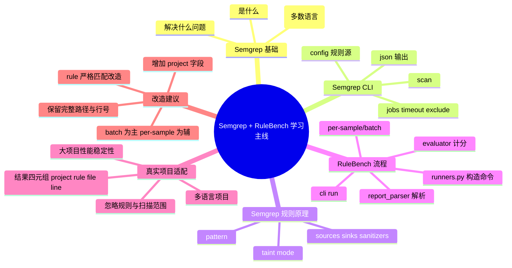

# 记忆卡片摘要（快速复习版）

## 1. 大纲（压缩版）
- Semgrep 是什么：轻量静态分析，基于规则匹配代码结构，官方强调多数语言无需编译构建即可扫描。[来源1]
- Semgrep 怎么跑：核心是 `semgrep scan --config ... <target>`，常见规则包包含 `p/security-audit`。[来源2]
- Semgrep 怎么产出可用结果：JSON 里有 `check_id`、`path`、`start.line`，天然可抽取 `<rule,file,line>`。[来源3]
- RuleBench 怎么对接 Semgrep：`run -> run_sast -> runners.py 命令模板 -> report_parser.py`。
- 当前 RuleBench 对真实项目的核心问题：只按 basename 命中、丢失行号与完整路径、无 project 维度、评估逻辑依赖 benchmark 标签，不能直接用于真实项目告警落库。
- 结论：
  - 运行 Semgrep 的指令思路基本可复用（需改参数）。
  - 结果处理逻辑不能直接复用到真实项目，至少要做“路径+行号+规则ID”的结构化改造。

## 2. 思维导图（Mermaid）


## 3. 重要知识点（必须记住）
- `p/security-audit` 是 Semgrep 官方示例中的规则包之一，RuleBench 当前 Semgrep Runner 就是用它。[来源2][本地1]
- Semgrep JSON 的关键字段有 `check_id`（规则ID）、`path`（文件）、`start.line`（行号），可直接生成告警定位信息。[来源3]
- RuleBench 当前 `Detection` 只有 `example/rule/scanner`，没有 `line`、没有完整 `file path`、没有 `project`，所以天然不满足 `<项目,rule,文件,行号>` 目标。[本地2][本地3]
- RuleBench 命中判定是“文件名命中（basename）优先”，真实仓库里同名文件会冲突。[本地1][本地3]

## 4. 难点 / 易混点
- 易混点1：RuleBench 的“评估命中”与真实项目的“安全告警落库”是两件事。
- 易混点2：`--strict-rule` 在 RuleBench 里是字符串包含匹配，不等于规则ID精确匹配。
- 易混点3：Semgrep 能扫多语言，不代表单个规则包覆盖你要的所有框架/漏洞类型。

## 5. QA 快速复习卡片
- Q: Semgrep 扫 Java/Go/PHP/Python/JS 必须先编译吗？
  A: 官方说明多数语言不需要编译构建即可扫描。[来源1]
- Q: RuleBench 当前能直接产出 `<项目,rule,文件,行号>` 吗？
  A: 不能。当前只保留 `example(文件名)` 和 `rule`，行号与完整路径被丢弃。[本地2][本地3]
- Q: RuleBench 当前 Semgrep 运行命令是否“完全错误”？
  A: 不是。命令可跑 benchmark 场景，但参数与结果处理不适配真实大仓库。
- Q: 多语言真实项目最稳妥的接入方式？
  A: 先用 Semgrep batch 扫仓库输出 JSON，再独立解析为四元组；RuleBench 只保留评估用途。

## 6. 快速复现步骤（最短路径）
1. 进入 SASTBenchmark 根目录：`cd /home/nyn/Desktop/Projects/SAST/SASTBenchmark`
2. 看 RuleBench 的 Semgrep 执行模板：`src/rulebench/runners.py`（第29-35行）。[本地1]
3. 看解析逻辑：`src/rulebench/report_parser.py`（第15-47、96-126行）。[本地3]
4. 对照官方 JSON 字段说明（`check_id/path/start.line`）。[来源3]
5. 按本文“10.2 改造后最小四元组脚本”输出 `<project,rule,file,line>`。

---

# 学习笔记正文（详细版）

## 0. 学习目标、读者画像与假设
- 技术：`Semgrep` + `RuleBench 对接逻辑`
- 学习目标：
  - 了解 Semgrep 的作用、核心原理、CLI 用法。
  - 读懂当前 RuleBench 对 Semgrep 的运行与结果处理流程。
  - 判断该流程是否可直接用于真实开源项目（Java/Go/PHP/Python/JS）。
- 读者水平：初学（按非科班友好写法）。
- 时间预算：标准版（约 3 小时阅读 + 1 小时动手）。
- 版本范围：
  - Semgrep 文档：以 `https://semgrep.dev/docs/` 当前在线文档为准（访问日期：2026-03-04）。
  - RuleBench：本地代码快照。
- 运行环境：当前环境未安装 `semgrep` 命令（已验证）。
- 假设与限制：
  - 无法在本机实际跑 Semgrep 扫描示例；示例命令标记为“未在当前环境实跑”。
  - Mermaid 已在当前环境通过 `npx @mermaid-js/mermaid-cli` 编译验证（本文附验证命令）。

## 1. 背景与用途（从读者视角）
### 1.1 为什么需要 Semgrep
- 你想快速找代码里的安全问题（SQL注入、命令注入、路径穿越等），又不想先把项目完整编译和跑起来。
- Semgrep 的定位是规则驱动静态分析，官方强调可对多数语言直接扫描源代码（无需完整构建）。[来源1]

### 1.2 Semgrep 在 SAST 工程里的位置
- 在 SAST 工具链里，Semgrep 适合：
  - 快速批量扫描
  - 自定义规则
  - CI 阶段把关
- 对比“重编译+深数据流”的工具：Semgrep 上手更快，但复杂跨文件数据流能力取决于规则模式与产品能力边界。[来源6][来源8]

## 2. 核心概念与术语（直白解释）
- 规则（Rule）：告诉 Semgrep “什么代码形态算风险”。
- 规则ID（Rule ID / `check_id`）：每条命中的规则标识，用于归因和统计。[来源3]
- 命中结果（Finding）：一条扫描告警，通常包含规则ID、文件路径、起止位置等。[来源3]
- 污点分析（Taint Analysis）：跟踪“不可信输入 -> 危险调用”这条数据流。Semgrep 的 taint 规则通过 `mode: taint` + sources/sinks/sanitizers 定义。[来源7]
- 规则包（Rule Pack）：预打包规则集合，例如 `p/security-audit`。[来源2]

## 3. 工作原理 / 机制（先直观后严格）
### 3.1 直观版
- 你给 Semgrep 两件事：
  - 要扫描的代码目录
  - 规则来源（规则文件、规则包、registry）
- Semgrep 扫一遍代码，遇到符合规则模式的代码片段就报出来，并在 JSON 里标注“哪条规则、哪个文件、哪一行”。[来源2][来源3]

### 3.2 严格版
- 入口命令：`semgrep scan --config ... <targets>`。
- 扫描控制：`--jobs`（并发）、`--timeout`（单规则/目标超时）、`--exclude`、`--max-target-bytes`、`--max-memory` 等参数用于性能与稳定性控制。[来源2]
- 污点规则机制：
  - `mode: taint`
  - `pattern-sources` 定义输入源
  - `pattern-sinks` 定义危险点
  - `pattern-sanitizers` 定义净化点
  用于表达数据流风险，而不仅是“字符串匹配”。[来源7]

## 4. 核心 CLI / 组件（Semgrep + RuleBench）

### 4.1 Semgrep 官方 CLI 主轴
- 基本命令：
  - `semgrep scan --config p/security-audit <target>`（官方示例之一）。[来源2]
- 多语言支持：官方支持列表覆盖 Java、Go、JavaScript/TypeScript、PHP、Python 等。[来源4]
- JSON 结果字段：`results[].check_id`、`results[].path`、`results[].start.line` 可直接用于告警定位。[来源3]

### 4.2 RuleBench 的 CLI 主轴
- 统一入口：`python -m rulebench.cli run --sast semgrep ...`。[本地4]
- 关键参数：
  - `--scan-mode per-sample|batch`
  - `--workers`
  - `--scanner-command`（覆盖默认命令）
  - `--strict-rule`（规则串匹配）[本地4]

### 4.3 RuleBench 里 Semgrep 的默认命令
- batch 模式默认命令（扫描 examples_root）：
  - `semgrep scan --config p/security-audit ... --jobs 4 --json ... "{examples_root}"` [本地1]
- per-sample 模式默认命令（单样例）：
  - `semgrep scan --config p/security-audit ... --jobs 1 --timeout 30 --json ... "{sample_path}"` [本地1]

## 5. 常见用法与典型场景
### 5.1 典型场景 A：小仓库快速审计
- 命令：
  - `semgrep scan --config p/security-audit --json --output semgrep.json <repo>`（未在当前环境实跑）
- 适合：先摸清“有无明显高危模式”。

### 5.2 典型场景 B：多语言仓库（Java/Go/PHP/Python/JS）
- 一次扫描全仓库，然后统一解析 JSON 抽取四元组。
- 注意：规则覆盖范围取决于你选的 config；`p/security-audit` 并不等于“全部漏洞类型”。[来源2]

### 5.3 典型场景 C：基准评估（RuleBench）
- RuleBench 的目标是 benchmark 计分（TP/FP/FN/TN），不是生产告警系统。[本地5][本地6]

## 6. 最小可运行示例（含预期输出/现象）

### 示例1：Semgrep 最小扫描（官方风格）
- 目标：理解 `scan + config + json output`。
- 前提条件：本机有 `semgrep`。
- 命令（未在当前环境实际验证）：
```bash
semgrep scan --config p/security-audit --metrics=off --json --output semgrep.json ./my_repo
```
- 预期现象：`semgrep.json` 中 `results` 列表出现命中项。
- 关键字段（用于四元组）：`check_id`、`path`、`start.line`。[来源3]
- 常见错误：
  - `semgrep: command not found`
  - 修复：安装 Semgrep 并确认 PATH。

### 示例2：从 Semgrep JSON 抽取 `<project,rule,file,line>`
- 目标：直接落你要的四元组。
- 前提条件：有 `semgrep.json`，格式为 Semgrep 官方 JSON。
- 代码（本地可读，未依赖 Semgrep 二进制）：
```python
import json
from pathlib import Path

project = "my-open-source-repo"
data = json.loads(Path("semgrep.json").read_text(encoding="utf-8"))
for r in data.get("results", []):
    rule = r.get("check_id", "")
    file_path = r.get("path", "")
    line = (r.get("start") or {}).get("line", "")
    print(project, rule, file_path, line, sep="\t")
```
- 预期输出（示意）：
```text
my-open-source-repo	python.lang.security.audit.dangerous-subprocess-use	app/tasks/run.py	42
```
- 常见错误：
  - 某些结果没有 `start.line`（极少数结构异常）
  - 修复：对 `start` 做空值保护。

### 示例3：验证 RuleBench 解析会丢行号（已在本地验证）
- 目标：证明当前 RuleBench 结构不满足四元组。
- 现象：输入含 `path/start.line/check_id` 的 Semgrep JSON，`load_detections` 输出只剩 `Detection(example='a.py', rule='...', scanner='')`。
- 验证依据：本地执行 `PYTHONPATH=src python3` 导入 `load_detections`，结果如上。

## 7. 常见错误与排查路径
### 7.1 “我有告警，但定位不到行号”
- 根因：RuleBench `Detection` 模型不含行号字段。[本地2]
- 排查：看 `models.py` 和 `report_parser.py` 是否保留 `start.line`。[本地2][本地3]

### 7.2 “多语言项目扫描慢、偶发超时”
- 根因：规则多 + 代码大 + 默认参数不合适。
- 排查/优化：调整 `--jobs`、`--timeout`、`--max-target-bytes`、`--max-memory`、`--exclude`。[来源2]

### 7.3 “规则关联不上 benchmark 的 Rule 列”
- 根因：RuleBench `strict-rule` 是字符串包含匹配，benchmark `Rule` 常是 `.yaml` 路径，而 Semgrep 结果一般是 `check_id`。[本地5][本地6][来源3]

### 7.4 “真实项目里同名文件导致命中混乱”
- 根因：RuleBench 基于 basename 比较；真实仓库经常有同名文件（如多个 `index.js`）。[本地1][本地3]

## 8. 最佳实践与边界条件
### 8.1 对 Semgrep 本身（真实项目）
- `必须记住`：
  - 先确认扫描范围（ignore/exclude），避免“没扫到以为没问题”。[来源5][来源2]
  - 输出 JSON 后再做统一归一化，别在 scanner 阶段丢字段。
- `容易踩坑`：
  - 直接套 `p/security-audit` 就当“全覆盖”，通常不够。
- `先知道即可`：
  - taint 规则可表达 source->sink，但规则质量决定效果。[来源7]

### 8.2 对 RuleBench 逻辑
- 适合：benchmark 评估（样例文件唯一、标签齐全）。
- 不适合直接拿去做：生产级告警数据平台（需要 project/path/line/rule 精确结构）。

## 9. 版本差异 / 兼容性说明
- Semgrep 文档是在线持续更新的；本文结论基于 2026-03-04 访问版本。
- RuleBench 代码是本地快照；如后续字段模型改了（例如 Detection 新增 line/path），本结论需要复核。

## 10. RuleBench 对 Semgrep 的流程拆解 + 与官方文档映射

### 10.1 当前流程（你目录中的真实实现）
1. CLI 接收 `run --sast semgrep ...` 参数（scan mode、workers、strict-rule 等）。[本地4]
2. `run_sast` 选 runner 配置，按 `batch` 或 `per-sample` 走不同命令模板。[本地1]
3. Semgrep 命令执行后，读取报告文件，调用 `load_detections`。
4. `load_detections` 解析 JSON/SARIF/XML/TXT，抽取 `(example, rule, scanner)` 去重集合。[本地3]
5. 评估层按样例标签算 TP/FP/FN/TN。[本地5]

### 10.2 关键映射：RuleBench 逻辑 vs Semgrep 官方说明
| RuleBench 点 | 对应官方说明 | 是否一致 | 说明 |
|---|---|---|---|
| `semgrep scan --config ...` | `scan` + `--config` 官方用法 | 一致 | 基础命令模型正确。[来源2][本地1] |
| `--config p/security-audit` | 官方示例含该规则包 | 一致 | 但覆盖面非“所有语言所有漏洞”。[来源2] |
| `--jobs` / `--timeout` | 官方支持并发与超时参数 | 一致 | 参数可调优大仓库稳定性。[来源2] |
| 输出 `--json` | 官方 JSON 字段含 rule/path/line | 部分一致 | RuleBench 解析时把 line/full path 丢了。[来源3][本地3] |
| 命中判定按 basename | 官方并未建议此做法 | 不一致 | 仅适合“单样例单文件”benchmark，不适合真实项目。 |

### 10.3 官方文档章节 -> 本文章节 映射（专门检查）
| 官方章节 | 本文覆盖章节 | 覆盖状态 | 保留的重要例子 |
|---|---|---|---|
| Introduction to Semgrep | 1,3 | 已覆盖 | “多数语言无需编译”要点。[来源1] |
| CLI reference (`semgrep scan`) | 4,6,7 | 已覆盖 | `--config p/security-audit`、`--jobs`、`--timeout`、`--exclude`。[来源2] |
| JSON and SARIF fields | 4,6,10 | 已覆盖 | `check_id/path/start.line` 字段抽取。[来源3] |
| Supported languages | 4 | 已覆盖 | Java/Go/JS/TS/PHP/Python 支持信息。[来源4] |
| Ignoring files/folders/code | 8,11 | 已覆盖 | `.gitignore/.semgrepignore/--exclude` 对扫描范围影响。[来源5][来源2] |
| Taint mode overview | 2,3 | 已覆盖 | `mode: taint`、source/sink/sanitizer 机制。[来源7] |
| Taint syntax | 3 | 已覆盖 | `pattern-sources/pattern-sinks/pattern-sanitizers` 规则结构。[来源7] |
| Intra-file vs Inter-file | 1,11 | 已覆盖 | 解释真实项目跨文件分析边界。[来源8] |

说明：以上章节均已映射；未发现关键章节“完全缺失”。

## 11. 重点问题：当前 RuleBench 逻辑对真实开源项目是否适用？

### 11.1 你给的目标
- 目标结果：`<项目, rule, 文件, 行号>`。
- 场景：Java、Go、PHP、Python、JS 五种语言的真实开源项目。

### 11.2 结论（先给答案）
- **运行指令层面：部分适用。**
  - `semgrep scan --config ... --json` 这条主干是正确的。
- **结果处理层面：当前实现不适用。**
  - 不满足你要的四元组，且会在真实项目产生定位与归因偏差。

### 11.3 分项判断

#### A. 是否需要编译项目？
- 对 Semgrep：官方说明多数语言无需构建即可分析源代码。[来源1]
- 结论：你的五语言场景一般不需要先编译。
- 边界：若你需要编译期类型/字节码语义级能力，应使用其他工具补充。

#### B. 多语言项目是否有语言适配问题？
- Semgrep 支持这些语言。[来源4]
- 但 RuleBench 当前默认单一规则包 `p/security-audit`，[本地1] 对不同语言/框架覆盖不均。
- 结论：能扫，不代表扫得全；应按语言追加规则配置。

#### C. 大型项目的稳定性与性能问题？
- 风险点：
  - 规则多 + 文件大 + 并发不当 -> 超时/内存压力。
- 官方可调参数：`--jobs`、`--timeout`、`--max-target-bytes`、`--max-memory`、`--exclude`。[来源2]
- 结论：RuleBench 默认参数是 benchmark 友好，不是大仓库最优。

#### D. 输出是否可定位 rule 与文件位置？
- Semgrep 原生 JSON：可以（rule/path/line）。[来源3]
- RuleBench 当前解析：不可以完整定位行号，且只保留 basename。[本地3]
- 结论：原始 Semgrep 可以，RuleBench 当前管道不可以。

#### E. 还有哪些关键问题（brainstorm）
- `project` 维度缺失：跨仓库汇总时无法区分同名文件。
- basename 冲突：真实仓库常见 `utils.py`、`index.js` 同名。
- strict-rule 语义偏差：包含匹配会误判。
- 评估逻辑依赖 “bad/good 标签”：真实仓库无该标签，不可直接套 TP/FP/FN/TN。
- 忽略策略差异：`.gitignore/.semgrepignore` 与 CI 路径设置可能导致漏扫。[来源5]

## 12. 面向真实项目的改造方案（最小可落地）

### 12.1 数据结构改造（必须）
- 把 `Detection` 从：`example, rule, scanner`
- 改成至少：`project, rule_id, file_path, line, scanner, severity`（可选列再补）

### 12.2 解析逻辑改造（必须）
- 在 `report_parser.py` 中读取：
  - `check_id`
  - `path`
  - `start.line`
- 不要再 `basename` 截断。

### 12.3 运行模式改造（建议）
- 真实项目优先 `batch` 扫整个仓库。
- `per-sample` 保留给 benchmark 回归测试。

### 12.4 规则匹配改造（建议）
- `strict-rule` 改为“规则ID精确匹配”或规范化映射，而不是 substring。

### 12.5 最小落地流程（推荐）
1. `semgrep scan` 扫仓库输出单个 JSON。
2. 用解析脚本产出四元组 TSV/CSV。
3. 单独做去重、聚合、告警策略（按 rule+file+line）。
4. RuleBench 继续用于“基准评估”，与生产告警管道解耦。

---

# 练习与复习闭环

## 1. 分层练习
### 基础练习
- 解释 `--config`、`--json`、`--output` 各自作用。
- 说出 Semgrep JSON 里 3 个关键字段并说明用途。

### 应用练习
- 给一个仓库路径，写出多语言扫描命令（含 `--jobs` 和 `--exclude`）。
- 将 `semgrep.json` 转成 `<project,rule,file,line>` TSV。

### 综合练习
- 设计“RuleBench -> 真实项目告警平台”迁移方案（字段、流程、性能、质量门禁）。

## 2. 动手任务（带验收标准）
- 任务：在本地实现 `parse_semgrep_to_quadruple.py`。
- 验收标准：
  - 输入 `semgrep.json`，输出 `project,rule,file,line` 四列。
  - 能处理缺失 `start.line` 的记录（不崩溃）。
  - 对同一 `(project,rule,file,line)` 去重。

## 3. 常见误区纠偏
- 误区：RuleBench 分高就代表真实项目扫描质量高。
  正解：RuleBench 是样例集评估，不等于生产告警有效性。
- 误区：Semgrep 扫不到就是没有漏洞。
  正解：可能是规则覆盖、ignore 配置、超时参数导致。

## 4. 复习节奏建议
- Day 1：复盘术语 + 手抄一遍最小命令。
- Day 3：完成四元组解析脚本。
- Day 7：对一个真实小仓库跑完整流程并复盘误报。
- Day 14：补 taint 规则定制，做一次规则调优。

## 5. 自测题与参考答案（简版）
- 题1：为什么说当前 RuleBench 结果解析不适合直接做真实项目告警？
  参考答案：因为丢了完整路径和行号，只按 basename 命中，不满足四元组定位。
- 题2：Semgrep 多语言扫描的核心命令骨架是什么？
  参考答案：`semgrep scan --config <rules> --json --output <file> <repo>`。
- 题3：如果项目很大，先调哪几个参数？
  参考答案：`--jobs`、`--timeout`、`--max-target-bytes`、`--max-memory`、`--exclude`。

---

# 参考来源与版本说明

## 官方来源（优先）
1. [Semgrep Introduction](https://semgrep.dev/docs/introduction) - 访问日期 2026-03-04 - 说明定位与“多数语言无需编译”。
2. [Semgrep CLI Reference (`scan`)](https://semgrep.dev/docs/cli-reference) - 访问日期 2026-03-04 - 说明 `scan` 命令、`--config p/security-audit`、性能参数。
3. [JSON and SARIF fields explored](https://semgrep.dev/docs/semgrep-appsec-platform/json-and-sarif) - 访问日期 2026-03-04 - 说明 `check_id/path/start.line` 等字段。
4. [Supported languages](https://semgrep.dev/docs/supported-languages) - 访问日期 2026-03-04 - 说明语言覆盖。
5. [Ignoring files, folders, and code](https://semgrep.dev/docs/ignoring-files-folders-code) - 访问日期 2026-03-04 - 说明 `.gitignore/.semgrepignore` 与忽略策略。
6. [Rule syntax](https://semgrep.dev/docs/writing-rules/rule-syntax) - 访问日期 2026-03-04 - 规则编写基础。
7. [Taint mode overview](https://semgrep.dev/docs/writing-rules/data-flow/taint-mode/overview) - 访问日期 2026-03-04 - taint 机制与语法入口。
8. [Intra-file analysis and inter-file analysis](https://semgrep.dev/docs/languages/interfile) - 访问日期 2026-03-04 - 分析范围边界。

## 本地来源（RuleBench / Semgrep 样例）
1. `/home/nyn/Desktop/Projects/SAST/SASTBenchmark/src/rulebench/runners.py`（Semgrep runner 默认命令 `29-35`；run 主流程 `381-532`；basename 索引 `445-452`）
2. `/home/nyn/Desktop/Projects/SAST/SASTBenchmark/src/rulebench/models.py`（`Detection` 字段定义 `17-26`）
3. `/home/nyn/Desktop/Projects/SAST/SASTBenchmark/src/rulebench/report_parser.py`（字段抽取 `_extract_issue` `15-47`；JSON 遍历 `_walk_json` `50-132`；最终合并 `203-222`）
4. `/home/nyn/Desktop/Projects/SAST/SASTBenchmark/src/rulebench/cli.py`（`run` 参数定义 `31-57`；执行入口 `140-183`）
5. `/home/nyn/Desktop/Projects/SAST/SASTBenchmark/src/rulebench/dataset.py`（样例读取与字段映射 `14-46`）
6. `/home/nyn/Desktop/Projects/SAST/SASTBenchmark/src/rulebench/evaluator.py`（命中与 strict-rule 判定 `13-25`）
7. `/home/nyn/Desktop/Projects/SAST/SASTBenchmark/data/benchmarks/example/Semgrep/normalized_semgrep_*.csv`（Semgrep benchmark 元数据）
8. `/home/nyn/Desktop/Projects/SAST/SASTBenchmark/data/benchmarks/example/Semgrep/verify_rulebench_semgrep.py`（历史 Semgrep 验证脚本，含规则路径调用 `191-287`）

## 第三方来源（采信程度）
- 本次以官方文档 + 本地代码为主，未额外引入第三方社区教程作为关键结论依据。

## 关键结论引用映射
- [来源1] -> Semgrep 定位、无需编译（多数语言）。
- [来源2] -> `scan` 用法、`--config p/security-audit`、性能参数。
- [来源3] -> 输出字段 `check_id/path/start.line`。
- [来源4] -> 五语言支持事实。
- [来源5] -> 忽略文件机制对扫描范围影响。
- [来源7] -> taint 模式机制与关键语法结构。
- [来源8] -> intra/inter-file 分析边界。
- [本地1..8] -> RuleBench 当前实现细节与适用性判断依据。

## 冲突点与裁决（如有）
冲突点：
- Semgrep 原生输出可定位行号；RuleBench 评估管道中丢失行号与完整路径。

来源A（官方文档）：
- JSON 字段包含 path/start.line/check_id。[来源3]

来源B（本地实现）：
- `Detection` 仅存 `example/rule/scanner`，且路径被 basename 化。[本地2][本地3]

差异原因判断：
- 这是“落地实现裁剪”导致的信息损失，不是 Semgrep 能力缺失。

本笔记采用结论：
- Semgrep 能产出四元组必要字段；当前 RuleBench 解析链路不保留这些字段。

适用条件/例外：
- 若你后续改造 RuleBench parser/model，结论可变化。

## Mermaid 验证记录
- 已执行（2026-03-04）：
```bash
sed -n '/^```mermaid$/,/^```$/p' semgrep-sast-learning-notes.md | sed '1d;$d' > /tmp/mindmap.mmd
npx -y @mermaid-js/mermaid-cli -i /tmp/mindmap.mmd -o /tmp/mindmap.svg
```
- 结果：编译成功（`RC=0`，生成 `SVG_OK`）。
