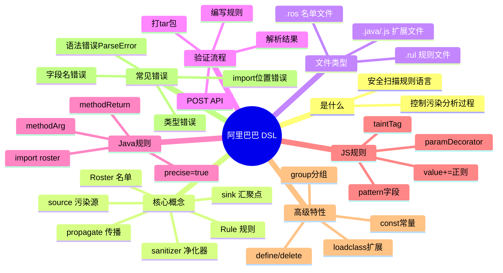

# 阿里巴巴 DSL 规则系统 — 完整学习笔记

> **技术**: 阿里巴巴安全扫描 DSL (Domain Specific Language)
> **学习目标**: 实战 — 能独立编写、调试、验证 Java/JS 污染分析规则
> **读者水平**: 初学（有基本编程基础，不了解 SAST）
> **版本**: API v1.0.0（验证服务 `43.106.136.189:8081`）
> **验证日期**: 2026-04-01
> **运行环境**: Linux + bash + curl

---

# 记忆卡片摘要（快速复习版）

## 1. 大纲（压缩版）

1. 这项技术是什么 — 用配置文件描述"数据从哪来、经过哪、到哪去"的安全扫描规则语言
2. 核心概念 — Rule / Roster / source / sink / sanitizer / propagate / group / loadclass
3. 工作机制 — 写 `.rul`/`.ros` → 打 tar 包 → POST 到验证 API → 返回错误或通过
4. Java 与 JS 的差异 — 字段名不同、匹配方式不同（精确 vs 正则）
5. 最小可运行示例 — 一个 Java Rule、一个 JS Rule、一个 Roster
6. 常见错误与排查 — 语法错误、字段名错误、`import` 位置、`precise` 字段差异
7. 最佳实践 — 文件命名规范、tar 结构、group 用法
8. 练习与复习路径

## 2. 思维导图（Mermaid）



## 3. 重要知识点（必须记住）

- **Java 规则**用 `precise=true` + `value="全限定名"`；**JS 规则**中 source 类字段用 `value+="/正则/"`，sink/sanitizer 用 `pattern+="/正则/"`，两者互斥不可混用 [v01-v19]
- Java 的 `import roster` 必须写在规则体**最前面**（source/sink 之前），否则报 ParseError [imp2✅ imp14❌]。import 是运行时链接机制，Roster 不经 import 无法在 Rule 中生效，relation config 仅保证 verify 通过 [imp9✅]
- **import roster 支持 exclude 语法**: `import roster X exclude GroupName;` 或 `import roster X exclude A,B;` — 可排除 Roster 中的特定 group [真实规则验证]
- JS 规则中 `precise` 字段**不被识别**，会报 `cannot find field by name: precise` [实验验证: exp10, exp11]
- Java 规则中 `paramIndex` 字段**不被识别** [实验验证: f09]
- Java 规则中 `sink.methodReturn` 仅接受字符串语法（block 语法报错）[实验验证: g06❌block, x08✅string]
- `type` 和 `subType` 是 Java 规则的**必填字段**，缺失会报错 [实验验证: exp15]
- `group` 在 Java **Roster 中有效**，在 Java **Rule 中报 ParseError** [实验验证: exp4 失败, f06 通过]
- `group` 在 JS **Roster 中有效**，在 JS **Rule 中报 ParseError** [实验验证: f07 失败, g01 通过]
- Java **支持 loadclass**，通过 `general.userDefinePatternClass += { userDefineClass = loadclass("..."); };` 使用 [configs_v3.3 产品规则验证]。注意 `customSinkFunc`/`customSanitizerFunc` 中不能使用 loadclass [ast13❌]
- `propagate.*` 字段在产品规则中广泛使用，包含 25+ 个子字段（如 `methodObjectToReturn`、`customMethodPropagate`、`bAllPublicMethod` 等）[configs_v3.3 产品规则验证]
- source/sink/sanitizer/general 各有大量子字段（远多于基础实验覆盖范围），详见 §12
- 文件名与 `rule_id` 不匹配会导致 `content is null` 错误 [实验验证: exp13]
- `loadclass()` 用 `=` 赋值（不能用 `+=`），且需要 extend-file 中有对应文件 [实验验证: exp5, f05]

## 4. 难点 / 易混点

| 易混点 | Java | JavaScript |
|--------|------|-----------|
| 匹配方式 | `precise=true/false` + `value` | source 用 `value+="/regex/"`；sink/sanitizer 用 `pattern+="/regex/"` (互斥) |
| source 子字段 | `methodReturn`, `methodArg`, `param_annotation`, `method_annotation`, `method_param`, `expression` + 大量生产环境字段 (见§12) | `methodReturn`, `expression`, `paramDecorator` |
| sink 子字段 | `methodArg`(block), `expression`/`methodReturn`/etc(string) + 大量生产环境字段 (见§12) | `methodArg`（需用 `pattern`，不能只用 `value`） |
| propagate 子字段 | ⚠️ 产品规则中支持 25+ 种子字段 (见§12) | 不支持 |
| loadclass | ⚠️ 支持！通过 `general.userDefinePatternClass` (见§12) | Roster 中 `= loadclass(...)` |
| group 位置 | 仅 Roster | 仅 Roster |
| import 位置 | 必须在规则体最前面（运行时链接），支持 `exclude` | 同 Java |
| 扩展文件类型 | `.java` (evaluate 方法模式) | `.js` |

## 5. QA 快速复习卡片

- **Q**: DSL 规则文件的扩展名是什么？
  **A**: 规则文件 `.rul`，名单文件 `.ros`

- **Q**: 验证 API 支持哪些语言？
  **A**: `java` 和 `javascript`（不支持 python、go 等）

- **Q**: Java 规则中 source 和 sink 最常用的子字段是什么？
  **A**: `source.methodReturn`（方法返回值）和 `sink.methodArg`（方法参数）

- **Q**: JS 规则中 source.methodReturn 的正确写法？
  **A**: `source.methodReturn += { value += "/正则表达式/"; };`（不能用 `precise`）

- **Q**: `import roster` 应该写在规则体的什么位置？
  **A**: 必须写在最前面，source/sink 等字段之前。import 是运行时链接机制，没有 import 则 Roster 不在 Rule 中生效

- **Q**: 如何复用配置？
  **A**: 用 Roster（.ros 文件）定义可复用配置集，在 Rule 中用 `import roster 名单名` 引入（运行时生效），同时配合 `relation/config_roster_relation.json` 确保 verify 通过

## 6. 快速复现步骤（最短路径）

1. 创建目录：`mkdir -p my-config/rosters`
2. 写规则文件：`my-config/30001.rul`
3. 打包：`tar -cf config.tar -C my-config 30001.rul rosters`
4. 构造 multipart payload 并用 `curl --data-binary` POST 到验证 API
5. 检查响应：`output` 为 `[]` 表示通过，否则查看错误信息

---

# 学习笔记正文（详细版）

## 0. 学习目标、读者画像与假设

- **技术**: 阿里巴巴安全扫描 DSL 规则系统
- **学习目标**: 能独立编写 Java/JS 污染分析规则，通过 API 验证，理解错误信息并调试
- **读者水平**: 有编程基础，了解基本 Web 安全概念（如 XSS、SQL 注入），不了解 SAST 工具内部原理
- **时间预算**: 3 小时
- **版本范围**: API v1.0.0
- **运行环境**: Linux + bash + curl（需要网络访问验证服务）
- **假设与限制**: 验证 API 在 `43.106.136.189:8081` 可用；PDF 文档中的部分语法（如 Go 规则）当前 API 不支持验证

## 1. 背景与用途（从读者视角）

### 1.1 这项技术解决什么问题

想象你是一个安全工程师，需要扫描公司的 Java 或 Node.js 项目，找出其中的安全漏洞（比如 SQL 注入、XSS、命令注入）。传统做法是手动审计代码或写复杂的检测程序，成本极高。

**污染分析（Taint Analysis）** 是一种自动化方法：它追踪"不可信数据"从进入程序（**源 source**）到达危险操作（**汇 sink**）的路径。如果数据在途中没有被净化（**sanitizer**），就标记为漏洞。

阿里巴巴 DSL 就是用来**配置这个追踪过程**的专用语言。你不需要写 Java/JS 检测代码，只需要用 DSL 声明：
- **源（source）**: 哪些方法返回不可信数据（如 `request.getParameter()`）
- **汇（sink）**: 哪些方法调用是危险的（如 `Runtime.exec()`、`res.send()`）
- **净化器（sanitizer）**: 哪些方法能清除污染（如 `escapeHtml()`）

### 1.2 不用它会怎样

- 手动为每种漏洞类型编写检测逻辑，代码量大、维护困难
- 难以统一管理数百条规则，新增或修改规则需要重新开发
- 不同安全工程师的配置格式不统一，协作困难

### 1.3 典型应用场景

- 企业内部 SAST（静态应用安全测试）平台的规则配置
- 新增漏洞类型时快速定义检测规则
- 在不同项目/平台间复用通用的 source/sink 配置（通过 Roster）

## 2. 核心概念与术语（直白解释）

### 2.1 污染分析基本概念

- **污染分析（Taint Analysis）**: 追踪不可信数据在程序中的流动路径。如果不可信数据未经净化就到达危险操作，就认为存在漏洞。
- **源（Source）**: 不可信数据的入口点。例如：`request.getParameter("input")` 返回用户输入，这就是一个 source。
- **汇（Sink）**: 可能产生安全问题的危险操作。例如：`Runtime.exec(cmd)` 执行系统命令，如果 `cmd` 来自用户输入且未净化，就是命令注入漏洞。
- **净化器（Sanitizer）**: 能消除数据中危险内容的操作。例如：`escapeHtml(input)` 转义 HTML 特殊字符，使数据不再构成 XSS 威胁。
- **传播（Propagate）**: 描述数据如何在方法调用间传递。例如：`json.Unmarshal(data, &obj)` 将 data 的污染传递给 obj。
- **入口（Entrance）**: 程序分析的起点，通常是 Web 请求处理方法。

### 2.2 DSL 特有概念

- **Rule（规则）**: 定义一条完整的检测规则，包含漏洞类型、source、sink、sanitizer 等全部配置。保存为 `.rul` 文件。
- **Roster（名单/配置集）**: 定义一组可复用的配置（如通用 source 列表），可被多个 Rule 引入。保存为 `.ros` 文件。
- **AbstractTaintRule**: 所有污染分析规则的基类，Rule 必须 `extends AbstractTaintRule`。
- **group（分组）**: 在 Roster 中针对不同平台定义特定配置。例如针对 express、koa、egg 等框架分别定义不同的 source。
- **loadclass（加载自定义类）**: 当 DSL 内置语法无法表达的检测逻辑时，可通过 `loadclass()` 加载自定义 Java/JS 代码。
- **define（定义变量）**: 在规则体内定义局部变量，可被后续配置引用。
- **delete（删除配置）**: 删除从父规则继承的某个配置项。
- **const（常量）**: 在规则文件顶部定义常量，规则体内引用。
- **modifiable（可修改声明）**: 声明某个配置项可以被子规则修改。

## 3. 工作原理 / 机制

### 3.1 直观版：从编写到验证的完整流程

```
编写 .rul/.ros 文件
       ↓
组织目录结构（含 rosters/、extend-file/ 等）
       ↓
打 tar 包（标准 tar 格式，不能是 tar.gz 或 zip）
       ↓
POST 到验证 API（multipart/form-data）
       ↓
API 解压 → 解析 DSL 语法 → 语义检查
       ↓
返回 JSON 结果（output 为空=通过，非空=有错误）
```

### 3.2 严格版：DSL 语法解析模型

DSL 基于 **JavaCC**（Java Compiler Compiler）实现词法和语法解析。语法规则的 BNF（巴科斯范式）定义如下 [来源1]：

```
RuleScript    ::= (ConstDeclaration)* RuleDeclaration (UserDefineDeclaration)* <EOF>
ConstDeclaration ::= "const" <IDENTIFIER> "=" StringValue ";"
RuleDeclaration  ::= "Rule" <IDENTIFIER> ("(" params ")")? ("extends" <IDENTIFIER>)? "{" RuleBody "}"
RuleBody      ::= (ImportDeclaration)* ConfigurationList
ImportDeclaration ::= "import" <IDENTIFIER> ("exclude" <IDENTIFIER> ("," <IDENTIFIER>)*)? ";"
Configuration ::= <IDENTIFIER> ("=" | "+=") (RightValue | "{" SubConfigurationList "}") ";"
                 | "delete" <IDENTIFIER> ";"
```

**关键语法要点**（`必须记住`）：
1. `=` 是**赋值**（覆盖已有值），`+=` 是**追加**（与已有值合并）
2. `type` 和 `subType` 只支持 `=`，不支持 `+=`
3. `import` 声明必须在 `ConfigurationList`**之前**（这是语法规则强制的）— import 是 Roster 的运行时链接机制，不可省略
4. 每条语句以 `;` 结尾
5. 支持单行注释 `//` 和多行注释 `/* */`

### 3.3 验证 API 架构

**请求**:
```
POST http://43.106.136.189:8081/api/v1/verify
Content-Type: multipart/form-data
```

**必填参数**:

| 参数 | 类型 | 说明 |
|------|------|------|
| `file` | File | tar 格式压缩包 |
| `language` | String | `java` 或 `javascript` |
| `verify_type` | String | `rule` 或 `roster` |
| `rule_id` | Integer | 当 `verify_type=rule` 时必填 |
| `roster_name` | String | 当 `verify_type=roster` 时必填 |

**响应格式**:
```json
{
  "code": 0,
  "message": "success",
  "data": {
    "output": "[]或错误JSON数组",
    "execution_time_ms": 500
  }
}
```

`output` 为空字符串或 `[]` 表示验证通过。非零 `code` 表示请求级错误（如缺少参数）。

## 4. 核心语法 — Java 规则

### 4.1 最小 Java Rule 结构

```java
Rule 规则名 extends AbstractTaintRule {
    type = "漏洞大类";        // 必填，如 "SQLi", "Xss", "CommandInjection"
    subType = "漏洞子类";      // 必填，如 "SQLInjection", "XssTs"
    
    source.methodReturn += {    // 方法返回值作为 source
        precise = true;         // true=精确匹配全限定名, false=正则匹配
        value = "com.example.Source.getData";
    };
    
    sink.methodArg += {         // 方法参数作为 sink
        precise = true;
        value = "com.example.Sink.execute";
    };
}
```

**实验验证**: exp1 — 上述结构验证通过，`output=[]` ✅

### 4.2 Java source 可用子字段

| 子字段 | 说明 | 语法 | 验证状态 |
|--------|------|------|---------|
| `source.methodReturn` | 方法返回值是 source | `+= { precise; value; }` | exp1 ✅ |
| `source.methodArg` | 方法参数是 source | `+= { precise; value; }` | g04 ✅ |
| `source.param_annotation` | 带特定注解的参数是 source | `= "注解全限定名"` 或 `+= "..."` | w01b✅ w02b✅ |
| `source.method_annotation` | 带特定注解的方法是 source | `= "注解全限定名"` 或 `+= "..."` | w03b✅ w04b✅ |
| `source.method_param` | 满足条件的方法参数 | `= "类.方法[参数索引]"` 或 `+= "..."` | w05b✅ w06b✅ |
| `source.expression` | 表达式匹配 | `= "类.方法"` 或 `+= "..."` | w08b✅ w09b✅ |

> **关键发现 [w01b-w10b]**: `param_annotation`、`method_annotation`、`method_param`、`expression` 四个字段只接受**直接字符串赋值** (`=` 或 `+=` + 字符串)，**不接受块语法** (`+= { ... }`)。用块语法会报 `custom define config: source.X can only be string value` [w07b❌, w10b❌, s10❌, s11❌, s15❌]。

> **Roster 专属**: 这四个字段只能在 Roster 中使用，不能在 Rule 中使用（即使加 `modifiable` 声明也不行）。Rule 中使用会报 `configure is not modifiable in parent rule` [w11❌-w14❌, w22❌-w25❌]。

**Roster 中的用法示例**:
```java
Roster Java_annotation_source {
    // 带 @RequestParam 注解的参数视为 source
    source.param_annotation = "org.springframework.web.bind.annotation.RequestParam";
    // 带 @GetMapping 注解的方法的参数视为 source
    source.method_annotation += "org.springframework.web.bind.annotation.GetMapping";
    // 指定方法的第 0 个参数
    source.method_param = "com.example.Controller.handleRequest[0]";
    // 表达式匹配
    source.expression = "com.example.Config.getProperty";
}
```

> `容易踩坑`: `source.nonExistentField` 会报错 `custom define config: xxx can only be string value` [exp6]

### 4.3 Java sink 可用子字段

Java sink 实际支持 **7 个子字段**，分为 block 语法和 string 语法两类（均仅限 Roster）：

**Block 语法**（`+= { precise; value; }`）：

| 子字段 | 说明 | 验证 |
|--------|------|------|
| `sink.methodArg` | 方法参数作为 sink（最常用） | exp1 ✅, x38❌string, x39❌string |

**String 语法**（`= "str"` 或 `+= "str"`）：

| 子字段 | 说明 | 验证 |
|--------|------|------|
| `sink.expression` | 表达式匹配 | x01✅ `=`, x02✅ `+=`, x03❌block |
| `sink.param_annotation` | 注解匹配 | x04 ✅ |
| `sink.method_annotation` | 方法注解匹配 | x05 ✅ |
| `sink.method_param` | 方法参数匹配 | x06 ✅ |
| `sink.methodReturn` | 方法返回值匹配（⚠️ 仅 string 语法！block 语法报错） | x08✅, y15✅, x07❌block |
| `sink.customSinkFunc` | 自定义 sink 函数（Roster 用 string [x09✅]；⚠️ `customSinkFunc` 中不能使用 loadclass [ast13❌]，Java loadclass 通过 `general.userDefinePatternClass` 实现） | x09✅string, x10❌roster-loadclass, ast13❌rule-loadclass |

> `重要发现`: `sink.methodReturn` 仅接受 **string 语法** `= "str"` [x08✅]，**block 语法** `+= { value = ... }` 会报错 [x07❌]
> `容易踩坑`: `sink.methodArg` 不支持 `paramIndex` 字段 [f09]

### 4.4 Java sanitizer 可用子字段

Java sanitizer 实际支持 **7 个子字段**，分为 block 语法和 string 语法两类（均仅限 Roster）：

**Block 语法**（`+= { value; }` 或 `+= { precise; value; }`）：

| 子字段 | 说明 | 验证 |
|--------|------|------|
| `sanitizer.methodReturn` | 方法返回值净化 | exp2✅, g05✅, x40❌string |
| `sanitizer.methodArg` | 方法参数净化 | x18✅block, x19❌string |

**String 语法**（`= "str"` 或 `+= "str"`）：

| 子字段 | 说明 | 验证 |
|--------|------|------|
| `sanitizer.expression` | 表达式匹配 | x11✅ `=`, x12✅ `+=` |
| `sanitizer.param_annotation` | 注解匹配 | x13 ✅ |
| `sanitizer.method_annotation` | 方法注解匹配 | x14 ✅ |
| `sanitizer.method_param` | 方法参数匹配 | x15 ✅ |
| `sanitizer.customSanitizerFunc` | 自定义净化函数（仅 string 赋值 [x17✅]，loadclass 不可用 [x16❌]，Java loadclass 通过 `general.userDefinePatternClass` 实现） | x17✅string, x16❌loadclass |

> `重要发现`: Java 中 `sanitizer.methodReturn` 和 `sanitizer.methodArg` 只接受 **block 语法**，string 语法会报 `value should be complex type` [x40❌, x19❌]

### 4.5 Java 高级特性

#### import roster — 运行时引入名单（必需）

**`import roster X;`** 是 Rule 引入 Roster 的**运行时链接机制**。Roster 中定义的 source/sink/sanitizer 只有通过 import 才能在 Rule 中实际生效。`relation/config_roster_relation.json` 仅是 **verify 阶段的文件发现机制**，保证语法验证能找到 Roster 文件，但不等于运行时链接。

> ⚠️ **核心区分**: relation config 仅保证 verify 通过（语法正确），import 才是运行时生效的链接。两者缺一不可。

**import 机制实验总结 [w15-w21, imp1-imp15]**:

| 条件 | 结果 | 说明 |
|------|------|------|
| `import roster X;` 在 Rule 体最前面 + relation config | ✅ [w16, imp2, imp8, imp11] | **正确用法** |
| `import roster X;` 在文件顶层（Rule 外） | ❌ ParseError [imp1, imp5, imp6] | import 只能在 Rule body 内 |
| `import roster X;` 在其他字段之后 | ❌ ParseError [imp14, imp15] | 必须在所有字段之前 |
| `import roster X;` 无 relation config | ❌ cannot find roster [imp3, imp12] | verify 需要 relation 定位文件 |
| `import roster 错误名;` + relation config | ❌ cannot find roster [imp4, imp10] | import 用声明名不用文件名 |
| `import Src;` (缺 roster 关键字) | ❌ ParseError [imp7] | 语法要求 `import roster X;` |
| 无 import + relation config | ✅ verify 通过 [imp9, w18] | ⚠️ verify 通过但 Roster 运行时不生效! |
| 多个 import 连续写 | ✅ [imp11] | 可同时引入多个 Roster |

**关键发现**:
1. `import roster` 引用的是 Roster 的**声明名**（`.ros` 文件内 `Roster X` 中的 `X`），不是文件名 [imp10❌]
2. `import roster` 必须在 Rule 体**最前面**，所有其他字段之前（BNF 语法强制）[imp2✅ imp14❌]
3. 多个 import 可以连续写在开头 [imp11✅]
4. `relation/config_roster_relation.json` 仅保证 verify 时能找到 Roster 文件 [imp9✅ verify通过但无import则Roster不生效]
5. 没有 import 的 Rule，即使 verify 通过，Roster 的定义也**不会在运行时生效**
6. Rule 中的内联定义与 Roster 的定义**可以共存** [w21✅]

**标准做法: import + relation config 同时使用**:
```java
// 70001.rul — Rule 引入 Roster
Rule SSRFEntry extends AbstractTaintRule {
    import roster Java_common_source;  // 运行时引入 Roster
    type = "SSRF";
    subType = "SSRFHook";
}
```
```json
// relation/config_roster_relation.json — verify 阶段文件发现
{ "70001": ["Java_common_source_0"] }
```

**relation config 命名约定**: `{"rule_id": ["RosterFilename_0"]}`。verify API 不校验 relation 中的名称 [w30-w33 均✅]，但按惯例使用 `.ros` 文件名（不含扩展名）。

#### define — 定义局部变量

```java
Rule DefineTestRule extends AbstractTaintRule {
    type = "Test";
    subType = "DefineTest";
    define mySource = "com.example.Source.get";
    source.methodReturn += {
        precise = true;
        value = mySource;     // 引用变量
    };
}
```
**实验验证**: f10 ✅

#### delete — 删除继承配置

```java
Rule DeleteTestRule extends AbstractTaintRule {
    type = "Test";
    subType = "DeleteTest";
    source.methodReturn += { precise = true; value = "com.example.Source.get"; };
    delete source.methodReturn;   // 删除上面添加的配置
}
```
**实验验证**: f11 ✅

#### const — 文件级常量

```java
const MY_SOURCE = "com.example.Source.get";
Rule ConstTestRule extends AbstractTaintRule {
    type = "Test";
    subType = "ConstTest";
    source.methodReturn += { precise = true; value = MY_SOURCE; };
    sink.methodArg += { precise = true; value = "com.example.Sink.exec"; };
}
```
**实验验证**: h06（API 未返回响应，待后续验证）

#### modifiable — 可修改声明

```java
Rule ModifiableTestRule extends AbstractTaintRule {
    type = "Test";
    subType = "ModTest";
    modifiable source.methodReturn;
    source.methodReturn += { precise = true; value = "com.example.Source.get"; };
}
```
**实验验证**: g07 ✅

#### loadclass — 加载自定义类

**⭐ 关键**: Ali DSL **直接构建在 PMD 框架之上**。loadclass Java 扩展使用 `net.sourceforge.pmd.*` AST API（17 种节点类型、11 种遍历方法、XPath 查询）+ `com.taobao.stc.pmd.*` 污点扩展 API（addTaintedVariable/addSafeVariable/isVariableMayTainted/addEdgeToGraph 等）。

纯 DSL Rule+Roster **没有通用的** AND/OR/NOT 复合逻辑，也没有 Semgrep 那种通用 `patterns` / `pattern-inside` 机制；但它**并非完全没有上下文能力**：少数字段可在自身作用域内通过 XPath 谓词表达局部上下文约束，例如：

- `general.entranceFileXpath`：编译单元 / 文件级上下文过滤
- `source.methodParam += { xpath = "..."; }`：形参节点级上下文过滤
- `general.methodRedirect += { value = "..."; xpath = "..."; }`：特定入口上的值 + 局部 XPath 联合约束

因此更准确的边界是：**纯 DSL 可以做有限的、字段内的局部 AND / 上下文过滤，但不能做通用的多 pattern 布尔组合、任意节点间的 pattern-inside、跨多个独立语法点的联合匹配，也不能稳定匹配实参字面量值**。生产规则中 11 个 Rule 目录的 87 个 Java 扩展文件，正是在补这些纯 DSL 无法覆盖的复杂逻辑。详细 PMD API 参考见 `alibaba-dsl-skill/references/java-syntax.md`。

Java 支持 loadclass，但使用路径与 JS 不同。

**正确用法 (Java)**: 通过 `general.userDefinePatternClass` 或 `general.userDefineEntranceClass` 字段使用 loadclass：

```java
// ✅ 正确 — Java 中通过 general.userDefinePatternClass 使用 loadclass
Roster Java_ssrf_propagate {
    general.userDefinePatternClass += {
        userDefineClass = loadclass("com.taobao.customrule.SSRFCustomPropagate");
    };
    general.userDefineEntranceClass += {
        userDefineClass = loadclass("com.taobao.customrule.CarryEntrance");
    };
}
```

```java
// ✅ 正确 — Rule 中也可使用
Rule URLRedirectEntry extends AbstractTaintRule {
    import roster Java_common_source;
    type = "URLRedirect";
    subType = "URLRedirectHook";
    general.userDefinePatternClass += {
        userDefineClass = loadclass("com.taobao.customrule.FilterSource");
    };
}
```

**错误用法 (Java)**: 通过 `customSinkFunc`/`customSanitizerFunc` 使用 loadclass → 不可用 [ast13❌]：
```java
// ❌ 错误 — customSinkFunc 中 loadclass 不可用
sink.customSinkFunc = loadclass("ExtendTestRule.customSink_0");  // 报 "can only be string value"
```

**说明**: `customSinkFunc`/`customSanitizerFunc` 中的 loadclass 不可用 [ast13❌, x10❌, x16❌]。Java loadclass 的正确入口是 `general.userDefinePatternClass`，这是两个完全不同的机制。

**Java loadclass 实现文件** 放在 `extend-file/{rule_id}/ClassName.java`，标准模式：
```java
public class SSRFCustomPropagate {
    public static Boolean evaluate(JavaNode treenode,
                                   AbstractTaintedDataRule rule,
                                   AbstractTaintedDataRuleData data) {
        // 1. AST 节点检查 (方法声明/编译单元/注解)
        // 2. 污染标记 (addTaintedVariable, addTraceEdge)
        // 3. 返回 false (继续规则链)
        return false;
    }
}
```

**JS loadclass** 目前只在 `source.customSourceFunc` 上确认，且 `=` / `+=` 两种写法都能通过 verify [g11✅ jsgap01✅ jsgap03✅]；`sink.customSinkFunc` / `sanitizer.customSanitizerFunc` 在 JS 中是 **string 字段**，`loadclass(...)` 会报 `can only be string value` [jsgap04❌ jsgap06❌]。

## 5. 核心语法 — JavaScript 规则

### 5.1 最小 JS Rule 结构

JS 规则与 Java 规则**语法骨架相同**，但内部字段和匹配方式有重要差别：

```javascript
Rule XssTs_6993 extends AbstractTaintRule {
    type = "Xss";
    subType = "XssTs";
    source.methodReturn += {
        value += "/\\b(this|ctx|app)\\.getQuery\\b|\\breq\\.query\\b/";
    };
    sink.methodArg += {
        pattern += "/\\bres\\.send\\b|\\bres\\.write\\b/";
    };
}
```

**实验验证**: f03 ✅

> `必须记住`: JS 规则中 **不能用 `precise` 字段**，会报 `cannot find field by name: precise` [exp10, exp11]

### 5.2 JS 规则 value 与 pattern 的语义（v01-v19 实验验证）

**核心规则**: `value` 和 `pattern` 是按字段类型分离的互斥属性，不可混用、不可共存。

| 字段类型 | 必须用 | 不能用 | 验证 |
|---------|--------|--------|------|
| `source.methodReturn` | `value` | `pattern` ❌ | v01✅ v02❌ v03❌ |
| `source.expression` | `value` | `pattern` ❌ | v10✅ v11❌ v12❌ |
| `source.paramDecorator` | `value` | `pattern` ❌ | v13✅ v14❌ |
| `sink.methodArg` | `pattern` | `value` ❌ | v04✅ v05❌ v06❌ |
| `sanitizer.methodReturn` | `pattern` | `value` ❌ | v08✅ v07❌ v09❌ |

**语义解读**（`必须记住`）：
- **`value`** = 声明「数据是什么」— source 端专属，描述哪些 API 产生污点数据
- **`pattern`** = 声明「匹配什么模式」— sink/sanitizer 端专属，描述哪些调用消费/清洗污点
- 两者底层都用正则表达式 (`"/regex/"`），但属于不同 schema 字段，**不可互换**
- `=` 和 `+=` 均可 [v15✅ v16✅ v17✅]，`+=` 用于追加多个正则
- 可与 `taintTag`/`paramIndex` 组合 [v18✅ v19✅]
- 在同一块中同时写 `value` 和 `pattern` 会报 `cannot find field` [v03❌ v06❌ v09❌ v12❌]

### 5.3 JS source 可用子字段

| 子字段 | 说明 | 内部字段 | 验证 |
|--------|------|----------|------|
| `source.methodReturn` | 方法返回值 | `value` | f03 ✅, v01 ✅ |
| `source.expression` | 表达式匹配 | `value`, `taintTag`(可选) | exp17 ✅, g08 ✅ |
| `source.paramDecorator` | 参数装饰器 | `value` | exp16(需 pattern), g09 ✅ |
| `source.customSourceFunc` | 自定义函数 | `loadclass(...)`（`=` / `+=` 均可；plain string 不可） | g11 ✅, jsgap01 ✅, jsgap03 ✅, jsgap17 ✅, jsgap02❌, jsgap16❌ |

### 5.4 JS sink 可用子字段

JS sink 实际支持 **9 个子字段**（均仅限 Roster），block 语法只有 `methodArg`，其余全用 string 语法：

**Block 语法**（`+= { pattern; paramIndex; taintTag; }`）：

| 子字段 | 说明 | 内部字段 | 验证 |
|--------|------|----------|------|
| `sink.methodArg` | 方法参数 | `pattern`(必填), `paramIndex`, `taintTag` | g03 ✅, y01❌string |

**String 语法**（`= "str"` 或 `+= "str"`）：

| 子字段 | 说明 | 验证 |
|--------|------|------|
| `sink.expression` | 表达式匹配 | y02✅ `=`, y03✅ `+=`, x20❌block, x21❌block |
| `sink.methodReturn` | 方法返回值匹配 | y04 ✅, x22❌block |
| `sink.paramDecorator` | 参数装饰器匹配 | y05 ✅, x23❌block |
| `sink.param_annotation` | 注解匹配 | y06 ✅ |
| `sink.method_annotation` | 方法注解匹配 | y07 ✅ |
| `sink.method_param` | 方法参数匹配 | y08 ✅ |
| `sink.functionArg` | 函数参数匹配 | jsgap12✅ `=`, jsgap27✅ `+=`, jsgap08❌block |
| `sink.customSinkFunc` | 自定义 sink 函数名（⚠️ JS 中是 string，不是 loadclass） | jsgap05✅ `=`, jsgap14✅ `+=`, jsgap04❌loadclass |

> `重要发现`: JS sink 的 string 字段不接受 block 语法 [x20-x25 全❌, jsgap08❌]，只有 `sink.methodArg` 用 block
> `容易踩坑`: `sink.methodArg` 不接受 string 语法 [y01❌]，必须用 block + `pattern`

### 5.4.1 JS sanitizer 可用子字段

JS sanitizer 支持 **8 个子字段**（均仅限 Roster），语法分布与其他角色不同：

**Block 语法**（`+= { pattern; }`）：

| 子字段 | 说明 | 内部字段 | 验证 |
|--------|------|----------|------|
| `sanitizer.methodReturn` | 方法返回值净化 | `pattern`(必填) | z02 ✅, y09❌string |

**String 语法**（`= "str"`）：

| 子字段 | 说明 | 验证 |
|--------|------|------|
| `sanitizer.expression` | 表达式匹配 | y10 ✅, x26❌block |
| `sanitizer.methodArg` | 方法参数净化（⚠️ JS 中是 string 语法！与 Java 相反） | y11✅, z01❌block, z03❌block |
| `sanitizer.paramDecorator` | 装饰器净化（⚠️ JS 中是 string 语法） | jsgap13✅ `=`, jsgap28✅ `+=`, jsgap09❌block |
| `sanitizer.param_annotation` | 注解匹配 | y12 ✅ |
| `sanitizer.method_annotation` | 方法注解匹配 | y13 ✅ |
| `sanitizer.method_param` | 方法参数匹配 | y14 ✅ |
| `sanitizer.customSanitizerFunc` | 自定义净化函数名（⚠️ JS 中是 string，不是 loadclass） | jsgap07✅ `=`, jsgap15✅ `+=`, jsgap06❌loadclass |

> `必须记住`: JS `sanitizer.methodArg` 是 **string 语法**（`= "str"`），block 语法报 `simple type` 错误 [z01❌, z03❌]。这与 Java 中 `sanitizer.methodArg` 必须用 **block 语法** 完全相反！
> `必须记住`: JS `sanitizer.methodReturn` 是 **block 语法**（用 `pattern`），string 语法报 `complex type` 错误 [y09❌]

### 5.4.2 expression 子字段语义解析

`expression` 是 source/sink/sanitizer 三种角色均可使用的**通用 string 字段**，Java 和 JS 均支持。

**Java 中的 expression**：
- 接受任意字符串格式：完全限定方法名、类名、简单名、通配符均可 [x30-x33 全✅]
- 使用 `= "str"` 或 `+= "str"` 语法
- **不需要 block 包裹**，block 语法报错 [x03❌]

**JS 中的 expression**：
- 接受正则表达式字符串 `= "/regex/"` [v10✅]
- source.expression 用 `value` 字段（block 模式时），sink/sanitizer 直接用 string 赋值

**expression 与 methodReturn/methodArg 的关系**：
- expression 可以与 methodReturn、methodArg **共存于同一 Roster** [y19✅, y20✅, y21✅, y22✅, y23✅]
- expression 是更宽泛的匹配机制，methodReturn/methodArg 是精确到方法签名级别的匹配

**共存示例**（Java Roster，y21 验证✅）：
```java
Roster AllSinkTypes {
    sink.methodArg += { precise = true; value = "com.example.Sink.exec"; };
    sink.expression = "com.example.Sink.evaluate";
    sink.param_annotation = "javax.inject.Inject";
    sink.method_annotation = "org.spring.PostMapping";
    sink.method_param = "com.example.Sink.process[0]";
    sink.methodReturn = "com.example.Sink.getResult";
    sink.customSinkFunc = "com.example.Sink.custom";
}
```

### 5.5 JS 特有：taintTag（污染标签）

用于区分不同类型的污染流，使 source 和 sink 通过标签精确匹配：

```javascript
Rule JsExprTagRule extends AbstractTaintRule {
    type = "SQLi";
    subType = "SQLiTs";
    source.expression += {
        taintTag = "taint_tag_sql";
        value += "/ctx\\.sql$/";
    };
    sink.methodArg += {
        pattern += "/\\bmysql\\.query$/";
        paramIndex = 0;
        taintTag = "taint_tag_sql";    // 与 source 的 tag 匹配
    };
}
```

**实验验证**: exp17 ✅（expression + taintTag）

### 5.6 JS Roster 与 loadclass

JS Roster 的语法与 Java Roster 相同，但内部字段遵循 JS 规则：

```javascript
Roster NodeJS_custom_func {
    source.customSourceFunc += loadclass("NodeJS_custom_func.customSourceFunc_0");
}
```

对应 JS 文件放在 `extend-file/rosters/NodeJS_custom_func_0/NodeJS_custom_func.js`：
```javascript
let rule = {};
module.exports.rule = rule;
rule.customSourceFunc_0 = (rule, node, context) => {
    return false;
};
```

**实验验证**: g11 ✅, jsgap01 ✅, jsgap03 ✅, jsgap10 ✅, jsgap17 ✅

> `必须记住`: JS `source.customSourceFunc` 是 **class-type 字段**，`loadclass(...)` 可用 `=` 或 `+=`；plain string 会报 `the value should be class type` [jsgap02❌, jsgap16❌]。
>
> `必须记住`: JS `sink.customSinkFunc` / `sanitizer.customSanitizerFunc` 是 **string 字段**，不是 loadclass 入口；`= "str"` 和 `+= "str"` 都通过 [jsgap05✅, jsgap07✅, jsgap14✅, jsgap15✅]，`loadclass(...)` 会报 `can only be string value` [jsgap04❌, jsgap06❌]。

### 5.6.1 JS `general.*` 的 verify 宽松边界（jsgap18-jsgap28）

这一轮补实验发现，JS 顶层 Roster 中的 `general.*` 语法**不能像 Java 那样直接按 verify 通过去推断字段真实存在**：

- `general.scanAllFiles = "true"`、`general.desc = "rule description"`、`general.polyHandleNum = "1"` 都通过 [jsgap18✅ jsgap19✅ jsgap24✅]
- 甚至 `general.notARealField = "x"` 也通过 [jsgap21✅]
- 但 bare bool/int 会失败：`general.scanAllFiles = true`、`general.polyHandleNum = 1` 均报 `can only be string value` [jsgap11❌, jsgap25❌]
- `group` 内部不接受 `general.*`：`group {... general.scanAllFiles = "true"; }` 报 `cannot find config by name or cannot define custom config in group` [jsgap26❌]

**当前结论**：JS `general.*` 在顶层 Roster 上对 string / `+=` string 呈现出**非常宽松的 verify 行为**，因此只能说“字符串形态会被解析接受”，不能把某个具体字段名的 verify-pass 单独当作运行时能力证明。

### 5.7 DSL 能力边界：仅 Taint 分析，无独立 AST Grep

**实验总结 [ast1-ast13]**:

**唯一基类**: `AbstractTaintRule` 是语法要求的唯一基类（`extends` 是必须关键字）：
- `AbstractRule` → ❌ `cannot find parent rule` [ast1]
- `AbstractPatternRule` → ❌ `cannot find parent rule` [ast2]
- `AbstractStructRule` → ❌ `cannot find parent rule` [ast3]
- 无 `extends` → ❌ `ParseError: expecting "extends"` [ast4]

**Verify API 允许不完整的 Taint 规则**（但不代表运行时会产生告警）：
| 配置 | Verify | 说明 |
|------|--------|------|
| 仅 type+subType，无 source/sink | ✅ [ast9] | 空规则 |
| 仅 sink.methodArg，无 source | ✅ [ast6] | 无污点来源，运行时可能无告警 |
| 仅 source.methodReturn，无 sink | ✅ [ast10] | 无敏感操作 |
| 仅 sink.expression via Roster | ✅ [ast8] | 最接近"AST grep"的模式 |

**结论**: Alibaba DSL **只有 Taint 分析模式**，不支持独立的 AST pattern matching / grep。但可以用以下方式**近似**模拟：

1. **Sink-only 规则**: 只定义 `sink.methodArg` 或 `sink.expression`，不定义 source → Verify 通过，但运行时能否触发取决于引擎是否有内置的 source 补全机制
2. **JS loadclass**: 在 JS Roster 中通过 `source.customSourceFunc` 加载自定义 JS 代码，可实现任意 AST 检查逻辑；`sink.customSinkFunc` / `sanitizer.customSanitizerFunc` 在 JS 中仍然是 string 字段，不是 loadclass 入口
3. **Java loadclass**: 通过 `general.userDefinePatternClass` 加载自定义 Java 类，可实现复杂的 AST 检查逻辑
4. **Expression 字段**: `sink.expression = "pattern"` 是最接近 grep 的语义，匹配任意字符串格式

> `必须记住`: 如果只想检测"代码中是否调用了某个危险函数"（不关心污点流），Alibaba DSL 不是合适的工具。应使用 Semgrep、CodeQL 或 ast-grep 等支持 pattern matching 的工具。

## 6. Roster（名单）与 group（分组）详解

### 6.1 Roster 基本结构

Roster 是一组可复用的配置集合，可被多个 Rule 通过 `import roster` 引入（运行时生效），并需配合 `relation/config_roster_relation.json`（verify 阶段文件发现）。

**Java Roster 示例**（验证通过 exp2 ✅）：
```java
Roster Java_test_roster {
    sanitizer.methodReturn += {
        value = "com.example.Sanitizer.clean";
    };
}
```

**JS Roster 示例**（验证通过 f08 ✅）：
```javascript
Roster NodeJS_test {
    source.methodReturn += {
        value += "/\\breq\\.query\\b/";
    };
}
```

### 6.2 group 分组 — 仅在 Roster 中使用

`group` 用于针对不同平台/框架定义特定配置。**核心规则：group 只能写在 Roster 中，不能写在 Rule 中。**

**Java Roster + group**（验证通过 exp12 ✅, f06 ✅）：
```java
Roster Java_propagate_test {
    sanitizer.methodReturn += {
        value = "com.example.SecurityUtil.escape";
    };
    group AllPlatforms {
        includePlatforms = "*";
        excludePlatforms = "legacy";
        sanitizer.methodReturn += {
            value = "com.example.Sanitizer.sanitize";
        };
    };
}
```

**JS Roster + group**（验证通过 g01 ✅）：
```javascript
Roster NodeJS_group_test {
    source.methodReturn += {
        value += "/\\breq\\.query\\b/";
    };
    group cocktail_handler {
        includePlatforms = "cocktail";
        source.methodReturn += {
            value += "/\\bctx\\.getQuery\\b/";
        };
    };
}
```

> `容易踩坑`: 在 Java Rule 中写 group 会报 ParseError [exp4]; 在 JS Rule 中写 group 会报 `mismatched input 'group' expecting '}'` [f07]

### 6.3 文件命名规范

| 文件类型 | 命名规则 | 示例 |
|----------|---------|------|
| Java Rule | `{rule_id}.rul` | `6420.rul` |
| Java Roster | `{RosterName}_{序号}.ros` | `Java_cmdi_propagate_0.ros` |
| JS Rule | `{rule_id}.rul` | `6991.rul` |
| JS Roster | `{RosterName}_{序号}.ros` | `NodeJS_backend_common_source_0.ros` |

> `必须记住`: 文件名中的 `rule_id` 必须与 API 参数 `rule_id` 匹配，否则报 `content is null` [exp13]
> `先知道即可`: Roster 文件名中 `_0` 后缀是惯例，`roster_name` 参数使用带后缀的完整名。

## 7. tar 包目录结构详解

### 7.1 规则验证 (verify_type=rule)

```
config.tar
├── {rule_id}.rul          # 必需：规则文件
├── rosters/               # 可选（但建议始终创建空目录）
│   └── xxx.ros            # Roster 名单（通过 import 引入 Rule）
├── extend-file/           # 可选：自定义代码
│   ├── {rule_id}/         # 规则的扩展类
│   │   └── CustomClass.java/.js
│   └── rosters/           # 名单的扩展类
│       └── {roster_name}/
│           └── CustomClass.java/.js
└── relation/              # 必需：verify 阶段文件发现
    └── config_roster_relation.json
```

### 7.2 名单验证 (verify_type=roster)

```
config.tar
├── rosters/               # 必需
│   └── {roster_name}.ros  # 必需
├── extend-file/           # 可选
│   └── rosters/
│       └── {roster_name}/
│           └── CustomClass.java/.js
└── relation/              # 可选
    └── config_roster_relation.json
```

### 7.3 打包命令

```bash
# 规则验证打包
tar -cf config.tar -C my-config 30001.rul rosters

# 包含扩展文件
tar -cf config.tar -C my-config 30001.rul rosters extend-file

# 名单验证打包
tar -cf config.tar -C my-config rosters

# 包含 relation
tar -cf config.tar -C my-config 30001.rul rosters relation
```

> `容易踩坑`: 必须用 `-C` 切换到配置目录内打包，不能包含多层父目录路径。
> `容易踩坑`: 只支持 tar 格式，不支持 tar.gz 或 zip。

## 8. 最小可运行示例

### 示例 1：Java 规则验证（完整流程）

**目标**: 创建一个检测"源→汇"的最小 Java 规则并验证通过。

**前提条件**: Linux + bash + curl + 网络可达 `43.106.136.189:8081`

**步骤**:

```bash
# 1. 准备目录和规则文件
mkdir -p my-config/rosters
cat > my-config/30001.rul << 'EOF'
Rule TestRule extends AbstractTaintRule {
    type = "Test";
    subType = "TestRule";
    source.methodReturn += {
        precise = true;
        value = "com.example.Source.method";
    };
    sink.methodArg += {
        precise = true;
        value = "com.example.Sink.method";
    };
}
EOF

# 2. 打 tar 包
tar -cf my-config/config.tar -C my-config 30001.rul rosters

# 3. 构造 multipart payload 并发送
tmp=$(mktemp -d)
(
  printf -- "--bound\r\n"
  printf "Content-Disposition: form-data; name=\"language\"\r\n\r\n"
  printf "java\r\n"
  printf -- "--bound\r\n"
  printf "Content-Disposition: form-data; name=\"verify_type\"\r\n\r\n"
  printf "rule\r\n"
  printf -- "--bound\r\n"
  printf "Content-Disposition: form-data; name=\"rule_id\"\r\n\r\n"
  printf "30001\r\n"
  printf -- "--bound\r\n"
  printf "Content-Disposition: form-data; name=\"file\"; filename=\"config.tar\"\r\n"
  printf "Content-Type: application/octet-stream\r\n\r\n"
  cat my-config/config.tar
  printf "\r\n--bound--\r\n"
) > "$tmp/payload.bin"

curl -s --noproxy "*" --http1.0 \
  -H "Content-Type: multipart/form-data; boundary=bound" \
  --data-binary "@$tmp/payload.bin" \
  "http://43.106.136.189:8081/api/v1/verify"

# 4. 清理
rm -rf my-config "$tmp"
```

**预期输出**: `{"code":0,"message":"success","data":{"output":"[]",...}}`

**实验验证**: exp1 ✅ 实际验证通过

### 示例 2：JS 规则验证（完整流程）

**目标**: 创建一个最小 JS/TS 规则并验证通过。

```bash
mkdir -p my-config/rosters
cat > my-config/6993.rul << 'EOF'
Rule XssTs_6993 extends AbstractTaintRule {
    type = "Xss";
    subType = "XssTs";
    source.methodReturn += {
        value += "/\\b(this|ctx|app)\\.getQuery\\b|\\breq\\.query\\b/";
    };
    sink.methodArg += {
        pattern += "/\\bres\\.send\\b|\\bres\\.write\\b/";
    };
}
EOF
tar -cf my-config/config.tar -C my-config 6993.rul rosters
# 构造 payload 并发送（同示例1，language="javascript", rule_id=6993）
```

**关键差异**:
- `language` 参数填 `javascript`（不是 `js` 或 `node`）
- source 用 `value += "/正则/";`
- sink **必须包含 `pattern`**

**实验验证**: f03 ✅

### 示例 3：Java Roster 验证

```bash
mkdir -p my-config/rosters
cat > my-config/rosters/Java_test_roster_0.ros << 'EOF'
Roster Java_test_roster {
    sanitizer.methodReturn += {
        value = "com.example.Sanitizer.clean";
    };
}
EOF
tar -cf my-config/config.tar -C my-config rosters
# 发送时：language="java", verify_type="roster", roster_name="Java_test_roster_0"
```

**实验验证**: exp2 ✅

### 示例 4：JS Roster + group

```bash
mkdir -p my-config/rosters
cat > my-config/rosters/NodeJS_group_test_0.ros << 'EOF'
Roster NodeJS_group_test {
    source.methodReturn += {
        value += "/\\breq\\.query\\b/";
    };
    group cocktail_handler {
        includePlatforms = "cocktail";
        source.methodReturn += {
            value += "/\\bctx\\.getQuery\\b/";
        };
    };
}
EOF
tar -cf my-config/config.tar -C my-config rosters
# 发送时：language="javascript", verify_type="roster", roster_name="NodeJS_group_test_0"
```

**实验验证**: g01 ✅

## 9. 常见错误与排查路径

### 9.1 错误响应分类

验证 API 返回的错误分两层：

**第一层：请求级错误**（`code` 非零）

| code | 含义 | 排查方法 |
|------|------|---------|
| 10002 | 语言无效 | 检查 `language` 是否为 `java`/`javascript` |
| 10003 | 验证类型无效 | 检查 `verify_type` 是否为 `rule`/`roster` |
| 10004 | 缺少 rule_id | `verify_type=rule` 时必须提供 `rule_id` |
| 10005 | 缺少 roster_name | `verify_type=roster` 时必须提供 `roster_name` |
| 20001 | tar 解压失败 | 确认文件是标准 tar（非 tar.gz/zip） |

**第二层：DSL 语义错误**（`code=0` 但 `output` 非空）

| 错误模式 | 含义 | 常见原因 |
|----------|------|---------|
| `ParseError` | 语法解析错误 | 缺分号、import 位置错误、group 写在 Rule 中 |
| `Lexical error` | 词法错误 | 非法字符、编码问题 |
| `cannot find field by name: xxx` | 字段名错误 | Java 用了 `precise`(JS字段名)、用了不存在的字段 |
| `the field xxx is required` | 缺少必填字段 | JS sink 缺 `pattern` |
| `type and subType is required` | 缺 type/subType | Java Rule 必填 |
| `content is null` | 找不到规则文件 | rule_id 与文件名不匹配 |
| `custom define config: xxx can only be string value` | 配置方式错误 | loadclass 用了 `+=`；使用了不合法的子字段 |
| `the value should be string type` | 值类型错误 | 把数字赋给字符串字段 |

### 9.2 排查流程图

```
验证失败
  ├─ code ≠ 0 → 检查请求参数（language/verify_type/rule_id/roster_name）
  └─ code = 0, output 非空
       ├─ ParseError → 检查语法：分号、import 位置、group 位置
       ├─ Lexical error → 检查文件编码、非法字符
       ├─ cannot find field → 检查字段名拼写和语言差异
       ├─ field is required → JS sink 检查是否有 pattern
       ├─ content is null → 检查文件名与 rule_id/roster_name 匹配
       └─ custom define config → 检查赋值方式（= vs +=）和字段合法性
```

### 9.3 最常见的 5 个错误（实验验证总结）

**错误1: JS 规则中使用 `precise` 字段**
```javascript
// ❌ 错误
source.methodReturn += { precise = false; value = "..."; };
// ✅ 正确
source.methodReturn += { value += "/正则/"; };
```
报错: `cannot find field by name: precise` [exp10, exp11]

**错误2: Java Rule 中 import 写在字段之后**
```java
// ❌ 错误
Rule R extends AbstractTaintRule {
    type = "Test"; subType = "T";
    source.methodReturn += { ... };
    import roster Java_common;   // 位置错误！
}
// ✅ 正确：import 放最前面
Rule R extends AbstractTaintRule {
    type = "Test"; subType = "T";
    import roster Java_common;   // 正确位置
    source.methodReturn += { ... };
}
```
报错: `ParseError` [exp3, f04]

**错误3: group 写在 Rule 中（而非 Roster）**
```java
// ❌ 错误：Rule 中写 group
Rule R extends AbstractTaintRule {
    type = "T"; subType = "T";
    group AllPlatforms { ... };  // Rule 中不许！
}
// ✅ 正确：group 写在 Roster 中
Roster R { group AllPlatforms { ... }; }
```
报错: Java `ParseError` [exp4]，JS `mismatched input 'group'` [f07]

**错误4: JS 中 value/pattern 用反（互斥字段）**
```javascript
// ❌ 错误: source 用了 pattern
source.methodReturn += { pattern += "/req\\.query/"; };
// ❌ 错误: sink 用了 value
sink.methodArg += { value += "/res\\.send/"; };
// ❌ 错误: 同一块中两者共存
source.methodReturn += { value += "/a/"; pattern += "/b/"; };

// ✅ 正确: source 用 value, sink 用 pattern
source.methodReturn += { value += "/req\\.query/"; };
sink.methodArg += { pattern += "/res\\.send/"; };
```
报错: source 用 pattern → `field value is required` [v02❌, v11❌, v14❌]
报错: sink 用 value → `field pattern is required` [v05❌, v07❌]
报错: 两者共存 → `cannot find field` [v03❌, v06❌, v09❌]

**错误5: loadclass 用 += 而非 =**
```java
// ❌ 错误
sink.customSinkFunc += loadclass("...");
// ✅ 正确
sink.customSinkFunc = loadclass("...");
```
报错: `custom define config: sink.customSinkFunc can only be string value` [f05]

## 10. 最佳实践与边界条件

### 10.1 文件命名规范

| 类型 | 文件名规则 | 示例 |
|------|-----------|------|
| Rule | `{rule_id}.rul` | `CmdInject.rul` |
| Roster | `{roster_name}.ros` | `Java_common.ros` |
| Extend (Java) | `{类名}.java`，需与 loadclass 参数一致 | `CustomChecker.java` |
| Extend (JS) | `{模块名}.js` | `checker.js` |

> ⚠️ 文件名与 `rule_id`/`roster_name` 不匹配会导致 `content is null` [exp13]

### 10.2 tar 包结构最佳实践

```
my-rule.tar
├── CmdInject.rul          # 规则文件（顶层）
├── rosters/
│   └── common.ros         # Roster：通过 import 引入 Rule
├── extend-file/
│   └── CustomChecker.java # Optional：loadclass 引用的类文件
└── relation/              # 必需：verify 阶段文件发现
```

打包命令：
```bash
# ✅ 正确
tar cf my-rule.tar CmdInject.rul rosters/ extend-file/
# ❌ 会失败
tar czf my-rule.tar.gz ...  # 不支持 gzip 压缩
zip my-rule.zip ...          # 不支持 zip
```

### 10.3 Java vs JS 字段速查

| 操作 | Java 字段 | JS 字段 |
|------|----------|---------|
| 返回值污染源 | `source.methodReturn` | `source.methodReturn` |
| 参数污染源 | `source.methodArg` | ❌ 无此字段 |
| 注解源 | `source.param_annotation` | ❌ (用 `paramDecorator`) |
| 精确匹配(类+方法) | `precise + value` | ❌ 无 `precise` |
| 模式匹配 | `pattern` | `pattern`（JS sink 必填） |
| 值匹配 | `value` | `value` |
| 污点标签 | `taintTag` | `taintTag` |
| 表达式 | `expression` (string, Roster) | `expression` |
| 自定义代码 | `general.userDefinePatternClass` + `loadclass("pkg.Cls")` | Roster: `loadclass("module.js")` |
| 组 | `group`（仅 Roster） | `group`（仅 Roster） |

### 10.4 核心边界条件小结

1. **group 只能出现在 Roster 中**，Rule 中写 group 会 ParseError [exp4, f07]
2. **JS value/pattern 互斥**: source 类字段只能用 `value`，sink/sanitizer 只能用 `pattern`，不可混用或共存 [v01-v19]
3. **`import roster` 是运行时链接机制**: Roster 不经 import 无法在 Rule 中生效。必须写在 Rule 体最前面 [imp2✅ imp14❌]，引用声明名 [imp10❌]，且需 relation config 配合 verify [imp3❌]
4. **relation config 仅保证 verify 通过**: 无 import 的 Rule verify 也能通过 [imp9✅]，但 Roster 不会在运行时生效
5. **import 用声明名**: `import roster X;` 中 X 是 Roster 声明名 (非文件名) [w16✅ vs w17❌, imp10❌]
6. **param_annotation/method_annotation/method_param/expression**: Roster 中用字符串 `= "str"`, 不接受块 `+= {}` [w01b-w10b]; Rule 中禁用 [w11-w14❌, w22-w25❌]
7. **loadclass 用 `=` 赋值**，不能用 `+=` [exp5, f05]
8. **Rule 必须有 type + subType**（Java），缺失报错 [exp15]
9. **modifiable 字段**允许子规则覆盖父 Rule 的定义 [g07, u07-u08]
10. **define / delete** 在 Rule 中可声明/删除继承来的字段 [f10, f11]

## 11. 版本差异与兼容性说明

### 11.1 当前 API 版本

| 项目 | 值 |
|------|-----|
| API 版本 | v1 |
| 端点 | `/api/v1/verify` |
| 支持语言 | `java`, `javascript` |
| 验证类型 | `rule`, `roster` |

### 11.2 PDF 文档 vs API 行为差异

PDF 设计文档中描述了部分功能在当前 API 中无法直接验证：

| PDF 描述 | API 实际行为 | 状态 |
|----------|-------------|------|
| PHP 语言支持 | `language=php` 返回错误 | 未开放 |
| Go 语言支持 | 同上 | 未开放 |
| `source.param_annotation` | Roster 中 `= "FQN"` 字符串赋值通过 [w01b✅]; 块语法失败 [s10❌]; Rule 中不可用 [w11❌ w22❌] | ✅ Roster 字符串语法 |
| `source.method_annotation` | 同上 [w03b✅ w04b✅ s11❌ w12❌ w23❌] | ✅ Roster 字符串语法 |
| `source.method_param`（xpath） | 字符串赋值通过 [w05b✅ w06b✅]; 块语法 `{xpath, tag}` 失败 [w07b❌ s15❌] | ✅ Roster 字符串语法 |
| `source.expression` (Java) | 字符串赋值通过 [w08b✅ w09b✅]; 块语法失败 [w10b❌] | ✅ Roster 字符串语法 |
| `propagate.customFunctionPropagate` | `custom define config` 错误 | 该子字段名不存在，正确字段名如 `propagate.methodObjectToReturn` 等 (见§12) |
| `general.desc` 描述字段 | `not modifiable` 错误 [s16❌] | ❌ 不支持 |
| `const` 常量定义 | ParseError [s12❌] | ❌ 不支持 |

### 11.3 Java 与 JS 解析器差异

- Java 解析器基于 JavaCC，语法更严格（分号不能省、import 顺序固定）
- JS 解析器对部分语法更宽容，但缺少 `precise` 字段
- Java 支持 `source.methodArg`、`source.param_annotation` 等 JS 没有的字段
- JS 独有 `expression` 和 `paramDecorator` 字段

## 12. 真实产品规则集分析 — configs_v3.3 (2026-04)

> **数据来源**: 阿里巴巴内部真实产品规则集 `configs_v3.3/`，包含 11 条生产 Java 规则 (6185-6197)、23 个 Roster 文件、87 个 Java 扩展类文件。另有 `demo_roster_rule/` 简单示例。
> **重要性**: 这是真实生产环境数据，显著扩展了字段覆盖范围。

### 12.1 规则集概览

| rule_id | type | subType | 漏洞类型 | 导入 Roster 数 |
|---------|------|---------|---------|---------------|
| 6185 | SSRF | SSRFHook | SSRF | 5 (含 exclude) |
| 6186 | Deserialization | DeserializationHook | 反序列化 | 4 |
| 6187 | Xss | XssHook | XSS | 6 (含 exclude) |
| 6189 | GroovyShell | GroovyShellHook | Groovy注入 | 4 |
| 6190 | CMDI | CMDIHook | 命令注入 | 5 (含 exclude) |
| 6192 | XXE | XXEHook | XXE注入 | 5 |
| 6193 | PathTraversal | PathTraversalHook | 路径遍历 | 5 (含 exclude) |
| 6194 | SQLi | SQLiAnnotation | SQL注入(注解) | 4 |
| 6195 | SQLi | SQLiXBatis | SQL注入(XBatis) | 4 |
| 6196 | SQLi | SQLInjection | SQL注入(Java) | 5 (含 exclude) |
| 6197 | URLRedirect | URLRedirectHook | URL重定向 | 6 (含 exclude) |

### 12.2 产品规则字段覆盖汇总

| 领域 | 实验验证范围 | 产品规则实际支持 |
|----------|---------|------|
| `propagate.*` | 未覆盖 (实验中使用了不存在的子字段名) | **25+ 种子字段**，在所有 *_propagate_0.ros 文件中广泛使用 |
| Java loadclass | `customSinkFunc`/`customSanitizerFunc` 中不可用 [ast13❌] | 通过 `general.userDefinePatternClass`/`general.userDefineEntranceClass` 支持，87 个 .java 扩展类文件 |
| source 子字段 | methodReturn, methodArg, param_annotation 等 6 个 | 额外支持 velocityReference, paramAnnotation(camelCase), methodReturnJws, allocReturn, mvcMapping, annotationJWS, methodParam(带 xpath) 等 |
| sink 子字段 | methodArg(block) + 几个 string 字段 | 额外支持 allocArg, methodObject, methodArgJws, methoArgUpcast(官方typo!), responseBody, responseClass, methodCritical 等 |
| sanitizer 子字段 | methodReturn, methodArg(block) + 几个 string 字段 | 额外支持 safeTypes, safeVarNames, methodObject, methodRedirectCheck, methodSafeState 等 |
| block 内字段 | precise + value | 额外支持 excludeTag, tag, flag, xpath, param(JSON), from, to, accurate 等；但**不是所有 block 字段都支持同一组属性** |
| general.* | 有限 | taintOnlyBySummary, blackFieldMatch, handlePolymorphism, polyHandleNum, scanAllFiles, userDefinePatternClass, userDefineEntranceClass 等 |

### 12.3 import roster exclude — 排除语法

真实规则广泛使用 `import roster X exclude GroupName;` 语法排除 Roster 中的特定 group：

```java
// 6185.rul — SSRF 规则，排除字符串拼接方法和编码方法
Rule SSRFEntry extends AbstractTaintRule {
    import roster Java_common_source;
    import roster Java_common_propagate exclude StringConcatMethod;
    import roster Java_ssrf_propagate;
    import roster Java_Param_new_ssrfJava_sink;
    import roster Java_network_io_sanitizer;
    type = "SSRF";
    subType = "SSRFHook";
}

// 6196.rul — SQL注入，排除多个 group
Rule SQLInjectionEntry extends AbstractTaintRule {
    import roster Java_common_source exclude Mcp;
    import roster Java_common_propagate exclude encode,streamRelatedType;
    import roster Java_Param_new_sqlInjectionJava_sink;
    import roster Java_sqli_propagate;
    import roster Java_stream_io_sanitizer;
    type = "SQLi";
    subType = "SQLInjection";
    sanitizer.safeTypes += {
        precise = true;
        value = "java.time.LocalDateTime";
        excludeTag = "LocalDateTimeType";
    };
}
```

**exclude 语法要点**：
- 单个排除: `import roster X exclude GroupName;`
- 多个排除: `import roster X exclude Name1,Name2;` (逗号分隔，无空格)
- 排除的名称是 Roster 中 `group GroupName { ... }` 的组名
- 与 BNF 语法一致: `ImportDeclaration ::= "import" <IDENTIFIER> ("exclude" <IDENTIFIER> ("," <IDENTIFIER>)*)? ";"`

### 12.4 Java loadclass 完整机制

#### 使用路径

Java loadclass 通过 **`general.userDefinePatternClass`** 和 **`general.userDefineEntranceClass`** 两个字段使用，而非 `customSinkFunc`/`customSanitizerFunc`:

```java
// Roster 中使用 loadclass（最常见）
Roster Java_common_source {
    group VineFrameWorkUserDefine {
        includePlatforms = "*";
        general.userDefinePatternClass += {
            userDefineClass = loadclass("com.taobao.customrule.GraphQLSource");
        };
        general.userDefineEntranceClass += {
            userDefineClass = loadclass("com.taobao.customrule.CarryEntrance");
        };
    };
}

// Rule 中使用 loadclass
Rule URLRedirectEntry extends AbstractTaintRule {
    import roster Java_common_source;
    type = "URLRedirect";
    subType = "URLRedirectHook";
    general.userDefinePatternClass += {
        userDefineClass = loadclass("com.taobao.customrule.FilterSource");
    };
}
```

#### loadclass 支持 excludeTag

```java
general.userDefinePatternClass += {
    userDefineClass = loadclass("com.taobao.customrule.XSSEntryDetector");
    excludeTag = "templateXSSIgnoreMe";
};
```

#### Java 扩展类标准实现模式

所有 Java 扩展类遵循统一签名：

```java
public class ClassName {
    public static Boolean evaluate(JavaNode treenode,
                                   AbstractTaintedDataRule rule,
                                   AbstractTaintedDataRuleData data) {
        // 典型实现流程:
        // 1. 检查节点类型 (MethodDeclaration, CompilationUnit, Annotation 等)
        // 2. 遍历 AST 获取关键信息 (参数类型、注解、方法名)
        // 3. 标记污染 (data.addTaintedVariable(), 添加 TRACE 边)
        // 4. 返回 false (继续链式处理)
        return false;
    }
}
```

#### 扩展类分类 (87 个文件)

**通用类 (每条规则都引用)**:
| 类名 | 用途 |
|------|------|
| `DfaasSource` | DFaaS 函数式接口源检测 (handle 方法第一参数) |
| `CarrySource` | Carry 框架 @Parameter 参数绑定源 |
| `GraphQLSource` | GraphQL Resolver 接口方法参数源 |
| `CarryEntrance` | Carry 框架 ParamBean 入口检测 |
| `NcpServiceImplParamSource` | NCP 服务 @NcpService 参数源检测 |
| `NcpServiceImplEntrance` | NCP 服务入口检测 |
| `ThreadPoolUserDefineInvoke` | 线程池/异步执行 (call/run) 污染传播 (**384行**) |

**规则专用类**:
| 类名 | 规则 | 用途 |
|------|------|------|
| `SSRFPkgHandler` | 6185 | SSRF 特定包处理、URL 污染检测 |
| `SSRFCustomPropagate` | 6185 | URL/URI 初始化污染传播 |
| `XSSEntryDetector` | 6187 | Spring 注解 XSS 入口检测 (**410行**) |
| `pathTraversalCustomFix` | 6193 | 路径过滤 sanitizer 检测 |
| `SQLIPkgHandler` | 6194-6196 | 二三方包方法摘要避免误报 |
| `FilterSource` | 6197 | Filter 上下文源检测、正则模式 (**169行**) |

#### 文件放置位置

```
extend-file/
├── {rule_id}/              # 每条规则一个子目录
│   ├── DfaasSource.java    # 通用类（跨规则复制）
│   ├── CarrySource.java
│   ├── ...
│   └── RuleSpecific.java   # 规则专用类
└── rosters/                # Roster 的扩展类（JS 专用）
```

### 12.5 propagate 完整字段清单 (产品规则验证)

> 注意: 字段名必须精确匹配，例如 `propagate.customFunctionPropagate` 是不存在的字段名，会报 "custom define config" 错误。以下所有字段均来自真实产品规则。

#### 数据流传播字段

| 子字段 | 语义 | 值类型 | 示例 |
|--------|------|--------|------|
| `propagate.methodObjectToReturn` | 对象 → 返回值 | value = "regex" | `"composeUrl\|setParameter"` |
| `propagate.methodObjectToFirstArg` | 对象 → 第一参数 | value = "regex" | `"append\|concat"` |
| `propagate.methodArgToObjectAndReturn` | 参数 → 对象+返回值 | value = "regex" | `"\\bsetServerURI\\b"` |
| `propagate.methodArgOrObjectToObjectAndReturn` | 参数或对象 → 对象+返回值 | value = "regex", excludeTag | `"URIBroker[^.]*.setServerURI"` |
| `propagate.methodArgToReturnCritical` | 参数 → 返回值(critical) | value = "regex" | — |
| `propagate.methodObjectToFirstArgCritical` | 对象 → 第一参数(critical) | value = "regex" | — |
| `propagate.methodObjectToReturnCritical` | 对象 → 返回值(critical) | value = "regex" | — |
| `propagate.methodReturnUpcast` | 返回值向上转型传播 | value = "regex" | — |
| `propagate.customMethodPropagate` | 自定义方法传播 | value, from, to, accurate, precise | `value="String.join"; from="1"; to="return";` |
| `propagate.vmContext` | Velocity/模板上下文传播 | precise, value | `"Context.put\|TemplateContext.put"` |

#### 布尔控制字段

| 子字段 | 语义 | 默认值推测 |
|--------|------|-----------|
| `propagate.bAllPublicMethod` | 所有 public 方法传播 | false |
| `propagate.bUseSqlSpecial` | 使用 SQL 特殊处理 | false |
| `propagate.bUseCritical` | 使用 critical 类型 | false |
| `propagate.bPreSanitizerParam` | 预处理 sanitizer 参数 | false |
| `propagate.bUseSafeState` | 使用安全状态检查 | false |
| `propagate.bUnkownAsSafe` | 未知项视为安全 | true(?) |
| `propagate.bTaintedStart` | 从污染点开始 | false |
| `propagate.bOnlyTaintedByObject` | 仅通过对象污染 | false |
| `propagate.bSanitizerParamTransmit` | sanitizer 参数传递 | false |
| `propagate.bUseXXEFlags` | 使用 XXE 标志 | false |
| `propagate.bUseStreamReader` | 使用流读取器 | false |
| `propagate.bUseSinkFilter` | 使用 sink 过滤器 | false |

#### 特殊传播字段

| 子字段 | 语义 | 用途 |
|--------|------|------|
| `propagate.noTaintNoSourceFile` | 无污染无源文件匹配 | 正则过滤非源文件中的调用 |
| `propagate.definiteNoSourceFile` | 确定非源文件 | 排除特定文件 |
| `propagate.criticalType` | critical 类型传播 | 标记关键类型传播 |
| `propagate.xxeType` | XXE 类型列表 | XML 解析器类型匹配 |
| `propagate.xxeMethod` | XXE 防护方法 | setFeature/setProperty |
| `propagate.methodStreamReader` | 流读取方法 | InputStream.read 系列 |

### 12.6 source 完整字段清单 (产品规则验证)

#### 已知字段 (实验验证过)

| 子字段 | 语法 | 说明 |
|--------|------|------|
| `source.methodReturn` | `+= { precise; value; }` | 方法返回值源 |
| `source.methodArg` | `+= { precise; value; }` | 方法参数源 |
| `source.param_annotation` | `= "FQN"` (string, Roster only) | 参数注解源 |
| `source.method_annotation` | `= "FQN"` (string, Roster only) | 方法注解源 |
| `source.method_param` | `= "Class.method[idx]"` (string, Roster only) | 方法参数源 |
| `source.expression` | `= "str"` (string, Roster only) | 表达式源 |

#### 新发现字段 (产品规则)

| 子字段 | 语法 | 说明 | 来源文件 |
|--------|------|------|---------|
| `source.paramAnnotation` | `+= { precise; value; excludeTag; }` | 参数注解 (⚠️ **camelCase**，与 `param_annotation` 不同!) | Java_common_source_0 |
| `source.velocityReference` | `+= { value; }` | Velocity 模板引用源 | Java_common_source_0 |
| `source.methodReturnJws` | `+= { value; }` | JWS 方法返回源 | Java_common_source_0 |
| `source.allocReturn` | `+= { value; }` | 对象分配返回源 (new) | Java_common_source_0 |
| `source.mvcMapping` | `+= { precise; value; flag; }` | MVC 注解映射源 | Java_common_source_0 |
| `source.annotationJWS` | `+= { value; }` | JWS 注解源 | Java_common_source_0 |
| `source.methodParam` | `+= { xpath; tag; }` | 方法参数 (⚠️ **camelCase** with xpath!) | Java_common_source_0 |

> ⚠️ 注意 `source.paramAnnotation` (camelCase) 和 `source.param_annotation` (snake_case) 是**两个不同的字段**！前者使用 block 语法 `+= { precise; value; }`，后者使用 string 语法 `= "FQN"`。

### 12.7 sink 完整字段清单 (产品规则验证)

#### 已知字段

| 子字段 | 语法 | 说明 |
|--------|------|------|
| `sink.methodArg` | `+= { precise; value; param; }` | 方法参数 sink (最常用) |
| `sink.expression` | `= "str"` (string) | 表达式 sink |
| `sink.methodReturn` | `= "str"` (string) | 方法返回 sink |
| `sink.param_annotation` | `= "FQN"` (string) | 参数注解 sink |
| `sink.method_annotation` | `= "FQN"` (string) | 方法注解 sink |
| `sink.method_param` | `= "str"` (string) | 方法参数 sink |
| `sink.customSinkFunc` | `= "str"` (string) | 自定义 sink 函数 |

#### 新发现字段 (产品规则)

| 子字段 | 语法 | 说明 | 来源文件 |
|--------|------|------|---------|
| `sink.allocArg` | `+= { precise; value; }` | 构造器参数 sink (new 初始化) | urlRedirect sink |
| `sink.methodObject` | `+= { precise; value; }` | 方法接收对象 sink | deserialization sink |
| `sink.methodArgJws` | `+= { value; }` | JWS 方法参数 sink | urlRedirect sink |
| `sink.methoArgUpcast` | `+= { value; }` | 向上转型参数 (⚠️ **官方typo**: metho 非 method) | xss sink |
| `sink.responseBody` | `+= { value; }` | response body 注解 sink | xss sink |
| `sink.responseClass` | `+= { value; }` | response class 注解 sink | xss sink |
| `sink.applicationJsonProduces` | `+= { value; }` | JSON produces 注解 sink | xss sink |
| `sink.applicationJsonAnnotation` | `+= { value; }` | JSON annotation sink | xss sink |
| `sink.methodCritical` | `+= { value; }` | critical 方法 sink | xss sink |
| `sink.methodSqlSpecial` | `+= { precise; value; }` | SQL 特殊方法 sink | sqli sink |
| `sink.contextJws` | `+= { value; }` | JWS 上下文 sink | xss sink |
| `sink.mybatisProvider` | `+= { value; }` | MyBatis Provider 注解 sink | sqli annotation sink |
| `sink.methodXbatis` | `+= { value; }` | XBatis 方法 sink | sqli xbatis sink |
| `sink.methodXbatisExclude` | `+= { value; }` | XBatis 排除方法 | sqli xbatis sink |
| `sink.bUseSinkFilter` | `+= { value = true; }` | 启用 sink 过滤器 | xxe sink |
| `sink.filter` | `+= { value; }` | sink 过滤器表达式 | xxe sink |

#### sink.methodArg 的 param 字段 (新发现)

真实规则中 `sink.methodArg` 支持 **`param` 字段**，用 JSON 格式指定参数位置和污染信息:

```java
sink.methodArg += {
    value = "javax.servlet.http.HttpServletResponse.sendRedirect";
    param = "[{'position':0,'tainted':true}]";
};

// 多参数指定
sink.methodArg += {
    value = "javax.servlet.http.HttpServletResponse.setHeader";
    param = "[{'position':0,'tainted':true},{'position':1,'tainted':true}]";
};

// 带 type 的参数
sink.methodArg += {
    value = "javax.servlet.http.HttpServletResponse.setHeader";
    param = "[{'position': 0, value: '^(?i)Location$'}, {'position':1,'tainted':true, 'type': 'String'}]";
};
```

**param JSON 格式**: `[{'position':N, 'tainted':true/false, 'type':'TypeName', 'value':'regex'}]`

### 12.8 sanitizer 完整字段清单 (产品规则验证)

#### 已知字段

| 子字段 | 语法 |
|--------|------|
| `sanitizer.methodReturn` | `+= { precise; value; }` |
| `sanitizer.methodArg` | `+= { precise; value; }` |
| `sanitizer.expression` / `.param_annotation` / `.method_annotation` / `.method_param` | string |
| `sanitizer.customSanitizerFunc` | string |

#### 新发现字段

| 子字段 | 语法 | 说明 | 来源 |
|--------|------|------|------|
| `sanitizer.safeTypes` | `+= { precise; value; excludeTag; }` | 安全类型声明 | 多文件 |
| `sanitizer.safeVarNames` | `+= { value; excludeTag; }` | 安全变量名正则 | common_propagate |
| `sanitizer.methodObject` | `+= { value; excludeTag; }` | 方法接收对象净化 | sqli_propagate |
| `sanitizer.methodRedirectCheck` | `+= { precise; value; }` | 重定向检查净化 | ssrf_propagate |
| `sanitizer.methodSafeState` | `+= { precise; value; }` | 安全状态方法 | ssrf_propagate |
| `sanitizer.methodUnSafeState` | `+= { precise; value; }` | 不安全状态方法 | ssrf_propagate |
| `sanitizer.methodArgWithRedirectCheck` | `+= { precise; value; }` | 带重定向检查的方法参数 | ssrf_propagate |

### 12.9 general 完整字段清单 (产品规则验证)

`general.*` 字段用于配置引擎行为，可出现在 Rule 和 Roster 中。

| 子字段 | 值类型 | 说明 | 来源 |
|--------|--------|------|------|
| `general.taintOnlyBySummary` | boolean (`= true`) | 仅通过摘要传播污染 | common_propagate |
| `general.blackFieldMatch` | boolean | 使用黑名单字段匹配 | common_propagate |
| `general.handlePolymorphism` | boolean | 处理多态 | common_propagate |
| `general.polyHandleNum` | integer (`= 1`) | 多态处理层数 | common_propagate |
| `general.scanAllFiles` | boolean | 扫描所有文件 | common_source, second_package_source |
| `general.entranceFileXpath` | string (xpath) | 入口文件 XPath 匹配 | common_source |
| `general.userDefinePatternClass` | `+= { userDefineClass = loadclass("..."); }` | 自定义模式类 (**loadclass入口**) | 多文件 |
| `general.userDefineEntranceClass` | `+= { userDefineClass = loadclass("..."); }` | 自定义入口类 (**loadclass入口**) | 多文件 |
| `general.methodRedirect` | `+= { precise; value; xpath; }` | 方法重定向 | common_source |
| `general.customSubject` | string (`= "..."`) | 自定义主题 | 6190.rul |
| `general.genAppSummary` | boolean (`= false`) | 生成应用摘要 | 6192.rul |

### 12.10 block 内额外字段 (产品规则验证)

之前认为 block 内只有 `precise` + `value`，真实规则显示 block 可包含更多字段:

| 字段 | 用途 | 示例 |
|------|------|------|
| `precise` | 精确匹配/正则匹配 | `precise = true;` |
| `value` | 匹配值 (方法签名/正则) | `value = "pkg.Class.method";` |
| `excludeTag` | Java 中常见的排除标签 (与 import exclude 联动)；JS block 字段不识别 | `excludeTag = "networkType";` |
| `tag` | 标记标签 | `tag = "special_tag";` |
| `flag` | Java 中部分 block 支持的标志标记；并非所有字段都支持 | `flag = "MCPTool";` |
| `xpath` | XPath 表达式 (AST 匹配) | `xpath = "//Expression[...]";` |
| `param` | Java `sink.methodArg` 的 JSON 参数描述；不泛化到 `sink.methodObject`/`sink.allocArg`，JS 也不识别 | `param = "[{'position':0,'tainted':true}]";` |
| `from` | 传播来源 (propagate 专用) | `from = "0";` / `from = "object";` |
| `to` | 传播目标 (propagate 专用) | `to = "return";` / `to = "1";` |
| `accurate` | `propagate.customMethodPropagate` 专用的精确控制 | `accurate = true;` |
| `userDefineClass` | 自定义类 (general 专用) | `userDefineClass = loadclass("...");` |
| `includePlatforms` | 平台包含 (group 专用)，可为 `*`、单平台或逗号分隔平台列表 | `includePlatforms = "*";` |
| `excludePlatforms` | 平台排除 (group 专用)，可为空字符串 | `excludePlatforms = "legacy";` |
| `taintTag` | 污染标签 (JS 主要) | `taintTag = "sql_tag";` |
| `paramIndex` | 参数索引 (JS 主要) | `paramIndex = 0;` |

### 12.10.1 属性支持边界 (官方 roster + attr01-attr17)

> **方法**：继续遍历 23 个官方 roster，把“字段名”拆成“字段 + 属性 + 语义”三层，再对兄弟字段和 JS 版本做举一反三，最后用 `workspace/run-roster-attribute-iteration-experiments.sh` 批量验证。结果汇总见 `workspace/attribute-iteration-lab/results/summary.tsv`。

| 属性/模式 | 结论 | 证据 |
|----------|------|------|
| `general.* = bool/int` vs `propagate.b*` / `sink.bUseSinkFilter` | `general.*` 用直接赋值；`propagate.b*` 与 `sink.bUseSinkFilter` 必须写成 `+= { value = true/false; }`。直接赋值会报 `the value should be complex type` | 产品 roster + attr01-attr04 |
| `param` | 当前只在 **Java `sink.methodArg`** 上确认。`sink.methodObject` / `sink.allocArg` 加 `param` 会报 `cannot find field by name: param`；JS `sink.methodArg` 也不认 `param` | 产品 roster + attr07, attr08, attr15 |
| `from` / `to` / `accurate` | 这组属性属于 `propagate.customMethodPropagate`；`accurate` 不能直接迁移到 `propagate.methodObjectToReturn` 等固定方向字段 | 产品 roster + attr09, attr10 |
| `flag` | Java 中比之前认知更宽，但**不是全通用**。官方样本已确认 `source.mvcMapping`、`sink.methodArg`；本轮 verify 还确认 `source.methodReturn`、`sink.methodObject` 可用；但 `sanitizer.methodReturn`、`propagate.methodObjectToReturn` 不支持 | 产品 roster + attr05, attr11, attr12, attr16, attr17 |
| `excludeTag` | Java 中覆盖范围比之前更广：官方样本已覆盖 `source.*`、`sanitizer.*`、`propagate.*`、`general.userDefinePatternClass`，本轮又确认 `sink.methodArg` 也支持；JS block 字段不识别 `excludeTag` | 产品 roster + attr06, attr14 |
| Java → JS 属性迁移 | Java block 的 `flag` / `excludeTag` / `param` 不能直接迁移到 JS block 字段。JS 仍以 `value`/`pattern` + `paramIndex` / `taintTag` 为主 | attr13-attr15 |

#### `param` JSON 的更精确语义

从 `Java_Param_new_sqlInjectionJava_sink_0.ros`、`Java_Param_new_ssrfJava_sink_0.ros`、`Java_Param_new_urlRedirectJava_sink_0.ros` 等可以归纳出：

1. `position` = 参数索引
2. `tainted = true` = 该位置必须带污点
3. `type` = 对该位置再加类型约束（如 `String` / `URL` / `URI`，也可为空字符串）
4. `value` = 对该位置再加值约束，可与另一位置的 `tainted = true` 组合使用

典型例子：

```java
sink.methodArg += {
    value = "javax.servlet.http.HttpServletResponse.setHeader|javax.servlet.http.HttpServletResponse.addHeader";
    param = "[{'position': 0, value: '^(?i)Location$'}, {'position':1,'tainted':true, 'type': 'String'}]";
};
```

这说明 `param` 不只是“第几个参数是 sink”，还可以表达“第 0 个参数必须是某个固定 header 名，第 1 个参数必须带污点”的**混合约束**。当前仍是 verify 级确认，运行时匹配强度以实际引擎为准。

#### group 属性的语义补充

1. `includePlatforms` 不只接受单个平台，也接受 `*` 和逗号分隔列表，如 `AONE_SECOND_PARTY,SAR`
2. `excludePlatforms` 可以显式写空字符串 `""`
3. group 名不只是平台分组名，也常被 `import roster X exclude GroupName;` 与 `excludeTag` 复用为“批量裁剪标签”

### 12.11 Roster 组织架构模式

产品规则采用**多 Roster 模块化架构**，一条规则导入 4-6 个 Roster:

```
┌─────────────────────────────────────────────────────────┐
│                    Rule (6185 SSRF)                      │
│  import roster Java_common_source;                       │
│  import roster Java_common_propagate exclude StringConcat;│
│  import roster Java_ssrf_propagate;                      │
│  import roster Java_Param_new_ssrfJava_sink;             │
│  import roster Java_network_io_sanitizer;                │
└─────────────────────────────────────────────────────────┘
         │              │              │          │           │
         ▼              ▼              ▼          ▼           ▼
┌──────────────┐ ┌───────────────┐ ┌────────┐ ┌─────────┐ ┌──────────┐
│ common_source│ │common_propagate│ │ ssrf   │ │ssrf_sink│ │network_io│
│ (~15 groups) │ │ (propagate +  │ │propagate│ │         │ │sanitizer │
│ 共享源点     │ │  sanitizer +  │ │(专用)   │ │(专用)   │ │(共享)    │
│              │ │  general)     │ │         │ │         │ │          │
└──────────────┘ └───────────────┘ └────────┘ └─────────┘ └──────────┘
```

**Roster 命名规范**:
- `Java_common_source_0.ros` — 通用源点 (所有规则共享)
- `Java_common_propagate_0.ros` — 通用传播+净化 (所有规则共享)
- `Java_Param_new_{vulnType}_sink_0.ros` — 每种漏洞专用 sink
- `Java_{vulnType}_propagate_0.ros` — 每种漏洞专用传播+净化
- `Java_{ioType}_sanitizer_0.ros` — 共享 I/O 净化器
- `Java_second_package_source_0.ros` — 二方包源点

**关键发现**: 一个 "propagate" Roster 实际可以包含 **propagate + sanitizer + sink + general** 多种字段，并非仅限 propagate。Roster 的角色由其内容决定，不由文件名决定。

### 12.12 配置文件

#### relation/config_roster_relation.json

```json
{
    "6185": ["Java_common_source_0", "Java_common_propagate_0",
             "Java_ssrf_propagate_0", "Java_Param_new_ssrfJava_sink_0",
             "Java_network_io_sanitizer_0"],
    "6186": ["Java_common_source_0", "Java_common_propagate_0",
             "Java_Param_new_javaDeserialization_sink_0",
             "Java_second_package_source_0"]
}
```

#### actual_use_config.json

```json
[6185, 6186, 6187, 6189, 6190, 6192, 6193, 6194, 6195, 6196, 6197]
```

指定实际启用的规则 ID 列表。

### 12.13 注释语法

产品规则使用行内注释标记修改记录: `// #modify 30029`，其中数字可能是 issue/ticket ID。

```java
sink.methodArg += { // #modify 30029
    value = "org.yaml.snakeyaml.Yaml.(load|loadAll|loadAs)";
    param = "[{'position':0,'tainted':true}]";
};
```

### 12.14 group 内 general 字段

group 内可以直接使用 `general.*` 字段:

```java
Roster Java_common_source {
    group DFaaS_handler {
        includePlatforms = "*";
        general.scanAllFiles = true;
        general.userDefinePatternClass += {
            userDefineClass = loadclass("com.taobao.customrule.DfaasSource");
        };
        general.userDefineEntranceClass += {
            userDefineClass = loadclass("com.taobao.customrule.NcpServiceImplEntrance");
        };
    };
}
```

### 12.15 空值用法

某些字段使用空字符串作为通配或占位:

```java
source.paramAnnotation += { value = ""; };
sink.allocArg += { value = ""; };
sanitizer.safeTypes += { precise = true; value = ""; };
sanitizer.safeTypes += { value = ""; };
sanitizer.methodArg += { value = ""; };  // 可能表示"匹配所有"
```

产品样本表明空字符串并不只出现在 `sanitizer.*`，还出现在 `source.paramAnnotation`、`sink.allocArg` 等字段中，因此更准确的说法应是：**空字符串是产品 roster 中真实使用的“宽匹配/占位”写法，但具体运行时语义仍需结合实际扫描行为判断**。

### 12.16 混合 Roster 模式

单个 Roster 可以同时包含 source + sink + sanitizer + propagate + general 字段（如 `Java_common_propagate_0.ros` 同时包含传播、净化、汇聚和通用配置）。字段的角色由前缀 (`source.`/`sink.`/`sanitizer.`/`propagate.`/`general.`) 决定，与 Roster 名称无关。

## 13. 延伸学习路径

### 13.1 推荐学习顺序

```
Level 1（基础）
  ├─ 阅读 API 文档 → 理解请求/响应格式
  ├─ 写一个最简 Java Rule → exp1
  └─ 写一个最简 JS Rule → f03

Level 2（进阶）
  ├─ 理解 Roster + group + import → exp2, f06, g01
  ├─ 掌握 loadclass 自定义逻辑 → 参考 extend-file 目录
  └─ 学会 define / delete / modifiable → f10, f11, g07

Level 3（深入）
  ├─ 阅读 PDF BNF 语法 → 理解 JavaCC 解析器
  ├─ 研究 sanitizer / propagate 高级用法
  └─ 构造完整汇报规则回归套件
```

### 13.2 延伸方向

- **规则工程化**：将 rule/roster 通过 CI/CD 自动化验证
- **与 SAST 引擎集成**：在 CodeQL / Semgrep 等工具对比中理解设计取舍
- **多语言扩展**：关注 PHP/Go 支持的开放进度
- **自定义 propagate**：深入 loadclass 编写自定义污点传播逻辑

---

## 练习与复习闭环

### 练习 1（基础）：编写 Java SQL 注入规则

**任务**：写一个检测 `Statement.execute` 系列方法的 SQL 注入 Rule。

**验收标准**：
- 文件名 `SqlInject.rul`
- type = `"SqlInjection"`, subType = `"JDBC"`
- `sink.methodArg` 匹配 `java.sql.Statement` 的 `execute*` 方法
- API 验证返回 `code=0` 且 `output` 为空

**参考实验**：g04（source.methodArg 示例）

### 练习 2（基础）：编写 JS XSS 规则

**任务**：检测 `document.write()` 和 `element.innerHTML` 赋值的 XSS。

**验收标准**：
- `sink.methodArg` 用 `pattern` 匹配 `document.write`
- 额外添加 `sink.fieldAssign`（如果支持）或用 `expression`
- API 验证通过

**参考实验**：f03（JS pattern 示例），g08（expression 示例）

### 练习 3（进阶）：创建 Java 通用 Roster + 导入规则

**任务**：
1. 创建 `Taint_Sources.ros`，定义常用 source 和 sanitizer
2. 创建 `CmdInject_v2.rul`，import 该 roster 并添加 sink
3. 两者打包入一个 tar 提交验证

**验收标准**：
- Roster 使用 `group` 组织不同类型的 source
- Rule 中 `import roster Taint_Sources;` 在首行
- tar 结构含 `rosters/` 目录
- API 验证两者均通过

**参考实验**：exp2, f06, g01

### 练习 4（综合）：跨语言规则对比

**任务**：为同一个漏洞（如命令注入）分别编写 Java 和 JS 版本的完整规则。

**验收标准**：
- 对比字段差异（`precise` vs 无、`pattern` 必填 vs 可选等）
- 两个 tar 包分别验证通过
- 写一段 200 字以内的对比总结

**参考**：Section 10.3 字段速查表

### 复习自测题

1. **填空**：JS 中 source 类字段（methodReturn/expression/paramDecorator）必须用 _____，sink/sanitizer 必须用 _____，两者互斥。
2. **判断**：group 可以写在 Rule 和 Roster 中。（✅ / ❌）
3. **排错**：`ParseError at line 5` 出现在一个 Java Rule 中，import 写在了第 5 行、source 写在了第 3 行。问题是什么？如何修复？
4. **简答**：loadclass 用 `=` 还是 `+=` 赋值？说明原因。
5. **设计**：如何用 define + delete 在子 Rule 中修改父 Roster 的 source 列表？

<details>
<summary>参考答案</summary>

1. `value`; `pattern` — source 端用 value 声明数据来源，sink/sanitizer 端用 pattern 声明匹配模式，互斥不可共存 [v01-v19]
2. ❌ — group 只能写在 Roster 中
3. import 必须在所有字段声明之前；将 import 移到 type/subType 之后、source 之前即可
4. 用 `=`。loadclass 是赋值操作，不是追加；`+=` 会被解析为字符串追加导致 `custom define config` 错误
5. 在子 Rule 中先 `delete source.methodReturn;` 清除继承来的定义，再用 `define source.methodReturn += { ... };` 重新声明

</details>

---

## 参考来源与版本说明

### 官方文档

| 来源 | 路径 | 说明 |
|------|------|------|
| API 文档 | `official-docs/alibaba-dsl-api-doc.md` | 接口规范、错误码、tar 结构、快速 demo |
| DSL 设计文档 | `official-docs/阿里规则 DSL 介绍.pdf` | BNF 语法、设计原则(R1-R5)、多语言示例 |

### 实操验证来源

| 实验批次 | 脚本 | 数量 | 结果目录 |
|----------|------|------|---------|
| Round 1 (exp) | `run-experiments.sh` | 15 | `experiments/results/exp*.json` |
| Round 2 (f) | `run-followup-experiments.sh` | 12 | `experiments/results/f*.json` |
| Round 3 (g) | `run-round3-experiments.sh` | 12 | `experiments/results/g*.json` |
| **合计** | | **39** (成功 24 / 失败 15) | |

> 注：上表只统计最早的 Round 1-3 基础实验。后续补充实验另外保存在：
>
> - `run-match-experiments.sh` → `workspace/experiments/results/match*.json`
> - `run-xpath-iteration-experiments.sh` → `workspace/xpath-iteration-lab/results/summary.tsv`
> - `run-roster-attribute-iteration-experiments.sh` → `workspace/attribute-iteration-lab/results/summary.tsv`

### 版本信息

- **文档撰写日期**：2025-07
- **API 端点**：`http://43.106.136.189:8081/api/v1/verify`
- **验证方式**：curl + multipart/form-data
- **本文档中的实验编号按批次分散在 `workspace/experiments/results/`、`workspace/xpath-iteration-lab/results/`、`workspace/attribute-iteration-lab/results/` 下**

### 已知限制与待确认事项

1. PDF 文档提及 PHP / Go 语言支持，API 当前仅接受 `java` / `javascript`
2. PDF 中部分字段在 verify API 中语法检查通过，但无实际 SAST 引擎验证——仅语法层面可用
3. `propagate` 有 25+ 种子字段，sanitizer 有额外 7 种子字段 (见§12)，字段名必须精确匹配
4. `const` 常量定义在 verify API 中报 ParseError [s12❌]，当前不支持
5. Java loadclass 通过 `general.userDefinePatternClass`/`general.userDefineEntranceClass` 使用，`customSinkFunc`/`customSanitizerFunc` 中不可用
6. `source.paramAnnotation` (camelCase, block 语法) 与 `source.param_annotation` (snake_case, string 语法) 是两个不同字段 — 详见§13实验验证结果

---

## §13 匹配能力边界实验 (match01-match40)

> **核心问题**：Ali DSL 能匹配哪些代码结构标识符？不能匹配什么？
>
> **实验时间**：2025-07 | **实验方法**：verify API 语法验证 | **实验数量**：40+

### 13.1 总结：Ali DSL 可匹配的标识符类型

| 类别 | 匹配方式 | 示例字段 | 实验编号 |
|------|---------|----------|---------|
| **方法 FQN** | `value = "pkg.Class.method"` (precise=true) | source.methodReturn, sink.methodArg, sink.methodObject, sink.allocArg | match01,03,19,20 |
| **方法名正则** | `value = "getParameter\|getHeader"` (precise=false) | source.methodReturn, sink.methodArg | match02 |
| **类名/类型名** | `value = "java.net.URL\|java.io.File"` | sanitizer.safeTypes | match04 |
| **变量名正则** | `value = "(?i)safe.*\|clean.*"` | sanitizer.safeVarNames | match05,27 |
| **注解 FQN** | `value = "...annotation.RequestParam"` (camelCase += block) | source.paramAnnotation, source.mvcMapping | match16,18,34 |
| **形参名** ⭐ | `xpath = "//FormalParameter/VariableDeclaratorId[@Image='username']"` | source.methodParam | match25,26,35 |
| **propagate 方法名** | `value = "append\|concat\|toString"` | propagate.methodObjectToReturn, propagate.customMethodPropagate, propagate.vmContext 等 | match09,10,11,15,39 |
| **XPath AST 匹配** | `xpath = "//CompilationUnit[...]"` | general.entranceFileXpath, source.methodParam xpath 子字段 | match13,17,29 |
| **Boolean/Int 配置** | `value = true/false/数字` | propagate.b*, general.scanAllFiles 等 | match12,14 |
| **ExcludeTag 排除机制** | `excludeTag = "tagName"` + `import ... exclude tagName` | roster entry + rule import | match40 |
| **param JSON** | `param = "[{'position':0,'tainted':true}]"` | sink.methodArg, source.methodReturn | match03,31,32 |

### 13.2 关键发现：形参名可匹配 ⭐

**结论**：Ali DSL **可以**匹配形参名称（formal parameter names），通过 `source.methodParam` 的 `xpath` 子字段实现。

```
// 精确匹配形参名
source.methodParam += {
    xpath = "//FormalParameter/VariableDeclaratorId[@Image='username']";
    tag = "paramByName";
};

// 正则匹配形参名（生产规则中的实际用法）
source.methodParam += {
    xpath = "//FormalParameter/VariableDeclaratorId[matches(@Image,'(?i)user.*|name|input|query|cmd')]";
    tag = "paramNameMatch";
};

// 生产规则中的真实用法 — 带方法级和类级约束
source.methodParam += {
    xpath = "./self::FormalParameter[../../..[@Public='true' and @MethodName='evaluate']
             and ancestor::ClassOrInterfaceDeclaration[isExtends(@ClassName,'com.aliyun.odps.udf.UDF')]]";
    tag = "odpSource";
};
```

**实验证据**：match25 ✅ (精确匹配 `@Image='username'`)，match26 ✅ (正则 `matches(@Image,...)`)，match35 ✅ (多模式正则)

### 13.3 关键发现：参数值（实参字面量）无法直接匹配 ⚠️

**结论**：Ali DSL 的核心匹配机制（source/sink/sanitizer/propagate 的 value 字段）针对的是**代码结构标识符**（方法名、类名、类型名、注解名），而非**代码中的字面量值**（如 `Pattern.compile(".*")` 中的 `".*"`）。

- ❌ 无法通过 sink/source value 字段匹配 "传给方法的字符串参数内容"
- ⚠️ `param` JSON 中的 `'value'` 键语法验证通过 (match31/32)，但运行时是否能匹配参数内容未验证
- ⚠️ XPath 理论上可通过 `Literal[@Image='...']` 匹配字面量，但仅限于 `general.entranceFileXpath`（文件入口过滤）和 `source.methodParam` 的 xpath 子字段

**更精确的表述**：
> Ali DSL 可匹配：方法名、类名、类型名、注解名、变量名、形参名（FQN 或 regex）
> Ali DSL 不可匹配：方法调用的实参字面量值（如字符串参数内容 `".*"`）

### 13.4 字段命名规律与可修改性

| 命名风格 | 示例 | 赋值方式 | 可修改性 | 实验 |
|----------|------|---------|---------|------|
| **camelCase** | paramAnnotation, methodParam, mvcMapping | `+= { ... }` block | ✅ 可在 roster/rule 中扩展 | match16,17,18 |
| **snake_case** | param_annotation, method_annotation, method_param | `= "string"` | ❌ 不可在子规则中修改 | match06,07,08,22,23,24 |
| **点分命名** | propagate.xxx, general.xxx | 视具体字段 | 部分可修改 | match09-15 |

**snake_case 字段不可用**：`source.param_annotation`, `source.method_annotation`, `source.method_param` 在 AbstractTaintRule 子规则中均报错 "configure is not modifiable in parent rule"。**必须使用 camelCase 等价字段**。

**sink.xpath 不可直接赋值**：无论 `= string` 还是 `+= { block }` 均失败 (match33,33b,38)。xpath 只能作为 source.methodParam 块内的子字段使用。

### 13.5 exclude 机制

`exclude` **不是**一个字段赋值关键字，而是 import 语句的修饰符：

```
// ❌ 错误用法
exclude += { value = "com.example.Test"; };      // ParseError

// ✅ 正确用法：roster 中定义 excludeTag，rule 中通过 import exclude 排除
// Roster:
propagate.methodObjectToReturn += {
    value = "toString|valueOf";
    excludeTag = "toStringGroup";       // 定义标签
};

// Rule:
import roster MyRoster exclude toStringGroup;   // 按标签排除
```

### 13.6 完整实验结果表

| 编号 | 测试内容 | 结果 | 错误类型 |
|------|---------|------|---------|
| match01 | source.methodReturn FQN (precise=true) | ✅ | - |
| match02 | source.methodReturn regex (precise=false) | ✅ | - |
| match03 | sink.methodArg + param JSON | ✅ | - |
| match04 | sanitizer.safeTypes | ✅ | - |
| match05 | sanitizer.safeVarNames (regex) | ✅ | - |
| match06 | source.param_annotation (= in roster) | ❌ | not modifiable |
| match07 | source.method_annotation (= in roster) | ❌ | not modifiable |
| match08 | source.method_param (= in roster) | ❌ | not modifiable |
| match09 | propagate.methodObjectToReturn | ✅ | - |
| match10 | propagate.customMethodPropagate (from/to) | ✅ | - |
| match11 | propagate.vmContext | ✅ | - |
| match12 | propagate boolean 字段 | ✅ | - |
| match13 | general.entranceFileXpath | ✅ | - |
| match14 | general boolean/int 字段 | ✅ | - |
| match15 | propagate.noTaintNoSourceFile (regex) | ✅ | - |
| match16 | source.paramAnnotation (camelCase +=) | ✅ | - |
| match17 | source.methodParam (xpath) | ✅ | - |
| match18 | source.mvcMapping (annotation FQN) | ✅ | - |
| match19 | sink.allocArg (constructor FQN) | ✅ | - |
| match20 | sink.methodObject (receiver FQN) | ✅ | - |
| match21 | source.param_annotation (+= block roster) | ❌ | can only be string value |
| match22 | source.param_annotation (= in .rul) | ❌ | not modifiable |
| match23 | source.method_annotation (= in .rul) | ❌ | not modifiable |
| match24 | source.method_param (= in .rul) | ❌ | not modifiable |
| match25 | xpath 精确匹配形参名 (@Image=) | ✅ | - |
| match26 | xpath 正则匹配形参名 (matches) | ✅ | - |
| match27 | safeVarNames 变量名 regex | ✅ | - |
| match28 | sink.xpath (+= block in roster) | ❌ | can only be string value |
| match29 | entranceFileXpath 匹配字面量 | ✅ | - |
| match30 | exclude += in .rul | ❌ | ParseError |
| match30b | exclude += in roster | ❌ | ParseError |
| match31 | param JSON with 'value' key | ✅ | - |
| match32 | param JSON with regex value | ✅ | - |
| match33 | sink.xpath (= string in roster) | ❌ | not modifiable |
| match33b | sink.xpath (+= block in roster) | ❌ | can only be string value |
| match34 | paramAnnotation 多值 (pipe-separated) | ✅ | - |
| match35 | methodParam xpath 多模式正则形参名 | ✅ | - |
| match36 | propagate.methodArgToReturn (+= .rul) | ❌ | can only be string value |
| match36b | propagate.methodArgToReturn (= roster) | ❌ | not modifiable |
| match37 | propagate.methodArgToReturn (= .rul) | ❌ | not modifiable |
| match38 | sink.xpath (= .rul) | ❌ | not modifiable |
| match39 | propagate.*Critical 等字段 | ✅ | - |
| match40 | excludeTag + import exclude 机制 | ✅ | - |

**统计**：✅ 通过 27 / ❌ 失败 15 | 通过率 64%

### 13.7 注意：`propagate.methodArgToReturn` 不存在

通过搜索生产规则 (configs_v3.3)，发现实际的 propagate 字段名是：
- `propagate.methodArgToReturnCritical` ✅ (match39)
- `propagate.methodArgToObjectAndReturn` ✅ (match39)
- `propagate.methodArgOrObjectToObjectAndReturn` ✅ (match39)

**不存在** `propagate.methodArgToReturn` 这个字段。match36/37 的失败不是因为"不可修改"，而是因为字段名本身不存在。

生产规则中确认的 26 个 propagate 子字段完整列表：
```
propagate.bAllPublicMethod          propagate.bOnlyTaintedByObject
propagate.bPreSanitizerParam        propagate.bSanitizerParamTransmit
propagate.bTaintedStart             propagate.bUnkownAsSafe
propagate.bUseCritical              propagate.bUseSafeState
propagate.bUseSqlSpecial            propagate.bUseStreamReader
propagate.bUseXXEFlags              propagate.criticalType
propagate.customMethodPropagate     propagate.definiteNoSourceFile
propagate.methodArgOrObjectToObjectAndReturn
propagate.methodArgToObjectAndReturn
propagate.methodArgToReturnCritical
propagate.methodObjectToFirstArg
propagate.methodObjectToFirstArgCritical
propagate.methodObjectToReturn
propagate.methodObjectToReturnCritical
propagate.methodReturnUpcast        propagate.methodStreamReader
propagate.noTaintNoSourceFile       propagate.vmContext
propagate.xxeMethod                 propagate.xxeType
```

