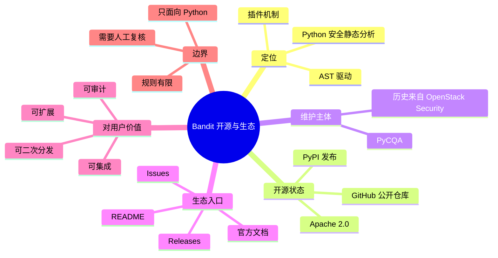

# 记忆卡片摘要（快速复习版）

## 1. 大纲（压缩版）
- Bandit 是什么，解决什么问题
- 它是否开源，许可证意味着什么
- 项目归属、维护方式、发布渠道
- 官方文档与 GitHub 仓库如何配合阅读
- 开源项目对普通开发者、企业、研究者分别意味着什么
- 典型误解：开源不等于随便用，稳定不等于没有误报

## 2. 思维导图（Mermaid）

## 3. 重要知识点（必须记住）
- Bandit 是开源项目，而且不是“代码可见但不能用”的那种半开源；它明确采用 `Apache License 2.0`，源码、问题跟踪、发布记录都公开。[来源1][来源2]
- 项目当前官方入口主要有 3 个：GitHub 仓库、Read the Docs 文档站、PyPI 发布页；这三者分别回答“代码长什么样”“应该怎么用”“现在发行到哪个版本”。[来源1][来源3][来源4]
- 本地仓库核对结果显示当前工作副本是 `main` 分支上的 `1.9.4-4-g4dacfcb`，而 PyPI 最新发布版本是 `1.9.4`，发布日期为 2026-02-25。[来源4]
- “开源”对安全工具尤其重要，因为规则、输出逻辑、误报来源、扩展点都可以直接审查，而不是只能盲信厂商结论。

## 4. 难点 / 易混点
- 开源项目不等于“没人维护”。Bandit 由 `PyCQA` 维护，并持续在 GitHub 与 PyPI 发布。[来源1][来源4]
- 有源码不等于“看得懂”。Bandit 的价值在于你不必一开始就读全量源码，官方文档已经把使用、配置、规则、CI/CD 接入拆开了。
- Apache-2.0 允许商用和二次分发，但并不替你承担误报漏报责任；安全扫描始终要配合人工复核。

## 5. QA 快速复习卡片
- Q: Bandit 是不是开源？
  A: 是，源码公开在 GitHub，许可证是 Apache-2.0。[来源1][来源2]
- Q: 只看 GitHub README 够吗？
  A: 不够。README 讲定位，官方文档讲用法，PyPI 讲发行版本，三者要一起看。[来源1][来源3][来源4]
- Q: 开源对静态分析工具最关键的意义是什么？
  A: 规则可审计、误报可定位、插件可扩展、接入方式可自定义。
- Q: Bandit 是不是企业级闭源扫描器的“免费替代品”？
  A: 不是简单替代。它更像轻量、透明、可扩展的 Python SAST 基础组件。

## 6. 快速复现步骤（最短路径）
1. 打开 GitHub 仓库：`https://github.com/PyCQA/bandit`
2. 打开官方文档首页：`https://bandit.readthedocs.io/en/latest/`
3. 打开 PyPI 发行页确认最新发布：`https://pypi.org/project/bandit/`
4. 本地执行 `python3 -m bandit --version` 确认环境版本

---

# 学习笔记正文（详细版）

## 0. 学习目标、读者画像与假设
- 技术：`Bandit`
- 本文主题：`Bandit 是否开源`
- 读者画像：默认你是 Python 安全工具初学者，甚至不是科班出身，但想先弄明白“这个工具到底靠不靠谱、值不值得学、能不能放心接到工程里”。
- 学习目标：读完后，你要能回答 5 个问题：它是不是开源、谁在维护、怎么发布、文档该从哪看、开源属性对工程实践有什么现实意义。
- 版本范围：线上发行版以 `1.9.4` 为准；本地源码核对基于 `/home/nyn/Desktop/Projects/SAST/sast_tools/bandit`，`git describe` 为 `1.9.4-4-g4dacfcb`。
- 假设与限制：你的需求中提到“以 joern 的 GitHub 仓库和官方文档为入口”，但结合上下文与本地路径，我将其解释为“以 Bandit 的 GitHub 仓库和官方文档为主入口”。

## 1. 背景与用途（从读者视角）

### 1.1 先讲大白话
如果你把 Python 项目想成一栋房子，Bandit 不是来帮你“运行房子”的，它是来在装修阶段检查有没有明显的安全隐患，比如你是不是把门锁拆了、是不是把危险化学品放在客厅、是不是把后门密码写在墙上。它并不执行你的业务逻辑，而是静态地看代码文本和语法树，然后根据规则告诉你：“这里可能有安全问题。”

### 1.2 为什么“是否开源”值得单独研究
普通业务库开不开源，很多时候只影响成本和可维护性；但安全工具开不开源，影响会更大。原因有三点：
- 第一，安全结论必须可追责。工具为什么报这个问题、为什么漏那个问题，你总得能追到规则与实现。
- 第二，安全工具会进入 CI/CD、审计、合规流程。闭源意味着你只能接受它的判断，开源意味着你可以验证、扩展、裁剪。
- 第三，Bandit 本身就是“检查别人代码的代码”。这种工具如果不透明，用户会天然更难信任。

## 2. Bandit 到底是不是开源

### 2.1 结论先说
是，而且证据链非常完整：
- GitHub 仓库公开：`PyCQA/bandit` 可以匿名访问源码、Issue、Pull Request、发布记录。[来源1]
- README 明确写明“Free software: Apache license”。[来源1]
- 仓库根目录存在 `LICENSE` 文件，许可证为 `Apache License 2.0`。[来源2]
- PyPI 页面公开发行源码包和 wheel，并能回溯到 GitHub 发布工作流和 tag `1.9.4`。[来源4]

### 2.2 “开源”在这里具体是什么意思
很多新手把开源理解成“能下载代码”。这只是第一层。对 Bandit 来说，更重要的是下面这几层：
- 你可以阅读规则源码，知道它到底如何识别 `assert`、`eval`、`subprocess shell=True`、`yaml.load` 等风险。
- 你可以阅读文档和源码之间的映射，判断文档是否落后于实现。
- 你可以自己写插件，或注册第三方插件到 `bandit.plugins`、`bandit.blacklists`、`bandit.formatters` 入口点。[来源5][来源6]
- 你可以把它接入自己的 IDE、pre-commit、GitHub Actions、CI/CD，而不需要向厂商申请私有授权。[来源3][来源7][来源8]

### 2.3 Apache-2.0 对普通人意味着什么
非科班读者最常见的问题是：“Apache-2.0 到底是不是可以商用？”大方向可以这样理解：
- 可以商用。
- 可以修改和再分发。
- 可以集成进公司的内部工具链。
- 但你需要保留许可证与版权声明，不能假装这就是你原创的。
- 它还带有专利授权条款，这比很多更宽松但更含糊的许可证更适合工程落地。

这不是正式法律意见，但对“能不能学、能不能用、能不能在公司接入”这个层面，答案是明确偏正面的。

## 3. 谁在维护，项目成熟度如何判断

### 3.1 维护主体
Bandit 当前归属 `PyCQA`。如果你熟悉 Python 代码质量生态，会知道 `PyCQA` 不是一个随便拼起来的账号，而是一组长期维护 Python 质量工具的社区组织。Bandit README 也说明它最初来自 `OpenStack Security Project`，后来迁移到 `PyCQA`。[来源1]

### 3.2 成熟度不是看“名气”，而是看这几个信号
- 文档站是否持续更新：Bandit 文档仍有完整的 Getting Started、Configuration、Plugins、Blacklists、Formatters、CI/CD、FAQ 等结构。[来源3]
- 包是否持续发布：PyPI 最新是 `1.9.4`，发布于 2026-02-25。[来源4]
- 仓库是否有发布渠道与 provenance：PyPI 页面还能追到 GitHub Actions 的发布工作流和 tag。[来源4]
- 项目是否有清晰的入口点与贡献方式：README、CONTRIBUTING、Issues、Actions、Releases 都公开。[来源1]

### 3.3 本地源码与线上发行版的关系
本地仓库显示 `main...origin/main`，提交短哈希是 `4dacfcb`，`git describe` 为 `1.9.4-4-g4dacfcb`。这说明你本地看的不是“刚好和 PyPI 完全一样的源码包”，而是 `1.9.4` 发布后又往前走了 4 个提交的主分支工作副本。这个区别很重要：
- 如果你要写“当前发布版怎么用”，应该以 PyPI `1.9.4` 和 Read the Docs 在线文档为主。
- 如果你要研究“接下来主线可能怎么演进”，可以看本地主分支源码。

## 4. 官方入口应该怎么读

### 4.1 GitHub 仓库负责回答什么
GitHub 仓库最适合回答：
- 项目是不是公开维护；
- 代码结构怎样；
- 规则和插件放在哪；
- 最近有没有活跃提交；
- 许可证、Issue、Release、CI 配置在哪里。

### 4.2 官方文档负责回答什么
Read the Docs 更适合回答：
- 新手该怎么安装、运行、配置；
- `.bandit`、YAML、TOML 配置分别是什么；
- 每条规则的说明、示例、CWE、严重级别是什么；
- 怎么接入 GitHub Actions。[来源3][来源8]

### 4.3 PyPI 负责回答什么
PyPI 不是教程站，但它特别适合确认：
- 最新稳定发行版是谁；
- 发布时间；
- 发布文件；
- 与 GitHub tag 的对应关系。[来源4]

### 4.4 最推荐的阅读顺序
对初学者，我建议按这个顺序：
1. 先看 README，知道 Bandit 干嘛。
2. 再看 `Getting Started`，先跑起来。
3. 再看 `Configuration`，学会选规则和压误报。
4. 再看 `Plugins` 与 `Blacklists`，知道规则长什么样。
5. 最后回 GitHub 源码，理解实现细节。

## 5. 开源属性对工程实践到底有什么好处

### 5.1 可审计
Bandit 报出一个问题时，你不是只能看到“系统认为有风险”，而是能继续看到：
- 对应测试 ID；
- 对应文档页面；
- 对应源码实现；
- 对应默认配置与可覆盖配置。

这对安全治理特别重要，因为“为什么报”和“能不能接受”一样关键。

### 5.2 可裁剪
企业项目几乎不可能接受“全量默认规则 + 零调优”。Bandit 开源意味着你可以：
- 选择只跑某些测试；
- 跳过已知不适用的测试；
- 给插件提供自定义配置；
- 用 baseline 或 `# nosec` 管理历史债务。[来源5]

### 5.3 可扩展
Bandit 不是把所有安全问题都写死在一个大程序里，而是通过 entry point 装载插件、黑名单、格式化器。[来源6]
这意味着如果你的项目里有特殊 API，比如自研危险函数、自定义模板引擎、特殊配置模式，就可以写你自己的检测插件。

### 5.4 可验证
我在本地直接运行了：
- `python3 -m bandit --version`
- `python3 -m bandit --help`
- `python3 -m bandit -r examples -f json -o /tmp/bandit_examples.json`

说明这不是纸面资料整理，而是已经和真实代码、真实 CLI 行为做过交叉核对。`examples/` 扫描得到 597 条结果、3 个错误对象，进一步说明项目自带大量可学习样例。

## 6. 边界条件与常见误区

### 6.1 开源不等于全能
Bandit 是 Python SAST，不是全语言 SAST，更不是 DAST、IAST、RASP。它的强项是 Python 语法级规则扫描，不是运行时漏洞利用验证。

### 6.2 开源不等于零成本
虽然许可证宽松，但你仍需要自己处理：
- 规则选型；
- 误报复核；
- 与 CI/CD 的阈值策略；
- Python 版本兼容。

### 6.3 文档不一定和你本地环境完全一致
我在本地帮助输出中看到当前可用格式器是 `csv, custom, html, json, screen, txt, xml, yaml`，而 `setup.cfg` 中还注册了 `sarif`。进一步导入源码发现本地缺少 `sarif_om` 依赖，所以 SARIF 格式器在当前环境没有加载成功。这是一个很典型的“开源项目文档能力上限高于当前环境实际能力”的例子。[来源6][来源9]

## 7. 官方文档章节映射与重要例子保留检查

| 官方章节 | 与本文关系 | 本文对应位置 |
| --- | --- | --- |
| Getting Started | 解释项目定位与安装入口 | 第 4 节 |
| Configuration | 说明开源项目可裁剪、可配置 | 第 5 节 |
| Integrations | 说明开源生态接入能力 | 第 4 节、第 5 节 |
| Plugins | 说明规则可扩展 | 第 5 节 |
| Blacklists | 说明内建规则集合公开 | 第 5 节 |
| Formatters | 说明输出能力与依赖差异 | 第 6.3 节 |
| CI/CD | 说明工程落地价值 | 第 5 节 |
| FAQ | 说明 Python 版本依赖 | 第 6 节 |

重要例子保留情况：
- 官方“Bandit is distributed on PyPI”被保留并扩展成“GitHub + Docs + PyPI”三入口阅读法。
- 官方 CI/CD GitHub Actions 入口被保留到第 5 节的工程接入价值。
- 官方 FAQ 关于“Bandit 依赖运行它的 Python 解释器 AST”被吸收到边界条件部分。

## 8. 延伸学习路径（官方优先）
- 第一步：读 `start.html`，先把命令跑起来。[来源3]
- 第二步：读 `config.html`，理解 `.bandit`、YAML、TOML 和 `# nosec`。[来源5]
- 第三步：读 `plugins/index.html` 和 `blacklists/index.html`，理解规则从哪来。[来源6][来源10]
- 第四步：回 GitHub 看 `bandit/core/` 和 `bandit/plugins/` 源码。[来源1]

---

# 练习与复习闭环

## 1. 分层练习

### 基础练习
- 用自己的话解释“Bandit 为什么不是一个闭源 SaaS 扫描器，而是一个可嵌入的开源组件”。
- 说出 3 个官方入口以及它们分别负责回答什么问题。
- 查出 Bandit 的许可证，并解释这对公司内部接入意味着什么。

### 应用练习
- 打开 GitHub 仓库，找到 `bandit.plugins` 的 entry points。
- 打开 PyPI 页面，确认最新版本与发布日期。
- 打开官方文档首页，列出一级章节。

### 综合练习
- 结合你自己的项目，写一段 300 字说明：为什么你会或不会把 Bandit 接进团队的默认 Python 安全检查流程。

## 2. 动手任务（带验收标准）
- 任务：写一页团队内部说明，主题是“为什么 Bandit 值得纳入 Python 仓库模板”。
- 验收标准：
  - 必须提到它是 Apache-2.0 开源项目；
  - 必须提到 GitHub、官方文档、PyPI 三入口；
  - 必须提到开源带来的可审计、可裁剪、可扩展三项价值；
  - 必须提到它不是全能扫描器，有边界。

## 3. 常见误区纠偏
- 误区：开源安全工具就是“便宜版商用扫描器”。
  正解：Bandit 更像透明、轻量、能嵌入工程的规则引擎，不是重型平台。
- 误区：只要 GitHub 公开就等于成熟。
  正解：还要看版本发布、文档完整度、维护主体和生态接入。
- 误区：有许可证就可以忽略治理。
  正解：许可证解决的是使用权，不解决误报、漏报和流程设计。

## 4. 复习节奏建议
- Day 1：记住三入口、许可证、维护主体。
- Day 3：复述“开源属性为什么对安全工具更重要”。
- Day 7：把 GitHub、Docs、PyPI 各自能解决的问题画成一张图。
- Day 14：回看自己的项目，判断 Bandit 适不适合作为基础 SAST 工具。

## 5. 自测题与参考答案（简版）
- 题目1：Bandit 是不是开源？证据有哪些？
  参考答案：是；GitHub 公开仓库、README 明示 Apache license、LICENSE 文件、PyPI 可追溯发布。
- 题目2：为什么要同时看 GitHub 和官方文档？
  参考答案：前者看实现与维护状态，后者看正确使用方法与规则说明。
- 题目3：开源对安全扫描工具最大的现实好处是什么？
  参考答案：规则可审计、误报可定位、能力可扩展、工程接入可自定义。

---

# 参考来源与版本说明

## 官方来源（优先）
1. [PyCQA/bandit GitHub 仓库](https://github.com/PyCQA/bandit) - 访问日期：2026-03-23 - 用于确认开源仓库、维护主体、README 与项目入口。[来源1]
2. [Bandit LICENSE](https://github.com/PyCQA/bandit/blob/main/LICENSE) - 访问日期：2026-03-23 - 用于确认 Apache-2.0 许可证。[来源2]
3. [Bandit 官方文档首页](https://bandit.readthedocs.io/en/latest/) - 访问日期：2026-03-23 - 用于确认官方文档结构。[来源3]
4. [bandit · PyPI](https://pypi.org/project/bandit/) - 访问日期：2026-03-23 - 用于确认最新发行版 `1.9.4` 与发布时间 `2026-02-25`。[来源4]
5. [Bandit Configuration](https://bandit.readthedocs.io/en/latest/config.html) - 访问日期：2026-03-23 - 用于确认配置、`# nosec`、`-c`、`.bandit` 等行为。[来源5]
6. [Bandit Test Plugins](https://bandit.readthedocs.io/en/latest/plugins/index.html) - 访问日期：2026-03-23 - 用于确认插件机制与扩展方式。[来源6]
7. [Bandit Integrations](https://bandit.readthedocs.io/en/latest/integrations.html) - 访问日期：2026-03-23 - 用于确认 IDE、CI/CD、打包生态。[来源7]
8. [Bandit GitHub Actions 文档](https://bandit.readthedocs.io/en/latest/ci-cd/github-actions.html) - 访问日期：2026-03-23 - 用于确认官方 CI/CD 接入方式。[来源8]
9. [Bandit setup.cfg](https://github.com/PyCQA/bandit/blob/main/setup.cfg) - 访问日期：2026-03-23 - 用于确认 extras、entry points、格式器注册信息。[来源9]
10. [Bandit Blacklist Plugins](https://bandit.readthedocs.io/en/latest/blacklists/index.html) - 访问日期：2026-03-23 - 用于确认内建黑名单机制。[来源10]

## 第三方来源（按采信程度标注）
- 本次未把非官方第三方文章作为结论依据。

## 关键结论引用映射
- [来源1] -> 仓库公开、维护主体、README 中的开源声明、项目历史
- [来源2] -> Apache-2.0 许可证
- [来源3] -> 官方文档章节结构
- [来源4] -> 最新发布版本与发布日期
- [来源5] -> 可配置、可压误报、`.bandit` 与 `# nosec`
- [来源6] -> 插件与扩展机制
- [来源7] -> IDE 和工具集成生态
- [来源8] -> GitHub Actions 入口
- [来源9] -> extras 与 formatter/plugin/blacklist entry points
- [来源10] -> 黑名单测试机制

## 冲突点与裁决（如有）
- 冲突点：文档与 `setup.cfg` 显示支持 `sarif`，但本地 `--help` 未列出 `sarif`。
- 来源A：官方源码与 `setup.cfg` 显示存在 `sarif` 格式器。[来源9]
- 来源B：本地实测环境 `python3 -m bandit --help` 未加载 `sarif`，且导入 `bandit.formatters.sarif` 报缺少 `sarif_om`。
- 差异原因判断：这是“能力已实现，但当前环境未安装对应 extra 依赖”的环境差异，不是功能删除。
- 本文采用结论：Bandit 官方支持 SARIF，但需要满足 `sarif` extra 依赖后才会在当前环境中真正可用。

## 技术版本与文档版本说明
- PyPI 最新稳定版：`1.9.4`
- PyPI 发布时间：`2026-02-25`
- 本地源码核对版本：`1.9.4-4-g4dacfcb`
- 文档访问日期：`2026-03-23`
