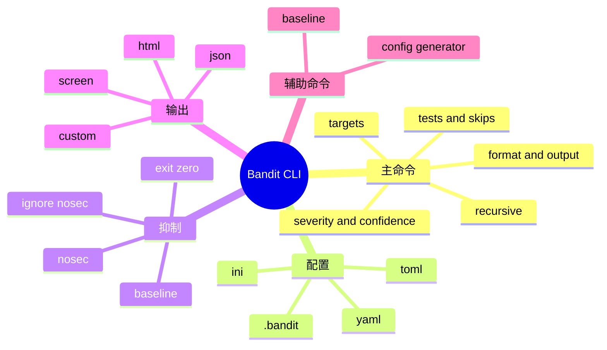

# 记忆卡片摘要（快速复习版）

## 1. 大纲（压缩版）
- `bandit` 主命令的总体语法
- 位置参数、扫描范围、过滤器、输出器
- 配置文件参数、baseline、`# nosec`、退出码
- `bandit-config-generator` 和 `bandit-baseline`
- 常见组合命令与真实工程用法
- 参数之间的相互影响与踩坑点

## 2. 思维导图（Mermaid）


## 3. 重要知识点（必须记住）
- 主命令基本形态是 `bandit [选项] [targets ...]`，`targets` 可以是文件、目录，甚至标准输入 `-`。[来源1][来源2]
- `.bandit` 自动发现只在递归扫描 `-r` 时生效；如果不是 `-r`，要显式用 `--ini` 指定。[来源3][来源4]
- `-t` 是只跑指定测试，`-s` 是跳过指定测试；二者会先合并到 profile 再做差集计算，重复出现同一测试会报错。[来源3][来源4]
- `--baseline` 只接受 JSON baseline；有 baseline 且有匹配结果时，Bandit 会隐藏“历史已知问题”，只保留新增候选。[来源1][来源4]
- 默认发现问题时退出码是 `1`，加上 `--exit-zero` 才会强制返回 `0`。这个行为我已经本地实测验证过。

## 4. 难点 / 易混点
- `-l` / `-ll` / `-lll` 与 `--severity-level` 是同一类筛选器的两种写法，不能混用在一个互斥组里。
- `-q` 只是少打印，不是少扫描。
- `--msg-template` 只能和 `--format custom` 一起用，否则 argparse 直接报错。[来源4]
- `bandit-baseline` 不是“生成 baseline 文件的唯一办法”；官方推荐主命令输出 JSON 再用 `-b` 复用。

## 5. QA 快速复习卡片
- Q: 只扫描一个文件需要 `-r` 吗？
  A: 不需要；`-r` 只用于递归目录。
- Q: 为什么 `.bandit` 有时不生效？
  A: 因为自动发现 `.bandit` 依赖 `-r`；单文件时要用 `--ini`。[来源3]
- Q: baseline 有什么用？
  A: 用来压掉历史已知问题，让 CI 主要盯新增问题。
- Q: `--exit-zero` 的典型场景是什么？
  A: 想先收集报告、不中断流水线时。

## 6. 快速复现步骤（最短路径）
1. `python3 -m bandit --help`
2. `python3 -m bandit examples/assert.py`
3. `python3 -m bandit examples/assert.py --exit-zero`
4. `python3 -m bandit -r examples -f json -o /tmp/bandit_examples.json`
5. `python3 -m bandit.cli.config_generator --help`
6. `python3 -m bandit.cli.baseline --help`

---

# 学习笔记正文（详细版）

## 0. 学习目标、读者画像与假设
- 技术：`Bandit`
- 本文主题：`CLI 用法（参数及其详细作用）`
- 读者水平：初学到中级，重点面向“知道命令行但没系统读过 Bandit 手册”的人。
- 目标：你读完后，应该能自己写出 6 类命令：单文件扫描、目录递归扫描、规则过滤、格式化输出、基线对比、配置生成。
- 版本范围：以 `python3 -m bandit --help`、`python3 -m bandit --version` 和本地源码 `bandit/cli/main.py` 的实测结果为主，环境版本是 `Bandit 1.9.4`。

## 1. 先建立总图：Bandit CLI 有三条命令线

### 1.1 主命令 `bandit`
这是你平时最常用的入口，负责“扫描什么、怎么扫、结果怎么出”。

### 1.2 配置生成命令 `bandit-config-generator`
这是辅助命令，负责吐出一份可编辑的默认配置模板。它特别适合第一次把 Bandit 接进工程时使用。

### 1.3 基线辅助命令 `bandit-baseline`
这是一个老入口，用于基线对比场景。虽然很多团队直接用主命令 `-f json -o baseline.json` + 后续 `-b baseline.json` 就够了，但理解它有助于你建立“历史债务治理”的概念。

## 2. `bandit` 主命令的总体语法

官方 man page 的语法可以概括成：

```text
bandit [options] [targets ...]
```

这里最容易误解的是 `targets`。它不是只能接目录，也不是只能接 `.py` 文件。你可以给：
- 单个 Python 文件；
- 多个文件；
- 目录；
- 标准输入 `-`。[来源1][来源2]

我本地实测了 `printf 'assert True\n' | python3 -m bandit -q -f json -`，返回结果中的文件名是 `<stdin>`，说明标准输入模式确实可用。

## 3. 位置参数与扫描范围类参数

### 3.1 `targets`
作用：指定扫描目标。可以是一个或多个路径。

直白理解：
- 你给文件，它就看这个文件；
- 你给目录但不加 `-r`，它会警告跳过目录内容；
- 你给目录并加 `-r`，才会递归找文件。

### 3.2 `-r, --recursive`
作用：递归处理子目录。

工程含义：
- 扫整个仓库时几乎必开；
- 扫单个文件时没必要；
- `.bandit` 自动发现逻辑和它强相关，后面会单独讲。

### 3.3 `-x, --exclude`
作用：额外排除路径，支持逗号分隔与 glob。

注意这里的“额外”二字很重要。它不是替换配置文件里的排除，而是在配置已有排除的基础上再加一层。[来源1][来源4]

默认排除项包括：
`.svn,CVS,.bzr,.hg,.git,__pycache__,.tox,.eggs,*.egg`

### 3.4 包含模式不是 CLI 参数，而是配置项
很多人第一次找不到“只扫描 `.pyi` 或 `.pyw` 的命令行参数”。Bandit 的“包含哪些文件”更多是配置层逻辑，不是独立的 CLI 开关。`BanditConfig` 默认 include 是 `*.py, *.pyw`，目录扫描时会按这个模式过滤。[来源4]

## 4. 规则选择与结果筛选参数

### 4.1 `-t, --tests`
作用：只跑指定测试 ID，逗号分隔，比如：

```bash
bandit -r . -t B101,B602,B608
```

思维模型：
- `-t` 像白名单；
- 只有进入白名单的规则才会运行。

### 4.2 `-s, --skip`
作用：跳过指定测试 ID。

思维模型：
- `-s` 像黑名单；
- 默认全跑时，它负责删掉不想跑的规则。

### 4.3 `-t` 和 `-s` 同时出现时怎么判定
这是 CLI 最容易讲含糊的地方，源码把流程写得很清楚：
1. 先取 profile 的 include/exclude；
2. 再把 CLI 的 `tests` 与 `skips` 合并进去；
3. 最终结果是 `include - exclude`；
4. 同一个测试如果同时在 include 和 exclude 里，`validate_profile` 直接报错退出。[来源4]

### 4.4 `-l` / `--severity-level`
作用：按严重性阈值过滤结果，而不是控制规则是否运行。

两套写法：
- `-l` = LOW 及以上
- `-ll` = MEDIUM 及以上
- `-lll` = HIGH 及以上
- `--severity-level {all,low,medium,high}` = 同义的长参数形式

要点：
- 它们是互斥参数组。
- 它们只影响“报告哪些结果”，不影响扫描过程本身。[来源1][来源4]

### 4.5 `-i` / `--confidence-level`
作用：按置信度阈值过滤结果。

置信度不是“漏洞有多严重”，而是“规则判断自己有多把握”。非科班读者可以这样记：
- 严重性看后果；
- 置信度看把握。

### 4.6 `-p, --profile`
作用：使用配置文件中预定义的 profile。

它更偏“组织好的规则组合”。如果你们团队需要“开发机配置”“CI 配置”“发布前强化配置”三套不同扫描策略，profile 很有用。[来源4]

## 5. 输出控制参数

### 5.1 `-f, --format`
作用：指定输出格式。

我本地实测当前环境加载到的格式器有：
- `csv`
- `custom`
- `html`
- `json`
- `screen`
- `txt`
- `xml`
- `yaml`

源码 `setup.cfg` 还声明了 `sarif`，但当前环境因为缺少 `sarif_om`，没有成功加载。这说明输出格式并非只由代码决定，也受可选依赖影响。[来源4][来源5]

### 5.2 `-o, --output`
作用：把报告写到文件，而不是标准输出。

典型用法：

```bash
bandit -r . -f json -o bandit-report.json
```

### 5.3 `-a, --aggregate`
作用：按 `file` 或 `vuln` 聚合结果。

直白理解：
- `file` 更像“每个文件下面列漏洞”；
- `vuln` 更像“按漏洞类型聚合再看出现在哪些文件”。

### 5.4 `-n, --number`
作用：每个问题最多展示多少行上下文代码。

它不影响检测，只影响你看报告时能看到多少代码片段。

### 5.5 `--msg-template`
作用：仅在 `--format custom` 时，定义一条结果该如何打印。

比如：

```bash
bandit -r examples --format custom \
  --msg-template "{abspath}:{line}: {test_id}[bandit]: {severity}: {msg}"
```

可用占位符包括：
`{abspath} {relpath} {line} {col} {test_id} {severity} {msg} {confidence} {range}`。[来源1][来源4]

如果你不用 `custom` 却传了 `--msg-template`，argparse 会直接报错，这一点源码已明确限制。[来源4]

## 6. 配置文件相关参数

### 6.1 `-c, --configfile`
作用：显式指定 YAML 或 TOML 配置文件。

典型用法：

```bash
bandit -c pyproject.toml -r .
bandit -c bandit.yaml -r .
```

配置里既能选规则，也能给插件传配置，比如 `shell_injection`、`assert_used` 等。[来源3]

### 6.2 `--ini`
作用：显式指定 `.bandit` 这类 INI 文件。

这是很多人第一次用时会忽略的关键参数，因为 `.bandit` 自动发现并不是一直都开着。

### 6.3 `.bandit` 自动发现为什么会“有时有效、有时无效”
官方文档明确说：Bandit 只有在 `-r` 时才会自动寻找 `.bandit`。[来源3]

我本地做了一个最小实验：
- 目录里放 `vuln.py`，内容是 `assert True`
- 同目录放 `.bandit`，配置 `skips = B101`
- 运行 `python3 -m bandit -r 目录 -q -f json`，结果数是 `0`
- 运行 `python3 -m bandit 目录/vuln.py -q -f json`，结果数是 `1`

这说明文档不是纸面描述，而是真实行为。

### 6.4 YAML / TOML 配置和 extra 依赖
Bandit 对 TOML 的支持与 Python 版本相关：
- Python 3.11+ 用标准库 `tomllib`
- 更低版本需要安装 `tomli`，也就是 `bandit[toml]` extra。[来源3][来源6]

## 7. 抑制、基线与退出码

### 7.1 `# nosec`
作用：压制某一行的某些或全部规则报告。

写法分三类：
- `# nosec`：整行全压
- `# nosec B602, B607`：按测试 ID 精确压制
- `# nosec assert_used`：按测试名压制

### 7.2 `--ignore-nosec`
作用：忽略代码里的 `# nosec`，强制重新报出来。

这在“安全审计回头看”时很有价值，因为你可以检查历史压制是否过度。

### 7.3 `-b, --baseline`
作用：读取历史 JSON 报告作为 baseline，对比后只报“新问题候选”。

官方要求 baseline 必须是 JSON。[来源1][来源3]

我本地实测流程：
1. 先对一个有 `shell=True` 的样例目录输出 `baseline.json`
2. 再用 `-b baseline.json -f json -q` 重扫
3. 结果 `results = 0`，退出码 `0`

这说明 baseline 的核心用途不是“保存报告”，而是“治理历史债务，让 CI 重点盯新增问题”。

### 7.4 `--exit-zero`
作用：即使有问题也返回 0。

我本地实测：
- `python3 -m bandit examples/assert.py` -> 返回码 `1`
- `python3 -m bandit examples/assert.py --exit-zero` -> 返回码 `0`
- `python3 -m bandit examples/okay.py` -> 返回码 `0`

对流水线来说，这个参数决定 Bandit 是“硬门禁”还是“先出报告”。

## 8. 日志与可观测性参数

### 8.1 `-v, --verbose`
作用：打印更多信息，比如包含/排除文件。

### 8.2 `-d, --debug`
作用：打开调试日志；插件内部异常时更容易定位。

### 8.3 `-q, --quiet, --silent`
作用：只在错误场景下输出，适合机器消费 JSON 时减少噪音。

注意：`-v` 与 `-q` 属于互斥组，不能同时用。[来源4]

## 9. 两个辅助命令

### 9.1 `bandit-config-generator`
用途：生成默认 profile 模板，或者打印各插件默认配置。

核心参数：
- `--show-defaults`：只显示默认配置，不落盘
- `-o, --out`：输出模板文件
- `-t, --tests`：预填只运行的测试
- `-s, --skip`：预填跳过的测试

它特别适合第一次建 `bandit.yaml`。我本地实测 `--show-defaults` 已打印出 `assert_used.skips`、`shell_injection`、`weak_cryptographic_key` 等默认配置块。

### 9.2 `bandit-baseline`
用途：把 baseline 对比能力做成单独 CLI。

帮助输出显示它的参数很少：
- `targets`
- `-f {txt,html,json}`

并明确说明“额外的 Bandit 参数比如 `-ll` 会透传给 Bandit”。所以你可以把它理解为“帮你套一层 baseline 工作流”的命令。

## 10. 常见组合命令与实际建议

### 10.1 开发者本地快速扫
```bash
bandit -r src -q
```

### 10.2 输出机器可读 JSON
```bash
bandit -r . -f json -o bandit-report.json
```

### 10.3 只盯高严重度
```bash
bandit -r . --severity-level high
```

### 10.4 只盯高严重度且高置信度
```bash
bandit -r . --severity-level high --confidence-level high
```

### 10.5 渐进式落地到老项目
```bash
bandit -r . -f json -o baseline.json
bandit -r . -b baseline.json -f json -q
```

### 10.6 用 `pyproject.toml`
```bash
bandit -c pyproject.toml -r .
```

## 11. 官方文档章节映射与重要例子保留检查

| 官方章节 | 本文吸收方式 | 对应位置 |
| --- | --- | --- |
| man/bandit | 参数总表、示例、格式说明 | 第 2 到第 10 节 |
| Getting Started | 安装、运行、baseline 示例 | 第 1 节、第 7 节 |
| Configuration | `.bandit`、YAML/TOML、`# nosec` | 第 6 节、第 7 节 |
| Formatters | 输出格式与 custom 模板 | 第 5 节 |
| CI/CD | 与退出码、JSON 输出、baseline 配合 | 第 7 节、第 10 节 |

重要例子保留情况：
- 官方 `bandit -r ~/your_repos/project` 已保留并扩展成多种目录扫描用法。
- 官方 `bandit examples/*.py -n 3 --severity-level=high` 已保留到结果筛选部分。
- 官方 `cat examples/imports.py | bandit -` 已本地实测并写入第 2 节。
- 官方 baseline 示例已实测并写入第 7 节。

## 12. 延伸学习路径（官方优先）
- 先读官方 man page：参数最全。[来源1]
- 再读 `Configuration`：理解参数和配置文件的叠加关系。[来源3]
- 再读 `GitHub Actions`：把退出码、JSON、baseline 放进 CI。[来源7]
- 最后读 `bandit/cli/main.py`：理解参数冲突和退出码实现。[来源4]

---

# 练习与复习闭环

## 1. 分层练习

### 基础练习
- 写出扫描单文件、递归扫描目录、输出 JSON 的 3 条命令。
- 解释 `-t` 和 `-s` 的区别。
- 解释“严重性”和“置信度”的区别。

### 应用练习
- 在一个样例目录中用 `.bandit` 跳过 `B101`，分别测试有无 `-r` 的差异。
- 生成一份 `bandit-report.json`，并用 `jq` 或文本查看第一条结果。
- 用 `--format custom --msg-template` 定义自己的输出格式。

### 综合练习
- 给一个已有问题较多的老 Python 仓库设计一套“两阶段落地命令”：
  - 第一阶段只出报告不拦截
  - 第二阶段用 baseline 只拦新增问题

## 2. 动手任务（带验收标准）
- 任务：给你的任意一个 Python 项目补一份 `bandit` 的本地扫描脚本说明。
- 验收标准：
  - 包含扫描命令、输出命令、baseline 命令；
  - 解释 `--exit-zero` 什么时候该开、什么时候不该开；
  - 说明 `.bandit` 自动发现对 `-r` 的依赖。

## 3. 常见误区纠偏
- 误区：`-l` 会减少扫描时间。
  正解：它主要减少输出结果，不是减少 AST 扫描本身。
- 误区：`.bandit` 放仓库根就一定自动生效。
  正解：自动发现依赖 `-r`。
- 误区：baseline 是“忽略安全问题”的借口。
  正解：baseline 是治理历史债务的过渡方案，不是永久豁免。

## 4. 复习节奏建议
- Day 1：记住 3 条最常用命令。
- Day 3：复述 `-t` / `-s` / `-l` / `-i` / `-f` / `-o` 的职责。
- Day 7：亲手做一次 baseline 生成与复扫。
- Day 14：把 `bandit-config-generator` 接进你的仓库初始化流程。

## 5. 自测题与参考答案（简版）
- 题目1：为什么 `.bandit` 有时不生效？
  参考答案：因为自动发现只在 `-r` 递归扫描时发生，否则需 `--ini`。
- 题目2：`--exit-zero` 会不会让结果消失？
  参考答案：不会，只改变退出码，不改变扫描结果。
- 题目3：baseline 和 `# nosec` 有什么本质区别？
  参考答案：baseline 是针对“历史报告集”的治理；`# nosec` 是代码行内局部抑制。

---

# 参考来源与版本说明

## 官方来源（优先）
1. [Bandit man page](https://bandit.readthedocs.io/en/latest/man/bandit.html) - 访问日期：2026-03-23 - 主命令参数定义与示例。[来源1]
2. [Bandit Getting Started](https://bandit.readthedocs.io/en/latest/start.html) - 访问日期：2026-03-23 - 安装、运行、baseline 示例。[来源2]
3. [Bandit Configuration](https://bandit.readthedocs.io/en/latest/config.html) - 访问日期：2026-03-23 - `.bandit`、YAML/TOML、`# nosec`、tests/skips。[来源3]
4. [bandit/cli/main.py](https://github.com/PyCQA/bandit/blob/main/bandit/cli/main.py) - 访问日期：2026-03-23 - 参数解析、互斥关系、退出码、`.bandit` 发现逻辑。[来源4]
5. [Bandit setup.cfg](https://github.com/PyCQA/bandit/blob/main/setup.cfg) - 访问日期：2026-03-23 - formatter、plugin、extras 注册信息。[来源5]
6. [bandit/core/config.py](https://github.com/PyCQA/bandit/blob/main/bandit/core/config.py) - 访问日期：2026-03-23 - TOML 支持、配置加载逻辑。[来源6]
7. [Bandit GitHub Actions 文档](https://bandit.readthedocs.io/en/latest/ci-cd/github-actions.html) - 访问日期：2026-03-23 - 工程接入与输入参数映射。[来源7]

## 第三方来源（按采信程度标注）
- 无。本文结论完全以官方文档、官方源码和本地实测为主。

## 关键结论引用映射
- [来源1] -> 主 CLI 参数表
- [来源2] -> 安装、标准输入、baseline 入门示例
- [来源3] -> `.bandit`、配置文件、`# nosec`
- [来源4] -> 参数互斥、`.bandit` 发现、退出码
- [来源5] -> 输出格式与 extras
- [来源6] -> TOML 加载与配置行为
- [来源7] -> CI 输入参数与主 CLI 对应关系

## 冲突点与裁决（如有）
- 冲突点：man page 列出 `sarif`，本地 `--help` 未列出。
- 裁决依据：源码 `setup.cfg` 有 `sarif` entry point，但本地缺少 `sarif_om` 依赖，导致环境未加载。
- 采用结论：文档能力上限包含 SARIF；当前环境实可用格式不含 SARIF。

## 技术版本与文档版本/访问日期
- 本地 CLI 实测版本：`Bandit 1.9.4`
- Python 运行环境：`3.10.12`
- 文档与源码访问日期：`2026-03-23`
