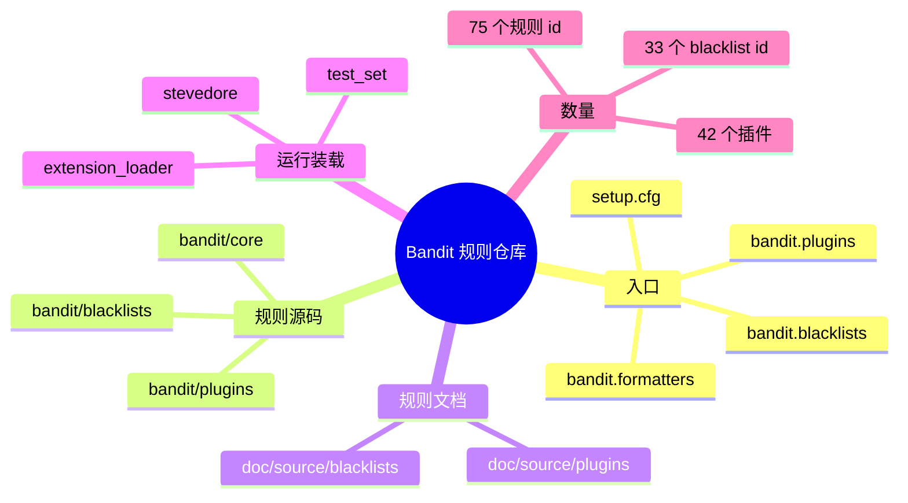

# 记忆卡片摘要（快速复习版）

## 1. 大纲（压缩版）
- Bandit 的规则仓库到底在哪里
- 规则分为插件、黑名单、格式器三类入口
- 目录结构与 entry points 的对应关系
- 当前规则数量、编号分组、文档覆盖情况
- 怎样从官方文档追到源码，再从源码追到测试
- 文档和实际加载规则为什么可能有差异

## 2. 思维导图（Mermaid）

## 3. 重要知识点（必须记住）
- Bandit 没有独立的“rules 仓库”；规则和主程序在同一个官方 GitHub 仓库 `PyCQA/bandit` 内维护。[来源1]
- “规则”至少包含两类：普通插件规则 `bandit.plugins`，以及黑名单规则 `bandit.blacklists`；输出格式器 `bandit.formatters` 虽不是漏洞规则，但同样用插件仓库方式管理。[来源2][来源3]
- 本地源码实测当前加载到 `42` 个插件规则、`33` 个 blacklist ID，总计 `75` 个规则 ID。
- 规则编号有明显分组：`B1xx` 杂项、`B2xx` 应用配置、`B3xx` 调用黑名单、`B4xx` 导入黑名单、`B5xx` 密码学、`B6xx` 注入、`B7xx` XSS。[来源4]

## 4. 难点 / 易混点
- `bandit/plugins/` 里的每个 Python 文件不一定只对应一个规则，有的文件会导出多个测试 ID。
- `blacklists` 不是“老功能”，而是现在仍在用的内建规则体系，只是最终经由内建测试 `B001` 装配进执行集。[来源5]
- 文档页数量和实际加载规则数不一定完全一样，因为某些文档页可能对应历史规则或环境依赖差异。

## 5. QA 快速复习卡片
- Q: Bandit 的规则仓库在哪里？
  A: 就在官方仓库 `PyCQA/bandit` 里，不是另开仓库。
- Q: 为什么说 `setup.cfg` 是规则仓库地图？
  A: 因为 entry points 把“规则名 -> 模块函数”映射写在那里。[来源2]
- Q: 黑名单规则和普通插件规则有什么区别？
  A: 普通插件写成函数逻辑；黑名单更像“危险 API 清单 + 匹配元数据”。
- Q: 研究规则时先看哪里？
  A: `setup.cfg` -> `bandit/plugins` 或 `bandit/blacklists` -> `doc/source/plugins` 或 `doc/source/blacklists`。

## 6. 快速复现步骤（最短路径）
1. 打开 `setup.cfg` 查看 `[entry_points]`
2. 查看 `bandit/plugins/`
3. 查看 `bandit/blacklists/`
4. 查看 `doc/source/plugins/index.rst`
5. 本地运行 `python3 -m bandit --help` 看实际加载到的测试 ID

---

# 学习笔记正文（详细版）

## 0. 学习目标、读者画像与假设
- 主题：`Bandit 规则仓库`
- 目标：让你搞清楚“规则放哪、怎么编号、怎么加载、怎么查文档、怎么验证自己看到的是不是当前真的在跑的规则”。
- 读者画像：已经知道 Bandit 是 Python SAST，但还不清楚规则组织方式的初学者。

## 1. 先回答核心问题：Bandit 有没有独立规则仓库

没有。Bandit 的“规则仓库”就是它自己的官方仓库 `PyCQA/bandit`。[来源1]

这点很重要，因为很多安全产品会把引擎、规则、平台、报告模板拆成多个私有仓库，外部用户只看到结果，看不到规则本身。Bandit 不是这样。它把：
- 规则源码
- 规则文档
- 规则装载器
- 样例代码
- 测试代码

都放在同一个仓库里。对学习者特别友好，因为你顺着一个仓库就能把“规则的生老病死”追完。

## 2. 规则仓库的三层结构

### 2.1 第一层：声明层 `setup.cfg`
`setup.cfg` 中的 `[entry_points]` 是 Bandit 的规则总目录。这里定义了三类命名空间：
- `bandit.plugins`
- `bandit.blacklists`
- `bandit.formatters`。[来源2]

可以把它理解成“仓库地图”：
- 插件规则从哪里加载；
- 黑名单数据从哪里加载；
- 输出器从哪里加载。

### 2.2 第二层：实现层
- `bandit/plugins/`：放普通插件规则，比如 `asserts.py`、`injection_shell.py`、`yaml_load.py`
- `bandit/blacklists/`：放黑名单数据生成器，比如 `calls.py`、`imports.py`
- `bandit/core/`：放装载器、测试集合、上下文、执行器等基础设施

### 2.3 第三层：说明层
- `doc/source/plugins/`：每个插件的官方规则页
- `doc/source/blacklists/`：黑名单规则页
- `doc/source/formatters/`：格式器说明

如果你想快速建立心智模型，最好的顺序是：
1. 先看 `setup.cfg`
2. 再看某个插件源码
3. 再看对应文档
4. 最后看 `examples/` 和 `tests/`

## 3. 规则是怎么被装载进 Bandit 的

### 3.1 官方加载器
`bandit/core/extension_loader.py` 使用 `stevedore.ExtensionManager` 分别装载 formatters、plugins、blacklists。[来源3]

这背后的好处是：
- Bandit 自带规则和第三方规则在机制上是统一的；
- 扩展点不是“魔法硬编码”，而是标准插件入口；
- 规则仓库的边界不是文件夹，而是 entry point。

### 3.2 为什么插件必须带测试 ID
加载器会检查插件函数是否带 `_test_id`。没有 ID 的插件会被警告并跳过。[来源3]

这对规则仓库管理非常关键，因为：
- 测试 ID 是用户过滤规则时的唯一稳定锚点；
- 文档、CLI 输出、`# nosec`、baseline 都依赖它；
- 没有 ID，规则就没法被可靠管理。

### 3.3 黑名单为什么看起来不像普通插件
黑名单不是一堆 `def test_xxx(context)` 的函数，而是返回“某种 AST 节点 -> 一组危险项”的字典。然后 `BanditTestSet` 会把这些数据包装成内建测试 `B001` 的一种变体来运行。[来源5][来源6]

对初学者来说，可以把它简单记成：
- 普通插件：我自己写判断逻辑；
- 黑名单：我提供“危险 API 名单 + 提示文案 + 严重性”。

## 4. 规则仓库的实际规模

我本地对当前环境做了统计：
- `plugins_by_id` 数量：`42`
- `blacklist_by_id` 数量：`33`
- 当前总规则 ID：`75`

分组统计如下：
- `B1xx`：11
- `B2xx`：2
- `B3xx`：21
- `B4xx`：13
- `B5xx`：9
- `B6xx`：15
- `B7xx`：4

这和官方插件分组说明是吻合的：`B1xx` 杂项、`B2xx` 应用配置、`B3xx/B4xx` 黑名单、`B5xx` 密码学、`B6xx` 注入、`B7xx` XSS。[来源4]

## 5. 典型目录怎么读

### 5.1 `bandit/plugins/`
这是你最常读的目录。几个典型文件：
- `asserts.py`：`B101`
- `injection_shell.py`：一口气包含 `B602` 到 `B607`
- `injection_sql.py`：`B608`
- `yaml_load.py`：`B506`
- `weak_cryptographic_key.py`：`B505`

一个文件导出多个测试 ID 非常常见，这就是为什么“按文件数估规则数”会不准。

### 5.2 `bandit/blacklists/`
这层更多是“危险调用清单”和“危险导入清单”：
- `calls.py` 定义 `B301` 到若干 `B3xx`
- `imports.py` 定义 `B4xx`

比如 `B301` 对应不安全反序列化调用，`B303` 对应弱哈希，`B310` 对应 `urllib.urlopen` 的 scheme 风险。

### 5.3 `examples/`
这是很多人低估的目录。它不是随便放几个 demo，而是规则学习的“靶场”。你想理解某条规则为什么会触发，不一定先看源码，先看 `examples/` 往往更快。

### 5.4 `tests/`
当你怀疑规则文档和实现不一致时，`tests/` 是最后裁决点。因为文档可能落后，测试通常更接近作者真正想保证的行为。

## 6. 官方文档与规则仓库的映射关系

### 6.1 插件文档
`doc/source/plugins/index.rst` 解释了怎样写测试：
- 用 `@checks(...)`
- 用 `@test_id(...)`
- 必要时用 `@takes_config(...)`
- 注册到 `bandit.plugins`。[来源4]

### 6.2 黑名单文档
`doc/source/blacklists/index.rst` 解释了黑名单数据字典结构：
- `name`
- `id`
- `qualnames`
- `message`
- `level`。[来源6]

### 6.3 一个很重要的现实问题：文档数和实际规则数为什么会不完全对齐
我本地数到：
- `doc/source/plugins/` 下有 `44` 个 `b*.rst` 文档页
- 但当前环境只加载了 `42` 个插件 ID

查下来可以看到 `B109`、`B111` 这类文档页仍存在，但当前仓库中没有对应的实际 plugin entry point。这提醒你：
- 规则仓库研究不能只看文档页列表；
- 要同时看 `setup.cfg` 和运行时 `--help` 的已加载规则；
- “官方文档有页”不一定等于“当前版本一定会跑”。

这不是说文档错误，而是说明开源仓库里常会出现“历史遗留页、版本差异、环境差异”。

## 7. 从一条规则追完整生命周期的方法

以 `B101` 为例：
1. 在 `python3 -m bandit --help` 中看到 `B101 assert_used`
2. 在 `setup.cfg` 中找到 `assert_used = bandit.plugins.asserts:assert_used`
3. 打开 `bandit/plugins/asserts.py`
4. 查看文档 `doc/source/plugins/b101_assert_used.rst`
5. 看 `examples/assert.py`
6. 运行 `python3 -m bandit examples/assert.py`

这就是最标准的“规则仓库递归探索路径”。对任何规则都通用。

## 8. 规则仓库为什么适合做学习与研究入口

### 8.1 对新手
它让你能把抽象的“安全规则”拆成 4 件具体事情：
- 匹配什么 AST 节点
- 取什么上下文信息
- 什么时候报
- 报什么级别与文案

### 8.2 对工程师
它让你能判断：
- 某个误报是不是规则设计导致；
- 某个规则能否通过配置收窄；
- 某个公司内部风险点值不值得写成自定义插件。

### 8.3 对研究者
它提供一个非常清晰的、可复现的“轻量规则仓库”样本，适合做：
- SAST 规则表示研究
- AST 匹配策略研究
- 误报漏报基准整理
- 与 Semgrep、CodeQL、Joern 等工具做横向比较

## 9. 官方文档章节映射与重要例子保留检查

| 官方章节 | 与本文关系 | 对应位置 |
| --- | --- | --- |
| Plugins/index | 规则插件总入口 | 第 2、6 节 |
| Blacklists/index | 黑名单规则结构 | 第 3、6 节 |
| Formatters/index | 说明 entry point 体系不只限规则 | 第 2 节 |
| Getting Started | 说明从 CLI 输出反查规则 ID | 第 7 节 |
| Configuration | 说明规则仓库与配置的连接 | 第 8 节 |

重要例子保留情况：
- 官方插件写法示例已保留为“规则生命周期追踪法”。
- 官方黑名单字典结构已保留到第 6.2 节。
- 官方 ID Groupings 表已保留到第 4 节并结合本地统计补充。

## 10. 延伸学习路径（官方优先）
- 先读 `plugins/index.html`：认识插件规则设计方法。[来源4]
- 再读 `blacklists/index.html`：理解黑名单规则为什么适合批量维护。[来源6]
- 然后看 `setup.cfg`：把规则名、ID、模块函数串起来。[来源2]
- 最后从 `examples/` 挑 5 条高频规则做源码到实测闭环。

---

# 练习与复习闭环

## 1. 分层练习

### 基础练习
- 说出 Bandit 规则仓库的三个核心目录。
- 解释 entry point 在 Bandit 里扮演什么角色。
- 说出普通插件与黑名单规则的主要差异。

### 应用练习
- 任选一个规则 ID，手动从 `--help` 追到源码与文档。
- 统计 `bandit/plugins/` 中哪些文件导出了多个规则 ID。
- 找出一条 `B3xx` 和一条 `B6xx`，比较它们在仓库中的表达方式。

### 综合练习
- 设计一份“团队新成员如何在 20 分钟内熟悉 Bandit 规则仓库”的阅读路线。

## 2. 动手任务（带验收标准）
- 任务：用你自己的话画出 Bandit 规则仓库结构图。
- 验收标准：
  - 必须包括 `setup.cfg`、`bandit/plugins`、`bandit/blacklists`、`doc/source/plugins`；
  - 必须解释 entry point；
  - 必须说明为什么 `--help` 和文档页列表都要看。

## 3. 常见误区纠偏
- 误区：规则仓库就是 `bandit/plugins/`。
  正解：还包括 `setup.cfg`、`bandit/blacklists/`、文档、examples、tests。
- 误区：文档页数量就是规则数量。
  正解：不一定，要以运行时加载和 entry points 为准。
- 误区：黑名单不是“真正的规则”。
  正解：黑名单也是正式规则，只是表达形式不同。

## 4. 复习节奏建议
- Day 1：记住三层结构：声明层、实现层、说明层。
- Day 3：亲手追一条规则的全链路。
- Day 7：比较插件规则与黑名单规则。
- Day 14：思考如果你要加一条公司自定义规则，该落在哪一层。

## 5. 自测题与参考答案（简版）
- 题目1：为什么说 `setup.cfg` 是规则地图？
  参考答案：因为里面定义了 entry points，把名字映射到实现。
- 题目2：黑名单规则为什么会和 `B001` 扯上关系？
  参考答案：因为运行时会把黑名单数据包装成内建测试集合。
- 题目3：文档页多于实际加载规则说明什么？
  参考答案：可能存在历史遗留、版本差异或环境依赖差异。

---

# 参考来源与版本说明

## 官方来源（优先）
1. [PyCQA/bandit GitHub 仓库](https://github.com/PyCQA/bandit) - 访问日期：2026-03-23 - 规则仓库总入口。[来源1]
2. [Bandit setup.cfg](https://github.com/PyCQA/bandit/blob/main/setup.cfg) - 访问日期：2026-03-23 - entry points 地图。[来源2]
3. [bandit/core/extension_loader.py](https://github.com/PyCQA/bandit/blob/main/bandit/core/extension_loader.py) - 访问日期：2026-03-23 - 插件/黑名单/格式器装载逻辑。[来源3]
4. [Bandit Plugins Index](https://bandit.readthedocs.io/en/latest/plugins/index.html) - 访问日期：2026-03-23 - 插件写法与 ID 分组。[来源4]
5. [bandit/core/test_set.py](https://github.com/PyCQA/bandit/blob/main/bandit/core/test_set.py) - 访问日期：2026-03-23 - 黑名单包装进测试集合的过程。[来源5]
6. [Bandit Blacklist Plugins](https://bandit.readthedocs.io/en/latest/blacklists/index.html) - 访问日期：2026-03-23 - 黑名单规则结构与数据字段。[来源6]

## 第三方来源（按采信程度标注）
- 无。

## 关键结论引用映射
- [来源1] -> 规则仓库入口与整体结构
- [来源2] -> entry points 映射
- [来源3] -> 运行时装载机制
- [来源4] -> 插件写法与规则分组
- [来源5] -> 黑名单与 `B001` 的运行关系
- [来源6] -> 黑名单数据结构

## 冲突点与裁决（如有）
- 冲突点：插件文档页数量与实际加载插件数不完全一致。
- 裁决依据：以 `setup.cfg` + 运行时 `--help` + extension loader 实际装载为准，文档页用于教学与历史追踪。

## 技术版本与文档版本说明
- 本地统计环境：`Bandit 1.9.4`
- 本地加载规则数：`42 plugins + 33 blacklist ids`
- 访问日期：`2026-03-23`
