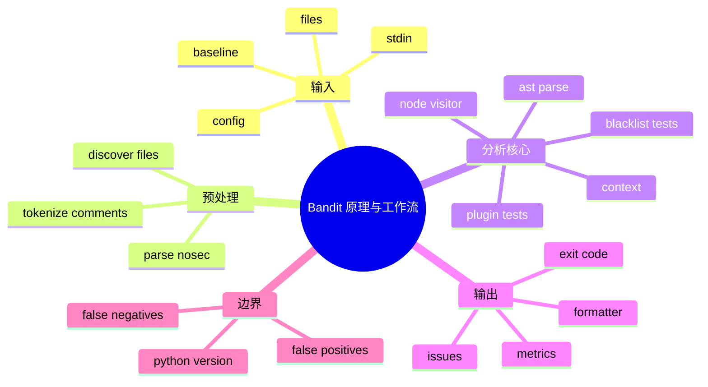

# 记忆卡片摘要（快速复习版）

## 1. 大纲（压缩版）
- Bandit 的静态分析到底在分析什么
- AST 是什么，为什么适合 Bandit
- 从“发现文件”到“输出报告”的完整工作流
- 上下文、插件、黑名单、结果、baseline 如何串起来
- 为什么 Bandit 必须与 Python 版本绑定
- 误报、漏报与工程边界

## 2. 思维导图（Mermaid）


## 3. 重要知识点（必须记住）
- Bandit 不是跑程序，而是解析源码成 `AST` 后，在语法树节点上执行规则函数。[来源1][来源2]
- 它的工作流大致是：发现文件 -> 读取内容 -> 解析 `# nosec` -> 构建 AST -> 用 `NodeVisitor` 遍历节点 -> 把上下文交给规则 -> 收集 `Issue` -> 过滤 baseline -> 格式化输出。[来源2][来源3][来源4]
- Bandit 的规则不是直接面对原始文本，而是面对 `Context` 对象；这让规则更稳定，也更容易复用。[来源5]
- Bandit 能否成功分析，和“运行 Bandit 的 Python 版本能否解析目标代码语法”强相关；这点官方 FAQ 专门强调过。[来源6]

## 4. 难点 / 易混点
- 静态分析不是简单字符串搜索。Bandit 核心靠 AST 和上下文，不只是 grep。
- 但它也不是全局数据流分析框架；它更偏语法节点 + 局部上下文规则。
- `# nosec` 不是分析前删代码，而是在结果决定阶段按行号和测试 ID 过滤。

## 5. QA 快速复习卡片
- Q: 为什么 Bandit 速度通常还可以？
  A: 因为它主要做 AST 遍历和规则匹配，没有做重型全程序求解。
- Q: AST 对初学者怎么理解？
  A: 就是把代码拆成“语法积木树”，函数调用、导入、字符串字面量都会变成节点。
- Q: baseline 在工作流里处于什么位置？
  A: 在扫描后、输出前，用来过滤历史已知问题。
- Q: `# nosec` 在什么时候生效？
  A: 读取注释后记录，真正跳过是在规则准备产出结果时判定。

## 6. 快速复现步骤（最短路径）
1. 读 `README.rst` 的 “AST + plugins + report” 总述
2. 读 `bandit/core/manager.py`
3. 读 `bandit/core/node_visitor.py`
4. 读 `bandit/core/tester.py`
5. 跑 `python3 -m bandit -r examples -f json -o /tmp/bandit_examples.json`

---

# 学习笔记正文（详细版）

## 0. 学习目标、读者画像与假设
- 主题：`Bandit 的静态分析原理与工作流`
- 目标：让一个非科班读者也能理解“Bandit 为什么能报这些问题，它到底怎么把源码一步步变成安全报告”。
- 读者水平：零基础到初学。

## 1. 先讲直观版：Bandit 像什么

如果你把 Python 代码看作一篇文章，Bandit 不是一个“看文章整体思想”的老师，而更像一个有很多检查清单的审核员：
- 看到“危险词”不直接下结论；
- 先把句子按语法结构拆开；
- 确认这到底是函数调用、导入、字符串、配置还是注释；
- 再根据不同规则决定要不要报警。

所以它不是单纯文本搜索。比如同样出现 `subprocess.Popen` 这串字，只有当它真的是一个函数调用、并且某些参数满足条件时，规则才会触发。

## 2. 什么是 AST，为什么 Bandit 依赖它

### 2.1 非科班版解释
AST 是 `Abstract Syntax Tree`，中文常翻成“抽象语法树”。你可以把它理解成：Python 解释器在真正运行代码前，会先把源代码拆成树形结构。

例如：

```python
subprocess.Popen("/bin/ls *", shell=True)
```

在 AST 里不再是一整行文本，而会被拆成：
- 这是一个 `Call` 节点
- 被调用的函数名是 `subprocess.Popen`
- 第一个位置参数是字符串
- 还有一个关键字参数 `shell=True`

Bandit 最擅长的，就是在这种“结构化信息”上写规则。

### 2.2 为什么不用纯文本搜索
因为纯文本搜索会遇到太多问题：
- 注释和真实代码混在一起
- 变量名里也可能出现关键词
- 同一 API 有多种导入方式
- 函数调用与字符串内容长得像但含义不同

AST 的意义就是把“长得像”变成“语法上真的是”。

## 3. Bandit 的完整工作流

### 3.1 第一步：发现文件
`BanditManager.discover_files()` 会根据目标路径、`-r`、配置里的 include/exclude、CLI 的 `--exclude` 来收集待分析文件列表。[来源2]

这一步做的事情看似简单，其实很关键：
- 决定哪些文件根本不会进入分析阶段；
- 决定目录扫描与单文件扫描的行为差异；
- 决定 `.bandit` 和配置项会影响什么。

### 3.2 第二步：读取内容并解析 `# nosec`
Manager 在 `_parse_file()` 里先读文件，再用 `tokenize` 去找注释中的 `# nosec`，把它解析成“某行要忽略哪些测试 ID”的字典。[来源2]

这说明 `# nosec` 不是靠字符串替换，而是通过 Python tokenizer 正经解析注释。

### 3.3 第三步：构建 AST
`BanditNodeVisitor.process()` 里会调用 `ast.parse(data)` 生成 AST。[来源3]

如果这里就失败，比如语法和当前 Python 解释器不兼容，Bandit 就没法继续深入分析。这也是为什么官方 FAQ 明确说，Bandit 的 Python 版本最好与项目语法兼容。[来源6]

### 3.4 第四步：遍历 AST 节点
`BanditNodeVisitor` 会递归遍历节点，并对不同节点类型做不同处理：
- `visit_Call`
- `visit_Import`
- `visit_ImportFrom`
- `visit_FunctionDef`
- `visit_Str`
- `visit_Bytes`
- 以及通用的 `generic_visit()`。[来源3]

简单说，它会一边走树，一边构造当前节点的上下文。

### 3.5 第五步：构造上下文 `Context`
遍历到节点时，Bandit 会把很多信息塞进一个上下文字典，再包装成 `Context` 对象交给规则：
- 文件名
- 行号
- 列号
- 当前 AST 节点
- 当前导入信息
- 函数调用名
- 参数列表
- 关键字参数
- 字符串值

所以规则作者不必每次都自己从 AST 生啃一遍，而是可以通过 `context.call_function_name_qual`、`context.call_keywords` 之类的接口直接取信息。[来源5]

### 3.6 第六步：运行规则
`BanditTester.run_tests()` 会根据当前节点类型，从 `BanditTestSet` 里拿出对应规则，然后逐条执行。[来源4][来源7]

这一层的关键点是：
- 规则按节点类型分发，不是所有规则对所有节点都跑；
- 有配置的规则会先注入 `_config`；
- 如果规则返回 `Issue`，它就进入结果集；
- 如果当前行有 `# nosec`，就会在这里决定是跳过还是保留。

### 3.7 第七步：累积结果与指标
Bandit 不只记漏洞结果，还会统计：
- LOC
- 各严重度/置信度计数
- nosec 数
- skipped tests 数

这就是为什么 JSON 输出里不仅有 `results`，还有 `metrics`。

### 3.8 第八步：baseline 过滤
`BanditManager.filter_results()` 会在输出前比对 baseline。[来源2]

它的策略很务实：并不是尝试做复杂的“新旧结果逐一精确映射”，而是基于 issue 相等性与候选匹配来做过滤。因为代码行号变动后，完全精确地认定“哪一条是旧问题”并不总可靠。

### 3.9 第九步：格式化输出与退出码
最后 `output_results()` 根据 `--format` 调用相应 formatter。[来源2]

然后主 CLI 根据“过滤后结果数是否大于 0”和 `--exit-zero` 决定返回码：
- 有结果且没开 `--exit-zero` -> `1`
- 否则 -> `0`。[来源8]

## 4. 普通插件、黑名单、格式器在工作流里分别扮演什么角色

### 4.1 普通插件
最像“写判断逻辑”的规则。例如：
- 看到 `Assert` 节点就触发 `B101`
- 看到 `Call` 节点再结合 `shell=True` 触发 `B602`

### 4.2 黑名单
更像一份“危险 API 名单”。当节点碰到这些 fully qualified names，就生成对应 issue。它适合批量维护一组危险调用或导入。

### 4.3 格式器
格式器不参与判断漏洞，只负责把结果变成人类或机器能消费的格式，如 `json`、`html`、`yaml`、`custom`。

## 5. 一个真实例子：`B602 subprocess_popen_with_shell_equals_true`

为什么 `B602` 很适合拿来理解原理？
- 它不是纯文本匹配；
- 它需要看调用名是不是 `subprocess.Popen` 一类；
- 还要看关键字参数里 `shell` 是不是 `True`；
- 还会根据命令字符串是否是静态文本或包含格式化，调整严重度。[来源9]

这说明 Bandit 的规则已经比“搜索危险字符串”更聪明，但仍然是局部语法与上下文级别的判断，不是全程序污点追踪。

## 6. 为什么 Python 版本会影响扫描结果

官方 FAQ 说得很直接：Bandit 用的是运行它的那个 Python 解释器里的 `ast` 模块，所以它只能稳定解析该解释器语法所支持的代码。[来源6]

这对非科班读者很重要。简单记：
- 不是“扫描 Python 代码就永远用最新版 Python 跑 Bandit”；
- 而是“最好用能兼容你项目语法的 Python 版本跑 Bandit”。

举例：
- 目标项目是 Python 3.10 特性，拿 Python 2.7 AST 去解析肯定不行；
- 反过来，过老语法放到新解释器也可能出兼容问题。

## 7. 误报、漏报与边界条件

### 7.1 为什么会误报
- 规则只能看到局部上下文，未必知道你的真实业务前提；
- 某些 API 在你的场景里虽然危险，但已通过别的方式约束输入；
- Bandit 为了提高覆盖率，宁可多提醒一些“值得人工看一眼”的点。

### 7.2 为什么会漏报
- 它不是全局数据流分析；
- 它不理解复杂运行时行为；
- 动态拼接、元编程、框架魔法会降低可见度。

### 7.3 为什么这不是缺点，而是设计权衡
Bandit 的目标不是成为重型程序分析器，而是作为：
- 本地开发快速反馈器
- CI 中的基础安全门槛
- 可读、可改、可扩展的 Python SAST 组件

在这个目标下，AST + 插件规则是一种非常务实的设计。

## 8. 本地实测结果如何帮助理解工作流

我本地执行 `python3 -m bandit -r examples -f json -o /tmp/bandit_examples.json` 得到：
- `597` 条结果
- `3` 个错误对象
- `8885` 行代码统计

排名靠前的测试 ID 包括：
- `B608`
- `B308`
- `B703`
- `B603`
- `B602`

这恰好说明 Bandit 的工作流不是“只抓一两条简单规则”，而是在真实样例集上并行跑很多插件与黑名单规则。

## 9. 官方文档章节映射与重要例子保留检查

| 官方章节 | 本文对应 |
| --- | --- |
| README Overview | 第 1、2 节 |
| FAQ | 第 6 节 |
| Plugins | 第 4、5 节 |
| Blacklists | 第 4 节 |
| Getting Started | 第 8 节 |
| Configuration | 第 3.2、7 节 |

重要例子保留情况：
- README 中“build AST then run plugins”已展开成完整九步工作流。
- FAQ 中“Python 版本影响 AST 解析”已展开成第 6 节。
- 插件示例与 `B602` 规则已用于说明“局部上下文分析”。

## 10. 延伸学习路径（官方优先）
- 先读 README Overview。[来源1]
- 再读 `manager.py`、`node_visitor.py`、`tester.py` 三件套。[来源2][来源3][来源4]
- 然后读 `context.py`，理解规则看到的数据结构。[来源5]
- 最后用 `examples/` 挑 3 条规则做端到端调试。

---

# 练习与复习闭环

## 1. 分层练习

### 基础练习
- 用自己的话解释 AST。
- 按顺序复述 Bandit 工作流。
- 解释 `# nosec` 和 baseline 分别位于工作流哪个阶段。

### 应用练习
- 任选一条 `Call` 类规则，追踪它使用了哪些 `Context` 字段。
- 在本地给一个文件加 `# nosec B101`，观察结果变化。
- 改变输出格式，看扫描流程本身是否变化。

### 综合练习
- 写一段 500 字短文，解释“为什么 Bandit 不是 grep，但也不是 CodeQL”。

## 2. 动手任务（带验收标准）
- 任务：手画 Bandit 的时序图。
- 验收标准：
  - 包含文件发现、注释解析、AST 构建、规则执行、输出；
  - 明确 `Context`、`Issue`、formatter、baseline 的位置；
  - 能解释 `# nosec` 为什么不是删除代码。

## 3. 常见误区纠偏
- 误区：Bandit 会执行我的 Python 代码。
  正解：不会，它主要做静态解析。
- 误区：AST 分析就一定很“智能”。
  正解：智能程度取决于规则设计，Bandit 仍主要是局部规则框架。
- 误区：baseline 会减少扫描。
  正解：它主要减少报告中的新增以外结果。

## 4. 复习节奏建议
- Day 1：背下九步工作流。
- Day 3：向别人讲明白 AST 是什么。
- Day 7：亲手追踪一条规则的执行链。
- Day 14：总结 Bandit 的能力边界。

## 5. 自测题与参考答案（简版）
- 题目1：Bandit 为什么依赖 Python AST？
  参考答案：因为它需要基于语法结构而不是纯文本判断代码行为。
- 题目2：`# nosec` 在什么时候真正生效？
  参考答案：规则准备产出 Issue 时，结合行号与测试 ID 做过滤。
- 题目3：为什么 Bandit 要和目标代码的 Python 版本兼容？
  参考答案：因为 `ast` 只能解析当前解释器支持的语法。

---

# 参考来源与版本说明

## 官方来源（优先）
1. [Bandit README](https://github.com/PyCQA/bandit/blob/main/README.rst) - 访问日期：2026-03-23 - AST + plugins + report 总述。[来源1]
2. [bandit/core/manager.py](https://github.com/PyCQA/bandit/blob/main/bandit/core/manager.py) - 访问日期：2026-03-23 - 文件发现、nosec 解析、baseline 过滤、输出管理。[来源2]
3. [bandit/core/node_visitor.py](https://github.com/PyCQA/bandit/blob/main/bandit/core/node_visitor.py) - 访问日期：2026-03-23 - AST 遍历逻辑。[来源3]
4. [bandit/core/tester.py](https://github.com/PyCQA/bandit/blob/main/bandit/core/tester.py) - 访问日期：2026-03-23 - 规则执行与 `# nosec` 过滤。[来源4]
5. [bandit/core/context.py](https://github.com/PyCQA/bandit/blob/main/bandit/core/context.py) - 访问日期：2026-03-23 - 规则上下文对象。[来源5]
6. [Bandit FAQ](https://bandit.readthedocs.io/en/latest/faq.html) - 访问日期：2026-03-23 - Python 版本与 AST 兼容性说明。[来源6]
7. [bandit/core/test_set.py](https://github.com/PyCQA/bandit/blob/main/bandit/core/test_set.py) - 访问日期：2026-03-23 - 规则集与黑名单装配。[来源7]
8. [bandit/cli/main.py](https://github.com/PyCQA/bandit/blob/main/bandit/cli/main.py) - 访问日期：2026-03-23 - 退出码逻辑。[来源8]
9. [Bandit B602 插件文档](https://bandit.readthedocs.io/en/latest/plugins/b602_subprocess_popen_with_shell_equals_true.html) - 访问日期：2026-03-23 - 典型规则说明。[来源9]

## 第三方来源（按采信程度标注）
- 无。

## 关键结论引用映射
- [来源1] -> 总体工作流概述
- [来源2] -> Manager 层流程
- [来源3] -> AST 节点遍历
- [来源4] -> 规则执行与 nosec
- [来源5] -> Context 能力
- [来源6] -> Python 版本依赖
- [来源7] -> 黑名单进入测试集
- [来源8] -> 输出与退出码
- [来源9] -> 局部上下文规则样例

## 技术版本与文档版本说明
- 本地实测：`Bandit 1.9.4`
- 文档访问日期：`2026-03-23`
