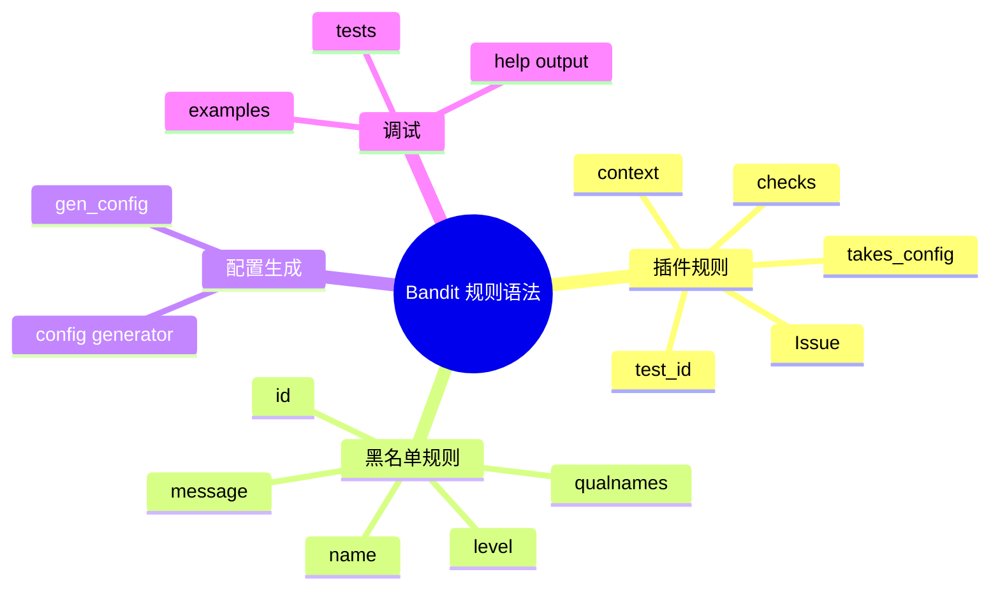

# 记忆卡片摘要（快速复习版）

## 1. 大纲（压缩版）
- Bandit 规则“语法”指什么
- 普通插件规则的装饰器、函数签名、返回值
- `Context` 常用字段怎么取
- `gen_config`、`@takes_config` 如何协作
- 黑名单规则的数据结构怎么写
- 常见规则写法模板、反例与调试方法

## 2. 思维导图（Mermaid）


## 3. 重要知识点（必须记住）
- Bandit 普通规则本质上就是“带装饰器的 Python 函数”，常见组合是 `@test.checks(...)`、`@test.test_id(...)`、`@test.takes_config(...)`。[来源1][来源2]
- 规则函数通常接收 `context`，必要时再接收 `config`；匹配成功时返回 `bandit.Issue(...)`，否则返回 `None`。[来源3][来源4]
- `Context` 不是 AST 原生对象，而是 Bandit 包的一层便捷访问接口，帮助你快速取调用名、参数、关键字参数、字符串字面量等信息。[来源5]
- 黑名单规则不是函数里写逻辑，而是返回规定字段的数据字典。[来源6]

## 4. 难点 / 易混点
- `@checks("Call")` 不是说“只看函数名里有 call”，而是绑定到 AST 节点类型 `Call`。
- `@takes_config` 不会自动生成默认配置；默认配置来自模块级 `gen_config()`。
- 返回 `Issue` 只是“发现疑点”，不代表漏洞已被证实。

## 5. QA 快速复习卡片
- Q: 写一条最小 Bandit 规则最少要什么？
  A: `@checks` + `@test_id` + 一个接收 `context` 的函数。
- Q: 规则如何获取调用参数？
  A: 通过 `Context`，如 `context.call_args`、`context.call_keywords`。
- Q: 自定义配置默认值从哪来？
  A: 从模块级 `gen_config(name)`。
- Q: 黑名单规则为什么适合批量维护？
  A: 因为它更像声明式清单，不必每条都写完整逻辑。

## 6. 快速复现步骤（最短路径）
1. 读 `doc/source/plugins/index.rst`
2. 读 `bandit/core/test_properties.py`
3. 读 `bandit/core/context.py`
4. 读 `bandit/plugins/asserts.py`
5. 读 `bandit/blacklists/calls.py`

---

# 学习笔记正文（详细版）

## 0. 学习目标、读者画像与假设
- 主题：`Bandit 常用规则语法`
- 目标：让你读懂现有规则，并具备写最小自定义规则的能力。
- 读者画像：会一点 Python，但没写过 Bandit 插件。

## 1. 先把“规则语法”翻成大白话

Bandit 规则语法，不是指一种新 DSL，也不是专门的规则语言。它本质上还是 Python，只是约定了几个“写规则时必须遵守的接口和装饰器”。

所以它比很多安全平台更容易上手。你不是在学一门新语言，而是在学：
- 规则要挂在哪些 AST 节点上；
- 规则如何声明自己的 ID；
- 规则如何读取上下文和配置；
- 规则如何返回一个 `Issue`。

## 2. 普通插件规则的最小模板

官方文档给出的最小示例大意如下：

```python
@bandit.checks("Call")
def prohibit_unsafe_deserialization(context):
    if "unsafe_load" in context.call_function_name_qual:
        return bandit.Issue(
            severity=bandit.HIGH,
            confidence=bandit.HIGH,
            text="Unsafe deserialization detected."
        )
```

但如果你要写“正式可管理”的规则，通常还需要：
- `@test.test_id("Bxxx")`
- 必要时 `@test.takes_config(...)`

## 3. 三个核心装饰器

### 3.1 `@checks(...)`
定义这条规则监听哪些 AST 节点类型。[来源1][来源2]

典型写法：
- `@checks("Call")`
- `@checks("Import", "ImportFrom")`
- `@checks("Str")`
- `@checks("Assert")`
- `@checks("File")`

你可以把它理解成“订阅事件”：
- 规则不是对整棵树时时刻刻运行；
- 而是在遍历到指定类型节点时被调用。

### 3.2 `@test_id("Bxxx")`
定义规则 ID。

为什么重要：
- CLI `-t/-s` 靠它筛选；
- 输出报告靠它标识；
- `# nosec Bxxx` 靠它精准压制；
- 文档页名称通常也和它对应。

没有 `_test_id` 的插件会被跳过装载，这一点 `extension_loader` 已明确写死。[来源7]

### 3.3 `@takes_config(...)`
声明规则需要配置。

两种常见形式：
- `@test.takes_config`
- `@test.takes_config("shell_injection")`

区别在于后者可以给规则配置块起别名，让多个规则共享一套配置。典型例子就是 `shell_injection` 家族：`B602` 到 `B607` 都共用一组 `subprocess/shell/no_shell` 配置。[来源3]

## 4. `gen_config()` 怎么和规则语法配合

很多人第一次看 Bandit 规则会疑惑：配置默认值写在哪？

答案是模块级 `gen_config(name)`。[来源1][来源3]

例如 `asserts.py`：
- `gen_config("assert_used")` 返回 `{"skips": []}`
- 规则函数声明 `@test.takes_config`
- 如果用户没提供配置，Bandit 会自动调用 `gen_config` 拿默认值

这样设计的好处是：
- 规则默认可独立运行；
- 用户只在想覆盖默认行为时才需要写配置；
- `bandit-config-generator` 也能据此自动生成模板。

## 5. `Context` 是写规则时最重要的对象

### 5.1 为什么需要 `Context`
直接操作 AST 很硬核。你得自己判断节点类型、读属性、处理导入别名、推断参数。Bandit 用 `Context` 把常用操作封装好了。[来源5]

### 5.2 常用字段与方法
- `context.call_function_name`：函数短名
- `context.call_function_name_qual`：函数全名
- `context.call_args`：位置参数列表
- `context.call_keywords`：关键字参数字典
- `context.string_val`：字符串字面量
- `context.bytes_val`：字节串字面量
- `context.node`：原始 AST 节点
- `context.get_call_arg_value("shell")`：取某个关键字参数值

### 5.3 非科班理解方式
你可以把 `Context` 看成“规则作者的工具箱”。Bandit 已经把“从 AST 上取信息”这件麻烦事做了一层整理，所以你更多是在写业务判断，而不是写语法解析器。

## 6. `Issue`：规则怎么返回结果

规则命中时，通常返回 `bandit.Issue(...)`。常见字段包括：
- `severity`
- `confidence`
- `text`
- `cwe`
- `lineno`
- `test_id`

最小规则通常只填最核心几个字段。运行时 Bandit 会补上：
- 文件名
- 文件内容
- 行范围
- 测试函数名
- 缺失的 test_id（如果没显式填，会用装饰器上的 `_test_id`）。[来源8]

## 7. 典型规则源码拆解

### 7.1 `B101 assert_used`
这个规则非常适合作为“最小可读范例”：
- 用 `@checks("Assert")`
- 用 `@test_id("B101")`
- 用 `@takes_config`
- 如果当前文件名匹配配置里的 skip 模式，就返回 `None`
- 否则返回一个 `LOW/HIGH` 组合的 `Issue`。[来源4]

它告诉你：Bandit 规则可以非常短，但仍然具备完整工程属性。

### 7.2 `B602 subprocess_popen_with_shell_equals_true`
这是一个更接近真实工程复杂度的例子：
- 节点类型是 `Call`
- 共享 `shell_injection` 配置
- 要判断调用名是否在配置的 `subprocess` 列表中
- 要判断 `shell=True`
- 要根据命令字符串形式评估严重度

这说明 Bandit 规则虽然简单，但并不只能做一层 if 判断。

## 8. 黑名单规则语法

### 8.1 黑名单不是这样写函数逻辑
黑名单插件通常返回一个字典，键是 AST 节点类型，值是一组规则项。[来源6]

每个规则项至少包含：
- `name`
- `id`
- `qualnames`
- `message`
- `level`

### 8.2 为什么黑名单适合某些场景
如果你要维护的是“这批 API 都危险，只要撞到就提醒”，黑名单特别方便。比如：
- 不安全反序列化调用
- 弱哈希算法
- 危险导入

相比每条都写一个单独函数，声明式清单更容易维护，也更方便批量扩展。

## 9. 规则写作的常见模式

### 9.1 节点型规则
例：看到 `Assert`、`Import`、`Call` 就检查。

### 9.2 参数型规则
例：看到 `Call` 后，再检查关键字参数 `shell=True`、`verify=False`、`timeout` 是否缺失。

### 9.3 名单型规则
例：调用名是否出现在危险函数清单里。

### 9.4 文件型规则
例：不是靠 AST 某个节点，而是直接对整个文件文本做检查，这时可以监听 `File`。

## 10. 常见反例与踩坑点

### 10.1 只写了 `@checks` 没写 `@test_id`
结果：插件可能根本不会被正常加载进规则集。

### 10.2 写了 `@takes_config` 但没有 `gen_config`
结果：如果用户没提供配置，规则可能拿不到默认值；设计上不完整。

### 10.3 误把 `context.call_function_name` 当成全限定名
结果：在别名导入或不同模块重名函数下容易判断不准，很多时候应优先看 `call_function_name_qual`。

### 10.4 直接把“命中规则”当成“确定漏洞”
结果：过度自信。Bandit 规则输出的是可疑点与审计建议，不是漏洞验证报告。

## 11. 一条最小自定义规则的教学模板

```python
import bandit
from bandit.core import test_properties as test

@test.checks("Call")
@test.test_id("B9XX")
def forbid_eval_like(context):
    if context.call_function_name_qual in {"eval", "builtins.eval"}:
        return bandit.Issue(
            severity=bandit.HIGH,
            confidence=bandit.HIGH,
            text="Do not use eval on untrusted input."
        )
```

这个模板说明了 4 个最低要求：
- 订阅节点；
- 声明 ID；
- 读取上下文；
- 返回 Issue。

## 12. 官方文档章节映射与重要例子保留检查

| 官方章节 | 与本文关系 | 本文对应位置 |
| --- | --- | --- |
| Plugins/index Writing Tests | 规则装饰器与函数结构 | 第 2 到第 5 节 |
| Plugins/index Config Generation | `gen_config` | 第 4 节 |
| Plugins/index Example Test Plugin | 最小规则模板 | 第 2 节、第 11 节 |
| Blacklists/index | 黑名单数据结构 | 第 8 节 |
| Context 源码 | 常用字段 | 第 5 节 |

重要例子保留情况：
- 官方 `prohibit_unsafe_deserialization` 示例已保留并解释。
- 官方 `gen_config` 机制已单独展开。
- 官方黑名单字段结构已完整保留。

## 13. 延伸学习路径（官方优先）
- 先读 `plugins/index.html`。[来源1]
- 再读 `test_properties.py`，看装饰器本身做了什么。[来源2]
- 再读 `context.py`。[来源5]
- 最后从 `asserts.py` 和 `injection_shell.py` 两端各学一遍：一个简单，一个复杂。[来源3][来源4]

---

# 练习与复习闭环

## 1. 分层练习

### 基础练习
- 解释 `@checks`、`@test_id`、`@takes_config` 各自作用。
- 说出 5 个 `Context` 常用字段。
- 解释 `gen_config` 为什么重要。

### 应用练习
- 模仿 `B101` 写一条你自己的最小规则。
- 给规则增加一个配置项，并写出 `gen_config`。
- 用黑名单结构表达一组危险 API。

### 综合练习
- 比较“写普通插件规则”和“写黑名单规则”的适用场景，写一段 500 字说明。

## 2. 动手任务（带验收标准）
- 任务：写一条检查 `eval` 的最小 Bandit 插件草稿。
- 验收标准：
  - 有 `@checks("Call")`
  - 有 `@test_id`
  - 读取 `context.call_function_name_qual`
  - 返回 `bandit.Issue`

## 3. 常见误区纠偏
- 误区：Bandit 规则语法是一门独立 DSL。
  正解：本质还是 Python + 约定好的装饰器与接口。
- 误区：黑名单规则“低级”。
  正解：它只是更声明式，适合批量名单型问题。
- 误区：规则一旦命中就说明漏洞确定存在。
  正解：它表示高价值审计线索。

## 4. 复习节奏建议
- Day 1：背下三大装饰器。
- Day 3：默写最小规则模板。
- Day 7：读懂 `B101` 和 `B602`。
- Day 14：尝试写公司内部第一条自定义规则草稿。

## 5. 自测题与参考答案（简版）
- 题目1：`@takes_config("shell_injection")` 的价值是什么？
  参考答案：让多个规则共享同一配置块。
- 题目2：为什么 `Context` 能降低写规则门槛？
  参考答案：它把 AST 常用读取操作封装成便捷接口。
- 题目3：黑名单规则至少要提供哪些字段？
  参考答案：`name`、`id`、`qualnames`、`message`、`level`。

---

# 参考来源与版本说明

## 官方来源（优先）
1. [Bandit Plugins Index](https://bandit.readthedocs.io/en/latest/plugins/index.html) - 访问日期：2026-03-23 - 规则写法、配置生成、示例插件。[来源1]
2. [bandit/core/test_properties.py](https://github.com/PyCQA/bandit/blob/main/bandit/core/test_properties.py) - 访问日期：2026-03-23 - 装饰器实现。[来源2]
3. [bandit/plugins/injection_shell.py](https://github.com/PyCQA/bandit/blob/main/bandit/plugins/injection_shell.py) - 访问日期：2026-03-23 - 复杂规则与共享配置示例。[来源3]
4. [bandit/plugins/asserts.py](https://github.com/PyCQA/bandit/blob/main/bandit/plugins/asserts.py) - 访问日期：2026-03-23 - 简单规则示例。[来源4]
5. [bandit/core/context.py](https://github.com/PyCQA/bandit/blob/main/bandit/core/context.py) - 访问日期：2026-03-23 - 上下文接口。[来源5]
6. [Bandit Blacklist Plugins](https://bandit.readthedocs.io/en/latest/blacklists/index.html) - 访问日期：2026-03-23 - 黑名单规则结构。[来源6]
7. [bandit/core/extension_loader.py](https://github.com/PyCQA/bandit/blob/main/bandit/core/extension_loader.py) - 访问日期：2026-03-23 - 没有 test_id 的插件会被跳过。[来源7]
8. [bandit/core/tester.py](https://github.com/PyCQA/bandit/blob/main/bandit/core/tester.py) - 访问日期：2026-03-23 - `Issue` 补全与结果收集。[来源8]

## 第三方来源（按采信程度标注）
- 无。

## 关键结论引用映射
- [来源1] -> 官方规则写法主线
- [来源2] -> 三大装饰器
- [来源3] -> 复杂规则示例
- [来源4] -> 简单规则示例
- [来源5] -> Context 能力
- [来源6] -> 黑名单字段结构
- [来源7] -> test_id 必要性
- [来源8] -> Issue 结果处理

## 技术版本与文档版本说明
- 版本参考：`Bandit 1.9.4`
- 访问日期：`2026-03-23`
