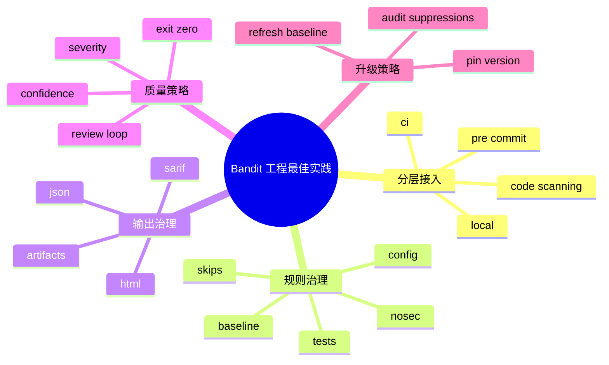

# 记忆卡片摘要（快速复习版）

## 1. 大纲（压缩版）
- 在真实工程里怎么用 Bandit 才不痛苦
- 本地开发、pre-commit、CI/CD、代码扫描平台的分层接入
- baseline、`# nosec`、规则裁剪、阈值控制
- 报告格式、输出归档、误报复核、升级策略
- 针对老项目与新项目的不同落地路径
- 常见反模式：全量硬拦、长期不清 baseline、滥用 nosec

## 2. 思维导图（Mermaid）

## 3. 重要知识点（必须记住）
- 最好的 Bandit 落地方式不是“一上来全量拦截”，而是分层：本地快速反馈、pre-commit 轻量阻断、CI 做正式报告、代码扫描平台做长期归档。[来源1][来源2][来源3]
- 老项目优先用 `baseline` 处理历史债务，新项目优先直接建立严格门槛。
- `# nosec` 应该被视为“有理由的局部豁免”，而不是消音器；最好总是带规则 ID 或规则名。[来源4]
- 规则治理的核心不是“跑最多规则”，而是“跑最适合你代码库的规则，并建立复核闭环”。

## 4. 难点 / 易混点
- `--exit-zero` 是落地阶段策略，不是永久默认值。
- baseline 是过渡工具，不是永恒挡箭牌。
- 严重度和置信度阈值要和团队复核能力匹配，不要照抄别人模板。

## 5. QA 快速复习卡片
- Q: 老项目一上来该怎么接？
  A: 先产出 JSON 报告建立 baseline，再只拦新增问题。
- Q: 新项目最推荐的最低配置是什么？
  A: pre-commit + CI JSON/HTML 输出 + 明确 `tests/skips` 与 `# nosec` 规范。
- Q: 为什么推荐输出 JSON？
  A: 便于机器消费、归档、二次分析和 baseline 比对。
- Q: 为什么不建议满地都是 `# nosec`？
  A: 因为它会把真实新增问题也一起淹没。

## 6. 快速复现步骤（最短路径）
1. `bandit -r . -f json -o bandit-report.json`
2. `bandit -r . -b bandit-report.json -f json -q`
3. 在 `pre-commit` 中加入官方 hook
4. 在 GitHub Actions 中使用官方 `PyCQA/bandit-action`

---

# 学习笔记正文（详细版）

## 0. 学习目标、读者画像与假设
- 主题：`典型漏洞扫描工程最佳实践`
- 目标：把 Bandit 从“会用命令”推进到“会做工程治理”。
- 读者画像：准备在团队项目中接入 Bandit 的开发者、安全工程师或平台工程师。

## 1. 最先记住的一句话

Bandit 最好的使用方式，不是把它当成“最后一关的审判机器”，而是当成“贯穿开发、提交、CI、归档与复核的基础安全信号源”。

如果你只在发布前手动跑一次，那它的价值会被严重低估。

## 2. 分层接入策略

### 2.1 本地开发层：快、轻、可反复
目标不是做最严格审计，而是让开发者尽快看到明显问题。

推荐做法：
- 默认命令尽量快：`bandit -r src -q`
- 结果格式以终端文本或 screen 为主
- 不要一开始就塞过多自定义策略，先保证大家愿意跑

为什么重要：
- 安全问题离编写时刻越近，修复成本越低；
- 开发者愿意主动修，就不必全部压到 CI。

### 2.2 pre-commit 层：提交前轻量阻断
官方 `Getting Started` 明确给出了 `pre-commit` 集成示例。[来源1]

最佳实践：
- 固定 `rev` 到真实 tag，而不是浮动主分支；
- 让 pre-commit 只做相对快速、稳定的检查；
- 对误报高、争议大的规则谨慎纳入默认提交阻断。

### 2.3 CI 层：正式报告与质量门槛
CI 是 Bandit 最常见的主战场。官方文档已经给了 GitHub Actions 示例，且 `bandit-action` 的输入和 CLI 参数基本一一对应。[来源3]

CI 层建议至少做到：
- 输出 JSON 作为机器归档格式；
- 输出 HTML 或平台原生可视化格式给人看；
- 显式设置严重度/置信度门槛；
- 对老项目使用 baseline；
- 对新项目不使用长期 baseline。

### 2.4 代码扫描平台层：长期趋势与审计归档
如果环境允许，优先把结果归入代码扫描平台或制品库。这样你可以回答：
- 本月新增多少问题；
- 哪些规则最常见；
- 哪些仓库 suppressions 最多；
- 规则升级后噪音有没有暴增。

## 3. 老项目与新项目应采用不同策略

### 3.1 老项目：先治理新增问题
老项目最大的现实问题不是“规则不够”，而是“一跑几百条，没人处理”。我本地扫官方 `examples/` 都得到 `597` 条结果，可想而知历史项目会有多吵。

推荐路径：
1. 先全量输出 `bandit-report.json`
2. 把这份报告作为 baseline
3. 在 CI 中只拦 baseline 之外的新增问题
4. 定期安排债务清理窗口，逐步缩小 baseline

这样做的好处：
- 团队不会被历史噪音瞬间压垮；
- 新增代码质量从第一天开始变好；
- 治理工作可持续。

### 3.2 新项目：尽早建立干净基线
新项目没有历史包袱，最适合：
- 直接接入 pre-commit
- CI 默认拦截高严重度/高置信度问题
- 配置文件一开始就版本化管理
- 对 `# nosec` 建立审计规范

## 4. 规则治理最佳实践

### 4.1 不要迷信“全量默认规则就是最好”
Bandit 默认规则很有价值，但你的工程未必需要全部无脑开启。最佳实践是：
- 先全量了解默认规则；
- 再根据技术栈裁剪；
- 用 `tests` 和 `skips` 固定团队共识；
- 对共享规则配置写进 `pyproject.toml` 或 `bandit.yaml`。[来源4]

### 4.2 高噪音规则要么调配置，要么明确策略
例如 shell injection 家族、某些模板/XSS 规则、某些密码学规则，常因项目上下文不同导致噪音差异较大。不要让开发者自己猜，最好在配置文件中明确：
- 我们是否跑这类规则
- 如果跑，是否要改默认配置
- 误报出现时该怎么申诉

### 4.3 `tests` 与 `skips` 的团队治理原则
- `tests` 更适合“只选一小撮关键规则”的场景
- `skips` 更适合“默认全跑，只排除少量不适用规则”的场景
- 两者不要同时堆太多，否则团队很快失去可解释性

## 5. suppressions 治理：baseline 与 `# nosec`

### 5.1 baseline 适合解决什么
适合“历史结果太多，但我又想从今天开始盯新增”的问题。

不适合什么：
- 不适合无限期不更新；
- 不适合拿来掩盖持续出现的新问题；
- 不适合代替人工分类。

### 5.2 `# nosec` 适合解决什么
适合“这个具体位置经过人工确认，当前规则结论不适用”的局部豁免。[来源4]

最佳实践：
- 优先写成 `# nosec B602` 而不是裸 `# nosec`
- 在代码审查里要求说明理由
- 定期回看 suppressions 是否还成立

### 5.3 为什么建议写具体规则 ID
因为官方文档已经提醒：一行代码可能同时触发多个问题，如果你用裸 `# nosec`，以后新引入的别的问题也可能一起被吞掉。[来源4]

## 6. 输出与归档最佳实践

### 6.1 机器消费优先选 JSON
原因很简单：
- baseline 依赖 JSON
- 二次分析方便
- 可以统计趋势、Top 规则、按仓库聚合

### 6.2 给人看的材料可选 HTML
HTML 适合：
- 安全周报
- 附件归档
- 临时审计结果共享

### 6.3 代码扫描平台优先 SARIF，但要注意依赖
官方源码声明支持 `sarif` formatter，但当前环境需要安装 `bandit[sarif]` 对应依赖才会真正可用。[来源5]
所以最佳实践不是“文档说支持就直接写进流水线”，而是：
1. 先在 CI 镜像里确认 formatter 真能加载
2. 再启用 SARIF 上传

## 7. 门槛策略最佳实践

### 7.1 严重度与置信度不要拍脑袋
你至少要回答：
- 我们团队能接受多少误报？
- 我们更怕漏报还是更怕噪音？
- 这条流水线是阻断型还是观察型？

### 7.2 推荐分阶段门槛
- 阶段 1：`--exit-zero`，只收报告
- 阶段 2：拦 `high/high`
- 阶段 3：视团队成熟度扩展到 `medium/high` 或更广

### 7.3 为什么这比一开始全拦更好
因为安全工具落地失败最常见的原因不是“发现不了问题”，而是“大家被噪音烦到关掉它”。

## 8. 版本与升级最佳实践

### 8.1 固定版本
无论是 pre-commit 还是 CI，都建议固定 Bandit 版本。否则规则升级会让结果集突然变化，团队很难判断是代码变差还是工具变了。

### 8.2 升级前先做对比
升级 Bandit 时，建议：
1. 在同一份代码上同时跑旧版和新版
2. 统计新增规则数和新增结果数
3. 抽样看 20 条新增结果值不值得接收

### 8.3 升级后刷新 baseline
如果规则集显著变化，不要继续沿用老 baseline；否则会把工具演进带来的有效结果也一起屏蔽。

## 9. 组织层面的最佳实践

### 9.1 给团队一个统一配置文件
把以下内容收敛到版本库：
- `tests` / `skips`
- 插件配置
- 排除目录
- `pre-commit` 配置
- CI 配置

### 9.2 建立“谁来复核”的流程
Bandit 只是发信号，真正的价值取决于：
- 谁来 triage
- 多久处理
- 什么叫 accepted risk
- 什么时候允许 `# nosec`

### 9.3 用数据驱动改进
推荐定期统计：
- Top 10 规则
- suppressions 数量
- baseline 变化趋势
- 仓库间噪音差异

## 10. 一个可落地的参考方案

### 10.1 新项目参考
- 本地：`bandit -r src -q`
- pre-commit：官方 hook，固定 tag
- CI：`bandit -r . -f json -o bandit-report.json`
- 门槛：先拦 `high/high`
- suppressions：必须写具体规则 ID

### 10.2 老项目参考
- 第一天：全量出 JSON，生成 baseline
- 第一阶段 CI：`-b baseline.json -f json -q`
- 第二阶段：定期削减 baseline
- 第三阶段：逐步收紧严重度/置信度门槛

## 11. 官方文档章节映射与重要例子保留检查

| 官方章节 | 与本文关系 | 本文对应位置 |
| --- | --- | --- |
| Getting Started | pre-commit 与 baseline 入门 | 第 2 节、第 5 节 |
| Configuration | `# nosec`、tests/skips、配置覆盖 | 第 4 节、第 5 节 |
| Integrations | IDE、CI/CD、工具生态 | 第 2 节 |
| GitHub Actions | 官方 CI 方案 | 第 2.3 节 |
| Formatters | JSON/HTML/SARIF 输出治理 | 第 6 节 |

重要例子保留情况：
- 官方 pre-commit 示例已吸收进第 2.2 节。
- 官方 baseline 用法已吸收进第 3 节和第 5 节。
- 官方 GitHub Actions 示例已吸收进第 2.3 节。

## 12. 延伸学习路径（官方优先）
- 先读 `start.html` 的 pre-commit 与 baseline。[来源1]
- 再读 `config.html` 的 `# nosec` 与配置覆盖。[来源4]
- 再读 `integrations.html` 与 GitHub Actions 文档。[来源2][来源3]
- 最后结合你自己的仓库设计一套分阶段门槛方案。

---

# 练习与复习闭环

## 1. 分层练习

### 基础练习
- 说出 Bandit 在本地、pre-commit、CI 各自最适合做什么。
- 解释 baseline 和 `# nosec` 的区别。
- 解释为什么推荐输出 JSON。

### 应用练习
- 给一个老项目设计 baseline 接入方案。
- 给一个新项目设计 pre-commit + CI 方案。
- 写一份 `# nosec` 使用规范草案。

### 综合练习
- 选一个你的真实项目，写出 Bandit 落地路线图：第 1 周做什么，第 1 个月做什么，第 1 个季度做什么。

## 2. 动手任务（带验收标准）
- 任务：写一份团队内 Bandit 接入 RFC。
- 验收标准：
  - 包含分层接入方案；
  - 包含 baseline 计划；
  - 包含 suppressions 规范；
  - 包含升级与回归策略。

## 3. 常见误区纠偏
- 误区：安全工具越严越好。
  正解：太吵的工具会被绕过，最佳实践是可持续治理。
- 误区：baseline 建一次就万事大吉。
  正解：baseline 需要定期更新和缩减。
- 误区：`# nosec` 是开发自由。
  正解：它应该是有审计痕迹的例外处理。

## 4. 复习节奏建议
- Day 1：记住分层接入图。
- Day 3：写出老项目和新项目两套落地路径。
- Day 7：复盘你团队最可能滥用的 suppressions 方式。
- Day 14：把升级策略和报表统计补齐。

## 5. 自测题与参考答案（简版）
- 题目1：为什么老项目推荐先上 baseline？
  参考答案：因为历史噪音过多，先盯新增问题更可持续。
- 题目2：为什么建议 `# nosec` 带规则 ID？
  参考答案：避免未来新增的别的问题被一并吞掉。
- 题目3：`--exit-zero` 应该永远开吗？
  参考答案：不应该，它更适合观察期或过渡阶段。

---

# 参考来源与版本说明

## 官方来源（优先）
1. [Bandit Getting Started](https://bandit.readthedocs.io/en/latest/start.html) - 访问日期：2026-03-23 - pre-commit、baseline 入门。[来源1]
2. [Bandit Integrations](https://bandit.readthedocs.io/en/latest/integrations.html) - 访问日期：2026-03-23 - IDE、CI/CD 生态。[来源2]
3. [Bandit GitHub Actions 文档](https://bandit.readthedocs.io/en/latest/ci-cd/github-actions.html) - 访问日期：2026-03-23 - 官方 GitHub Actions 示例。[来源3]
4. [Bandit Configuration](https://bandit.readthedocs.io/en/latest/config.html) - 访问日期：2026-03-23 - `# nosec`、tests/skips、配置覆盖。[来源4]
5. [Bandit setup.cfg](https://github.com/PyCQA/bandit/blob/main/setup.cfg) - 访问日期：2026-03-23 - SARIF extra 与格式器注册。[来源5]

## 第三方来源（按采信程度标注）
- 无。

## 关键结论引用映射
- [来源1] -> pre-commit、baseline
- [来源2] -> 集成生态
- [来源3] -> GitHub Actions 最佳实践
- [来源4] -> suppressions 与配置治理
- [来源5] -> SARIF 与 extras 依赖

## 技术版本与文档版本说明
- 参考版本：`Bandit 1.9.4`
- 访问日期：`2026-03-23`
