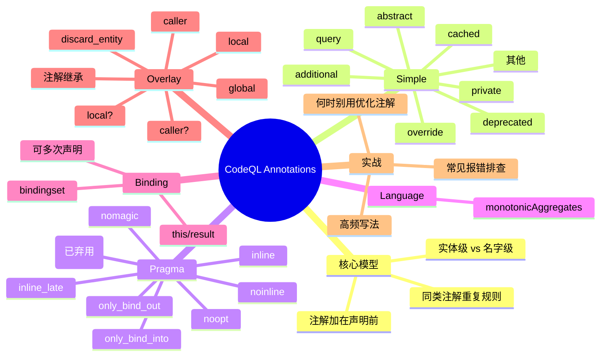

# 记忆卡片摘要（快速复习版）

## 1. 大纲（压缩版）
- 注解（Annotations）是什么：给 QL 声明前加“语义标签”
- 两大作用对象：作用于实体（entity） vs 作用于名字（name）
- 5 大家族：`simple`、`pragma[...]`、`language[...]`、`bindingset[...]`、`overlay[...]`
- 必学高频：`private`、`deprecated`、`override`、`query`、`cached`、`bindingset[...]`
- 性能相关：`pragma[inline/noinline/noopt...]`、`cached`
- 增量分析相关：`overlay[...]`（多数普通查询作者只需“能看懂报错”）
- 典型坑：注解放错位置、把“名字级注解”误当“实体级注解”、`bindingset` 变量写错

## 2. 思维导图（Mermaid）


> Mermaid 检查说明：
> 1) 已完成人工语法自检（层级、缩进、节点文本、括号配对）；
> 2) 尝试编译验证：`timeout 20s npx -y @mermaid-js/mermaid-cli --version`，结果 `EXIT:124`（超时），当前环境无法完成编译验证；
> 3) 文末提供本地可执行编译命令。

## 3. 重要知识点（必须记住）
- 注解是放在声明前的语法标签，用来改变可见性、优化行为、绑定行为或查询属性。[来源1][来源2]
- 不是所有注解都作用在“实体本体”：`private/deprecated/final/library/query/additional` 这类是名字级语义，`cached/overlay/bindingset/pragma` 等更多是实体或求值行为语义。[来源1][来源2]
- `private` 修饰的是“这个名字”，同一实体可通过别名继续访问。[来源1][来源2]
- `bindingset[...]` 描述“哪些参数先被有限约束后，谓词/类整体可有限求值”，写错变量会直接编译错误。[来源1][来源2]
- `overlay[...]` 只在 overlay 编译与评估模式下影响执行；普通自定义 query pack 通常不需要启用。[来源1]
- `pragma[assume_small_delta]` 已弃用且无效果，可安全删除。[来源1]

## 4. 难点 / 易混点
- `cached` 与 `private` 的差别：前者作用于实体行为，后者主要作用于名字可见性。[来源1]
- `deprecated` 标在 alias 上时，弃用的是 alias 名字，不是被指向实体本体。[来源2][来源4]
- `bindingset` 是“有限性/绑定合同”，不是“性能开关”；先确保语义正确，再谈优化。[来源1][来源2]
- `overlay[local]` 不能依赖 global 声明；遇到错误常需改为 `local?` 或补全依赖链注解。[来源1]

## 5. QA 快速复习卡片
- Q: 注解能不能随便加在任何声明前？
  A: 不能。每种注解有允许的语法位置，规范里有矩阵约束。[来源2]
- Q: `private` 后，实体就彻底不可见了吗？
  A: 不是。它限制当前名字；实体若有其他可见别名仍可访问。[来源1][来源2]
- Q: `pragma[noopt]` 什么时候用？
  A: 仅在 GitHub 建议或明确性能排障时；它会关闭大部分自动优化，副作用大。[来源1]
- Q: `bindingset` 可以写多个吗？
  A: 可以，同一谓词可声明多个绑定集。[来源2]
- Q: `overlay` 注解平时有影响吗？
  A: 非 overlay 模式下只做校验，通常不改变求值行为。[来源1]

## 6. 快速复现步骤（最短路径）
1. 通读官方 `Annotations` 页面，先建立“实体级 vs 名字级”心智模型。[来源1]
2. 对照 `QL language specification` 的注解语法与合法位置矩阵，避免写法违规。[来源2]
3. 先练 3 组最小例子：`private+alias`、`deprecated`、`bindingset[...]`。
4. 再看 `Modules` / `Aliases` 页面理解 `private import` 与 alias 注解语义。[来源3][来源4]
5. 最后用 1 个带 metadata 的 query 练 `query` 注解与 `@kind` 的关系。[来源5]

---

# 学习笔记正文（详细版）

## 0. 学习目标、读者画像与假设
- 技术：`CodeQL / QL language` 的 `Annotations`
- 学习目标：系统掌握 CodeQL 注解体系，能正确读写常见注解并定位典型编译/性能问题
- 读者水平：初学（默认）
- 时间预算：标准版（约 1-3 小时）
- 版本范围：以 `codeql.github.com` 官方文档当前内容为准
- 文档访问日期：`2026-02-27`
- 运行环境：当前目录可写；示例以语法与机制讲解为主，未对每个示例执行完整数据库求值
- 假设与限制：
  - 用户给出的资源是官方 `Annotations` 页面
  - 我补充了官方 `QL language specification`、`Modules`、`Aliases`、`About CodeQL queries` 用于交叉验证
  - Mermaid 图未在当前环境完成编译验证（见顶部说明）

## 1. 背景与用途（从读者视角）

### 1.1 为什么 Annotations 很关键
QL 不是“只写 where 条件”的语言。你还要告诉编译器和求值器：
- 这个名字是不是公开的（`private`）
- 这个 API 是否准备弃用（`deprecated`）
- 这个谓词如何被优化器处理（`pragma[...]`、`cached`）
- 这个谓词的绑定合同是什么（`bindingset[...]`）
- 这个声明在 overlay 增量分析中是 local 还是 global（`overlay[...]`）

所以注解是“行为控制层”，不只是文档标签。[来源1][来源2]

### 1.2 不用/误用注解会怎样
- 可见性失控：内部实现暴露到外部模块（缺少 `private`）[来源1][来源3]
- 迁移困难：旧 API 无法平滑替换（缺少 `deprecated`）[来源1][来源4]
- 性能不稳定：盲目 `cached` 或 `noopt` 可能让查询更慢或占更多存储 [来源1]
- 编译错误：注解用在不合法位置，或 `bindingset` 参数不合法 [来源2]

## 2. 核心概念与术语（直白解释）

### 2.1 注解是什么
注解是放在声明前的字符串标记，用来给 QL 实体或名字附加语义。[来源1]

### 2.2 实体级 vs 名字级
这是学习注解的第一分水岭。
- 实体级（Entity-level）：影响实体本体行为，如 `cached`、`pragma[...]`、`bindingset[...]`、`overlay[...]`。
- 名字级（Name-level）：影响某个“名字”本身，如 `private`、`deprecated`、`query`。

官方明确给出这一区分，并给了 `private + alias` 的反例：同一实体可换名字继续访问。[来源1]

`必须记住`
- 同一个声明“看起来只写了一次”，但它可能同时涉及“实体”和“名字”两层语义。

### 2.3 注解家族
按语法可分为：
- Simple annotations：`abstract/additional/cached/...` [来源2]
- Parameterized annotations：
  - `pragma[...]`
  - `language[...]`
  - `bindingset[...]`
  - `overlay[...]` [来源2]

### 2.4 合法性规则（规范层）
- 注解不是任意组合。不同声明位置支持的注解不同（规范有矩阵）。[来源2]
- 同一 simple annotation 不应在同一注解列表重复；参数化注解同参也不可重复。[来源2]

## 3. 工作原理 / 机制（先直观后严格）

### 3.1 直观版
把注解想成“编译器开关 + 可见性策略 + 求值提示”：
- `private/deprecated/query` 管“名字如何被使用或提示”
- `cached/pragma/bindingset/overlay` 管“怎么算、在哪算、怎么约束”

### 3.2 严格版
- 语法层：注解属于声明语法前缀，受文法与位置约束。[来源2]
- 名字解析/可见性层：`private/deprecated` 与 alias、import 共同作用。[来源1][来源3][来源4]
- 优化与求值层：`cached`、`pragma[...]`、`bindingset[...]`、`overlay[...]` 参与优化与绑定策略。[来源1][来源2]

### 3.3 注解继承（重点在 overlay/language）
- `overlay[...]` 和 `language[...]` 都是“作用域级（scope-level）注解”：标在外层作用域后，会传递给内层声明。[来源1][来源2]

#### 3.3.1 第一层：先用一句话建立直觉
把注解继承理解为“外层默认策略，内层可覆写”：
- 你在 `module` 或 `class` 上写的策略，会成为内部成员的默认策略。
- 内部成员如果自己再写注解，就以“自己写的”为准（显式覆盖）。
- 如果内部成员没写，就沿着“最近一层有注解的外层”往上找。[来源1]

#### 3.3.2 第二层：严格规则（就近继承 + 显式覆盖）
对 `overlay[...]`，官方规则可落成 3 条判断：[来源1][来源2]
1. 当前声明有显式 `overlay[...]`：直接用当前声明的值。
2. 当前声明没有显式值：继承“最近外层”带的 `overlay[...]`。
3. 整条作用域链都没有：默认按 global 处理。

对 `language[...]`（当前主要是 `language[monotonicAggregates]`），规则同样是“作用域级并向内继承”。[来源2]

`必须记住`
- 继承是“就近原则”，不是“最外层永远生效”。
- `overlay[global]` 常见用途不是“声明默认值”，而是在一个已局部化的外层里显式“跳出局部策略”。[来源1]

#### 3.3.3 第三层：overlay 继承在真实调用链里的含义
只记语法不够，生产中你真正踩坑发生在“调用链”：
- 若你把外层模块设成 `overlay[local]`，内层大部分谓词会自动变 local。
- 这些 local 谓词一旦调用了 global 谓词，就会触发经典报错（local depends on global）。[来源1]
- 这就是为什么在大型查询库里，很多团队更偏好外层 `local?`，让局部性按依赖自动收敛，而不是硬性 local。

#### 3.3.4 第四层：生产实践模式 A（外层 local? + 内层显式 global 逃逸）
这个模式最常见：默认追求增量友好，但给个别全局逻辑开“逃逸口”。

```ql
overlay[local?]
module DiffAwareData {
  class CandidateExpr extends @expr {
    CandidateExpr() { this instanceof AddExpr }

    // 未显式标注，继承 overlay[local?]
    predicate inChangedFile() {
      exists(string f | f = getFile(this) and overlayChangedFiles(f))
    }

    // 这个逻辑天然跨全局索引，显式覆盖为 global
    overlay[global]
    predicate hasGlobalSummary() {
      exists(@call c | c = this.getAReachableCall())
    }
  }
}
```

解释（递归拆解）：
- 外层 `module` 定了“默认策略”。
- `inChangedFile()` 没写注解，所以继承外层策略。
- `hasGlobalSummary()` 明确写了 `overlay[global]`，因此不再继承。
- 这样既保留了局部可增量的主干，也允许少量全局逻辑存在。

#### 3.3.5 第五层：生产实践模式 B（分层模块，减少继承污染）
当项目大了，最怕“一个外层注解误伤整个模块”。可用“模块分层”隔离继承范围：

```ql
module OverlayPipeline {
  // Layer 1: 仅做局部抽取
  overlay[local]
  module LocalExtract {
    predicate changedExpr(@expr e) {
      exists(string f | f = getFile(e) and overlayChangedFiles(f))
    }
  }

  // Layer 2: 全局汇总，避免和 local 混在同一继承链
  overlay[global]
  module GlobalResolve {
    predicate sinks(@expr e) { exists(@expr x | x = e) }
  }
}
```

工程收益：
- 继承边界清晰，排错时不用在超长调用链里猜“谁继承了谁”。
- 本地局部优化和全局聚合分仓，review 更容易发现不当依赖。

#### 3.3.6 第六层：`language[...]` 继承的生产用法（限制作用域，避免全局副作用）
`language[monotonicAggregates]` 也是作用域继承。[来源2]
生产实践不建议“全仓一把梭”，而是只包在需要该语义的模块里：

```ql
module Metrics {
  language[monotonicAggregates]
  module MonotonicPart {
    // 这里的声明继承 monotonicAggregates 语言语义
    predicate score(@expr e, int s) {
      exists(@expr x | x = e and s >= 0)
    }
  }

  module LegacyPart {
    // 不继承上面的 language pragma，保持默认语言行为
    predicate legacyScore(@expr e, int s) { s = 0 and e = e }
  }
}
```

工程收益：
- 把“语言行为改变”局限在小模块，降低回归范围。
- 新成员读代码时，可以通过模块边界快速知道“这段是否启用了特殊语言语义”。

#### 3.3.7 第七层：排错决策树（你在生产里真正会用）
当遇到 overlay 继承相关错误时，按这个顺序排查：
1. 当前报错声明是否“隐式继承”了某个外层 `overlay[...]`。
2. 在调用链上定位第一个 global 依赖点。
3. 判断该声明是“必须 local”还是“可以 local?/caller?”。
4. 若必须保留 global 依赖，考虑把该声明显式改 `overlay[global]`，并与 local 主干解耦。[来源1]

> 说明：本节代码用于生产模式讲解，未在当前环境对真实数据库执行验证。

## 4. 核心 API / 语法 / 组件 / 命令（按技术类型适配）

## 4.1 Simple annotations（按学习优先级）

### A. 高频必学
- `private`：限制该名字的可见性；可配合 alias 暴露替代名。[来源1][来源2]
- `deprecated`：标记名字已弃用，使用时应产生弃用告警。[来源1][来源2]
- `override`：用于成员谓词重写抽象或父类成员。[来源1]
- `query`：把无参谓词标记为 query 谓词（常配合 metadata 使用）。[来源1][来源2][来源5]
- `cached`：将实体整体求值并缓存，后续复用结果；有存储与优化副作用。[来源1]

### B. 模块/签名体系常见
- `additional`：在实现 module signature 时，对“签名未要求但额外声明”的标记；用错上下文会编译错误。[来源1]
- `final`：用于阻止进一步重写/别名语义相关约束；规范说明对 alias 的适用有细分（类型 alias 可，模块/谓词 alias 不可）。[来源2]
- `library`：仅适用于 QLL，不适用于 QL 查询文件。[来源2]

### C. 较少在入门查询里手写
- `abstract`、`extensible`、`external`、`transient`：更多出现在库设计或特定机制场景。[来源1][来源2]

`容易踩坑`
- 把 `deprecated` 当“实体弃用”而非“名字弃用”。alias 场景下常误判。[来源2][来源4]

## 4.2 `pragma[...]`（优化相关）

### 4.2.1 内联控制
- `pragma[inline]`：强制内联。
- `pragma[inline_late]`：需配合 `bindingset[...]`，用于影响 join order 后再内联。
- `pragma[noinline]`：禁止内联，保留 helper 谓词边界。

这些都属于“优化器行为控制”，只有在确认收益时使用。[来源1][来源2]

### 4.2.2 其他优化控制
- `pragma[nomagic]`：禁用 magic sets；且隐含 `noinline`。[来源1]
- `pragma[noopt]`：尽量禁用优化。官方明确不建议常用，仅在 GitHub 建议或专项排障时用。[来源1]
- `pragma[only_bind_out]` / `pragma[only_bind_into]`：表达式级绑定方向控制，语义等价但绑定方向不同，属于高级性能调优手段。[来源1]
- `pragma[assume_small_delta]`：已弃用、无效果，可删除。[来源1]

## 4.3 `language[...]`
- 当前核心是 `language[monotonicAggregates]`，用于启用单调聚合语义。[来源1][来源2]
- 具备作用域继承属性。[来源2]

## 4.4 `bindingset[...]`
- 目的：显式声明“哪些参数先有有限绑定时，谓词/类整体有限”。[来源1][来源2]
- 可作用于谓词、类，以及签名层（规范说明可用于谓词/类型签名，不用于模块签名）。[来源1][来源2]
- 可多次声明多个 binding set。[来源2]

`必须记住`
- `bindingset` 不是“提速按钮”，它是绑定合同。写错会导致错误推理或编译失败。

## 4.5 `overlay[...]`
- `overlay[...]` 是“增量评估语义注解”，用于声明关系在 overlay 编译/执行中的局部性策略。[来源1][来源2]

### 4.5.1 第一层：先判断它是否会生效（很多人第一步就错）
官方前提是同时满足两件事，overlay 注解才真正影响求值：[来源1]
1. 编译时开启 overlay 相关模式（例如 `compileForOverlayEval=true`）。
2. evaluator 以 overlay 模式运行。

如果不满足，通常只做校验，不会按 overlay 策略改变执行结果。

`必须记住`
- 不要把 overlay 注解当“通用性能开关”；它是特定评估模式下的语义机制。

### 4.5.2 第二层：核心基元（`local` / `global`）
- `overlay[global]`：全局关系。可理解为“与普通评估最接近的默认语义”。[来源1]
- `overlay[local]`：局部关系。它的定义和依赖都必须保持局部可计算；若依赖 global，常见报错就是 local depends on global。[来源1]

递归理解：
- 声明自身是否 local/global 是第一层。
- 声明依赖的下游关系 local/global 是第二层。
- 调用链上传递后的“整体是否局部闭包”是第三层。

生产上真正要检查的是第三层闭包，而不是只看当前一行注解。

### 4.5.3 第三层：可回退与按调用方决定（`local?` / `caller` / `caller?`）
- `overlay[local?]`：优先 local；若依赖链无法保持局部，则退回 global。[来源1]
- `overlay[caller]`：关系的 local/global 由调用方上下文决定；通常会生成与调用方匹配的版本。[来源1]
- `overlay[caller?]`：类似 `caller`，但如果依赖触及 global，会强制走 global 分支，避免硬失败。[来源1]

直白解释：
- `local` = 强约束（硬要求局部）
- `local?` = 柔性约束（可局部就局部，不行就全局）
- `caller/caller?` = 把“局部性决策”推迟到调用点

### 4.5.4 第四层：实体裁剪（`discard_entity`）的真实语义
`overlay[discard_entity]` 不是“普通过滤谓词”，它是 overlay 实体集合裁剪机制的一部分。[来源1][来源2]

关键约束（官方）：
- 仅适用于一元 non-member 谓词；
- 参数必须是数据库类型（`@` 前缀）；
- 依赖关系也要满足对应局部性限制。[来源1][来源2]

实践上可把它理解为：
- 先得到“候选实体全集”；
- 再用 `discard_entity` 标记要从 overlay 视图剔除的实体；
- 最终 overlay 关系基于“全集 - 剔除集”。

### 4.5.5 第五层：生产实践模式 A（默认 `local?`，局部优先、全局兜底）
适用场景：中大型查询库，既想吃到增量收益，又不想因单个 global 依赖让流水线失败。

```ql
overlay[local?]
module IncrementalFlow {
  // 继承 local?：依赖局部时保持 local
  predicate changedExpr(@expr e) {
    exists(string f | f = getFile(e) and overlayChangedFiles(f))
  }

  // 这类逻辑跨全局索引，显式声明 global，避免误继承后报错
  overlay[global]
  predicate globalDispatch(@expr e) {
    exists(@call c | c = e.getAReachableCall())
  }
}
```

落地要点：
- 让局部链路成为默认路径；
- 对少量确实需要全局索引的谓词显式 `global`，不要赌“它会自动推断正确”。

### 4.5.6 第六层：生产实践模式 B（`caller?` 封装可复用 helper）
适用场景：同一 helper 既会被 local 链路调用，也会被 global 链路调用。

```ql
overlay[caller?]
private predicate normalizeNode(@expr e, string k) {
  k = e.toString()
}

overlay[local]
predicate localPath(@expr e) {
  exists(string k | normalizeNode(e, k) and k != "")
}

overlay[global]
predicate globalPath(@expr e) {
  exists(string k | normalizeNode(e, k))
}
```

落地要点：
- `caller?` 可以减少“同逻辑复制两份（local/global）”的维护成本；
- 但要严格审查 helper 依赖，避免隐性引入 global 关系导致 local 分支退化。

### 4.5.7 第七层：生产实践模式 C（`discard_entity` 做增量剔除）
适用场景：已有稳定全集关系，但 overlay 模式下只想“排除受变更影响的失效实体”。

```ql
overlay[discard_entity]
private predicate discardedMethod(@method m) {
  exists(string f | f = m.getFile().getRelativePath() and overlayChangedFiles(f))
}

private predicate inOverlayScope(@method m) {
  // overlay 视角：全集减去 discarded 集合
  not discardedMethod(m)
}
```

落地要点：
- 先定义“剔除规则”，再在主关系中统一套用；
- 把“剔除判断”集中在一个谓词，便于变更策略审计。

### 4.5.8 第八层：注解选型决策表（生产速查）
- 你必须保证局部闭包且希望尽早暴露违规：用 `local`。
- 你希望“能局部就局部”，不希望一处依赖导致整条链报错：用 `local?`。
- 你要写跨 local/global 都能复用的 helper：优先 `caller?`，必要时 `caller`。
- 你要明确维持全局行为（或从局部上下文中逃逸）：用 `global`。
- 你要从 overlay 视图剔除实体：用 `discard_entity`（并遵守一元数据库类型约束）。

### 4.5.9 第九层：高频反模式（生产中最容易踩）
- 反模式1：顶层一把梭 `overlay[local]`，后续全链路爆 local/global 依赖冲突。
- 反模式2：把 `caller` 当“自动性能优化器”，却不审查依赖链。
- 反模式3：`discard_entity` 写成普通二元/成员谓词，直接触发形态错误。
- 反模式4：未在 overlay 模式运行，却据此判断注解“有效/无效”。

> 说明：本节代码用于生产模式讲解，未在当前环境对真实数据库执行验证。
> 延伸示例：详见后文示例11、示例12、示例13。

## 4.6 官方章节逐项对应检查（本轮补充）

| 官方 Annotations 章节 | 本笔记对应位置 | 覆盖状态 | 本轮补充 |
| --- | --- | --- | --- |
| Overview | 2.1, 2.2, 2.4, 3.1 | 已覆盖 | 增加“逐章节表”防漏 |
| Simple annotations | 4.1 | 已覆盖 | 增补 `abstract/final/query` 示例 |
| `abstract` | 4.1 + 示例5 | 已覆盖 | 新增示例5 |
| `additional` | 4.1 + 示例7 | 已覆盖 | 新增签名实现示例 |
| `cached` | 4.1 + 8(误区) | 已覆盖 | 保留风险说明 |
| `deprecated` | 4.1 + 示例2 | 已覆盖 | 保留 alias 语义示例 |
| `extensible` | 4.1(C) | 已覆盖 | 增补“用于扩展谓词”说明 |
| `external` | 4.1(C) | 已覆盖 | 增补“仅声明不提供体”说明 |
| `transient` | 4.1(C) | 已覆盖 | 增补“临时关系提示”说明 |
| `final` | 4.1(B) + 示例6 | 已覆盖 | 新增示例6 |
| `library` | 4.1(B), 8(边界) | 已覆盖 | 保留 QLL-only 限制 |
| `override` | 4.1(A) + 示例5 | 已覆盖 | 示例5 同时体现 |
| `private` | 4.1(A) + 示例1 | 已覆盖 | 无 |
| `query` | 4.1(A) + 示例8 | 已覆盖 | 新增 metadata 配套示例 |
| Compiler pragmas | 4.2 | 已覆盖 | 增补 `inline_late/only_bind` 示例 |
| Inlining | 4.2.1 + 示例9 | 已覆盖 | 新增示例9 |
| `inline` | 4.2.1 | 已覆盖 | 无 |
| `inline_late` | 4.2.1 + 示例9 | 已覆盖 | 新增示例9 |
| `noinline` | 4.2.1 | 已覆盖 | 无 |
| `nomagic` | 4.2.2 | 已覆盖 | 无 |
| `noopt` | 4.2.2 + 示例4 | 已覆盖 | 无 |
| `only_bind_out` | 4.2.2 + 示例10 | 已覆盖 | 新增示例10 |
| `only_bind_into` | 4.2.2 + 示例10 | 已覆盖 | 新增示例10 |
| `assume_small_delta` | 4.2.2, 9 | 已覆盖 | 无 |
| Language pragmas | 4.3 | 已覆盖 | 无 |
| Binding sets | 4.4 + 示例3/9 | 已覆盖 | 新增 `inline_late` 搭配例 |
| Overlay annotations | 4.5 + 示例11/12/13 | 已覆盖 | 新增 3 组 overlay 示例 |
| Annotation inheritance | 3.3 + 示例12 | 已覆盖 | 新增示例12 |
| Resolving overlay-related errors | 7(错误4/错误5) + 示例13 | 已覆盖 | 新增错误5与修复流程 |

### 4.6.1 对原文中“较少手写”的 simple annotations 做补充说明
- `extensible`：通常用于声明“可被扩展”的谓词接口，便于后续模块追加语义。[来源1][来源2]
- `external`：用于声明外部提供实现的实体，当前文件只给签名不写主体逻辑。[来源1][来源2]
- `transient`：用于临时关系/中间结构，主要出现在底层库设计，普通查询较少直接使用。[来源1][来源2]

## 5. 常见用法与典型场景

### 场景1：隐藏实现，保留稳定外部名
- 用法：`private` + alias
- 目标：内部实现可改，外部调用点稳定
- 机制依据：名字级注解与 alias 分离。[来源1][来源2]

### 场景2：旧 API 平滑迁移
- 用法：对旧名 `deprecated`，新名保留可见
- 目标：不立即破坏调用者，同时引导迁移
- 机制依据：deprecated 可作用于 alias 名字。[来源2][来源4]

### 场景3：显式绑定合同改善可维护性
- 用法：给关键谓词补 `bindingset[...]`
- 目标：让调用方和编译器都清楚绑定前提
- 机制依据：binding set 编译检查规则。[来源1][来源2]

### 场景4：overlay 报错排障
- 用法：将 `local` 改 `local?`，或补齐依赖链注解
- 目标：解决 “local 依赖 global” 类错误
- 机制依据：overlay 规则与错误建议。[来源1]

## 6. 最小可运行示例（含预期输出/现象）

> 说明：以下示例用于“语法与语义理解”，未在当前环境对真实数据库执行完整验证。

### 示例1：`private` 只作用于名字，不封死实体
- 目标：理解“名字级语义”
- 前提条件：任意 QL 模块环境
- 代码/命令：
```ql
module M {
  private int foo() { result = 1 }
  predicate bar = foo/0;
}

from int x
where x = M::bar()
select x
```
- 运行步骤：编译/运行该查询
- 预期输出/现象：
  - `M::bar()` 可用
  - 直接 `M::foo()` 会因私有名不可见报错
- 常见错误与修复：
  - 错误：以为 `private` 会让 alias 也不可用
  - 修复：区分“名字不可见”与“实体仍可通过其他名字引用”

### 示例2：`deprecated` 别名迁移
- 目标：理解弃用提示针对“名字”
- 前提条件：支持告警显示的编译/IDE 环境
- 代码/命令：
```ql
module NewApi {
  int value() { result = 42 }
}

deprecated module OldApi = NewApi;

from int x
where x = OldApi::value()
select x
```
- 预期输出/现象：
  - 结果可算出
  - 使用 `OldApi` 出现弃用告警
- 常见错误与修复：
  - 错误：把 `deprecated` 理解成“不可用”
  - 修复：它是迁移信号，不是立即删除

### 示例3：`bindingset[...]` 最小写法
- 目标：理解绑定合同
- 前提条件：谓词参数与注解变量一致
- 代码/命令：
```ql
bindingset[x]
predicate leqTen(int x, int y) {
  x in [0 .. 10] and y = x + 1
}

from int a, int b
where leqTen(a, b)
select a, b
```
- 预期输出/现象：
  - 编译通过，`x` 作为绑定入口
- 常见错误与修复：
  - 错误：`bindingset[z]`（z 不是参数）
  - 修复：仅使用参数名（可含 `this`/`result`）

### 示例4：`pragma[noopt]` 需重写公式（概念示例）
- 目标：理解 `noopt` 的副作用
- 前提条件：对 exists/conjunct 写法熟悉
- 代码/命令：
```ql
class Small extends int {
  Small() { this in [1 .. 10] }
  Small getSucc() { result = this + 1 }
}

pragma[noopt]
predicate p(int i) {
  exists(Small s | s = i and s.getSucc() = 2)
}
```
- 预期输出/现象：
  - 需要显式拆分中间变量，不应依赖优化器自动改写
- 常见错误与修复：
  - 错误：沿用链式调用写法导致 noopt 下不可接受/低效
  - 修复：按显式 conjunction 重写

### 示例5：`abstract` + `override`（保留官方核心意图）
- 目标：体现“抽象成员必须由子类实现/重写”
- 代码/命令：
```ql
abstract class Configuration extends string {
  abstract predicate isSource();
}

class UnsafeConfig extends Configuration {
  override predicate isSource() { this = "user-input" }
}
```
- 预期输出/现象：
  - `Configuration` 不能直接给出 `isSource()` 实现
  - 子类通过 `override` 提供实现

### 示例6：`final` 阻止进一步重写（改写版）
- 目标：体现 `final` 的约束语义
- 代码/命令：
```ql
class Person extends string {
  final predicate hasTag(string t) { t = this }
}
```
- 预期输出/现象：
  - 下游子类若尝试 `override hasTag`，应触发约束/报错

### 示例7：`additional` 在签名实现中的使用（改写版）
- 目标：保留官方“实现 signature 时额外声明必须标注 additional”的规则
- 代码/命令：
```ql
signature Sig {
  predicate required(string s);
}

module Impl implements Sig {
  predicate required(string s) { s = "ok" }
  additional predicate helper(string s) { s = "extra" }
}
```
- 预期输出/现象：
  - `required` 满足签名
  - `helper` 作为额外成员需显式 `additional`

### 示例8：`query` 与 metadata 协同（改写版）
- 目标：保留官方 query-annotation 实践
- 代码/命令：
```ql
/**
 * @kind problem
 */
query predicate hasIssue() { exists(int x | x = 1) }
```
- 预期输出/现象：
  - 该谓词被视为 query 入口
  - 与 metadata 一起决定查询类别

### 示例9：`bindingset` + `pragma[inline_late]` 组合
- 目标：保留官方“inline_late 需搭配 bindingset”的关键示例
- 代码/命令：
```ql
bindingset[i]
pragma[inline_late]
private int succ(int i) { result = i + 1 }

predicate isTwo(int x) { x = succ(1) and x = 2 }
```
- 预期输出/现象：
  - 满足 `inline_late` 的使用前提（有绑定集说明）

### 示例10：`only_bind_out` / `only_bind_into`（表达式级）
- 目标：保留官方两者“值等价、绑定方向不同”的核心点
- 代码/命令：
```ql
predicate sameValueDifferentBinding(int x, int y) {
  x = pragma[only_bind_out](y) and
  y = pragma[only_bind_into](x)
}
```
- 预期输出/现象：
  - 值语义可等价理解
  - 绑定方向提示不同，影响优化/求值策略

### 示例11：overlay `local` / `local?` / `caller?`（改写版）
- 目标：保留官方 overlay 局部性注解差异
- 代码/命令：
```ql
overlay[local]
private predicate stmtInFile(Stmt s, File f) { s.getFile() = f }

overlay[local?]
private predicate exprTypeName(Expr e, string n) { n = e.getType().toString() }

overlay[caller?]
private predicate helper(Expr e) { exists(string n | exprTypeName(e, n)) }
```
- 预期输出/现象：
  - `local` 最严格；`local?` 在依赖可局部时保持局部，否则退化
  - `caller?` 受调用方上下文影响

### 示例12：overlay annotation inheritance（改写版）
- 目标：对应官方“注解继承”章节
- 代码/命令：
```ql
overlay[local]
module M {
  class C extends @expr {
    C() { this instanceof AddExpr }
    string op() { result = "+" } // 继承 local
  }
}
```
- 预期输出/现象：
  - 模块或类型上的 overlay 注解向内层声明继承
  - 未显式覆盖时保持同注解

### 示例13：overlay `discard_entity`（改写版）
- 目标：保留官方“discarded entity + isOverlay”组合
- 代码/命令：
```ql
overlay[discard_entity]
private predicate discardableExpr(@expr e) { e instanceof AddExpr }

private predicate isOverlay(@expr e) {
  e instanceof AddExpr and not discardableExpr(e)
}
```
- 预期输出/现象：
  - `discard_entity` 仅作用于满足形态约束的一元谓词
  - `isOverlay` 通过“基础集合减去 discard 集合”获得 overlay 视图

## 7. 常见错误与排查路径

### 错误1：注解位置不合法
- 现象：编译时报注解不适用于该声明
- 排查：对照规范注解矩阵确认可用位置 [来源2]
- 修复：改到允许位置或替换注解

### 错误2：`private` 造成“找不到名字”
- 现象：外部模块引用失败
- 排查：是否给了公开 alias；是否 `private import` 导致不再导出 [来源1][来源3]
- 修复：公开需要的名字，或移除不必要的 `private`

### 错误3：`bindingset` 变量写错
- 现象：编译器提示 bindingset 参数非法
- 排查：变量是否为该谓词参数（含 `this`/`result`）[来源1][来源2]
- 修复：改为合法参数名，必要时拆成多个 bindingset

### 错误4：overlay local/global 冲突
- 现象：`overlay[local]` 依赖 global 声明
- 排查：依赖链逐层检查 overlay 注解
- 修复：改 `local?` / `caller?` 或补全依赖注解；必要时改 global。[来源1]

### 错误5：`R-relation is local but depends on global relation`（官方高频）
- 现象：overlay 校验报“本地关系依赖全局关系”
- 排查顺序：
  1. 找报错谓词是否标了 `overlay[local]`
  2. 查看其调用链上是否存在未局部化声明
  3. 判断是否可降级为 `local?` 或 `caller?`
- 修复路径：
  - 路径A：给依赖链补齐 `overlay[local]`
  - 路径B：将当前谓词改为 `overlay[local?]`
  - 路径C：若语义必须全局，改为 `overlay[global]`
- 机制依据：官方“Resolving overlay-related errors”建议。[来源1]

## 8. 最佳实践与边界条件

### 最佳实践
- 默认先不用性能注解，先确保语义正确再调优。
- `private` 与 alias 组合使用，明确外部 API 面。
- 对迁移中的旧名使用 `deprecated`，并提供替代名。
- 对关键公共谓词写 `bindingset`，把绑定假设文档化。
- `overlay[...]` 仅在确实参与 overlay 生态时使用。

### 边界条件
- `library` 仅限 QLL 文件，QL 文件不可用。[来源2]
- `final` 对 alias 的适用存在细分限制（类型 alias vs 模块/谓词 alias）。[来源2]
- `overlay[discard_entity]` 有严格形态要求（一元 + 数据库类型参数 + non-member）。[来源1][来源2]

## 9. 版本差异 / 兼容性说明（如适用）
- 以 `2026-02-27` 访问的官方文档为基准。
- 当前明确状态：`pragma[assume_small_delta]` 已弃用且无效果。[来源1]
- overlay 相关注解在非 overlay 模式下通常只校验不生效；是否生效取决于 `compileForOverlayEval` 与 evaluator 模式。[来源1]

## 10. 延伸学习路径（官方优先）
- 先读：`Annotations` 全文，按家族梳理语义。[来源1]
- 再读：`QL language specification` 的注解语法与合法性矩阵。[来源2]
- 继续：`Modules`（`private import`、模块注解）+ `Aliases`（alias 注解作用对象）。[来源3][来源4]
- 最后：`About CodeQL queries` 与 metadata 文档，把 `query` 注解和 `@kind`、select 结构统一起来。[来源5]

## 11. 官方重要示例保留清单（审计结论）

本轮对照官方 `Annotations` 页面后，以下“高价值示例”已在本文保留为可读改写版：
- `private + alias`（示例1）
- `deprecated` 迁移（示例2）
- `bindingset[...]`（示例3）
- `pragma[noopt]` 公式重写（示例4）
- `abstract + override`（示例5）
- `final`（示例6）
- `additional`（示例7）
- `query` + metadata（示例8）
- `inline_late + bindingset`（示例9）
- `only_bind_out / only_bind_into`（示例10）
- `overlay local/local?/caller?`（示例11）
- `overlay annotation inheritance`（示例12）
- `overlay discard_entity`（示例13）

结论：
- 官方章节在本文均有对应小节。
- 官方主线示例已覆盖；为避免“照抄导致脱离上下文”，均采用“语义等价改写 + 说明预期现象”的方式呈现。

---

# 练习与复习闭环

## 1. 分层练习

### 基础练习
- 练习1：写一个 `private` 谓词 + 公开 alias，验证 alias 可用、原名不可见。
- 练习2：给旧模块名加 `deprecated` alias，观察告警。
- 练习3：给一个二元谓词写 2 组不同 `bindingset[...]`。

### 应用练习
- 练习4：把一段查询拆成 helper 谓词，比较默认、`noinline`、`inline` 的行为差异（至少记录编译计划或执行时长趋势）。
- 练习5：在实现某 module signature 时，正确给“额外声明”打 `additional`。

### 综合练习
- 练习6：实现一个小型库模块：
  - 暴露新 API 名
  - 保留旧 API deprecated alias
  - 内部 helper 私有化
  - 核心谓词写 bindingset
  - 写 1 条 query 验证行为

## 2. 动手任务（带验收标准）
- 任务：改造你现有一个 CodeQL 查询库，使其具备“可见性边界 + 迁移提示 + 绑定合同”。
- 验收标准：
  - 有至少 2 个 `private` 声明，且外部无法直接引用
  - 至少 1 个 `deprecated` 别名并能看到告警
  - 至少 1 个核心谓词声明 `bindingset[...]`
  - 文档注明哪些注解是名字级，哪些是实体/求值级

## 3. 常见误区纠偏
- 误区：`cached` 一定更快。
  正解：可能更快，也可能更占缓存并阻碍上下文优化。[来源1]
- 误区：`deprecated` 等于“不能用”。
  正解：是迁移警告，不是立即失效。
- 误区：`bindingset` 是性能调参开关。
  正解：它首先是绑定语义合同。[来源1][来源2]
- 误区：overlay 注解与普通查询总是有关。
  正解：通常只在 overlay 模式实际生效。[来源1]

## 4. 复习节奏建议
- Day 1：通读本笔记 + 手敲 3 个基础示例
- Day 3：只看“难点/误区”并改写你自己的 2 段查询
- Day 7：做综合练习，产出一个可迁移 API 的小模块
- Day 14：回看性能注解与 overlay 部分，只保留你能解释清楚的注解

## 5. 自测题与参考答案（简版）
- 题1：为什么 `private` 可能不等于“实体不可访问”？
  参考答案：它作用于名字；若存在其他可见 alias，实体仍可通过该 alias 使用。
- 题2：`bindingset[result]` 何时合法？
  参考答案：谓词有返回值且 `result` 是其合法参数语义时。
- 题3：`overlay[discard_entity]` 的两个硬条件是什么？
  参考答案：一元 non-member predicate；参数是数据库类型（`@` 前缀类型）。
- 题4：为什么 `pragma[noopt]` 要谨慎？
  参考答案：会关闭大量优化能力，需要显式写更多中间约束，容易退化或变复杂。

---

# 参考来源与版本说明

## 官方来源（优先）
1. [Annotations — CodeQL](https://codeql.github.com/docs/ql-language-reference/annotations/) - 访问日期：2026-02-27 - 主体定义、各注解语义与示例
2. [QL language specification — Annotations](https://codeql.github.com/docs/ql-language-reference/ql-language-specification/#annotations) - 访问日期：2026-02-27 - 文法、合法位置矩阵、重复规则
3. [Modules — CodeQL](https://codeql.github.com/docs/ql-language-reference/modules/) - 访问日期：2026-02-27 - `private/deprecated import` 与模块上下文注解语义
4. [Aliases — CodeQL](https://codeql.github.com/docs/ql-language-reference/aliases/) - 访问日期：2026-02-27 - alias 注解作用于名称而非底层实体
5. [About CodeQL queries — CodeQL](https://codeql.github.com/docs/writing-codeql-queries/about-codeql-queries/) - 访问日期：2026-02-27 - query 元数据与查询结构背景

## 第三方来源（按采信程度标注）
1. 用户提供链接为官方文档（非第三方）：[Annotations — CodeQL](https://codeql.github.com/docs/ql-language-reference/annotations/) - 采信程度：高 - 作为主来源
2. 本笔记未采用非官方第三方材料作为结论依据。

## 关键结论引用映射
- [来源1] -> 注解定义；实体级/名字级区分；`cached` 风险；overlay 生效条件；`assume_small_delta` 已弃用
- [来源2] -> 注解文法；允许位置矩阵；重复规则；`library/final/bindingset` 等限制
- [来源3] -> `private import` 与 `deprecated import` 的导出/告警语义
- [来源4] -> alias 注解作用于 alias 名称本身
- [来源5] -> query 文件结构与 metadata（`@kind`）背景

## 冲突点与裁决（如有）
- 冲突点：未发现官方来源之间的实质冲突。
- 裁决依据：以更具体且更新的官方页面文本为准（`Annotations` + `QL language specification` 交叉核对）。
- 采用结论：正文所有规则均以官方来源一致结论为准。

## Mermaid 本地验证步骤（降级补充）
```bash
# 1) 安装或直接使用 mermaid-cli
npx -y @mermaid-js/mermaid-cli -h

# 2) 将本文 Mermaid 代码保存为 mindmap.mmd 后编译
npx -y @mermaid-js/mermaid-cli -i mindmap.mmd -o mindmap.svg
```
