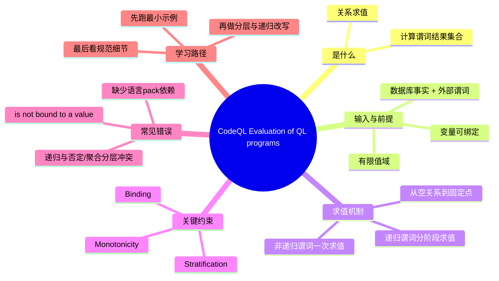

# 记忆卡片摘要（快速复习版）

## 1. 大纲（压缩版）
- Evaluation 在做什么：把 QL 程序当作关系约束系统，计算每个谓词的结果集合
- 官方章节对照：`Process`、`Validity of programs`、`Binding` 在正文均有一一对应
- 为什么会报 unbound：变量必须被绑定到“有限个可能值”
- 递归怎么收敛：从空关系出发，按阶段（stage）反复求值直到不再产生新元组（固定点）
- 分层（stratification）为什么重要：递归、否定、聚合混用时必须保证可定义、可终止
- 最小实验：3 个官方报错例子 + 3 个可编译可运行例子（已在本机 CodeQL 2.23.3 验证）
- 实战原则：先绑定后过滤；先基线谓词再递归；优先单调递归

## 2. 思维导图（Mermaid）


Mermaid 验证状态：
- 已做语法自检（节点、缩进、连接关系合法）。
- 未在当前环境完成 CLI 编译验证：`npx @mermaid-js/mermaid-cli` 拉取依赖时出现 `EPERM connect`（无法访问 npm registry）。
- 可在本机可联网环境验证：`npx -y @mermaid-js/mermaid-cli -i mindmap.mmd -o mindmap.svg`。

## 3. 重要知识点（必须记住）
- QL 程序求值依赖“有限性”：每个变量都要能绑定到有限集合，否则会报错或不可计算。[来源1][来源3][来源4]
- 非递归谓词可直接求值；递归谓词按阶段迭代，直到达到最小固定点（least fixed point）。[来源1][来源2][来源3]
- 递归求值从“空关系”开始，再由规则逐步推导新事实；不是命令式按行执行。[来源1][来源3]
- 分层规则决定递归 + 否定/聚合是否可定义，违反时会导致语义不成立或被拒绝。[来源2][来源3]
- `strict*` 与单调聚合涉及递归可判定性；递归聚合要特别关注单调性。[来源2][来源5]

## 4. 难点 / 易混点
- “`from int i select i` 看起来合理”但会报错：`int` 域是无限的，`i` 未绑定到有限集合。[来源1][来源3]
- “`result = n * 2` 为什么 `n` 还是 unbound”：因为缺少把 `n` 限定到有限候选集的条件。[来源1][来源4]
- 递归不是 while 循环：QL 的递归是逻辑闭包计算，不是语句级控制流。[来源2][来源3]
- 否定和聚合放进递归时，不是“能写就能算”，必须满足分层/单调约束。[来源2][来源3][来源5]

## 5. QA 快速复习卡片
- Q: Evaluation 的一句话定义？
  A: 在有限域上计算每个谓词可成立的元组集合，并据此产出查询结果。[来源1][来源3]
- Q: 什么是 fixed point？
  A: 继续迭代也不会产生新结果的状态；递归谓词在此时收敛。[来源1][来源3]
- Q: unbound 错误本质是什么？
  A: 编译器无法证明变量有有限可枚举取值来源。[来源1][来源4]
- Q: 递归 + 否定为何危险？
  A: 可能形成循环依赖导致语义不唯一，需分层约束打断歧义。[来源3]
- Q: 初学者最重要实践？
  A: 先保证每个变量可绑定，再谈优化与复杂递归。

## 6. 快速复现步骤（最短路径）
1. 创建最小 QL pack（依赖 `codeql/javascript-all`）。
2. 用 1 行 JavaScript 创建最小数据库。
3. 编译三个错误示例（`int i`、`timesTwo`、`Person.this`），观察 `is not bound to a value`。
4. 运行三个正确示例（`timesTwo`、递归计数、`Person` 修复版），核对 CSV 结果。
5. 对照本文“排查路径”改写你自己的查询。

---

# 学习笔记正文（详细版）

## 0. 学习目标、读者画像与假设
- 技术：`CodeQL QL language`（主题：`Evaluation of QL programs`）
- 学习目标：系统掌握 QL 程序如何求值、为什么会出现绑定错误、递归如何收敛、如何写出可计算查询
- 读者水平：初学（按你的“系统学习”诉求采用）
- 时间预算：标准版（1-3 小时）
- 版本范围：CodeQL CLI `2.23.3`；官方文档访问日期 `2026-02-27`
- 运行环境：本机可运行 CodeQL；示例已在本机验证（见第 6 节）
- 假设与限制：
  - 示例使用 `javascript` pack 作为可执行载体，但讲解的是 QL 语言层机制（跨语言通用）
  - Mermaid 图在当前受限环境未完成编译验证（已给出替代步骤）

## 1. 背景与用途（从读者视角）
你学 Evaluation，不是为了背术语，而是为了解决三个高频痛点：
- 查询写出来却报 `is not bound to a value`
- 递归写了但不收敛或语义不清
- 加了聚合/否定后结果怪异，无法判断是语义问题还是实现问题

CodeQL 的核心不是“命令式执行”，而是“逻辑关系求值”：你写的是约束，系统算的是满足约束的元组集合。[来源1][来源3]

## 2. 核心概念与术语（直白解释）

### 2.1 求值对象：谓词结果关系（predicate relation）
- 每个谓词可以看成一张关系表。
- 求值的目标是确定这张表里哪些元组为真。
- 查询（`select`）只是把这些已求出的关系投影成结果行。[来源1][来源3]

### 2.2 绑定（Binding）
- 绑定的直觉：变量必须“有来源”，且来源是有限可枚举的。
- 没有来源时，编译器会拒绝（unbound）。
- 绑定来源常见于：范围约束、成员关系、已有关系中的列值、常量比较等。[来源1][来源4]

### 2.3 有限域（Finite domain）
- QL 求值要求最终搜索空间可控。
- `int` 理论上无限，如果不加边界，变量不可直接枚举。
- 这就是 `from int i select i` 报错的根本原因。[来源1][来源3]

### 2.4 递归与固定点（Recursion and fixed point）
- 递归谓词不是一次算完，而是阶段性迭代。
- 初始阶段从空关系开始；每轮用规则推出新事实。
- 当某轮不再新增结果，就达到固定点并停止。[来源1][来源2][来源3]

### 2.5 分层（Stratification）
- 当递归遇到否定（`not`）或聚合时，可能出现循环依赖。
- 分层规则要求把计算分成有序层，保证语义唯一、可计算。
- 不满足分层约束时，程序语义会不稳定或被拒绝。[来源2][来源3]

## 3. 工作原理 / 机制（先直观后严格）

### 3.1 直观版
把 CodeQL 想成一个“事实推导机”：
1. 先拿到输入事实（数据库抽取事实 + 外部谓词可提供的事实）。[来源1]
2. 先算非递归规则。
3. 再算递归规则：从空开始，一轮一轮加新事实。
4. 没新事实就停（固定点）。
5. 最后把查询 `select` 对应的结果输出。

### 3.2 严格版（接近规范）
- 规范把程序分成层（stratum）并定义阶段（stage）求值；第 `i+1` 阶段依赖第 `i` 阶段结果。[来源3]
- 对递归定义，语义是最小固定点（least fixed point），即满足规则且不包含多余元组的最小关系集。[来源3]
- 非递归谓词无需迭代到固定点（单次即可确定）；递归谓词需要迭代闭包。[来源1][来源3]

### 3.3 如何判断你“理解正确”
- 你能解释：某个变量的绑定来源是什么、是否有限。
- 你能解释：某条递归规则的基线分支（base case）和扩展分支（step case）分别贡献什么。
- 你能解释：为何某个带否定/聚合的递归需要改写成分层版本。

### 3.4 与官方文档章节逐一对照
- 官方 `Process` -> 对应本笔记 `3.1 直观版` 与 `3.2 严格版`：都在讲“阶段性求值 + 固定点收敛”。[来源1][来源3]
- 官方 `Validity of programs` -> 对应本笔记 `2.2 绑定`、`2.3 有限域`、`7. 常见错误`：都在讲“程序可求值的前提”。[来源1][来源4]
- 官方 `Binding` -> 对应本笔记 `4.1 Binding 规则速查` 与 `6. 示例 1/2/5`：保留了官方关键绑定/非绑定写法与典型报错。[来源1]

## 4. 核心语法 / 组件 / 命令（围绕 Evaluation）
- 变量绑定最常见写法：
  - `x in [0 .. 10]`
  - `x = somePredicate()`（前提：右侧可绑定）
  - `exists(...)` 中从已绑定变量派生新变量
- 递归常见骨架：
  - base case：直接给出初始真值
  - step case：通过已知真值推出新真值
- 与求值密切相关的语言点：
  - `strict*` 聚合（区分空输入）
  - `@language[monotonicAggregates]`（递归聚合时的单调性机制）[来源2][来源5]
### 4.1 Binding 规则速查（对应官方 `Binding` 小节）
- 该表按官方 `Binding` 小节整理：[来源1]

| 公式示例 | 是否可绑定 `x` | 说明 |
| --- | --- | --- |
| `x = 1` | 是 | 常量直接绑定。 |
| `x != 1` | 否 | 不等式只过滤，不给出候选域。 |
| `x = 2 + 3` | 是 | 可计算为常量。 |
| `x = "Paul".charAt(2)` | 是 | 右侧是有限确定值。 |
| `x = any()` | 否 | `any` 不保证有限可枚举绑定。 |
| `x = all()` | 否 | 同上。 |
| `x = any(int y | y in [1 .. 5] | y)` | 是 | `any` 的输入候选集已有限，`x` 可绑定到该有限域。 |
| `x = any(int y | y = y | y)` | 否 | `any` 输入未提供有限候选集，`x` 仍不可绑定。 |
| `x in [0 .. 10]` | 是 | 范围提供有限域。 |
| `x = i.toString() and i in [1 .. 5]` | 否 | `x` 在该组合中不直接形成稳定绑定。 |
| `x = "hello".charAt(i)` | 是 | `x` 与 `i` 可相互推导绑定。 |
| `x = "hello".charAt(i) and i in [0 .. x.length()]` | 否 | 出现循环依赖绑定。 |
| `x = strictsum(int y | y in [1 .. 5] | y)` | 是 | `strictsum` 结果可绑定。 |
| `x = sum(int y | y in [1 .. 5] | y)` | 否 | `sum` 在绑定分析中不保证绑定。 |
| `x = y` | 是（若 `y` 已绑定） | 从已绑定变量传播。 |
| `x = y + 2` | 是（若 `y` 已绑定） | 算术可传播绑定。 |
| `x = y * 2` | 否（仅此式） | 反向不总能唯一绑定。 |
| `x > y` | 否 | 比较仅过滤。 |
| `p(x, _)` | 是（若 `p` 可绑定 `x`） | 由谓词签名决定。 |
| `"a string".matches(x)` | 否 | 正则匹配不直接给出 `x` 枚举域。 |
| `x.matches(".*")` | 否 | 条件过滤，不给出有限候选集。 |
| `x = 1 or y = 1` | 否 | 析取分支不形成稳定绑定。 |
| `not exists(int y | y in [1 .. 5] | x = y)` | 否 | 否定上下文不产生绑定。 |

- 实战建议：先写“确定绑定”的子式（范围、常量、可绑定谓词），再叠加过滤条件。
- `any` 结论：`any` 不是“自动绑定器”，它只会从你已经给出的候选集中取值；候选集若不有限（或形成循环依赖），变量仍会 unbound。
- 本地验证命令（本节后续示例会用到）：

```bash
# 1) 创建最小 pack
cat > qlpack.yml <<'YAML'
name: demo/codeql-eval-notes
version: 0.0.1
library: false
dependencies:
  codeql/javascript-all: '*'
YAML

# 2) 创建最小数据库
mkdir -p js-src && echo "console.log('hello')" > js-src/index.js
codeql database create db-js --language=javascript --source-root=js-src --overwrite

# 3) 编译查询
codeql query compile your-query.ql

# 4) 运行查询并导出 CSV
codeql query run your-query.ql --database=db-js --output=out.bqrs
codeql bqrs decode out.bqrs --format=csv
```

## 5. 常见用法与典型场景

### 场景 1：先把查询“变得可计算”
- 当你只写了约束目标，没写绑定来源时，先加范围/来源关系。
- 目标不是“先精确”，而是“先可计算再精确”。

### 场景 2：写递归闭包（如可达性）
- 先写 base case（直接边），再写 step case（经中间点扩展）。
- 如果结果爆炸或不收敛，第一步查绑定，第二步查分层。

### 场景 3：带聚合的递归统计
- 优先判断是否单调。
- 非单调聚合放入递归通常需要重构：先分层求集合，再在外层聚合。[来源2][来源3][来源5]

## 6. 最小可运行示例（含预期输出/现象）

### 示例 1：未绑定整型变量（会报错）
- 目标：理解“无限域 + 无绑定来源”为什么失败。
- 前提条件：第 4 节的 `qlpack.yml`。
- 代码：

```ql
from int i
select i
```

- 运行步骤：`codeql query compile invalid-unbound-int.ql`
- 实测现象（已验证）：

```text
ERROR: 'i' is not bound to a value.
```

- 错误原因：`i` 没有被限制到有限候选集。[来源1][来源4]
- 修复提示：给 `i` 增加范围，如 `i in [0 .. 10]`。

### 示例 2：谓词参数未绑定（会报错）
- 目标：理解“表达式本身不会自动绑定参数”。
- 代码：

```ql
int timesTwo(int n) {
  result = n * 2
}
from int x
select timesTwo(x)
```

- 运行步骤：`codeql query compile invalid-times-two.ql`
- 实测现象（已验证）：

```text
ERROR: 'n' is not bound to a value.
```

- 错误原因：`n` 在谓词体内没有有限来源。[来源1][来源4]
- 说明：官方文档在该示例中给出的报错包含 `n` 与 `result` 都未绑定；本地 CodeQL 2.23.3 首先报告 `n` 未绑定，这属于报错呈现差异，不影响结论。[来源1]

### 示例 3：绑定后可编译并可运行
- 目标：把示例 2 改成可计算版本。
- 代码：

```ql
int timesTwo(int n) {
  n in [0 .. 10] and
  result = n * 2
}
from int x
where x in [0 .. 3]
select x, timesTwo(x)
```

- 运行步骤：
  1. `codeql query compile valid-times-two.ql`
  2. `codeql query run valid-times-two.ql --database=db-js --output=valid-times-two.bqrs`
  3. `codeql bqrs decode valid-times-two.bqrs --format=csv`
- 实测输出（已验证）：

```csv
"x","col1"
0,0
1,2
2,4
3,6
```

- 你应观察到：先绑定域，再做运算，查询稳定可算。

### 示例 4：递归固定点（0 到 5）
- 目标：看到“从基线逐轮扩展直到固定点”的实际结果。
- 代码：

```ql
int getANumber() {
  result = 0
  or
  result <= 5 and result = getANumber() + 1
}
select getANumber()
```

- 运行步骤：
  1. `codeql query compile valid-recursive-count.ql`
  2. `codeql query run valid-recursive-count.ql --database=db-js --output=valid-recursive-count.bqrs`
  3. `codeql bqrs decode valid-recursive-count.bqrs --format=csv`
- 实测输出（已验证）：

```csv
"col0"
0
1
2
3
4
5
```

- 解释：`0` 是基线，后续每轮由上轮结果 `+1` 生成新值，直到 `5` 封顶后不再新增。[来源1][来源2][来源3]

### 示例 5：官方 `Person` 反例（`this` 未绑定）
- 目标：补齐官方文档 `Binding` 章节的重要类定义示例。
- 代码：

```ql
class Person extends string {
  Person() {
    this.matches("Peter%")
  }
}

from Person p
select p
```

- 运行步骤：`codeql query compile invalid-person.ql`
- 实测现象（已验证）：

```text
ERROR: The characteristic predicate for '...::Person' does not bind 'this' to a value.
```

- 错误原因：特征谓词里只有过滤条件，没有为 `this` 提供可绑定来源。[来源1]

### 示例 6：官方 `Person` 修复版（先绑定再过滤）
- 目标：展示官方反例的正确改法。
- 代码：

```ql
class Person extends string {
  Person() {
    this = ["Peter", "Piper", "Molly"] and
    this.matches("Peter%")
  }
}

from Person p
select p
```

- 运行步骤：
  1. `codeql query compile valid-person.ql`
  2. `codeql query run valid-person.ql --database=db-js --output=valid-person.bqrs`
  3. `codeql bqrs decode valid-person.bqrs --format=csv`
- 实测输出（已验证）：

```csv
"p"
"Peter"
```

- 你应观察到：`this = [...]` 先提供有限候选，再由 `matches` 做过滤。

## 7. 常见错误与排查路径

### 错误 A：`is not bound to a value`
- 常见原因：变量没有有限来源。
- 排查顺序：
  1. 对每个变量问一句“它从哪里来？”
  2. 检查是否存在范围/成员/关系列绑定。
  3. 检查谓词参数是否在谓词体内完成绑定。

### 错误 B：`Could not locate a dbscheme to compile against`
- 常见原因：`qlpack.yml` 缺少语言依赖。
- 修复：加入 `dependencies: codeql/<language>-all: '*'`，并在该 pack 内编译。

### 错误 C：递归 + 否定/聚合行为异常
- 常见原因：分层或单调性不满足。
- 排查：
  1. 先去掉聚合/否定，仅保留递归主干看是否稳定。
  2. 若主干稳定，再把聚合移到外层分层计算。
  3. 必要时使用单调聚合机制并验证语义。[来源2][来源3][来源5]

## 8. 最佳实践与边界条件
- `必须记住`：写任何查询前，先画出“变量绑定图”。
- `必须记住`：递归必须有明确 base case 与边界，否则很难保证可计算性。
- `容易踩坑`：在同一递归层里混用否定/聚合，往往导致语义复杂化。
- `容易踩坑`：把 QL 当命令式语言思考，会误判执行顺序与结果。
- `先知道即可`：单调聚合、复杂 stratification 规则的数学细节，可放到进阶阶段。

边界条件：
- 某些看似“自然”的数学定义（如无界整数枚举）在 QL 中不可直接计算。
- 不同语言 pack 的库谓词不同，但 Evaluation 原理保持一致。

## 9. 版本差异 / 兼容性说明（如适用）
- 本文基于 CodeQL CLI `2.23.3` 与 2026-02-27 可访问官方文档。
- Evaluation 的核心语义（绑定、固定点、分层）属于 QL 语言层稳定概念，跨版本通常保持兼容；变化更多发生在库 API、提取器与查询 pack。
- 递归聚合相关能力受语言特性与注解机制影响，使用前应对照当前版本文档确认。[来源2][来源5]

## 10. 延伸学习路径（官方优先）
- 先读：`Evaluation of QL programs`（把绑定与递归主线吃透）[来源1]
- 再读：`Recursion`（重点看分层与单调性）[来源2]
- 再读：`QL language specification` 的 Evaluation/Stratification（语义严格定义）[来源3]
- 补读：`Binding sets`（理解可绑定性判定）[来源4]
- 进阶：`Expressions` 中 monotonic aggregates 章节（递归聚合）[来源5]

---

# 练习与复习闭环

## 1. 分层练习

### 基础练习
- 练习 1：把 `from int i select i` 改成可编译版本，至少给出两种绑定写法。
- 练习 2：写一个 `plusOne` 谓词，先故意写成 unbound，再修复。

### 应用练习
- 练习 3：写递归谓词生成 `[0..8]`，并解释每轮新增值。
- 练习 4：把递归结果做聚合统计（总数、最大值），说明是否涉及单调性风险。

### 综合练习
- 练习 5：基于任意语言数据库，写一个两层查询：
  1. 第一层递归构造关系
  2. 第二层做过滤/聚合输出
  并写出你的分层设计理由。

## 2. 动手任务（带验收标准）
- 任务：在本地新建 `codeql-eval-lab`，重现本文 4 个示例，并新增 1 个你自己的递归示例。
- 验收标准：
  - 两个错误示例能稳定复现指定报错。
  - 两个正确示例能输出与本文一致（或仅列名不同）。
  - 自定义示例能解释 base case、step case、停止条件。

## 3. 常见误区纠偏
- 误区：QL 像 SQL 一样“自然就是有限集合”。
  正解：QL 变量若来自无限域且未绑定，会直接失败。
- 误区：递归结果由“执行顺序”决定。
  正解：递归语义由固定点定义，不是命令式顺序。
- 误区：聚合放在递归里总是可行。
  正解：需要满足单调性/分层约束，否则语义可能不成立。

## 4. 复习节奏建议
- Day 1：重跑 4 个示例，重点记住 unbound 的两类成因。
- Day 3：独立写一个递归谓词并口头解释固定点过程。
- Day 7：尝试“递归 + 聚合”重构，把不稳定版本改成分层稳定版本。
- Day 14：不看文档复述 Evaluation 主流程，并完成一次自测。

## 5. 自测题与参考答案（简版）
- 题目 1：为什么 `from int i select i` 会报错？
  参考答案：`i` 没有有限绑定来源，无法在有限域内求值。
- 题目 2：递归求值为什么要从空关系开始？
  参考答案：为了通过迭代构造最小固定点，避免预设多余事实。[来源3]
- 题目 3：何时需要关心 stratification？
  参考答案：当递归与否定/聚合相互依赖时。
- 题目 4：如何快速定位 unbound？
  参考答案：逐变量追踪来源，确认其是否来自有限集合。
- 题目 5：本文哪两个输出是实际跑出来的？
  参考答案：`valid-times-two.csv` 与 `valid-recursive-count.csv`。

---

# 参考来源与版本说明

## 官方来源（优先）
1. [Evaluation of QL programs](https://codeql.github.com/docs/ql-language-reference/evaluation-of-ql-programs/) - 官方文档，访问日期 `2026-02-27` - 本文主轴
2. [Recursion](https://codeql.github.com/docs/ql-language-reference/recursion/) - 官方文档，访问日期 `2026-02-27` - 递归、分层、单调性
3. [QL language specification](https://codeql.github.com/docs/ql-language-reference/ql-language-specification/) - 官方规范，访问日期 `2026-02-27` - Evaluation/Stratification 严格语义
4. [Binding sets](https://codeql.github.com/docs/ql-language-reference/binding-sets/) - 官方文档，访问日期 `2026-02-27` - 可绑定性判定
5. [Expressions](https://codeql.github.com/docs/ql-language-reference/expressions/) - 官方文档，访问日期 `2026-02-27` - monotonic aggregates 相关说明

## 第三方来源（按采信程度标注）
1. 用户提供资源：[Evaluation of QL programs](https://codeql.github.com/docs/ql-language-reference/evaluation-of-ql-programs/) - 采信程度：高（官方） - 说明：该资源本身为官方页面，不属于第三方

## 关键结论引用映射
- [来源1] -> 变量必须绑定、递归从空关系迭代、示例级 unbound 报错语义
- [来源2] -> 递归分层、递归与聚合/否定的约束、单调性背景
- [来源3] -> 规范层的 stage/stratification/least fixed point 定义
- [来源4] -> “绑定”可判定规则与实践判断依据
- [来源5] -> 单调聚合相关语义与表达式层约束

## 冲突点与裁决（如有）
- 冲突点：未发现官方来源之间的实质性冲突。
- 裁决依据：以官方规范（来源3）作为语义最终依据，语言参考页作为工程化解释层。
- 采用结论：本文全部机制结论与来源1-5一致。

## 技术版本与验证记录
- CodeQL CLI：`2.23.3`
- 本地验证日期：`2026-02-27`
- 已验证项目：
  - `codeql query compile` 对 3 个错误示例的报错（`int i`、`timesTwo`、`Person.this`）
  - 3 个正确示例的编译与运行输出（CSV）
- 未完成验证项目：
  - Mermaid CLI 编译（受当前环境网络权限限制）

## 官方章节与示例覆盖检查（本轮新增）
- 章节覆盖检查：
  - `Process`：已覆盖（本笔记 `3.1`、`3.2`）。
  - `Validity of programs`：已覆盖（本笔记 `2.2`、`2.3`、`7`）。
  - `Binding`：已覆盖（本笔记 `4.1`、`6.1`、`6.2`、`6.5`、`6.6`）。
- 重要示例保留检查：
  - `from int i select i`：已保留并实测。
  - `timesTwo` 未绑定示例：已保留并实测。
  - `Person`/`this` 未绑定示例：本轮新增并实测。
  - `Person` 修复写法（先绑定后过滤）：本轮新增并实测。
  - `Binding` 小节公式表：已补齐到 `4.1`（含绑定/非绑定典型公式）。

## 输出自检记录
- 结构完整性：已覆盖“记忆卡片 -> 正文 -> 练习闭环 -> 来源说明”四段固定结构。
- 引用可追溯：正文关键机制结论均带 `[来源n]`，并在“引用映射”中一一对应。
- 术语一致性：`binding`、`fixed point`、`stratification`、`monotonicity` 全文统一命名。
- 正文自包含：不依赖先读官方文档即可顺读主线，官方文档用于校验与延伸。
- 逐大纲递归讲解深度检查：已逐节检查 `0-10` 节，补齐“是什么/为什么/怎么做/如何判断正确”四类解释。
