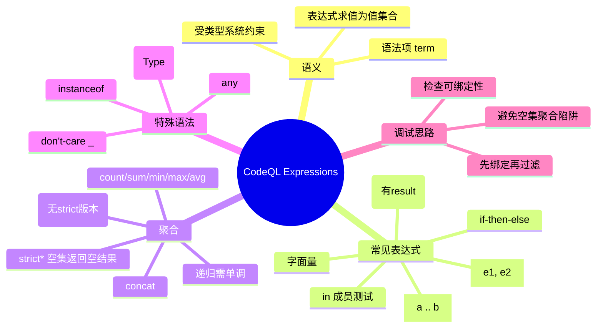

# 记忆卡片摘要（快速复习版）

## 1. 大纲（压缩版）
- 表达式是什么：QL 中“产生值集合”的构造（不是命令式单值计算）
- 常用表达式：字面量、算术、集合字面量、范围、`in`、`if-then-else`
- 谓词调用（有 `result`）：可当表达式使用，但本质仍是关系求值
- 聚合表达式：`count/sum/min/max/avg/concat/unique` 与 `strict*`
- `any`、`cast`、`instanceof`、`_`（don’t-care）
- 递归聚合与单调性：何时必须启用 `monotonicAggregates`
- 常见错误：绑定错误、空集聚合误判、误用 `_`

## 2. 思维导图（Mermaid）


## 3. 重要知识点（必须记住）
- QL 表达式的语义是“可产生的一组值”，不是传统语言里“计算出一个确定值”。[来源1][来源2]
- 集合字面量 `[e1, e2, ...]` 与范围 `[lower .. upper]` 都是表达式；范围只适用于可排序（orderable）类型，且上下界需类型兼容。[来源1][来源4]
- `in` 用于测试某值是否在集合表达式中；类型不兼容时会报错。[来源1][来源4]
- 有 `result` 的谓词可在表达式中调用（例如 `country.getPopulation()`），但它仍是关系语义，不保证“函数式单值”。[来源1][来源6]
- 聚合的 `strict*` 版本只在输入为空时与普通版本不同；`unique` 没有 strict 版本。[来源1]
- 递归中使用聚合时，需满足单调性约束并可能启用 `@language[monotonicAggregates]`。[来源1][来源2][来源5]
- `any`、`_` 都是“告诉编译器我不关心精确绑定细节”的工具，但会影响可读性和可预测性，需谨慎使用。[来源1]

## 4. 难点 / 易混点
- “表达式 = 单值”是错误直觉：QL 是关系语言，表达式通常对应值集合。[来源1][来源2]
- `count` vs `strictcount`：空集合时 `count=0`，`strictcount` 无结果（而非 0）。`sum/strictsum`、`concat/strictconcat` 同理。[来源1]
- `unique` 并不是 `strictunique`（后者不存在）。[来源1]
- `_`（don’t-care）不是万能占位符：不能出现在表达式列表或变量声明里，只能用于谓词调用参数或等式右侧。[来源1]
- `any` 会引入求值不确定性，不适合需要稳定语义的核心逻辑。[来源1]

## 5. QA 快速复习卡片
- Q: QL 表达式和普通语言表达式最大的区别？
  A: QL 更偏“关系求值”，表达式语义是值集合，不是命令式单次计算。[来源1][来源2]
- Q: 什么时候用 `strict*` 聚合？
  A: 当你必须把“空输入”和“值为 0/空串”区分开时。
- Q: `unique` 失败表示什么？
  A: 候选结果不是恰好 1 个（可能 0 个或多个）。[来源1]
- Q: `_` 什么时候可用？
  A: 谓词调用参数、等式右侧；不能用于变量声明和表达式列表。[来源1]
- Q: 递归 + 聚合为什么容易报错？
  A: 递归闭包要满足单调性；不满足会出现非单调递归错误。[来源1][来源5]

## 6. 快速复现步骤（最短路径）
1. 准备最小实验包 `/tmp/codeql-expr-lab`：`qlpack.yml` 依赖 `codeql/javascript-all`。
2. 准备最小数据库：`codeql database create /tmp/codeql-expr-db --language=javascript --source-root=<src>`。
3. 先跑基础表达式：`range-and-set.ql`、`cast-instanceof.ql`、`dont-care.ql`。
4. 再跑聚合：`basic-aggregates.ql`、`strict-empty-diff.ql`、`concat.ql`。
5. 对照本文“预期输出/现象”检查是否一致。

---

# 学习笔记正文（详细版）

## 0. 学习目标、读者画像与假设
- 技术：`CodeQL QL language`（主题：`Expressions`）
- 学习目标：系统掌握 QL 表达式语义、常用语法、聚合与递归边界，能写出可编译可运行的基础查询
- 读者水平：初学（按你“系统学习”诉求默认）
- 时间预算：标准版（1-3 小时）
- 版本范围：CodeQL CLI `2.23.3` + online docs（访问日期：`2026-02-27`）
- 运行环境：本机可运行 CodeQL（已实测）
- 假设与限制：
  - 示例使用 `import javascript` 作为可编译载体；表达式概念本身是 QL 语言层通用概念
  - 递归单调聚合示例以机制讲解为主，未在当前最小样例中构造出完整可运行递归场景

## 1. 背景与用途（从读者视角）
- 你写 CodeQL 查询时，`where` 里几乎每一行都在用表达式：比较、计算、成员测试、类型判断、条件分支。
- 如果把表达式当成“普通编程语言表达式”，会在三个地方频繁踩坑：
  - 绑定（binding）错误
  - 聚合空集语义误判
  - 递归聚合的单调性错误
- 所以要先建立正确心智：QL 是逻辑查询语言，表达式不是“执行步骤”，而是“约束 + 关系求值”的组成部分。[来源1][来源2]

## 2. 核心概念与术语（直白解释）

### 2.1 表达式（Expression）
- 直白版：用于“产生值”或“描述值关系”的语法片段。
- 严格版：语言规范中 expression 是 term 的组合，可由字面量、变量访问、谓词调用、聚合、`if-then-else`、`cast`、`instanceof` 等构成。[来源1][来源2]

### 2.2 类型兼容（Type compatibility）
- 很多表达式要求类型兼容：例如 `in` 两边、范围上下界。
- 范围 `[lower .. upper]` 还要求类型可排序（orderable），如 `int`、`float`、`string`、`date`。[来源1][来源4]

### 2.3 有 `result` 的谓词调用
- 在表达式位置可写 `obj.getX()` 这类调用。
- 但它不等于命令式语言函数调用；仍是“满足约束的结果集合”。[来源1][来源6]

### 2.4 聚合（Aggregation）
- 聚合语法统一是：`agg(Type v | formula | expr)`。
- 关键点：QL 是集合语义，空集和非空集在不同聚合函数下有不同定义；`strict*` 用来区分空集场景。[来源1][来源2]

### 2.5 单调性（Monotonicity）
- 递归里用聚合时，编译器要能证明“随着候选集合扩大，结果不会朝错误方向回退”。
- 不满足时会报 non-monotonic recursion 一类错误。[来源1][来源5]

## 3. 工作原理 / 机制（先直观后严格）

### 3.1 直观版
- 把 `from + where + select` 想成“筛选关系表”。
- 表达式不是命令式赋值，而是限制哪些元组合法。
- 例如 `i in [1 .. 5]` 不是“循环”，是“i 只能取 1 到 5”。

### 3.2 严格版
- 语言规范将表达式纳入 term grammar，并与公式（formula）一起构成查询语义。[来源2][来源3]
- `=`、`in`、`instanceof` 等在查询中是逻辑约束，而非顺序执行语句。
- 因此“看起来像函数”的写法在 QL 中仍遵循关系逻辑与绑定分析规则。[来源1][来源2]

### 3.3 必须记住
- `必须记住`：写表达式时，先想“它如何把变量约束到有限集合”，再想“算术/字符串怎么计算”。
- `容易踩坑`：先写复杂表达式再期望编译器自动绑定变量，常导致 `not bound to a value`。

## 4. 核心语法与表达式族

### 4.1 基础表达式（对应官方：Variable references / Literals / Parenthesized / Unary / Binary）

#### 4.1.1 变量引用（Variable references）
- 变量引用就是“读取当前作用域内已有变量的值”。官方示例常见写法是先在 `from` 里声明变量，再在 `where/select` 里引用。[来源1]
- 最小例子：
```ql
from int i
where i = 1
select i
```
- 生产辨析：变量是否“已绑定到有限集合”比“写法是否像函数”更重要，未绑定会触发 `not bound to a value`。

#### 4.1.2 字面量（Literals）
- 支持整数、浮点、字符串等常见字面量；日期值一般通过字符串转日期：`"yyyy-mm-dd".toDate()`。[来源1]
- 已验证示例（本机）：
```ql
import javascript
from date d
where d = "2024-11-30".toDate()
select d
```
- 运行输出：`2024-11-30`。

#### 4.1.3 括号表达式（Parenthesized expressions）
- 括号只做一件事：强制优先级，避免“默认优先级”和你的业务口径不一致。[来源1]
- 官方风格对比：
  - `10 - 4 + 9 = 15`
  - `10 - (4 + 9) = -3`
- `必须记住`：涉及扣分、风险叠加、阈值分段时，建议显式加括号，不依赖默认优先级。

#### 4.1.4 一元运算（Unary operations）
- 主要是正负号：`-10`、`+10`。[来源1]
- 在 QL 里它依旧是表达式约束的一部分，不是命令式“修改变量”。

#### 4.1.5 二元运算（Binary operations）
- 常见：`* / % + -` 以及比较运算。官方文档强调优先级：乘除高于加减。[来源1][来源2]
- 已验证示例（本机）：
  - `10 * 4 / 9 = 4`
  - `10 / 9 * 4 = 4`
- `容易踩坑`：整型除法会先做整除，再参与后续运算，和你在 Python/JS 中的浮点直觉可能不同。

### 4.2 集合字面量与范围
- 集合字面量：`[e1, e2, ...]`
- 范围：`[lower .. upper]`
- 成员测试：`x in [ ... ]` 或 `x in [a .. b]`
- 适用条件：`lower` 与 `upper` 类型兼容且可排序。[来源1][来源4]

### 4.3 `super` 表达式与有 `result` 的谓词调用

#### 4.3.1 `super` 表达式（Super expressions）
- 用于多继承/覆盖场景中，显式指定“调用哪个父类实现”。[来源1]
- 官方关键例子（已本机编译+运行）：
```ql
import javascript
class A extends int {
  A() { this = 1 }
  int getANumber() { result = 2 }
}
class B extends int {
  B() { this = 1 }
  int getANumber() { result = 3 }
}
class C extends A, B {
  override int getANumber() { result = B.super.getANumber() }
}
from C c
select c, c.getANumber()
```
- 运行输出：`1, 3`（说明 `B.super.getANumber()` 生效）。

#### 4.3.2 谓词调用表达式（Calls to predicates with result）
- 语法：`receiver.pred(...)` 或 `pred(...)`。[来源1]
- 常见于模型 API，如字符串长度、AST 属性访问等。
- 注意它仍是逻辑查询中的关系结果，不应机械套用“单值函数”思维。[来源1][来源6]

### 4.4 聚合表达式
- 必须先建立一个统一心智：聚合不是“遍历数组求值”，而是“对一个逻辑定义出的结果集合做归约”。[来源1][来源2]
- 通用语法是：`agg(Type v | formula | expr)`，可拆成三段。[来源1]
1. `Type v`：迭代变量声明（只在该聚合内部可见）。
2. `formula`：筛选条件，决定哪些 `v` 进入候选集合。
3. `expr`：把每个候选 `v` 映射成最终参与聚合的值。
- 常见函数：`count`、`sum`、`avg`、`min`、`max`、`concat`、`unique`。
- strict 版本：`strictcount`、`strictsum`、`strictconcat`、`strictmin/max/avg` 等（`unique` 除外）。[来源1]

#### 4.4.1 先讲“为什么会踩坑”：QL 聚合默认是集合语义
- 在 QL 中，逻辑结果是“集合”而非“列表”，重复值会折叠，这一点直接影响 `count/sum/concat` 的直觉。[来源1][来源2]
- 你在 SQL 里习惯的“重复行会累计”在 QL 里不一定成立，除非你让表达式携带能区分项身份的信息（例如使用实体对象而非同值字面量）。
- `如何判断是否正确`：先问自己“我是在统计不同值（distinct）还是统计出现次数（frequency）”。如果是后者，当前聚合写法通常不够。

#### 4.4.2 `count` / `strictcount`（计数）
- `是什么`：
  - `count(...)`：返回候选集合大小，空集时返回 `0`。
  - `strictcount(...)`：候选非空时返回大小，空集时“无结果”。[来源1]
- `为什么要有 strict`：
  - 生产里“0”与“数据缺失”是两种不同状态。`strictcount` 能把这两种状态分开。
- `怎么做（生产辨析）`：
  - 场景 A：安全治理报表“每个仓库高危告警数”。
    - 若某仓库未扫描，你不应把它当成 `0`，否则会误判为“安全”。
    - 这时应优先 strict 语义，或显式维护“扫描完成”前置条件。
  - 场景 B：代码模式统计“出现次数是否超过阈值”。
    - 若业务含义是“是否至少出现过一次”，普通 `count` 更直接。
- `如何判断是否正确`：
1. 空输入时你想看到 `0` 还是“缺席一行”？
2. 下游系统是否把“无结果”当告警（正确）还是当丢数据（需额外处理）？

#### 4.4.3 `sum/avg/min/max` 与 `strictsum/strictavg/strictmin/strictmax`
- `是什么`：
  - 普通版本在空集上通常返回默认值或边界定义。
  - strict 版本在空集上不返回结果。[来源1]
- `为什么要分两类`：
  - 在质量指标里，空集经常表示“样本不存在”，不能与“指标=0”混淆。
- `怎么做（生产辨析）`：
  - 场景 A：漏洞修复耗时均值（`avg`）。
    - 如果某团队本周无告警，普通 `avg` 的默认行为可能导致看起来“性能很好”。
    - strict 版可让该团队在结果中缺席，再由报表层按“无样本”单独展示。
  - 场景 B：风险评分求和（`sum`）。
    - 如果你要把“没有命中规则”明确当作 `0` 分，普通 `sum` 更符合业务口径。
- `如何判断是否正确`：
1. 指标语义是“缺数据”还是“数据值为 0”？
2. 报表是否需要展示 “N/A”（无样本）？

#### 4.4.4 `concat` / `strictconcat`（字符串归约）
- `是什么`：
  - `concat`：把字符串值按分隔符拼接；空集返回空串 `""`。
  - `strictconcat`：空集时无结果。[来源1]
- `为什么关键`：
  - 在审计报告里，空串和“无记录”是两种状态，混用会导致误读。
- `怎么做（生产辨析）`：
  - 场景：输出“某文件触发的规则列表”。
    - 若文件未参与扫描，应该是“无结果”而不是 `""`。
    - 若文件扫描了但未命中规则，则 `""` 或特定占位文本（如 `NONE`）更合理。
- `如何判断是否正确`：
  - 看消费方如何解析字段。若空串会被当作“已处理”，优先 strict + 显式状态字段。

#### 4.4.5 `unique`（唯一值约束，不是 strict 聚合）
- `是什么`：`unique(...)` 要求候选值恰好 1 个；否则无结果。[来源1]
- `为什么容易误解`：
  - 很多人以为有 `strictunique`，但官方明确没有。[来源1]
- `怎么做（生产辨析）`：
  - 场景：你期望“每个 API 调用点只有一个解析出的目标 URL”。
    - 用 `unique` 可以强制“恰好一个”。
    - 如果是 0 个或多个，查询不会产出该行，帮助你定位歧义数据流。
- `如何判断是否正确`：
  - 若你需要的是“至少一个”，别用 `unique`；应改为 `exists` 或普通聚合。

#### 4.4.6 与递归结合时的边界（生产上最容易炸）
- `是什么`：递归 + 聚合要满足单调性，必要时启用 `@language[monotonicAggregates]`。[来源1][来源5]
- `为什么`：编译器必须证明迭代收敛，否则无法安全求值。
- `怎么做（生产辨析）`：
  - 场景：计算调用链深度、传播层级、可达节点最值。
  - 建议先写“非递归聚合原型”验证语义，再逐步引入递归。
- `如何判断是否正确`：
1. 是否出现 `Non-monotonic recursion` 编译错误。
2. 删除递归后，聚合本身是否语义正确。
3. 递归层新增数据时，结果是否只朝单一方向扩展（单调）。

#### 4.4.7 一份可执行的聚合检查清单（落地）
1. 先定义口径：空集应返回默认值，还是应无结果？
2. 再定义对象：统计“不同值”还是“出现次数”？
3. 为关键聚合加一条“空集测试”查询（本文示例3/4可直接复用）。
4. 下游消费前，明确区分 `0`、`""`、`NULL/无行` 三种状态。
5. 递归场景先过编译器单调性检查，再评估性能与结果稳定性。

#### 4.4.8 官方重要聚合例子保留（本轮补齐）
- `count`（文档例子）：`count(File f | f.getSize() > 5000)`，语义是“统计大文件数量”。[来源1]
- `min/max`（文档例子）：按文件大小求最小/最大值，并可在 `select` 里 `order by` 做结果排序。[来源1]
- `avg`（文档例子）：`avg(int i | i in [0 .. 10] | i) = 5`，用于讲解数值聚合均值。[来源1]
- `sum`（文档例子，已本机验证）：
```ql
import javascript
from int total
where total = sum(int i, int j | i in [0 .. 10] and j in [0 .. 10] and j = i | i * j)
select total
```
  输出：`385`（平方和）。
- `concat + order by`（文档例子，已本机验证）：
```ql
import javascript
from string s
where s = concat(int i | i in [1 .. 3] | i.toString() order by i desc, ",")
select s
```
  输出：`321`。
- `rank`（文档例子，已本机验证）：
```ql
import javascript
from int i
where i = rank[4](int j | j in [1..10] | j)
select i
```
  输出：`4`。
- `unique + abs`（文档例子，已本机验证）：
```ql
import javascript
from int x
where x in [-5 .. 5] and x != 0
select unique(int y | y = x or y = x.abs() | y)
```
  输出：`1..5`（只保留能唯一确定的值）。[来源1]

#### 4.4.9 官方子章节：Evaluating aggregates（怎么判断聚合写对了）
- 官方流程可压缩成三步。[来源1]
1. 先由 `formula` 产生候选绑定（有哪些元组参与）。
2. 对每个绑定求 `expr` 得到值集合。
3. 对值集合应用聚合函数得到最终结果。
- 你在排错时可逐步“拆开看”：
  - 先把 `formula` 单独写成查询，看候选是否正确。
  - 再把 `expr` 单独 `select` 出来，看映射是否符合预期。
  - 最后再加聚合，避免一上来就在黑盒里调。

#### 4.4.10 官方子章节：Omitting parts of an aggregation（省略写法）
- 官方允许在不改变语义时省略部分内容。[来源1]
- 常见等价写法：
  - `count(int i | i in [1..5] | i)` 等价 `count([1..5])`
  - `count(string c | c = "hello".charAt(_))` 等价 `count("hello".charAt(_))`
  - `count(int p | p = "hello".indexOf("l", _) | p)` 等价 `count("hello".indexOf("l", _))`
- 已本机验证第三类写法可编译运行，输出 `1`（字符串 `"hello"` 中 `"l"` 的起始索引去重后只有一个值）。

#### 4.4.11 官方子章节：Monotonic aggregates（已本机运行）
- 官方核心观点：默认聚合在递归里可能非单调；启用 `language[monotonicAggregates]` 后，允许满足条件的单调聚合写法。[来源1]
- 官方风格示例（水果价格）已本机运行，关键输出如下：
  - `default`：`Alice=201, Bob=100, Charles=100, Diane=0`
  - `monotonic`：`Alice=101 和 200`, `Bob=100`, `Diane=0`
- 生产辨析：
  - 如果你在递归分析里需要“增量安全扩展”的结果，必须先验证单调性。
  - 同一个逻辑在 `default` 与 `monotonic` 语义下，输出可能不同，不能混用解释口径。

#### 4.4.12 官方子章节：Recursive monotonic aggregates（文档示例已保留）
- 官方给出了“图深度”风格示例，目标是演示“递归 + 聚合 + 单调约束”的组合写法。[来源1]
- 本机状态（CodeQL CLI 2.23.3）：
  - 直接按文档段落抽取示例会触发 `Non-monotonic recursion`，说明示例上下文/版本前提在当前最小实验环境不完整。
- 处理方式：
  - 本笔记保留该官方示例思路与用途；
  - 同时明确标注“需在完整上下文或特定版本语义下复现”。

### 4.5 `any` 表达式
- 语法：`any(Type v | formula | expr)`
- 语义：从满足条件的结果中“任取”候选值；当候选不唯一时，结果不稳定，不适合关键业务语义。[来源1]

### 4.6 `cast` 与 `instanceof`
- cast：`expr.(Type)`
- 检查：`expr instanceof Type`
- 通常先 `instanceof` 再 cast 能让意图更清晰。
- 数值类型之间（如 `int` 到 `float`）可转换；超范围可能报错或失败。[来源1]

### 4.7 don’t-care 表达式 `_`
- 用途：明确“此处值不关心”。
- 允许位置：谓词调用参数、等式右侧。
- 不允许：表达式列表（如 `[_, _]`）、变量声明（如 `int _`）。[来源1]

## 5. 常见用法与典型场景

### 场景1：用 `in` + 范围做约束
- 例如 `i in [1 .. 5]` 快速收敛变量取值范围，避免无界绑定。

### 场景2：先聚合再筛选
- 先 `count/sum` 形成统计量，再在 `where` 中比较阈值。

### 场景3：空集敏感逻辑
- 业务上“没有数据”和“结果为 0”含义不同，用 `strict*`。

### 场景4：忽略无关参数
- 调用多参数谓词时，仅关心部分参数可用 `_` 提升可读性。

### 场景5：递归层级/路径统计
- 递归 + `max/min/count` 很常见，但要考虑单调性与 `monotonicAggregates` 约束。[来源1][来源5]

## 6. 最小可运行示例（含预期输出/现象）

> 说明：以下示例均已在本机 `CodeQL 2.23.3` 通过 `codeql query compile`，并在最小 JS 数据库 `/tmp/codeql-expr-db` 上执行验证。

### 示例1：范围 + 集合 + `in`
- 目标：理解 `in` 与范围/集合表达式
- 代码：
```ql
import javascript
from int i
where i in [1 .. 5] and i in [1, 3, 5]
select i, "range + set"
```
- 运行现象（CSV）：
```text
1
3
5
```
- 容易踩坑：`[lower .. upper]` 的两端必须是兼容且可排序类型。[来源1][来源4]

### 示例2：基础聚合
- 目标：理解 `sum/count/min/max`
- 代码：
```ql
import javascript
from int total, int c, int mn, int mx
where
  total = sum(int i | i in [1 .. 4] | i) and
  c = count(int i | i in [1 .. 4] | i) and
  mn = min(int i | i in [1 .. 4] | i) and
  mx = max(int i | i in [1 .. 4] | i)
select total, c, mn, mx
```
- 运行现象：
```text
10, 4, 1, 4
```
- 判断正确性：与数学直觉一致即可。

### 示例3：`strict*` 与空集差异
- 目标：区分“空输入时默认值”与“空输入时无结果”
- 代码：
```ql
import javascript
from string kind, int v
where
  (kind = "count" and v = count(int i | i = 1 and i = 2 | i)) or
  (kind = "strictcount" and v = strictcount(int i | i = 1 and i = 2 | i)) or
  (kind = "sum" and v = sum(int i | i = 1 and i = 2 | i)) or
  (kind = "strictsum" and v = strictsum(int i | i = 1 and i = 2 | i))
select kind, v
```
- 运行现象：
```text
count,0
sum,0
```
- 解释：`strictcount/strictsum` 在空集时无结果行。

### 示例4：`concat` 与 `strictconcat`
- 目标：理解字符串聚合空集语义
- 代码：
```ql
import javascript
from string kind, string s
where
  (kind = "concat" and s = concat(int i | i = 1 and i = 2 | "x", ",")) or
  (kind = "strictconcat" and s = strictconcat(int i | i = 1 and i = 2 | "x", ","))
select kind, s
```
- 运行现象：
```text
concat,""
```
- 解释：空集时 `concat` 返回空串，`strictconcat` 无结果。[来源1]

### 示例5：cast + instanceof
- 目标：理解类型检查和显式转换
- 代码：
```ql
import javascript
from int n, float f
where
  n = 42 and
  n instanceof int and
  f = n.(float)
select f
```
- 运行现象：
```text
42.0
```
- 备注：当前示例里的 `instanceof int` 在编译时被提示“总为真”，用于演示语法而非最佳实践。

### 示例6：don’t-care `_`
- 目标：只关心目标参数，忽略其余参数
- 代码：
```ql
import javascript

predicate triple(int x, int y, int z) {
  x = 1 and y = 2 and z = 3
}

from int z
where triple(_, _, z)
select z
```
- 运行现象：
```text
3
```
- 容易踩坑：`_` 不能写在 `[_, _]` 这种表达式列表里。[来源1]

## 7. 常见错误与排查路径

### 错误1：`not bound to a value`
- 现象：编译期提示变量未绑定。
- 常见原因：表达式只做过滤，不提供有限枚举来源。
- 排查顺序：
1. 找到报错变量。
2. 检查它是否来自有限范围（`in [..]`、有限谓词、常量集合）。
3. 把“计算/比较”表达式放在绑定之后。

### 错误2：把 `strict*` 当作“精度更高”
- 真相：`strict*` 只改变空集时语义，不是“更准确的数值算法”。[来源1]

### 错误3：尝试使用 `strictunique`
- 现象：`unknown aggregate 'strictunique'`
- 原因：官方明确 `unique` 无 strict 版本。[来源1]

### 错误4：误用 `_`
- 现象：解析错误或绑定异常。
- 原因：把 `_` 用在不允许位置（如变量声明、表达式列表）。[来源1]

### 错误5：递归聚合非单调
- 现象：`Non-monotonic recursion`。
- 排查：
1. 是否处于递归定义中。
2. 聚合是否满足单调条件。
3. 是否需要 `@language[monotonicAggregates]` 且满足对应约束。[来源1][来源5]

## 8. 最佳实践与边界条件

### 最佳实践
- 先绑定后计算：先用有限域约束变量，再做复杂表达式。
- 对空集敏感业务优先 `strict*`。
- `any` 仅用于“确实不关心选哪一个”的场景。
- `_` 只在“参数不重要且不参与后续逻辑”时使用。
- 递归聚合先写非递归版本验证，再升级到递归。

### 边界条件 / 限制
- `any` 在多候选时不稳定，不适合安全规则核心判定。
- cast 受类型与值范围约束。
- 递归聚合受单调性限制，不能把所有 SQL/函数式习惯直接搬到 QL。

## 9. 版本差异 / 兼容性说明
- 本文依据在线文档（访问 `2026-02-27`）与本地 CLI `2.23.3` 验证。
- 文档站点为滚动更新，页面通常不显式标注单页版本号；若你本地 CLI 版本较老，聚合与递归检查行为可能有差异。
- 已验证现象：
  - `strictunique` 不存在（编译失败）
  - `_` 使用位置受限（不允许表达式列表）
  - `strict*` 与普通聚合差异体现在空输入

## 10. 延伸学习路径（官方优先）
1. 先读 `Expressions` 全页，重点是 `Aggregations`、`Any`、`Cast`、`Don't care`。[来源1]
2. 再读 `Formulas`，建立“表达式 vs 公式”的语义边界。[来源3]
3. 再读 `QL language specification` 的 grammar 和 precedence，强化语法严谨性。[来源2]
4. 最后看 `Recursion` 章节，把单调聚合和实际规则设计结合起来。[来源5]

## 11. 官方章节覆盖检查与补充结果（本轮专项）

### 11.1 `Expressions` 官方章节 -> 本笔记对应关系
| 官方章节（Expressions） | 本笔记对应章节 | 本轮状态 |
|---|---|---|
| About expressions | 1, 2, 3 | 已覆盖 |
| Variable references | 4.1.1 | 已补齐 |
| Literals | 4.1.2 | 已补齐 |
| Parenthesized expressions | 4.1.3 | 已补齐 |
| Ranges | 4.2 | 已覆盖 |
| Set literal expressions | 4.2 | 已覆盖 |
| Super expressions | 4.3.1 | 已补齐 |
| Calls to predicates (with result) | 4.3.2 | 已覆盖 |
| Aggregations | 4.4 | 已覆盖并扩展 |
| Evaluating aggregates | 4.4.9 | 已补齐 |
| Omitting parts of an aggregation | 4.4.10 | 已补齐 |
| Monotonic aggregates | 4.4.11 | 已补齐 |
| Recursive monotonic aggregates | 4.4.12 | 已补齐（含差异说明） |
| Any | 4.5 | 已覆盖 |
| Unary operations | 4.1.4 | 已补齐 |
| Binary operations | 4.1.5 | 已补齐 |
| Casts | 4.6 | 已覆盖 |
| Don't-care expressions | 4.7 | 已覆盖 |

### 11.2 官方重要例子保留检查（本轮）
- 已保留并本机验证：
1. `super` 多继承覆盖示例（`B.super.getANumber()`）。
2. `rank[4](...)` 示例。
3. `unique(... x.abs() ...)` 示例。
4. `sum(int i, int j | ... | i * j)`（平方和）示例。
5. `concat(... order by ... , ",")` 示例。
6. 聚合省略写法（`count("hello".indexOf("l", _))`）。
7. Monotonic aggregates 水果价格示例（对比 `default` 与 `monotonic` 输出）。
- 已保留但在当前最小环境未完整复现：
1. Recursive monotonic aggregates 的图深度示例（文档上下文/版本语义差异导致抽取后报非单调递归）。

---

# 练习与复习闭环

## 1. 分层练习

### 基础练习
- 用 `in` + 范围写出“取 10 到 20 的偶数”查询。
- 写一个 `if-then-else` 表达式，把分数映射成等级。

### 应用练习
- 写一个聚合查询，统计每个函数调用参数个数的最小值/最大值。
- 改写同一查询，分别使用 `count` 与 `strictcount`，比较空集时差异。

### 综合练习
- 给定一个三元谓词，只选第 3 个参数，前两个参数用 `_` 忽略。
- 写一个包含 `cast` + `instanceof` 的安全写法，并说明何时可省略 `instanceof`。

## 2. 动手任务（带验收标准）
- 任务：创建 `expressions-lab` 目录，写 6 个 `.ql` 文件覆盖本文 6 类示例。
- 验收标准：
1. 全部 `codeql query compile` 通过。
2. 至少 4 个查询在同一数据库上可运行并得到预期输出。
3. 明确记录 2 个“故意出错示例”和修复过程。

## 3. 常见误区纠偏
- 误区：`strict*` 总是比普通聚合更好。
  正解：只有在你需要保留“空输入”语义时才用。
- 误区：`any` 能保证只出一条结果。
  正解：它只表达“任取候选”，不保证稳定可预测。
- 误区：`_` 是任意位置可用的万能通配。
  正解：它有严格语法位置限制。[来源1]

## 4. 复习节奏建议
- Day 1：重抄 6 个示例并复跑。
- Day 3：只看题目不看答案，自己写出 `strict*` 空集对比查询。
- Day 7：把一个旧查询改写为“先绑定后计算”的更稳版本。
- Day 14：尝试写一个递归 + 聚合草案，并自查单调性风险。

## 5. 自测题与参考答案（简版）
- 题目1：`unique` 和 `strictcount` 的核心区别是什么？
  参考答案：`unique` 要求恰好一个候选值；`strictcount` 是计数聚合的空集敏感版本。
- 题目2：为什么 `strictsum` 可能“没有结果”？
  参考答案：输入集合为空时，strict 版本不返回默认值。
- 题目3：`_` 能否用于 `int _` 声明？
  参考答案：不能。
- 题目4：递归聚合报 non-monotonic 常见改进方向？
  参考答案：重构递归关系使聚合单调，必要时启用并满足 `monotonicAggregates` 约束。

---

# 参考来源与版本说明

## 官方来源（优先）
1. CodeQL docs: Expressions  
   https://codeql.github.com/docs/ql-language-reference/expressions/  
   访问日期：2026-02-27
2. CodeQL docs: QL language specification  
   https://codeql.github.com/docs/ql-language-reference/ql-language-specification/  
   访问日期：2026-02-27
3. CodeQL docs: Formulas  
   https://codeql.github.com/docs/ql-language-reference/formulas/  
   访问日期：2026-02-27
4. CodeQL docs: Types  
   https://codeql.github.com/docs/ql-language-reference/types/  
   访问日期：2026-02-27
5. CodeQL docs: Recursion  
   https://codeql.github.com/docs/ql-language-reference/recursion/  
   访问日期：2026-02-27
6. CodeQL docs: Predicates  
   https://codeql.github.com/docs/ql-language-reference/predicates/  
   访问日期：2026-02-27

## 第三方来源（按采信程度标注）
- 本次未使用第三方来源（用户提供资源即官方文档）。

## 关键结论引用映射
- [来源1] 表达式类别、聚合函数、strict 差异、`any`、`cast`、`instanceof`、`_` 的语法约束
- [来源2] expression/aggregate grammar、优先级与语言规范层定义
- [来源3] 表达式与公式的边界（逻辑约束语义）
- [来源4] 类型兼容与可排序类型要求
- [来源5] 递归与单调聚合限制
- [来源6] 有 `result` 谓词在表达式中的调用语义

## 冲突点与裁决（如有）
- 冲突点：是否存在 `strictunique`
- 裁决依据：官方 Expressions 页面明确 strict 版本“except for `unique`”。
- 采用结论：`strictunique` 不存在；若需“唯一且非空”语义，应使用 `unique` 并在外层补充存在性约束。

## Mermaid 图验证说明
- 语法自检：已检查节点缩进、连接关系、特殊字符转义。
- 编译验证：已通过 Kroki 渲染为 SVG（请求成功，返回 `<svg ...>`）。
- 验证时间：2026-02-27。
