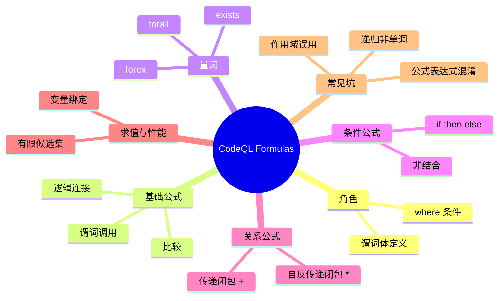

# 记忆卡片摘要（快速复习版）

## 1. 大纲（压缩版）
- CodeQL Formulas 是什么：`where` 里的“逻辑条件语言”，决定哪些变量组合成立。[来源1][来源5]
- 公式基本族：比较、谓词调用、逻辑连接（`and/or/not/implies/any/none`）、量词（`exists/forall/forex`）、条件公式（`if ... then ... else ...`）。[来源1][来源2]
- 两个核心心智模型：
  - 公式是“筛选器”，表达式是“产出值”。
  - Formula 与可求值性强相关：变量要尽量被绑定到有限候选集。[来源6]
- 高价值进阶点：关系公式与传递闭包（`+/*`）以及递归单调性限制。[来源2][来源3]
- 常见坑：把表达式当公式、量词变量作用域误用、`if-then-else` 结合方式误判、无界变量导致评估失败。[来源1][来源2][来源6]

## 2. 思维导图（Mermaid）


> Mermaid 验证状态：
> - 已做人工语法检查（节点层级、缩进、关键字、括号匹配均通过）。
> - 已尝试编译：`npx -y @mermaid-js/mermaid-cli -h`，失败（`EPERM connect 127.0.0.1:7897`，当前环境无法访问 npm registry）。
> - 当前环境未完成 Mermaid 编译通过验证；文末给出本地可执行验证步骤。

## 3. 重要知识点（必须记住）
- `where` 子句接收的是公式，不是普通“布尔表达式字符串”。[来源5]
- 谓词调用本身可以是公式；参数位置可用 `_` 作为 don’t-care 占位。[来源1]
- `exists` 是“存在满足条件”；`forall` 是“所有满足范围约束的值都满足条件”；`forex` 是“至少存在一个且全部满足条件”。[来源1]
- `implies` 只保证“前件真时后件必须真”，前件假时整体为真（常用于“只在某条件下检查约束”）。[来源1]
- `any()` 恒为真、`none()` 恒为假；常用于构造占位条件或推导逻辑等价式。[来源1]
- `if-then-else` 公式必须带 `else`，且是非结合（不要链式省括号）。[来源1]
- 公式最终会被解释成关系（元组集合）；若变量不能绑定到有限候选，查询可能报错或性能失控。[来源2][来源6]

## 4. 难点 / 易混点
- `exists(expr)`（表达式层）与 `exists(Type v | Formula)`（公式层）不是一回事，混写容易报类型/语法错误。[来源1][来源2]
- `forall` 常被误读成“全集上的 forall”；实际上通常要先给范围约束（例如 `x in ...`），否则语义不符合预期且可能不可求值。[来源1][来源6]
- `A implies B` 与 `A and B` 完全不同：前者允许 `A` 为假时跳过检查。[来源1]
- Equality 不是“两个表达式全集相等”判真，而是“是否共享至少一个值”判真；因此 `A != B` 与 `not A = B` 在空集场景下不等价，这是 4.8.2 最容易误判的点。[来源1][来源2]
- Formula 与 Expression 都能关系化，但语义层级不同：Formula 过滤赋值元组，Expression 生成值元组；把它们混用到错误上下文会触发 `expected an expression/term` 类报错。[来源2][来源4][来源6]
- 关系递归里引入否定/聚合常导致 non-monotonic recursion，不允许直接使用。[来源3]

## 5. QA 快速复习卡片
- Q: Formula 和 Expression 的一句话区别？  
  A: Expression 产生值，Formula 判断真假并筛选候选元组。[来源2][来源5]
- Q: 什么时候优先用 `implies`？  
  A: 当你想表达“只在满足前置条件时才施加约束”。[来源1]
- Q: `forex` 与 `forall` 的关键差别？  
  A: `forex` 额外要求“至少存在一个满足范围条件的对象”。[来源1]
- Q: 为什么会出现未绑定变量问题？  
  A: 因为求值器无法把变量约束到有限候选集合（缺少绑定出现点）。[来源6]
- Q: `if-then-else` 公式最容易踩的坑是什么？  
  A: 忘写 `else` 或误以为可链式结合而不加括号。[来源1]

## 6. 快速复现步骤（最短路径）
1. 先读官方 `Formulas` 页面，建立语法总览与量词语义。[来源1]
2. 再看 QL 语言规范里的 Formula 语法与优先级表，明确解析规则。[来源2]
3. 阅读 `Queries` 与 `Evaluation of QL programs`，理解 where 公式与变量绑定之间的关系。[来源5][来源6]
4. 本地跑编译实验（无需数据库）：
   - `exists/forall/forex/implies` 示例可编译通过；
   - `if-then-else` 示例先故意写错，再修正语法；
   - 关系传递闭包 `pred+` 示例可编译通过。

---

# 学习笔记正文（详细版）

## 0. 学习目标、读者画像与假设
- 技术：CodeQL QL 语言里的 `Formulas`
- 学习目标：系统掌握 Formula 的语法、语义、可求值性要求与常见实战写法，能写出结构正确、可编译、可扩展的 where 条件
- 读者水平：初学（默认）
- 时间预算：标准版（约 1-3 小时阅读 + 30-60 分钟练习）
- 版本范围：
  - 文档以 `codeql.github.com/docs` 在 `2026-02-27` 的公开内容为准
  - 本地验证环境：`CodeQL CLI 2.23.3`
- 运行环境：
  - 可执行 `codeql query compile`
  - 无法联网下载 npm 包（导致 Mermaid CLI 编译不可用）
- 假设与限制：
  - 用户提供资源是官方页面（`Formulas`），非第三方教程
  - 本笔记补充了同属官方的规范与关联页面用于交叉验证
  - 示例做了“编译级验证”（语法/类型），未在数据库上执行结果集

## 1. 背景与用途（从读者视角）

### 1.1 Formulas 解决什么问题
你写 CodeQL 时，`from` 决定“候选是谁”，`select` 决定“输出什么”，而 Formula（主要在 `where`）决定“哪些候选关系成立”。可以把它看作查询的“判定层”。[来源5]

### 1.2 为什么它是核心
- 大多数查询正确性问题来自条件表达不严谨，而不是 `select` 写错。
- 查询性能常受公式写法影响（尤其是绑定与范围约束）。[来源6]
- 高级能力（递归、传递闭包、复杂谓词）都建立在 Formula 语义之上。[来源2][来源3]

### 1.3 不掌握会怎样
- 语法合法但语义偏差（比如把 `implies` 当 `and`）。
- 变量作用域与绑定错误，触发不可求值问题。[来源6]
- 递归写法违反单调性，被编译器拒绝。[来源3]

## 2. 核心概念与术语（直白解释）

### 2.1 公式（formula）
公式是可判真假的逻辑条件；在 QL 语义里，公式对应一组“使公式为真”的变量赋值元组。[来源2]

### 2.2 表达式（expression）
表达式是“计算出值”的构造。最常见误区是把表达式直接当公式用，或反过来把公式塞进只接受表达式的位置。[来源2]

### 2.3 绑定（binding occurrence）
可以把绑定理解成“把变量收窄到有限候选集合”的证据。绑定越早越清晰，求值越稳定；否则可能报未绑定或性能问题。[来源6]

### 2.4 关系与元组（relation / tuple）
在严格语义里，公式、谓词体最终都被解释成关系（tuple set）。这也是为什么 Formula 不只是“写起来像布尔值”，而是数据库求值的一部分。[来源2]

### 2.5 don’t-care（`_`）
在谓词调用参数里，`_` 表示“该位置存在某个值即可，但我不关心它是谁”。它是占位表达式，不是变量声明。[来源1]

## 3. 工作原理 / 机制（先直观后严格）

### 3.1 直观版
可以把 CodeQL 查询想成三步：
1. `from` 先给出候选变量集合；
2. Formula（`where`）逐步过滤候选；
3. `select` 输出剩余组合。

如果 Formula 对变量约束不充分，候选空间会爆炸，甚至无法完成求值。[来源5][来源6]

### 3.2 严格版（面向进阶）
- QL 规范把 Formula 定义为一类语法非终结符，并给出比较、逻辑连接、量化、条件、关系调用等形式。[来源2]
- 语义上，Formula 在给定变量环境下产生真假；整体可视作关系选择（selection）与连接（join）的一部分。[来源2][来源5]
- 递归情况下，Formula 还受单调性约束：若定义引入否定/聚合并破坏单调性，会触发 non-monotonic recursion 限制。[来源3]

#### 3.2.1 为什么是 tuple set，而不只是“一个布尔值”
核心点：Formula 的真假不是“脱离变量”的绝对真假，而是“对某个变量赋值是否为真”。  
所以对一个含自由变量的公式 `F(x, y)`，语义上更准确的对象是：
- 所有让 `F` 为真的 `(x, y)` 赋值对
- 也就是一个二元关系（tuple set）[来源2][来源6]

这也是为什么 QL 求值更像关系代数而非普通 if 判断：
- `and` 对应关系连接（join / 交叠约束）
- `or` 对应关系并集
- `not` 对应补集（相对某个已限定域）[来源2][来源6]

#### 3.2.2 实战案例：把公式当关系看，推导会更清晰
案例 A：谓词体本身就是关系（tuple set）
```ql
predicate edge(int a, int b) {
  a = 1 and b = 2
  or a = 2 and b = 3
}
```
它定义的不是单个布尔值，而是关系：
`edge = {(1,2), (2,3)}`  
本地编译：`/tmp/codeql_formula_notes_verify/relation_edge.ql`

案例 B：`and` 是“按共享变量连接”
```ql
from int x, int y, int z
where edge(x, y) and edge(y, z)
select x, y, z, "join tuple"
```
推导：
- `edge(x,y)` 给出 `(1,2)`、`(2,3)`
- `edge(y,z)` 给出 `(1,2)`、`(2,3)`（但这里第一个位置要匹配同一个 `y`）
- 只有 `y=2` 能两边同时成立，得到 `(x,y,z)=(1,2,3)`  
本地编译：`/tmp/codeql_formula_notes_verify/relation_join.ql`

案例 C：`or` 与 `not` 分别像并集与补集（在显式域内）
```ql
from int x
where x in [1 .. 3] and (x = 1 or x = 3)
select x, "union-like by or"
```
结果关系是 `{1,3}`（并集语义）。

```ql
from int x
where x in [1 .. 3] and not x = 2
select x, "complement-like by not"
```
结果关系是 `{1,3}`（相对域 `[1..3]` 去掉 `{2}`）。

本地编译：
- `/tmp/codeql_formula_notes_verify/relation_union.ql`
- `/tmp/codeql_formula_notes_verify/relation_complement.ql`

### 3.3 如何判断“写得对”
- 编译器能通过（第一关：语法 + 类型）。
- 变量有可解释的绑定路径（第二关：可求值性）。
- 在样本数据库上结果符合预期（第三关：语义正确性，本文未做数据库执行）。[来源6]

## 4. 核心语法与构造（按重要性递进）

### 4.1 比较公式（comparison formulas）
典型形式：`x = y`、`x != y`、`x < y`、`x >= y`。  
作用：建立变量之间或变量与常量之间的约束关系，是最基础的过滤原子。[来源1][来源2]

### 4.2 谓词调用公式（predicate call formulas）
谓词调用本身就是公式，例如 `isSource(node)`。  
参数里可用 `_` 忽略不关心的位置，如 `isSource(_, sink)` 风格（具体谓词签名依库而定）。[来源1]

#### 4.2.1 “谓词返回关系，公式怎么判真/假？”（实战辨析）
你提的问题本质是：Formula 要能判真/假，但谓词语义是关系（tuple set），两者如何对齐？

严格语义下，判真不是“全局一次性真/假”，而是**相对于当前变量赋值**判真/假：[来源2][来源6]
- 给定当前赋值 `sigma`
- 计算实参值：`t1(sigma), t2(sigma), ..., tn(sigma)`
- 若元组 `(t1(sigma),...,tn(sigma))` 属于谓词关系 `P`，则 `P(t1,...,tn)` 为真；否则为假

所以“谓词返回关系”与“公式判真”并不冲突：  
关系是语义对象，真假是成员资格测试结果。

实战代码（可编译）：
```ql
predicate edge(int a, int b) {
  a = 1 and b = 2
  or a = 2 and b = 3
}
```
这个谓词定义关系：`edge = {(1,2), (2,3)}`。

在这个关系下：
- `edge(1,2)` 为真（元组在关系内）
- `edge(1,3)` 为假（元组不在关系内）

对应可编译查询：
```ql
from int x
where x = 1 and edge(1, 2)
select x, "edge(1,2) is true"
```
文件：`/tmp/codeql_formula_notes_verify/predicate_call_truth_true.ql`

```ql
from int x
where x = 1 and edge(1, 3)
select x, "edge(1,3) is false, no tuple"
```
文件：`/tmp/codeql_formula_notes_verify/predicate_call_truth_false.ql`

再看“同一谓词调用随赋值变化”：
```ql
from int a, int b
where edge(a, b)
select a, b
```
这里不是在问“edge(a,b) 全局是真还是假”，而是在枚举 `(a,b)`，只保留让 `edge(a,b)` 为真的赋值对，也就是输出关系中的元组。

#### 4.2.2 predicate 做 expression vs formula 的系统对照（含生产风格实例）
你问的核心非常关键：同样叫“predicate”，在 expression 与 formula 场景里角色不同。

| 维度 | 作为 formula 的 predicate（无 result） | 作为 expression 的 predicate（有 result） |
|---|---|---|
| 声明方式 | `predicate p(T1 a, T2 b) { ... }` | `R p(T1 a, T2 b) { ... result = ... }` |
| 逻辑编写 | 主体直接写“何时成立”的条件 | 主体写“入参 -> result 值”的关系 |
| 返回值 | 无显式返回值，只有真/假判定 | 有 `result`，类型为 `R` |
| 在求值中作用 | 过滤器：决定当前赋值是否保留 | 值生成器：产出可继续参与比较/拼接/计算的值 |
| 典型位置 | `where p(x)`、`not p(x)`、`p(x) and q(x)` | `select p(x)`、`p(x) = 42`、`"x=" + p(x)` |
| 常见误用 | 当表达式放进 `select` | 在 `where` 里直接写 `p(x)`（若 p 有 result） |

补充一个常被忽略的严格语义点：  
“有 result”的 predicate 本质仍是关系，不保证单值函数语义；若主体允许，一个入参组合可对应多个 `result` 值（只是很多工程写法会约束成单值）。[来源2][来源7]

生产风格示例（JavaScript 查询）：
```ql
import javascript

// expression 角色：产出值（callee 名）
string calleeName(CallExpr c) {
  result = c.getCalleeName()
}

// formula 角色：做过滤条件（是否敏感 sink）
predicate isSensitiveSink(CallExpr c) {
  calleeName(c) = "eval" or
  calleeName(c) = "Function"
}

from CallExpr c
where isSensitiveSink(c)          // formula 上下文
select c, calleeName(c), "sensitive sink call" // expression 上下文
```
对应文件：`/tmp/codeql_formula_notes_verify/predicate_prod_style_js.ql`（本地已编译）

同一逻辑的两个典型错误：
1. 把“有 result 的 predicate”当公式直接写进 `where`：
```ql
where calleeName(c)
```
报错：`Expected a predicate without result but found 'calleeName' ...`  
文件：`/tmp/codeql_formula_notes_verify/predicate_prod_style_js_wrong1.ql`

2. 把“无 result 的 predicate”当表达式写进 `select`：
```ql
select isSensitiveSink(c), "wrong"
```
报错：`Expected a predicate with result but found 'isSensitiveSink' ...`  
文件：`/tmp/codeql_formula_notes_verify/predicate_prod_style_js_wrong2.ql`

实战写作建议（生产查询）：
- 先定义“值谓词”（有 result）统一归一化字段，例如 `calleeName(c)`。
- 再定义“条件谓词”（无 result）封装安全规则，例如 `isSensitiveSink(c)`。
- 最后在 `where` 只拼条件谓词，在 `select` 只取值谓词，职责分离最稳。

### 4.3 逻辑连接公式
- `not F`：否定
- `F1 and F2`：合取（都要真）
- `F1 or F2`：析取（任一真）
- `F1 implies F2`：蕴含（前真后必须真；前假整体真）[来源1][来源2]

实践上，`implies` 经常用于“条件约束”：
```ql
A implies B
```
读作：如果满足 A，就必须满足 B；否则不额外约束。

### 4.4 量化公式（quantified formulas）
#### `exists`
```ql
exists(T v | Range(v) | Condition(v))
```
语义：存在至少一个 `v`，使得范围约束和条件成立。[来源1]

#### `forall`
```ql
forall(T v | Range(v) | Condition(v))
```
语义：对所有满足范围约束的 `v`，条件都成立。[来源1]

#### `forex`
```ql
forex(T v | Range(v) | Condition(v))
```
语义：既要求“至少存在一个满足 `Range(v)` 的对象”，又要求这些对象都满足 `Condition(v)`。[来源1]

> 初学建议：先会 `exists` 与 `forall`，再引入 `forex`，否则容易把“非空要求”漏掉或误加。

### 4.5 条件公式（if-then-else）
形式：
```ql
if F1 then F2 else F3
```
要点：
- `else` 必须写；
- 非结合，链式条件要显式加括号。[来源1]

### 4.6 关系公式与传递闭包
这一节容易“看懂语法、没懂语义”，这里做递归展开解释。

#### 4.6.1 先把关系公式看成图
若有二元谓词 `edge(a, b)`，可把它当成有向边 `a -> b`。  
那么 `edge+(u, v)` 的意思是：从 `u` 出发，走 **至少一步** 能到 `v`。  
`edge*(u, v)` 的意思是：从 `u` 出发，走 **零步或多步** 能到 `v`。[来源2][来源3]

#### 4.6.2 严格语义（递归定义）
设关系 `R = edge`：
- `R^1 = R`
- `R^2 = R ∘ R`（关系复合）
- `R^3 = R ∘ R ∘ R`
- ...

则：
- `R+ = R^1 ∪ R^2 ∪ R^3 ∪ ...`
- `R* = Id ∪ R+`（`Id` 是恒等关系，表示零步可达）[来源2]

这就是为什么 `*` 会“多出自反对 `(x,x)`”，而 `+` 不会。

#### 4.6.3 用一个固定小图递归推导
给定：
```ql
predicate edge(int a, int b) {
  a = 1 and b = 2
  or a = 2 and b = 3
  or a = 3 and b = 4
}
```
可视为边集 `{(1,2), (2,3), (3,4)}`。

逐层推导：
- `R^1`: `(1,2), (2,3), (3,4)`
- `R^2`: `(1,3), (2,4)`
- `R^3`: `(1,4)`
- `R^4` 及以上：空

因此：
- `R+`: `{(1,2),(2,3),(3,4),(1,3),(2,4),(1,4)}`
- `R*`: `R+` 再加 `(1,1),(2,2),(3,3),(4,4),...`（在你枚举域里可见）

#### 4.6.4 实战代码辨析（本地已编译）
案例 A：正向可达
```ql
from int x
where edge+(1, x)
select x, "reachable from 1"
```
预期集合：`{2,3,4}`（至少一步）。

案例 B：`+` vs `*`
```ql
from int x
where x = 1 and edge*(x, x) and not edge+(x, x)
select x, "star includes zero-step, plus does not"
```
该式成立，说明 `*` 包含零步，而 `+` 不包含零步。  
对应文件：`/tmp/codeql_formula_notes_verify/formula_closure_zero_step.ql`

案例 C：方向性
```ql
from int x
where edge+(x, 4)
select x, "can reach 4"
```
这表示“谁能到 4”，不是“4 能到谁”；方向一反，语义就变。  
对应文件：`/tmp/codeql_formula_notes_verify/formula_closure_direction.ql`

#### 4.6.5 高频误区与修复
- 误区 1：把 `+/*` 加在“调用结果”后面，而不是谓词名后面。  
  错写：`edge(1, x)+`  
  应写：`edge+(1, x)`  
  本地反例报错：`/tmp/codeql_formula_notes_verify/formula_closure_wrong_usage.ql`
- 误区 2：忽略方向性，把 `edge+(a,b)` 当无向图。
- 误区 3：需要零步可达却误用 `+`，应改用 `*`。
- 误区 4：闭包查询没做域收窄，导致评估范围过大；先加类型/范围约束。[来源6]

#### 4.6.6 何时该用 `+`，何时用 `*`
- 用 `+`：你明确要求“至少一跳”。
- 用 `*`：你允许“起点=终点”作为合法可达（零跳也算）。
- 不确定时，先写 `+`，再显式决定是否要补上“自反”语义，避免结果过宽。  
常用于调用链、继承链、数据流可达性等场景。[来源2][来源3]

### 4.7 优先级与可读性建议
规范中定义了 Formula 构造的优先级与结合规则。实战建议：
- 逻辑表达复杂时主动加括号，避免“人读错但编译器没错”。
- `implies` 和 `or` 混用时必须加括号。[来源2]

### 4.8 官方章节补齐（本轮递归补充）
#### 4.8.1 Calls to predicates（谓词调用）
官方强调：谓词调用本身是公式，且在类中调用成员谓词时可省略接收者，隐式接收者是 `this`。[来源1]  
官方典型写法（语义保留）：
```ql
class OneTwoThree extends int {
  predicate isEven() { this = 2 }
  predicate isOdd() { not isEven() }
}
```
`isOdd()` 等价于 `not this.isEven()`。

#### 4.8.2 Equality（相等公式）语义细节
官方重要点：在 QL 的“值集合”语义下，`A = B` 表示两个表达式共享至少一个值，不是“全集完全相等”。[来源1][来源2]  
关键例子（语义改写）：
- `A = [1..2]`，`B = [2..3]` 时，`A = B` 为真（共享值 `2`）。
- `A != B` 与 `not A = B` 在空集场景下不等价（两边都为空时前者为假，后者为真）。[来源1]

#### 4.8.3 Type check（类型检查）与 Range check（范围检查）
- 类型检查：`x instanceof T` 用于限制候选值的类型域。[来源1]
- 范围检查：`x in [1 .. 3]` 或 `x in [1, 2, 4]` 用于显式收窄候选集合。[来源1]
- 实战建议：把类型检查和范围检查尽量前置，有助于绑定与性能稳定。[来源6]

#### 4.8.4 Parenthesized formulas（括号公式）
官方单列此节是为了强调优先级歧义。推荐在 `not`、`or`、`implies` 混合时强制加括号。[来源1][来源2]  
例如：
```ql
not (a = b or c = d)
```
本地可编译验证见：`/tmp/codeql_formula_notes_verify/formula_parenthesized.ql`。

#### 4.8.5 Existential quantification（存在量化）补充：隐式量化
官方强调在某些场景下可用隐式存在量化。例如：
```ql
from int x
where x = [1 .. 3]
select x
```
可理解为“存在某个值使条件成立后返回绑定结果”。[来源1]  
本地可编译验证见：`/tmp/codeql_formula_notes_verify/formula_implicit_exists.ql`。

#### 4.8.6 Logical connectives（逻辑连接）补充：`any/none`
除 `not/and/or/implies/if-then-else` 外，官方还给出：
- `any()`：永真公式
- `none()`：永假公式 [来源1]

本地可编译验证示例：
```ql
from int x
where x = 1 and any() and not none()
select x, "any/none formula"
```
对应文件：`/tmp/codeql_formula_notes_verify/formula_any_none.ql`。

#### 4.8.7 专题辨析：`exists(expr)` vs `exists(Type v | Formula)` 为什么混写会报错
这两个写法都以 `exists` 开头，但它们属于不同语法层级。[来源1][来源2][来源4]

| 写法 | 语法角色 | 你可以把它当什么用 | 典型位置 |
|---|---|---|---|
| `exists(expr)` | 公式（由表达式派生） | 一个“真假条件” | `where`、谓词体 |
| `exists(Type v \| Formula)` | 量化公式 | 一个“真假条件” | `where`、谓词体 |

关键原因不是“一个是公式一个是公式”这么简单，而是**内部参数语法不同**：
- `exists(expr)` 的括号里必须是“表达式”；它检查这个表达式是否至少有一个取值。
- `exists(Type v | Formula)` 的括号里是“变量声明 + 公式块”。

当你混写时，解析器会在错误语境里看到错误的语法单元，于是报：
- `expected an expression but found a term instead`
- 或 `unexpected input '|' ...`

实战正例（本地已编译）：
```ql
import javascript
from Expr e
where exists(e.getParent())
select e, "exists(expr) ok"
```
文件：`/tmp/codeql_formula_notes_verify/exists_expr_ok.ql`

```ql
import javascript
from Expr e
where exists(Expr p | p = e.getParent())
select e, "exists quantifier ok"
```
文件：`/tmp/codeql_formula_notes_verify/exists_formula_ok.ql`

实战反例 1：把量化公式拿去做表达式比较（本地报错）
```ql
import javascript
from Expr e
where exists(Expr p | p = e.getParent()) = true
select e, "wrong mix"
```
报错：`expected an expression but found a term instead`  
文件：`/tmp/codeql_formula_notes_verify/exists_mix_wrong_1.ql`

实战反例 2：把表达式层 `exists` 写成量词管道风格（本地报错）
```ql
import javascript
from Expr e
where exists(e.getParent() | true)
select e, "wrong mix"
```
报错：`unexpected input '|' ...`  
文件：`/tmp/codeql_formula_notes_verify/exists_mix_wrong_2.ql`

实战反例 3：把 `exists(expr)` 放到 `select`（表达式位置）里（本地报错）
```ql
import javascript
from Expr e
where e = e
select exists(e.getParent()), "wrong select"
```
报错：`expected an expression but found a term instead`  
文件：`/tmp/codeql_formula_notes_verify/exists_mix_wrong_3.ql`

排错口诀：
- 看到 `|` 管道，就是量化公式形态：`exists(Type v | ...)`
- 不带类型声明、只包一个可求值对象，就是 `exists(expr)`
- `select` 要表达式；`where` 要公式

#### 4.8.8 Translating formulas（公式翻译/语义转换）
这一节的核心不是“语法替换”，而是把 Formula 还原成关系代数式求值过程。[来源1][来源2][来源6]

##### 4.8.8.1 递归理解框架（从一句话到严格语义）
第 1 层（直观）：
- Formula 是“过滤条件”。
- 翻译就是把条件拆成可执行的关系运算步骤。

第 2 层（中间）：
- 每个子公式先各自生成“满足它的元组集合”。
- 再按连接词组合这些集合：`and/or/not`、量词、条件分支。

第 3 层（严格）：
- 谓词调用 `P(t1,...,tn)` -> 成员资格测试（元组是否属于关系 `P`）
- `F1 and F2` -> 关系连接（交叠变量一致）
- `F1 or F2` -> 并集
- `not F` -> 相对当前域的补集
- `exists(v | F)` -> 对 `v` 维度做投影（只保留外层变量）
- `forall(v | R(v) | C(v))` -> `not exists(v | R(v) and not C(v))`
- `if A then B else C` -> `(A and B) or (not A and C)`
- `A implies B` -> `not A or B`

##### 4.8.8.2 为什么要做“翻译”
- 为了验证等价改写是否正确（重构查询不改语义）。
- 为了定位性能问题（哪一步在放大元组数）。
- 为了解释“为什么编译过了但结果不对”。

##### 4.8.8.3 实战辨析 1：`implies` 与 `not A or B` 的等价翻译
原写法：
```ql
from int x
where x in [1 .. 4] and (x = 1 implies x = 2)
select x, "implies form"
```
翻译写法：
```ql
from int x
where x in [1 .. 4] and (not x = 1 or x = 2)
select x, "not A or B form"
```
手工推导：在域 `{1,2,3,4}` 中，只有 `x=1` 使前件为真且后件为假，因此被排除；其余保留。  
本地编译：
- `/tmp/codeql_formula_notes_verify/translate_implies_form_a.ql`
- `/tmp/codeql_formula_notes_verify/translate_implies_form_b.ql`

##### 4.8.8.4 实战辨析 2：`if-then-else` 的展开翻译
原写法：
```ql
from int x
where x in [1 .. 3] and if x = 1 then x = 2 else x = 3
select x, "if-then-else form"
```
翻译写法：
```ql
from int x
where x in [1 .. 3] and ((x = 1 and x = 2) or (not x = 1 and x = 3))
select x, "disjunction form"
```
手工推导：第一支路不可满足（`x=1 and x=2`），第二支路仅 `x=3` 可满足。  
本地编译：
- `/tmp/codeql_formula_notes_verify/translate_if_form_a.ql`
- `/tmp/codeql_formula_notes_verify/translate_if_form_b.ql`

##### 4.8.8.5 实战辨析 3：`exists` 量化 = 投影
原写法：
```ql
predicate edge(int a, int b) {
  a = 1 and b = 2
  or a = 2 and b = 3
}
from int x
where exists(int y | edge(x, y) and y = 2)
select x, "exists projection style"
```
翻译直写：
```ql
predicate edge(int a, int b) {
  a = 1 and b = 2
  or a = 2 and b = 3
}
from int x
where edge(x, 2)
select x, "direct relation style"
```
解释：`exists y` 把 `(x,y)` 关系投影到 `x`，再用 `y=2` 约束。  
本地编译：
- `/tmp/codeql_formula_notes_verify/translate_exists_form_a.ql`
- `/tmp/codeql_formula_notes_verify/translate_exists_form_b.ql`

##### 4.8.8.6 实战辨析 4：`forall` 翻译为 `not exists(not ...)`
原写法：
```ql
from int x
where x in [1 .. 4] and forall(int y | y in [1 .. 3] | y <= x)
select x, "forall form"
```
翻译写法：
```ql
from int x
where x in [1 .. 4] and not exists(int y | y in [1 .. 3] | not y <= x)
select x, "not-exists form"
```
手工推导：要求 `x` 至少不小于 `1..3` 全部元素，所以只有 `x=3,4` 满足。  
本地编译：
- `/tmp/codeql_formula_notes_verify/translate_forall_form_a.ql`
- `/tmp/codeql_formula_notes_verify/translate_forall_form_b.ql`

##### 4.8.8.7 翻译时的高频误区
- 只改写表面语法，不检查变量绑定是否变化（可能引入未绑定/性能退化）。
- 对 `not` 忽略“相对哪个域取补集”，导致语义漂移。
- 把 `forall` 直接当循环理解，忘了它的等价否定存在写法更适合排障。
- 先写复杂嵌套后再调试；应先做等价翻译到更易读的形态再定位问题。

#### 4.8.9 Formula vs Expression 系统辨析（都求元组集合，为什么仍不同）
你的问题非常关键。两者都能落到“元组集合”语义，但它们描述的是不同层次的对象。

##### 4.8.9.1 一句话结论
- Formula：描述“哪些变量赋值成立”（保留/剔除赋值）。
- Expression：描述“在一个赋值下能产生哪些值”（值生成关系）。

##### 4.8.9.2 严格语义视角（关系阶数不同）
设自由变量集合是 `V={v1,...,vn}`：
- Formula `F` 对应 n 元关系：`{ (v1,...,vn) | F 为真 }`
- Expression `E` 对应 (n+1) 元关系：`{ (v1,...,vn,r) | r 是 E 在该赋值下可能值 }`

所以两者都可“关系化”，但：
- Formula 关注“赋值是否保留”
- Expression 关注“值是什么、可能有几个”

##### 4.8.9.3 多维对照（声明、类型、位置、作用）
| 维度 | Formula | Expression |
|---|---|---|
| 结果形态 | 真/假判定（对赋值） | 值（可 0/1/多值） |
| 类型系统 | 无独立值类型（逻辑项） | 有静态类型（`int/string/class/...`） |
| 典型位置 | `where`、谓词体、逻辑连接、量词体 | `select`、比较两侧、算术/字符串运算、参数传递 |
| 主要作用 | 过滤候选元组 | 生成/变换列值 |
| 常见组合符 | `and/or/not/implies/forall/exists` | `+ - * /`、字符串拼接、成员访问、函数式调用 |
| 对结果集的影响 | 改变“行是否保留” | 可能改变“每行展开成几行”（多值表达式） |

##### 4.8.9.4 实战案例 A：Expression 可能多值，Formula 不会“返回值”
```ql
int succOrSelf(int x) {
  x = [1 .. 3] and (result = x or result = x + 1)
}
from int x
where x = [1 .. 2]
select x, succOrSelf(x), "expression may yield multiple values"
```
这里 `succOrSelf(x)` 对同一 `x` 可能给两个值，说明 Expression 是“值关系”，不是单布尔。  
文件：`/tmp/codeql_formula_notes_verify/expr_multivalue_predicate.ql`（已编译）

##### 4.8.9.5 实战案例 B：Formula 负责“筛选关系”
```ql
from int x, int y
where x = [1 .. 2] and y = x + 1
select x, y, "formula binds tuple relation"
```
这里 `where` 里的公式决定哪些 `(x,y)` 元组被保留。  
文件：`/tmp/codeql_formula_notes_verify/formula_binding_example.ql`（已编译）

##### 4.8.9.6 实战案例 C：两者的桥接点
Expression -> Formula 的常见桥：
1. 比较公式：`twice(x) = 4`
2. `exists(expr)`：把“表达式有值”转成公式

示例：
```ql
import javascript
from Expr e
where exists(e.getParent())
select e, "exists(expr) bridges expression to formula"
```
文件：`/tmp/codeql_formula_notes_verify/expression_to_formula_bridge.ql`（已编译）

##### 4.8.9.7 实战案例 D：上下文错位的典型报错
```ql
from int x
where x = [1 .. 2]
select x = 1, "formula in select is invalid"
```
报错：`expected an expression but found a term instead`  
文件：`/tmp/codeql_formula_notes_verify/formula_not_expression_bridge_wrong.ql`

这类报错本质是：  
`select` 期望值表达式，但你给了公式（term）。

##### 4.8.9.8 生产查询写作建议
- 在 `where` 层先把过滤逻辑写清楚（Formula 职责）。
- 在 `select` 层再做值构造与展示（Expression 职责）。
- 需要跨层时用明确桥接（比较、`exists(expr)`），避免隐式混写。

#### 4.8.10 Additional resources（附加资源）
官方将规范、递归、评估模型等页面作为延伸。本文在“延伸学习路径”和“来源表”已对应列出。[来源1][来源2][来源3][来源6]

## 5. 常见用法与典型场景

### 5.1 场景 A：在 where 中做分层过滤
先用便宜条件收窄候选，再追加昂贵关系条件，降低求值成本。[来源5][来源6]

### 5.2 场景 B：用 `implies` 编码“条件约束”
例如“仅当节点来自某类 API 时，才要求它有安全检查”：
```ql
isSensitive(node) implies hasGuard(node)
```
比 `not isSensitive(node) or hasGuard(node)` 可读性更高（语义等价）。[来源1]

### 5.3 场景 C：用 `forall` 表达“全集约束”
例如“某集合内每个元素都满足规则”。关键是先定义好范围，不要隐式扩大到不可控域。[来源1][来源6]

### 5.4 场景 D：用 `pred+` 表达可达性
避免手写多层递归展开，提升表达力与可维护性。[来源2][来源3]

## 6. 最小可运行示例（含预期输出/现象）

> 说明：示例 1-5 在本机通过 `codeql query compile --search-path /home/nyn/Desktop/dev_tools/codeql` 做过编译验证；示例 6 为官方关键示例保留，其中一部分做了本地编译验证。  
> 验证目标是“语法与类型有效”，非“在数据库上执行结果正确”。

### 示例 1：`exists` 量词公式
- 目标：理解“存在至少一个满足条件的对象”
- 前提：`qlpack.yml` 依赖 `codeql/javascript-all`
- 代码：
```ql
/**
 * @name Formula exists demo
 * @kind problem
 */
import javascript
from Expr e
where exists(Expr p | p = e.getParent())
select e, "Has parent expression"
```
- 运行步骤：
  1. 保存为 `/tmp/codeql_formula_notes_verify/formula_exists.ql`
  2. 执行编译命令
- 预期现象：编译成功（可能有 metadata warning，不影响语法/类型验证）
- 常见错误与修复：
  - 错误：把 `exists` 写成不带变量声明但塞入公式块
  - 修复：改为 `exists(T v | ... | ...)` 结构

### 示例 2：`forall` 与 `forex`
- 目标：区分“全称”与“全称 + 非空”
- 代码（`forall`）：
```ql
/**
 * @name Formula forall demo
 * @kind problem
 */
import javascript
from Expr e
where forall(Expr p | p = e.getParent() | p instanceof Expr)
select e, "forall formula type-check"
```
- 代码（`forex`）：
```ql
/**
 * @name Formula forex demo
 * @kind problem
 */
import javascript
from Expr e
where forex(Expr p | p = e.getParent() | p instanceof AddExpr)
select e, "forex formula"
```
- 预期现象：两者都可编译通过；`forall` 示例会出现“条件恒真”警告，提示可进一步简化。
- 常见错误与修复：
  - 错误：把 `forex` 当 `forall` 用，漏掉非空语义
  - 修复：确认你的业务是否需要“至少一个”

### 示例 3：`implies` 条件约束
- 目标：表达“前件成立时后件必须成立”
- 代码：
```ql
/**
 * @name Formula implies demo
 * @kind problem
 */
import javascript
from Expr e
where e instanceof AddExpr implies exists(e.getParent())
select e, "implication formula"
```
- 预期现象：编译通过。
- 常见错误与修复：
  - 错误：误写成 `e instanceof AddExpr and exists(e.getParent())`，导致把非 AddExpr 也过滤掉
  - 修复：使用 `implies` 保留“条件触发”语义

### 示例 4：`if-then-else` 公式
- 目标：掌握条件公式写法与最小可编译形态
- 代码：
```ql
/**
 * @name Formula if then else min
 * @kind problem
 */
import javascript
from int i
where if i = 1 then i = 1 else i = 2
select i
```
- 预期现象：编译通过（会提示 query metadata/选择列 warning）。
- 常见错误与修复：
  - 错误：`where if A then exists(Expr x | ...) else true` 在某些写法下被解析到表达式上下文并报 “expected a term ...”
  - 修复：先用最小公式确认语法，再逐步替换分支内容并观察解析器反馈（必要时拆成 `implies` + `or`）

### 示例 5：关系公式 + 传递闭包（递归版）
- 目标：一次看懂 `pred+`、`pred*`、方向性与零步差异
- 代码（基础关系）：
```ql
predicate edge(int a, int b) {
  a = 1 and b = 2
  or a = 2 and b = 3
  or a = 3 and b = 4
}
```
- 查询 A：正向可达（`+`）
```ql
from int x
where edge+(1, x)
select x, "reachable from 1 by +"
```
预期：`x` 可为 `2/3/4`（至少一步）。

- 查询 B：`*` 包含零步
```ql
from int x
where x = 1 and edge*(x, x) and not edge+(x, x)
select x, "star has zero-step"
```
预期：条件成立，说明 `*` 比 `+` 多了“零步”语义。

- 查询 C：方向性
```ql
from int x
where edge+(x, 4)
select x, "can reach 4"
```
预期：`x` 可为 `1/2/3`；如果改成 `edge+(4, x)`，通常为空。

- 本地编译对应文件：
  - `/tmp/codeql_formula_notes_verify/formula_transitive.ql`
  - `/tmp/codeql_formula_notes_verify/formula_closure_plus_star.ql`
  - `/tmp/codeql_formula_notes_verify/formula_closure_zero_step.ql`
  - `/tmp/codeql_formula_notes_verify/formula_closure_direction.ql`
- 常见错误与修复：
  - 错误：写成 `edge(1, x)+`
  - 修复：必须写成 `edge+(1, x)`，闭包后缀挂在谓词名上
  - 错误：把 `+` 当成“可含零步”
  - 修复：若要零步可达，用 `*`

### 示例 6：官方关键示例保留（语义改写版）
- 目标：保留官方文档“高频被问”例子，帮助你对照原文学习
- 示例清单：
  1. Equality 语义：
     - `A = [1..2]`，`B = [2..3]` 时 `A = B` 为真（交集非空）。
     - `A != B` 与 `not A = B` 在空集语义下结果不同。[来源1]
  2. 隐式接收者谓词调用：
```ql
class OneTwoThree extends int {
  predicate isEven() { this = 2 }
  predicate isOdd() { not isEven() }
}
```
  3. 类型与范围检查：
```ql
x instanceof T
x in [1 .. 3]
x in [1, 2, 4]
```
  4. 逻辑连接示例族（官方语义保留）：
```ql
not F
F1 and F2
F1 or F2
F1 implies F2
if F1 then F2 else F3
```
  5. 全称量化与常量公式（官方重点）：
```ql
forall(int y | y in [1 .. 3] | y > 0)
any()
none()
```
- 本地验证状态：
  - 已编译：`formula_equality_semantics.ql`、`formula_implicit_exists.ql`、`formula_parenthesized.ql`、`formula_any_none.ql`
  - 未逐一编译：依赖特定库实体（如文档中的 `File`、可见性示例）的片段；已保留语义并标注出处

## 7. 常见错误与排查路径

### 7.1 错误现象：`expected a term but found an expression instead`
- 常见原因：
  - 把公式放进只接受表达式的位置，或相反
  - `if-then-else` 分支被解析到错误语境
- 排查顺序：
  1. 用最小公式替换复杂分支，确认基本语法；
  2. 每次只恢复一个子公式；
  3. 若仍不稳，改写成等价的 `implies/or` 组合。[来源1][来源2]

### 7.2 错误现象：变量未绑定 / 评估不可行
- 常见原因：缺少范围约束，变量没有有限候选集
- 排查顺序：
  1. 检查变量首次出现位置是否提供绑定；
  2. 增加类型收窄与关系约束；
  3. 把复杂公式拆成中间谓词，逐段验证。[来源6]

### 7.3 错误现象：递归定义被拒绝（non-monotonic recursion）
- 常见原因：递归定义中混入否定、聚合或其他非单调构造
- 排查顺序：
  1. 把递归核心保留为单调部分；
  2. 将非单调条件移到递归外层过滤；
  3. 对照官方递归限制页面逐条核对。[来源3]

## 8. 最佳实践与边界条件

### 8.1 最佳实践
- 先写“可编译最小公式”，再逐步加条件（减少定位成本）。
- 能用 `implies` 表达条件约束时，不要硬拼冗长 `or/not`。
- 量词总是先写范围再写性质，保证可读性与可求值性。
- 复杂 where 拆成具名谓词，提高复用与调试效率。[来源1][来源5][来源6]

### 8.2 边界条件
- `if-then-else` 是非结合：多分支必须显式括号。[来源1]
- `pred+`/`pred*` 要确保谓词参数位次与关系方向正确。[来源2]
- 递归逻辑若涉及否定/聚合，优先怀疑单调性问题。[来源3]

## 9. 版本差异 / 兼容性说明（如适用）
- 本文语法与行为以 2026-02-27 访问到的官方文档为准。
- 本地 `CodeQL CLI 2.23.3` 可编译本文示例（含 `forex`、`pred+`）。
- 不同 CodeQL 版本在库 API（如 AST 类名、成员函数）上可能有细微差异；若示例在你环境报“类型不存在”，先检查依赖 pack 版本与语言库文档。

## 10. 延伸学习路径（官方优先）
1. `Formulas`：先吃透全部构造与语义。[来源1]
2. `Expressions` + `Predicates`：解决公式/表达式边界与谓词建模方式。[来源4][来源7]
3. `Evaluation of QL programs`：理解 binding 与性能根因。[来源6]
4. `Recursion`：学习闭包与单调性边界。[来源3]
5. 将本笔记示例迁移到你常用语言（Java/Python/JS）的真实库查询中做数据库执行验证。

## 11. 官方 Formulas 章节覆盖检查（本轮）
| 官方章节 | 笔记对应位置 | 覆盖结论 |
|---|---|---|
| About formulas | 1、2、3 章 | 已覆盖 |
| Calls to predicates | 4.2、4.8.1 | 已补充示例 |
| Equality | 4.1、4.8.2、示例6 | 已补充官方关键语义例子 |
| Type check | 4.8.3、示例6 | 已补充 |
| Range check | 4.8.3、示例6 | 已补充 |
| Parenthesized formulas | 4.7、4.8.4、示例6 | 已补充并给本地编译例 |
| Existential quantification | 4.4（exists）、4.8.5 | 已补充隐式量化 |
| Universal quantification | 4.4（forall/forex） | 已覆盖 |
| Logical connectives | 4.3、4.5、4.8.6、示例6 | 已补充 `any/none` |
| Formula precedence | 4.7 | 已覆盖 |
| Binding behavior | 2.3、3.1、3.3、7.2 | 已覆盖 |
| Translating formulas | 3.2、4.8.8 | 已补充 |
| Relation formula | 4.6、示例5 | 已覆盖 |
| Formula vs Expression 语义差异 | 2.2、4.2.2、4.8.9 | 已系统补充 |
| Additional resources | 10、来源说明、4.8.10 | 已覆盖 |
| `exists(expr)` vs `exists(Type v | Formula)` | 4.8.7 | 已新增专题辨析 + 正反例 |
| 官方重要例子保留情况 | 4.8 + 示例6 | 已补齐主干例子（语义改写） |

---

# 练习与复习闭环

## 1. 分层练习

### 基础练习
- 练习 1：分别写一个 `exists`、`forall`、`forex` 示例，并用一句话解释语义差别。
- 练习 2：将 `A implies B` 改写成只用 `not/or` 的等价形式。
- 练习 3：写一个 `if-then-else` 公式，并添加括号改写成两种等价结构。

### 应用练习
- 练习 4：在某语言库中，筛选“调用了危险 API 且没有保护条件”的节点，要求使用 `implies` 或 `forall`。
- 练习 5：定义一个二元关系谓词，用 `pred+` 找所有可达点。

### 综合练习
- 练习 6：实现一个两段式查询：
  - 第 1 段：递归关系求候选集；
  - 第 2 段：在递归结果外做否定过滤，避免 non-monotonic recursion。

## 2. 动手任务（带验收标准）
- 任务：写一组 `formulas-lab.ql` 示例集合，覆盖
  - 比较公式
  - 谓词调用
  - `and/or/not/implies`
  - `exists/forall/forex`
  - `if-then-else`
  - `pred+`
- 验收标准：
  1. 每个示例均可 `codeql query compile` 通过；
  2. 每个示例附 1 行“语义说明”；
  3. 至少 2 个示例包含“故意错误版 + 修复版”。

## 3. 常见误区纠偏
- 误区：`forall` 就是“所有对象都满足”。  
  正解：是“对满足你给定范围约束的对象都满足”，范围定义非常关键。
- 误区：公式错误基本靠猜。  
  正解：用“最小化 + 逐步恢复”的排障法，定位会很快。
- 误区：递归里加个 `not` 很自然。  
  正解：先判断是否破坏单调性，必要时把 `not` 移到递归外。

## 4. 复习节奏建议
- Day 1：重读“核心语法 + 示例 1~3”，手敲并编译。
- Day 3：做应用练习，重点比较 `implies` 与 `and/or` 语义差异。
- Day 7：完成综合练习，复盘 non-monotonic recursion 规避策略。
- Day 14：把一条真实项目查询改写为“更清晰 Formula 结构”，并记录改写前后差异。

## 5. 自测题与参考答案（简版）
- 题目 1：`forex(v | R(v) | P(v))` 比 `forall(v | R(v) | P(v))` 多了什么约束？  
  参考答案：多了“存在至少一个满足 `R(v)` 的对象（非空）”约束。[来源1]
- 题目 2：`A implies B` 在 `A=false` 时结果是什么？  
  参考答案：整体为真（vacuous truth）。[来源1]
- 题目 3：为什么变量绑定和 Formula 写法有关系？  
  参考答案：Formula 决定变量如何被约束到有限候选集，直接影响可求值性与性能。[来源6]
- 题目 4：何时该对 `if-then-else` 加括号？  
  参考答案：多层条件几乎都应显式加括号，因为该构造非结合。[来源1]
- 题目 5：递归里最常见会被拒绝的模式是什么？  
  参考答案：引入导致 non-monotonic recursion 的否定/聚合等非单调构造。[来源3]

---

# 参考来源与版本说明

## 官方来源（优先）
1. [CodeQL docs: Formulas](https://codeql.github.com/docs/ql-language-reference/formulas/) - 访问日期 `2026-02-27` - 公式类型、量词、逻辑连接、条件公式
2. [QL language specification: Formulas](https://codeql.github.com/docs/ql-language-reference/ql-language-specification/#formulas) - 访问日期 `2026-02-27` - 语法与形式语义
3. [CodeQL docs: Recursion](https://codeql.github.com/docs/ql-language-reference/recursion/) - 访问日期 `2026-02-27` - 传递闭包与 non-monotonic recursion
4. [CodeQL docs: Expressions](https://codeql.github.com/docs/ql-language-reference/expressions/) - 访问日期 `2026-02-27` - 公式与表达式边界补充
5. [CodeQL docs: Queries](https://codeql.github.com/docs/writing-codeql-queries/about-codeql-queries/) - 访问日期 `2026-02-27` - `from/where/select` 结构语义
6. [CodeQL docs: Evaluation of QL programs](https://codeql.github.com/docs/ql-language-reference/evaluation-of-ql-programs/) - 访问日期 `2026-02-27` - 变量绑定与可求值性
7. [CodeQL docs: Predicates](https://codeql.github.com/docs/ql-language-reference/predicates/) - 访问日期 `2026-02-27` - 谓词体与逻辑构造

## 第三方来源（按采信程度标注）
1. 用户未提供第三方材料；本笔记为降低版本漂移风险，全部采用官方来源（A 级）作为结论依据。

## 关键结论引用映射
- [来源1] -> Formula 构造总览、`exists/forall/forex` 语义、`implies`、`if-then-else` 规则
- [来源2] -> 公式语法与关系语义、优先级/结合规则的规范依据
- [来源3] -> 递归与非单调限制、闭包相关语义
- [来源4] -> 表达式体系与 Formula 的边界理解
- [来源5] -> `where` 在查询结构中的角色
- [来源6] -> 绑定出现点、有限候选集与可求值性
- [来源7] -> 谓词体建模与公式复用方式

## 冲突点与裁决（如有）
- 冲突点：本次未发现官方来源间的实质语义冲突。
- 裁决依据：当说明粒度不同，优先采用语言规范（来源2）的形式定义，并用实用文档（来源1/3/5/6）补充教学解释。
- 采用结论：以官方规范 + 官方教程页一致口径为准。

## 本地验证记录
- CodeQL 示例编译：
  - 已通过：`formula_exists.ql`、`formula_forall.ql`、`formula_forex.ql`、`formula_implies.ql`、`formula_if_then_else_min.ql`、`formula_transitive.ql`
  - 新增通过：`formula_implicit_exists.ql`、`formula_equality_semantics.ql`、`formula_parenthesized.ql`、`formula_any_none.ql`
  - 传递闭包递归案例通过：`formula_closure_plus_star.ql`、`formula_closure_direction.ql`、`formula_closure_zero_step.ql`
  - 公式翻译等价案例通过：`translate_implies_form_a.ql`、`translate_implies_form_b.ql`、`translate_if_form_a.ql`、`translate_if_form_b.ql`、`translate_exists_form_a.ql`、`translate_exists_form_b.ql`、`translate_forall_form_a.ql`、`translate_forall_form_b.ql`
  - Formula vs Expression 语义案例通过：`expr_multivalue_predicate.ql`、`formula_binding_example.ql`、`expression_to_formula_bridge.ql`
  - tuple-set 语义案例通过：`relation_edge.ql`、`relation_join.ql`、`relation_union.ql`、`relation_complement.ql`
  - 谓词调用判真案例通过：`predicate_call_truth_true.ql`、`predicate_call_truth_false.ql`
  - predicate 角色分离（生产风格）通过：`predicate_prod_style_js.ql`、`predicate_bool_formula_ok.ql`、`predicate_result_expr_ok.ql`、`predicate_result_in_formula_ok.ql`
  - `exists` 专题通过：`exists_expr_ok.ql`、`exists_formula_ok.ql`
  - `exists` 专题反例报错：`exists_mix_wrong_1.ql`、`exists_mix_wrong_2.ql`、`exists_mix_wrong_3.ql`
  - 故意踩坑并复现错误：`formula_if_then_else.ql`（报 `expected a term but found an expression instead`）、`formula_closure_wrong_usage.ql`（报 `expected a term but found an expression instead`）、`formula_not_expression_bridge_wrong.ql`（报 `expected an expression but found a term instead`）、`predicate_result_as_formula_wrong.ql`（报 `Expected a predicate without result ...`）、`predicate_prod_style_js_wrong1.ql`（报 `Expected a predicate without result ...`）、`predicate_prod_style_js_wrong2.ql`（报 `Expected a predicate with result ...`）
- Mermaid：
  - 编译工具获取失败（`npx` 访问 npm registry 被 `EPERM` 阻断）
  - 可替代本地验证步骤：
    1. 安装 Mermaid CLI：`npm i -g @mermaid-js/mermaid-cli`
    2. 将本文 Mermaid 代码保存为 `mindmap.mmd`
    3. 执行：`mmdc -i mindmap.mmd -o mindmap.svg`
    4. 若失败，按报错行修复后重试直至通过
