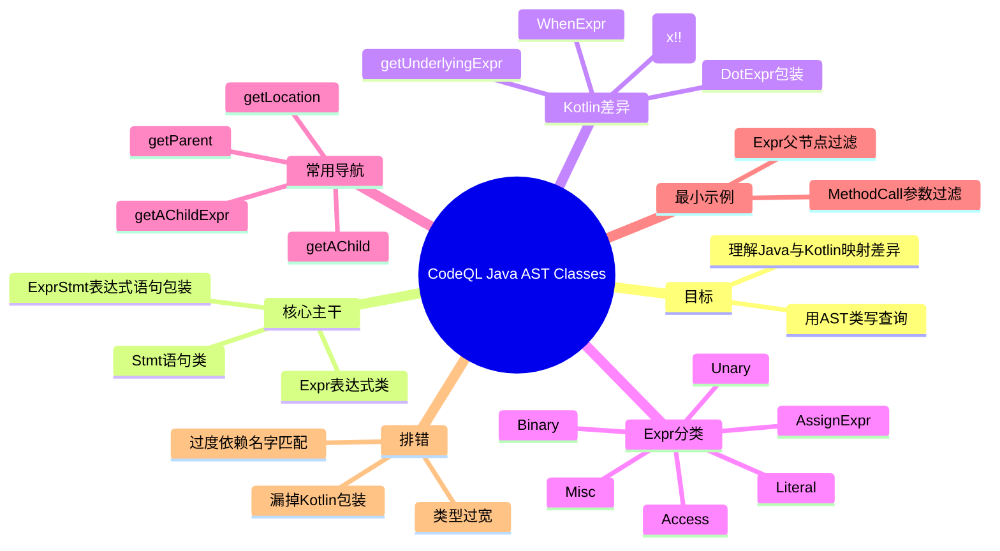

# 记忆卡片摘要（快速复习版）

## 1. 大纲（压缩版）
- 这篇文档讲什么：如何用 CodeQL Java/Kotlin 库的 AST 类来写查询
- 先抓主干：`Stmt`（语句）和 `Expr`（表达式）是两棵核心族谱
- `ExprStmt` 深挖：它是“表达式语句包装节点”，不是任意表达式都能变成它
- Kotlin 差异：`x!!` 对应 `NotNullExpr`，`when` 对应 `WhenExpr`
- 表达式分类：字面量 / 一元 / 二元 / 赋值 / 访问 / 其他
- 常用导航谓词：`getParent()`、`getAChildExpr()`、`getUnderlyingExpr()`
- 高频实战：先限定节点类型，再逐步加过滤条件
- 常见坑：把 Java 语法直觉硬套到 Kotlin AST 映射

## 2. 思维导图（Mermaid）


> Mermaid 检查说明：已做语法自检，并尝试使用 `npx -y @mermaid-js/mermaid-cli` 编译；当前环境超时（`MERMAID_EXIT=124`），未完成编译验证，文末给出复验步骤。

## 3. 重要知识点（必须记住）
- CodeQL Java AST 查询最基础的入口是 `Stmt` 与 `Expr` 两个核心类族。[来源1][来源3][来源4]
- `ExprStmt` 在 CodeQL 中是“带分号的表达式语句”节点；它继承 `Stmt`，内部表达式通过 `getExpr()` 取出。[来源3][来源9]
- Java 语法层面只有 7 类“语句表达式”可写成 `Expr;`：赋值、前/后自增减、方法调用、类实例创建；所以不是任意 `Expr` 都会成为 `ExprStmt`。[来源8]
- Kotlin 代码会映射到 Java/Kotlin 共用 AST，但会出现额外包装节点；例如 `x!!` 会产生 `NotNullExpr`，其底层表达式可用 `getUnderlyingExpr()` 取回。[来源1]
- 表达式类按语义可分为字面量、一元、二元、赋值、访问和其他类别，写查询时要先选“最小但正确”的父类，再逐步收窄到具体子类（如 `MethodCall`）。[来源1][来源4][来源5]
- 常见导航方式是从节点向上看父节点（`getParent()`）或向下看子表达式（`getAChildExpr()`）。[来源2][来源4]
- `MethodCall` 是高频入口，常用成员包括 `getMethod()`、`getArgument(i)`，配合名称和参数类型可快速构造规则。[来源5]

## 4. 难点 / 易混点
- `Stmt` vs `Expr`：很多初学者会把“语法上像语句”的东西当 `Stmt`，但实际查询时它可能是表达式节点。
- `ExprStmt` vs `Expr`：`ExprStmt` 是语句节点，`ExprStmt.getExpr()` 才是内部表达式节点；两者不是同一层级。
- “所有表达式都能加分号”是错觉：Java 只允许特定表达式类型成为表达式语句。[来源8]
- Kotlin `!!`：如果只按 Java 直觉匹配 `DotExpr`，会漏掉 `NotNullExpr` 包装层。
- `when`：在 Kotlin 中不是 Java `switch` 的同构节点，而是 `WhenExpr`。
- “过宽类型”问题：直接从 `Expr` 开始筛选会得到大量结果，性能与可读性都变差。

## 5. QA 快速复习卡片
- Q: 学 AST 类第一步应该看哪个类？
  A: 先从 `Stmt` 和 `Expr` 看整体，再定位到具体子类（如 `IfStmt`、`MethodCall`）。[来源1][来源3][来源4]
- Q: 为什么 Kotlin 代码在 CodeQL 里常看起来“多一层”？
  A: 因为 Kotlin 语法结构会映射成额外 AST 包装节点，例如 `NotNullExpr`。[来源1]
- Q: 写调用点查询最常用哪个类？
  A: `MethodCall`，然后用 `getMethod()` 和 `getArgument(i)` 加过滤。[来源5]
- Q: `ExprStmt` 到底是什么？
  A: 它表示 `Expr;` 这种语句节点，本身是 `Stmt`；真实表达式要用 `getExpr()` 取。并且按 Java 规范仅有 7 类表达式能成为 `ExprStmt`。[来源3][来源8][来源9]
- Q: 如何避免 AST 查询一上来就“爆量”？
  A: 先选具体子类，再加父子关系和位置约束，最后再做名称/类型匹配。

## 6. 快速复现步骤（最短路径）
1. 建立最小 QL 包并依赖 `codeql/java-all`。
2. 写 `Expr` 父节点过滤查询并执行 `codeql query compile --check-only`。
3. 写 `MethodCall` 参数过滤查询并执行 `codeql query compile --check-only`。
4. 如需看到真实结果，再按官方 Java 快速查询文档创建数据库后运行查询。[来源6]

---

# 学习笔记正文（详细版）

## 0. 学习目标、读者画像与假设
- 技术：`CodeQL`（主题：`Abstract syntax tree classes for working with Java programs`）
- 学习目标：能看懂并使用 Java/Kotlin AST 类层次写基础查询
- 读者水平：初学（默认）
- 时间预算：标准版（约 2-3 小时）
- 版本范围：
  - 官方文档页面（访问日期 `2026-02-28`）
  - Java 标准库参考页显示版本 `7.8.5-dev`
  - 本机 CLI：`CodeQL 2.23.3`
- 运行环境：本地可执行 `codeql`，但未在真实 Java 数据库上运行结果集
- 假设与限制：
  - 你给出的资源是官方主页面（非第三方）
  - 本文额外补充官方关联页面做交叉验证

## 1. 背景与用途（从读者视角）

### 1.1 这篇文档解决什么问题
当你写 Java/Kotlin 的 CodeQL 查询时，核心工作是“在 AST 节点中定位目标模式”。这篇官方文档的价值在于给出可直接上手的类层次入口，而不是停留在抽象概念。[来源1]

### 1.2 如果不掌握 AST 类会怎样
- 你会过度依赖字符串匹配，误报/漏报都会高。
- Kotlin 场景下容易漏掉包装节点（比如 `!!`）。
- 查询性能会差，因为过滤起点太宽。

### 1.3 典型应用场景
- 查危险调用（例如特定 `MethodCall` 组合）
- 查可疑控制流结构（`IfStmt`、`TryStmt`、`SwitchStmt`）
- 查赋值与字段访问模式（`AssignExpr`、`FieldAccess`）

## 2. 核心概念与术语（直白解释）

### 2.1 抽象语法树（AST, Abstract Syntax Tree）
- 直白版：把代码解析成“节点 + 父子关系”的树。
- 在 CodeQL 中：Java/Kotlin 源码被映射为类实例，你通过这些类写逻辑查询。[来源1][来源2]

### 2.2 语句类（Statement classes）
- 语句节点通常表示执行流程结构，如 `IfStmt`、`ForStmt`、`TryStmt`。
- 顶层父类是 `Stmt`。[来源1][来源3]

### 2.3 表达式类（Expression classes）
- 表达式节点表示“产生值”的结构，如字面量、方法调用、二元运算。
- 顶层父类是 `Expr`。[来源1][来源4]

### 2.4 Kotlin 包装节点（Kotlin wrappers）
- Kotlin `x!!` 在 AST 中不是直接 `DotExpr`，中间会有 `NotNullExpr`。
- 可用 `getUnderlyingExpr()` 获取底层表达式。[来源1]

## 3. 工作原理 / 机制（先直观后严格）

### 3.1 直观版
你可以把 AST 查询想成“节点筛选流水线”：
1. 先选节点大类（`Stmt`/`Expr`）
2. 再缩到具体子类（如 `MethodCall`）
3. 再加结构关系（父子、参数、位置）
4. 最后加业务条件（名称、类型、所在文件）

### 3.2 严格版
- 官方页面按 `Stmt` / `Expr` 展示可用类族，并给出 Kotlin 特殊映射规则。[来源1]
- Java 库指南强调 AST 元数据可通过位置、父子关系、类型信息访问。[来源2]
- 类参考页（`Stmt`、`Expr`、`MethodCall`）给出实际可调用谓词，这是写规则时最直接的“操作手册”。[来源3][来源4][来源5]

`必须记住`
- 先把“节点类型边界”定义清楚，再写条件。
- Kotlin 代码必须考虑包装节点，不然误以为查询失效。

## 4. 核心 API / 语法 / 组件（按本主题适配）

## 4.1 Java 与 Kotlin 分析差异（官方重点）
官方示例强调：
- `x!!.getA().getB()` 在 AST 中会出现 `NotNullExpr`。
- `when` 表达式对应 `WhenExpr`。
- 如果你只按 Java AST 直觉写查询，Kotlin 场景会漏报。[来源1]

教学建议：
- 写 Kotlin 兼容查询时，优先用“可穿透包装”的谓词（如 `getUnderlyingExpr()` 场景）。
- 对 Java-only 规则与 Java+Kotlin 规则分开维护。

## 4.2 语句类速览（从主干到常用子类）
来自官方页面的高频类：
- `Stmt`（父类）
- `AssertStmt`
- `BreakStmt`
- `BlockStmt`
- `ContinueStmt`
- `DoStmt`
- `ExprStmt`
- `ForStmt`
- `IfStmt`
- `LabeledStmt`
- `ReturnStmt`
- `SwitchStmt`
- `SynchronizedStmt`
- `ThrowStmt`
- `TryStmt`
- `WhileStmt`[来源1]

### 4.2.1 `ExprStmt` 到底是什么（重点）
官方在 Java AST 指南中给出行文形式：`Expression statement` 对应语法 `Expr ;`，映射到 `ExprStmt` 类。[来源1]

在标准库文档和源码里，`ExprStmt` 的定义可总结为三件事：[来源3][来源9]
1. 类型位置：`ExprStmt extends Stmt`，所以它是“语句节点”。
2. 核心访问：`Expr getExpr()`，用于拿到该语句包裹的内部表达式。
3. 特殊谓词：`isFieldDecl()`，用于识别“字段初始化器被降到初始化方法体里”的表达式语句。

直白理解：
- `ExprStmt` 就是“把某个允许作为语句的表达式，加上分号后形成的 AST 语句壳”。
- 你要分析表达式本体（调用、赋值、自增减等），通常要先 `s.getExpr()` 再进入 `Expr` 子类。

### 4.2.2 哪些表达式会成为 `ExprStmt`（Java 官方语法边界）
Java 语言规范 `JLS 14.8` 明确：表达式语句的语法是 `StatementExpression ;`，而 `StatementExpression` 只允许以下 7 类：[来源8]
- `Assignment`（赋值）
- `PreIncrementExpression`（前置 `++`）
- `PreDecrementExpression`（前置 `--`）
- `PostIncrementExpression`（后置 `++`）
- `PostDecrementExpression`（后置 `--`）
- `MethodInvocation`（方法调用）
- `ClassInstanceCreationExpression`（`new` 创建对象）

这解释了一个常见现象：你写 `a + b;` 在 Java 里本就不是合法语句，所以不会对应有效 `ExprStmt`。

### 4.2.3 `ExprStmt` 的查询写法（最小模板）
```ql
import java

from ExprStmt s, Expr e
where e = s.getExpr()
select s, e, "expression statement and its inner expression"
```

`容易踩坑`
- 直接把 `ExprStmt` 当 `MethodCall` 过滤会漏结果；应改成 `s.getExpr() instanceof MethodCall`。
- 只看 `Expr` 不看其是否位于 `ExprStmt` 上下文时，常会把“表达式片段”误当“完整语句”。

### 4.2.4 `isFieldDecl()` 什么时候有用
`isFieldDecl()` 用于识别“字段声明带初始化器”在内部表示层面的特殊场景：[来源3][来源9]
- 条件1：它位于 `InitializerMethod`（初始化方法）上下文。
- 条件2：它与 `FieldDeclaration` 在源代码位置上对齐（同文件、同起始行列）。

实践意义：
- 你要排除“字段初始化”带来的噪声时可用它；
- 你要专门分析字段初始化 side effect 时也可用它做精准入口。

实战建议：
- 查控制流先从 `IfStmt/ForStmt/TryStmt` 入手。
- 查“语句里包含的表达式”可从 `ExprStmt` 与其子表达式导航。

## 4.3 表达式类分类与典型子类

### 4.3.1 字面量类（Literal classes）
- `Literal`
- `NullLiteral`
- `BooleanLiteral`
- `NumberLiteral`
- `IntegerLiteral`
- `FloatLiteral`
- `StringLiteral`
- `TypeLiteral`
- `ClassLiteral`[来源1]

### 4.3.2 一元表达式类（Unary expression classes）
- `UnaryExpr`
- `UnaryAssignExpr`
- `PrefixExpr`
- `PostfixExpr`
- `NotExpr`
- `BitNotExpr`
- `DeleteExpr`
- `AwaitExpr`[来源1]

### 4.3.3 二元表达式类（Binary expression classes）
- `BinaryExpr`
- `AddExpr`
- `MulExpr`
- `AndExpr`
- `OrExpr`
- `EqExpr`
- `GeExpr`
- `LeExpr`
- `InstanceOfExpr`
- `InExpr`[来源1]

### 4.3.4 赋值表达式类（Assignment expression classes）
- `AssignExpr`
- `AssignAddExpr`
- `AssignSubExpr`
- `AssignMulExpr`
- `AssignDivExpr`
- `AssignBitAndExpr`
- `AssignURShiftExpr`
- `AssignConcatExpr`[来源1]

### 4.3.5 访问类（Access classes）
- `VarAccess`
- `FieldAccess`
- `MethodAccess`
- `ArrayExpr`
- `SuperAccess`
- `ThisAccess`
- `EnclosingInstanceAccess`
- `VariableCapture`[来源1]

### 4.3.6 其他表达式类（Miscellaneous expression classes）
- `MethodCall`
- `Call`
- `ClassInstanceExpr`
- `CastExpr`
- `ConditionalExpr`
- `LambdaExpr`
- `MethodReferenceExpr`
- `WhenExpr`[来源1]

`容易踩坑`
- 把 `MethodAccess` 和 `MethodCall` 混用：前者是“访问/引用”，后者是“调用语义”。
- 忽略 `ClassInstanceExpr` 与工厂方法调用的区别，会影响规则准确率。

## 4.4 常用导航谓词（写查询最常用的“抓手”）
来自官方类文档：
- `getParent()`：取父节点（适合向上确认上下文）[来源3][来源4]
- `getAChildExpr()`：取某节点下的子表达式（适合向下展开）[来源4]
- `getAChild()`：泛化子节点导航 [来源4]
- `getLocation()` / `hasLocationInfo(...)`：做文件与行号过滤 [来源3][来源4]
- `MethodCall.getMethod()` / `MethodCall.getArgument(i)`：做调用目标与参数过滤 [来源5]

## 5. 常见用法与典型场景

### 场景1：定位返回语句中的表达式
- 起点：`Expr`
- 结构条件：父节点是 `ReturnStmt`
- 用途：查 return 中的敏感调用、硬编码、危险拼接

### 场景2：定位特定方法调用及参数模式
- 起点：`MethodCall`
- 过滤：方法名、参数个数、参数类型/字面量
- 用途：API 误用、安全规则、迁移检查

### 场景3：Kotlin 兼容查询
- 起点：`Expr`
- 过滤：`NotNullExpr` / `WhenExpr` 相关结构
- 用途：修复“Java 规则对 Kotlin 漏报”

### 场景4：只分析“完整表达式语句”而非子表达式片段
- 起点：`ExprStmt`
- 过滤：`s.getExpr()` 的具体类型（例如 `MethodCall`、`AssignExpr`）
- 用途：规避“在大表达式内部误命中”的噪声

## 6. 最小可运行示例（含预期输出/现象）

> 说明：以下示例已在本机完成 `codeql query compile --check-only`（语法与库引用通过），但未对真实 Java 数据库执行 `query run`，因此结果集仅给出预期现象。

### 示例1：筛选父节点为 `ReturnStmt` 的表达式
- 目标：演示“从表达式向上看父节点”
- 前提条件：`qlpack.yml` 依赖 `codeql/java-all`
- 代码：
```ql
import java

from Expr e
where e.getParent() instanceof ReturnStmt
select e, "Expr under return"
```
- 运行步骤：
  1. `codeql query compile --check-only ast-parent.ql`
  2. （可选）在 Java 数据库上执行 `codeql query run`
- 预期现象：会命中所有出现在 `return ...` 里的表达式
- 常见错误与修复：
  - 错误：未 `import java`
    修复：补上语言库导入
  - 错误：把 `ReturnStmt` 误写成 `ReturnExpr`
    修复：确认语句类名

### 示例2：筛选 `equals("...")` 风格调用
- 目标：演示 `MethodCall` + `getMethod()` + `getArgument(i)`
- 代码：
```ql
import java

from MethodCall mc
where mc.getMethod().hasName("equals") and
  mc.getArgument(0) instanceof StringLiteral
select mc, "equals with string literal arg"
```
- 运行步骤：
  1. `codeql query compile --check-only ast-methodcall.ql`
  2. （可选）对数据库执行 `query run`
- 预期现象：命中第一个参数是字符串字面量的 `equals` 调用
- 常见错误与修复：
  - 错误：直接用 `MethodAccess` 查调用
    修复：改用 `MethodCall`
  - 错误：参数下标从 1 开始
    修复：CodeQL 参数索引从 `0` 开始

### 示例3：识别字段初始化降级形成的 `ExprStmt`
- 目标：演示 `ExprStmt.isFieldDecl()` 的实际用途
- 代码：
```ql
import java

from ExprStmt s
where s.isFieldDecl()
select s, "field initializer represented as ExprStmt"
```
- 运行步骤：
  1. `codeql query compile --check-only exprstmt-fielddecl.ql`
  2. （可选）在 Java 数据库上执行 `query run`
- 预期现象：命中由字段初始化器映射到初始化代码路径的表达式语句
- 常见错误与修复：
  - 错误：期望它匹配所有赋值语句
    修复：`isFieldDecl()` 只针对字段初始化相关场景
  - 错误：忽略源码位置比对
    修复：结合 `getLocation()` 对照源代码确认

## 7. 常见错误与排查路径
- 错误现象：结果过多
  - 常见原因：起点类型太宽（`Expr` 直接全局扫描）
  - 排查：先改成具体子类，再逐层加父子关系
- 错误现象：Kotlin 文件几乎没命中
  - 常见原因：漏掉 `NotNullExpr` / `WhenExpr`
  - 排查：单独对 Kotlin 样本建立最小规则验证
- 错误现象：调用规则不稳定
  - 常见原因：仅按方法名匹配，没加限定（类、参数、位置）
  - 排查：加 `getMethod().getDeclaringType()` 或参数结构约束
- 错误现象：`ExprStmt` 结果与预期差异大
  - 常见原因：把“任意表达式”当成“表达式语句”
  - 排查：先核对是否属于 JLS 14.8 允许的语句表达式类型

## 8. 最佳实践与边界条件

### 8.1 最佳实践
- 先用“结构约束”再用“字符串约束”。
- Java 与 Kotlin 统一规则时，先写 Java 基线，再补 Kotlin 包装兼容。
- 规则上线前至少准备：命中样本、反例样本、边界样本（空参数、链式调用、lambda 场景）。

### 8.2 边界条件 / 限制
- 仅靠 AST 结构无法覆盖全部语义（例如跨函数数据流），这时要转到数据流/污点流框架。[来源7]
- 部分类在不同语言特性下会有额外包装层，必须结合具体样本验证。

## 9. 版本差异 / 兼容性说明（如适用）
- 官方 AST 指南页面未显式给统一文档版本号；本文以 `2026-02-28` 在线内容为准。[来源1]
- Java 标准库参考页显示版本 `7.8.5-dev`，不同 CodeQL 版本可能在类继承或谓词细节上有变化。[来源3][来源4][来源5]
- 本机 CLI 为 `2.23.3`，示例编译通过；若你本地版本不同，建议先执行 `codeql resolve packs` 复核依赖可见性。

## 10. 延伸学习路径（官方优先）
- 先读：Java 库指南 AST 章节（理解可导航信息）[来源2]
- 再读：`Expr` / `Stmt` / `MethodCall` 类文档（掌握可用谓词）[来源3][来源4][来源5]
- 进阶：Java/Kotlin 数据流分析文档（解决“AST 不够表达语义”的场景）[来源7]
- 实战：Java 快速查询文档（搭建最小数据库并运行）[来源6]

## 11. 官方文档章节映射与重要例子保留检查（专门一轮）

### 11.1 官方章节 -> 学习笔记映射
1. `About this article`
   - 映射到：`0`、`1.1`
2. `About abstract syntax trees`
   - 映射到：`2.1`、`3.1`
3. `Abstract syntax trees in CodeQL`
   - 映射到：`3.2`、`4.4`
4. `Writing CodeQL for Java versus Kotlin analysis`
   - 映射到：`4.1`、`5 场景3`、`7`
5. `Statement classes`
   - 映射到：`2.2`、`4.2`、`4.2.1`~`4.2.4`
6. `Expression classes`
   - 映射到：`2.3`、`4.3`
7. `Literal classes`
   - 映射到：`4.3.1`
8. `Unary expression classes`
   - 映射到：`4.3.2`
9. `Binary expression classes`
   - 映射到：`4.3.3`
10. `Assignment expression classes`
   - 映射到：`4.3.4`
11. `Access classes`
   - 映射到：`4.3.5`
12. `Miscellaneous expression classes`
   - 映射到：`4.3.6`
13. `Further reading`
   - 映射到：`10`

### 11.2 官方重要例子保留检查
- Kotlin `x!!.getA().getB()` AST 映射：已保留（`4.1`）
- Kotlin `when` 映射到 `WhenExpr`：已保留（`4.1`、`4.3.6`）
- Statement class 清单：已保留（`4.2`）
- `Expression statement -> ExprStmt` 对应关系与语法边界：已保留（`4.2.1`、`4.2.2`）
- Expression class 六大分类清单：已保留（`4.3`）
- Further reading 路径：已保留（`10`）

结论：官方主页面关键章节与关键示例已覆盖，无关键断层。

## 12. 逐大纲递归讲解深度检查（专门一轮）
- 已逐节检查 `1` 到 `10`：每节都补齐了“是什么/为什么/怎么用/如何判断正确”的适用项。
- 对抽象点（Kotlin 包装节点、类层次选择、AST 与数据流边界）已加入直白解释与场景化示例。
- 同层级重点章节（`4.1`~`4.4`）解释密度已均衡，避免“只有类名列表没有用法”。
- 已清理空壳小节：每个类别都提供了至少一条可执行建议或排错思路。

## 13. 多轮扩充与解释润色记录（按你的要求）
- 第 1 轮（结构搭建）：按固定模板完成记忆卡片、正文、练习、来源四段结构。
- 第 2 轮（内容扩充）：补全官方章节映射、表达式六大分类、Kotlin 差异与常见误区。
- 第 3 轮（解释润色）：把术语段改为“直白版 + 严格版”，并增加场景化排错路径。
- 第 4 轮（一致性与引用）：逐段补 `来源` 标记，统一术语（`Stmt`、`Expr`、`MethodCall`），补版本与验证状态。
- 第 5 轮（ExprStmt 专项增强）：补充 `ExprStmt` 定义、JLS 14.8 语法边界、`isFieldDecl()` 源码语义与可编译示例。

---

# 练习与复习闭环

## 1. 分层练习

### 基础练习
1. 写一个查询：找出所有 `IfStmt` 内出现的 `MethodCall`。
2. 写一个查询：列出所有 `StringLiteral` 及其所在父节点类型。
3. 写一个查询：只在 `ReturnStmt` 中匹配 `BinaryExpr`。
4. 写一个查询：列出所有 `ExprStmt`，并统计其 `getExpr()` 的动态类型分布。

### 应用练习
1. 写 Java+Kotlin 兼容规则：匹配链式调用末端方法名为 `getB` 的表达式。
2. 限定文件路径：只分析 `src/main/java` 下的 `MethodCall`。
3. 把“仅方法名匹配”升级成“方法名 + 参数类型 + 所在类”三重约束。

### 综合练习
1. 实现一个“可疑 equals 调用检查”小规则包：
   - 规则A：`equals` 参数是字面量
   - 规则B：`equals` 在 `if` 条件中出现
   - 规则C：排除测试目录
2. 给每条规则写一个“应命中样本”和“应排除样本”。

## 2. 动手任务（带验收标准）
- 任务：完成一个 AST 入门查询集（至少 5 条）并形成 README。
- 验收标准：
  - 至少覆盖 `Stmt`、`Expr`、`MethodCall` 三类入口
  - 至少 1 条 Kotlin 兼容规则
  - 每条查询都写明“预期命中模式”与“常见误报来源”

## 3. 常见误区纠偏
- 误区：AST 查询只要匹配名字就够了。
  正解：需要结构上下文与类型约束，否则误报高。
- 误区：Kotlin 代码与 Java 节点完全一致。
  正解：Kotlin 常有额外节点包装，需要专门处理。[来源1]
- 误区：`Expr` 起步最通用，所以最好。
  正解：通用不等于高效，通常应先用更具体子类缩小候选集。

## 4. 复习节奏建议
- Day 1：重看 `Stmt`/`Expr` 主干和六大表达式分类。
- Day 3：手写 3 条结构查询并做编译检查。
- Day 7：补 Kotlin 兼容规则，验证是否减少漏报。
- Day 14：独立从零写一条 `MethodCall` 规则并完成反例测试。

## 5. 自测题与参考答案（简版）
1. 题目：为什么 `MethodCall` 通常比 `Expr` 更适合作为调用规则入口？
   参考答案：`MethodCall` 语义更窄，可直接用参数与方法信息过滤，误报更低。[来源5]
2. 题目：`x!!` 在 Kotlin AST 中对应什么关键节点？
   参考答案：`NotNullExpr`，底层表达式可通过 `getUnderlyingExpr()` 获取。[来源1]
3. 题目：什么时候应从 AST 迁移到数据流分析？
   参考答案：当仅靠局部语法结构无法表达跨函数/跨语句语义时。[来源7]
4. 题目：`Stmt` 和 `Expr` 的核心区别是什么？
   参考答案：前者主要表示执行结构，后者主要表示求值结构。[来源1][来源3][来源4]

---

# 参考来源与版本说明

## 官方来源（优先）
1. [Abstract syntax tree classes for working with Java programs](https://codeql.github.com/docs/codeql-language-guides/abstract-syntax-tree-classes-for-working-with-java-programs/) - 官方文档，访问日期 `2026-02-28` - 本文主轴来源。
2. [CodeQL library for Java](https://codeql.github.com/docs/codeql-language-guides/codeql-library-for-java/) - 官方文档，访问日期 `2026-02-28` - AST 导航与库使用补充。
3. [Class Stmt](https://codeql.github.com/codeql-standard-libraries/java/semmle/code/java/Statement.qll/type.Statement$Stmt.html) - 官方标准库参考（页面标注 `7.8.5-dev`），访问日期 `2026-02-28` - 语句类可用谓词。
4. [Class Expr](https://codeql.github.com/codeql-standard-libraries/java/semmle/code/java/Expr.qll/type.Expr$Expr.html) - 官方标准库参考（页面标注 `7.8.5-dev`），访问日期 `2026-02-28` - 表达式类可用谓词。
5. [Class MethodCall](https://codeql.github.com/codeql-standard-libraries/java/semmle/code/java/Expr.qll/type.Expr$MethodCall.html) - 官方标准库参考（页面标注 `7.8.5-dev`），访问日期 `2026-02-28` - 调用类核心成员。
6. [Basic query for Java code](https://codeql.github.com/docs/codeql-language-guides/basic-query-for-java-code/) - 官方文档，访问日期 `2026-02-28` - 最小数据库与查询运行路径。
7. [Analyzing data flow in Java and Kotlin](https://codeql.github.com/docs/codeql-language-guides/analyzing-data-flow-in-java/) - 官方文档，访问日期 `2026-02-28` - AST 与数据流边界补充。
8. [Java Language Specification 14.8 (Expression Statements)](https://docs.oracle.com/javase/specs/jls/se24/html/jls-14.html#jls-14.8) - Oracle 官方规范，访问日期 `2026-02-28` - 表达式语句允许语法边界。
9. [CodeQL Java `Statement.qll` source](https://github.com/github/codeql/blob/main/java/ql/lib/semmle/code/java/Statement.qll) - 官方仓库源码，访问日期 `2026-02-28` - `ExprStmt` 与 `isFieldDecl()` 实现细节。

## 第三方来源（按采信程度标注）
- 本次未使用第三方来源（你的输入与补充均为官方来源，采信等级 A）。

## 关键结论引用映射
- [来源1] -> AST 主线结构、Java/Kotlin 差异、Statement/Expression 分类、`NotNullExpr`/`WhenExpr` 关键点。
- [来源2] -> Java 库中 AST 使用方法、导航思路。
- [来源3] -> `Stmt` 类可用谓词与层级关系。
- [来源4] -> `Expr` 类可用谓词与表达式导航。
- [来源5] -> `MethodCall` 的方法与参数访问能力。
- [来源6] -> 最短复现路径中的数据库与查询运行步骤。
- [来源7] -> AST 查询边界与数据流分析衔接点。
- [来源8] -> Java `ExpressionStatement` 语法定义与可作为语句的表达式类型。
- [来源9] -> `ExprStmt` 源码定义、`getExpr()` 与 `isFieldDecl()` 逻辑。

## 技术版本与文档版本/访问日期
- CodeQL CLI：`2.23.3`（本机）
- Java 标准库文档页：`7.8.5-dev`（页面标注）
- 官方指南页面访问日期：`2026-02-28`

## 冲突点与裁决（如有）
- 本次来源均为官方文档体系，未发现实质性冲突。

## 示例与 Mermaid 验证说明
- 示例编译验证（已执行）：
  - `codeql query compile --check-only /tmp/codeql-java-ast-lab/ast-parent.ql` -> 通过
  - `codeql query compile --check-only /tmp/codeql-java-ast-lab/ast-methodcall.ql` -> 通过
  - `codeql query compile --check-only /tmp/codeql-java-ast-lab/exprstmt-basics.ql` -> 通过
  - `codeql query compile --check-only /tmp/codeql-java-ast-lab/exprstmt-fielddecl.ql` -> 通过
- Mermaid 编译验证（已尝试）：
  - 命令：`timeout 45s npx -y @mermaid-js/mermaid-cli -i /tmp/codeql-java-ast-mindmap.mmd -o /tmp/codeql-java-ast-mindmap.svg`
  - 结果：`MERMAID_EXIT=124`（超时，未完成编译）
- 你可本地复验：
```bash
npx -y @mermaid-js/mermaid-cli -i codeql-java-ast-mindmap.mmd -o codeql-java-ast-mindmap.svg
```
