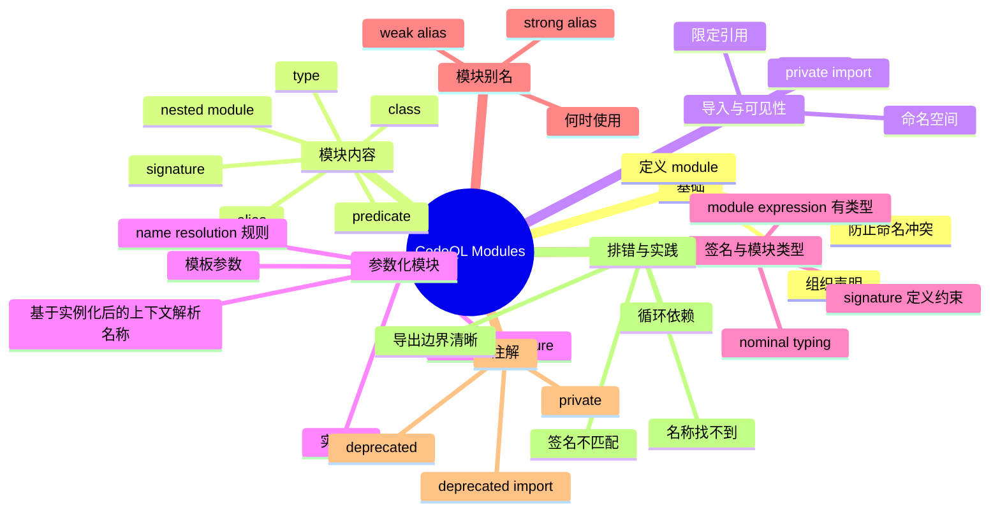

# 记忆卡片摘要（快速复习版）

## 1. 大纲（压缩版）
- CodeQL 的 `module` 是什么，为什么它是组织查询库的基础
- 模块里能放什么：谓词、类、类型、模块、签名、别名等
- `import` 的作用、导入可见性（尤其 `private import`）与命名空间规则
- 限定引用（qualified reference）与名字解析（name resolution）
- 参数化模块（parameterized module）与模块实例化（instantiation）
- `signature` / `module` 类型与匹配规则（名义类型 nominal typing）
- 模块别名（weak / strong alias）的语义差异
- 注解（`private` / `deprecated`）在模块与导入上的用法
- 常见错误、排查路径、最佳实践

## 2. 思维导图（Mermaid）


> Mermaid 检查说明：已做人工语法自检（层级缩进、节点文本、结构）；尝试通过 `npx @mermaid-js/mermaid-cli` 编译验证，但当前环境命令超时（20s 无输出），未完成编译验证，文末给出降级说明与本地验证命令。

## 3. 重要知识点（必须记住）
- `module` 是 QL 中“声明的容器（container）”，用于组织相关声明并避免命名冲突。[来源1]
- 模块本身也有“模块类型（module type）”，通常由 `signature` 描述；模块与签名采用名义类型（nominal typing），不是结构类型匹配。[来源2]
- `import` 会把被导入模块中的名字引入当前模块；导入模块本身也会成为一个命名空间，可通过 `M::x` 限定引用。[来源1][来源4]
- `private import` 会阻止通过当前模块“再导出”该导入模块中的名字，常用于隐藏实现细节。[来源1][来源5]
- 参数化模块像“模块模板”，实例化时实参模块必须匹配形参签名；实例化结果是一个模块表达式，也有模块类型。[来源1][来源2][来源4]
- 模块别名有弱/强两种语义：弱别名更多是额外命名空间入口；强别名允许覆盖（hide）原别名名下已有名字。[来源3][来源4]
- 模块依赖（imports）不能形成环（cyclic dependency）。[来源1]

## 4. 难点 / 易混点
- “模块（`module`）”和“模块签名（`signature`）”不是一回事：前者提供实现，后者只给接口/约束。[来源1][来源2]
- `import M` 后既能直接用导入进来的名字，也能用 `M::name`；但是否可见还受名字冲突与 `private import` 影响。[来源1][来源4][来源5]
- 参数化模块的名字解析不是简单文本替换，官方定义了实例化上下文下的限定/非限定查找规则。[来源4]
- 强别名/弱别名差异常在“名字冲突时”才暴露，平时不出错但一改库结构就可能踩坑。[来源3]

## 5. QA 快速复习卡片
- Q: CodeQL 里为什么需要模块？
  A: 为了组织声明、管理命名空间、复用库代码，并减少名称冲突。[来源1]
- Q: `signature` 能直接执行吗？
  A: 不能，它描述模块接口约束；真正可用的是满足该签名的 `module` 实现。[来源2]
- Q: `private import` 最直观的作用是什么？
  A: 你可以在内部复用某模块，但不把它的名字暴露给导入你这个模块的使用者。[来源1][来源5]
- Q: 参数化模块什么时候值得用？
  A: 当你有同一套逻辑，需要在不同“提供某接口的模块”上复用时（类似模板/泛型思路）。[来源1][来源2]
- Q: 强别名和弱别名怎么选？
  A: 默认优先弱别名；只有明确需要让别名覆盖既有名字时再用强别名，并写清意图。[来源3]

## 6. 快速复现步骤（最短路径）
1. 通读官方 `Modules` 页面，先掌握定义/导入/参数化模块/`private import`/内建模块。[来源1]
2. 阅读 `Signatures` 页面中“module signatures / module types”部分，理解签名与名义类型。[来源2]
3. 阅读 `Aliases` 页面，掌握弱/强模块别名语义差异。[来源3]
4. 阅读 `Name resolution` 页面，重点看命名空间、限定引用、实例化中的名字解析规则。[来源4]
5. 练习 3 个最小片段：普通模块导入、参数化模块实例化、别名冲突演示。

---

# 学习笔记正文（详细版）

## 0. 学习目标、读者画像与假设
- 技术：`CodeQL / QL language` 的 `modules`
- 学习目标：系统理解模块体系，能读懂官方库中模块定义与参数化模块，并自己写出基础模块与签名
- 读者水平：初学（默认假设），已知道 QL 基本查询结构（`from/where/select`）
- 时间预算：标准版（1-3 小时阅读 + 30-60 分钟练习）
- 版本范围：以 `codeql.github.com` 官方文档当前页面为准（访问日期 `2026-02-26`）
- 运行环境：当前环境用于文档编写；本文示例未在本地 CodeQL 数据库上实际执行
- 假设与限制：
  - 用户给出的资源是官方 `Modules` 页面（不是第三方资源）
  - 本文额外补充官方关联页面：`Signatures`、`Aliases`、`Name resolution`、`Annotations`
  - 若 Mermaid CLI 不可用，会明确降级说明

## 1. 背景与用途（从读者视角）

### 1.1 为什么学模块而不是只会写单文件查询
刚开始写 CodeQL 查询时，你可能只写一个 `.ql` 文件，把谓词、类、辅助函数都放一起。这样能跑，但很快会出现问题：
- 名字冲突（不同文件都叫 `isSource`）
- 复用困难（复制粘贴代码）
- 接口边界不清（哪些是给别人用的，哪些只是内部细节）
- 配置化困难（同一套逻辑需要换一组定义）

`module` 就是解决这些问题的核心机制：它把相关声明打包成一个命名空间，并通过 `import`、`signature`、参数化模块等机制支持复用与组合。[来源1][来源2][来源4]

### 1.2 模块在 CodeQL 生态里的实际价值
在官方查询库中，很多分析能力都是“模块化”组织的：
- 公共库（通用抽象、辅助谓词）
- 语言库（AST/IR 类型与 API）
- 分析配置（源点/汇点/清洗器定义）
- 可替换组件（通过签名约束）

`必须记住`
- 学会模块后，你不是只会“写查询”，而是开始具备“写可复用查询库”的能力。

## 2. 核心概念与术语（直白解释）

### 2.1 模块（module）
官方定义：模块是一个“容器（container）”，里面可以包含相关声明。[来源1]

直白理解：
- 你可以把模块理解成一个“命名空间 + 代码组织单元”。
- 模块内的声明彼此靠得近，外部通过导入和限定名访问。

### 2.2 模块内容（declarations inside a module）
官方文档说明模块里可包含：谓词、类、newtypes、代数数据类型、别名、绑定集、类型、模块、签名等声明。[来源1]

这说明 `module` 不只是装“函数（谓词）”，而是能装整套 DSL/库结构。

### 2.3 导入（import）
`import M` 的核心作用：把模块 `M` 的声明带到当前作用域，同时 `M` 自身也成为一个可用命名空间。[来源1][来源4]

### 2.4 命名空间（namespace）与限定引用（qualified reference）
在名字解析规则里，模块、类、谓词、代数数据类型等都可以作为命名空间。限定引用形如 `Namespace::name`。[来源4]

直白理解：
- `name` 是“直接叫名字”
- `M::name` 是“明确说这个名字来自模块 `M`”

### 2.5 模块签名（module signature）
`signature` 描述的是“一个模块应当提供什么名字/接口”，但不提供实现。[来源2]

可类比（仅辅助理解）：
- 有点像接口（interface）或抽象协议（protocol）
- 但最终仍要回到 QL 真实机制：它用于模块类型检查与参数化模块约束

### 2.6 参数化模块（parameterized module）
参数化模块是“接收模块参数的模块定义”。形参通常带签名约束，例如 `module M<ASig A>`。[来源1][来源2]

作用：把一套分析逻辑写一次，然后把“变化点”抽成模块参数。

### 2.7 模块别名（module alias）
别名是给一个已有模块表达式起新名字的机制，官方区分弱别名（`module X = Y`）和强别名（`module X => Y`）。[来源3]

### 2.8 注解（annotations）与模块可见性
模块/导入可用 `private`、`deprecated` 等注解（语法上可省略 `@`）。[来源5]
- `private module M { ... }`：模块私有
- `private import X`：私有导入（不再导出）
- `deprecated module M { ... }` / `deprecated("msg") module M { ... }`

## 3. 工作原理 / 机制（先直观后严格）

### 3.1 直观版：模块系统在做三件事
1. 组织代码：把相关声明收在一起。
2. 管理名字：通过命名空间避免冲突。
3. 约束复用：通过签名和参数化模块做可替换组件。

### 3.2 严格版：声明容器 + 名字解析 + 模块类型检查
从官方文档合起来看，模块机制至少涉及三层规则：[来源1][来源2][来源4]
- 声明容器规则：模块里可以声明哪些实体，以及导入如何引入名字。[来源1]
- 名字解析规则：非限定/限定引用如何在当前模块、导入模块、命名空间中查找。[来源4]
- 模块类型规则：模块表达式的类型、签名匹配、参数化模块形参与实参检查（名义类型）。[来源2]

`必须记住`
- 很多“看起来像语法问题”的报错，本质其实是名字解析或模块类型不匹配问题。

## 4. 核心 API / 语法 / 组件 / 命令（按技术类型适配）

## 4.1 基础模块定义语法
官方示例结构如下：[来源1]

```ql
module OneTwoThree {
  int one() { result = 1 }
  int two() { result = 2 }
  int three() { result = 3 }
}
```

要点：
- `module Name { ... }` 定义一个命名模块
- 模块体里可以写多个声明（上例是 3 个谓词）
- 模块名之后可被 `import`，也可作为命名空间 `Name::pred`

## 4.2 导入模块与直接使用导入名字
官方文档示例：导入后可直接使用导入模块中的谓词（如 `one()`）。[来源1]

```ql
import OneTwoThree

from int x
where x = one() + two() + three()
select x
```

预期现象（概念层面）：查询得到 `6`（若上下文完整且语法环境正确）。

`容易踩坑`
- 如果导入后同名声明冲突，可能需要写成限定引用（`OneTwoThree::one()`）。[来源4]

## 4.3 限定引用（Qualified Reference）与命名空间
当一个名字不明确、冲突或你想提高可读性时，用 `::` 指定来源命名空间。[来源4]

```ql
import OneTwoThree

from int x
where x = OneTwoThree::one() + OneTwoThree::two() + OneTwoThree::three()
select x
```

名字解析重点（来自官方规则）：[来源4]
- 限定引用 `Q::m` 会先解析限定符 `Q` 为某个命名空间
- 再在该命名空间中查找成员 `m`
- 非限定引用则会在当前上下文与导入范围内按规则查找，冲突时可能报错或需要消歧

## 4.4 `private import`：导入但不再导出
官方 `Modules` 页面说明：`private import` 引入模块内声明，但这些名字不会被“再次导出”给后续导入当前模块的用户。[来源1]
官方 `Annotations` 页面也给了语法示例：`private import javascript`。[来源5]

适用场景：
- 当前模块内部需要某依赖模块实现功能
- 但你不希望使用者通过导入你的模块就顺便看到/依赖该内部模块的 API

示意：
```ql
module InternalHelpers {
  int helper() { result = 42 }
}

module PublicApi {
  private import InternalHelpers

  int exposed() { result = InternalHelpers::helper() }
}
```

概念效果：
- `PublicApi` 内部可用 `InternalHelpers`
- 导入 `PublicApi` 的其他模块，不会自动拿到 `helper` 这个名字（降低 API 泄漏）

## 4.5 参数化模块（Parameterized Modules）

### 4.5.1 定义形参签名（signature）
官方文档示例（模块签名）类似：[来源2]

```ql
signature ASig {
  class T extends int;
}
```

这表示：任何要匹配 `ASig` 的模块，都需要提供一个名为 `T` 的类（并满足该签名声明语义）。

### 4.5.2 定义参数化模块
官方 `Modules` 页示例语法：[来源1]

```ql
module M<ASig A, BSig B> {
  private import A
  private import B

  class T extends A::T, B::T { }
}
```

直白解释：
- `M` 是模块模板
- `A`、`B` 是模块参数（它们本身是模块）
- `ASig`、`BSig` 是对参数模块的接口约束
- 模板内部通过 `A::...` / `B::...` 使用参数模块提供的声明

### 4.5.3 实例化参数化模块
官方示例：[来源1]

```ql
module MAB = M<A, B>
```

这里 `M<A, B>` 是模块实例化表达式（module instantiation expression），结果是一个模块表达式，可以赋给别名或继续作为命名空间使用。[来源1][来源2][来源4]

### 4.5.4 参数化模块中名字解析的特别规则（重要）
官方名字解析页面指出：在实例化上下文中，非限定引用与限定引用会相对于“实例化后的命名空间”进行处理，而不是简单静态复制；并给出 `Q::R::m` 的解析思路（先解析 `Q`，再在 `Q` 中解析 `R::m`）。[来源4]

#### 4.5.4.1 先用一句话理解这条规则
实例化后，解析器不是把模板代码“替换成一段纯文本”再编译，而是基于“这个实例化模块自己的命名空间”去解析名字。[来源4]

#### 4.5.4.2 例子 A：非限定引用如何在实例化上下文中被解析
```ql
signature NumSig {
  int base();
}

module OneBase implements NumSig {
  int base() { result = 1 }
}

module AddOne<NumSig N> {
  private import N

  int value() { result = base() + 1 }
}

module Q = AddOne<OneBase>
```

这里 `value()` 里写的是非限定引用 `base()`。它的解析过程可理解为：
1. 先进入实例化结果模块 `Q`（也就是 `AddOne<OneBase>` 的实例）。
2. 在 `Q` 的可见名字里找 `base`。
3. 由于模板里 `private import N`，而 `N` 在本次实例化中绑定为 `OneBase`，所以这里的 `base()` 解析到参数模块实参提供的 `base`。

这就是“相对于实例化后命名空间解析”的直观体现：同一个模板，换一个实参模块，`base()` 的绑定目标就会跟着变，而不是固定写死。

#### 4.5.4.3 例子 B：`Q::R::m` 为什么是“先 Q，再 R::m”
```ql
signature NumSig {
  int base();
}

module OneBase implements NumSig {
  int base() { result = 1 }
}

module Wrapper<NumSig N> {
  module R {
    int m() { result = 42 }
  }
}

module Q = Wrapper<OneBase>
```

当你写 `Q::R::m` 时，可按官方思路分两步理解：[来源4]
1. 先把 `Q` 解析成一个命名空间（这里是实例化模块 `Wrapper<OneBase>`）。
2. 再在这个 `Q` 命名空间里解析 `R::m`，即先找 `R`，再找 `m`。

所以 `Q::R::m` 指向的是“实例化模块 `Q` 内部的 `R` 模块里的 `m`”，不是全局随便一个同名 `R::m`。

#### 4.5.4.4 常见误解：把参数化模块当作纯文本替换
- 误解：`Q = Wrapper<OneBase>` 只是把 `OneBase` 文本替进去，名字解析不会变。
- 正解：名字解析仍按命名空间规则执行，且发生在实例化上下文；限定引用会逐段解析，非限定引用会在实例化模块可见范围里查找。[来源4]

`必须记住`
- 参数化模块不是“文本宏替换”；它受正式名字解析规则约束。

## 4.6 模块签名与模块类型（Module Signatures and Module Types）

### 4.6.1 模块表达式也有类型
官方 `Signatures` 页面明确说明：模块表达式的类型称为模块类型（module type）。[来源2]

例子（官方形式）：[来源2]
```ql
signature S { predicate p(); }
module A implements S { predicate p() { none() } }
```
- `A` 的模块类型是 `S`
- `A` 可以作为需要 `S` 的位置的实参（例如参数化模块形参）

### 4.6.2 签名匹配使用名义类型（nominal typing）
官方明确写到：匹配使用“名义类型”，不是“结构类型”。即两个签名就算内部结构看起来一样，也不一定可互换，取决于签名标识与规则。[来源2]

这点非常关键，因为很多人会误以为“字段/谓词长得一样就能传”。

#### 4.6.2.1 先给结论：什么叫“名义类型”而不是“结构类型”
- 名义类型（nominal typing）：看“你声明自己实现了哪个签名名”（名字/身份），不是只看成员形状是否相同。
- 结构类型（structural typing，QL 在这里不是）：只看“成员列表是否长得一样”。

在 CodeQL 模块签名里，判定更接近前者。[来源2]

#### 4.6.2.2 例子 A：名义匹配成功（标准路径）
```ql
signature Sig {
  predicate ok(int x);
}

module Impl implements Sig {
  predicate ok(int x) { x = 1 }
}

module Use<Sig M> {
  predicate test(int x) { M::ok(x) }
}

module Good = Use<Impl>
```

为什么成功：
1. `Use` 的形参要求是 `Sig`。
2. `Impl` 明确 `implements Sig`。
3. 所以 `Use<Impl>` 满足名义匹配要求。

#### 4.6.2.3 例子 B：结构看起来一样，但名义匹配失败（核心反例）
```ql
signature SigA {
  predicate ok(int x);
}

signature SigB {
  predicate ok(int x);
}

module ImplA implements SigA {
  predicate ok(int x) { x = 1 }
}

module UseB<SigB M> {
  predicate test(int x) { M::ok(x) }
}

module Bad = UseB<ImplA>
```

`SigA` 和 `SigB` 的成员“结构上看起来一样”，但 `Bad = UseB<ImplA>` 仍应视为不匹配（期望 `SigB`，实参只有 `SigA` 身份）。这正是“不是结构匹配”的要点。[来源2]

#### 4.6.2.4 如何修复：做显式适配模块（adapter）
```ql
signature SigA {
  predicate ok(int x);
}

signature SigB {
  predicate ok(int x);
}

module ImplA implements SigA {
  predicate ok(int x) { x = 1 }
}

module AdapterB implements SigB {
  predicate ok(int x) { ImplA::ok(x) }
}

module UseB<SigB M> {
  predicate test(int x) { M::ok(x) }
}

module GoodB = UseB<AdapterB>
```

修复思路：
1. 不依赖“结构碰巧一致”。
2. 显式提供一个实现 `SigB` 的适配模块。
3. 在适配模块里把调用委托给 `ImplA`。

#### 4.6.2.5 工程意义：为什么官方设计成名义匹配
- 避免“偶然同名同签名”导致错误模块被悄悄接入。
- 接口演进更可控：签名名本身就是契约边界。
- 在大型查询库中，可读性更强，排错更快（看到 `implements XxxSig` 就知道它对哪个契约负责）。

`容易踩坑`
- 如果你复制了一份几乎相同的 `signature`，实参模块可能仍不匹配另一个形参签名。

### 4.6.3 `implements` 的作用
`module A implements S { ... }` 表示模块 `A` 声明它实现签名 `S`，并接受相应检查。[来源2]

最佳实践：
- 给公共模块显式写 `implements`，让接口边界更清晰
- 让报错更早暴露在模块定义阶段，而不是实例化阶段

## 4.7 模块别名（Module Aliases）：弱别名 vs 强别名
官方 `Aliases` 页面给出两种写法：[来源3]
- 弱别名：`module M = P`
- 强别名：`module M => P`

### 4.7.1 弱别名（weak alias）
官方解释：弱别名给 `P` 增加一个额外路径 `M`；可理解为“再提供一个访问入口”。[来源3]

```ql
module M = P
```

### 4.7.2 强别名（strong alias）
官方解释：强别名会隐藏（hide）`M` 命名空间中先前可见的名字，使 `M` 明确解析到 `P`。[来源3][来源4]

```ql
module M => P
```

什么时候需要强别名：
- 你明确要让 `M::...` 指向另一个模块，并覆盖/屏蔽旧 `M`
- 在大型库重构中做兼容层时可能有用，但要谨慎

### 4.7.3 选型建议（工程实践）
- 默认使用弱别名（更保守）
- 只有在你清楚名字隐藏影响时才用强别名
- 为强别名旁边加注释，说明“为何需要覆盖”

## 4.8 模块与注解（Annotations）

### 4.8.1 `private` 注解到模块
官方注解页面示例：`private module M { ... }`。[来源5]

作用：限制模块可见性（通常用于内部实现模块）。

### 4.8.2 `deprecated` 注解到模块
官方示例：
- `deprecated module M { ... }`
- `deprecated("Module M is deprecated") module M { ... }`[来源5]

作用：给使用者明确迁移信号。

### 4.8.3 `deprecated import`
官方注解页面示例：`deprecated import java`。[来源5]

这类写法用于标记导入语句已弃用（例如迁移到新模块路径/新 API）。

`先知道即可`
- 注解语法在 QL 中常可省略 `@` 前缀；官方页面明确两种写法等价。[来源5]

## 4.9 内建模块（Built-in Modules）
官方 `Modules` 页面还说明了一些内建模块（例如 `semmle.code.cpp.commons.BigInt`，并展示 `BigInt::Type` / `BigInt::Range` 的使用）。这说明“模块不仅是用户自定义组织工具，也是标准库 API 设计方式”。[来源1]

对学习者的意义：
- 看到 `X::Y` 不要只想到“类静态成员”，在 QL 里它常常是“模块命名空间下的声明”。

## 5. 常见用法与典型场景

## 5.1 场景一：把查询逻辑拆成公共模块 + 查询入口
目标：避免主查询文件塞满辅助谓词。

做法：
- `module Helpers { ... }`
- 入口 `.ql` 文件 `import Helpers`
- 主逻辑只保留 `from/where/select`

收益：可读性更高，方便复用。

## 5.2 场景二：通过 `private import` 隐藏实现依赖
目标：对外暴露稳定 API，对内保留实现灵活性。

做法：
- `module PublicApi` 中 `private import InternalV1`
- 对外只暴露 `PublicApi` 的包装谓词/类

收益：降低调用方对内部模块路径和细节的耦合。[来源1][来源5]

## 5.3 场景三：参数化模块实现“可替换配置”
典型思路：
- 写一个签名 `ConfigSig`（需要哪些谓词/类型）
- 写一个参数化模块 `Analyzer<ConfigSig C>`
- 为不同场景提供 `module JavaConfig implements ConfigSig`、`module TestConfig implements ConfigSig`
- 实例化 `module JavaAnalyzer = Analyzer<JavaConfig>`

收益：主逻辑复用，变化点集中在配置模块。[来源1][来源2]

## 5.4 场景四：用别名做迁移层或简化路径
- 路径过长：给深层模块起短别名
- 重构过渡：保留旧名字指向新模块（先弱别名）
- 需要强制覆盖旧 `M` 命名空间时使用强别名（谨慎）[来源3]

## 6. 最小可运行示例（含预期输出/现象）

> 说明：以下示例用于教学，未在当前环境实际运行验证（当前任务重点是文档整理）。预期现象基于官方语法与常见 QL 用法推断。

### 示例1：普通模块 + 导入 + 限定引用
- 目标：理解模块定义、`import`、`M::name`
- 前提条件：QL 文件中包含该模块与查询；语法环境允许同文件示例演示
- 代码：
```ql
module Math3 {
  int one() { result = 1 }
  int two() { result = 2 }
  int three() { result = 3 }
}

import Math3

from int x
where x = Math3::one() + two() + three()
select x, "expect 6"
```
- 运行步骤：在 CodeQL 查询环境中编译并运行该查询
- 预期输出/现象：返回一行，`x = 6`
- 常见错误与修复：
  - 错误：`Math::one()`（模块名写错）
  - 修复：确认模块名与限定名一致

### 示例2：`private import` 隐藏内部依赖（概念示例）
- 目标：理解“内部可用、外部不再导出”的边界
- 代码：
```ql
module InternalLib {
  int hiddenValue() { result = 7 }
}

module PublicLib {
  private import InternalLib

  int visibleValue() { result = InternalLib::hiddenValue() }
}
```
- 预期现象：`PublicLib` 内部能调用 `InternalLib::hiddenValue()`；导入 `PublicLib` 的外部代码不应通过再导出直接拿到 `hiddenValue`（需依赖名字解析/导出规则）[来源1]
- 常见错误与修复：
  - 错误：把 `private import` 当作“完全不可用导入”
  - 正解：它是“对外隐藏”，不是“对内禁用”

### 示例3：签名 + 参数化模块 + 实例化（教学版）
- 目标：理解模块签名约束与实例化语法
- 代码：
```ql
signature NumSig {
  int base();
}

module OneBase implements NumSig {
  int base() { result = 1 }
}

module AddOne<NumSig N> {
  int value() { result = N::base() + 1 }
}

module TwoModule = AddOne<OneBase>

from int x
where x = TwoModule::value()
select x, "expect 2"
```
- 预期现象：返回 `2`
- 常见错误与修复：
  - 错误：传入未 `implements NumSig` 的模块（或签名不匹配）
  - 修复：显式实现签名，并检查所需声明名称/类型是否一致

### 示例4：弱别名 vs 强别名（概念辨析）
- 目标：理解为什么两种别名在冲突场景下行为不同
- 代码（示意）：
```ql
module P {
  int f() { result = 1 }
}

module M {
  int g() { result = 2 }
}

module MW = P   // weak alias
module MS => P  // strong alias
```
- 预期现象（概念）：
  - `MW` 提供额外访问入口到 `P`
  - `MS` 在需要时可隐藏同名命名空间内先前可见名字，使 `MS` 明确解析到 `P`[来源3]
- 常见错误与修复：
  - 错误：默认使用强别名导致意外隐藏名称
  - 修复：优先弱别名；确需强别名时配合测试/注释

## 7. 常见错误与排查路径

## 7.1 错误现象：`name cannot be resolved`（名字找不到/无法解析）
常见原因：
- 忘记 `import` 模块
- 模块名/成员名拼写错误
- 使用了错误的限定路径 `A::B::c`
- 名字因 `private import` 未被再导出
- 强别名隐藏了原本期望的名字来源

排查顺序：
1. 检查是否在当前模块作用域或已导入模块中可见。[来源4]
2. 改用限定引用（`M::name`）做消歧。[来源4]
3. 检查 `private import` 是否导致你以为“导出了”的名字其实没导出。[来源1][来源5]
4. 检查是否存在模块别名（尤其强别名）改变了解析结果。[来源3][来源4]

## 7.2 错误现象：参数化模块实例化失败 / 签名不匹配
常见原因：
- 实参模块没有 `implements` 对应签名
- 签名中要求的声明名/类型不匹配
- 误以为结构相似即可匹配（忽略名义类型规则）

排查顺序：
1. 给实参模块显式写 `implements`。[来源2]
2. 对照签名逐项检查声明名称和类型。
3. 确认使用的是同一个签名标识，而非“看起来一样”的另一个签名。[来源2]

## 7.3 错误现象：循环依赖（cyclic imports）
官方文档明确：模块依赖不能有环。[来源1]

排查与修复：
- 抽出公共声明到第三个基础模块
- 让上层模块单向依赖基础模块
- 若是互相调用的辅助逻辑，重新划分接口边界

## 7.4 错误现象：导入后名称冲突或行为变化
常见原因：
- 多个导入模块导出同名声明
- 引入了强别名，改变 `M::...` 的解析行为

修复建议：
- 优先用限定引用避免歧义
- 减少大范围“全量导入”暴露面（通过 `private import` + wrapper API）
- 对别名策略做统一约定（默认弱别名）

## 8. 最佳实践与边界条件

## 8.1 最佳实践
- 先设计模块边界，再写实现：哪些声明对外，哪些仅内部使用
- 对内部依赖优先使用 `private import`，减少 API 泄漏。[来源1][来源5]
- 对公共模块显式写 `implements <Signature>`，让契约清晰。[来源2]
- 参数化模块只抽“变化点”，不要把所有东西都参数化（会降低可读性）
- 别名默认弱别名；强别名必须有明确理由并记录注释。[来源3]
- 命名上体现角色：`...Sig`（签名）、`...Impl`（实现）、`...Api`（对外接口）

## 8.2 边界条件 / 限制
- 模块依赖不能成环。[来源1]
- 模块匹配不是结构类型匹配，签名相似不代表可互换。[来源2]
- 名字解析在实例化上下文下有专门规则，复杂嵌套时不要靠猜测；应使用限定引用并逐层确认。[来源4]

## 9. 版本差异 / 兼容性说明（如适用）
- 本文以 `codeql.github.com` 当前公开文档内容为准（访问日期 `2026-02-26`）。
- 官方页面未在本文引用位置显式给出统一“文档版本号”；因此本文采用“页面 URL + 访问日期”作为版本定位。
- 若你使用的 CodeQL CLI / 查询库版本较旧，模块注解、签名或标准库路径可能存在差异；应以本地 CLI 对应版本文档为准。

## 10. 延伸学习路径（官方优先）
- 先读（紧邻主题）：
  - `Modules`（本主题主页面）[来源1]
  - `Signatures`（模块签名与模块类型）[来源2]
  - `Aliases`（模块别名）[来源3]
  - `Name resolution`（名字解析规则）[来源4]
- 再做（实践）：
  - 从官方查询库找一个使用参数化模块的文件，画出“签名 -> 实现模块 -> 实例化模块 -> 查询入口”的关系图
  - 把你自己的查询辅助逻辑拆成 `private import` + 公共 API 模块
- 进阶：
  - 学习类（`class`）、类型（`types`）、谓词（`predicates`）页面，理解模块里各声明之间如何组合
  - 阅读标准库模块路径，熟悉 `X::Y` 形式在不同语言 pack 中的惯用结构

---

# 练习与复习闭环

## 1. 分层练习

### 基础练习
1. 写一个 `module Consts`，包含 `one()`、`two()` 两个谓词；在查询中 `import Consts` 并计算 `3`。
2. 把上题改成使用限定引用 `Consts::one()` / `Consts::two()`。
3. 写一个 `private module Internal`（仅概念练习），体会模块可见性声明语法。[来源5]

### 应用练习
1. 新建两个模块：`InternalHelpers` 与 `PublicApi`，在 `PublicApi` 中用 `private import InternalHelpers`，只暴露一个包装谓词。
2. 制造一个名字冲突（两个模块都定义 `value()`），分别尝试：
   - 直接调用（观察报错/歧义）
   - 用限定引用修复
3. 设计一个简单签名 `NumSig`，写两个实现模块 `OneBase`、`TenBase`，复用同一个参数化模块得到不同结果。

### 综合练习
1. 设计一个“可配置分析规则”小框架：
   - `signature ConfigSig`：定义 `isEnabled()` 或 `threshold()`
   - `module Analyzer<ConfigSig C>`：根据配置输出结果
   - 两个实现模块分别实现不同配置
   - 两个实例化模块对比结果
2. 增加模块别名层：
   - 用弱别名给深路径模块起短名
   - 解释如果改成强别名会有哪些风险（文字说明即可）

## 2. 动手任务（带验收标准）
- 任务：把你现有某个 CodeQL 查询中的辅助谓词重构成模块化结构（至少 2 个模块，其中 1 个使用 `private import`）
- 验收标准：
  - 有清晰的公共入口模块和内部实现模块
  - 公共入口模块对外暴露名称数量减少（相较重构前）
  - 至少一个调用点使用限定引用 `M::name`
  - 文档或注释说明为什么使用 `private import`

## 3. 常见误区纠偏
- 误区：`signature` 就是模块实现。
  正解：`signature` 是接口/约束，不提供实现；真正实现由 `module ... implements Signature` 提供。[来源2]
- 误区：`private import` 会让当前模块也无法使用被导入名字。
  正解：它限制的是再导出，不是内部使用。[来源1][来源5]
- 误区：模块参数化就是字符串替换。
  正解：实例化受正式名字解析与模块类型规则约束。[来源2][来源4]
- 误区：别名都一样，随便用 `=` 或 `=>`。
  正解：弱/强别名在隐藏名字行为上不同，强别名更容易引入隐式行为变化。[来源3]

## 4. 复习节奏建议
- Day 1：重读“核心概念 + 4.5 参数化模块 + 4.6 签名与模块类型”，手抄一个最小参数化模块例子
- Day 3：完成“应用练习”并刻意制造名字冲突，练习用限定引用与 `private import` 排错
- Day 7：做“综合练习”，尝试给模块起别名并解释弱/强差异
- Day 14：选读一个官方查询库文件，独立画出模块依赖图与签名匹配关系

## 5. 自测题与参考答案（简版）
1. 题目：`module` 和 `signature` 的本质区别是什么？
   参考答案：`module` 提供实现与声明容器；`signature` 描述模块接口约束/模块类型，不提供实现。[来源1][来源2]
2. 题目：什么时候应使用 `private import`？
   参考答案：当你需要内部依赖某模块，但不希望把其名称再导出给导入当前模块的使用者时。[来源1][来源5]
3. 题目：参数化模块实例化时，实参模块为什么可能“看起来像”也不匹配？
   参考答案：因为模块/签名匹配使用名义类型（nominal typing），不是纯结构匹配。[来源2]
4. 题目：弱别名和强别名的关键行为差异是什么？
   参考答案：强别名会隐藏（hide）同别名名下先前可见名字，弱别名通常只是增加一个额外访问路径。[来源3]
5. 题目：模块依赖允许形成循环吗？
   参考答案：不允许，官方明确模块依赖不能有环。[来源1]

---

# 参考来源与版本说明

## 官方来源（优先）
1. [CodeQL docs: Modules](https://codeql.github.com/docs/ql-language-reference/modules/) - 官方文档 / 访问日期 `2026-02-26` - 本主题主页面（用户提供）
2. [CodeQL docs: Signatures](https://codeql.github.com/docs/ql-language-reference/signatures/) - 官方文档 / 访问日期 `2026-02-26` - 模块签名、参数化签名、模块类型、名义类型
3. [CodeQL docs: Aliases](https://codeql.github.com/docs/ql-language-reference/aliases/) - 官方文档 / 访问日期 `2026-02-26` - 模块别名、弱/强别名语义
4. [CodeQL docs: Name resolution](https://codeql.github.com/docs/ql-language-reference/name-resolution/) - 官方文档 / 访问日期 `2026-02-26` - 命名空间、限定引用、实例化上下文名字解析
5. [CodeQL docs: Annotations](https://codeql.github.com/docs/ql-language-reference/annotations/) - 官方文档 / 访问日期 `2026-02-26` - `private` / `deprecated` 在模块与导入上的语法

## 第三方来源（按采信程度标注）
- 本次无（用户未提供第三方资源；本笔记为官方文档扩展整理）

## 关键结论引用映射
- [来源1] -> 模块是声明容器；模块内可放多种声明；导入/`private import`；参数化模块语法；实例化示例；模块依赖无环；内建模块示例
- [来源2] -> 模块签名定义；参数化模块签名示例；模块表达式有模块类型；模块匹配采用名义类型；`implements` 示例
- [来源3] -> 弱别名 `=` 与强别名 `=>` 的定义及行为差异（强别名隐藏同名可见名字）
- [来源4] -> 命名空间与限定引用 `Q::m`；模块/别名作为命名空间；实例化上下文下的名字解析规则
- [来源5] -> `private module`、`deprecated module`、`private import`、`deprecated import` 注解语法与适用位置

## 技术版本与文档版本/访问日期
- 技术主题：CodeQL QL 语言（模块系统）
- 文档版本定位方式：官方在线文档 URL + 访问日期（`2026-02-26`）
- 说明：官方页面在本笔记引用范围内未统一显式标注文档版本号，实际行为以你本地 CodeQL 版本对应文档与编译器为准

## 冲突点与裁决（如有）
- 本次主要使用官方文档，未发现实质性冲突；不同页面内容互补（语法、类型规则、名字解析、注解）

## Mermaid 验证说明
- 目标：验证顶部思维导图 Mermaid 代码可编译
- 当前环境验证结果：未完成编译验证。尝试执行 `timeout 20s npx -y @mermaid-js/mermaid-cli -i /tmp/codeql-modules-mindmap.mmd -o /tmp/codeql-modules-mindmap.svg`，命令超时（退出码 `124`，无输出）；推测受限于依赖拉取或浏览器启动环境。
- 本地建议验证命令（示例）：
```bash
npx -y @mermaid-js/mermaid-cli -i codeql-modules-mindmap.mmd -o codeql-modules-mindmap.svg
```
