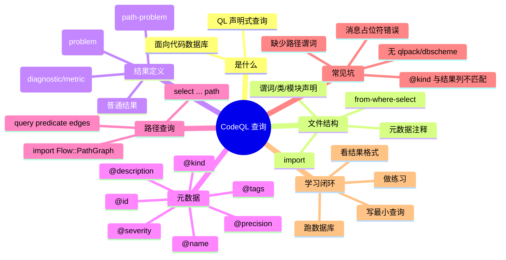

# 记忆卡片摘要（快速复习版）

## 1. 大纲（压缩版）
- CodeQL 查询是什么：用 QL 语言从代码数据库中声明式筛选结果（逻辑查询，不是命令式脚本）[来源3]
- 查询文件结构：可选元数据注释 + `import` + 声明（谓词/类/模块）+ `from`/`where`/`select` 查询子句（或查询谓词）[来源3][来源1]
- `select` 是查询成立的关键：QL 文件中最多一个 `select` 子句；`select` 定义结果列和显示内容 [来源1][来源2]
- 查询元数据决定“如何被代码扫描平台理解”：如 `@id`、`@kind`、`@name`、`@description`、`@tags`、`@precision` 等 [来源4]
- 结果定义分三类常见模式：普通表格结果、告警（problem）、路径告警（path-problem）；另外 `diagnostic/metric` 多用于分析诊断与汇总消费。[来源5][来源6][来源7]
- 路径查询必须引入路径图并提供 `edges` 查询谓词，`select` 也有固定列形态 [来源6]
- 学习顺序建议：先读查询结构 -> 再写普通查询 -> 再学告警结果 -> 最后路径查询 [来源3][来源5][来源6]

## 2. 思维导图（Mermaid）


## 3. 重要知识点（必须记住）
- `select` 子句定义了查询输出；一个 `.ql` 文件最多一个 `select` 子句。[来源1][来源2]
- 查询文件可以不显式写 `from`/`where` 而改用“查询谓词（query predicate）”，但本质仍是定义结果集合。[来源1]
- 元数据放在文件顶部的 QL 文档注释（通常在 `import` 之前）；代码扫描使用这些字段解释和展示查询。[来源4]
- `@kind` 会影响结果解释方式：`problem`、`path-problem`、`diagnostic`、`metric` 等。[来源4]
- 告警查询的 `select` 列不是随便写：需要满足元素/字符串等固定模式；路径查询还要满足路径专用列模式。[来源5][来源6]
- 路径查询除了数据流/污点逻辑本身，还必须提供路径图边（`edges`）以便显示路径。[来源6]

## 4. 难点 / 易混点
- “QL 查询语法”和“查询元数据约定”不是一回事：前者决定能否编译，后者决定平台如何消费结果。[来源1][来源4]
- “普通查询能跑”不代表“代码扫描告警展示正确”：`@kind`、`select` 列形态、消息占位符都要匹配。[来源4][来源5]
- “路径查询逻辑正确”不代表“能显示路径”：还要有 `Flow::PathGraph` 和 `edges`。[来源6]
- `query predicate` 不是普通辅助谓词：需要 `query` 注解，并带结果类型前缀。[来源1]

## 5. QA 快速复习卡片
- Q: CodeQL 查询文件里最核心、不可替代的输出位置是什么？
  A: `select` 子句（或等价的查询谓词输出），它定义查询结果列。[来源1][来源2]
- Q: 为什么 `@kind` 很重要？
  A: 它决定结果被解释为问题、路径问题、诊断或指标，直接影响结果列要求和展示方式。[来源4][来源5]
- Q: 路径查询为什么要写 `edges`？
  A: 结果展示路径时需要路径图边信息；官方路径查询结构要求提供 `edges` 查询谓词。[来源6]
- Q: 我本机有 `codeql` CLI，为什么最小 `.ql` 也可能编译失败？
  A: 还需要合适的 `qlpack`/`dbscheme` 上下文；本机实测在缺少这些条件时会报 “Could not locate a dbscheme”。（本地实测，2026-02-27）

## 6. 快速复现步骤（最短路径）
1. 先通读官方 `About CodeQL queries` 和 `QL language reference: Queries`，建立“文件结构 + 查询子句”的主线。[来源3][来源1]
2. 写一个普通查询（`from`/`where`/`select`）并加最小元数据块（至少 `@name`、`@id`、`@kind`、`@description`）。[来源4]
3. 在对应语言的 `qlpack` 上下文中编译/运行（或使用已有标准查询包作为模板）；若无上下文会遇到 `dbscheme` 错误。
4. 再学习 `Defining the results of a query`，把普通查询升级为 `problem` 结果并正确写消息占位符。[来源5]
5. 最后学习 `Creating path queries`，补齐 `Flow::PathGraph`、`edges`、路径专用 `select` 列。[来源6]

---

# 学习笔记正文（详细版）

## 0. 学习目标、读者画像与假设
- 技术：`CodeQL 查询（QL language / Query authoring）`
- 学习目标：入门并系统理解“如何写一个正确、可被平台正确解释的 CodeQL 查询”；能区分普通查询、告警查询、路径查询。
- 读者水平：默认 `初学`（用户未指定，按技能默认值）。
- 时间预算：默认 `标准版（约 1-3 小时阅读）`。
- 版本范围：官方在线文档“最新可访问版本”（访问日期 `2026-02-27`）。[来源1][来源3][来源4][来源5][来源6]
- 运行环境：本地有 `CodeQL CLI 2.23.3`（实测），但当前目录不是现成 CodeQL 查询包/数据库环境。
- 假设与限制：
  - 你主要想系统理解“查询写法与结果定义”，不是立即做某一语言（如 Java/C++）的深度数据流规则开发。
  - 本笔记示例以“教学结构”为主；当前环境未完成真实数据库执行验证。
  - 本机已尝试 `codeql query compile --check-only` 校验 toy 查询，但因缺少 `qlpack/dbscheme` 报错，故示例统一标注“未在当前环境完整验证”。

## 1. 背景与用途（从读者视角）

### 1.1 CodeQL 查询解决什么问题
CodeQL 的核心思想是：先把代码抽取成数据库，再用 QL（类似逻辑查询语言）描述你要找的代码模式或关系，最后得到结果。[来源3]

对学习者来说，写查询通常有三类目标：
- 找代码模式（例如“某种 API 调用出现在哪里”）
- 产出告警（静态分析规则）
- 展示数据流/污点传播路径（路径查询）[来源5][来源6]

### 1.2 不用它会怎样
不用 CodeQL 时，你往往只能：
- 写正则/grep（上下文语义差）
- 手工读代码（成本高）
- 写编译器插件或 AST 工具（门槛高）

CodeQL 查询的价值在于：把“复杂代码条件”声明成可复用查询逻辑，并结合官方库在多语言数据库上运行。[来源3]

### 1.3 典型应用场景
- 安全规则（如注入、路径遍历、危险配置）
- 质量规则（如 API 误用、逻辑错误模式）
- 代码审计中的探索性查询（先查分布，再细化）
- 路径解释（为什么 source 能流到 sink）[来源5][来源6]

## 2. 核心概念与术语（直白解释）

- 查询（Query）
  - 直白讲：一个 `.ql` 文件里定义“哪些结果应该被输出”。通常通过 `select` 子句完成。[来源1][来源3]

- QL 文件（QL file）
  - 一个 QL 源文件。它可以是查询，也可以是模块/库；是否是查询取决于是否包含 `select` 子句（或使用查询谓词形式）。[来源1][来源2]

- 导入（Import）
  - 用 `import` 引入模块、命名空间、类、谓词等；查询几乎都会导入库，尤其是真实代码库分析。[来源3]

- 查询谓词（Query predicate）
  - 带 `query` 注解的谓词，可以作为查询输出的一种写法。官方语法示例显示它是“带返回类型前缀 + `query` + 谓词定义”。[来源1]

- 查询元数据（Query metadata）
  - 写在文件顶部文档注释里的键值（如 `@id`、`@kind`）；供 CodeQL 工具/代码扫描平台识别与展示查询。[来源4]

- 结果列（Result columns）
  - `select` 产生的列。不同 `@kind` 对列类型/列数模式有不同要求，尤其 `problem` 和 `path-problem`。[来源5][来源6]

- 路径查询（Path query）
  - 一类能显示路径的查询。除了“是否存在流”外，还要提供路径图信息（例如 `edges` 谓词）。[来源6]

- 路径图（Path graph）
  - 用于把路径结果渲染成“从 source 到 sink 的链路”的图结构接口/约定，常通过导入 `Flow::PathGraph` 获得。[来源6]

## 3. 工作原理 / 机制（先直观后严格）

### 3.1 直观版
你可以把 CodeQL 查询理解成两层：
- 第一层：QL 语法层，负责表达“我要什么结果”（`from`/`where`/`select`、谓词、类、模块等）。[来源1][来源2]
- 第二层：结果消费层，负责解释“这些结果怎么展示成告警/路径/表格”（元数据 + 结果列形态）。[来源4][来源5][来源6]

很多初学者卡住，是因为只学了第一层（能写 `select`），但没理解第二层（`@kind` 与结果列模式匹配）。

### 3.2 严格版（你真正需要记住的规则）
- QL 查询文件包含 QL 元素（导入、声明、表达式等）以及一个 `select` 子句；QL 文件最多一个 `select` 子句。[来源1][来源2]
- `select` 子句的正式语法包含：若干结果表达式、可选标签/别名、可选 `order by`。[来源2]
- 查询元数据是写在顶部 QL 文档注释中的注解字段；CodeQL 产品使用这些元数据来解释查询并展示结果。[来源4]
- 告警/路径查询的 `select` 不是任意表格列，而是有特定结果模式；官方把这些模式分开说明（普通结果、告警结果、路径结果）。[来源5][来源6]

### 3.3 查询的“开发顺序”建议（实战很重要）
1. 先写普通表格查询，确认筛选逻辑对。[来源3]
2. 再补元数据与告警消息格式，让结果变成 `problem`（若目标是告警）。[来源4][来源5]
3. 最后升级到路径查询（数据流 + 路径图 + 路径 select）。[来源6]

这比一上来就写路径查询稳定很多。

## 4. 核心 API / 语法 / 组件 / 命令（按技术类型适配）

## 4.1 查询文件结构（推荐心智模型）
一个典型查询文件常见顺序如下（教学结构）：

```ql
/**
 * @name Example query
 * @id custom/example-query
 * @kind problem
 * @description Demo query metadata and result shape.
 */

import <LanguageOrLibrary>

predicate helper(...) {
  ...
}

from ...
where ...
select ...
```

说明：
- 元数据通常放在最前面的 QL 文档注释中。[来源4]
- `import` 用于引入模块/类/谓词等，真实查询基本都需要。[来源3]
- 中间可以有辅助谓词/类/模块声明；最后用 `select` 输出结果。[来源3][来源1]

## 4.2 `from` / `where` / `select`（最常见查询形态）
官方在 “About CodeQL queries” 中把这三部分作为查询主体主线说明：[来源3]
- `from`：声明变量与类型（你要枚举哪些候选值）
- `where`：约束条件（哪些候选值满足条件）
- `select`：输出哪些列，以及显示消息/标签

这套结构是入门主线；即使你后面写复杂查询，思维上仍然是“枚举 -> 约束 -> 输出”。

## 4.3 `select` 子句的关键点（高频考点）
- 一个 `.ql` 文件最多一个 `select` 子句。[来源1][来源2]
- `select` 可以选择多个表达式作为结果列。[来源2]
- `select` 支持列标签/别名（`as`）和 `order by`（排序）。[来源2]

官方重要示例（已保留，建议手敲一遍）：

```ql
from int x, int y
where x = 3 and y in [0 .. 2]
select x, y, x * y as product, "product: " + product
```

- 这个示例同时覆盖了：
  - 多列输出
  - `as` 列别名（`product`）
  - 后续列复用前一列别名（`"product: " + product`）[来源1]
- 在官方示例里再追加 `order by y desc`，可看到结果按 `y` 值降序展示。[来源1]

建议：
- 调试阶段先输出更多列帮助理解
- 定稿时只保留必要列，保证结果清晰

## 4.4 查询谓词（query predicate）
这一节建议重点理解，因为很多人学到 `select` 后会忽略“**查询输出也可以写成命名谓词**”。

先回答你问的这句话：`带返回类型前缀 + query + 谓词定义` 到底是什么意思。

- `返回类型前缀` 的本质：
  - 在 QL 里，某个谓词如果“有 `result` 列”，会写一个类型来约束 `result` 的类型。
  - 这个类型就是你说的“返回类型前缀”（例如 `string`、`int`、某个类类型）。

- 生产代码里最直观的“返回类型前缀”例子（非查询导出）：
  - 文件：`/home/nyn/Desktop/dev_tools/codeql/csharp/downgrades/66044cfa5bbf2ecfabd06ead25e91db2bdd79764/string_interpol_insert.ql:2`
  - 代码：`string toString() { none() }`
  - 解释：`string` 就是返回类型前缀，表示这个谓词的 `result` 是字符串。

- `query` 放在哪里：
  - 无结果列（关系型导出）：`query predicate name(...) { ... }`
  - 有结果列（官方语法示例）：`query <Type> name(...) { ... }`，例如官方页面里的 `query int getProduct(int x, int y) { result = x * y }`。[来源1]
  - 这里 `<Type>` 仍然是“返回类型前缀”这件事本身，只是语法里它跟在 `query` 后面。

官方重要示例（已保留）：

```ql
query int getProduct(int x, int y) {
  result = x * y
}

class MultipleOfThree extends int {
  MultipleOfThree() { this = getProduct(_, 3) }
}
```

- `query int getProduct(...)`：展示“`query` + 返回类型前缀 + 谓词体”的写法。[来源1]
- `MultipleOfThree`：展示“查询谓词可在后续类/逻辑中复用”；这是 `select` 做不到的。[来源1]

先澄清一个常见误解：`query predicate` 不只有一种写法。
- 关系型写法（本机 CodeQL 生产代码里大量真实案例）：
  - `query predicate name(Type1 a, Type2 b, ...) { ... }`
  - 适合把“最终输出”定义成一张命名关系表（多列结果）。
- 带结果列写法（官方 `Queries` 页面常见示例风格）：
  - `query Type name(...) { ... }`
  - 适合单结果列或函数风格表达。[来源1]

把它理解成“命名后的查询输出接口”会更容易：
- `select`：文件级、匿名输出（你直接在末尾写结果列）
- `query predicate`：谓词级、命名输出（你给输出关系起名字）
- 本质上都在定义“哪些元组进入查询结果”，只是组织方式不同。[来源1][来源3]

和普通辅助谓词（helper predicate）的区别：
- 辅助谓词：主要为了复用条件、拆复杂逻辑，通常不直接作为最终输出
- 查询谓词：面向最终输出（或导出关系），名称本身就是结果接口
- 实战里常见组合：`private predicate` 负责过滤/判定，`query predicate` 负责导出结果

什么时候优先考虑 `query predicate`：
- 你希望输出关系有明确名字，便于维护和协作阅读
- 你想把复杂 `select` 拆成“可测试/可复用”的命名结果块
- 你在特殊场景需要导出多张结果关系（例如 CodeQL 自带的数据库 downgrade 查询）

注意事项（容易踩坑）：
- 是否使用 `query predicate`，不改变 `@kind` 对结果解释的约束；如果目标是 `problem` / `path-problem`，仍要满足对应结果列模式。[来源4][来源5][来源6]
- 初学阶段建议先用 `select` 跑通逻辑，再重构成 `query predicate`，这样更容易排查问题。
- 语法别写反：不是 `Type query name(...)`，而是 `query Type name(...)`（见官方 `Queries` 示例）。[来源1]

实战案例（真实代码，来自本机 CodeQL 安装目录）

文件：`/home/nyn/Desktop/dev_tools/codeql/csharp/downgrades/66044cfa5bbf2ecfabd06ead25e91db2bdd79764/string_interpol_insert.ql`

这个文件里同时出现了：
- `private predicate remove_expr(Expr e)`：定义“哪些表达式应被移除/跳过”的内部规则
- `query predicate new_expressions(Expr e, int kind, TypeOrRef t)`：输出过滤后的表达式关系
- `query predicate new_expr_parent(Expr e, int child, Expr parent)`：输出重写后的父子关系

关键点（为什么这就是很好的 `query predicate` 案例）：
- 同一份逻辑里有多个“最终导出结果关系”，用 `select` 不如用多个命名查询谓词清晰
- `remove_expr(...)` 作为辅助谓词被多个查询谓词复用，结构分层非常清楚
- `new_expr_parent(...)` 不只是过滤，还做了关系重写（把 synthetic insert 节点替换为字符串插值表达式父节点），说明查询谓词不仅能“查”，还适合表达“导出后的目标关系”

你可以把它抽象成规则开发中的常见写法：

```ql
private predicate isCandidate(MyNode n) {
  // 负责封装筛选条件（便于复用/调试）
  ...
}

query predicate exportedFindings(MyNode n, string reason) {
  isCandidate(n) and
  reason = "Matched target pattern"
}
```

这个模板的价值：
- 先把“判定逻辑”放在 `isCandidate`
- 再把“最终输出列设计”放在 `exportedFindings`
- 后续若要改输出列（加标签、加分类、加调试信息），不必改核心判定逻辑

对初学者的实践建议（很实用）：
1. 先写 `select` 版本，确认结果正确。
2. 再把 `where` 条件抽到 `private predicate`。
3. 最后改成 `query predicate`（如果你需要更好的结构化输出或命名结果接口）。

## 4.5 查询元数据（Code scanning / 工具消费层）
官方元数据文档说明：元数据写在 QL 文档注释中，格式是 `@key value`，由 CodeQL CLI、VS Code 扩展和代码扫描消费。[来源4][来源7]

### 4.5.1 先建立心智模型：`@kind` 是“结果消费契约”
把 CodeQL 查询分成两层最清楚：
- 逻辑层：`from/where/predicate` 决定“找到了什么”
- 消费层：`@kind` + `select` 列形态 决定“工具如何解释这些结果”[来源3][来源5][来源7]

递归理解（从外到内）：
1. 工具层：CLI/VS Code/Code scanning 先读元数据，再决定以“告警/路径/诊断/指标”哪种模式解释结果。[来源3][来源7]
2. 结果层：不同 `@kind` 要求不同 `select` 契约；契约不匹配时，结果可能无法按预期展示。[来源3][来源5]
3. 查询层：同一套 `where` 逻辑，可以切换不同 `@kind` 形成不同交付形态（普通告警、路径证据、诊断信息、汇总指标）。

### 4.5.2 `@kind` 总览（作用 + 效果 + 编写要求）
| `@kind` | 主要作用 | 工具侧效果 | 编写要求（核心） |
| --- | --- | --- | --- |
| `problem` | 输出普通告警 | 在代码位置显示 alert | 告警类 `select` 形态（位置元素 + 消息，支持 `$@`）[来源3][来源5] |
| `path-problem` | 输出带路径证据的告警 | 告警 + source→sink 路径 | 路径图组件（如 `PathGraph`/`edges`）+ 路径 `select` 形态 [来源6] |
| `diagnostic` | 输出提取/分析诊断数据 | 主要用于分析与提取过程排障，不作为常规漏洞告警 | 必须声明 `@kind diagnostic`；公开文档未给固定统一 `select` 模板，按官方仓库诊断查询示例对齐 [来源3][来源7] |
| `metric` + `@tags summary` | 输出汇总指标 | 作为 summary/metric 类结果被消费；SARIF 中可落在 `run.properties.metricResults` | 必须同时有 `@kind metric` + `@tags summary`；`select` 推荐模式见样式指南 [来源3][来源7][来源8] |

### 4.5.3 `@kind problem`（生产最常用）
作用：
- 把命中点解释为“需要开发者处理的告警”。[来源3][来源7]

对查询编写的要求：
- 元数据必须能被识别为告警查询（至少 `@kind problem` + `@id`）。[来源7]
- `select` 要满足告警结果契约；消息列可用 `$@` 生成可点击上下文。[来源5]

实战案例（官方“extends superclass”链路）：
```ql
from RefType c, RefType superclass
where superclass = c.getASupertype()
select c, "This class extends the class $@.", superclass, superclass.getName()
```
- 第 1 列 `c`：告警定位
- 消息列：解释告警
- 后续两列：为 `$@` 提供链接目标与显示文本 [来源5]

### 4.5.4 `@kind path-problem`（要“告警 + 证据链”）
作用：
- 不只告诉你“有问题”，还要展示从 source 到 sink 的路径证据。[来源6]

对查询编写的要求：
- 元数据 `@kind path-problem`。
- 路径图相关结构要齐全（如 `import ...::PathGraph`、`edges`/路径节点约定）。[来源6]
- `select` 使用路径查询契约，通常包含 sink 位置、source/sink 路径节点和消息。[来源6]

实战模板（路径查询骨架）：
```ql
/**
 * @kind path-problem
 */
import Flow::PathGraph
from Flow::PathNode source, Flow::PathNode sink
where Flow::flowPath(source, sink)
select sink.getNode(), source, sink, "Untrusted data reaches this sink."
```

### 4.5.5 `@kind diagnostic`（分析过程诊断，不是漏洞告警）
作用：
- 用于 extractor/分析过程排障数据，不是直接面向安全修复的业务告警。[来源3][来源7]

效果：
- 这类结果用于“分析健康度和提取质量”排障，不作为开发者修复漏洞的主告警流。[来源3][来源7]

对查询编写的要求：
- 元数据包含 `@kind diagnostic`（CLI 解释结果时依赖它）。[来源7]
- 官方公开文档当前没有像 `problem/path-problem` 那样给出固定统一的公开 `select` 模式；应参考官方仓库中的 diagnostic query 实例进行对齐。[来源3]

实战模板（团队自定义排障查询）：
```ql
/**
 * @id org/diagnostic/extraction-health
 * @kind diagnostic
 */
from string phase, int count
where phase = "extracted-files" and count >= 0
select phase, "extraction health metric", count
```
- 这类查询适合回答“这次分析是否完整/异常”，不应混入业务漏洞规则。

### 4.5.6 `@kind metric` + `@tags summary`（汇总指标）
作用：
- 用于代码库规模/结构等汇总指标（例如 LoC、某类节点计数）。[来源3][来源7][来源8]

效果：
- 在 `database analyze` 中作为 summary 输出。
- 若输出 SARIF，指标结果可记录在 `run.properties.metricResults`（官方样式指南明确说明）。[来源8]

对查询编写的要求：
- 必须同时声明：`@kind metric` 与 `@tags summary`。[来源3][来源7][来源8]
- 官方样式指南给出 `select` 推荐模式：
  - 仅 `number`
  - `entity, number`（`entity` 必须有有效源码位置）[来源8]

实战模板 1（仓库级单值指标）：
```ql
/**
 * @id org/summary/total-functions
 * @kind metric
 * @tags summary
 */
select count(Function f)
```

实战模板 2（按实体分组指标）：
```ql
/**
 * @id org/summary/functions-per-file
 * @kind metric
 * @tags summary
 */
from File f
select f, count(Function fn | fn.getFile() = f)
```

### 4.5.7 递归排错法：`@kind` 相关问题怎么快速定位
1. 先看元数据是否齐：`@id`、`@kind`、必要 tag（`metric` 还要 `summary`）。[来源7][来源8]
2. 再看 `select` 契约是否匹配当前 `@kind`（尤其 `problem/path-problem`）。[来源3][来源5][来源6]
3. 再看运行出口：`database analyze` 结果是否按预期落入告警/路径/指标通道（而不是退化成难解释的裸结果表）。
4. 最后看 SARIF：告警位置、路径信息、附加诊断/指标是否被正确解释（而不是只有裸表格数据）。

### 4.5.8 常用元数据字段清单（保留）
- `@name`：查询名称（人类可读）[来源4]
- `@description`：查询描述 [来源4]
- `@id`：稳定唯一标识（很重要，便于发布/兼容）[来源4]
- `@kind`：查询结果类型（本节核心）[来源3][来源7]
- `@tags`：分类标签（安全、质量、summary 等）[来源4][来源8]
- `@precision`：告警精度说明（问题类查询常用）[来源4]
- `@problem.severity` / `@security-severity`：严重性相关字段（问题类查询）[来源4]
- `@previous-id`：查询改名或重构时保持历史结果连续 [来源4]

官方元数据示例（保留）：
```ql
/**
 * @name Signed overflow check
 * @description An operation might result in a signed overflow.
 * @kind problem
 * @id cpp/signed-overflow-check
 * @problem.severity warning
 * @precision medium
 * @tags reliability
 *       correctness
 * @previous-id cpp/overflow-check
 */
```

必须记住：
- 元数据不是装饰注释，它是结果解释协议的一部分。[来源3][来源4][来源7]

## 4.6 查询结果定义（普通结果 / 告警 / 路径）
官方 `Defining the results of a query` 文档重点讲解 `select` 输出契约与告警消息构造；路径查询细节由 `Creating path queries` 补充。[来源5][来源6]

这一节建议当成“**结果契约（result contract）**”来理解：
- 查询逻辑（`from/where`、辅助谓词）决定“找到了什么”
- 结果定义（`@kind` + `select` 列形态）决定“工具如何解释和展示你找到的东西”[来源4][来源5]

很多新手的问题本质上不是“逻辑写错”，而是“结果契约不匹配”。

### 4.6.1 普通结果（探索 / 调试阶段最常用）
适用场景：
- 你在验证筛选逻辑是否正确
- 你想先看“命中了哪些对象、位置、字符串”
- 你还不准备把它做成代码扫描告警

特点：
- `select` 输出就是普通表格结果（CLI/BQRS/IDE 里按列展示）
- 列设计相对自由，适合输出调试信息（例如对象 + 文本标签 + 位置）[来源5]
- 这类查询通常最容易迭代，因为你可以不断加列帮助定位逻辑偏差

建议写法（调试友好）：
- 第 1 列放“关键对象”（你真正关心的代码元素）
- 第 2~N 列放调试辅助（原因、分类、局部上下文文本）
- 定稿前再收敛列数

### 4.6.2 告警结果（`@kind problem`）
适用场景：
- 你希望查询结果被当作“问题/告警”展示
- 你需要更清晰的消息文本、定位点、可点击链接

关键规则（必须记住）：
- `@kind` 要设置为 `problem`（元数据层）[来源4]
- `select` 必须满足官方定义的告警结果模式（结果列不再是完全自由设计）[来源5]
- 告警消息字符串支持 `$@` 占位符，用于插入可点击链接；后续列需要提供对应链接目标与显示文本。[来源5]

可以把它理解成：
- 普通结果：我在“打印表格”
- 告警结果：我在“构造告警对象（位置 + 消息 + 可选链接参数）”

高频错误（非常常见）：
- 写了 `@kind problem`，但 `select` 仍按普通表格思路随便拼列 -> 平台展示异常或不能按预期解释 [来源5]
- 消息里 `$@` 数量和后续列组不匹配 -> 消息渲染异常 [来源5]

### 4.6.3 路径结果（`@kind path-problem`）
适用场景：
- 你不仅要报“有问题”，还要解释“路径怎么走到这里”的因果链路
- 常见于数据流/污点传播分析

关键规则（比 `problem` 多一层要求）：
- 元数据 `@kind path-problem` [来源4]
- `select` 需要使用路径查询要求的结果列模式（不是普通告警的列模式）[来源5][来源6]
- 还要提供路径展示所需的路径图信息（例如 `Flow::PathGraph`、`edges` 查询谓词）[来源6]

可以把它理解成：
- `problem`：告警 + 定位
- `path-problem`：告警 + 定位 + 可视化路径证据

### 4.6.4 实战案例：同一条规则逻辑如何演化为 3 种结果
下面用“查找危险调用候选点”的思路做结构化示例（教学用骨架，便于对比结果定义差异）。

#### 案例 A：普通结果（先验证逻辑）
目标：
- 先确认候选点筛选逻辑是否命中正确对象

```ql
from Call c, string calleeName
where
  calleeName = c.getTarget().getName() and
  calleeName = "exec"
select c, calleeName, "Candidate dangerous call"
```

你在做什么：
- 输出一个表格：`调用点` + `被调函数名` + `调试标签`
- 这时重点是“筛选逻辑对不对”，不是平台告警展示

#### 案例 B：升级为告警结果（`@kind problem`）
目标：
- 把同样的命中逻辑变成正式告警结果

```ql
/**
 * @kind problem
 */
from Call c, string calleeName
where
  calleeName = c.getTarget().getName() and
  calleeName = "exec"
select c,
  "Potential dangerous call to $@.",
  c.getTarget(),
  calleeName
```

你在做什么：
- 不再只是“打印表格”，而是在构造问题结果
- `c` 充当主要定位对象（实际类型/模式要与语言库和官方结果定义匹配）[来源5]
- 消息里的 `$@` 由后续列（目标元素 + 显示文本）补全为可点击链接 [来源5]

实践要点：
- 先保留普通结果版本用于调试，再切换到 `problem` 版本
- 一旦切换到 `problem`，就要按官方结果模式检查 `select` 列契约 [来源5]

#### 案例 C：升级为路径结果（`@kind path-problem`）
目标：
- 告警之外，显示从 source 到 sink 的传播路径

```ql
/**
 * @kind path-problem
 */
import Flow::PathGraph

from Flow::PathNode source, Flow::PathNode sink
where Flow::flowPath(source, sink)
select sink.getNode(), source, sink, "Untrusted data reaches a sink"
```

你在做什么：
- 结果不只是“问题点 + 消息”，还包含路径节点信息
- 平台可利用路径图（和 `edges` 等路径信息）渲染传播链路 [来源6]

实践要点：
- 不要只改 `@kind`；必须连同路径图/`edges`/路径 `select` 一起改 [来源6]
- 路径查询调试通常分两步：先确认 `flowPath(source, sink)` 能命中，再看路径展示是否完整

### 4.6.5 实战案例（真实代码组织方式）：先普通逻辑，再导出结果关系
本机 CodeQL 安装目录里的 downgrade 查询（例如 `csharp/downgrades/.../string_interpol_insert.ql`）虽然不是代码扫描告警，但很适合学习“结果定义分层”：
- `private predicate remove_expr(...)` 负责判定/过滤逻辑
- `query predicate new_expressions(...)` / `new_expr_parent(...)` 负责导出结果关系（可视为普通结果/导出关系接口）

这说明一个实战经验：
- 先把“逻辑层”稳定下来（辅助谓词）
- 再决定“结果层”怎么导出（普通表格 / 告警 / 路径）
- 这样后续从探索查询升级成规则查询时改动更可控

### 4.6.6 官方文档关键示例补充（Java “extends superclass” 系列）
`Defining the results of a query` 页面里有一组非常重要的渐进式示例，建议保留并对照练习：[来源5]
（这些 `select` 示例默认前面已有 `from RefType c, RefType superclass where superclass = c.getASupertype()`）

基础告警版本（不含链接）：

```ql
select c, "This class extends another class."
```

加入父类名（把第二列换成可读消息）：

```ql
select c, "This class extends the class " + superclass.getName()
```

加入可点击链接（`$@` + 额外列）：

```ql
select c, "This class extends the class $@.", superclass, superclass.getName()
```

必须记住：
- 这三个版本的差异正好对应 `select` 结果契约从“纯文本消息”到“带可点击实体消息”的演进。[来源5]
- 当消息里有多个 `$@` 占位符时，第 `N` 个占位符会读取列 `2N+2` 和 `2N+3` 组成链接；列数和顺序必须匹配。[来源5]

## 4.7 路径查询组件（`Creating path queries` 主线）
官方路径查询文档给出的关键结构：[来源6]
- 元数据里 `@kind path-problem`
- 导入数据流/污点库与路径图模块（例如 `Flow::PathGraph`）[来源6]
- 定义/复用路径相关逻辑（如 `flowPath`）
- 提供 `query predicate edges(...)`（供路径展示）[来源6]
- 使用路径专用 `select` 形式（通常包含 source、sink、消息等）[来源6]

### 4.7.1 Path query 的性质（先把语义定位讲清楚）
- Path query 本质上是“**告警查询（alert query）+ 路径证据（path explanation）”的组合，不只是判断“有没有流到 sink”。[来源6]
- 每条结果仍然像普通告警一样落在一个位置（`element`），但额外绑定一条从 `source` 到 `sink` 的可视化路径。[来源6]
- 这种查询主要用于解释数据流/污点传播，重点是“为什么可达、沿哪条边可达”，所以必须有路径图信息，而不只是布尔命中结果。[来源6]
- 官方页面在 `2026-03-07` 可访问版本仍注明：模块化数据流 API 自 `CodeQL 2.13.0` 提供；旧版数据流库已在 `2024年12月` 移除。看到旧写法时，应优先按模块化 API 模板改写。[来源6]

### 4.7.2 有效 Path query 的定义要求（官方最小检查清单）
1. 元数据要求：必须包含 `@kind path-problem`，否则结果不会按路径告警解释与展示。[来源6]
2. 路径图要求：查询必须能生成路径图；要么导入标准库中的 `PathGraph`（获得预定义 `edges`），要么自行定义 `query predicate edges(PathNode a, PathNode b)`。[来源6]
3. `source/sink` 声明要求：`from` 子句必须声明 `source` 与 `sink`，且它们的类型要与 `edges` 所计算图节点兼容。[来源6]
4. 流条件要求：`where` 子句通常需要约束“存在从 `source` 到 `sink` 的流”，官方模板使用 `MyFlow::flowPath(source, sink)`。[来源6]
5. `select` 结构要求：路径查询采用四列契约 `select element, source, sink, string`；第 1 列是告警位置，第 2/3 列是路径节点，第 4 列是消息。[来源6]
6. 配置主线要求（模块化 API）：常见模板是 `module MyFlow = DataFlow::Global<MyConfiguration>`（或 `TaintTracking::Global`），并在配置中定义 `isSource`/`isSink`。[来源6]

### 4.7.3 官方 `predicate edges` 到底在哪里？
- 官方文档 `Generating path explanations` 明确写到：`import MyFlow::PathGraph` 会从数据流库 `DataFlow.qll` 导入 `PathGraph`，而 `edges` 就定义在该模块里。[来源6]
- 对应官方源码位置可直接看：`shared/dataflow/codeql/dataflow/DataFlow.qll`，其中 `module PathGraph implements PathGraphSig<PathNode>` 里定义了 `edges`。[来源9]
- 实操含义：如果你用了 `import MyFlow::PathGraph`，通常不需要再手写 `edges`；你只需要保证 `source/sink`、`flowPath` 和路径 `select` 契约正确。[来源6]

### 4.7.4 `predicate edges` 怎么写？（官方两种方式）
1. 复用标准库（最常见，推荐）：

```ql
module MyFlow = DataFlow::Global<MyConfiguration>;
import MyFlow::PathGraph
```

说明：`edges` 由 `PathGraph` 模块提供。[来源6]

2. 自定义 `edges`（官方模板）：

```ql
query predicate edges(PathNode a, PathNode b) {
  /* Logical conditions which hold if `(a,b)` is an edge in the data flow graph */
}
```

说明：这是官方给的最小模板，适合你不使用现成 `PathGraph`、需要自己定义边关系的场景。[来源6]

3. 官方标准库中的实际定义形态（源码节选）：

```ql
module PathGraph implements PathGraphSig<PathNode> {
  query predicate edges(PathNode a, PathNode b, string key, string val) { ... }
}
```

说明：标准库常见的是带 `key/val` 的扩展签名（用于路径边附加信息）；你在查询里导入 `MyFlow::PathGraph` 时会直接复用它。[来源9]

初学建议：
- 不要一开始就背路径查询模板
- 先理解“普通流判断查询”与“路径展示查询”的差别

按官方章节补充的关键点（已对齐）：
- `Path query examples`：先从官方可运行模板入手，再替换成你的 source/sink 类型。[来源6]
- `Generating path explanations`：可选实现 `nodes` 谓词来定制路径中展示的关键节点。[来源6]
- `Declaring sources and sinks`：先明确定义哪些点是 source/sink，再写路径条件，避免“路径逻辑正确但语义目标错了”。[来源6]
- `Defining flow conditions`：将“什么算可达流”集中在单独谓词（如 `flowPath`）里，便于迭代调试。[来源6]
- `Defining a select clause`：路径查询的 `select` 必须匹配路径结果形态，不可照搬普通 `problem` 查询。[来源6]

## 4.8 常用 CLI 命令（学习路径需要，但本笔记不深挖）
以下是写查询时常见命令（本地 `codeql` CLI 帮助可见）：
- `codeql query compile --check-only <query.ql>`：做语法/编译检查（需要 `qlpack`/`dbscheme` 上下文）
- `codeql query run -d <db> <query.ql>`：在数据库上运行单个查询
- `codeql bqrs decode <file.bqrs>`：解码结果
- `codeql database analyze <db> <queries>`：更适合批量/生成 SARIF 的方式

说明：这些命令细节以本地 CLI 帮助和官方 CLI 文档为准；本笔记重点是“查询写法”。

## 5. 常见用法与典型场景

### 场景1：探索性查询（先找分布）
目标：先确认某类代码结构是否存在、数量多少、位于哪些文件。

做法：
- 写普通查询（不急着做告警）
- `select` 输出多个调试列（对象、位置、辅助字符串）
- 先保证逻辑正确，再收敛结果列

适合：新规则开发初期。

### 场景2：规则化告警查询（给代码扫描平台消费）
目标：把“找到的代码模式”变成可展示的规则告警。

做法：
- 补齐元数据（`@id`、`@kind problem`、`@name`、`@description`、标签等）[来源4]
- 按官方告警结果模式调整 `select` 列 [来源5]
- 设计清晰消息文本（必要时使用 `$@` 占位符）[来源5]

### 场景3：路径解释型查询（显示传播链路）
目标：不仅告诉你有问题，还告诉你“怎么流过去的”。

做法：
- 使用路径查询元数据 `@kind path-problem` [来源4]
- 导入路径图模块并提供 `edges` [来源6]
- 用路径专用 `select` 格式产出结果 [来源6]

## 6. 最小可运行示例（含预期输出/现象）

> 说明：以下示例用于理解“查询结构与结果形态”。当前环境未在真实数据库上执行验证；本机已尝试编译 toy 查询，但因缺少 `qlpack/dbscheme` 报错（`Could not locate a dbscheme`）。你可在已有 CodeQL 查询包和目标数据库环境中按步骤验证。

### 示例1：最小普通查询（教学结构）
- 目标：理解 `from` / `where` / `select` 的角色
- 前提条件：
  - 有可用 CodeQL 查询包上下文（`qlpack.yml`）
  - 能解析/运行纯 QL 或对应语言库查询
- 代码/命令：
```ql
/**
 * @name Demo hello query
 * @id learning/demo-hello-query
 * @kind diagnostic
 * @description Minimal query shape for learning.
 */

from string s
where s = "hello"
select s, "Matched a demo literal"
```
- 运行步骤：
  1. 将文件保存为 `demo-hello.ql`
  2. 放到可用 `qlpack` 目录中（或使用已有查询包）
  3. 先执行 `codeql query compile --check-only demo-hello.ql`
  4. 若有数据库，再执行 `codeql query run -d <db> demo-hello.ql`
- 预期输出/现象：
  - 编译阶段：语法合法时通过；缺少 `qlpack/dbscheme` 会失败（当前环境即如此）
  - 运行阶段：得到一行结果，包含字符串 `hello` 和消息列
- 说明：
  - 此例主要用于理解 `from/where/select` 结构；若要用于代码扫描平台，还需按 `@kind` 对齐官方结果列模式。[来源5]
- 常见错误与修复：
  - 错误：当前目录不在查询包内 -> 报找不到 `dbscheme`
  - 修复：使用正确的查询包目录/语言 pack，并在该上下文编译运行

### 示例2：告警结果消息占位符（`$@`）结构示例
- 目标：理解告警消息里的 `$@` 占位符与附加列对应关系 [来源5]
- 前提条件：
  - 查询 `@kind` 为 `problem`
  - `select` 包含问题元素和消息字符串
- 代码/命令：
```ql
/**
 * @name Demo alert message placeholder
 * @id learning/demo-alert-placeholder
 * @kind problem
 * @description Demonstrates $@ placeholder in alert messages.
 */

from string userInput, string sinkName
where userInput = "source" and sinkName = "exec"
select userInput,
  "Data reaches $@ without validation.",
  sinkName,
  "sink call"
```
- 运行步骤：
  1. 先在普通查询基础上确认结果列内容
  2. 再按官方告警结果模式替换成真实代码元素类型
  3. 保证 `$@` 的数量与后续“链接目标 + 链接文本”列组一致 [来源5]
- 预期输出/现象：
  - 在支持告警展示的环境中，消息中的 `$@` 会被渲染为可点击文本（取决于列类型/平台）[来源5]
- 说明：
  - 上述代码是“占位符列对齐示意”。真实 `problem` 查询通常需要可定位代码元素作为结果位置列，不能直接用纯字符串替代。[来源5]
- 常见错误与修复：
  - 错误：`$@` 数量与附加列不匹配
  - 修复：逐个检查消息占位符数量与后续参数对齐

### 示例3：路径查询骨架（结构理解版）
- 目标：理解路径查询最小组成部分：`@kind path-problem`、`PathGraph`、`edges`、路径 `select` [来源6]
- 前提条件：
  - 使用某语言官方数据流/污点跟踪库
  - 有对应语言数据库
- 代码/命令：
```ql
/**
 * @name Demo path query skeleton
 * @id learning/demo-path-query
 * @kind path-problem
 * @description Skeleton for learning path-query structure.
 */

import <Language>
import <DataFlowOrTaintModule>
import Flow::PathGraph

from Flow::PathNode source, Flow::PathNode sink
where Flow::flowPath(source, sink)
select sink.getNode(), source, sink, "Flow from source to sink"
```
- 运行步骤：
  1. 替换为目标语言的真实数据流配置
  2. 补齐官方要求的 `query predicate edges(...)`（如果所用模板/库未直接提供）[来源6]
  3. 在对应语言数据库上运行
- 预期输出/现象：
  - 结果被解释为路径问题，可查看从 source 到 sink 的路径（依赖正确的路径图配置）[来源6]
- 常见错误与修复：
  - 错误：写了 `@kind path-problem` 但缺少路径图/`edges`
  - 修复：按官方路径查询结构补齐 `PathGraph` 与 `edges`

## 7. 常见错误与排查路径

### 7.1 错误现象：查询编译时报 `Could not locate a dbscheme`
- 常见原因：
  - 不在有效 `qlpack` 上下文中
  - 查询未能解析到依赖 pack / dbscheme
  - 在临时目录直接编译 toy 查询（本机实测复现）
- 排查顺序：
  1. 确认当前目录是否在某个 `qlpack.yml` 目录内
  2. 确认 pack 依赖可解析（标准库是否可见）
  3. 如是语言查询，确认目标数据库存在并匹配语言
  4. 再做 `compile --check-only` 与 `run -d <db>`

### 7.2 错误现象：查询能出结果，但平台不按告警展示
- 常见原因：
  - 缺少/错误 `@kind`
  - `@kind` 与 `select` 列模式不匹配 [来源4][来源5]
  - 元数据不完整（例如缺 `@id`，影响规则集管理）[来源4]
- 排查顺序：
  1. 检查元数据块位置与格式（顶部 QL 文档注释）[来源4]
  2. 检查 `@kind` 是否正确
  3. 对照官方结果定义页面检查 `select` 列形态 [来源5]

### 7.3 错误现象：路径查询有结果但没有路径展示 / 结构异常
- 常见原因：
  - 未导入 `Flow::PathGraph`（或等效路径图模块）[来源6]
  - 缺少 `edges` 查询谓词 [来源6]
  - `select` 未使用路径查询要求的列模式 [来源6]
- 排查顺序：
  1. 检查 `@kind path-problem`
  2. 检查路径图导入
  3. 检查 `edges` 谓词是否存在/签名是否符合模板
  4. 检查路径 `select` 列顺序与类型

### 7.4 错误现象：消息文本显示不对 / `$@` 未变链接
- 常见原因：
  - `$@` 与附加列数量不匹配 [来源5]
  - 附加列类型/顺序不符合期望 [来源5]
- 排查顺序：
  1. 统计消息中的 `$@` 数量
  2. 逐个核对后续列（目标 + 显示文本）
  3. 在普通结果模式先打印调试列确认数据内容

## 8. 最佳实践与边界条件

### 8.1 最佳实践（入门到实战都通用）
- 先做“普通查询调试版”，再升级为告警/路径查询
- 元数据尽早写全，尤其 `@id`、`@kind`、`@name`、`@description`、`@tags` [来源4]
- 把复杂条件拆进辅助谓词，`select` 保持简洁可读
- 告警消息先写清楚“发生了什么 + 为什么重要”，再考虑 `$@` 链接增强 [来源5]
- 路径查询先验证是否存在流，再处理路径展示细节（`PathGraph` / `edges`）[来源6]
- 开发中保留调试列；发布前删掉无关列并整理消息文本

### 8.2 边界条件 / 限制（初学者很容易忽视）
- 仅会 QL 语法不够：实际运行还依赖查询包、语言库、数据库环境。
- 同样的查询结构在不同语言库中可用类型/谓词不同，需要按语言 pack 调整。
- 文档中的“结构模板”可迁移，但具体类型名和库导入不可照抄到所有语言。
- 路径查询比普通查询多一层“展示协议”要求（路径图 + 结果形态）。[来源6]

## 9. 版本差异 / 兼容性说明（如适用）
- 本笔记依据 GitHub CodeQL 官方在线文档（访问日期 `2026-02-27`），属于“当前在线版本”视角。[来源1][来源3][来源4][来源5][来源6]
- CodeQL 查询写法中的核心 QL 语法（`select`、查询文件结构）相对稳定，但：
  - 各语言库模块路径、类型名、数据流 API 可能随版本演进
  - 元数据推荐字段与约束可能随代码扫描平台能力变化而调整
- 编写团队内部查询时，建议固定：
  - CodeQL CLI 版本
  - 查询 pack 版本
  - 目标数据库生成方式
  这样能减少“文档示例可行、你本地不可行”的环境偏差。

## 10. 延伸学习路径（官方优先）
- 先读（主线）
  1. `About CodeQL queries`（建立完整结构心智模型）[来源3]
  2. `QL language reference: Queries`（掌握查询语法形式、查询谓词）[来源1]
  3. `Metadata for CodeQL queries`（理解结果消费层）[来源4]
  4. `Defining the results of a query`（掌握结果列模式）[来源5]
- 再做（动手）
  1. 选一门语言的官方查询 pack，复制一个简单查询并逐步改动
  2. 把普通查询改成 `problem`
  3. 再尝试路径查询模板 [来源6]
- 进阶（你下一阶段会需要）
  1. 各语言的 AST/CFG/DataFlow 库文档
  2. 查询性能与去重技巧
  3. 查询包组织与发布（`qlpack.yml`、query suites）

### 10.1 官方文档章节对照检查（2026-02-27）
| 官方文档章节 | 笔记对应位置 | 状态 |
| --- | --- | --- |
| `QL language reference: Queries` -> `Query body` | `4.1 查询文件结构` + `4.2 from/where/select` | 已覆盖 |
| `QL language reference: Queries` -> `Select clauses` | `4.3 select 子句` | 已覆盖，并补官方 `x * y as product` 示例 |
| `QL language reference: Queries` -> `Query predicates` | `4.4 查询谓词` | 已覆盖，并补 `query int getProduct` / `MultipleOfThree` 示例 |
| `About CodeQL queries` -> `Overview` | `1. 背景与用途` | 已覆盖 |
| `About CodeQL queries` -> `Basic query structure` / `from` / `where` / `select` | `4.1` + `4.2` + `4.3` | 已覆盖 |
| `About CodeQL queries` -> `Query metadata` | `4.5 查询元数据` | 已覆盖，并补完整注释示例 |
| `About CodeQL queries` -> `Import statements` | `4.1 查询文件结构` | 已覆盖 |
| `About CodeQL queries` -> `Optional classes and predicates` | `4.1 查询文件结构` + `4.4 查询谓词` | 已覆盖 |
| `About CodeQL queries` -> `Viewing the standard CodeQL queries` | `10.2 标准查询与贡献路径` | 已补充 |
| `About CodeQL queries` -> `Contributing queries` | `10.2 标准查询与贡献路径` | 已补充 |
| `About CodeQL queries` -> `Query help files` | `10.2 标准查询与贡献路径` | 已补充 |
| `Using custom queries with the CodeQL CLI` -> `Query metadata and query metadata style` | `4.5 @kind 总览/要求` | 已补充 |
| `Metadata for CodeQL queries` -> `Metadata properties` | `4.5 查询元数据` | 已覆盖，并补 `@previous-id` |
| `Metadata for CodeQL queries` -> `Example` | `4.5 官方元数据示例` | 已补充 |
| `CodeQL query metadata style guide` -> `kind=metric + tags=summary + result patterns` | `4.5.6 metric` | 已补充 |
| `Defining the results of a query` -> `Overview` | `4.6 结果契约` | 已覆盖 |
| `Defining the results of a query` -> `Developing a select statement` | `4.6 结果契约` | 已覆盖 |
| `Defining the results of a query` -> `Basic select statement` / `Adding links...` | `4.6.6 官方关键示例补充` | 已补充 |
| `Defining the results of a query` -> `Including the superclass name` | `4.6.6 官方关键示例补充` | 已补充 |
| `Defining the results of a query` -> `Further reading` | `10. 延伸学习路径` | 已覆盖 |
| `Creating path queries` -> `Overview` / `Path query examples` | `4.7 路径查询组件` | 已覆盖 |
| `Creating path queries` -> `Path query metadata` / `select clause` | `4.7 路径查询组件` | 已覆盖 |
| `Creating path queries` -> `Generating path explanations` / `nodes` | `4.7 按官方章节补充` | 已补充 |
| `Creating path queries` -> `Declaring sources and sinks` / `flow conditions` | `4.7 按官方章节补充` | 已补充 |
| `Creating path queries` -> `Further reading` | `10. 延伸学习路径` | 已覆盖 |

### 10.2 标准查询与贡献路径（对齐 About 页面后补充）
- `Viewing the standard CodeQL queries`：优先阅读你所用语言 pack 的官方查询，直接学习其元数据、结果列与消息写法。[来源3]
- `Contributing queries`：如果你打算提交规则，先对齐官方贡献流程和查询帮助文档格式要求，再做语义正确性优化。[来源3]
- `Query help files`：对要分发的查询同时维护 query help（用途、风险、修复建议），否则规则可用性会明显下降。[来源3]

---

# 练习与复习闭环

## 1. 分层练习

### 基础练习
1. 用自己的话解释 `from`、`where`、`select` 各自职责，并写一个 3 行查询骨架。
2. 写一个查询元数据块，至少包含 `@name`、`@id`、`@kind`、`@description`、`@tags`。
3. 说出 `problem` 与 `path-problem` 在结果定义层面的主要差异（不要求会写完整路径查询）。

### 应用练习
1. 把一个普通查询改造成 `@kind problem` 查询，并为消息添加一个 `$@` 占位符（只需结构正确）。
2. 给一个路径查询模板补齐你理解中的必要组件（`@kind path-problem`、`PathGraph`、`edges`、路径 `select`），并标注每部分作用。
3. 阅读官方文档示例，指出哪些部分属于“QL 逻辑层”，哪些属于“结果消费层”。

### 综合练习
1. 选择一个语言 pack 中的简单官方查询：
   - 标出元数据
   - 标出辅助谓词
   - 标出最终输出（`select` 或查询谓词）
   - 说明为什么它是普通/问题/路径查询
2. 将一个探索性查询演化为“可用于代码扫描”的规则草稿：
   - 补齐元数据
   - 调整结果列
   - 改写消息文本
   - 写出验证步骤（编译、运行、看结果）

## 2. 动手任务（带验收标准）
- 任务：在一个现成 CodeQL 查询包（任意语言）中创建 `learning-demo.ql`，完成以下三步：
  1. 写普通查询并成功编译/运行（或至少编译）
  2. 改成 `@kind problem` 并让结果按告警展示
  3. 复制官方路径查询模板并解释每个结构块作用（是否运行成功视环境而定）
- 验收标准：
  - 文件顶部存在有效元数据块
  - 能解释 `from/where/select` 与 `@kind` 的不同职责
  - 能说明 `$@` 占位符和附加列的对应关系
  - 能指出路径查询中的 `PathGraph` 与 `edges` 用途
  - 记录至少 1 个遇到的错误及排查过程（例如 `dbscheme`/pack 问题）

## 3. 常见误区纠偏
- 误区：`@kind` 只是注释，写不写都一样。
  正解：元数据会被 CodeQL 工具/平台读取，影响结果解释与展示方式。[来源4]

- 误区：只要 `select` 出来就算告警查询正确。
  正解：告警查询/路径查询对结果列模式有要求，需按官方结果定义页面匹配。[来源5][来源6]

- 误区：路径查询就是普通查询 + `@kind path-problem`。
  正解：还需要路径图导入、`edges`、路径专用 `select` 等组件。[来源6]

- 误区：本机装了 `codeql` 就能在任意目录编译任何查询。
  正解：还需要合适的 `qlpack`/`dbscheme`/数据库上下文；否则会出现编译或运行错误（本机已实测）。

## 4. 复习节奏建议
- Day 1：读完本笔记主线，手写一遍最小普通查询和元数据块。
- Day 3：对照官方 `Defining the results of a query`，把一个查询改造成 `problem` 并练习 `$@`。[来源5]
- Day 7：阅读 `Creating path queries`，手工标注模板里的每个结构块职责。[来源6]
- Day 14：选一条官方查询，完成“结构拆解 + 轻微改造 + 运行验证”闭环。

## 5. 自测题与参考答案（简版）
1. 题目：QL 文件里 `select` 子句最多可以有几个？为什么这条规则重要？
   参考答案：最多一个。[来源1][来源2] 这保证查询输出入口清晰，便于区分“查询文件”和其他库/模块文件，并让结果定义有唯一出口。

2. 题目：`@kind` 与 `select` 的关系是什么？
   参考答案：`@kind` 决定结果如何被解释（问题、路径问题、诊断、指标等），`select` 必须产出与该解释方式匹配的列形态。[来源4][来源5][来源6]

3. 题目：路径查询为何通常要导入 `Flow::PathGraph`？
   参考答案：因为路径展示需要路径图信息；官方路径查询结构通过路径图模块和 `edges` 谓词为展示提供边关系。[来源6]

4. 题目：消息字符串中的 `$@` 有什么作用？
   参考答案：用于在告警消息中插入可点击链接文本，并通过后续列提供链接目标和显示文本。[来源5]

5. 题目：为什么我的 toy 查询在 `/tmp` 编译失败并提示缺少 `dbscheme`？
   参考答案：CodeQL 编译/运行需要合适的查询包与数据库/`dbscheme` 上下文；仅有 CLI 二进制不等于环境完整。

---

# 参考来源与版本说明

## 官方来源（优先）
1. [QL language reference: Queries](https://codeql.github.com/docs/ql-language-reference/queries/) - 官方文档，访问日期 `2026-02-27` - 查询语法、查询谓词、`select` 主体说明。
2. [QL language specification](https://codeql.github.com/docs/ql-language-reference/ql-language-specification/) - 官方文档，访问日期 `2026-02-27` - `select` 子句正式语法与语言规范视角。
3. [About CodeQL queries](https://codeql.github.com/docs/writing-codeql-queries/about-codeql-queries/) - 官方文档，访问日期 `2026-02-27` - 查询文件整体结构、导入、示例主线、toy 查询说明。
4. [Metadata for CodeQL queries](https://codeql.github.com/docs/writing-codeql-queries/metadata-for-codeql-queries/) - 官方文档，访问日期 `2026-02-27` - 元数据格式、常用字段、兼容字段（如 `@previous-id`）。
5. [Defining the results of a query](https://codeql.github.com/docs/writing-codeql-queries/defining-the-results-of-a-query/) - 官方文档，访问日期 `2026-02-27` - 告警查询 `select` 结构、消息构造、`$@` 占位符与参数映射。
6. [Creating path queries](https://codeql.github.com/docs/writing-codeql-queries/creating-path-queries/) - 官方文档，访问日期 `2026-03-07` - 路径查询结构、`PathGraph`、`edges`、路径 `select`、路径查询定义要求。
7. [Using custom queries with the CodeQL CLI](https://docs.github.com/en/code-security/codeql-cli/using-the-advanced-functionality-of-the-codeql-cli/using-custom-queries-with-the-codeql-cli) - 官方文档，访问日期 `2026-02-27` - CLI 对 `@kind`/`@tags` 的消费规则与自定义查询要求。
8. [CodeQL query metadata style guide](https://raw.githubusercontent.com/github/codeql/main/docs/query-metadata-style-guide.md) - 官方仓库文档，访问日期 `2026-02-27` - `metric` 查询的 `@tags summary` 约束与推荐 `select` 模式（含 SARIF metricResults 说明）。
9. [DataFlow.qll（CodeQL 官方仓库）](https://raw.githubusercontent.com/github/codeql/main/shared/dataflow/codeql/dataflow/DataFlow.qll) - 官方源码，访问日期 `2026-03-07` - `PathGraph` 模块中 `edges` 的实际定义形态（含 `key/val` 扩展签名）。

## 第三方来源（按采信程度标注）
- 用户未提供第三方资源；本笔记未采用第三方来源作为结论依据。

## 关键结论引用映射
- [来源1] -> 查询页可包含查询子句/查询谓词、查询谓词语法示例、查询文件结构中的 `select` 说明。
- [来源2] -> `select` 子句正式语法（表达式、可选标签、可选 `order by`）及语言规范约束。
- [来源3] -> CodeQL 查询整体工作流、文件组成、`import` 作用、`from/where/select` 主线，以及标准查询/贡献/query help 的学习入口。
- [来源4] -> 元数据块位置与格式、`@kind`/`@id`/`@precision`/严重性等字段说明。
- [来源5] -> `select` 开发流程、Java “extends” 告警示例、`$@` 占位符与参数列映射规则。
- [来源6] -> 路径查询结构要求、`Flow::PathGraph`、`query predicate edges`、路径查询 `select` 模式。
- [来源7] -> CLI 对 `@kind` 的解释范围（problem/path-problem/diagnostic/metric）以及 `metric` 需配 `@tags summary` 的要求。
- [来源8] -> `metric` 查询的推荐输出模式（`number` 或 `entity, number`）与 SARIF metric 结果位置说明。
- [来源9] -> `DataFlow.qll` 中 `PathGraph` 的 `edges` 实现位置与签名（`edges(PathNode a, PathNode b, string key, string val)`）。

## 冲突点与裁决（如有）
- 本次使用来源均为官方文档，未发现实质性冲突。
- 需要注意的是：不同页面面向层次不同（语法规范 vs 写查询指南），看起来表述不同通常是抽象层级差异，不是冲突。

## 技术版本与本地环境说明
- 官方网页文档版本：在线最新可访问版本（访问日期 `2026-03-07`）。
- 本地 CLI：`CodeQL command-line toolchain release 2.23.3`（本机命令实测，`2026-02-27`）。
- 示例验证状态：未在当前环境完成真实数据库运行；原因是缺少可直接使用的 `qlpack/dbscheme` 上下文。
