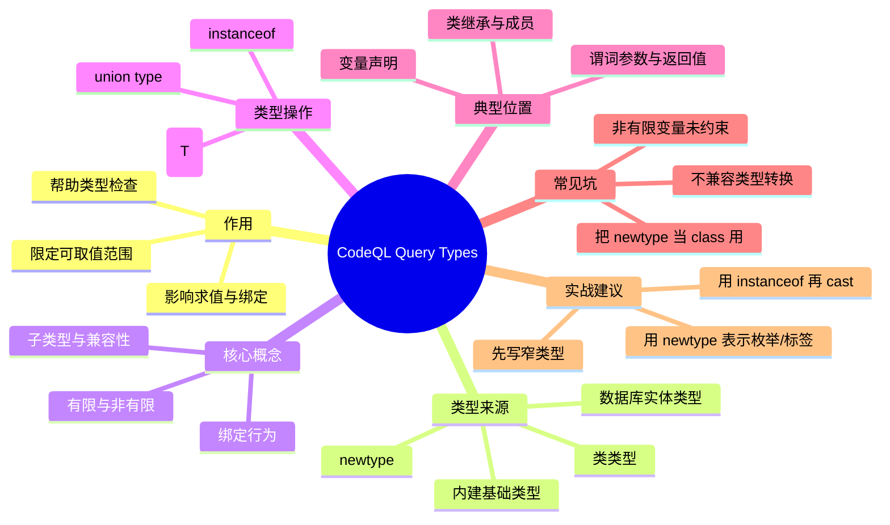

# 记忆卡片摘要（快速复习版）

## 1. 大纲（压缩版）
- CodeQL/QL 里的 type 是什么，为什么它影响查询正确性与性能
- 基础类型、数据库实体类型、类类型（class type）
- 有限类型 vs 非有限类型（finite / non-finite）与绑定（binding）
- `newtype`（类型别名 / 代数数据类型）
- 类型并集（union type）、子类型关系、兼容性
- 类型转换 `x.(T)` 与类型测试 `x instanceof T`
- 在谓词/类/表达式里如何实际使用类型
- 常见报错、排查路径、最佳实践

## 2. 思维导图（Mermaid）


> Mermaid 检查说明：已做人工语法自检（节点层级、缩进、连接结构）；当前环境缺少 `mmdc`，未完成编译验证。文末给出本地验证步骤。

## 3. 重要知识点（必须记住）
- 在 QL 中，类型本质上定义“一个值集合”；变量或表达式的类型决定它可能取哪些值。[来源1]
- 类型声明不只是可读性问题，它也会影响编译期类型检查与查询求值（尤其是绑定/有限性）。[来源1]
- `boolean` 是有限类型，但 `int` 通常是非有限类型；非有限类型变量必须通过条件约束到有限范围才能安全求值。[来源1]
- 类（`class`）本身也定义类型，其成员由特征谓词（characteristic predicate）决定。[来源3]
- `newtype` 可用于定义类型别名与代数数据类型（algebraic data type），很适合表达“枚举值/标签值”。[来源1]
- `x.(T)` 是类型转换（cast），`x instanceof T` 是类型测试；推荐先判定再转换以提升可读性与鲁棒性。[来源1][来源2]

## 4. 难点 / 易混点
- `class` 和 `newtype` 都“像在定义类型”，但来源不同：`class` 通常描述数据库实体/对象集合，`newtype` 更像自定义值域（尤其枚举/标签）。[来源1][来源3]
- “类型有限”与“查询结果有限”不是同一件事；变量类型非有限，但如果 where 子句把它限定到有限集合，查询仍可求值。[来源1]
- `cast` 不是随便转换；类型不兼容会在类型检查阶段报错。[来源1][来源2]

## 5. QA 快速复习卡片
- Q: 为什么 CodeQL 类型会影响性能或可求值性？
  A: 因为求值器需要知道变量是否被绑定到有限集合，类型信息是绑定分析的一部分。[来源1]
- Q: `boolean` 和 `int` 在绑定上有什么关键差异？
  A: `boolean` 有限（true/false），`int` 非有限，需要额外条件约束。[来源1]
- Q: 什么时候用 `newtype`？
  A: 当你需要表示一组受控值（例如状态、标签、阶段）且不想滥用 `string` 时。[来源1]
- Q: `x.(T)` 和 `x instanceof T` 的关系？
  A: 前者用于转换/收窄，后者用于判断是否属于该类型；通常先 `instanceof` 再 `cast` 更直观。[来源1][来源2]

## 6. 快速复现步骤（最短路径）
1. 先通读官方 `Types` 页面，重点看：基础类型、类类型、`newtype`、类型转换。[来源1]
2. 再看 `Types and classes` 与 `Predicates` 页面，补齐“类如何定义类型”“谓词如何在签名中使用类型”。[来源3][来源4]
3. 手写 3 个小片段：`newtype` 枚举、`instanceof + cast`、类特征谓词。
4. 在本地用 `mmdc` 验证本文 Mermaid 图（文末有命令）。

---

# 学习笔记正文（详细版）

## 0. 学习目标、读者画像与假设
- 技术：`CodeQL query（QL 语言）` 中的 `types`
- 学习目标：入门并能读懂/编写常见的类型声明，理解 `class / newtype / cast / instanceof / finite type` 的作用
- 读者水平：初学（默认假设）
- 时间预算：标准版（约 1-3 小时）
- 版本范围：以官方文档 `codeql.github.com` 当前页面内容为准（访问日期 `2026-02-27`）
- 运行环境：当前环境有 `codeql` CLI，但未在本笔记中实际执行查询；无 `mmdc`（Mermaid CLI）
- 假设与限制：
  - 用户未提供第三方资源，本笔记以官方文档为主
  - 示例以“可读、可迁移”为目标，未在当前环境实际跑通数据库查询
  - Mermaid 图未完成编译验证（环境缺少 `mmdc`）

## 1. 背景与用途（从读者视角）

### 1.1 你为什么要学 CodeQL 的 types
如果你写过 SQL、Python、Java，你可能会把“类型”理解成变量的类型系统。QL 也有类似概念，但在 CodeQL 里它更重要，因为它不仅影响“写法对不对”，还影响“查询能不能被正确、有限地求值”。[来源1]

换句话说：
- 不理解类型，你容易写出编译不过的查询。
- 不理解有限/非有限类型，你容易写出无法求值或性能很差的查询。
- 不理解类类型与 `newtype`，你会把“数据库实体”和“自定义标签值”混在一起。

### 1.2 types 解决什么问题
- 限定取值范围：让变量只在某个值集合内取值。[来源1]
- 静态检查：在编译期发现不兼容的类型使用（例如错误的 cast）。[来源1][来源2]
- 帮助求值器绑定变量：减少搜索空间，提高查询可执行性和性能。[来源1]
- 提升表达力：通过 `class` 与 `newtype` 明确建模你的分析概念。[来源1][来源3]

### 1.3 典型使用场景
- 给谓词参数声明具体类型，避免错误调用。[来源4]
- 在 AST/IR 类库里用具体类（如某语言 pack 提供的节点类）表达“只关心某类节点”。[来源3]
- 用 `newtype` 表示状态/类别（如 `Source` / `Sink` / `Sanitizer` 标签），避免散乱的字符串常量。[来源1]
- 用 `instanceof` + cast 在父类变量里识别并收窄到子类。[来源1][来源2]

## 2. 核心概念与术语（直白解释）

### 2.1 类型（type）到底是什么
直白版：`type` 就是“允许出现哪些值”的规则。

严格一点：官方文档把类型看作一组值（a set of values），变量/表达式有类型，就意味着它们只能从这个集合里取值。[来源1]

`必须记住`
- 先把类型理解成“值域（domain）”，你会更容易理解为什么 `boolean` 是有限、`int` 是非有限。

### 2.2 子类型（subtype）与超类型（supertype）
如果类型 A 的所有值都属于类型 B，那么 A 可以视作 B 的子类型。实际写查询时，这意味着：
- 你通常可以把子类型值放到需要父类型的地方。
- 反过来则可能需要 `instanceof` 和 cast 来确认/收窄。[来源1][来源2]

### 2.3 类型兼容性（type compatibility）
兼容性可以理解为“这两个类型之间是否允许在某处一起使用/转换”。在类型转换场景里，文档要求源表达式类型与目标类型要兼容，否则类型检查失败。[来源1][来源2]

`容易踩坑`
- 兼容不等于“我觉得语义上差不多”；它受 QL 类型系统规则约束。

### 2.4 绑定（binding）与有限类型（finite type）
这是初学者最容易忽略、但对 CodeQL 最关键的点之一。

- 绑定（binding）：求值器能否把变量限制到一个有限候选集合。
- 有限类型（finite type）：该类型的值天然有限，例如 `boolean` 只有 `true/false`。[来源1]
- 非有限类型（non-finite type）：例如 `int`，理论值域很大/无限，需要 where 条件额外约束。[来源1]

`必须记住`
- “变量类型是否有限”会直接影响查询能否被安全求值。

## 3. 工作原理 / 机制（先直观后严格）

### 3.1 直观版：把类型当成筛子
你可以把 QL 求值想象成：
1. 先为变量选择候选值。
2. 再用条件（`where`）不断过滤。
3. 最后输出满足条件的组合。

类型就是第一层筛子：它先决定“候选池子有多大”。
- `boolean b`：候选池几乎只有 2 个值。
- `int i`：候选池非常大，必须靠条件再缩小。
- `Expr e`（某语言库里的 AST 节点类）：候选池是数据库里所有 `Expr` 实体。

### 3.2 严格版：类型系统 + 绑定分析共同决定查询是否可求值
官方文档强调类型和绑定（binding）有关，并区分 finite/non-finite types。[来源1]
这意味着：
- 类型系统负责“这个表达式/变量允许是什么”。
- 绑定分析负责“求值时能否把它变成有限搜索”。
- 你写的 `where` 条件、谓词调用、成员访问等，也会影响变量是否被绑定。

### 3.3 类为什么也是类型
在 CodeQL 中，`class` 不只是面向对象风格语法，它还定义了一个类型，其成员由特征谓词（characteristic predicate）给出。[来源3]

直白理解：
- 你定义一个类，就在定义“哪些值属于这个类”。
- 特征谓词像入会规则：满足规则的值，就是该类的成员。

这也是为什么 CodeQL 的类声明和传统 OOP 类（存字段、写方法）相似但又不完全相同：它的核心是“集合建模”。

## 4. 核心 API / 语法 / 组件 / 命令（按技术类型适配）

## 4.1 常见类型声明位置
### 变量声明
```ql
from int i, string s
where i = 1 and s = "hello"
select i, s
```
- `i` 的类型是 `int`
- `s` 的类型是 `string`

### 谓词参数与返回类型
官方 `Predicates` 页面展示了谓词签名中为参数声明类型（以及可选返回类型）的写法。[来源4]

```ql
predicate isSmall(int x) {
  x in [0 .. 10]
}
```

### 类声明（定义类类型）
```ql
class MyNode extends Expr {
  MyNode() {
    // characteristic predicate: 定义哪些 Expr 属于 MyNode
    exists(int n | n = 1)
  }
}
```
> 示例为说明“类即类型 + 特征谓词”的结构，未在当前环境验证。

## 4.2 内建基础类型（built-in primitive types）
官方 `Types` 页面列出的常见基础类型包括：`int`、`float`、`string`、`date`、`boolean` 等。[来源1]

直白解释：
- `int` / `float`：数值计算与比较
- `string`：文本值
- `date`：日期值（注意格式与语义按 QL 支持范围）
- `boolean`：逻辑真假，且是有限类型（两值）[来源1]

`先知道即可`
- 不同语言 pack 的类库会引入大量“领域类型”（AST 节点、IR 节点、实体对象），这些不属于基础类型，但在实际 CodeQL 查询中更常见。

## 4.3 数据库实体类型（database-backed types）
官方文档说明除了基础类型，还有从数据库 schema 来的类型（例如某些实体类型）。[来源1]

理解方式：
- 基础类型的值来自 QL 语言内建域。
- 实体类型的值来自你正在查询的 CodeQL 数据库（例如代码元素、文件、节点等）。

这解释了为什么同样是“写类型”，有些类型是通用 QL 语法概念（如 `int`），有些类型只在某个语言 pack 中存在（如 `Expr`、`Method` 等）。

## 4.4 类类型（class types）与特征谓词
根据官方 `Types and classes` 页面，类由名称、可选继承关系、可选注解，以及一个定义成员集合的特征谓词（characteristic predicate）组成。[来源3]

### 4.4.1 类的本质：集合定义，不是运行时对象构造
关键点：
- `class X extends Y` 表示 `X` 是 `Y` 的子类型（值域更窄）。[来源3]
- `X()` 构造样式的谓词体实际上在定义“哪些值属于 X”。[来源3]
- 成员谓词（member predicate）和字段（field）是在这个类型上定义可复用逻辑。[来源3]

`容易踩坑`
- 把类当成“运行时 new 对象”的机制去理解。QL 更接近“逻辑集合建模”。[来源3]

### 4.4.2 官方重要示例 1：`OneTwoThree`（类定义 + 成员谓词）
官方示例核心思想是：让一个类继承 `int`，并用特征谓词把成员限制为固定范围，然后定义成员谓词返回字符串。[来源1][来源3]

```ql
class OneTwoThree extends int {
  OneTwoThree() { this in [1 .. 3] }

  string getAString() { result = this.toString() }
}
```

这个示例保留了两个关键点：
- 类值域来自特征谓词（`this in [1..3]`）
- 成员谓词可以基于 `this` 产出派生信息

### 4.4.3 官方重要示例 2：抽象类、重写与结果细化
官方还展示了抽象类 + 子类重写成员谓词的模式，用于说明“子类可以把语义定义得更具体”。[来源1][来源3]

```ql
abstract class OneTwo extends int {
  OneTwo() { this in [1 .. 2] }
  string getAString() { result = "one-or-two" }
}

class OneTwoThree extends int {
  OneTwoThree() { this in [1 .. 3] }
  override string getAString() {
    if this = 1 then result = "one"
    else if this = 2 then result = "two"
    else result = "three"
  }
}
```

实战理解：
- `abstract` 表示类本身不直接实例化为最终语义容器，常用于定义公共约束/接口
- `override` 让子类在更具体上下文里细化逻辑

### 4.4.4 官方重要示例 3：多继承与重写消歧
官方文档给出多继承场景：一个类同时继承两个父类时，如果父类提供同名成员谓词，子类需要显式重写以消除歧义。[来源1][来源3]

```ql
abstract class OneTwo extends int {
  OneTwo() { this in [1 .. 2] }
  string getAString() { result = "one-or-two" }
}

abstract class TwoThree extends int {
  TwoThree() { this in [2 .. 3] }
  string getAString() { result = "two-or-three" }
}

class Two extends OneTwo, TwoThree {
  Two() { this = 2 }
  override string getAString() { result = "two" }
}
```

`必须记住`
- 多继承在 QL 里可用，但要注意同名成员谓词冲突，必要时显式 `override`。

### 4.4.5 官方重要示例 4：`final` 与 `instanceof` 的交互
官方示例强调：给特征谓词或成员谓词加 `final`，会影响后续子类扩展和 `instanceof` 判断语义边界。[来源1][来源3]

核心结论（不展开全部细节）：
- `final` 用来固定某些行为/定义，避免在更深子类被继续改变
- 当你做 `x instanceof 某类` 判断时，`final` 相关限制会影响哪些值最终可落入该类

`容易踩坑`
- 不理解 `final` 的传播影响，导致“看起来应该匹配的子类值”实际匹配不到

### 4.4.6 官方重要示例 5：字段（field）约束与可求值性
官方 `Fields` 示例的核心是：字段不是“随便声明就完事”，要在特征谓词里被约束，否则可能带来不可求值或性能问题。[来源1][来源3]

```ql
class SmallInt extends int {
  SmallInt() { this in [1 .. 10] }
}

class DivisibleInt extends SmallInt {
  SmallInt divisor;
  DivisibleInt() { this % divisor = 0 }

  SmallInt getADivisor() { result = divisor }
}
```

`必须记住`
- 字段和 `this` 一样，需要在类定义中被有效约束（可绑定）后再使用。

### 4.4.7 官方重要示例 6：`instanceof` 超类型（non-extending subtype）
官方还强调了 `instanceof` 超类型和 `extends` 的区别：  
- `instanceof` 可以复用特征约束并支持 `super` 调用  
- 但它不是 base type，不参与同样的重写关系。[来源1][来源3]

```ql
class Foo extends int {
  Foo() { this in [1 .. 10] }
  string fooMethod() { result = "foo" }
}

class Bar instanceof Foo {
  string toString() { result = super.fooMethod() }
}
```

这正是官方示例要传达的关键：`instanceof` 与 `extends` 在方法解析和继承语义上并不等价。

## 4.5 `newtype`：类型别名与代数数据类型（ADT）
官方 `Types` 页面支持用 `newtype` 声明新类型，并用 `or` 组合多个“构造分支（constructors）”，这就是 QL 里表达代数数据类型（ADT）的主要方式。[来源1]

`先纠正一个常见误解`
- 标题里写“类型别名”是为了帮助入门理解，但严格说 `newtype` **不等同于传统语言里的纯 alias（纯别名）**。
- 它更像“定义一个新的名义类型（nominal type）”，并可通过多个构造分支来形成 ADT。[来源1]

### 4.5.1 先看语法骨架（你在定义什么）
```ql
newtype T = A() or B(int x) or C(string s, int n)
```

你实际上定义了两层东西：
- 一个新类型：`T`
- 若干个构造分支（constructors）：`A`、`B`、`C`

直白理解：
- `A()` 表示一种“无参数标签值”（像枚举项）
- `B(int x)` 表示一种“带一个整型载荷的标签值”
- `C(string s, int n)` 表示一种“带多个字段载荷的标签值”

这就是 ADT 的核心：`一个类型 = 多种可能形态（每种形态可带不同数据）`。[来源1]

### 4.5.2 为什么这比字符串更好（实战价值）
示例：枚举型标签（推荐用法）
```ql
newtype TTag = TSource() or TSink() or TSanitizer()
```

意义：
- 比直接用字符串 `"source"` / `"sink"` 更稳健
- 拼写错误更容易在编译阶段暴露（不会悄悄变成“新字符串常量”）
- 语义更清晰：这是“标签集合”，不是任意字符串
- 后续重构更安全（改构造器名通常比全局字符串替换更可控）

`必须记住`
- 当你的值域是“有限、受控、业务语义明确”的标签/状态时，`newtype` 往往优于 `string`。[来源1]

### 4.5.3 带参数构造：ADT 的关键能力（不只是枚举）
```ql
newtype TState = TInit() or TStep(int n) or TDone(string msg)
```

直白理解：
- 这不只是“枚举”，而是“带标签的数据结构”
- `TInit()`、`TStep(...)`、`TDone(...)` 是同一类型 `TState` 的不同形态
- 每种形态能携带不同类型的数据（例如步骤编号、结束消息）

为什么有用：
- 你可以在纯逻辑层表达状态机、阶段、分类结果、解析结果等
- 比“一个字符串 + 多个额外变量”更不容易出现状态不一致

### 4.5.4 `newtype` 的值是怎么来的（重要）
`newtype` 的值不是“数据库里的实体对象”，而是由构造分支生成的值域。[来源1]

对初学者最重要的区分：
- `class`：更常用于描述数据库实体集合（例如 AST 节点集合）[来源3]
- `newtype`：更常用于描述你自己定义的受控值域（标签、状态、分类）[来源1]

`容易踩坑`
- 把 `newtype` 当成“可随意挂成员谓词/方法的 class”来用。
- 把 `newtype` 当成“只是换个名字的 string/int”，从而继续用魔法字符串。

### 4.5.5 分支体（branch body）大小与有限性：为什么官方会提醒
官方文档指出，ADT 分支体需要是有限且规模合理的值域，否则可能产生大量值，影响查询求值与性能。[来源1]

直白理解：
- `newtype` 的每个分支会“覆盖一批可能值”
- 如果你给分支的参数类型/约束过宽，理论上会引入非常大的值域
- 这会让查询更难求值，或者性能变差

实战建议：
- 优先用无参构造器表示固定标签（如 `TSource()`）
- 带参构造器只在确实需要携带信息时使用
- 参数类型尽量具体、有限，或在使用位置通过条件尽早约束范围

### 4.5.6 `newtype` 在使用上的一个重要限制（很多人第一次会踩）
官方文档特别提到：ADT 值没有成员谓词（member predicates），并且通常不能像类实例那样直接 `select` 出来展示（因为没有默认 `toString`）。[来源1]

这意味着：
- 你不能把 `newtype` 值当作“带方法的对象”
- 你在调试或输出结果时，常常需要额外做一层可显示化（例如转成字符串）

### 4.5.7 官方推荐的实用模式：`newtype` + 包装 `class`
官方文档给出的常见做法是：
- 用 `newtype` 负责“值域/构造器”
- 再定义一个包装 `class` 来提供成员谓词（例如 `toString`）和更方便的使用接口。[来源1]

官方示例的核心结构可以压缩为：
```ql
newtype TTaintType = TSource() or TSanitizer() or TSink()

class TaintType extends string {
  TTaintType tt;
  TaintType() { this = tt.toString() }
  TTaintType asADT() { tt = TTaintType(this) }
  string toString() { result = this }
}
```

这个模式解决的问题：
- ADT 值本身不方便直接展示/挂成员谓词
- 包装 `class` 提供“可显示、可调用成员、可与字符串生态对接”的桥接层

这样分工很清晰：
- `newtype` 负责“值是什么（合法形态）”
- `class` 负责“怎么用（展示、辅助逻辑、成员谓词）”

### 4.5.8 何时选 `newtype`，何时不要选（决策表）
- 选 `newtype`：
  - 你在建模有限标签、状态、分类结果
  - 你需要强约束值域，避免字符串漂移
  - 你需要 ADT 风格的“多分支 + 不同载荷”
- 不优先选 `newtype`：
  - 你建模的是数据库里的实体集合（优先考虑 `class`）[来源3]
  - 你需要丰富成员谓词/对象式接口并频繁 `select` 展示（可用包装 `class` 搭配）[来源1]

### 4.5.9 小结（把这一节真正记住）
- `newtype` 的核心价值不是“换个类型名”，而是“定义受控值域（尤其 ADT）”。[来源1]
- 它非常适合标签/状态建模，但不直接替代 `class`。[来源1][来源3]
- 用得好可以显著提升查询逻辑的可读性和一致性；用得不好会引入大值域和调试不便。

## 4.6 类型并集（union type）
官方文档中的 type union 是“声明一个新的类类型，它等于多个现有类型表达式的并集”，语法形态是：`class X = A or B`。[来源1]

官方示例（核心思想）：
```ql
class DefiniteInitialization = ParameterPassing or ExplicitInitialization;
```

这表示：
- `DefiniteInitialization` 是一个新命名类型
- 其成员来自 `ParameterPassing` 与 `ExplicitInitialization` 两类成员的并集

`必须记住`
- 这里的 union 不是随手在参数里写“任意内联 `int or string`”。
- 更标准做法是先声明一个 union 类型，再在谓词/查询中使用它。[来源1]

补充说明：
- 官方文档注明该特性在较新 CodeQL 版本中可用（页面示例提到 CLI `2.2.0` 及以上）。[来源1]

### 4.6.1 同一个需求：用 union 写 vs 用 `newtype`（ADT）写（对照示例）
同一个需求：
- 我已经有一个 ADT `TResult`，其中包含 `success / failure / unknown` 三种结果。
- 现在我想写一段逻辑，只处理“确定结果（success 或 failure）”。

#### 写法 A：只用 `newtype`（ADT）+ 条件判断
```ql
newtype TResult = TSuccess(int stepNo) or TFailure(string message) or TUnknown()

predicate isDeterminedByCondition(TResult r) {
  exists(int n | r = TSuccess(n))
  or
  exists(string m | r = TFailure(m))
}
```

特点：
- 语义清晰，但“只处理确定结果”这个子集意图是写在谓词条件里的
- 每次用到这个子集，都要重复类似判断

#### 写法 B：在 ADT 之上再声明 union 子集类型
```ql
newtype TResult = TSuccess(int stepNo) or TFailure(string message) or TUnknown()

class DeterminedResult = TSuccess or TFailure;

predicate isDetermined(DeterminedResult r) {
  exists(r)
}
```

特点：
- `DeterminedResult` 把“确定结果子集”变成了可复用类型
- 以后所有只接受确定结果的谓词都能直接用这个类型签名
- 代码更少重复，接口语义更直接

#### 本例结论（讲透版）
- `newtype`（ADT）负责“定义完整业务值域”（success/failure/unknown）
- union 负责“从已有类型中提炼一个可复用子集类型”（success/failure）
- 两者不是互斥关系，而是常见的组合关系

## 4.7 类型转换（cast）与类型测试（instanceof）
官方 `Types` 与 `Expressions` 页面都覆盖了这两个核心操作。[来源1][来源2]

### `x.(T)`：类型转换 / 收窄
```ql
e.(CallExpr)
```
含义（直白版）：
- 把 `e` 当作 `CallExpr` 看待（前提是兼容并且该值确实属于该类型）
- 常用于从父类型变量访问子类型专有成员

### `x instanceof T`：类型测试
```ql
e instanceof CallExpr
```
含义：
- 判断 `e` 是否属于 `CallExpr`

### 推荐组合写法（更易读）
```ql
from Expr e
where e instanceof CallExpr
select e.(CallExpr)
```

`最佳实践`
- 先用 `instanceof` 表达“判定”，再用 cast 表达“收窄使用”，比直接连续 cast 更清晰。[来源1][来源2]

## 4.8 Character types 与 Class Domain Types（官方章节补充）
这是官方 `Types` 页面里容易被忽略、但和“类成员定义是否合法”直接相关的章节。[来源1]

### 4.8.1 Character type（特征类型）是什么
在类里，特征谓词本质上定义了“哪些值属于这个类”。这些成员值的类型，就是该类的特征类型（character type）。[来源1][来源3]

直白理解：
- 你写 `class Child extends Person`，`Child()` 里的条件会继续收窄 `Person` 这个值域
- 这个被收窄后的值集合，就是类语义的核心

### 4.8.2 Class domain type（类域类型）是什么
当你在类里声明字段时，字段类型要与类的定义方式匹配，并且要有可绑定、可求值的约束。[来源1]

官方语境下常见形式（概念示例）：
```ql
class Person extends string {
  Person() { this in ["Mal", "Zoe", "Kaylee"] }

  int getAge() {
    this = "Mal" and result = 30
    or this = "Zoe" and result = 29
    or this = "Kaylee" and result = 20
  }
}

class Child extends Person {
  Child() { this.getAge() < 21 }
}
```

这个示例保留了官方例子的关键思想：[来源1]
- 父类先定义有限、可枚举的域
- 子类通过成员谓词继续过滤
- 最终 `Child` 是 `Person` 的更窄子类型

`容易踩坑`
- 在类中声明字段/条件时没有保证可绑定，导致求值问题。

## 4.9 Type Compatibility（类型兼容性，官方章节补充）
官方 `Types` 页面单列了类型兼容性章节，用来约束哪些类型之间可以安全地一起使用，尤其影响 cast 与谓词调用。[来源1]

### 4.9.1 为什么要单独关心兼容性
- 不是“看起来像”就兼容
- 兼容性决定了表达式能否通过类型检查
- 不兼容时，错误通常在编译阶段就会出现（这是好事，能提前发现问题）

### 4.9.2 你在实战里最常遇到的兼容性场景
- `instanceof` 判断后再 cast：这是最稳的类型收窄路径。[来源1][来源2]
- 谓词参数类型过宽：调用点看似都能传，实际内部要做大量不安全转换
- `newtype` 与基础类型混用：`newtype` 是新类型，不应直接当 `string/int` 使用

### 4.9.3 一个实用检查顺序（建议固定下来）
1. 先看变量静态类型（声明位置）  
2. 再看目标类型是否为其子类型/兼容类型  
3. 必要时先写 `instanceof` 再做 cast  
4. 仍不通过时，回头收窄谓词签名而不是继续堆 cast

## 4.10 Type aliases（官方章节补充）
官方 `Types` 页面把 type alias 单独列为一章：本质是“给已有类型表达式起一个可复用名字”。[来源1]

常见语法形态：
```ql
class AliasName = SomeExistingTypeExpression;
```

它的价值：
- 提升可读性（把“长类型表达式”变成有语义的名字）
- 复用方便（避免在多个谓词里重复同一类型表达式）
- 与 union 写法形成连续谱：单一表达式是 alias，多个 `or` 分支就是 union

官方相关示例还展示了 `final class` 别名形态，用来约束后续扩展边界。[来源1]

## 5. 常见用法与典型场景

## 5.1 场景一：给谓词签名写窄类型，减少误用
错误倾向（过宽）：
```ql
predicate hasName(string x) { ... }
```
如果逻辑只适用于某类实体（比如函数、方法、类节点），应该使用更具体类型，而不是字符串或顶层类型。

更好的思路：
- 用具体类类型做参数
- 在调用处减少无意义转换
- 让编译器帮你做更多类型检查

## 5.2 场景二：父类型遍历 + 子类型分支处理
这是 AST 查询里非常常见的模式：
1. 先用父类型拿到一批节点
2. 用 `instanceof` 判断具体子类
3. cast 到子类访问专有接口

这样写比“假设所有节点都属于某子类”更安全，也更易维护。[来源1][来源2]

## 5.3 场景三：用 `newtype` 替代自由字符串标签
如果你在规则逻辑里需要“分类标签”，建议优先 `newtype`：
- 防拼写漂移
- 代码补全更友好
- 意图更明确（业务标签，而不是一般文本）

## 5.4 场景四：利用类继承表达分析层级
例如：
- `TaintRelevantExpr extends Expr`
- `UserControlledExpr extends TaintRelevantExpr`

这能把“集合关系”写进类型层级，后续查询会更整洁。[来源3]

## 6. 最小可运行示例（含预期输出/现象）

> 说明：以下示例为“最小学习示例”，用于解释类型语义。`未在当前环境实际验证`（未运行 CodeQL query against database）。若你本地有 CodeQL 数据库，可按文末步骤验证。

### 示例1：有限 vs 非有限类型（概念示例）
- 目标：理解为什么 `int` 需要额外约束，而 `boolean` 天然更容易绑定
- 前提条件：QL 查询环境（任意语言 pack 的可运行查询上下文）
- 代码：
```ql
from boolean b, int i
where i in [0 .. 2]
select b, i
```
- 运行步骤：在可执行的 CodeQL 查询工程中运行该查询
- 预期输出/现象：
  - `b` 取 `true/false`
  - `i` 取 `0,1,2`
  - 结果为笛卡尔组合（共 6 行）
- 常见错误与修复：
  - 错误：去掉 `i in [0 .. 2]` 之类的约束
  - 现象：`int` 非有限导致求值问题或绑定分析报错/拒绝求值（具体报错依版本与上下文）[来源1]
  - 修复：给 `int` 增加有限范围约束

### 示例2：`instanceof` + cast 的安全收窄（概念示例）
- 目标：理解“先判定，再收窄”模式
- 前提条件：存在 `Expr` 与 `CallExpr` 类的语言 pack（例如某些语言的 AST 类库）
- 代码：
```ql
from Expr e
where e instanceof CallExpr
select e.(CallExpr)
```
- 运行步骤：在对应语言 pack 查询中运行
- 预期输出/现象：只输出属于 `CallExpr` 的 `Expr`
- 常见错误与修复：
  - 错误：直接对所有 `Expr` 做不兼容 cast
  - 现象：类型检查失败或语义不成立（取决于具体类型关系）[来源1][来源2]
  - 修复：先 `instanceof`，并确保目标类型与源类型兼容

### 示例3：`newtype` 定义枚举标签（库代码示例）
- 目标：用受控类型替代自由字符串
- 前提条件：可在 `.qll` 或查询文件中声明 `newtype`
- 代码：
```ql
newtype TKind = TSource() or TSink()

predicate isSource(TKind k) {
  k = TSource()
}
```
- 运行步骤：在可编译的 QL 文件中引入并使用
- 预期输出/现象：
  - `TKind` 只有两个合法构造值
  - `isSource` 只对 `TSource()` 成立
- 常见错误与修复：
  - 错误：把 `TKind` 当作 `string`
  - 现象：类型不匹配
  - 修复：使用 `TSource()`/`TSink()` 构造值，而不是字符串字面量

## 7. 常见错误与排查路径

## 7.1 错误现象：变量无法被绑定 / 查询不可求值
- 常见原因：
  - 使用了非有限类型（如 `int`）但没有提供足够约束
  - where 子句没有把变量限制到有限集合
- 排查顺序：
  1. 看变量类型是否为非有限类型（`int`、某些过宽类型）
  2. 看是否有范围约束、等值约束、与已绑定变量的连接条件
  3. 尝试先写小范围条件验证逻辑，再逐步放宽
- 修复思路：让每个关键变量尽早被绑定到有限候选集合。[来源1]

## 7.2 错误现象：类型不兼容（尤其 cast）
- 常见原因：
  - 目标类型与源表达式类型不兼容
  - 把“语义上像”当成“类型上兼容”
- 排查顺序：
  1. 检查源表达式的静态类型
  2. 检查目标类型是否为其子类/相关兼容类型
  3. 用 `instanceof` 先验证成员关系
- 修复思路：收窄变量声明类型，或先做类型测试再转换。[来源1][来源2]

## 7.3 错误现象：`newtype` 使用方式像 `class`
- 常见原因：
  - 把 `newtype` 当作数据库实体集合建模工具
- 排查顺序：
  1. 你建模的对象来自数据库吗？是则优先考虑 `class`
  2. 你建模的是有限标签/状态吗？是则优先考虑 `newtype`
- 修复思路：按“实体集合 vs 标签值域”重新选择建模方式。[来源1][来源3]

## 7.4 错误现象：谓词参数类型过宽导致误用或后续大量 cast
- 常见原因：为图省事使用顶层宽类型/字符串
- 修复思路：
  - 先在签名中收窄参数类型
  - 把类型设计前置，而不是把 cast 堆到谓词内部
- 结果：可读性和可维护性通常都会提升。[来源4]

## 8. 最佳实践与边界条件

## 8.1 最佳实践
- 先写“窄类型”再放宽：从最具体的类类型/参数类型开始，必要时再泛化。
- 尽早绑定非有限变量：尤其是 `int`，尽量在 `where` 前半段或通过已绑定关系限制范围。[来源1]
- `instanceof` + cast 配对使用：表达意图清楚，排错更直接。[来源1][来源2]
- 用 `newtype` 表达受控标签值：避免魔法字符串。[来源1]
- 让类继承体现语义层级：提高查询结构可读性。[来源3]

## 8.2 边界条件 / 限制
- 具体可用类类型取决于你使用的语言 pack 与数据库 schema；不同语言 pack 的 AST/IR 类型完全不同。
- 文档里的类型语法是 QL 语言层；实际项目里还会叠加标准库 API、模块组织、pack 版本差异。
- 某些类型错误表现为编译错误，某些问题表现为绑定/求值阶段问题；需要结合报错上下文判断。

## 9. 版本差异 / 兼容性说明（如适用）
- 本笔记依据 `codeql.github.com` 官方文档页面（访问日期 `2026-02-27`），页面未在本文引用段落中显式标注具体 CodeQL CLI 版本号。[来源1][来源2][来源3][来源4]
- QL 的核心类型概念（基础类型、类类型、`newtype`、cast、`instanceof`）整体较稳定，但：
  - 不同 CodeQL 版本可能在文档组织、示例细节、错误文案上有差异
  - 各语言 pack 的类型层级和 API 会变化
- 实战时请以你本地 `codeql` 版本和对应 pack 文档为准

## 10. 延伸学习路径（官方优先）
- 先读（紧接着本主题）：
  - `Predicates`：理解类型如何进入谓词签名、重载、成员谓词。[来源4]
  - `Types and classes`：深入类定义、继承、特征谓词。[来源3]
- 再做：
  - `Expressions`：把类型与表达式写法、运算、cast 用法连起来。[来源2]
  - `Modules` / `Name resolution`：理解大型查询库中的类型可见性与组织
- 进阶：
  - 选一个具体语言 pack（如 Java/JS/Python）阅读 AST 类层级，练习 `instanceof` + cast 模式
  - 在真实查询中观察类型设计对可读性与性能的影响

---

# 练习与复习闭环

## 1. 分层练习

### 基础练习
1. 用自己的话解释：为什么在 CodeQL 里“类型 = 值集合”这个理解很重要？
2. 列出 `boolean` 与 `int` 在绑定分析上的关键差异。
3. 判断下面场景更适合 `class` 还是 `newtype`：
   - 表示 AST 中的函数调用节点
   - 表示数据流标签 `Source/Sink`

### 应用练习
1. 写一个概念查询，包含 `boolean` 与 `int`，并为 `int` 添加有限范围约束。
2. 写一个父类型变量 + `instanceof` + cast 的模式（可用伪类型如 `Expr`/`CallExpr`）。
3. 用 `newtype` 定义一个三值状态，并写一个谓词判断其中一种状态。

### 综合练习
1. 设计一个小型“污点标签”模型：
   - 用 `newtype` 表示标签类型
   - 用类继承表示“相关表达式集合”
   - 用谓词签名明确参数类型
2. 对你写的查询做一次“类型审计”：
   - 哪些参数类型过宽？
   - 哪些地方可以减少 cast？
   - 哪些非有限变量需要更早绑定？

## 2. 动手任务（带验收标准）
- 任务：在本地 CodeQL 项目中创建一个练习文件，完成以下内容：
  - 至少 1 个 `newtype`
  - 至少 1 个使用 `instanceof` + cast 的查询片段
  - 至少 1 个包含 `int` 范围约束的查询片段
- 验收标准：
  - 能通过类型检查（若运行环境完整）
  - 查询/库代码中没有“明显不必要”的字符串标签（用 `newtype` 替代）
  - 对每个 `int` 变量都能解释其绑定方式

## 3. 常见误区纠偏
- 误区：类型只是语法装饰，不写也行。
  正解：类型影响静态检查和求值绑定，尤其在复杂查询里非常关键。[来源1]
- 误区：`newtype` 和 `class` 差不多，随便选。
  正解：`class` 更偏实体集合建模，`newtype` 更偏受控值域建模。[来源1][来源3]
- 误区：cast 可以替代类型设计。
  正解：过多 cast 往往意味着变量/谓词签名类型过宽，应先改设计。[来源1][来源2][来源4]
- 误区：非有限类型一定不能用。
  正解：可以用，但必须通过条件把变量绑定到有限集合。[来源1]

## 4. 复习节奏建议
- Day 1：通读本笔记 + 手写 `newtype` 与 `instanceof` 示例各 1 个
- Day 3：回看“有限/非有限类型 + 绑定”章节，重做示例1并解释为什么需要范围约束
- Day 7：在某个语言 pack 中找 3 个真实类类型，练习父类遍历 + 子类收窄
- Day 14：做一次综合练习（标签建模 + 类层级 + 谓词签名），并进行类型审计

## 5. 自测题与参考答案（简版）
1. 题目：为什么 `boolean` 常被视为有限类型，而 `int` 不是？
   参考答案：`boolean` 值域固定为 `true/false`；`int` 值域非有限，需要额外条件约束才能用于可求值查询。[来源1]
2. 题目：什么时候优先用 `newtype` 而不是 `string`？
   参考答案：当你表达的是一组受控标签/状态值，且希望更强类型约束与更清晰语义时。[来源1]
3. 题目：`x instanceof T` 与 `x.(T)` 的典型配合方式是什么？
   参考答案：先 `instanceof` 判断成员关系，再用 cast 收窄并访问子类型能力。[来源1][来源2]
4. 题目：类在 CodeQL 里为什么也是类型？
   参考答案：因为类通过特征谓词定义“哪些值属于该类”，本质是在定义值集合（类型）。[来源3]
5. 题目：一个查询里大量出现 cast 往往提示什么问题？
   参考答案：通常提示变量声明或谓词签名类型过宽，类型设计可以前移并收窄。[来源2][来源4]

---

# 参考来源与版本说明

## 官方 `Types` 页面章节覆盖检查（本轮专项核对）

核对对象：`https://codeql.github.com/docs/ql-language-reference/types/`（访问日期：2026-02-27）  
核对目标：官方页面的每个主章节，在本文中都有对应讲解；官方重要示例尽量保留或复刻。

### 章节覆盖映射
1. `Built-in types / Built-in primitive types` -> 本文 `4.2`（已覆盖）
2. `Database types` -> 本文 `4.3`（已覆盖）
3. `Defining class types / Creating your own types with classes` -> 本文 `4.4`（本轮已补强）
4. `Type aliases` -> 本文 `4.10`（本轮新增，独立说明 alias 语义与写法）
5. `Algebraic data types` -> 本文 `4.5`（已覆盖并补充 ADT 分支语义）
6. `Type unions` -> 本文 `4.6`（已覆盖并按官方语法修正）
7. `Type casts and type checks` -> 本文 `4.7`（已覆盖）
8. `Character types and class domain types` -> 本文 `4.8`（本轮新增）
9. `Type compatibility` -> 本文 `4.9`（本轮新增）

### 官方重要示例保留情况（本轮）
1. `OneTwoThree` 类示例（类约束 + 成员谓词） -> 本文 `4.4.2`（已补）
2. 抽象类 + `override` 示例 -> 本文 `4.4.3`（已补）
3. 多继承 + 消歧重写示例 -> 本文 `4.4.4`（已补）
4. `final` 与 `instanceof` 交互示例 -> 本文 `4.4.5`（保留核心语义，简化展示）
5. `Fields`（`SmallInt` / `DivisibleInt`）示例 -> 本文 `4.4.6`（已补）
6. `instanceof` 超类型示例（`Foo` / `Bar`） -> 本文 `4.4.7`（已补）
7. `TTaintType` / ADT 与包装类模式 -> 本文 `4.5.7`（已补并加代码）
8. `DefiniteInitialization` union 示例 -> 本文 `4.6`（已补）
9. `Person` / `Child`（class domain type 思路） -> 本文 `4.8.2`（已补）

### 仍做的取舍说明
- 为保证初学可读性，部分官方示例做了“语义保留 + 代码简化”，重点保留机制，不逐字复刻长代码块。
- 本文仍以 `Types` 主线为核心，`Types and classes` 的更细语义（如更多注解细节）放在延伸阅读中继续深入。

## 官方来源（优先）
1. [CodeQL docs: Types (QL language reference)](https://codeql.github.com/docs/ql-language-reference/types/) - 官方文档，访问日期：2026-02-27 - 本文主轴（基础类型、类类型、`newtype`、有限性、cast/instanceof）
2. [CodeQL docs: Expressions (QL language reference)](https://codeql.github.com/docs/ql-language-reference/expressions/) - 官方文档，访问日期：2026-02-27 - 交叉验证表达式层面的类型相关写法（含 cast 用法）
3. [CodeQL docs: Types and classes (QL language reference)](https://codeql.github.com/docs/ql-language-reference/types-and-classes/) - 官方文档，访问日期：2026-02-27 - 交叉验证类定义、继承、特征谓词（类作为类型）
4. [CodeQL docs: Predicates (QL language reference)](https://codeql.github.com/docs/ql-language-reference/predicates/) - 官方文档，访问日期：2026-02-27 - 交叉验证谓词签名中的类型声明使用方式

## 第三方来源（按采信程度标注）
1. 用户提供资源：`Types` 官方页（与来源1相同） - 采信程度：高（官方） - 备注：本次未额外使用第三方教程/博客

## 关键结论引用映射
- [来源1] -> 类型是值集合；基础类型与数据库实体类型；有限/非有限类型；`newtype`；cast/`instanceof` 的类型规则主说明
- [来源2] -> 表达式语境下的类型相关语法与 cast 用法交叉验证
- [来源3] -> 类声明结构、继承、特征谓词；支撑“类也是类型”的解释
- [来源4] -> 谓词签名中参数类型声明的用法与实践位置

## 冲突点与裁决（如有）
- 本次未发现官方来源之间的实质冲突。
- 注意：不同页面关注点不同（语言机制 vs 语法位置说明），表达详略不一致不构成冲突。

## Mermaid 验证状态（按技能要求单独说明）
- 语法自检：已完成（人工检查层级与语法结构）
- 编译验证：未完成（当前环境缺少 `mmdc` 命令）
- 本地验证建议：
  1. 安装 Mermaid CLI（示例：`npm i -g @mermaid-js/mermaid-cli`）
  2. 将本文 Mermaid 代码块保存为 `types-mindmap.mmd`
  3. 运行：`mmdc -i types-mindmap.mmd -o types-mindmap.svg`
  4. 若报错，优先检查节点文本中的特殊字符与缩进层级
