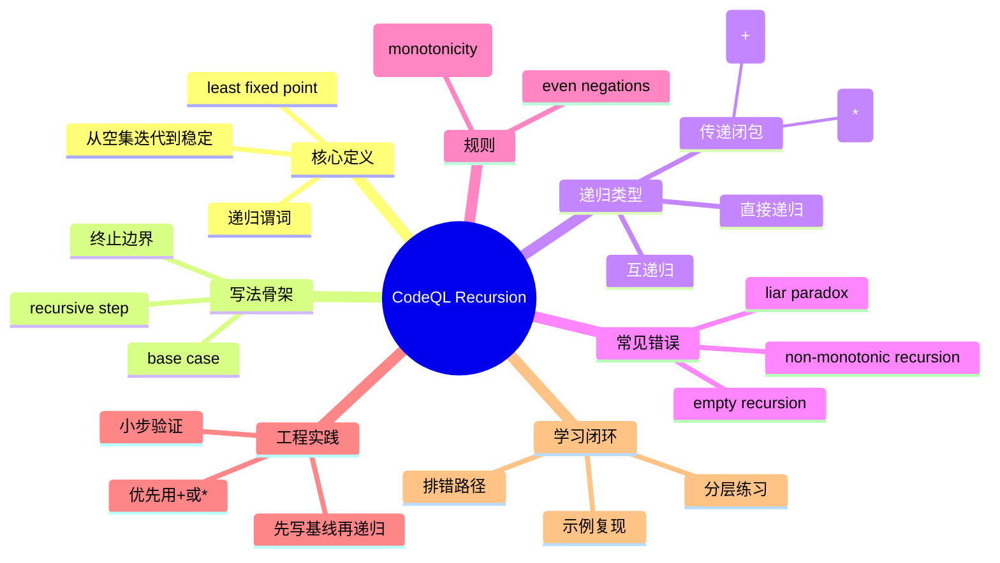

# 记忆卡片摘要（快速复习版）

## 1. 大纲（压缩版）
- Recursion 在 CodeQL 里是什么，以及为什么和最小不动点（least fixed point）绑定
- 递归谓词怎么写：基线分支（base case）+ 递归分支（recursive step）
- 互递归（mutual recursion）怎么理解
- 传递闭包 `+` 与自反传递闭包 `*` 的语义与替换关系
- 常见错误一：空递归（empty recursion）
- 常见错误二：非单调递归（non-monotonic recursion）
- “偶数层否定”规则怎么判断
- 最小可运行示例、排错清单、练习与复习节奏

## 2. 思维导图（Mermaid）


> Mermaid 检查说明：已做语法自检，并尝试使用 `@mermaid-js/mermaid-cli` 编译验证；结果见文末“Mermaid 验证说明”。

## 3. 重要知识点（必须记住）
- 在 QL 里，谓词如果直接或间接依赖自己，就是递归谓词。[来源1]
- 递归求值不是“过程式调用栈”，而是求最小不动点：从空集开始，反复应用规则，直到结果不再变化。[来源1]
- 结果是否正确，关键看你有没有给出“可增长的起点”（base case）。没有基线通常会触发 empty recursion 或得到空结果。[来源1]
- 传递闭包 `+` 表示“应用一到多次”，`*` 表示“应用零到多次（包含自身）”。[来源1]
- 递归必须满足单调性；互递归只允许出现在偶数层否定下（even number of negations）。[来源1]
- `not p()` 这种把递归放在奇数层否定里的写法会导致无解悖论，编译器会拒绝。[来源1]

## 4. 难点 / 易混点
- “能写出来”不等于“有最小不动点解”：空递归与非单调递归都可能语法看起来像对的，但语义无效。[来源1]
- `+` 与 `*` 只对二元关系（two arguments）适用，参数类型还要兼容；并不是所有谓词都能直接加 `+` 或 `*`。[来源1]
- `getAParent+()` 与手写 `getAnAncestor()` 等价，但手写版更容易漏掉基线，优先闭包语法更稳。[来源1]
- “偶数层否定”容易数错：`not exists(... | not p())` 里递归点在两层否定下，属于合法递归。[来源1]

## 5. QA 快速复习卡片
- Q: CodeQL 递归为什么强调 least fixed point？
  A: 因为 QL 用集合语义求解递归，结果定义就是最小不动点，不是过程式执行轨迹。[来源1]
- Q: 空递归为什么会报错？
  A: 编译器从空集开始推导，没有基线分支就永远加不出新值，结果永远是空，因而判定为无效递归。[来源1]
- Q: `+` 和 `*` 的核心差异？
  A: `+` 至少一步；`*` 允许零步，所以会包含“自身”。[来源1]
- Q: 互递归合法吗？
  A: 合法，但整体仍需满足可收敛和单调性约束。[来源1]
- Q: 如何快速判断 non-monotonic recursion？
  A: 看递归调用是否处在奇数层 `not` 里；奇数层通常非法，偶数层可合法。[来源1]

## 6. 快速复现步骤（最短路径）
1. 先读 Recursion 页面开头两段，确认“least fixed point”求值模型。[来源1]
2. 复制 `getANumber()` 示例，理解“基线 + 递归增长”的最小骨架。[来源1]
3. 练习把“祖先查询”分别写成显式递归、`+` 和 `*` 三种版本并对比语义。[来源1]
4. 故意写一个空递归示例，观察报错，再补上 base case 修复。[来源1]
5. 故意写 `predicate isParadox() { not isParadox() }`，理解非单调递归为何无解。[来源1]

---

# 学习笔记正文（详细版）

## 0. 学习目标、读者画像与假设
- 技术：`CodeQL / QL language` 的 `Recursion`
- 学习目标：系统掌握递归谓词写法、闭包语法、常见错误与排错策略，能独立写出正确递归查询
- 读者水平：初学（默认），已知道基础谓词写法与 `select`
- 时间预算：标准版（1-3 小时阅读 + 1 小时练习）
- 版本范围：以你提供的官方页面快照为主（来源 URL 指向 `codeql.github.com/docs/ql-language-reference/recursion/`）
- 运行环境：当前环境仅用于文档整理；本文示例未在本地 CodeQL 数据库实际执行
- 假设与限制：
  - 用户提供资源本身就是官方文档快照，不是第三方文章
  - 本文关键结论以该官方页面为准；延伸链接仅作为继续学习入口
  - 若 Mermaid 编译受环境限制，会明确标注降级说明

## 1. 背景与用途（从读者视角）

### 1.1 为什么 CodeQL 特别重视递归
CodeQL 查询经常面对“图结构关系”：父子、调用链、数据流、依赖链。此类问题天然需要“重复应用某个关系直到稳定”。Recursion 正是表达这种“可达性/传递性”的核心工具。[来源1]

不用递归会怎样：
- 你只能写固定层数（比如只查 1 层、2 层父节点），无法泛化到任意深度。
- 查询可维护性差，一旦层数变化就要改代码。

### 1.2 递归在日常查询里的典型场景
- 祖先/后代关系
- 函数调用可达性
- 污点传播链路
- 目录/依赖的层级展开

`必须记住`
- 只要你在做“直到没有新结果为止”的关系扩展，通常就在使用递归思想。

## 2. 核心概念与术语（直白解释）

### 2.1 递归谓词（recursive predicate）
官方定义：谓词直接或间接依赖自身，就是递归谓词。[来源1]

直白理解：
- 直接依赖：`p()` 在定义里直接调用 `p()`。
- 间接依赖：`p()` 调 `q()`，而 `q()` 最终又调回 `p()`（互递归）。

### 2.2 最小不动点（least fixed point）
官方描述：编译器从空集开始，不断应用递归规则加入新值，直到集合不再变化；该稳定集合就是最小不动点，也就是最终求值结果。[来源1]

直白理解：
- 第 0 轮：结果集是空。
- 第 1 轮：靠 base case 得到第一批值。
- 后续轮：用“已知值”推导新值。
- 没有新值时停止。

### 2.3 基线分支（base case）
这是能“点燃”递归的起点分支。没有它，空集无法长出任何值，递归通常失败（empty recursion）。[来源1]

### 2.4 单调性（monotonicity）
官方要求：有效递归必须是单调的；互递归只能出现在偶数层否定之下。[来源1]

直白理解：
- 递归迭代应该“只增不乱翻转”。
- 若定义变成“成立当且仅当不成立”这类悖论，就不存在稳定解。

### 2.5 传递闭包（transitive closure）
对一个二元关系反复应用得到的递归关系。QL 为常见闭包场景提供了简写符号：
- `+`：一到多次
- `*`：零到多次（含自身）[来源1]

## 3. 工作原理 / 机制（先直观后严格）

### 3.1 直观版
你可以把 CodeQL 递归看成“集合迭代器”：
1. 先把确定成立的值放进去（base case）。
2. 根据递归规则扩张集合。
3. 直到集合不再变化。

### 3.2 严格版
对递归谓词 `R`，QL 语义上求的是让 `R = F(R)` 成立的最小解（least fixed point）。编译器采用从空集向上逼近的方式求这个最小解。[来源1]

推论：
- 你写递归时要关注“是否可从空集增长”。
- 还要关注“增长过程是否单调”。

`必须记住`
- base case 解决“能不能长出来”。
- monotonicity 解决“能不能稳定下来”。

## 4. 核心 API / 语法 / 组件 / 命令（按技术类型适配）

## 4.1 最小递归骨架：从 0 数到 100
官方示例：[来源1]

```ql
int getANumber() {
  result = 0
  or
  result <= 100 and result = getANumber() + 1
}

select getANumber()
```

解释：
- `result = 0` 是基线。
- 第二分支表示“如果已有某个数，就能得到它+1”，并限制到 100。
- 输出应为 0 到 100 的整数集合。

## 4.2 互递归（mutual recursion）
官方示例：[来源1]

```ql
int getAnEven() {
  result = 0
  or
  result <= 100 and result = getAnOdd() + 1
}

int getAnOdd() {
  result = getAnEven() + 1
}

select getAnEven()
```

解释：
- `getAnEven` 与 `getAnOdd` 构成环。
- 依然有起点 `result = 0`，因此可收敛。

## 4.3 传递闭包 `+` 与 `*`
官方要求与示例要点：[来源1]
- 被加闭包的原谓词应是二元关系（含 `this`/`result` 也算）
- 两个参数类型需兼容

### 4.3.1 `+`：一到多次
显式递归版本：

```ql
Person getAnAncestor() {
  result = this.getAParent()
  or
  result = this.getAParent().getAnAncestor()
}
```

等价写法：`getAParent+()`。[来源1]

### 4.3.2 `*`：零到多次
显式递归版本：

```ql
Person getAnAncestor2() {
  result = this
  or
  result = this.getAParent().getAnAncestor2()
}
```

等价写法：`getAParent*()`。[来源1]

## 4.4 非法递归的两类典型信号

### 4.4.1 Empty recursion
错误写法（无基线）：[来源1]

```ql
Person getAnAncestor() {
  result = this.getAParent().getAnAncestor()
}
```

### 4.4.2 Non-monotonic recursion
悖论写法：[来源1]

```ql
predicate isParadox() {
  not isParadox()
}
```

该定义要求“成立当且仅当不成立”，无固定点解。

## 4.5 合法的“偶数层否定”递归
先看官方示例（`isExtinct`）：[来源1]

```ql
predicate isExtinct() {
  this.isDead() and
  not exists(Person descendant | descendant.getAParent+() = this |
    not descendant.isExtinct()
  )
}
```

### 4.5.1 先用一句话理解这段定义
`p.isExtinct()` 表示：`p` 自己已死亡，且不存在任何“没灭绝”的后代。[来源1]

这句话里有两个“不”：
- 外层：`not exists(...)` = “不存在某个后代满足反例条件”
- 内层：`not descendant.isExtinct()` = “这个后代不是灭绝状态”

两个“不”叠在一起，本质上是在说“所有后代都灭绝了”。[来源1]

### 4.5.2 给非科班的类比：班级点名的“双重否定”
把 `isExtinct()` 类比成“全班都交作业”：  
- 你要判断“班级达标”，可以说：`不存在` 一个同学 `没交作业`。  
- 这就是 `not exists(student | not submitted(student))`。

这里也有两个“不”：
- `不存在`（第一个不）
- `没交`（第二个不）

两个“不”组合后，表达的是一个正向条件：所有人都交了。  
`isExtinct` 的写法和这个结构完全同型，只是把“交作业”换成了“后代是否灭绝”。[来源1]

### 4.5.3 为什么“偶数层否定”是合法递归
官方要求递归必须单调（monotonic），并指出互递归/递归只允许出现在偶数层否定下。[来源1]

在这个例子中，递归点是 `descendant.isExtinct()`，它位于：
1. 外层 `not exists` 之内（1 层否定）
2. 内层 `not descendant.isExtinct()` 之内（再 1 层否定）

总计 2 层否定（偶数），因此是合法递归。[来源1]

### 4.5.4 用固定点直觉再看一遍（避免只背规则）
把“灭绝的人集合”想成一个集合 `S`：
- 某人能进 `S` 的条件是：他已死亡，且他的所有后代也在 `S` 里。

当 `S` 变大时，“所有后代在 `S`”这个条件只会更容易满足，不会突然反转成更难满足，所以这类定义可单调收敛到稳定结果。  
这也是它能有最小不动点解的直观原因。[来源1]

对比非法例子 `not isParadox()`：集合一旦变大，条件会反向翻转，无法稳定，所以无解。[来源1]

### 4.5.5 等价改写：`not exists(... | not ...)` 与 `forall(... | ...)`
官方给了等价改写思路：可写成 `forall` 版本。[来源1]

```ql
forall(Person descendant | descendant.getAParent+() = this |
  descendant.isExtinct()
)
```

直白理解：
- `not exists(反例)` 是“没有反例”
- `forall(正例)` 是“全部满足正例”

它们在这里语义等价，但 `forall` 版更容易让初学者看出“全体约束”。

### 4.5.6 实战判断口诀（写递归时可直接套）
1. 先圈出递归调用点（例如 `descendant.isExtinct()`）。
2. 从调用点往外数 `not` 层数。
3. 偶数层：通常可行（仍要检查其他条件）。
4. 奇数层：高风险，常见 non-monotonic recursion。
5. 如果数不清，先改写成 `forall` 或“无反例”表达再检查。

文档结论是：该 `isExtinct` 定义中的递归调用位于偶数层否定，因此合法。[来源1]

## 5. 常见用法与典型场景

## 5.1 场景一：层级关系展开
- 目标：从“直接关系”得到“任意层关系”。
- 建议：优先闭包 `+` / `*`，除非你确实需要自定义递归过程。

## 5.2 场景二：属性向下传播
- 目标：某性质在后代节点上是否都成立。
- 典型形式：`not exists(... | not ...)` 或 `forall(...)`。
- 重点：数清楚否定层数，避免非单调。

## 5.3 场景三：互递归建模二分状态
- 目标：两类状态交替推导（偶/奇层、开/关状态等）。
- 要点：至少一边有可靠基线；否则整个环无法启动。

## 6. 最小可运行示例（含预期输出/现象）

> 说明：以下示例来自官方语法并做教学解释，未在当前环境实际执行。

### 示例1：基础递归（基线 + 增长）
- 目标：理解 least fixed point 如何从 base case 扩张结果集
- 前提条件：可运行 CodeQL 查询的环境
- 代码：
```ql
int getANumber() {
  result = 0
  or
  result <= 5 and result = getANumber() + 1
}

select getANumber()
```
- 运行步骤：执行查询，观察结果集合
- 预期输出/现象：`0,1,2,3,4,5`
- 常见错误与修复：漏掉 `result = 0` 会变成空递归，补上基线即可

### 示例2：互递归
- 目标：理解“间接依赖自身”
- 前提条件：同上
- 代码：
```ql
int getEven() {
  result = 0
  or
  result <= 10 and result = getOdd() + 1
}

int getOdd() {
  result = getEven() + 1
}

select getEven()
```
- 预期输出/现象：`0,2,4,6,8,10`
- 常见错误与修复：若把 `getEven` 的基线删掉，互递归整体可能无法产生值

### 示例3：`+` 与 `*` 语义对比（概念示例）
- 目标：区分“一到多次”和“零到多次”
- 前提条件：有 `Person.getAParent()` 关系
- 代码：
```ql
from Person p
select p, p.getAParent+(), p.getAParent*()
```
- 预期现象：`*` 结果包含 `p` 本身，`+` 不包含
- 常见错误与修复：对非二元关系使用闭包会失败，需先改写成二元关系谓词

### 示例4：非单调递归反例
- 目标：识别“奇数层否定递归”
- 代码：
```ql
predicate isParadox() {
  not isParadox()
}

select isParadox()
```
- 预期现象：编译错误（无固定点解）
- 修复方向：移除奇数层否定结构，改写为可单调增长的定义

## 7. 常见错误与排查路径

## 7.1 错误现象：empty recursion / 无结果
常见原因：
- 没有 base case
- base case 写了但条件永远不成立

排查顺序：
1. 单独运行 base case，确认它能产生至少一个值。
2. 临时注释递归分支，看基础结果是否存在。
3. 再逐步恢复递归分支，观察每步是否能新增值。

## 7.2 错误现象：non-monotonic recursion
常见原因：
- 递归调用处于奇数层 `not`
- 逻辑结构构成“成立当且仅当不成立”的悖论

排查顺序：
1. 标记每个递归调用点的否定深度。
2. 检查是否都是偶数层。
3. 将 `not exists(... | not p())` 尝试改写成 `forall(... | p())` 对照理解。[来源1]

## 7.3 错误现象：闭包 `+/*` 不能用
常见原因：
- 原谓词不是二元关系
- 参数类型不兼容

排查顺序：
1. 确认谓词形状是二元关系。
2. 明确两个参数的类型兼容性。
3. 无法直接闭包时，先写适配谓词再闭包。

## 8. 最佳实践与边界条件

## 8.1 最佳实践
- 先写 base case，再加递归 step，最后再优化条件。
- 关系展开优先 `+` / `*`，可读性更好也更不易漏基线。
- 复杂递归优先“可解释写法”，再做等价变换。
- 每次只引入一个递归点，逐步验证。

## 8.2 边界条件 / 限制
- 无起点的递归定义无效（空递归）。[来源1]
- 奇数层否定下的递归无效（非单调）。[来源1]
- 闭包操作要求二元关系与类型兼容。[来源1]

## 9. 版本差异 / 兼容性说明（如适用）
- 本文依据你提供的官方页面快照整理，URL 指向 `codeql.github.com/docs/ql-language-reference/recursion/`。
- 页面本身未在正文显式给出统一版本号；实际编译行为以你的本地 CodeQL 版本为准。
- 对于 `Monotonic aggregates`、`negation` 等扩展主题，建议按同站点当前文档交叉复核后再落地到生产规则。[来源1]

## 10. 延伸学习路径（官方优先）
- `Recursion`（本主题主页面）[来源1]
- `Expressions` 中的 `Monotonic aggregates`（递归聚合进阶）[来源1]
- `Formulas` 中的 `negation`（理解否定层数规则）[来源1]
- `Evaluation of QL programs`（把固定点求值放到整体执行模型里）

## 11. 官方文档章节映射与重要例子保留检查（专门一轮）

官方章节到笔记章节映射：
1. `Recursion`（总述 + least fixed point）
   - 映射到：正文 `2.2`、`3.1`、`3.2`
2. `Examples of recursive predicates`
   - 映射到：正文 `4.1`、`4.2`、`4.3`
3. `Counting from 0 to 100`
   - 映射到：正文 `4.1` + 示例1
4. `Mutual recursion`
   - 映射到：正文 `4.2` + 示例2
5. `Transitive closures`
   - 映射到：正文 `4.3` + 示例3
6. `Restrictions and common errors`
   - 映射到：正文 `4.4`、`7`
7. `Empty recursion`
   - 映射到：正文 `4.4.1`、`7.1`
8. `Non-monotonic recursion`
   - 映射到：正文 `4.4.2`、`4.5`、`7.2`

官方重要例子保留检查：
- `getANumber()`：已保留（正文 `4.1`，并提供缩小版运行示例）
- `getAnEven/getAnOdd`：已保留（正文 `4.2` + 示例2）
- `getAnAncestor`（显式递归等价 `+`）：已保留（正文 `4.3.1`）
- `getAnAncestor2`（显式递归等价 `*`）：已保留（正文 `4.3.2`）
- 空递归错误示例：已保留（正文 `4.4.1`）
- `isParadox` 非单调反例：已保留（正文 `4.4.2` + 示例4）
- `isExtinct` 偶数层否定合法示例：已保留（正文 `4.5`）

结论：Recursion 页面关键章节与关键例子均已覆盖；无关键断层。

## 12. 逐大纲递归讲解深度检查（专门一轮）
- 对 `定义/机制/语法/示例/错误/排查/实践/进阶` 各部分已逐项检查，避免“只有结论无过程”。
- 对同层级重点（`4.1`~`4.5`）已保持相近解释密度：每节都包含“是什么 + 为什么 + 怎么判断正确”。
- 抽象点（least fixed point、monotonicity、even negations）均给了直观解释与反例，不要求读者先查外部资料才能跟上主线。
- 对容易失衡的“错误章节”已补充成可执行排查顺序（第 `7` 节），避免只有概念定义。

---

# 练习与复习闭环

## 1. 分层练习

### 基础练习
1. 将 `getANumber()` 上限改成 20，解释为什么结果不会超过 20。
2. 删除 `getANumber()` 的 base case，观察并解释错误。
3. 把祖先关系分别写成显式递归、`+`、`*` 三个版本，比较结果差异。

### 应用练习
1. 写一个“节点可达”关系查询，先用显式递归，再改写成 `+`。
2. 设计一个互递归（A 依赖 B，B 依赖 A）并确保有共同起点。
3. 将 `not exists(... | not p())` 改写成 `forall(... | p())`，验证语义一致。

### 综合练习
1. 给定一个层级模型，完成：
   - 可达查询（`+`）
   - 包含自身可达（`*`）
   - 一条故意非法的 non-monotonic 反例
   - 对反例给出修复版
2. 写一份 10 行以内排错脚本化清单，能定位 empty recursion 与 negation 层数问题。

## 2. 动手任务（带验收标准）
- 任务：实现一个“家族关系教学查询包”，包含 `getAParent`、祖先闭包、后代全满足条件判断。
- 验收标准：
  - 至少 1 个 `+` 示例和 1 个 `*` 示例
  - 至少 1 个合法互递归
  - 至少 1 个非法递归反例 + 修复说明
  - 每个谓词都写出 base case 或等价起点解释

## 3. 常见误区纠偏
- 误区：递归就是“函数自己调用自己”，和过程式语言一样。
  正解：CodeQL 递归核心是集合上的固定点求解，不是调用栈思维。[来源1]
- 误区：只要写了递归调用就会有结果。
  正解：没有 base case 往往为空递归，无法生长。[来源1]
- 误区：`+` 和 `*` 差不多，随便用。
  正解：`*` 包含零步，会把当前点自身也算进去；语义差异会影响结果集。[来源1]
- 误区：`not` 包住递归也可以，只要能编译。
  正解：奇数层否定递归属于非单调，通常会被拒绝。[来源1]

## 4. 复习节奏建议
- Day 1：重读记忆卡片，手写 `getANumber` 与 `getAnAncestor` 两个模板
- Day 3：完成应用练习，重点练“闭包改写”和“否定层数计数”
- Day 7：做综合练习，要求能独立解释为何某定义非法
- Day 14：脱离笔记复写一版“递归排错清单”，并对照修订

## 5. 自测题与参考答案（简版）
1. 题目：least fixed point 在 CodeQL 递归里具体指什么？
   参考答案：从空集出发反复应用规则，直到无新值产生的最小稳定结果集。[来源1]
2. 题目：为什么 empty recursion 常见于“只有递归分支”的写法？
   参考答案：缺少 base case，空集无法产生任何新值，递归无法启动。[来源1]
3. 题目：`getAParent+()` 和 `getAParent*()` 的差别是什么？
   参考答案：前者一到多次，不含自身；后者零到多次，包含自身。[来源1]
4. 题目：`predicate p() { not p() }` 为什么非法？
   参考答案：递归在奇数层否定下，导致悖论式定义，无固定点解。[来源1]
5. 题目：判断递归合法性时，最先检查哪两件事？
   参考答案：是否有 base case；递归调用是否满足单调性（尤其否定层数）。[来源1]

---

# 参考来源与版本说明

## 官方来源（优先）
1. [CodeQL docs: Recursion](https://codeql.github.com/docs/ql-language-reference/recursion/) - 官方文档快照（用户提供）/ 访问日期 `2026-02-27` - 本笔记主来源（定义、示例、限制、错误）

## 第三方来源（按采信程度标注）
- 本次无第三方来源（用户提供资源即官方页面）

## 关键结论引用映射
- [来源1] -> 递归定义；least fixed point 求值；`getANumber`/互递归示例；传递闭包 `+/*` 语义；empty recursion；non-monotonic recursion；偶数层否定合法性

## 技术版本与文档版本/访问日期
- 技术主题：CodeQL QL 语言 Recursion
- 文档定位：官方 URL + 你提供的本地 HTML 快照
- 访问日期：`2026-02-27`
- 版本说明：页面未显式给统一版本号，实际行为以本地 CodeQL 版本与编译器为准

## 冲突点与裁决（如有）
- 本次仅使用官方单一主来源，未发现来源冲突

## Mermaid 验证说明
- 目标：验证顶部思维导图可编译
- 已执行命令：`timeout 30s npx -y @mermaid-js/mermaid-cli -i /tmp/codeql-recursion-mindmap.mmd -o /tmp/codeql-recursion-mindmap.svg`
- 当前环境验证结果：命令超时，`EXIT_CODE:124`，未生成可确认的 SVG 输出（推测受依赖拉取或无头浏览器环境限制影响）
- 本地复验命令：
```bash
npx -y @mermaid-js/mermaid-cli -i codeql-recursion-mindmap.mmd -o codeql-recursion-mindmap.svg
```
