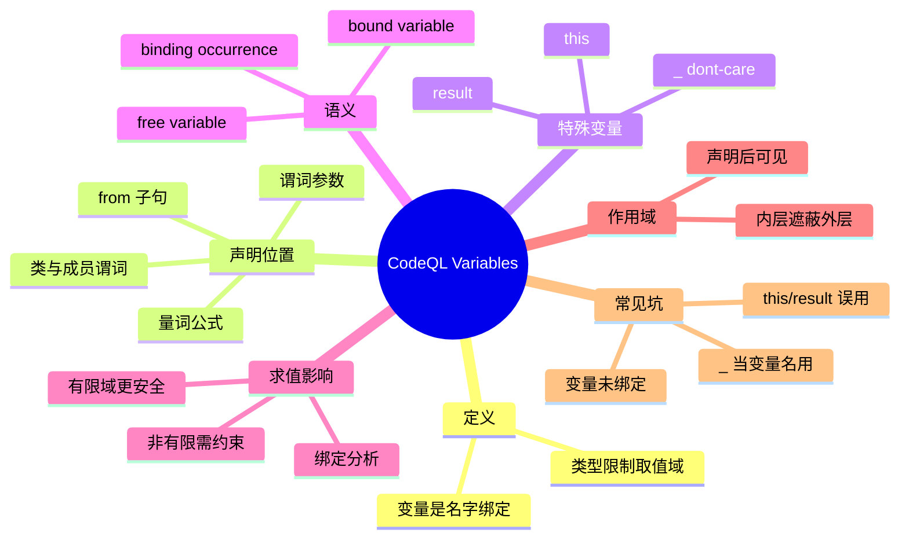

# 记忆卡片摘要（快速复习版）

## 1. 大纲（压缩版）
- CodeQL Variables 是什么：变量是“名字绑定到值”的入口，类型决定取值域。[来源1]
- 变量在哪里声明：`from`、谓词参数、类与成员谓词、量词（`exists/forall/forex`）。[来源1][来源2][来源5][来源6]
- 关键区分：自由变量（free variable）vs 约束变量（bound variable）。[来源1][来源3]
- 特殊变量：`this`（当前类实例）与 `result`（谓词返回值）。[来源1][来源5]
- don’t-care 表达式：`_` 可以表示“不关心这个值”。[来源4]
- 作用域与遮蔽：作用域从声明点开始，内层可遮蔽同名外层变量（应避免）。[来源1][来源7]
- 高价值实践：优先收窄类型、让变量尽早被绑定，减少无界搜索与报错。[来源3][来源5]

## 2. 思维导图（Mermaid）


> Mermaid 验证状态：
> - 已做人工语法检查（层级、节点、缩进、连接均合法）。
> - 已尝试编译：`timeout 30s npx -y @mermaid-js/mermaid-cli -i /tmp/codeql-variables-mindmap.mmd -o /tmp/codeql-variables-mindmap.svg`，退出码 `124`（超时）。
> - 当前环境缺少 `mmdc`，因此未完成编译通过确认；文末给出本地验证步骤。

## 3. 重要知识点（必须记住）
- QL 变量名必须以小写字母开头，可包含字母数字与下划线。[来源1]
- 变量通常必须声明类型（如 `int`、`string`、`Expr`），类型影响语义和可求值性。[来源1][来源3]
- 公式里的自由变量必须在外层被声明；量词变量是局部变量，作用域只在量词内。[来源1][来源2]
- 若变量没有被绑定到有限候选集合，查询常会出现“not bound to a value”类错误。[来源3][来源5]
- `this` 只能在非静态成员谓词中使用；`result` 只能在有返回类型的谓词中使用。[来源1][来源5]
- `_` 不是“变量名”，而是 don’t-care 表达式，占位表示“不关心此参数值”。[来源4]

## 4. 难点 / 易混点
- “free variable” 不是“错误变量”，它只是尚未被当前构造绑定的变量；是否可用要看外层是否声明。[来源1][来源2]
- “bound variable” 与“有类型”不是同一件事：变量有类型但仍可能未绑定，导致求值失败。[来源3]
- `this` 与普通参数变量地位不同：`this` 由成员谓词的接收者隐式提供，不是手写参数。[来源1][来源5]
- `_` 只能当表达式占位符，不可写成 `exists(int _ | ...)` 这种变量声明。[来源4]

## 5. QA 快速复习卡片
- Q: Variables 在 CodeQL 里最核心的作用是什么？  
  A: 限定“要枚举哪些值”，并通过类型与约束参与查询求值。[来源1][来源3]
- Q: 为什么会报 `x is not bound to a value`？  
  A: 因为求值器找不到把 `x` 限定到有限候选集的绑定路径。[来源3][来源5]
- Q: `this` 和 `result` 分别代表什么？  
  A: `this` 是成员谓词当前对象；`result` 是返回值谓词的输出值。[来源1][来源5]
- Q: `exists(int x | ...)` 和 `from int x` 的区别？  
  A: 前者只在公式内部有效（局部）；后者为查询主范围变量。[来源2][来源6]
- Q: `_` 的正确使用场景？  
  A: 在参数位置表达“存在某值即可，不需要名字引用”。[来源4]

## 6. 快速复现步骤（最短路径）
1. 先读官方 `Variables`，掌握定义、命名、`this/result`、free variable。[来源1]
2. 再读 `Formulas` 的量词章节，理解局部变量与隐式存在量化。[来源2]
3. 读 `Evaluation of QL programs` 的 binding occurrence，理解“为何会未绑定报错”。[来源3]
4. 本地做 3 个最小实验：
   - `from` 变量 + 范围约束；
   - `exists` 量词变量；
   - `this/result` 成员谓词。

---

# 学习笔记正文（详细版）

## 0. 学习目标、读者画像与假设
- 技术：CodeQL QL 语言中的 `Variables`
- 学习目标：入门掌握变量声明、作用域、绑定语义与常见坑，能写出不容易“未绑定”的变量逻辑
- 读者水平：初学（默认）
- 时间预算：标准版（1-3 小时阅读 + 30-60 分钟练习）
- 版本范围：以 `codeql.github.com` 当前文档为准（访问日期：`2026-02-27`）
- 运行环境：本机有 `CodeQL CLI 2.23.3`
- 假设与限制：
  - 用户提供资源为官方 `Variables` 页面（非第三方教程）
  - 本文补充官方交叉页面（`Formulas`、`Evaluation`、`Expressions`、`Predicates`、`Queries`、QL 规范）
  - 示例做了编译级验证（`codeql query compile`），未在数据库上实际运行

## 1. 背景与用途（从读者视角）

### 1.1 为什么 Variables 是 CodeQL 入门的关键
在 SQL 或编程语言里，变量常被理解成“保存值的名字”。在 QL 里，变量不仅是名字，还会决定“查询引擎需要枚举什么”，直接影响可求值性和性能。[来源1][来源3]

### 1.2 不理解变量会出现什么问题
- 写出语法对但求值失败的查询（常见：未绑定变量）。[来源3][来源5]
- 把量词局部变量当全局变量用，导致作用域错误。[来源2]
- 在成员谓词中误用 `this/result`，导致逻辑错误或类型错误。[来源1][来源5]

### 1.3 变量在真实查询中的角色
- `from` 变量：定义“我要从数据库实体里枚举谁”。[来源6]
- 谓词参数变量：定义“这个逻辑接受哪些输入”。[来源5]
- 量词变量：表达“存在/对所有”局部条件。[来源2]
- 成员谓词里的 `this/result`：表达对象行为与输出关系。[来源1]

## 2. 核心概念与术语（直白解释）

### 2.1 变量（variable）
官方定义：变量是可以绑定到值的名字（a name that can be bound to a value）。[来源1]

直白版：
- 你写变量，就是在告诉 QL“哪些位置要被替换成候选值”。
- 候选值由类型和约束共同决定。

### 2.2 声明（declaration）
变量使用前通常要声明。常见形式：
- `from int i`（查询变量）
- `predicate p(int x)`（参数变量）
- `exists(int y | ...)`（量词局部变量）[来源1][来源2][来源5][来源6]

### 2.3 自由变量（free variable）
在一个公式中，如果某变量没有在该公式内部被量词等构造绑定，它在该公式内是自由变量。[来源1][来源2]

必须记住：
- 自由变量必须在外层（查询、谓词、类等）已声明，否则不可用。[来源1]

### 2.4 约束变量 / 绑定变量（bound variable）
被量词或其他绑定发生点限制作用域的变量，是 bound variable。[来源2][来源3]

直白理解：
- bound 代表“这个变量来源明确、搜索空间可控”。
- 这对查询可求值性非常关键。

### 2.5 绑定发生点（binding occurrence）
`Evaluation of QL programs` 给出了哪些写法会把变量绑定到有限域，例如：
- 类型检查（`x instanceof T`）
- 类型转换（`x.(T)`）
- 成员谓词调用（接收者变量）
- 范围约束（如 `x in [1 .. 10]`）[来源3]

## 3. 工作原理 / 机制（先直观后严格）

### 3.1 直观版：变量像“待填空”，约束像“筛子”
可以把 QL 看成：
1. 先根据声明拿到变量候选值；
2. 再用 `where` / 公式过滤；
3. 输出满足条件的组合。

变量越早被明确约束，求值越稳。

### 3.2 严格版：语义 + 作用域 + 绑定分析共同生效
- 语义层：变量有类型，表达式必须类型一致。[来源1]
- 作用域层：变量可见性由声明位置决定，量词变量仅局部可见。[来源2][来源7]
- 求值层：变量必须有绑定路径，否则会报未绑定错误。[来源3][来源5]

### 3.3 这三层如何联动
例子：`exists(int y | y = x + 1 and y in [1..5])`
- `y` 在量词内局部声明（作用域）[来源2]
- `y` 类型为 `int`（语义）[来源1]
- `y in [1..5]` 为绑定提供有限域（求值）[来源3]

## 4. 核心 API / 语法 / 组件 / 命令

### 4.1 变量命名规则
官方变量页给出：变量名必须以小写字母开头，可包含字母、数字、下划线。[来源1]

### 4.2 `from` 子句声明查询变量
```ql
from int i, string s
where i = 3 and s = "hello"
select i, s
```
- `i`、`s` 是查询主变量。
- `from` 可声明多个变量，逗号分隔。[来源6]

### 4.3 谓词参数声明变量
```ql
predicate isSmall(int x) {
  x in [0 .. 10]
}
```
- `x` 的作用域在谓词体内。
- 参数类型是接口契约的一部分。[来源5]

### 4.4 量词变量（`exists/forall/forex`）
```ql
exists(int y | y = x + 1 and y in [1 .. 5])
```
- `y` 是局部变量。
- 只在该量词公式内有效。[来源2]

`forall` 与 `forex` 同样可声明局部变量。[来源2]

#### 4.4.1 三种量词到底有什么区别（先记结论）
- `exists(vars | 条件)`：只要存在一组 `vars` 让条件成立，整体就成立。[来源2]
- `forall(vars | 条件1 | 条件2)`：对所有满足 `条件1` 的 `vars`，`条件2` 都必须成立。[来源2]
- `forex(vars | 条件1 | 条件2)`：等价于  
  `forall(vars | 条件1 | 条件2) and exists(vars | 条件1 | 条件2)`，  
  用来避免 `forall` 在“没有任何候选值”时的空真（vacuous truth）。[来源2]

一句话理解：
- `exists` 看“有没有”；
- `forall` 看“是不是全都满足”；
- `forex` 看“至少有一个且全都满足”。

#### 4.4.2 `exists` 的生产开发用法：存在性风险检测
在安全规则里，`exists` 常用于判断“是否存在至少一条危险路径/危险调用”。

示意（生产规则形态，非特定语言 pack 代码）：
```ql
predicate hasUnsanitizedFlow(Callable c) {
  exists(Node src, Node sink |
    isUserControlled(src) and
    isDangerousSink(sink) and
    flow(src, sink) and
    sink.getEnclosingCallable() = c
  )
}
```
解释：
- 一旦存在一条从用户输入到危险点的未净化流，`hasUnsanitizedFlow(c)` 就成立。
- 这是“发现漏洞”的典型逻辑：`exists` 很适合“命中一次就报警”。

#### 4.4.3 `forall` 的生产开发用法：一致性/合规性约束
`forall` 常用于策略类规则，例如“某个范围内的调用必须全部满足某要求”。

示意：
```ql
predicate allSqlCallsParameterized(Callable c) {
  forall(Call q |
    isSqlExecution(q) and q.getEnclosingCallable() = c |
    usesPreparedStatement(q)
  )
}
```
解释：
- 业务语义是：在 `c` 内，所有 SQL 执行都必须参数化。
- 关键坑：若 `c` 里一个 SQL 调用都没有，上式可能仍为真（空真）。[来源2]

#### 4.4.4 `forex` 的生产开发用法：避免空真误判
当你要表达“确实发生过该类行为，并且都满足约束”，优先考虑 `forex`。

示意：
```ql
predicate hasSqlAndAllParameterized(Callable c) {
  forex(Call q |
    isSqlExecution(q) and q.getEnclosingCallable() = c |
    usesPreparedStatement(q)
  )
}
```
解释：
- 相比 `forall`，`forex` 增加了“至少存在一条匹配记录”的约束，避免把“没有 SQL 调用”的函数误判为“完全合规”。[来源2]

#### 4.4.5 量词变量与普通变量的工程差异
- 生命周期：量词变量是局部临时变量，只在量词内部可见；普通 `from` 变量作用域更大。[来源2][来源6]
- 建模意图：量词变量表达“逻辑存在/全称约束”；`from` 变量表达“查询主枚举对象”。
- 排错重点：量词变量也必须有可绑定路径；若条件过宽，仍可能触发 `not bound to a value`。[来源3]

一个常见坏味道：
```ql
exists(int i | i > 0)
```
这种写法通常没有把 `i` 绑定到有限候选集，容易引发求值问题。更稳妥做法是增加明确范围或与已绑定实体建立关系。[来源3]

### 4.5 `this` 与 `result`
官方变量页与谓词页都强调：
- `this`：非静态成员谓词里的当前类实例。
- `result`：有返回类型谓词中的返回值变量。[来源1][来源5]

```ql
class FavoriteNumbers extends int {
  FavoriteNumbers() {
    this = 1 or this = 4 or this = 9
  }

  string getName() {
    this = 1 and result = "one"
    or
    this = 4 and result = "four"
    or
    this = 9 and result = "nine"
  }
}
```

### 4.6 don’t-care 表达式 `_`
`Expressions` 页面说明 `_` 是 don’t-care expression，适合“这个位置只要存在某值即可”的场景。[来源4]

示意：
```ql
where f.getAnArgument(_)
```

注意：
- `_` 不是变量声明名；不要写成 `exists(int _ | ...)`。[来源4]

### 4.7 本地可用命令（本次已使用）
```bash
codeql version
codeql query compile --search-path /home/nyn/Desktop/dev_tools/codeql-cli-v2.23.3 <query.ql>
```

## 5. 常见用法与典型场景

### 5.1 场景一：在 `from` 中列出主对象，在 `where` 中逐步绑定
- 先枚举实体（如 `Function f`）
- 再用局部变量表达辅助条件（如 `exists(int i | i in [0..2])`）

### 5.2 场景二：在成员谓词中使用 `this/result` 建模“对象到结果”的关系
- `this` 表示当前对象
- `result` 表示该对象在该谓词下返回什么

### 5.3 场景三：使用量词表达局部逻辑，而不是污染全局变量空间
- `exists(int y | ...)` 比在外层声明一个通用 `y` 更清晰
- 作用域更小，逻辑边界更明确

### 5.4 场景四：使用 `_` 省去不必要命名
- 当变量只用一次、无后续引用价值时，用 `_` 提升可读性
- 但要确保该位置语义允许 don’t-care

## 6. 最小可运行示例（含预期输出/现象）

> 验证说明：以下示例均在本机 `CodeQL CLI 2.23.3` 做了编译验证（`codeql query compile`），未在数据库上执行，因此“结果行数”属于预期现象说明而非运行实测。

### 示例1：`from` 变量 + 量词局部变量
- 目标：理解查询变量和量词变量的协作
- 前提：本地 pack `codeql/cpp-all` 可解析
- 代码：
```ql
import cpp

from Function f
where exists(int y | y in [1 .. 3])
select f, f.getName()
```
- 编译验证：通过（`vars-quantified.ql`）
- 预期现象：选出所有函数（`exists(int y | y in [1..3])` 恒真）
- 常见错误：把 `y` 当成量词外可用变量

### 示例2：`this` + `result` 成员谓词
- 目标：理解两个特殊变量
- 代码：
```ql
import cpp

class FavoriteNumbers extends int {
  FavoriteNumbers() {
    this = 1 or this = 4 or this = 9
  }

  string getName() {
    this = 1 and result = "one"
    or
    this = 4 and result = "four"
    or
    this = 9 and result = "nine"
  }
}

from FavoriteNumbers n
select n, n.getName()
```
- 编译验证：通过（`vars-this-result.ql`）
- 预期现象：返回 3 行（`1/4/9` 对应名称）
- 常见错误：在静态谓词里误用 `this`，或在无返回类型谓词里使用 `result`

### 示例3：don’t-care `_` 的正确写法
- 目标：验证 `_` 的合法位置
- 代码：
```ql
import cpp

predicate hasValue(int x, int y) {
  x = 0 and y = 1
}

from Function f, int x
where hasValue(x, _) and x = 0
select f, x
```
- 编译验证：通过（`vars-dontcare-ok.ql`）
- 预期现象：`_` 位置不绑定具体名字，逻辑依旧成立
- 常见错误：`exists(int _ | ...)`（语法错误）

### 示例4：绑定错误示例（故意）
- 目标：理解“not bound to a value”
- 错误代码（节选）：
```ql
predicate between(int x, int low, int high) {
  x >= low and x <= high
}

where x in [0 .. 3] and between(x, 0, _)
```
- 现象：编译时报 `x/low/high is not bound to a value`
- 原因：该谓词定义未提供足够绑定路径，导致参数变量无法稳定绑定。[来源3]
- 修复：改写为可绑定形式（例如显式等值/范围绑定，或使用已绑定变量驱动）

## 7. 常见错误与排查路径

### 7.1 报错：`<var> is not bound to a value`
排查顺序：
1. 看变量是否只出现在“比较/算术”中而无域约束；
2. 看是否存在绑定发生点（成员调用、类型约束、有限范围）；
3. 把复杂条件拆开，定位哪个谓词导致变量失去绑定。[来源3][来源5]

### 7.2 报错：变量作用域错误 / 未定义
排查顺序：
1. 变量是否在当前作用域声明；
2. 量词变量是否被错误引用到量词外；
3. 是否被同名内层变量遮蔽，导致引用对象不是你以为的那个。[来源1][来源2][来源7]

### 7.3 `this/result` 误用
排查顺序：
1. 是否处于成员谓词上下文；
2. 谓词是否声明返回类型；
3. 是否把 `this` 当普通参数重声明了（不应这样做）。[来源1][来源5]

### 7.4 `_` 误用
排查顺序：
1. `_` 是否用在“表达式位置”而不是“声明位置”；
2. 该位置是否真的不需要该值后续引用；
3. 使用 `_` 后是否破坏了绑定（有些场景会）。[来源4][来源3]

## 8. 最佳实践与边界条件

### 8.1 最佳实践
- 变量声明尽量“窄”：类型越具体，约束越清晰。[来源1]
- 尽早绑定：尤其对 `int` 这类大域变量，尽快加范围或关系约束。[来源3]
- 量词变量本地化：只在需要处声明，减少作用域污染。[来源2]
- 谨慎命名：避免内外层同名，减少 shadowing 心智负担。[来源7]
- 成员谓词优先用 `this/result` 表达语义，少写绕弯参数。[来源1][来源5]

### 8.2 边界条件
- 仅“有类型”不保证“已绑定”；绑定是求值层面的额外要求。[来源3]
- `_` 是语法糖，不是万能简化；在绑定敏感场景可能引发意外。[来源4][来源3]
- 同一逻辑在不同语言 pack 上实体类型不同（如 `Function` 的定义），但变量语义规则一致。

## 9. 版本差异 / 兼容性说明（如适用）
- 本文依据官方文档在线版本（访问日期：`2026-02-27`）。
- 本机工具版本：`CodeQL CLI 2.23.3`（命令 `codeql version`）。
- 变量核心语义（声明、作用域、量词、`this/result`、binding）长期稳定；不同版本主要差异通常在报错文案、示例组织和标准库 API 命名。

## 10. 延伸学习路径（官方优先）
- 第一跳：`Formulas`（把变量放到量词与逻辑组合里）[来源2]
- 第二跳：`Evaluation of QL programs`（彻底吃透 binding）[来源3]
- 第三跳：`Predicates`（把变量接口化，开始写可复用逻辑）[来源5]
- 第四跳：`Expressions`（含 don’t-care `_`、`this`、`result`）[来源4]
- 第五跳：QL 语言规范章节（作用域与遮蔽细节）[来源7]

---

# 练习与复习闭环

## 1. 分层练习

### 基础练习
1. 解释 free variable 和 bound variable 的区别，并各写一个最小例子。
2. 写出一个 `from int i` 查询，并让 `i` 被范围约束到 `[0..5]`。
3. 写一个有返回类型的谓词，正确使用 `result`。

### 应用练习
1. 把一个 `where` 复杂条件拆成两个谓词，观察变量绑定是否更清晰。
2. 写一个包含 `exists` 和 `forall` 的组合公式，标出每个变量作用域。
3. 改写一个“重复命名变量”的查询，消除 shadowing。

### 综合练习
1. 设计一个小型“数字分类”类：
   - 用 `this` 定义成员集合；
   - 用 `result` 返回分类标签；
   - 用量词增加辅助条件。
2. 加入一个 `_` don’t-care 调用，再解释它是否影响绑定。

## 2. 动手任务（带验收标准）
- 任务：在本地新建 `vars-lab` 目录，完成 4 个查询文件：
  - `from-basic.ql`
  - `quantifier-scope.ql`
  - `this-result.ql`
  - `dontcare-and-binding.ql`
- 验收标准：
  - 4 个文件都能 `codeql query compile` 通过；
  - 至少包含 1 个故意错误案例并写明报错原因；
  - 每个文件顶部写出“本文件最关键变量是谁、如何绑定”。

## 3. 常见误区纠偏
- 误区：变量声明了类型就一定安全。  
  正解：还要看绑定路径，未绑定仍会失败。[来源3]
- 误区：`_` 可以当临时变量名声明。  
  正解：`_` 是表达式占位符，不是声明名。[来源4]
- 误区：量词变量可在量词外复用。  
  正解：量词变量是局部作用域。[来源2]
- 误区：`this` 和 `result` 只是普通变量别名。  
  正解：它们是语义化特殊变量，受上下文限制。[来源1][来源5]

## 4. 复习节奏建议
- Day 1：读完本笔记，手写 3 个最小示例（`from` / `exists` / `this-result`）
- Day 3：专刷 binding 错误，故意制造并修复 2 个“not bound”案例
- Day 7：把一个旧查询重构为“变量作用域更小、命名更清晰”的版本
- Day 14：闭卷写出 `this`、`result`、`_` 的使用边界并给例子

## 5. 自测题与参考答案（简版）
1. 题目：`exists(int y | ...)` 中的 `y` 属于什么作用域？  
   参考答案：仅在该量词内部可见，是局部 bound variable。[来源2]
2. 题目：出现 `x is not bound to a value` 的本质原因是什么？  
   参考答案：求值器没有找到把 `x` 限制到有限候选集合的绑定路径。[来源3]
3. 题目：`this` 与 `result` 的使用前提分别是什么？  
   参考答案：`this` 在非静态成员谓词；`result` 在有返回类型谓词。[来源1][来源5]
4. 题目：为什么 `_` 常用于提高可读性？  
   参考答案：当参数值不需要被后续引用时，用 `_` 避免无意义命名。[来源4]
5. 题目：free variable 一定错误吗？  
   参考答案：不一定；只要它在外层合法声明即可。[来源1][来源2]

---

# 参考来源与版本说明

## 官方来源（优先）
1. [CodeQL docs: Variables](https://codeql.github.com/docs/ql-language-reference/variables/) - 访问日期：2026-02-27 - 本文主轴
2. [CodeQL docs: Formulas](https://codeql.github.com/docs/ql-language-reference/formulas/) - 访问日期：2026-02-27 - 量词与局部变量
3. [CodeQL docs: Evaluation of QL programs](https://codeql.github.com/docs/ql-language-reference/evaluation-of-ql-programs/) - 访问日期：2026-02-27 - binding occurrence 与未绑定错误
4. [CodeQL docs: Expressions](https://codeql.github.com/docs/ql-language-reference/expressions/) - 访问日期：2026-02-27 - don’t-care expression `_`
5. [CodeQL docs: Predicates](https://codeql.github.com/docs/ql-language-reference/predicates/) - 访问日期：2026-02-27 - 参数变量、成员谓词、binding 示例
6. [CodeQL docs: Queries](https://codeql.github.com/docs/ql-language-reference/queries/) - 访问日期：2026-02-27 - `from/where/select` 中变量位置
7. [QL language specification](https://codeql.github.com/docs/ql-language-reference/ql-language-specification/) - 访问日期：2026-02-27 - 变量声明、作用域与遮蔽规则细节

## 第三方来源（按采信程度标注）
- 本次无第三方来源（用户提供链接本身是官方文档）

## 关键结论引用映射
- [来源1] -> 变量定义、命名规则、声明位置、`this/result`、free variable
- [来源2] -> `exists/forall/forex` 的变量声明与量词作用域
- [来源3] -> 绑定语义、绑定发生点、未绑定错误本质
- [来源4] -> `_` 为 don’t-care expression 的用法边界
- [来源5] -> 谓词参数变量、成员谓词语义与绑定错误示例
- [来源6] -> 查询结构中变量声明位置
- [来源7] -> 作用域与 shadowing 的规范化描述

## 技术版本与文档版本/访问日期
- 技术：CodeQL QL 语言（Variables）
- 文档定位：以上官方 URL + 访问日期 `2026-02-27`
- 本机工具：CodeQL CLI `2.23.3`

## 冲突点与裁决（如有）
- 本次未发现官方来源间实质冲突。
- 差异主要是“文档视角不同”（语法页 vs 求值机制页），属于互补关系，主结论以 `Variables + Evaluation` 组合裁决。[来源1][来源3]

## 示例验证记录
- 已通过编译：
  - `/tmp/codeql-vars-check/vars-cpp.ql`
  - `/tmp/codeql-vars-check/vars-quantified.ql`
  - `/tmp/codeql-vars-check/vars-this-result.ql`
  - `/tmp/codeql-vars-check/vars-dontcare-ok.ql`
- 已验证失败（故意错误示例）：
  - `/tmp/codeql-vars-check/vars-dontcare.ql` -> `not bound to a value`
  - 单独语法实验：`exists(int _ | ...)` 为语法错误（`_` 不能作为变量声明名）

## Mermaid 编译验证降级说明
- 当前环境：`mmdc` 命令不可用。
- 尝试命令：
```bash
timeout 30s npx -y @mermaid-js/mermaid-cli -i /tmp/codeql-variables-mindmap.mmd -o /tmp/codeql-variables-mindmap.svg
```
- 结果：超时（退出码 124）。
- 建议你本地复核步骤：
```bash
npm i -g @mermaid-js/mermaid-cli
mmdc -i codeql-variables-mindmap.mmd -o codeql-variables-mindmap.svg
```
