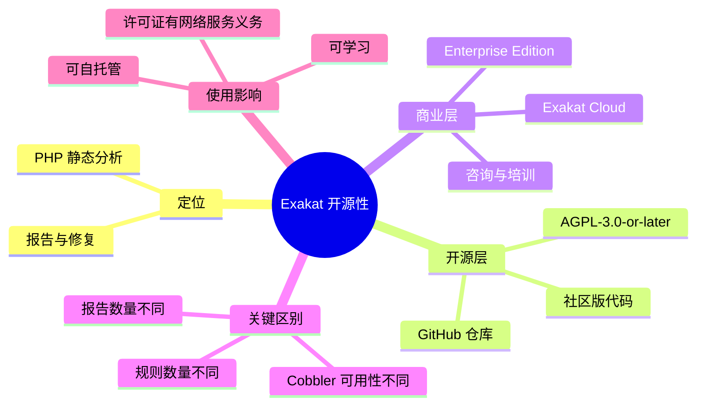

# 记忆卡片摘要（快速复习版）

## 1. 大纲（压缩版）

- Exakat 是什么
- 它到底是不是开源
- 开源的是哪一层
- Community Edition、Enterprise、Cloud 是什么关系
- AGPL 许可证会影响谁
- 为什么官网和仓库里看到的“规则数量”不一样
- 对学习者和工程团队意味着什么

## 2. 思维导图（Mermaid）

## 3. 重要知识点（必须记住）

- Exakat 不是“完全闭源的商业工具”，也不是“所有能力都在开源仓库里”的单体项目，它是“开源内核 + 商业增强版 + SaaS 平台”三层并存的产品。
- 当前 GitHub 仓库 `exakat/exakat-ce` 的 `composer.json` 明确声明许可证为 `AGPL-3.0-or-later`，这说明 Community Edition 的代码是开源软件。[来源1]
- 官网首页强调 Exakat 有 `+1600 RULES`、`+50 COBBLERS`、`+30 REPORTS`，但当前 CE 仓库本地实测 `catalog` 只有 `16 rulesets / 12 reports / 361 rules`。这不是简单矛盾，而是“官方产品总量”和“开源 CE 子集”同时被展示造成的理解错位。[来源2][来源3]
- 官方规则文档大量条目标注 `Available in: Community Edition / Enterprise Edition / Exakat Cloud`，也有很多条目标注仅在 Enterprise 或 Cloud 可用，所以“官方文档能看到”不等于“CE 仓库一定能运行”。[来源4]
- AGPL 与 MIT、Apache 这类宽松许可证不同。它允许你拿到源码学习、修改、部署，但如果你修改后通过网络向他人提供服务，通常要准备好履行 AGPL 对对应源码公开的义务。

## 4. 难点 / 易混点

- “开源”不等于“全部功能都免费可得”。
- “官方文档有这个功能”不等于“Community Edition 里也有这个功能”。
- “SaaS 是商业的”不等于“底层代码一定闭源”。
- “AGPL 是自由软件许可证”不等于“商用完全没有义务”。

## 5. QA 快速复习卡片

- Q: Exakat 是不是开源？
  A: Community Edition 是开源的，许可证是 AGPL-3.0-or-later；但官方整体产品线还包括商业版和云服务。

- Q: 为什么官网说有 1600+ 规则，而我本地 CE 只有几百条？
  A: 官网展示的是整体产品能力，CE 仓库是开源子集，二者不是同一个统计口径。

- Q: 看见官方文档里一条规则，能不能默认我本地 CE 也有？
  A: 不能，必须看该条规则的 `Available in` 字段，或直接用 `catalog`/源码验证。

- Q: AGPL 最需要警惕什么？
  A: 它不是禁止商用，而是对“修改后通过网络向外提供服务”的场景有更强的源码公开义务。

## 6. 快速复现步骤（最短路径）

1. 打开 GitHub 仓库：<https://github.com/exakat/exakat-ce>
2. 查看 `composer.json` 中的 `license` 字段，确认是 `AGPL-3.0-or-later`。[来源1]
3. 查看官网首页，注意 `+1600 RULES / +50 COBBLERS / +30 REPORTS` 的产品级表述。[来源2]
4. 本地运行 `php exakat version` 和 `php exakat catalog`，对比社区版实际暴露的命令、规则和报告数量。[来源3]
5. 在官方规则文档任意打开几条规则，观察 `Available in` 字段，理解“文档全集”和“CE 子集”的差异。[来源4]

---

# 学习笔记正文（详细版）

## 0. 学习目标、读者画像与假设

- 技术：`Exakat`
- 当前主题：`开源性、许可证、产品形态、版本口径`
- 读者水平：默认“知道 GitHub 是什么，但不一定系统学过开源许可证和商业化产品架构”
- 学习目标：读完后，能准确回答“Exakat 到底开不开源、开到哪一层、为什么官网和仓库看起来对不上”
- 版本范围：
  - 当前仓库实测版本：`2.6.7`
  - 当前本地仓库提交：`bbbc4b000c1e51fe06191e8ac5e55501e4cd6253`，提交日期 `2024-04-04`
- 假设与限制：
  - 我优先采信官方仓库、官方文档、官网。
  - 官网市场页和文档页可能混合展示全量产品能力，不等于全部都在 CE 仓库里。

## 1. 背景与用途：为什么先搞清“它是不是开源”

很多人第一次接触 Exakat 时，会产生三种典型困惑：

1. GitHub 上能看到源码，所以直觉上认为“这应该就是完整开源工具”。
2. 官网又在卖 Enterprise 和 Cloud，所以又怀疑“这是不是只是放了个壳子，核心还是闭源”。
3. 官方文档里能看到一大堆规则、报表、Cobbler，于是以为这些能力本地都能直接跑起来，结果真正执行 `catalog` 时只看到一部分。

如果这三件事没分清，后面做任何学习和工程决策都会出问题。比如：

- 你可能会高估 Community Edition 的能力，以为某个官方文档页面上的规则本地一定能用。
- 你可能会低估许可证要求，在公司内部搭了个修改版扫描平台却没意识到 AGPL 带来的义务。
- 你可能会把“官网营销数字”和“开源仓库真实可用功能”混成一个概念，导致选型报告失真。

所以，学 Exakat 的第一步不是命令，而是把“开源边界”讲清楚。

## 2. 先下结论：Exakat 到底是不是开源

短答案：**是，但不是“全部产品能力都在开源仓库里”的那种开源。**

更准确地说：

- `exakat/exakat-ce` 这个 GitHub 仓库是开源的。
- 仓库里的 Community Edition 代码明确使用 `AGPL-3.0-or-later` 许可证。[来源1]
- 官方同时还存在 `Enterprise Edition`、`Exakat Cloud` 和咨询服务，所以 Exakat 不是“只有开源仓库一个交付形态”，而是一个产品家族。[来源2][来源5]

这意味着 Exakat 的正确理解方式不是二选一：

- 不是“它完全闭源”
- 也不是“它所有东西都在开源仓库”

而是：

**它有开源社区版内核，但官方把更完整的规则、报表、Cobbler、云交付和服务能力做成了商业层。**

## 3. 证据链：为什么能说 CE 是开源

### 3.1 GitHub 仓库是公开可访问的

官方 GitHub 仓库入口是：

- <https://github.com/exakat/exakat-ce>

这已经说明至少 Community Edition 的源码是公开的，而不是只发二进制。

### 3.2 仓库元数据明确写了许可证

`composer.json` 中声明：

- `name`: `exakat/exakat`
- `license`: `AGPL-3.0-or-later`[来源1]

这一点很关键。很多项目只是“公开源码”，但没有明确许可证；那种情况下法律上未必算你能自由使用。Exakat 不是那样。它给了一个标准自由软件许可证，这就不是“只供参考阅读”的源码，而是真正有许可证授权边界的开源软件。

### 3.3 源码头部注释也重复声明了 AGPL

像 `library/Exakat/Exakat.php`、`Analyzer.php` 等核心文件的头部注释都写明：

- Exakat is free software
- 可在 GNU Affero General Public License 下再发布和修改

这说明 AGPL 并不是 `composer.json` 随手填的字符串，而是项目整体法律意图的一部分。[来源6]

## 4. 但为什么很多人会误以为它“不是完全开源”

因为官方同时运营三条线：

### 4.1 Community Edition

这是你在 GitHub 上直接能拿到的开源代码。它适合：

- 学习 Exakat 的架构
- 本地自托管
- 研究 Analyzer DSL
- 跑一部分社区版规则与报告
- 做自己的二次开发和实验

### 4.2 Enterprise Edition

官方大量规则文档、Cobbler 文档、报告文档里会标注 `Available in: Entreprise Edition`。这说明 Exakat 的很多高阶能力并不全部进入 CE，而是保留在企业版中。[来源4][来源7][来源8]

### 4.3 Exakat Cloud

官网还提供云服务，也就是你不用本地完整部署图数据库和项目管理目录，直接把项目交给官方平台来分析。[来源5]

对非科班读者来说，可以把它理解成：

- GitHub 仓库像“本地可安装的社区版发动机”
- Enterprise 像“加了更多传感器、仪表盘和高级配件的商用整车”
- Cloud 像“官方代驾服务”，你不自己维护整套设施，直接买结果

这个类比只是帮助入门，真实机制还是要回到软件分发边界：

- CE：开源代码交付
- Enterprise：增值商业功能交付
- Cloud：服务交付

## 5. AGPL 到底意味着什么

这是最容易被忽视、也最容易说错的部分。

### 5.1 先说最直白版本

AGPL 不是“不许商用”，而是“允许你用、改、部署，但如果你改了它，并通过网络把这个修改版服务提供给别人使用，通常需要向那些用户提供对应源码”。

如果你只是：

- 本地学习
- 公司内部自己跑，不向外部用户提供服务
- 不修改 Exakat 本身，只把它当工具用

通常风险理解会简单很多。

但如果你是：

- 把 Exakat 改造成公司对外的在线审计平台
- 修改了规则引擎或 Web 层
- 让外部客户通过网络访问你改过的 Exakat 服务

那就要认真让法务或开源合规同事评估 AGPL 的触发义务。

### 5.2 为什么 Exakat 用 AGPL 而不是 MIT

从产品策略上看，这很合理。

Exakat 的商业价值，不只在“能跑”，还在：

- 规则积累
- 持续维护
- 云服务
- 企业功能
- 顾问经验

AGPL 能保护开源核心不被别人轻松拿去做成闭源在线服务而完全不回馈。对一个“天然适合做在线扫描平台”的项目来说，这个许可证选择是有商业逻辑的。

### 5.3 对学习者的现实影响

如果你目前只是学习和自用，最重要的不是背法律条文，而是记住三句话：

1. 它是开源的，不是私有黑盒。
2. 它不是宽松许可证项目，不能像 MIT 项目那样什么都不想就拿去改成对外 SaaS。
3. 一旦涉及“修改后通过网络对外提供服务”，就必须做合规评估。

## 6. 为什么官网、文档、仓库三边看起来会“打架”

这是 Exakat 学习中最重要的认知坑之一。

### 6.1 官网展示的是“产品全量能力”

官网首页写的是：

- `+1600 RULES`
- `+50 COBBLERS`
- `+30 REPORTS`[来源2]

这种写法是市场视角。它在回答的是“Exakat 整个产品家族能提供多强的能力”。

### 6.2 当前 CE 仓库暴露的是“社区版可用子集”

我本地实测当前仓库：

- `php /tmp/exakat-ce/exakat version` 输出 `2.6.7`
- `php /tmp/exakat-ce/exakat catalog` 输出：
  - `16 rulesets`
  - `12 reports`
  - `361 rules`[来源3]

这说明你本地真正能直接调用的 CE 子集，比官网总量小很多。

### 6.3 官方规则文档展示的是“统一文档全集”

官方规则文档和规则集文档经常写：

- `Exakat provides unique 1432 rules`
- 或最新线上页面片段里出现 `1661 rules`
- 规则条目中再分别标注 `Available in Community Edition / Enterprise Edition / Exakat Cloud`[来源4][来源9]

这说明官方文档更像“产品能力总目录”，不是单独为 CE 裁切的一份小册子。

### 6.4 所以真正正确的裁决方法是什么

当三边出现差异时，建议按下面优先级理解：

1. **能不能在你当前环境里跑**：先看 CE 仓库源码与 `catalog` 实测。
2. **官方如何定义这个能力**：再看规则/报表文档里的 `Available in` 字段。
3. **官方整体宣传口径**：最后看官网市场页。

也就是说：

- 官网告诉你“全家桶大概有多强”
- 文档告诉你“某能力理论上属于哪个版本”
- 本地源码和 CLI 告诉你“你手里这份 CE 现在到底能干什么”

## 7. Community Edition、Enterprise、Cloud 的关系，怎么用一句话讲清

你可以这样说：

**Exakat 是一个以开源 CE 为基础、再叠加企业增强版和云服务的 PHP 静态分析产品体系。**

这句话的好处是同时避免两种极端误解：

- 避免把它说成完全闭源商业软件
- 也避免把它说成“官方文档上的所有功能都天然属于开源版”

## 8. 对工程团队的实际意义

### 8.1 选型时

你要先问的不是“它是不是开源”，而是：

- 我们需要的规则和报告，在 CE 里够不够？
- 我们能不能接受 AGPL？
- 我们是否要做对外扫描平台？
- 我们是否需要官方支持和增值规则？

### 8.2 预算时

如果只是：

- 内部项目扫描
- 学习 Analyzer DSL
- 做一条基础安全审计流水线

CE 可能已经很有价值。

如果你需要：

- 更丰富的规则库
- 更强的 Cobbler 自动修复
- 更完整的可视化报告
- 更少的自维护成本

那就要认真评估 Enterprise 或 Cloud。

### 8.3 培训时

培训材料必须一开始就告诉团队：

- “官方文档看到”不等于“本地 CE 一定可用”
- 数量统计要分“产品总量”和“社区版子集”
- 许可证不是装饰项

## 9. 给非科班读者的最终直白总结

如果你完全不想记那些术语，只记下面这段也够用：

Exakat 有一份真正开源的社区版代码，放在 GitHub 上，许可证是 AGPL。你可以下载、学习、运行、修改它，这说明它不是黑盒闭源工具。但 Exakat 官方又不只卖这一份代码，他们还做企业增强版和云服务，所以官网展示的功能总量会比你本地开源版多。于是你会看到一个很常见的现象：官网和文档里写 1600 多条规则、几十个报表和 Cobbler，可你本地 CE 执行 `catalog` 只看到几百条规则和少量报表。这不是谁错了，而是你在同时看“产品全景”和“社区子集”。真正做工程时，要以当前源码和 CLI 实测为准，再拿官方文档确认某功能属于哪个版本。

## 10. 延伸学习路径（官方优先）

- 先读：GitHub 仓库首页与 `composer.json`，先把许可证和版本边界看明白。
- 再读：官方文档里的 `Rules`、`Rulesets`、`Reports`、`Cobblers` 页面，观察每条能力的 `Available in` 字段。
- 再做：本地执行 `version`、`help`、`catalog`，亲手感受 CE 暴露出来的能力范围。
- 进阶：再去看官网的 Enterprise / Cloud 页面，理解 Exakat 的商业化分层。

---

# 练习与复习闭环

## 1. 分层练习

### 基础练习

- 说明“开源”和“免费”为什么不是一回事。
- 解释 AGPL 与 MIT 在使用体验上的直观差异。
- 用一句话描述 CE、Enterprise、Cloud 三者关系。

### 应用练习

- 打开一条你感兴趣的官方规则文档，找出它的 `Available in` 字段，判断该规则是否一定在 CE 中可用。
- 本地执行 `catalog`，把 CE 的规则数、规则集数、报告数记下来，再和官网数字做对比，写出一段 150 字解释。

### 综合练习

- 以“某公司要搭内部 PHP 安全审计平台”为题，写一份 300 字建议，说明什么时候 CE 足够，什么时候应考虑 Enterprise/Cloud。

## 2. 动手任务（带验收标准）

- 任务：做一张“Exakat 产品边界图”。
- 验收标准：
  - 必须包含 `CE / Enterprise / Cloud / 官方文档 / 官网营销页 / 本地 CLI 实测` 六个元素。
  - 必须明确写出“数量口径不同”的原因。
  - 必须单独标注 `AGPL`。

## 3. 常见误区纠偏

- 误区：GitHub 上有源码，所以官网里所有功能我都能直接用。
  正解：源码公开只说明 CE 开源，不说明官方全部能力都在 CE。

- 误区：商业版存在，所以这个项目不算开源。
  正解：存在商业版和是否开源并不矛盾，关键看开源代码和许可证是否真实存在。

- 误区：AGPL 就等于不能商用。
  正解：AGPL 不等于禁止商用，它强调的是再分发和网络服务场景下的源码义务。

## 4. 复习节奏建议

- Day 1：记住“开源子集 vs 产品全量”的区分。
- Day 3：再看一次 `catalog` 输出和官网首页数字。
- Day 7：复述 AGPL 对在线服务的影响。
- Day 14：尝试把这套解释讲给没接触过开源许可证的同事听。

## 5. 自测题与参考答案（简版）

- 题目1：Exakat 是不是开源？
  参考答案：Community Edition 是开源的，许可证是 AGPL-3.0-or-later，但整体产品线还包含商业版和云服务。

- 题目2：为什么官方文档规则很多，而 CE 本地更少？
  参考答案：官方文档展示的是统一产品文档全集，而 CE 仓库和 `catalog` 只反映社区版当前可用子集。

- 题目3：判断某条功能是不是 CE 可用，最可靠的顺序是什么？
  参考答案：先看本地源码和 CLI 实测，再看官方文档中的 `Available in` 字段，最后才参考官网营销数字。

---

# 参考来源与版本说明

## 官方来源（优先）

1. [exakat/exakat-ce GitHub 仓库](https://github.com/exakat/exakat-ce) - 访问日期：2026-03-28 - 官方源码入口
2. [Exakat 官网首页](https://www.exakat.io/) - 访问日期：2026-03-28 - 官方产品总量和产品线表述
3. [Exakat 官方规则文档](https://exakat.readthedocs.io/en/latest/Reference/Rules.html) - 访问日期：2026-03-28 - 官方规则全集与 `Available in` 字段
4. [Exakat 官方规则集文档](https://exakat.readthedocs.io/en/latest/Reference/Rulesets.html) - 访问日期：2026-03-28 - 规则集总览
5. [Exakat 官方 Cobbler 文档](https://exakat.readthedocs.io/en/latest/Reference/Cobblers.html) - 访问日期：2026-03-28 - 修复器全集与版本归属

## 第三方来源（按采信程度标注）

- 本文未依赖第三方非官方来源做关键结论裁决。

## 关键结论引用映射

- [来源1] GitHub 仓库中的 `composer.json`：许可证为 `AGPL-3.0-or-later`
- [来源2] 官网首页：展示产品总量 `+1600 RULES / +50 COBBLERS / +30 REPORTS`
- [来源3] 本地实测 `php /tmp/exakat-ce/exakat catalog`：CE 当前暴露 `16 rulesets / 12 reports / 361 rules`
- [来源4] 官方 `Rules` 文档：单条规则存在 `Available in` 字段，显示具体版本归属
- [来源5] 官网与文档平台入口：同时存在 CE、Enterprise、Cloud 叙述
- [来源6] 核心源码头部注释：再次声明 GNU Affero GPL
- [来源7] `Reference/Cobblers` 文档：大量 Cobbler 标记为 Enterprise Edition
- [来源8] `Reference/Reports` 文档：不同报告存在版本可用性差异
- [来源9] 线上规则集/规则页：官方文档展示的规则总量大于当前 CE `catalog`

## 官方文档章节映射与重要例子保留

- 官网首页产品数字 -> 本文第 6 节“官网、文档、仓库三边为何打架”
- GitHub 仓库许可证 -> 本文第 3 节“证据链”
- 规则文档的 `Available in` -> 本文第 4 节和第 6 节
- Cobbler 文档版本归属 -> 本文第 4 节

## 冲突点与裁决

- 冲突点：官网显示 `1600+` 规则，而 CE 本地 `catalog` 只有 `361`。
- 来源A：官网首页，产品总量口径。[来源2]
- 来源B：当前 CE 仓库本地实测 `catalog`，社区版当前可用口径。[来源3]
- 差异原因判断：官网展示整体产品族能力；CE 仓库只包含开源社区子集。
- 本文采用结论：两者都是真的，但统计口径不同，不能混用。

## 技术版本与访问日期

- Exakat CE 本地实测版本：`2.6.7`
- 实测日期：`2026-03-28`
- 本地提交：`bbbc4b000c1e51fe06191e8ac5e55501e4cd6253`

