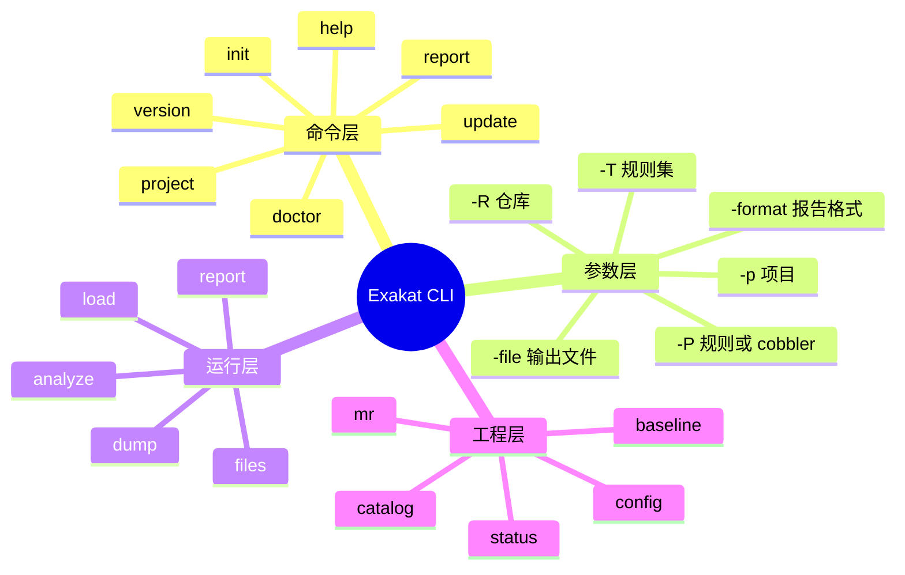

# 记忆卡片摘要（快速复习版）

## 1. 大纲（压缩版）

- Exakat CLI 的三层结构
- 当前源码里到底有哪些命令
- 公共参数和命令专属参数
- 用户最常用的工作流命令
- 高级/内部命令该怎么看
- 参数冲突、优先级、常见坑
- 面向工程实践的推荐用法

## 2. 思维导图（Mermaid）



## 3. 重要知识点（必须记住）

- 当前源码入口 `library/Exakat/Exakat.php` 暴露的命令比官方命令文档列得更多，说明“命令文档”偏向终端用户，而“源码命令集”还包含高级或内部工作流命令。[来源1][来源2]
- 参数解析由 `library/Exakat/Configsource/CommandLine.php` 统一处理，分成两大类：
  - 布尔型开关，如 `-v`、`-q`、`-json`
  - 取值型参数，如 `-p`、`-R`、`-T`、`-P`、`-format`。[来源3]
- `-T` 主要表示规则集（ruleset），`-P` 则在不同上下文下复用为“单条 analyzer”或“cobbler 名称”，所以阅读命令时必须结合具体子命令看语义。[来源3][来源4]
- 对普通用户来说，最重要的命令不是 `analyze`、`load`、`dump`，而是 `init -> project -> report -> update -> project` 这条高层工作流。[来源5][来源6]
- 当前本地实测 `version`、`help`、`catalog` 已可正常执行，说明 CE 仓库至少有一部分 CLI 可以在未完整安装图数据库前工作；但 `project`、`analyze`、`dump` 这类命令依赖 Gremlin/Tinkergraph 或 Neo4j 支撑。[来源7][来源8]

## 4. 难点 / 易混点

- 官方命令文档没有完全覆盖源码暴露的所有命令。
- `project` 不是“只做分析”，它是一个总控命令。
- `report` 可以后生成，但前提是之前跑过所需规则集。
- `catalog` 列出来的是“当前环境实际可用能力”，不是官网总能力。
- `-T` 和 `-P` 常被初学者搞混。

## 5. QA 快速复习卡片

- Q: 最常用的 Exakat 命令链是什么？
  A: `init` 建项目，`project` 跑整轮审计，`report` 补导出报告，`update` 更新代码后再 `project`。

- Q: `project` 和 `analyze` 有什么区别？
  A: `project` 是完整流水线总控，`analyze` 更像其中的分析阶段。

- Q: `-T` 和 `-P` 分别干什么？
  A: `-T` 主要指定规则集；`-P` 指定单条 analyzer，或在 `cobble` 场景里指定 cobbler。

- Q: 文档里没有写到的命令能不能用？
  A: 可能能，但要把它们视作高级/内部命令，优先以源码和实测为准，不要直接套用面向普通用户的教程。

## 6. 快速复现步骤（最短路径）

1. 执行 `php /tmp/exakat-ce/exakat version`，确认当前版本是 `2.6.7`。[来源7]
2. 执行 `php /tmp/exakat-ce/exakat help`，确认最基础命令入口和文档链接。[来源7]
3. 执行 `php /tmp/exakat-ce/exakat catalog` 或 `catalog -json`，查看当前 CE 实际暴露的规则集、报告和规则数量。[来源7]
4. 打开 `library/Exakat/Exakat.php`，确认源码层真正支持的命令列表。[来源1]
5. 打开 `library/Exakat/Configsource/CommandLine.php`，确认参数映射表。[来源3]

---

# 学习笔记正文（详细版）

## 0. 学习目标、读者画像与假设

- 技术：`Exakat CLI`
- 学习目标：把“我到底该敲哪些命令、每个参数干嘛、哪些属于高级命令、官方文档和当前源码哪里不一致”讲清楚
- 读者水平：默认会基本命令行，不假设懂编译原理、图数据库、PHP 静态分析内部实现
- 版本范围：
  - 当前本地可执行入口：`/tmp/exakat-ce/exakat`
  - 当前实测版本：`2.6.7`
- 假设与限制：
  - 我优先把“普通用户工作流”和“源码暴露的高级命令”拆开讲，避免混淆。

## 1. 先建立整体观：Exakat CLI 不是一堆零散命令，而是三层结构

如果你直接看命令列表，会觉得 Exakat 很杂：有 `init`、`project`、`report`，也有 `files`、`load`、`dump`，还有 `baseline`、`catalog`、`mr`、`status`。  
其实更好理解的方式，是把它分成三层。

### 1.1 第一层：面向普通用户的“高层工作流命令”

这些命令最像产品功能入口：

- `version`
- `help`
- `doctor`
- `init`
- `project`
- `report`
- `update`
- `remove`
- `clean`
- `catalog`
- `status`
- `baseline`
- `config`
- `show`

如果你只是想“拿 Exakat 扫一个 PHP 项目”，主要就靠这一层。

### 1.2 第二层：面向高级用户或内部流水线的“阶段命令”

这些命令更像总流水线中的分阶段环节：

- `files`
- `load`
- `analyze`
- `dump`
- `results`
- `export`

它们不是没用，而是更接近 Exakat 内部执行阶段。普通用户很多时候不需要手动拆着跑，因为 `project` 已经帮你串好了。

### 1.3 第三层：偏维护、实验、特定场景的命令

- `cobble`
- `testcobble`
- `test`
- `mr`
- `upgrade`
- `install`
- `cleandb`
- `anonymize`

这一层要么是修复器、要么是安装维护、要么是特殊比较场景，不适合作为入门第一步。

## 2. 当前源码真正支持哪些命令

### 2.1 以源码为准的命令全集

`library/Exakat/Exakat.php` 当前 `switch` 中暴露的命令包括：[来源1]

- `cobble`
- `testcobble`
- `doctor`
- `init`
- `anonymize`
- `files`
- `load`
- `stat`
- `catalog`
- `analyze`
- `results`
- `mr`
- `export`
- `report`
- `project`
- `clean`
- `status`
- `help`
- `cleandb`
- `update`
- `dump`
- `test`
- `remove`
- `upgrade`
- `baseline`
- `config`
- `show`
- `install`
- `version`

### 2.2 为什么官方命令文档列得更少

官方命令文档主要列出：

- `anonymize`
- `baseline`
- `catalog`
- `clean`
- `cleandb`
- `cobble`
- `doctor`
- `help`
- `init`
- `project`
- `report`
- `remove`
- `show`
- `update`
- `upgrade`
- `install`[来源2]

你会发现它没展开讲：

- `files`
- `load`
- `analyze`
- `dump`
- `results`
- `export`
- `status`
- `config`
- `mr`
- `test`

这不是说这些命令不存在，而更像是在官方文档的设计里，它们被视为高级用法、内部阶段，或尚未完整面向普通用户文档化。

### 2.3 实际使用时怎么裁决

我的建议是：

- 初学者：优先按官方命令文档学。
- 进阶用户：遇到文档没有但源码有的命令，视为“高级命令”，一定要结合任务类源码一起看。
- 写团队文档时：必须明确标注“这是官方文档支持命令”还是“这是源码暴露但文档未充分展开的高级命令”。

## 3. 参数系统：Exakat 的 CLI 参数是怎么被解析的

### 3.1 统一入口

参数解析在 `library/Exakat/Configsource/CommandLine.php` 中统一完成。[来源3]

它做的事很像一个中心路由：

- 把 `-v` 这类开关变成布尔配置
- 把 `-p demo` 这类参数变成带值配置
- 再把第一个位置参数识别成命令，比如 `project`

### 3.2 布尔型参数

当前源码里重要的布尔型参数包括：[来源3]

- `-v`：详细输出，verbose
- `-Q`：quick。用于 `cleandb` 时表示快速重建/重启式清理
- `-q`：静默模式
- `-h`：帮助
- `-r`：递归
- `-u`：执行升级动作
- `-D`：删除已有项目后重建
- `-l`：lint
- `-json`：JSON 输出
- `-yaml`：YAML 输出
- `-array`、`-dot`：特殊输出格式开关
- `-debug`：调试
- `--inplace`：原地写回
- `-nodep` / `--nodep`：忽略依赖
- `-norefresh` / `--norefresh`：不刷新已分析结果
- `-text` / `--text`：文本输出
- `-o`：输出到标准输出
- `-collect`：收集模式，常见于 dump
- `-load-dump` / `--load-dump`：加载 dump
- `-stop` / `-start` / `-restart` / `-ping`：图数据库服务控制
- VCS/源代码来源开关：
  - `-git`
  - `-svn`
  - `-hg`
  - `-bzr`
  - `-composer`
  - `-copy`
  - `-symlink`
  - `-tgz`
  - `-tbz`
  - `-zip`
  - `-rar`
  - `-7z`
  - `-cvs`
  - `-none`

### 3.3 取值型参数

重要的取值型参数包括：[来源3]

- `-p <project>`：项目名
- `-R <repository>`：仓库地址或源代码来源
- `-T <ruleset>`：规则集
- `-P <program>`：单条 analyzer，或 cobbler 名
- `-f <filename>`：文件名
- `-d <dirname>`：目录名
- `-report <report>` / `--report`
- `-format <format>` / `--format`
- `-file <file>` / `--file`
- `-style <style>`
- `-token_limit <n>`
- `-branch <branch>`
- `-tag <tag>`
- `-remote <remote>`
- `-graphdb <driver>`
- `-version <ver>`
- `--parallel <n>`
- `-baseline-set <name>`
- `-baseline-use <name>`
- `--rules-version-max <ver>`
- `--rules-version-min <ver>`
- `--logFile <path>`
- `-c key=value`：配置项覆盖
- `-C key=value`：directives，常用于规则参数定制

### 3.4 最容易混淆的两个参数：`-T` 和 `-P`

这是入门最容易踩的坑。

- `-T` 基本可以理解成“跑一组规则”，也就是 ruleset。
- `-P` 基本可以理解成“跑一个具体对象”，但这个对象在不同命令里不同：
  - 对 `analyze`、`report`、`results` 来说，通常是具体 analyzer。
  - 对 `cobble` 来说，是 cobbler 名称。[来源4]

所以别死背“`-P` 就是程序名”。更准确的理解是：  
**`-P` 在 Exakat 里表示一个更细粒度的“执行单元”。**

## 4. 普通用户最该掌握的命令

## 4.1 `version`

作用：输出当前 Exakat 版本、构建号和构建时间。[来源1][来源7]

实测：

- `php /tmp/exakat-ce/exakat version`
- 输出版本 `2.6.7`

适合场景：

- 确认当前二进制/源码版本
- 团队排查“为什么命令行为不一致”
- 写审计报告时固定工具版本

## 4.2 `help`

作用：输出最基础用法提示和文档链接。[来源9][来源7]

实测帮助文本比较短，只列：

- `version`
- `doctor`
- `init -p <Project name> -R <Repository>`
- `project -p <Project name>`

这说明 `help` 更像欢迎页，不是完整参考手册。

## 4.3 `doctor`

作用：检查当前安装环境，包括 PHP、Java、图数据库、辅助工具等。[来源2]

你可以把它理解成“体检命令”。

常见用途：

- 新安装后确认环境是否齐
- CI 镜像构建完做验收
- 排查为什么 `project` 跑不起来

关键参数：

- `-p`：显示项目级配置
- `-json`：机器可读输出
- `-v`：更详细
- `-q`：静默检查

## 4.4 `init`

作用：初始化一个 Exakat 项目目录，把目标代码引入到 `projects/<project>/code` 下，或建立复制/符号链接/解压后的工作目录。[来源2][来源5]

最重要参数：

- `-p`：项目名，必填
- `-R`：仓库 URL、归档 URL 或本地路径
- `-git` / `-svn` / `-hg` / `-composer` / `-copy` / `-symlink` / `-zip` / `-tgz` / `-tbz` / `-rar` / `-7z`
- `-D`：若同名项目已存在，先删除再重建
- `-v`：详细输出

初学者记忆法：

- `-p` 决定“Exakat 内部怎么叫这个项目”
- `-R` 决定“源代码从哪里来”
- 具体 VCS/归档开关决定“怎么取代码”

## 4.5 `project`

这是最重要的命令。  
它不是单一步骤，而是**总流水线命令**。

根据 `library/Exakat/Tasks/Project.php`，它会大致做这些事：[来源6]

1. 校验项目
2. 清理旧产物
3. 扫描文件 `files`
4. 清理图数据库 `cleandb`
5. 加载代码到图数据库 `load`
6. 先跑 `First` 规则集
7. 做第一次 `dump`
8. 跑你指定的规则集或 analyzer
9. 再 `dump`
10. 生成报告 `report`

所以当你执行：

```bash
php exakat.phar project -p demo
```

你实际上是在触发一整套完整审计流程。

这也是为什么我前面说：普通用户没必要先学 `load`、`analyze`、`dump`，因为 `project` 已经帮你编排好了。

## 4.6 `report`

作用：在已有分析结果基础上导出指定格式报告。[来源2][来源10]

关键参数：

- `-p <project>`
- `-format <Format>`
- `-file <file>`
- `-T <ruleset>`：导出某个规则集结果
- `-P <analyzer>`：导出某条分析结果

注意两点：

1. `report` 不会凭空制造缺失分析结果。
2. 你能否成功导出某个报告，取决于之前的审计是否已跑过该报告依赖的规则集。

对非科班读者来说，可以把 `report` 理解成：

- `project` 像“先做一次全面检查并存档”
- `report` 像“拿这份存档换一种视图输出”

## 4.7 `update`

作用：更新项目代码，然后你再重新 `project`。[来源2][来源11]

它不是重新分析，它只是把代码工作副本更新到最新状态。

典型组合：

```bash
php exakat.phar update -p demo
php exakat.phar project -p demo
```

如果项目不是通过 VCS/归档方式维护，而是你手动替换代码，那么 `update` 的意义就有限。

## 4.8 `catalog`

作用：列出当前环境可用的：

- 规则集
- 报告
- 规则[来源2][来源12]

它特别有价值，因为它告诉你的不是“官方理论全量”，而是“你手里这份 Exakat 当前实际暴露出来的能力”。

本地实测当前 CE：

- `16 rulesets`
- `12 reports`
- `361 rules`[来源7]

如果你想确认某个规则到底在不在当前 CE 里，`catalog` 比官网营销页更可靠。

## 4.9 `status`

作用：查看当前项目状态、统计、已生成格式等。[来源13]

它适合：

- 看项目有没有初始化完
- 看已经生成了哪些报告
- 看是否仍在执行中
- 看文件数、LOC、分支、revision

这是一个很适合接入脚本和运维排查的命令。

## 4.10 `baseline`

作用：管理“基线审计”。[来源2][来源14]

它支持三个子动作：

- `list`
- `remove`
- `save`

为什么有用？

因为漏洞扫描和代码质量治理通常不是一次性清零，而是“先固定当前债务，再看新增问题”。  
`baseline` 就是在帮助你把“老问题”和“新问题”区分开。

## 5. 高级命令：你需要知道它们存在，但别一上来就依赖它们

## 5.1 `files`

作用：扫描目标代码树，筛选文件、去重、检查编译兼容、记录配置文件等。[来源15]

你可以把它理解成“分析前的数据收集和文件入库阶段”。

## 5.2 `load`

作用：把 PHP 源码解析后装入图数据库，包括 AST 节点、链接关系、上下文信息等。[来源16]

这是 Exakat 静态分析真正重度的部分之一。

## 5.3 `analyze`

作用：按 ruleset 或 analyzer 列表真正执行规则，并处理依赖关系。[来源17]

这也是为什么 `-nodep`、`--rules-version-max` 这类参数存在的原因。

## 5.4 `dump`

作用：把图数据库中的分析结果整理后写入 SQLite dump，用于后续报告和查询。[来源18]

如果只记一句话：  
`analyze` 负责在图上找问题，`dump` 负责把结果整理成报表可用的数据。

## 5.5 `results`

作用：按 analyzer 或 ruleset 查询结果，可输出不同风格，如全部结果、去重结果、计数结果。[来源19]

这更像“高级结果查询工具”，适合脚本化处理。

## 5.6 `export`

作用：把图或修复结果导出成 `Php`、`Dot`、`Vis`、`Table` 等格式，也服务于 Cobbler 工作流。[来源20]

如果你在做自动修复或结构导出，这个命令会很重要；否则普通审计场景一般不先学它。

## 5.7 `mr`

作用：对两个分支做连续分析和存档，面向 merge request / branch comparison 场景。[来源21]

它反映了 Exakat 想支持“分支差异审计”这类工程化需求，但这个命令显然比普通入门复杂很多。

## 6. 参数优先级和配置来源

官方 `User/Configuration` 文档给出优先级顺序：[来源22]

1. 命令行参数
2. 代码根目录的 `.exakat.ini` 或 `.exakat.yaml`
3. 环境变量
4. 项目目录 `config.ini`
5. 全局 `config/exakat.ini`
6. 代码默认值

这意味着一个特别重要的工程结论：

**命令行是临时覆盖层，项目配置文件才是可持续团队协作层。**

也就是说：

- 临时试验：用命令行
- 长期规则：写进 `.exakat.yaml` 或项目配置

## 7. 最常见的 CLI 误区

### 7.1 把 `project` 当成“只做 analyze”

错。它是总流水线。

### 7.2 把官方命令文档当成源码全部命令列表

错。文档是面向普通用户的裁剪版。

### 7.3 认为 `report` 可以补出所有想要的结果

错。前提是之前已经跑过所需规则集。

### 7.4 忘记 `-T` 与 `-P` 的语义会随命令变化

错。必须结合具体命令看。

### 7.5 只看官网，不看 `catalog`

错。工程上判断可用性，要优先看当前环境 `catalog`。

## 8. 给非科班读者的最简工作流

如果你现在只想“把 Exakat 用起来”，请先记这五步：

1. `doctor`：看环境是不是齐。
2. `init -p 项目名 -R 仓库地址`：把代码引进来。
3. `project -p 项目名`：跑整轮审计。
4. `report -p 项目名 -format Text`：补导出你想要的结果。
5. 代码更新后：`update -p 项目名` 再 `project -p 项目名`。

等你熟悉以后，再去学：

- `catalog`
- `baseline`
- `status`
- `results`
- `export`

## 9. 延伸学习路径（官方优先）

- 先读：官方命令文档 `Administrator/Commands`
- 再读：`Gettingstarted/Bare` 和 `Gettingstarted/Docker`
- 再看：`User/Configuration`
- 进阶：直接读 `Tasks/Project.php`、`Tasks/Analyze.php`、`Tasks/Dump.php`

---

# 练习与复习闭环

## 1. 分层练习

### 基础练习

- 说出 `init`、`project`、`report` 三个命令各自负责什么。
- 解释 `-T` 和 `-P` 的差异。
- 解释为什么 `catalog` 比官网更适合确认当前 CE 可用能力。

### 应用练习

- 写一条命令初始化一个 GitHub 上的 PHP 项目。
- 写一条命令导出指定项目的 Text 报告。
- 写一段话解释为什么 `project` 结束后还可能继续手动执行 `report`。

### 综合练习

- 设计一套团队最小工作流：首次扫描、定期更新、报告导出、基线保存。

## 2. 动手任务（带验收标准）

- 任务：写一张 Exakat CLI 速查表。
- 验收标准：
  - 必须分出“普通用户命令”和“高级命令”。
  - 必须说明 `project` 是总流水线。
  - 必须列出 `-p`、`-R`、`-T`、`-P`、`-format`、`-file` 六个核心参数。

## 3. 常见误区纠偏

- 误区：`report` 是分析命令。
  正解：`report` 是结果导出命令，依赖之前已有分析结果。

- 误区：`catalog` 只是文档展示。
  正解：它实际反映当前环境可用规则集、规则和报告。

- 误区：所有源码暴露命令都适合初学者直接上手。
  正解：很多是高级/内部阶段命令，先学高层命令更稳。

## 4. 复习节奏建议

- Day 1：记住 `init -> project -> report -> update -> project`
- Day 3：复习参数层，重点是 `-p / -R / -T / -P`
- Day 7：复习高级命令与总流水线关系
- Day 14：尝试自己解释 `project` 内部做了哪些步骤

## 5. 自测题与参考答案（简版）

- 题目1：为什么说 `project` 是总控命令？
  参考答案：因为它会串联文件扫描、清库、加载、分析、dump 和报告生成，而不是只做单一步骤。

- 题目2：什么时候用 `catalog`？
  参考答案：确认当前环境实际可用的规则集、规则和报告时。

- 题目3：`-P` 的语义为什么不能脱离命令理解？
  参考答案：因为它在分析场景表示 analyzer，在 `cobble` 场景又表示 cobbler 名称。

---

# 参考来源与版本说明

## 官方来源（优先）

1. [Exakat 源码命令分发入口 `library/Exakat/Exakat.php`](https://github.com/exakat/exakat-ce/blob/master/library/Exakat/Exakat.php) - 访问日期：2026-03-28
2. [官方命令文档](https://exakat.readthedocs.io/en/latest/Administrator/Commands.html) - 访问日期：2026-03-28
3. [源码参数解析 `library/Exakat/Configsource/CommandLine.php`](https://github.com/exakat/exakat-ce/blob/master/library/Exakat/Configsource/CommandLine.php) - 访问日期：2026-03-28
4. [官方 Cobbler 用户文档](https://exakat.readthedocs.io/en/latest/User/Cobbler.html) - 访问日期：2026-03-28
5. [官方 Bare Metal 教程](https://exakat.readthedocs.io/en/latest/Gettingstarted/Bare.html) - 访问日期：2026-03-28
6. [项目总流水线源码 `library/Exakat/Tasks/Project.php`](https://github.com/exakat/exakat-ce/blob/master/library/Exakat/Tasks/Project.php) - 访问日期：2026-03-28
7. 本地实测 CLI：`version`、`help`、`catalog`、`catalog -json` - 实测日期：2026-03-28
8. [官方安装文档](https://exakat.readthedocs.io/en/latest/Administrator/Installation.html) - 访问日期：2026-03-28
9. [帮助命令源码 `library/Exakat/Tasks/Help.php`](https://github.com/exakat/exakat-ce/blob/master/library/Exakat/Tasks/Help.php) - 访问日期：2026-03-28
10. [官方 Report 用户文档](https://exakat.readthedocs.io/en/latest/User/Report.html) - 访问日期：2026-03-28
11. [源码 `library/Exakat/Tasks/Update.php`](https://github.com/exakat/exakat-ce/blob/master/library/Exakat/Tasks/Update.php) - 访问日期：2026-03-28
12. [源码 `library/Exakat/Tasks/Catalog.php`](https://github.com/exakat/exakat-ce/blob/master/library/Exakat/Tasks/Catalog.php) - 访问日期：2026-03-28
13. [源码 `library/Exakat/Tasks/Status.php`](https://github.com/exakat/exakat-ce/blob/master/library/Exakat/Tasks/Status.php) - 访问日期：2026-03-28
14. [源码 `library/Exakat/Tasks/Baseline.php`](https://github.com/exakat/exakat-ce/blob/master/library/Exakat/Tasks/Baseline.php) - 访问日期：2026-03-28
15. [源码 `library/Exakat/Tasks/Files.php`](https://github.com/exakat/exakat-ce/blob/master/library/Exakat/Tasks/Files.php) - 访问日期：2026-03-28
16. [源码 `library/Exakat/Tasks/Load.php`](https://github.com/exakat/exakat-ce/blob/master/library/Exakat/Tasks/Load.php) - 访问日期：2026-03-28
17. [源码 `library/Exakat/Tasks/Analyze.php`](https://github.com/exakat/exakat-ce/blob/master/library/Exakat/Tasks/Analyze.php) - 访问日期：2026-03-28
18. [源码 `library/Exakat/Tasks/Dump.php`](https://github.com/exakat/exakat-ce/blob/master/library/Exakat/Tasks/Dump.php) - 访问日期：2026-03-28
19. [源码 `library/Exakat/Tasks/Results.php`](https://github.com/exakat/exakat-ce/blob/master/library/Exakat/Tasks/Results.php) - 访问日期：2026-03-28
20. [源码 `library/Exakat/Tasks/Export.php`](https://github.com/exakat/exakat-ce/blob/master/library/Exakat/Tasks/Export.php) - 访问日期：2026-03-28
21. [源码 `library/Exakat/Tasks/Mr.php`](https://github.com/exakat/exakat-ce/blob/master/library/Exakat/Tasks/Mr.php) - 访问日期：2026-03-28
22. [官方配置文档](https://exakat.readthedocs.io/en/latest/User/Configuration.html) - 访问日期：2026-03-28

## 第三方来源（按采信程度标注）

- 本文未依赖第三方非官方来源做关键结论裁决。

## 关键结论引用映射

- [来源1] 当前源码命令全集
- [来源2] 官方用户命令文档
- [来源3] 当前参数映射表
- [来源4] `cobble` 场景下 `-P` 的语义
- [来源5] 面向用户的标准使用流程
- [来源6] `project` 的内部阶段编排
- [来源7] 当前本地 CLI 实测结果

## 官方文档章节映射与重要例子保留

- `Administrator/Commands` -> 本文第 4 节“普通用户命令”
- `Gettingstarted/Bare` -> 本文第 4 节与第 8 节“最简工作流”
- `User/Configuration` -> 本文第 6 节“参数优先级”
- 源码 `Tasks/*` -> 本文第 5 节“高级命令”

## 冲突点与裁决

- 冲突点：官方命令文档没有完整列出源码所有命令。
- 来源A：官方命令文档。[来源2]
- 来源B：当前源码 `Exakat.php`。[来源1]
- 差异原因判断：文档面向终端用户，源码还暴露内部/高级阶段命令。
- 本文采用结论：普通用户以文档命令为主，进阶用户以源码为补充。

## 技术版本与访问日期

- Exakat CE 本地实测版本：`2.6.7`
- 实测日期：`2026-03-28`

