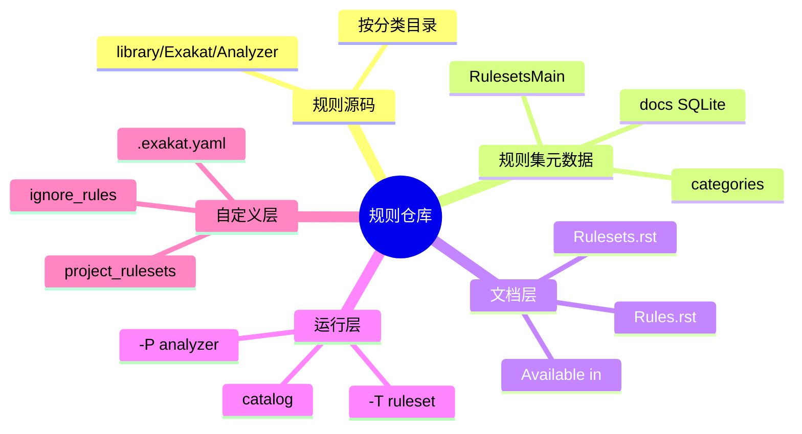

# 记忆卡片摘要（快速复习版）

## 1. 大纲（压缩版）

- Exakat 的规则到底放在哪
- 规则、规则集、文档、SQLite 元数据之间什么关系
- CE 仓库如何组织 analyzer
- 当前 CE 为什么只有 361 条规则
- 官方文档为什么又展示 1000+ 规则
- 如何查找一条规则属于哪个 ruleset
- 如何自定义 ruleset

## 2. 思维导图（Mermaid）



## 3. 重要知识点（必须记住）

- 在 CE 源码里，规则的实现代码主要位于 `library/Exakat/Analyzer/` 目录下，按 `Security`、`Structures`、`Functions`、`Php`、`Classes` 等子目录分类。[来源1]
- “规则集”不是手写死在一个大数组里，而是通过文档/SQLite 元数据和规则分类关系组织出来的。`RulesetsMain.php` 会从 SQLite 文档数据库中查询 `categories`、`analyzers`、`analyzers_categories` 三类关系。[来源2]
- 当前 CE 本地实测 `catalog -json` 得到：
  - `16 rulesets`
  - `12 reports`
  - `361 rules`。[来源3]
- 官方文档中的规则总量更大，是因为它展示了更完整的产品能力，并且规则条目会标 `Community Edition / Enterprise Edition / Exakat Cloud` 可用性，不是单独为 CE 裁切的目录。[来源4][来源5]
- 自定义规则集不是去改 Exakat 核心 PHP 类，而是优先在 `.exakat.yaml` / `.exakat.ini` 里通过 `project_rulesets`、`rulesets`、`ignore_rules` 来组合已有 analyzer。[来源6]

## 4. 难点 / 易混点

- “规则实现源码”与“规则说明文档”不是同一份东西。
- “规则集”与“规则目录分类”相关，但不是简单等同。
- `Security/ShouldUsePreparedStatement` 这种短名既是文档短名，也是源码定位线索。
- 文档里看到一条规则，不等于当前 CE `catalog` 一定能枚举到它。

## 5. QA 快速复习卡片

- Q: Exakat 的规则源码放在哪里？
  A: 主要在 `library/Exakat/Analyzer/` 下，按主题子目录拆分。

- Q: ruleset 是怎么组织出来的？
  A: 通过文档/SQLite 元数据把 analyzer 映射到 category，再由 category 构成 ruleset。

- Q: 为什么规则数量会对不上？
  A: 文档展示产品全集，`catalog` 展示当前 CE 可用子集。

- Q: 要自定义扫描范围，先改源码还是先改配置？
  A: 优先改项目配置，用自定义 ruleset 和 `ignore_rules` 组合现有 analyzer。

## 6. 快速复现步骤（最短路径）

1. 打开 `library/Exakat/Analyzer/` 看子目录分类。[来源1]
2. 运行 `php /tmp/exakat-ce/exakat catalog -json` 看当前规则集、规则、报告数量。[来源3]
3. 打开 `library/Exakat/Analyzer/RulesetsMain.php`，看 ruleset 如何从 SQLite 元数据读取。[来源2]
4. 打开官方 `Rules` 和 `Rulesets` 页面，对照 `Available in` 和 `Short name` 字段。[来源4][来源5]
5. 打开官方 `User/Configuration` 和 `User/Scoping` 文档，看自定义 ruleset 与忽略规则的配置方式。[来源6][来源7]

---

# 学习笔记正文（详细版）

## 0. 学习目标、读者画像与假设

- 技术：`Exakat 规则仓库`
- 学习目标：搞懂一条规则从“源码文件”到“ruleset 成员”到“CLI 可调用对象”再到“文档条目”的全路径
- 读者水平：默认会基本目录浏览，不要求熟悉静态分析器内部架构
- 版本范围：
  - 当前 CE 本地实测版本 `2.6.7`
  - 本地 `catalog -json` 已验证可用
- 假设与限制：
  - 本文优先讲 CE 现有机制，再解释官方文档全集为什么更大。

## 1. 先分清三个词：规则、规则集、规则仓库

很多人一上来把这三个词混在一起，后面就很容易迷路。

### 1.1 规则（rule / analyzer）

这是最小分析单元。  
例如：

- `Security/ShouldUsePreparedStatement`
- `Structures/AddZero`
- `Variables/UndefinedVariable`

你可以把它理解成“某一种具体问题的检测器”。

### 1.2 规则集（ruleset）

这是规则的组合包。  
例如：

- `Analyze`
- `Security`
- `Preferences`
- `Inventory`

你可以把它理解成“面向某个目标的一组检测器清单”。

### 1.3 规则仓库

这里不是 GitHub 上单独一个“rules repo”子仓库，而是一个更广义的概念：

- 规则实现源码仓库
- 规则文档仓库
- 规则与 ruleset 的元数据关系
- CLI 能够枚举和调用这些规则的目录/数据库/配置系统

Exakat 的特点就在于：  
**规则实现、规则文档、规则集映射、CLI 枚举，并不是存在同一个纯文本清单里，而是由源码目录 + 文档元数据 + SQLite 关系一起驱动。**

## 2. 规则实现代码放在哪里

### 2.1 主要目录

当前 CE 仓库中，Analyzer 主要在：

- `library/Exakat/Analyzer/`[来源1]

下面再分很多子目录，例如：

- `Security`
- `Structures`
- `Functions`
- `Classes`
- `Namespaces`
- `Interfaces`
- `Variables`
- `Type`
- `Typehints`
- `Php`
- `Performances`
- `Exceptions`
- `Traits`
- `Dump`
- `Complete`

这说明 Exakat 的规则不是都堆在一个目录里，而是先按语义主题拆分。

### 2.2 这些目录代表什么

对初学者来说，最容易理解的方式是按“问题类型”去看：

- `Security`：安全坏味道和漏洞风险
- `Structures`：表达式、控制流、逻辑结构问题
- `Functions`：函数定义与调用问题
- `Classes`：类、属性、方法、继承相关问题
- `Php`：与 PHP 语言版本、原生行为、弃用特性有关的问题
- `Performances`：性能倾向型建议
- `Dump`：数据收集器，不完全是“问题规则”
- `Complete`：补全/推导分析链路所需的中间规则

这最后两类特别重要。因为它们解释了一个常见现象：

**不是 Exakat 里所有 Analyzer 都是在直接报错，有些是为了让别的规则能看懂代码而存在的。**

## 3. 为什么说 Exakat 的“规则仓库”不只是源码目录

### 3.1 CLI 并不是靠遍历目录简单生成 ruleset

如果规则集只是“按目录聚合”，那 `Security` ruleset 直接等于 `library/Exakat/Analyzer/Security/*` 就够了。  
但 Exakat 不是这么做的。

`library/Exakat/Analyzer/RulesetsMain.php` 会读取 SQLite 文档数据库，查询：

- `analyzers`
- `categories`
- `analyzers_categories`[来源2]

这说明：

- 一条规则属于哪些 ruleset
- 一个 ruleset 包含哪些规则
- 某条规则的 severity、time-to-fix、流行度等元数据

这些并不是只靠目录名推导出来，而是存在专门元数据层里。

### 3.2 对非科班读者的直白解释

你可以把它想象成：

- PHP 文件夹里是真正干活的“工人”
- SQLite 文档库里是“排班表、工号表、岗位说明书”
- CLI 根据这张“排班表”决定今天要叫哪些工人上班

所以只看源码目录，你能知道“有哪些工人”；  
但只有结合元数据，你才能知道：

- 哪些工人属于 `Security`
- 哪些工人属于 `Analyze`
- 哪些工人属于多个 ruleset
- 哪些工人只在 Enterprise 文档里存在

## 4. 当前 CE 到底有多少规则和规则集

### 4.1 本地实测结果

我本地执行：

```bash
php /tmp/exakat-ce/exakat catalog
php /tmp/exakat-ce/exakat catalog -json
```

当前 CE 得到：

- `16 rulesets`
- `12 reports`
- `361 rules`[来源3]

其中 ruleset 包括：

- `All`
- `Analyze`
- `Appcontent`
- `Appinfo`
- `CI-checks`
- `CompatibilityPHP74`
- `CompatibilityPHP80`
- `CompatibilityPHP81`
- `CompatibilityPHP82`
- `CompatibilityPHP83`
- `"Dead code"`
- `Dump`
- `First`
- `Inventory`
- `Preferences`
- `Security`

### 4.2 为什么这个数字比官方文档少很多

官方 `Rules` / `Rulesets` 页面经常显示：

- 1432 rules
- 1661 rules
- 或更多产品级条目[来源4][来源5]

差异原因不是一个，而是至少三个：

1. **文档口径更接近产品全集**  
   包含 Community Edition、Enterprise、Cloud 的统一目录。

2. **当前仓库是 `exakat-ce`**  
   这不是官方全部产品能力代码。

3. **有些 analyzer 是内部补全/收集器，不一定都作为普通用户关心的“问题规则”出现**

这就是为什么你在文档里能看到很多条目，可 `catalog` 只列出当前 CE 的可用清单。

## 5. 如何从一条规则反查源码、文档和 ruleset

这是你以后最实用的技能之一。

### 5.1 从规则短名到源码

例如 `Security/ShouldUsePreparedStatement`：

- 目录 `Security`
- 类名 `ShouldUsePreparedStatement`
- 源码文件通常在：
  - `library/Exakat/Analyzer/Security/ShouldUsePreparedStatement.php`[来源8]

再如 `Structures/AddZero`：

- `library/Exakat/Analyzer/Structures/AddZero.php`[来源9]

所以短名本身就是非常强的定位线索。

### 5.2 从规则短名到文档

官方 `Rules` 文档每条规则通常会有：

- 规则标题
- 问题解释
- Before/After 或示例
- `Short name`
- `Rulesets`
- `Exakat since`
- `PHP Version`
- `Severity`
- `Time To Fix`
- `Available in`[来源4]

也就是说，文档是规则的“对人说明书”，源码是规则的“执行实现”。

### 5.3 从规则到所属 ruleset

`RulesetsMain.php` 提供了 `getRulesetForAnalyzer()` 和 `getRulesetsAnalyzers()`，说明这两个方向都能查：[来源2]

- 给我 ruleset，查里面有哪些 analyzer
- 给我 analyzer，查它属于哪些 ruleset

这很重要，因为一条规则可能属于多个 ruleset，不是“一条规则只属于一个包”的关系。

## 6. 规则集的真实作用，不只是“方便分类”

初学者常觉得 ruleset 只是个菜单分组。  
其实 ruleset 的工程意义很大。

### 6.1 控制分析成本

不同 ruleset 代表不同分析目标：

- `Security`：更偏漏洞和危险实践
- `Analyze`：通用质量与常见陷阱
- `Inventory`：特征收集
- `CI-checks`：快速检查

你不可能每次都跑“官方全量产品目录”。

### 6.2 控制报告依赖

官方 `User/Scoping` 和 `Report` 文档都强调：

- 某些报告依赖特定 ruleset 结果
- 不是所有报告都能在未跑相关 ruleset 的情况下后生成[来源7][来源10]

所以 ruleset 还决定了后续能不能产出某些视图。

### 6.3 控制噪音

如果你只是做安全扫描，就没必要一上来把所有偏风格、现代化建议、库存统计类规则都跑上来。  
ruleset 是噪音治理的第一道阀门。

## 7. 自定义规则集：普通用户最应该用的不是改核心代码，而是配规则

官方配置文档明确支持在 `.exakat.yaml` / `.exakat.ini` 里自定义 ruleset。[来源6]

示例思路是：

- 先声明 `project_rulesets`
- 再定义一个自定义 `rulesets` 节点
- 里面列出具体 analyzer

一个更容易理解的教学版 YAML 例如：

```yaml
project: demo
project_name: Demo Project
project_rulesets:
  - my_security_focus
  - Security
ignore_rules:
  - Structures/AddZero
rulesets:
  my_security_focus:
    - Security/ShouldUsePreparedStatement
    - Functions/HardcodedPasswords
    - Structures/NoDirectAccess
```

这里的思想是：

- 用现成 ruleset 打底
- 再用自己的小规则集补重点
- 再用 `ignore_rules` 去掉你暂时不想看的规则

这比一上来改源码稳得多，也更适合团队协作。

## 8. CE 里哪些目录最值得安全研究者优先看

如果你的目标是漏洞扫描或安全规则学习，我建议优先看：

### 8.1 `Security/`

这里是最直观的安全规则实现目录。  
例如当前 CE 中可见：

- `Security/ShouldUsePreparedStatement`
- `Security/DontEchoError`

### 8.2 `Structures/`

很多安全风险不一定放在 `Security/` 目录里，而是放在结构问题里，比如：

- 不安全比较
- 错误的正则
- `eval` / `preg /e`
- 资源检查缺失

### 8.3 `Php/`

如果你的扫描目标是“语言版本升级引入的安全/兼容风险”，这个目录很关键。

### 8.4 `Complete/` 与 `Dump/`

这两个目录不是“漏洞规则仓库”，但如果你要理解为什么某条规则能命中，它们是必读的，因为它们负责补全类型、调用关系、上下文等底层信息。

## 9. 给非科班读者的最终直白解释

Exakat 的规则仓库不是一个“只有规则源码”的文件夹，而是一套组合系统。最底层是 `library/Exakat/Analyzer/` 里的 PHP 类，每个类对应一条或一类分析规则。再上一层，Exakat 用文档和 SQLite 元数据记录这些规则属于哪些 ruleset、严重级别是什么、从哪个版本开始可用。再往上，CLI 通过 `catalog`、`-T`、`-P` 等入口把这些规则暴露出来。所以你平时看到的一条规则，实际上同时有四张脸：源码实现、文档说明、ruleset 归属、CLI 可调用对象。真正做工程时，要学会在这四层之间来回跳。

## 10. 延伸学习路径（官方优先）

- 先读：`Rules` 文档，熟悉单条规则长什么样。
- 再读：`Rulesets` 文档，理解为什么要用 `-T`。
- 再看：`catalog -json`，建立当前 CE 的真实清单。
- 进阶：直接读 `RulesetsMain.php`、`Analyzer.php` 和你感兴趣的规则源码。

---

# 练习与复习闭环

## 1. 分层练习

### 基础练习

- 解释规则、规则集、规则仓库三者区别。
- 说出 `catalog` 的三种主要输出对象。
- 说明为什么 `Security/ShouldUsePreparedStatement` 这个短名能帮助你定位源码。

### 应用练习

- 任意选一条规则，找到它的源码文件、文档页面、所属 ruleset。
- 写一段 `.exakat.yaml`，定义一个只包含 3 条规则的小 ruleset。

### 综合练习

- 设计一个“PHP 安全重点审计 ruleset”，包含：
  - 2 条安全规则
  - 1 条结构风险规则
  - 1 条 PHP 版本风险规则
  - 并说明为什么这样搭配

## 2. 动手任务（带验收标准）

- 任务：做一张“规则从源码到报告”的流转图。
- 验收标准：
  - 必须包含源码目录、文档、ruleset、CLI、报告五层。
  - 必须说明 `catalog` 的位置。
  - 必须说明 CE 与产品全集的口径差异。

## 3. 常见误区纠偏

- 误区：规则集就是目录名。
  正解：目录是源码分类，ruleset 还依赖元数据映射。

- 误区：规则文档里有一条规则，CE 就一定有。
  正解：要看 `Available in` 和当前 `catalog`。

- 误区：自定义规则集就得改 Exakat 内核源码。
  正解：普通场景优先用配置组合已有 analyzer。

## 4. 复习节奏建议

- Day 1：区分规则、ruleset、目录分类
- Day 3：实际做一次“短名 -> 源码 -> 文档 -> ruleset”反查
- Day 7：写一个自定义 ruleset 配置
- Day 14：复述为什么文档条目比 CE `catalog` 多

## 5. 自测题与参考答案（简版）

- 题目1：为什么说 `catalog` 是理解 CE 能力边界的关键命令？
  参考答案：因为它显示的是当前环境实际暴露出来的 ruleset、report 和 rule，而不是官网全量营销口径。

- 题目2：规则集是如何组织的？
  参考答案：通过 Analyzer 源码与 SQLite 文档元数据中的 category 映射共同组织。

- 题目3：自定义规则集最推荐的方法是什么？
  参考答案：在 `.exakat.yaml` / `.exakat.ini` 中通过 `project_rulesets`、`rulesets`、`ignore_rules` 组合现有规则。

---

# 参考来源与版本说明

## 官方来源（优先）

1. [Analyzer 源码目录](https://github.com/exakat/exakat-ce/tree/master/library/Exakat/Analyzer) - 访问日期：2026-03-28
2. [规则集元数据读取源码 `RulesetsMain.php`](https://github.com/exakat/exakat-ce/blob/master/library/Exakat/Analyzer/RulesetsMain.php) - 访问日期：2026-03-28
3. 本地实测 `php /tmp/exakat-ce/exakat catalog -json` - 实测日期：2026-03-28
4. [官方规则文档](https://exakat.readthedocs.io/en/latest/Reference/Rules.html) - 访问日期：2026-03-28
5. [官方规则集文档](https://exakat.readthedocs.io/en/latest/Reference/Rulesets.html) - 访问日期：2026-03-28
6. [官方配置文档](https://exakat.readthedocs.io/en/latest/User/Configuration.html) - 访问日期：2026-03-28
7. [官方 Scoping 文档](https://exakat.readthedocs.io/en/latest/User/Scoping.html) - 访问日期：2026-03-28
8. [示例规则 `Security/ShouldUsePreparedStatement`](https://github.com/exakat/exakat-ce/blob/master/library/Exakat/Analyzer/Security/ShouldUsePreparedStatement.php) - 访问日期：2026-03-28
9. [示例规则 `Structures/AddZero`](https://github.com/exakat/exakat-ce/blob/master/library/Exakat/Analyzer/Structures/AddZero.php) - 访问日期：2026-03-28
10. [官方 Report 用户文档](https://exakat.readthedocs.io/en/latest/User/Report.html) - 访问日期：2026-03-28

## 第三方来源（按采信程度标注）

- 本文未依赖第三方非官方来源做关键结论裁决。

## 关键结论引用映射

- [来源1] 规则实现目录结构
- [来源2] ruleset 与 analyzer 的 SQLite 元数据关系
- [来源3] 当前 CE `catalog` 实测数量
- [来源4] 单条规则文档结构
- [来源5] ruleset 官方目录与总量表述
- [来源6] 自定义 ruleset 配置方式
- [来源7] 范围控制与 ruleset 运行思路

## 官方文档章节映射与重要例子保留

- `Reference/Rules` -> 本文第 5 节“从规则到文档”
- `Reference/Rulesets` -> 本文第 6 节“ruleset 作用”
- `User/Configuration` -> 本文第 7 节“自定义规则集”
- `User/Scoping` -> 本文第 6 节与第 7 节“范围控制和规则集选择”

## 冲突点与裁决

- 冲突点：官方文档规则总量明显大于 CE `catalog`。
- 来源A：官方规则/规则集文档。[来源4][来源5]
- 来源B：当前 CE 本地 `catalog -json`。[来源3]
- 差异原因判断：文档展示的是统一产品目录；CE 只暴露社区版子集。
- 本文采用结论：工程决策以当前 CE `catalog` 和源码为准，文档用于理解全貌与条目语义。

## 技术版本与访问日期

- Exakat CE 本地实测版本：`2.6.7`
- 实测日期：`2026-03-28`

