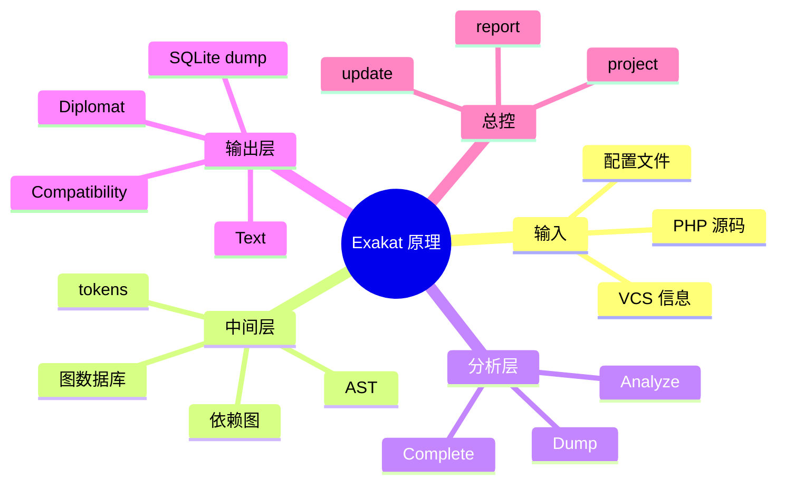

# 记忆卡片摘要（快速复习版）

## 1. 大纲（压缩版）

- Exakat 静态分析到底在分析什么
- 为什么它需要 AST、依赖图、Gremlin、SQLite
- `project` 命令内部会跑哪些阶段
- `files / load / analyze / dump / report` 各自负责什么
- 它和只做 lint、只做类型检查的工具有什么差别
- 哪些阶段决定了命中率、性能和报告质量

## 2. 思维导图（Mermaid）



## 3. 重要知识点（必须记住）

- 官方 `Introduction` 直接说明：Exakat 会读取代码、构建 AST 和多个依赖图，再把它们索引到图数据库中，随后执行分析并生成报告。[来源1]
- 官方 `Installation` 进一步说明：Exakat 依赖 Gremlin Server，推荐 Tinkergraph/Neo4j 作为图后端；分析结果最终会被导出到 SQLite，用于报告阶段。[来源2]
- `Project.php` 源码表明 `project` 不是单一步骤，而是完整审计总控：`Files -> CleanDb -> Load -> Analyze -> Dump -> Report`。[来源3]
- `Load.php` 是代码理解核心，它不只是“读文件”，而是做 token、上下文、变量、调用关系、继承关系、属性、类型提示等结构化装载。[来源4]
- `Analyze.php` 会按 ruleset 展开 analyzer 列表，处理依赖关系，必要时串行或并行执行。[来源5]
- `Dump.php` 的作用是把图数据库中的分析结果、规则命中数、规则集结果等整理进 SQLite dump，后续 `report` 就主要基于 dump 而不是直接打图数据库。[来源6]

## 4. 难点 / 易混点

- “静态分析”不是“只看文本关键词匹配”。
- AST 不是最终结果，它只是结构化理解代码的中间表示。
- 图数据库不是为了炫技，而是为了做跨节点、跨文件、跨调用链追踪。
- `Complete` / `Dump` 这类分析器虽然不一定直接报问题，但会显著影响其他规则的命中能力。

## 5. QA 快速复习卡片

- Q: Exakat 为什么不用纯正则扫代码？
  A: 因为它要理解变量、调用关系、继承、作用域、参数和返回值，单靠文本匹配不够。

- Q: Exakat 为什么需要图数据库？
  A: 因为它要在 AST 和依赖图上做遍历、回溯、跨节点关联，图模型更适合这类查询。

- Q: `project` 和 `analyze` 的关系是什么？
  A: `project` 是完整流水线总控，`analyze` 是其中的分析阶段。

- Q: 报告为什么主要基于 SQLite dump？
  A: 因为分析完成后，把结果整理到 SQLite 更方便后续反复生成不同报告，也不必一直依赖在线图数据库。

## 6. 快速复现步骤（最短路径）

1. 读官方 `Introduction` 的 `What is Exakat` 和 `Architecture` 章节。[来源1]
2. 读官方 `Installation` 的 `Requirements`，确认为什么需要 Gremlin/Java/PHP/SQLite。[来源2]
3. 打开 `library/Exakat/Tasks/Project.php`，顺着 `run()` 看总流水线。[来源3]
4. 打开 `library/Exakat/Tasks/Load.php`，观察 AST/上下文装载器字段。[来源4]
5. 打开 `library/Exakat/Tasks/Analyze.php` 和 `Dump.php`，理解分析与结果整理分离。[来源5][来源6]

---

# 学习笔记正文（详细版）

## 0. 学习目标、读者画像与假设

- 技术：`Exakat 静态分析引擎`
- 学习目标：让你真正明白 Exakat 不是“会跑很多规则的黑盒”，而是一条从源码到图、再到规则、再到报告的流水线
- 读者水平：默认不要求学过编译原理，但接受“先直观后严格”的讲法
- 版本范围：
  - 当前 CE 仓库版本：`2.6.7`
  - 文档层参考官方 `Introduction / Installation / Getting Started`
- 假设与限制：
  - 本文重点讲 Community Edition 当前仓库能体现出来的工作流。

## 1. 先讲最直观版本：Exakat 在做什么

如果你把 PHP 项目想成一本很厚的书，Exakat 并不是只拿一个荧光笔在里面搜关键词。  
它做的事情更像：

1. 先把整本书拆成语法结构
2. 再画出人物关系图、引用关系图、谁调用谁的关系图
3. 再根据很多“规则模板”去检查这些关系图里有没有可疑模式
4. 最后再把查到的问题整理成给人看和给机器看的报告

所以 Exakat 真正的强项不是“知道 PHP 关键字有哪些”，而是：

- 它能理解代码结构
- 它能在结构之间做跨节点推理
- 它能把这种推理沉淀成可重复执行的规则

## 2. 什么是静态分析，Exakat 属于哪一类

### 2.1 静态分析的直白定义

静态分析（static analysis）就是：  
**不真正运行你的程序，而是在代码静止状态下推断出潜在问题、结构信息和风险。**

它和运行测试不同：

- 测试是“把车开上路，看会不会出事故”
- 静态分析是“车还没开，就检查刹车线接法、方向盘连接关系和油路配置”

### 2.2 Exakat 与只做 lint 的工具有什么不同

只做 lint 的工具主要检查：

- 语法对不对
- 文件能不能编译

Exakat 远不止这一步。官方介绍明确写到：

- 它会构建 AST
- 构建依赖图
- 索引到图数据库
- 再做分析和报告。[来源1]

这意味着它关心的是：

- 调用关系
- 变量传播
- 类、接口、trait 依赖
- 参数、默认值、返回类型
- PHP 版本兼容性
- 安全热点和代码坏味道

### 2.3 Exakat 与只做类型推断的工具有什么不同

官方 `Introduction` 里也把 Exakat 与 Phan / PHPStan 一类工具做了区分：  
Exakat 同样有 AST 风格分析，但它不仅看类型兼容，还覆盖很多“常见陷阱”“语言行为变化”“特征使用”和“实际 PHP 习惯问题”。[来源1]

所以可以把它理解成：

- 一部分像类型检查器
- 一部分像代码质量审查器
- 一部分像 PHP 版本迁移顾问
- 一部分像安全审计助手

## 3. 为什么 Exakat 要用 AST

### 3.1 什么是 AST

AST 是 `Abstract Syntax Tree`，中文常叫抽象语法树。  
它的作用是把源代码从“线性的文本”变成“分层结构”。

例如这行代码：

```php
$x = foo($a + 1);
```

在文本层面只是一串字符。  
但在 AST 层面，它会变成：

- 一个赋值节点
- 左边是变量 `$x`
- 右边是函数调用 `foo(...)`
- 函数参数里还有一个加法表达式
- 加法左边是变量 `$a`
- 加法右边是字面量 `1`

只有先变成这种结构，后续规则才能回答下面这些问题：

- 这里是不是函数调用？
- 传入的第一个参数是不是动态拼接出来的？
- 某个变量是不是在赋值后又参与了危险操作？

### 3.2 为什么光用文本匹配不够

如果只用搜索字符串，你可能会搜到：

- 注释里的 `eval`
- 字符串里的 `mysql_query`
- 看似相似但实际不是函数调用的位置

但 Exakat 关心的是“代码结构中的真实语义位置”。  
AST 正是解决这个问题的第一层基础。

## 4. 为什么 AST 还不够，Exakat 还要建依赖图

### 4.1 AST 适合看“树内结构”

AST 很擅长回答：

- 这个节点是什么语法结构
- 谁是它的子节点
- 这个表达式内部怎么嵌套

但很多真正有价值的规则，不只看一棵树上的父子关系。

### 4.2 真实问题往往跨节点、跨文件、跨作用域

比如下面这些问题：

- 某方法调用的目标类定义在哪
- 某参数的默认值来自哪里
- 某变量是不是被修改过
- 某类最终继承链经过了哪些父类
- 某函数的返回类型是通过哪些路径传播来的

这些都不是单棵语法树内部就能轻松回答的。

### 4.3 所以 Exakat 要构建依赖图

官方介绍明确说，Exakat 会构建 `several dependency graphs`。[来源1]

这可以直白理解成：

- AST 负责把代码“拆开”
- 依赖图负责把“拆开的碎片重新按关系连起来”

这些关系包括但不限于：

- 调用
- 定义
- 继承
- 实现
- 使用
- 参数
- 返回类型
- 属性访问

## 5. 为什么 Exakat 用图数据库，而不是只用数组或传统 SQL

### 5.1 图数据库适合表达“点”和“边”

当你把代码结构看成：

- 节点：类、函数、变量、表达式、文件
- 边：调用、继承、引用、定义、参数传递

图数据库天然就很适合这个模型。

官方安装文档写得很明确：

- Exakat 依赖 `Gremlin server`
- 推荐 `tinkergraph` 与 `neo4j`
- 使用 Gremlin 3 遍历语言。[来源2]

### 5.2 对非科班读者的直白解释

普通关系型数据库更像 Excel：

- 每张表按行列排好
- 查“某人属于哪个部门”很方便

图数据库更像社交关系网：

- 你更关心“谁认识谁”“谁通过谁连到谁”“沿着这条关系往前走三步会到哪里”

Exakat 的许多规则，本质上就是在问这种问题：

- 从这个调用点出发，顺着定义关系往回找，能找到什么？
- 沿着类型关系走几步，最终是不是某个危险结构？
- 某个值是不是从某种常量传播过来的？

这就是 Gremlin/图数据库存在的意义。

## 6. Exakat 的总体架构：从源码到报告的五大阶段

官方和源码合起来看，可以把 Exakat 的运行过程理解成五个阶段。

### 6.1 第一步：采集文件 `Files`

`Tasks/Files.php` 负责做的事包括：[来源7]

- 搜索候选文件
- 应用 `file_extensions`
- 应用 `ignore_dirs / include_dirs`
- 去重
- 记录 Composer 信息
- 记录许可证文件
- 做编译检查

这一步的核心不是“分析内容”，而是先确定：

- 我要分析哪些文件
- 哪些文件要忽略
- 这个项目大概有哪些外部依赖和配置特征

### 6.2 第二步：清理图数据库 `CleanDb`

这一步很像“清空工作台”。  
因为 Exakat 的图数据库是中间处理空间，跑新项目前要先确保旧状态不会污染结果。

### 6.3 第三步：装载代码 `Load`

这是 Exakat 技术含量最高的部分之一。

`Load.php` 里能看到大量上下文对象与辅助器：[来源4]

- `Context`
- `FunctionContext`
- `ContextVariables`
- `VariablesUsageContext`
- `ClassTraitContext`
- `ContextProperties`
- `ContextMethods`
- `Links`
- `Calls`
- `Precedence`
- `Php`

从这些类名就能看出来，Load 阶段在做的事情远不只是“读 token”：

- 建 AST 原子节点
- 追踪作用域
- 记录变量使用
- 识别继承/trait/接口关系
- 追踪方法、属性、常量
- 建边关系

也就是说，Load 阶段是在把“PHP 文本”转成“图上可查询的代码知识库”。

### 6.4 第四步：执行分析 `Analyze`

`Analyze.php` 的工作包括：[来源5]

- 把 ruleset 展开成 analyzer 列表
- 处理 analyzer 依赖
- 决定串行或并行
- 跑每一条 analyzer
- 记录命中数

这里一个非常重要的概念是 **依赖分析器**。

有些规则并不能直接运行，它依赖某些补全型 analyzer 先把图补完整。  
所以 Analyze 阶段不是“按清单随便跑”，而是要先排依赖顺序。

### 6.5 第五步：整理结果 `Dump` 与生成报告 `Report`

`Dump.php` 会把图上的结果导入 SQLite dump。[来源6]
而 `Report.php` 则基于 dump 生成：

- Text
- Json
- Diplomat
- 兼容性报告
- 其他当前环境可用报告[来源8]

为什么这么设计？

因为图数据库适合做复杂遍历，但并不适合每次导出都重新现场重算。  
先把结果整理进 SQLite，就能：

- 反复生成不同报告
- 在图数据库清掉后仍保留结果
- 让报告阶段更稳定、可缓存

## 7. `project` 命令内部到底做了什么

如果你看 `Tasks/Project.php` 的 `run()`，大致会看到这样的顺序：[来源3]

1. 校验项目是否合法
2. 备份 baseline
3. 清理旧项目结果
4. 记录审计元信息
5. 计算要运行哪些 ruleset
6. 跑 `Files`
7. 跑 `CleanDb`
8. 初始化图数据库
9. 跑 `Load`
10. 先跑 `First` ruleset
11. 做一次 `Dump`
12. 再跑指定 ruleset 或单条 program
13. 完成后继续 `Dump`
14. 跑 `Report`

这解释了两个非常实用的结论：

- `project` 是“全流程命令”，不是“分析命令”的别名。
- 你单独去跑 `load`、`analyze`、`dump`，本质上是在手动拆 `project` 的内部阶段。

## 8. `Complete` 和 `Dump` 为什么也是 Analyzer

这点很反直觉。

很多人以为 analyzer 一定是“报问题的规则”。  
但在 Exakat 里，`Complete/*` 和 `Dump/*` 说明 analyzer 还承担两种基础设施角色：

### 8.1 `Complete/*`

负责补全结构和传播信息，例如：

- 传播常量
- 补全返回类型
- 追踪远端定义
- 建立父类关系

没有这些，很多上层规则就看不懂更复杂的代码模式。

### 8.2 `Dump/*`

负责收集统计和结构快照，例如：

- 圈复杂度
- 类深度
- 文件依赖
- 原子节点计数

它们不一定直接对应“错误”，但会影响报告和全局视图质量。

所以 Exakat 的 analyzer 体系里，其实同时存在：

- 直接报问题的规则
- 提供上下文的补全规则
- 提供报表数据的收集规则

## 9. 为什么 Exakat 能做 PHP 版本迁移和安全分析

很多人觉得“版本迁移”和“安全分析”像两套完全不同的工具。  
Exakat 能同时支持，是因为它的底层模型足够通用。

一旦你已经有了：

- AST
- 类型和调用补全
- 依赖图
- 文件/类/函数/参数上下文

那你就可以在同一张图上提问不同问题：

- 这段代码用了 PHP 8.1 才有的特性吗？
- 这里的 SQL 是不是动态拼接？
- 这里的继承签名在目标版本里是否合法？
- 这里的资源使用有没有漏检查？

所以 Exakat 的“多场景能力”不是拼装出来的，而是来自统一中间表示的复用。

## 10. 给非科班读者的最终直白总结

Exakat 的工作原理可以理解成一条多段流水线。先把 PHP 项目里的文件挑出来，再把代码拆成语法树，再把类、函数、变量、参数、继承、调用关系连成一张图，然后让一大批规则沿着这张图去查问题。查到的问题不会直接零散地吐出来，而是会先被整理进 SQLite 数据库，最后再导出成人能看、机器也能读的报告。你之所以会看到 Exakat 既能查兼容性、又能查安全、还能做代码质量和依赖图，不是因为它分别写了很多互不相干的小脚本，而是因为它先把代码变成了一种足够丰富的“结构化知识图”，后面的能力都是在这张图上做不同问题的提问。

## 11. 延伸学习路径（官方优先）

- 先读：`Introduction` 的 `Architecture`
- 再读：`Administrator/Installation` 的 `Requirements`
- 再看：`Tasks/Project.php`
- 进阶：`Load.php -> Analyze.php -> Dump.php`

---

# 练习与复习闭环

## 1. 分层练习

### 基础练习

- 用自己的话解释 AST 是什么。
- 解释为什么图数据库比单纯文本搜索更适合 Exakat。
- 解释 `project` 和 `report` 的分工。

### 应用练习

- 画出 `Files -> Load -> Analyze -> Dump -> Report` 流程图。
- 说明 `Complete/*` 分析器为什么不是“多余规则”。

### 综合练习

- 给一个没学过静态分析的人讲清楚：为什么 Exakat 能同时做版本迁移检查和安全检查。

## 2. 动手任务（带验收标准）

- 任务：写一页“Exakat 架构说明图”。
- 验收标准：
  - 必须包含输入、中间表示、分析阶段、输出阶段
  - 必须出现 AST、Gremlin、SQLite 三个词
  - 必须说明 `project` 是总控

## 3. 常见误区纠偏

- 误区：静态分析就是 grep 关键字。
  正解：Exakat 依赖 AST、依赖图和图遍历。

- 误区：图数据库只是部署复杂度，不影响能力。
  正解：很多跨调用、跨定义关系查询正是靠图模型完成。

- 误区：报告阶段还在直接查图数据库。
  正解：主要结果已经整理入 SQLite dump。

## 4. 复习节奏建议

- Day 1：记住五阶段流水线
- Day 3：复习 AST 和依赖图的区别
- Day 7：复习 `project` 的内部步骤
- Day 14：尝试用自己的类比重新解释 Exakat 架构

## 5. 自测题与参考答案（简版）

- 题目1：为什么 Exakat 不能只靠 lint？
  参考答案：因为它需要理解更复杂的结构关系，如调用链、继承、参数传播和版本兼容性。

- 题目2：为什么分析结果要再 dump 到 SQLite？
  参考答案：为了让后续报告生成更稳定、可重复、可脱离图数据库反复使用。

- 题目3：`Load` 阶段最核心的工作是什么？
  参考答案：把源码转成图上可查询的结构化知识，包括 AST 节点、上下文和关系边。

---

# 参考来源与版本说明

## 官方来源（优先）

1. [官方 Introduction 文档](https://exakat.readthedocs.io/en/latest/Introduction.html) - 访问日期：2026-03-28
2. [官方 Installation 文档](https://exakat.readthedocs.io/en/latest/Administrator/Installation.html) - 访问日期：2026-03-28
3. [总流水线源码 `Tasks/Project.php`](https://github.com/exakat/exakat-ce/blob/master/library/Exakat/Tasks/Project.php) - 访问日期：2026-03-28
4. [装载阶段源码 `Tasks/Load.php`](https://github.com/exakat/exakat-ce/blob/master/library/Exakat/Tasks/Load.php) - 访问日期：2026-03-28
5. [分析阶段源码 `Tasks/Analyze.php`](https://github.com/exakat/exakat-ce/blob/master/library/Exakat/Tasks/Analyze.php) - 访问日期：2026-03-28
6. [Dump 阶段源码 `Tasks/Dump.php`](https://github.com/exakat/exakat-ce/blob/master/library/Exakat/Tasks/Dump.php) - 访问日期：2026-03-28
7. [文件阶段源码 `Tasks/Files.php`](https://github.com/exakat/exakat-ce/blob/master/library/Exakat/Tasks/Files.php) - 访问日期：2026-03-28
8. [报告阶段源码 `Tasks/Report.php`](https://github.com/exakat/exakat-ce/blob/master/library/Exakat/Tasks/Report.php) - 访问日期：2026-03-28

## 第三方来源（按采信程度标注）

- 本文未依赖第三方非官方来源做关键结论裁决。

## 关键结论引用映射

- [来源1] AST、依赖图、图数据库总体原理
- [来源2] Gremlin/Tinkergraph/Neo4j/SQLite 等依赖说明
- [来源3] `project` 总流水线步骤
- [来源4] `Load` 的上下文与装载结构
- [来源5] ruleset 展开与依赖处理
- [来源6] dump 到 SQLite 的过程
- [来源7] 文件扫描与预处理职责
- [来源8] 报告生成职责

## 官方文档章节映射与重要例子保留

- `Introduction -> What is Exakat / Architecture` -> 本文第 2 至第 6 节
- `Installation -> Requirements` -> 本文第 5 节
- `Getting Started` 的运行流程 -> 本文第 7 节

## 冲突点与裁决

- 冲突点：很多入门材料把 Exakat 描述成“跑规则的工具”，但源码显示它是完整流水线。
- 来源A：简化入门叙述。
- 来源B：`Project.php / Load.php / Analyze.php / Dump.php` 源码。[来源3][来源4][来源5][来源6]
- 本文采用结论：Exakat 的正确理解单位是“流水线”，而不是“单条规则执行器”。

## 技术版本与访问日期

- Exakat CE 本地实测版本：`2.6.7`
- 实测日期：`2026-03-28`

