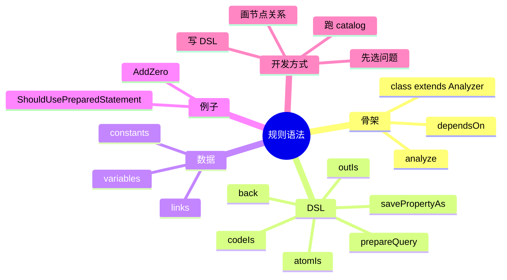

# 记忆卡片摘要（快速复习版）

## 1. 大纲（压缩版）

- 一条 Exakat 规则源码长什么样
- Analyzer 类的基本骨架
- `dependsOn()` 和 `analyze()` 各做什么
- 常见 DSL 动词怎么理解
- `prepareQuery()` 为什么重要
- 参数化规则怎么做
- 怎么从阅读源码到写出自己的规则

## 2. 思维导图（Mermaid）

## 3. 重要知识点（必须记住）

- Exakat 的规则实现类通常继承 `Exakat\Analyzer\Analyzer`，最关键的方法是：
  - `dependsOn()`
  - `analyze()`。[来源1]
- `Analyzer.php` 定义了大量通用常量和数据访问辅助能力，如 `WITH_CONSTANTS`、`WITH_VARIABLES`、`CALLS`、`CONTAINERS` 等，这些常量能减少规则编写时的重复劳动。[来源1]
- 规则不是直接拼 Gremlin 字符串，而通常是用 Exakat 自己的一层 DSL 链式调用来构造查询，如：
  - `atomIs()`
  - `outIs()`
  - `codeIs()`
  - `atomIsNot()`
  - `savePropertyAs()`
  - `samePropertyAs()`
  - `back()`
  - `prepareQuery()`。[来源2][来源3][来源4]
- `prepareQuery()` 的作用不是“开始执行”，而是把当前构造好的查询保存成一个待执行分析片段；真正执行一般发生在 analyzer `run()` 后续阶段。[来源1]
- `AddZero` 是理解 DSL 链式查询的好例子；`ShouldUsePreparedStatement` 是理解“从函数调用 -> 参数 -> 字符串拼接 -> 风险模式”这种安全规则思路的好例子。[来源5][来源6]

## 4. 难点 / 易混点

- DSL 看起来像 ORM，但本质上是在生成图遍历查询。
- `prepareQuery()` 不等于立刻执行。
- `dependsOn()` 不是“文档注释”，而是真正影响分析排序。
- 有些 DSL 动词在语义上是“沿边走”，有些是“筛选节点”，有些是“记住变量以后回头比对”。

## 5. QA 快速复习卡片

- Q: Exakat 规则最重要的方法是哪两个？
  A: `dependsOn()` 和 `analyze()`。

- Q: 为什么要 `prepareQuery()`？
  A: 因为一个 analyzer 往往会定义多段查询，`prepareQuery()` 是把当前这段查询封存起来，稍后统一执行。

- Q: `atomIs()` 是干什么的？
  A: 筛选当前图遍历位置的节点类型。

- Q: `back('first')` 这类调用是干什么的？
  A: 回到之前命名保存过的遍历位置，继续往另一个方向查。

## 6. 快速复现步骤（最短路径）

1. 打开 `library/Exakat/Analyzer/Analyzer.php` 看骨架和常量。[来源1]
2. 打开 `library/Exakat/Analyzer/Structures/AddZero.php` 看一个结构型规则。[来源5]
3. 打开 `library/Exakat/Analyzer/Security/ShouldUsePreparedStatement.php` 看一个安全型规则。[来源6]
4. 打开 `library/Exakat/Query/DSL/AtomIs.php`、`OutIs.php` 看 DSL 是如何转成查询片段的。[来源2][来源3]
5. 顺着 `prepareQuery()` 在 `Analyzer.php` 里的实现，看查询何时被收集和执行。[来源1]

---

# 学习笔记正文（详细版）

## 0. 学习目标、读者画像与假设

- 技术：`Exakat 规则 DSL / Analyzer 开发`
- 学习目标：让你能“看懂现有规则”，并具备写简单规则的思维框架
- 读者水平：默认会看一点 PHP，但不假设会 Gremlin
- 版本范围：CE 仓库当前 `2.6.7`
- 假设与限制：
  - 本文重点讲“常用规则语法”和“开发方法论”，不是完整 DSL 词典。

## 1. 一条 Exakat 规则，从源码上看长什么样

最典型的骨架长这样：

1. 一个类，继承 `Analyzer`
2. 可能定义若干参数属性
3. 可选实现 `dependsOn()`
4. 必实现 `analyze()`
5. 在 `analyze()` 里用链式 DSL 构建若干查询
6. 每构好一段查询就调用一次 `prepareQuery()`

例如 `Structures/AddZero` 和 `Security/ShouldUsePreparedStatement` 都是这个套路。[来源5][来源6]

对非科班读者来说，可以把它想成：

- 类：这条规则本身
- `dependsOn()`：开工前必须先准备好的前置数据
- `analyze()`：真正的查找逻辑
- `prepareQuery()`：把一段“查找方案”登记进执行队列

## 2. `Analyzer` 基类到底提供了什么

`Analyzer.php` 是整个规则开发最重要的基类之一。[来源1]

它提供的东西可以分四类理解。

### 2.1 规则运行生命周期

- `run()`：调用 `analyze()`，然后执行已准备的查询
- `prepareQuery()`：把当前查询存起来
- `execQuery()`：统一执行所有已登记查询

这解释了为什么你在规则源码里通常看不到“立刻执行查询”的代码。  
规则作者做的是“描述我要找什么”，真正执行是在统一生命周期里处理。

### 2.2 通用常量

它定义了很多写规则时常用的常量，例如：

- `WITH_CONSTANTS`
- `WITH_VARIABLES`
- `WITHOUT_CONSTANTS`
- `CALLS`
- `CONTAINERS`
- `FUNCTIONS_ALL`
- `CIT`
- `TYPE_LINKS`
- `SCALARS`

这些常量的价值在于：  
你不用每次都手工把“函数调用都有哪些节点类型”“容器型变量包括哪些节点”重新列一遍。

### 2.3 规则上下文能力

基类还给你接好了：

- 配置对象
- ruleset 对象
- 图数据库对象
- datastore
- stubs
- docs 元数据

这意味着一条规则不仅能查图，还能：

- 读取参数默认值
- 读取文档中的规则参数定义
- 加载数据文件

### 2.4 参数注入能力

`Analyzer` 构造函数会读取 docs 元数据里的参数定义，然后把外部配置注入到规则对象的属性中。[来源1]

所以当一条规则支持自定义参数时，并不是随便写个成员变量就结束了，而是要和元数据、配置系统配合。

## 3. `dependsOn()`：规则为什么要声明依赖

### 3.1 最直白解释

很多规则不是拿到 AST 就能直接查。  
它可能先需要：

- 常量传播完成
- 返回类型补全完成
- 父类关系建立完成
- trait 方法解析完成

这类前置准备不是“可有可无优化”，而是规则能否命中的前提。

### 3.2 `AddZero` 的依赖示例

`Structures/AddZero` 里写了：

- 依赖 `Complete/PropagateConstants`。[来源5]

为什么？

因为这条规则要识别“加 0”这种无意义表达式，而有些 `0` 不是直接写字面量，而是先通过常量、默认值或传播链传过来的。  
如果前面没把常量传播补齐，这条规则就可能漏报。

### 3.3 规则依赖的工程意义

这说明 Exakat 不是“每条规则各管各的”。  
它更像一套协作型规则网络：

- 前置规则负责把语义补清楚
- 后置规则基于这些补充结果命中更复杂模式

## 4. `analyze()`：真正的规则逻辑都写在这里

### 4.1 它的本质不是“写 if 判断”

很多初学者第一次看 Exakat 规则会困惑：  
为什么里面没有一堆普通 PHP `if`？

因为 Exakat 规则的主要工作不是逐个 AST 节点手写遍历，而是：

- 用 DSL 描述“我要在图里找什么路径、什么节点、什么属性组合”

所以 `analyze()` 更像“查询构造器”，而不是传统脚本逻辑。

### 4.2 一条查询通常包含三类动作

1. **定位起点**
   - 比如 `atomIs('Assignation')`

2. **沿关系走**
   - 比如 `outIs('RIGHT')`
   - 或 `outWithRank('ARGUMENT', 1)`

3. **做筛选和比对**
   - `codeIs()`
   - `atomIsNot()`
   - `regexIsNot()`
   - `samePropertyAs()`

最后再：

4. **回到结果节点并登记**
   - `back('first')`
   - `prepareQuery()`

## 5. 最常见的 DSL 动词，怎么用人话理解

这里不追求完整，只讲最常见、最值得先记住的。

### 5.1 `atomIs()`

作用：筛选当前节点的“类型”。

例如：

- `atomIs('Assignation')`
- `atomIs(array('Integer', 'Null', 'Boolean'), self::WITH_CONSTANTS)`

人话理解：  
“我现在只关心这些类型的节点。”

### 5.2 `outIs()`

作用：沿指定边走到下游节点。[来源3]

例如：

- `outIs('RIGHT')`
- `outIs(array('LEFT', 'RIGHT'))`

人话理解：  
“从当前节点顺着某种关系走到下一步。”

### 5.3 `codeIs()`

作用：按代码文本或符号筛选。

例如：

- `codeIs(array('+=', '-='))`
- `codeIs($this->queryMethod, self::TRANSLATE, self::CASE_INSENSITIVE)`

人话理解：  
“当前节点虽然类型对了，但我只要其中某些具体写法。”

### 5.4 `atomIsNot()`

作用：排除某些节点类型。

适合用在：

- 避免把某类边界情况误计入结果
- 缩小误报范围

### 5.5 `savePropertyAs()`

作用：把当前节点某个属性暂存成变量，后面用于比较。

例如在 `AddZero` 中保存变量名，再往后比对另一个位置的变量是否同名。[来源5]

人话理解：  
“先记住这个节点的某个关键信息，后面回来对照。”

### 5.6 `samePropertyAs()`

作用：比较当前节点某属性是否与之前保存的变量一致。

这是跨步骤关联的关键。

### 5.7 `back()`

作用：回到之前命名保存的遍历位置。

这在图遍历里非常重要，因为你常常会：

1. 往下钻很深
2. 取到某个属性
3. 再回到前面某一步继续换个方向走

没有 `back()`，很多规则会变得又长又乱。

### 5.8 `prepareQuery()`

作用：封存当前已构造好的查询，交给后续统一执行。[来源1]

它为什么总在每一段查询末尾出现？  
因为一个 analyzer 往往不止查一种模式，而是：

- 查模式 A，登记
- 查模式 B，登记
- 查模式 C，登记

最后统一执行。

## 6. 读懂 `AddZero`：结构型规则的思维方式

`Structures/AddZero` 是学习 Exakat DSL 的极好样本。[来源5]

### 6.1 它在查什么

直觉上，它在找：

- `+= 0`
- `-=` 0
- `0 + 某表达式`
- 某变量先被赋值为 0，之后又参与无意义加法
- 单独的正号 `+$a`

### 6.2 它为什么不是一条查询

因为“无意义地加 0”在代码里有多种写法。  
如果硬把所有情况写成一条超长查询：

- 可读性会很差
- 调试会很难
- 误报定位会更痛苦

所以它采用多段查询：

- 每种写法查一段
- 每查完一段 `prepareQuery()`

这是一种非常值得模仿的开发风格：  
**一条规则可以表达一个概念，但不必执着于只用一条查询实现。**

### 6.3 这条规则体现了哪些 DSL 技巧

- `dependsOn()`：依赖常量传播
- `atomIs()`：定位赋值、加法、符号
- `codeIs()`：筛选运算符
- `outIs()`：走到左右操作数
- `followParAs()`：跳过括号干扰
- `savePropertyAs()` / `samePropertyAs()`：跨位置变量对比
- `back()`：回到锚点

## 7. 读懂 `ShouldUsePreparedStatement`：安全型规则的思维方式

这条规则比 `AddZero` 更贴近漏洞扫描。[来源6]

### 7.1 它在查什么

它大致在捕捉：

- 调用数据库查询函数
- 或调用对象的 `query` 方法
- 参数里出现字符串拼接
- 且 SQL 开头不是某些例外语句

人话就是：

“发现你把动态拼接的 SQL 直接送进查询函数/方法里，这通常意味着应该改成预处理语句。”

### 7.2 它体现了安全规则常见套路

安全规则经常不是单纯查一个危险函数名，而是查一条“风险路径”：

1. 危险宿主函数/方法
2. 关键参数位置
3. 参数的构造方式
4. 例外条件过滤

这和很多安全研究里的“source -> transform -> sink”思维很接近。

### 7.3 为什么这类规则特别适合图遍历

因为你通常要跨多个节点问问题：

- 当前是不是函数调用
- 调的是不是指定函数
- 我关心的是第几个参数
- 这个参数是不是字符串字面量或拼接
- 它有没有命中特定正则排除条件

这正是 DSL 和图遍历的强项。

## 8. DSL 背后是什么：不是魔法，而是 Gremlin 命令构造

例如 `AtomIs.php` 和 `OutIs.php` 可以直接看到：

- `atomIs()` 最终会构造成 `hasLabel(...)` 一类查询片段
- `outIs()` 最终会构造成 `out(...)` 一类查询片段。[来源2][来源3]

这说明 Exakat DSL 的定位不是重新发明一种语言，而是做一层：

- 更适合规则作者阅读
- 更安全可复用
- 方便做参数校验和归一化

的 Gremlin 封装。

换句话说：

- DSL 是“面向规则作者的语言”
- Gremlin 是“面向图数据库的语言”

## 9. 如何自己写第一条规则：推荐方法论

如果你以后真的要扩展 Exakat，我建议按下面顺序做。

### 9.1 先不要写 DSL，先把问题描述清楚

先用人话写出：

- 我要抓什么坏模式
- 起点是什么
- 要沿哪些关系走
- 哪些情况应排除
- 最终命中结果应该落在哪个节点上

### 9.2 用“节点和边”重新表述

例如：

- 起点：`Functioncall`
- 边：`ARGUMENT`
- 目标：第 0 个参数
- 条件：是字符串拼接
- 排除：前缀是安全白名单

### 9.3 再拆成 1 到 N 段查询

不要一开始就追求“一条链写完所有情况”。  
先把最稳定、最好理解的模式单独写出来。

### 9.4 先模仿现有规则

优先找最接近的官方规则：

- 结构问题参考 `Structures/*`
- 安全问题参考 `Security/*`
- 版本兼容问题参考 `Php/*`

### 9.5 最后再考虑参数化

如果一开始问题还没跑通，不要急着做可配置参数。  
先让规则能稳定命中，再把阈值、名单等做成配置项。

## 10. 给非科班读者的最终直白总结

Exakat 的规则开发，本质上是在写“图上的搜索脚本”。你不是直接拿 PHP 文本做字符串匹配，而是在一张已经结构化好的代码图上，告诉 Exakat：从哪种节点开始，沿着什么关系走，筛掉哪些情况，记住哪些属性，最后把哪些节点算作命中结果。`Analyzer` 基类帮你准备好运行环境，`dependsOn()` 帮你声明前置依赖，`analyze()` 帮你写出查询链，`prepareQuery()` 帮你把每一段逻辑登记起来。真正学会 Exakat 规则语法，不是背所有 DSL 名字，而是养成一种“先把问题变成节点关系图，再把关系图翻译成 DSL”的思维习惯。

## 11. 延伸学习路径（官方优先）

- 先读：`Analyzer.php`
- 再读：`Structures/AddZero.php`
- 再读：`Security/ShouldUsePreparedStatement.php`
- 进阶：浏览 `Query/DSL/` 目录，按名字猜语义，再反查实现

---

# 练习与复习闭环

## 1. 分层练习

### 基础练习

- 解释 `dependsOn()` 的作用。
- 解释 `prepareQuery()` 为什么不是立即执行。
- 说出 `atomIs()`、`outIs()`、`back()` 各自做什么。

### 应用练习

- 选一个你熟悉的 PHP 坏味道，用“节点 + 边 + 条件”的方式描述它。
- 找出一条现有规则里用了多少次 `prepareQuery()`，并解释为什么要拆这么多段。

### 综合练习

- 设计一条“检查 `eval` 使用”的简单思路：
  - 起点节点是什么
  - 需要排除什么
  - 最终结果节点是什么

## 2. 动手任务（带验收标准）

- 任务：写一页“Exakat 规则开发速查卡”。
- 验收标准：
  - 必须包含骨架、常见 DSL、开发顺序
  - 必须用 `AddZero` 或 `ShouldUsePreparedStatement` 做例子
  - 必须明确说明 `dependsOn()` 和 `prepareQuery()`

## 3. 常见误区纠偏

- 误区：一条规则就必须只有一条查询。
  正解：一个 analyzer 可以拆成多段查询，每段 `prepareQuery()` 一次。

- 误区：规则语法就是纯 PHP if/else。
  正解：核心是 DSL 驱动的图遍历查询构造。

- 误区：依赖只是文档说明，删了也没事。
  正解：依赖会影响规则执行顺序和命中结果。

## 4. 复习节奏建议

- Day 1：记住规则骨架
- Day 3：复习常见 DSL 动词
- Day 7：重新阅读 `AddZero`
- Day 14：尝试用自己的语言描述一条新规则

## 5. 自测题与参考答案（简版）

- 题目1：为什么 Exakat 规则要用 DSL 而不是直接写很多 Gremlin 字符串？
  参考答案：DSL 更易读、更统一、可做参数校验，也更适合规则作者维护。

- 题目2：`savePropertyAs()` 和 `samePropertyAs()` 常用于什么？
  参考答案：用于跨步骤保存并比较节点属性，实现更复杂的关联命中。

- 题目3：安全规则和结构规则在写法上最大的共同点是什么？
  参考答案：都是把代码问题转成“节点类型 + 边关系 + 属性条件”的图查询。

---

# 参考来源与版本说明

## 官方来源（优先）

1. [Analyzer 基类 `Analyzer.php`](https://github.com/exakat/exakat-ce/blob/master/library/Exakat/Analyzer/Analyzer.php) - 访问日期：2026-03-28
2. [DSL `AtomIs.php`](https://github.com/exakat/exakat-ce/blob/master/library/Exakat/Query/DSL/AtomIs.php) - 访问日期：2026-03-28
3. [DSL `OutIs.php`](https://github.com/exakat/exakat-ce/blob/master/library/Exakat/Query/DSL/OutIs.php) - 访问日期：2026-03-28
4. [DSL 目录总览](https://github.com/exakat/exakat-ce/tree/master/library/Exakat/Query/DSL) - 访问日期：2026-03-28
5. [示例规则 `Structures/AddZero.php`](https://github.com/exakat/exakat-ce/blob/master/library/Exakat/Analyzer/Structures/AddZero.php) - 访问日期：2026-03-28
6. [示例规则 `Security/ShouldUsePreparedStatement.php`](https://github.com/exakat/exakat-ce/blob/master/library/Exakat/Analyzer/Security/ShouldUsePreparedStatement.php) - 访问日期：2026-03-28

## 第三方来源（按采信程度标注）

- 本文未依赖第三方非官方来源做关键结论裁决。

## 关键结论引用映射

- [来源1] 规则骨架、生命周期、常量、`prepareQuery()`
- [来源2] `atomIs()` 的实现逻辑
- [来源3] `outIs()` 的实现逻辑
- [来源4] DSL 词汇表与命名模式
- [来源5] 结构型规则示例
- [来源6] 安全型规则示例

## 官方文档章节映射与重要例子保留

- 本主题更偏源码层，官方文档并没有完整“规则开发指南”
- 因此本篇主要做“源码映射”：
  - `Analyzer.php` -> 本文第 2 节和第 5 节
  - `Query/DSL/*` -> 本文第 5 节和第 8 节
  - `AddZero / ShouldUsePreparedStatement` -> 本文第 6 节和第 7 节

## 冲突点与裁决

- 冲突点：从外部文档看，规则像“单条说明”；从源码看，规则其实是多段查询和依赖系统。
- 来源A：规则文档页偏展示结果与说明。
- 来源B：`Analyzer.php` 与示例规则源码。[来源1][来源5][来源6]
- 本文采用结论：要真正理解 Exakat 规则，必须以源码开发骨架为准，文档更多承担“说明书”角色。

## 技术版本与访问日期

- Exakat CE 本地实测版本：`2.6.7`
- 实测日期：`2026-03-28`

