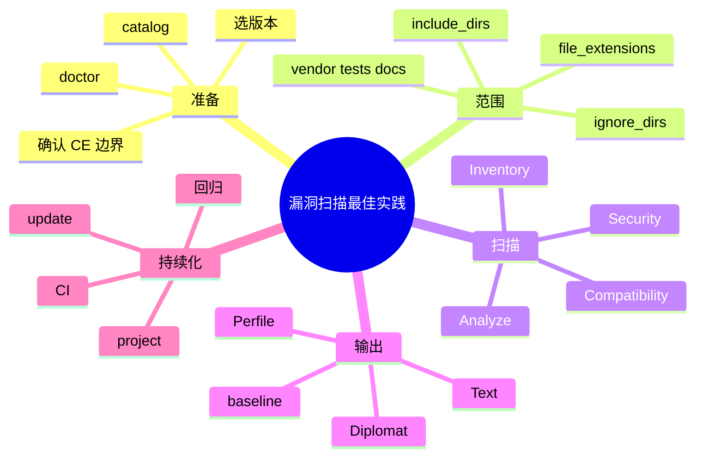

# 记忆卡片摘要（快速复习版）

## 1. 大纲（压缩版）

- 用 Exakat 做漏洞扫描时，目标该怎么设
- 扫描前怎么做范围控制
- ruleset 怎么选
- 如何减少噪音和误报
- 如何接入 CI/CD
- 如何处理历史债务和新增问题
- CE 场景下的现实最佳实践

## 2. 思维导图（Mermaid）



## 3. 重要知识点（必须记住）

- Exakat 不是专门只做“漏洞签名扫描”的工具，它更像面向 PHP 的综合静态分析引擎；所以做漏洞扫描时，要主动裁剪范围和目标，而不是无脑全开所有规则。[来源1][来源2]
- 官方 `Scoping` 与 `Configuration` 文档明确支持通过 `ignore_dirs`、`include_dirs`、`file_extensions`、`ignore_rules` 等方式控制范围和噪音。[来源3][来源4]
- 当前 CE 本地 `catalog` 可见 `Security`、`Analyze`、`CompatibilityPHP*`、`Inventory` 等 ruleset，这些已经足以构建基础漏洞审计流水线。[来源5]
- `baseline` 命令可以把“历史问题”和“新问题”拆开，这是漏洞治理而不是一次性扫描的关键动作。[来源6]
- `project` 是完整审计总控，`update -> project -> report` 是持续扫描的核心闭环。[来源7]
- 在大项目里，比“多扫一点”更重要的是“先把 vendor、tests、生成目录、文档目录和非目标 PHP 文件处理干净”，否则噪音会压垮团队。[来源3][来源4]

## 4. 难点 / 易混点

- 安全扫描不等于只跑 `Security` ruleset。
- 误报治理主要靠范围控制和结果分层，不是靠人工盲读所有结果。
- `baseline` 不是可选锦上添花，而是持续治理的核心。
- CE 足够做基础安全审计，但必须接受它是社区子集，不是官方全量产品。

## 5. QA 快速复习卡片

- Q: 做漏洞扫描时是不是只跑 `Security` 就行？
  A: 不一定。很多安全相关坏味道也可能落在 `Analyze`、`Structures`、`Php`、`Compatibility` 中。

- Q: 第一步最该做什么？
  A: 先控制扫描范围，把 `vendor`、`tests`、`docs`、生成目录等处理好。

- Q: 为什么要用 baseline？
  A: 因为团队治理最怕“老问题和新问题混成一锅”，baseline 能帮你先盯新增风险。

- Q: CE 能不能做工程化漏洞扫描？
  A: 能做基础版，而且很适合做 PHP 安全审计底座；但要明确它不是官方全部能力。

## 6. 快速复现步骤（最短路径）

1. `doctor` 确认运行环境。[来源2]
2. `catalog` 确认当前 CE 实际 ruleset/report 边界。[来源5]
3. 编写 `.exakat.yaml`，先控制 `ignore_dirs`、`include_dirs`、`file_extensions`。[来源4]
4. 首次跑 `project`
5. 用 `baseline save` 冻结当前债务
6. 后续进入 `update -> project -> report` 循环，并只追新增高风险问题

---

# 学习笔记正文（详细版）

## 0. 学习目标、读者画像与假设

- 技术：`Exakat 在漏洞扫描工程中的落地实践`
- 学习目标：把“怎么把 Exakat 变成真实可用的 PHP 安全扫描流水线”讲清楚
- 读者水平：默认会基本命令行和 Git，不假设做过大规模代码安全治理
- 版本范围：
  - 当前 CE 可见 ruleset：`Security`、`Analyze`、`CompatibilityPHP74/80/81/82/83`、`Inventory` 等
  - 当前 CE 可见 report：`Text`、`Perfile`、`Perrule`、`Diplomat`、`CompatibilityPHP*` 等
- 假设与限制：
  - 这里讲的是“Community Edition 可行路线”。

## 1. 先校准目标：Exakat 在漏洞扫描里最适合做什么

Exakat 非常适合做这三件事：

1. **发现 PHP 代码中的危险实践和安全坏味道**
   - 动态 SQL
   - 错误暴露
   - 危险语言结构
   - 类型与逻辑错误

2. **发现语言版本变化引入的兼容/行为风险**
   - 这些问题有时会间接变成安全问题，例如输入验证、序列化、加解密、错误处理行为变化

3. **给团队提供结构化治理入口**
   - 哪些问题是新增的
   - 哪些目录最脏
   - 哪些规则最常命中

它不一定最适合做什么？

- 不一定是“最强的污点传播漏洞挖掘器”
- 不一定是“开箱即用就能做零误报 SAST”
- 不一定是“替代所有专门的安全工具”

所以正确姿势不是把它当“唯一安全工具”，而是把它当：

**PHP 代码安全审计底座 + 持续质量治理工具。**

## 2. 第一步永远不是开扫，而是做边界管理

这是整个工程里最容易被忽略、却最能决定成败的一步。

### 2.1 为什么范围控制比规则数量更重要

如果你直接把整个仓库都丢进去，常见后果是：

- `vendor` 第三方依赖把结果淹没
- `tests` 测试夹具产生大量不重要问题
- `docs`、`examples`、生成代码、迁移脚本引入噪音
- 团队第一天看到几千条结果，直接放弃

所以真正成熟的做法不是“先多扫”，而是“先扫准”。

### 2.2 官方给了哪些范围控制能力

官方 `Configuration` 和 `Scoping` 文档明确支持：[来源3][来源4]

- `ignore_dirs`
- `include_dirs`
- `file_extensions`
- `ignore_rules`

这几项已经足够构建第一版工程筛选层。

### 2.3 一个实用的第一版范围策略

对典型 PHP Web 项目，我建议初始就忽略：

- `/vendor`
- `/tests`
- `/docs`
- `/media`
- `/storage`
- `/cache`
- 构建产物目录
- 自动生成代码目录

然后只保留：

- 核心业务源码目录
- 关键配置和启动入口
- 与请求处理、数据库访问、模板渲染、认证鉴权相关的 PHP 代码

### 2.4 教学版 `.exakat.yaml` 示例

下面这个例子不是官方原样复制，而是面向漏洞扫描实践整理后的教学版：

```yaml
project: myapp
project_name: My App
project_rulesets:
  - Security
  - Analyze
  - CompatibilityPHP82
project_reports:
  - Text
  - Perfile
  - Diplomat
file_extensions: php,phtml,inc
include_dirs:
  - /
ignore_dirs:
  - /vendor
  - /tests
  - /docs
  - /storage
  - /cache
ignore_rules:
  - Structures/AddZero
```

这个配置传达的是一种策略：

- 安全为主：`Security`
- 常见质量/逻辑问题一起看：`Analyze`
- 顺便检查目标运行版本风险：`CompatibilityPHP82`
- 报告优先选可消费性高的格式

## 3. ruleset 怎么选，才叫“漏洞扫描”而不是“结果大杂烩”

### 3.1 第一层：`Security`

这是显然的起点。  
它包含最直接的安全坏味道和危险实践。

### 3.2 第二层：`Analyze`

为什么漏洞扫描不应只跑 `Security`？

因为真实漏洞并不总是用“安全规则”这个标签出现。  
很多导致漏洞的前置条件，可能藏在：

- 逻辑错误
- 参数错误
- 资源检查缺失
- 危险语言结构
- 未定义行为

而 `Analyze` 往往能捕捉这类“安全前置风险”。

### 3.3 第三层：`CompatibilityPHP*`

很多团队忽略这一层，但实际上：

- 版本变化
- 弃用函数
- 默认行为改变

都可能把旧代码推向新的风险状态。

如果你的生产环境正在升级 PHP，大概率应把目标版本的 Compatibility ruleset 一起带上。

### 3.4 第四层：`Inventory`

它不一定直接报漏洞，但很适合做“摸底”：

- 这个项目用了哪些危险函数
- 哪些特性出现频率高
- 哪些目录最值得重点审查

对于第一次接触陌生 PHP 项目的安全团队，这层非常有价值。

### 3.5 什么时候考虑 `All`

只有在你：

- 已经做好范围控制
- 已经有足够计算资源
- 已经准备好做结果分层
- 已经接受“第一轮结果可能非常多”

时才考虑。

否则直接 `All`，大多数团队只会被噪音击穿。

## 4. 输出策略：报告不是越多越好，而是越能驱动修复越好

### 4.1 `Text`

最适合：

- CI
- diff
- grep
- 机器后处理

优点是简单、直接、可接流水线。

### 4.2 `Perfile`

最适合：

- 代码负责人按文件维度分派修复
- 快速找“哪个文件最脏”

### 4.3 `Perrule`

最适合：

- 做专项治理，比如“本周只治 SQL 相关问题”

### 4.4 `Diplomat`

在当前 CE 可见报告中，它是比较适合人类阅读的综合视图之一。[来源5]

所以实战里我常建议首轮至少保留：

- `Text`
- `Perfile`
- `Diplomat`

这样你同时有：

- 机器消费视图
- 文件责任视图
- 管理层/审计视图

## 5. 误报治理：真正的重点不是“删规则”，而是“三层过滤”

### 5.1 第一层：先过滤目录

这一步收益最大。

### 5.2 第二层：再过滤规则

当你确认某些规则与当前目标不匹配时，再用 `ignore_rules` 临时排除。  
不要一开始就大面积屏蔽规则，因为那样你往往是在掩盖范围管理失败。

### 5.3 第三层：最后做人审分级

不是所有命中都要同一天修。  
建议至少分成：

- 高优先：直接危险实践、用户输入相关、数据库/命令/文件/模板边界相关
- 中优先：可能放大为安全问题的逻辑缺陷
- 低优先：结构坏味道、长期维护问题

## 6. baseline：为什么它是持续治理的关键

### 6.1 没有 baseline 会发生什么

首次扫描老项目时，常见情况是：

- 一次出来几百上千条结果
- 团队根本不可能一口气消化

如果你每次都让开发面对“历史债务 + 新引入问题”的总和，大家很快会对扫描结果失去信任。

### 6.2 baseline 的正确使用方式

推荐流程：

1. 首次做相对完整的扫描
2. 评估并接受当前存量债务
3. 用 `baseline save <name>` 保存基线
4. 之后主要盯：
   - 新增高危问题
   - 被修掉的问题

这和安全治理中的“冻结存量，追新增”是同一思路。

### 6.3 为什么这对团队特别重要

因为安全治理的核心不是“第一次报告有多华丽”，而是：

- 新风险不要继续流入主干
- 旧风险能逐步下降

baseline 正是在帮你把这件事制度化。

## 7. CI/CD 接入：推荐的最小闭环

### 7.1 初级闭环

适用于先跑起来：

1. `doctor`
2. `init`
3. `project`
4. `report -format Text`
5. 存档结果

### 7.2 中级闭环

适用于团队协作：

1. 项目根放 `.exakat.yaml`
2. 固定 ruleset
3. 固定 ignore/include
4. 每日或每周 `update -> project`
5. 用 `baseline` 区分新旧问题
6. 只对新增高危问题设阈值

### 7.3 高级闭环

适用于大项目或平台化：

1. 按业务线/目录拆扫描任务
2. 结果入统一汇总系统
3. 用 `Perfile` / `Perrule` 驱动责任归属
4. 将高危规则映射到告警系统
5. 对关键项目再叠加其他安全工具交叉验证

## 8. 大型项目实践：怎么避免“扫不动”“看不完”“修不掉”

### 8.1 扫不动：先缩范围

- 先扫核心业务目录
- 后扫外围工具目录

### 8.2 看不完：先分层输出

- 先看 `Security`
- 再看 `Analyze`
- 再看 `Compatibility`

### 8.3 修不掉：先定制度

- baseline 冻结存量
- 新增高危问题必须不过主干
- 每个迭代顺手消一部分历史问题

### 8.4 不要让结果只停留在安全团队

最好的报告，不是安全同学自己看懂，而是：

- 开发知道怎么修
- 负责人知道先修哪批
- 管理者知道趋势有没有改善

所以报告格式和分发方式，必须围绕“修复动作”设计。

## 9. CE 场景下的现实建议

Community Edition 很适合做：

- PHP 项目安全体检底座
- 版本升级前风险摸底
- 长期代码坏味道和危险实践治理
- 规则学习和二次开发实验

但也要接受现实：

- 它不是官方全部规则和全部报告
- 某些高级 Cobbler/报告可能只在 Enterprise/Cloud
- 你要自己承担更多配置、维护和筛噪工作

所以 CE 最适合的组织画像通常是：

- 技术能力不错
- 接受自己做一点配置治理
- 重视 PHP 代码质量与安全
- 不急着追求“一键全自动平台化”

## 10. 给非科班读者的最终直白总结

把 Exakat 用在漏洞扫描工程里，最容易犯的错是“把它当成一个按下按钮就给你准确答案的安全雷达”。更现实的做法是把它当成一个很强的 PHP 代码审计底座：它能帮你系统地读代码、找危险实践、做版本风险扫描、给出结构化结果，但前提是你先把范围管好、目标定清楚、报告分层、历史问题基线化。对团队来说，真正重要的不是第一次扫出多少条问题，而是从那之后，新增高危问题能不能持续下降。Exakat 在这件事上真正的价值，不只是“发现漏洞”，而是让 PHP 安全治理有了稳定、可重复、可演进的工程流程。

## 11. 延伸学习路径（官方优先）

- 先读：`User/Configuration`
- 再读：`User/Scoping`
- 再读：`Gettingstarted/Bare` / `Docker`
- 进阶：把 `baseline`、`status`、`catalog` 纳入团队工作流

---

# 练习与复习闭环

## 1. 分层练习

### 基础练习

- 解释为什么漏洞扫描不能一上来就全仓库全规则全开。
- 解释为什么 `Security` ruleset 不一定足够。
- 解释 baseline 的核心价值。

### 应用练习

- 给一个典型 PHP 项目写出第一版 `.exakat.yaml`。
- 设计一个“新增高危问题阻断”的简单 CI 规则。

### 综合练习

- 为一个已有 10 年历史的老 PHP 项目设计 4 周治理计划：
  - 第 1 周做什么
  - 第 2 周做什么
  - 第 3 周做什么
  - 第 4 周怎么验收

## 2. 动手任务（带验收标准）

- 任务：输出一份团队级 Exakat 安全扫描 SOP。
- 验收标准：
  - 必须包含首次扫描、baseline、持续更新、结果分层
  - 必须明确目录过滤策略
  - 必须说明 CE 能力边界

## 3. 常见误区纠偏

- 误区：扫描规则越多越好。
  正解：没有范围和目标管理，规则越多噪音越大。

- 误区：历史问题太多就说明工具没用。
  正解：历史问题多恰恰说明需要 baseline 和持续治理，而不是放弃工具。

- 误区：安全团队自己看报告就够了。
  正解：工程治理必须把结果转成开发可执行动作。

## 4. 复习节奏建议

- Day 1：记住“先范围控制，再谈规则”
- Day 3：复习推荐 ruleset 组合
- Day 7：复习 baseline 和持续闭环
- Day 14：尝试写一份适合你团队的最小 SOP

## 5. 自测题与参考答案（简版）

- 题目1：为什么说 `vendor`、`tests` 这类目录的过滤优先级很高？
  参考答案：因为它们最容易制造大量低价值噪音，直接影响团队对结果的接受度。

- 题目2：首次扫描老项目时最重要的治理动作是什么？
  参考答案：做 baseline，把历史债务和新增问题区分开。

- 题目3：为什么漏洞扫描时推荐同时考虑 `Security` 和 `Analyze`？
  参考答案：因为很多安全前置风险不一定只出现在安全标签规则里。

---

# 参考来源与版本说明

## 官方来源（优先）

1. [官方 Overview 文档](https://exakat.readthedocs.io/en/latest/User/Overview.html) - 访问日期：2026-03-28
2. [官方 Installation 文档](https://exakat.readthedocs.io/en/latest/Administrator/Installation.html) - 访问日期：2026-03-28
3. [官方 Scoping 文档](https://exakat.readthedocs.io/en/latest/User/Scoping.html) - 访问日期：2026-03-28
4. [官方 Configuration 文档](https://exakat.readthedocs.io/en/latest/User/Configuration.html) - 访问日期：2026-03-28
5. 本地实测 `php /tmp/exakat-ce/exakat catalog -json` - 实测日期：2026-03-28
6. [源码 `Tasks/Baseline.php`](https://github.com/exakat/exakat-ce/blob/master/library/Exakat/Tasks/Baseline.php) - 访问日期：2026-03-28
7. [源码 `Tasks/Project.php`](https://github.com/exakat/exakat-ce/blob/master/library/Exakat/Tasks/Project.php) - 访问日期：2026-03-28

## 第三方来源（按采信程度标注）

- 本文未依赖第三方非官方来源做关键结论裁决。

## 关键结论引用映射

- [来源1] Exakat 在安全、质量、版本迁移方面的官方定位
- [来源2] 运行 Exakat 的基础环境要求
- [来源3] 目录范围控制思路
- [来源4] 配置级过滤与自定义规则集
- [来源5] 当前 CE 可用 ruleset / report 实测边界
- [来源6] baseline 机制
- [来源7] 持续扫描闭环核心命令

## 官方文档章节映射与重要例子保留

- `User/Overview` -> 本文第 1 节“Exakat 在漏洞扫描中的定位”
- `User/Scoping` -> 本文第 2 节“范围控制”
- `User/Configuration` -> 本文第 2 节和第 3 节“规则与配置”
- `Getting Started` / `Project workflow` -> 本文第 7 节“CI/CD 闭环”

## 冲突点与裁决

- 冲突点：有些团队把 Exakat 当成“纯安全扫描器”，有些又把它当“纯质量工具”。
- 来源A：官方 Overview 强调质量、安全、兼容性、库存等多目标。[来源1]
- 来源B：当前 CE ruleset 中同时存在 `Security`、`Analyze`、`Compatibility`、`Inventory`。[来源5]
- 本文采用结论：漏洞扫描是 Exakat 的重要使用方式，但最佳实践是把它作为综合静态分析底座来用。

## 技术版本与访问日期

- Exakat CE 本地实测版本：`2.6.7`
- 实测日期：`2026-03-28`

