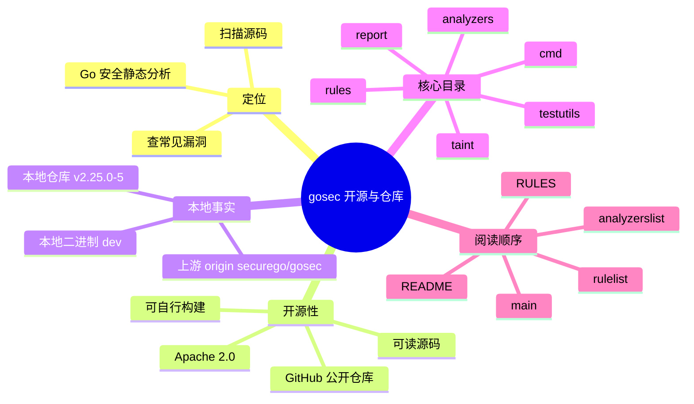

# 记忆卡片摘要（快速复习版）

## 1. 大纲（压缩版）
- `gosec` 是什么，它解决什么问题
- 它是不是开源软件，证据在哪里
- 本地仓库和本地二进制分别代表什么
- 仓库目录怎么读，哪些目录最重要
- 从普通使用者视角，怎样快速判断一个安全工具“靠不靠谱”
- 第一次读 gosec 仓库时的最短路径

## 2. 思维导图（Mermaid）


## 3. 重要知识点（必须记住）
- `gosec` 是 Go 语言安全静态分析工具，核心工作不是“运行你的程序”，而是“读源码并推断风险”。[来源1][来源4]
- 它是开源软件，而且不是只放了二进制；规则实现、分析框架、报告格式、测试样例都在仓库里。[来源1][来源2][来源3][来源4]
- 本地仓库和本地二进制不是同一件事。本地仓库是源码快照；本地二进制是你机器上某次构建出来的可执行文件。你这里的二进制版本字符串是 `dev`，说明它不是一个带正式版本号的发布构建。[来源11]
- `gosec` 不是只有“几条正则规则”，它把能力分成 AST 规则、SSA 分析器、taint 数据流分析三层。[来源1][来源5][来源6][来源7]
- 判断一个 SAST 工具是否值得信任，不能只看“有没有扫描结果”，还要看规则来源、源码可审计性、测试样例、CWE 映射、报告格式和工程集成能力。[来源1][来源2][来源3][来源9]

## 4. 难点 / 易混点
- “开源”不等于“没有误报”。开源代表你能审阅实现、理解行为、自己修规则，但不代表工具永远准确。
- “本地仓库版本”不等于“本地二进制版本”。你本地仓库接近 `v2.25.0`，但二进制打印的是 `dev`。
- “规则仓库”不只是在 `rules/` 目录。`analyzers/` 和 `taint/` 也属于规则能力的一部分。
- “静态分析工具”不等于“只做文本匹配”。`gosec` 会加载包、读类型信息、构建 SSA，甚至做污点传播。

## 5. QA 快速复习卡片
- Q: `gosec` 是不是开源？
  A: 是。上游仓库是公开的 `securego/gosec`，许可证是 Apache License 2.0。[来源1][来源10]
- Q: 我怎么证明它不是黑盒？
  A: 因为 CLI 入口、规则定义、污点分析实现、报告写出逻辑、测试样例都能直接在仓库里查看。[来源2][来源4][来源5][来源6][来源7]
- Q: 为什么我本地 `gosec -version` 看到的是 `dev`？
  A: 因为当前 PATH 里的二进制没有注入正式版本元数据；这常见于本地源码构建或开发构建。[来源11]
- Q: 如果我是非科班，先看哪些目录最划算？
  A: 先看 `README.md`，再看 `RULES.md`，然后是 `cmd/gosec/main.go`、`rules/rulelist.go`、`analyzers/analyzerslist.go`。

## 6. 快速复现步骤（最短路径）
1. 打开本地仓库 `README.md` 和 `RULES.md`，建立工具定位和规则全景。
2. 运行 `gosec -help` 和 `gosec -version`，确认本地 CLI 行为和当前二进制元数据。
3. 查看 `git remote -v`、`git describe --tags --always`、`git rev-parse HEAD`，确认上游地址和本地源码快照。
4. 沿着 `cmd/gosec/main.go -> rules/rulelist.go -> analyzers/analyzerslist.go -> taint/analyzer.go` 读一遍主链路。

---

# 学习笔记正文（详细版）

## 0. 学习目标、读者画像与假设
- 技术：`gosec`
- 学习目标：从本地仓库和本地二进制出发，弄清 `gosec` 的开源属性、仓库结构、能力边界和阅读入口。
- 读者水平：默认是“会用命令行，但不是安全工程背景，也未必学过编译原理”的读者。
- 时间预算：标准版，适合 2 到 3 小时系统阅读。
- 版本范围：本地仓库 HEAD 为 `844b1703bf4fd59b110600317422f515cac6d603`，`git describe` 为 `v2.25.0-5-g844b170`；本地 PATH 中二进制 `gosec -version` 输出为 `dev`。[来源11]
- 运行环境：Linux，本地 shell 可用。
- 假设与限制：本笔记以本地仓库和本地二进制实测为主，同时引用官方上游仓库文件链接；不主张用记忆替代源码。

## 1. 背景与用途（从读者视角）

如果你是普通 Go 开发者，`gosec` 可以理解成一个“看你源码里有没有明显安全坑”的助手。它不是杀毒软件，也不是运行时防火墙；它干的事更像代码审稿人，只不过这个审稿人特别盯安全问题，比如：

- 有没有把密码、Token、私钥之类的东西硬编码在代码里。
- 有没有把用户输入直接拼成 SQL。
- 有没有用不安全的哈希、随机数或 TLS 配置。
- 有没有把 HTTP 请求参数一路传到危险函数，形成 SSRF、命令注入、路径穿越等问题。

这类工具属于 SAST，也就是 Static Application Security Testing，中文常说“静态应用安全测试”。“静态”二字很关键，意思是它在程序运行前看源码，不要求真的把业务跑起来。[来源1][来源4]

对非科班读者来说，一个实用理解是：

- 代码编辑器里的语法报错，主要是在告诉你“代码写不通”。
- 单元测试，主要是在告诉你“功能行为对不对”。
- `gosec` 这类工具，主要是在告诉你“这样写会不会留下安全坑”。

## 2. `gosec` 到底是不是开源

### 2.1 最直接的答案

是，而且证据很充分。

第一层证据是许可证。仓库根目录存在 `LICENSE.txt`，内容是 Apache License 2.0，这是一种非常常见、商业和开源项目都大量使用的宽松许可证。[来源10]

第二层证据是公开上游。你本地仓库的 `git remote -v` 指向 `https://github.com/securego/gosec`，说明这不是只在本机上存在的私有快照，而是一个有明确上游的公共项目。[来源11]

第三层证据是源码完整性。仓库里不只是一个 `README` 加二进制，而是包含：

- CLI 入口
- 规则实现
- SSA 分析器
- taint 分析器
- 报告输出模块
- 测试样例
- 开发文档

这意味着它不仅“能下载”，而且“能审阅、能构建、能贡献”。这才是开源工具真正有价值的地方。[来源2][来源3][来源4][来源5][来源6][来源7]

### 2.2 开源对普通使用者有什么现实价值

很多人第一次听到“开源”时，会把它理解成“免费”。这当然没错，但不够重要。对安全工具来说，开源真正重要的是下面四点：

第一，你可以知道它到底怎么判断漏洞。比如 G201 为啥报 SQL 拼接，G704 为啥判定 SSRF，你都能顺着源码看清楚，而不是靠猜。[来源2][来源6][来源8]

第二，你可以判断误报是不是工具问题。安全工具最怕“你看到结果但不知道为什么”。开源之后，你可以去看规则匹配条件，判断这是误报、边界条件，还是你对规则理解不够。

第三，你可以自己扩展。官方开发文档明确给出了新增 AST 规则、SSA 分析器、taint 规则的步骤，这说明它不是封闭产品，而是一个可扩展框架。[来源3]

第四，你可以稳定集成。因为你知道 CLI 如何生成报告、怎么计算退出码、怎么支持 SARIF、JSON、GitHub Action，所以它适合接进 CI/CD，而不是只能手工点着玩。[来源1][来源4]

### 2.3 开源不代表什么

也要讲清楚边界，避免神化工具。

- 开源不代表 100% 准确。任何静态分析都会有误报和漏报。
- 开源不代表默认配置就是你团队的最佳配置。规则阈值、排除路径、测试文件是否扫描，都要自己定。
- 开源不代表一定维护得快。你还要看测试、文档、发布、社区活跃度。
- 开源不代表你可以不懂原理就盲信结果。恰恰相反，越是开源，越值得你读实现。

## 3. 本地仓库与本地二进制：两条线要分开看

这是很多初学者第一次排查工具行为时会混淆的点。

### 3.1 本地仓库是什么

本地仓库是源码。你这里的本地仓库位于：

`/home/nyn/Desktop/Projects/SAST/sast_tools/gosec`

它当前的提交是：

- commit: `844b1703bf4fd59b110600317422f515cac6d603`
- 描述串：`v2.25.0-5-g844b170`

这说明它接近 `v2.25.0`，并且在这个标签之后还有若干提交。[来源11]

### 3.2 本地二进制是什么

本地二进制是 PATH 中可执行的 `gosec`。你本机运行 `gosec -version` 得到：

```text
Version: dev
Git tag:
Build date:
```

这说明你当前真正执行的程序没有带上正式发布版的版本元数据。它可能是：

- 本地从源码构建的开发版
- 某个中间态构建
- 没有注入 `Version/GitTag/BuildDate` 的构建产物

这个差别非常重要。因为当你说“我现在用的是 gosec 什么版本”时，必须区分：

- “我阅读的是哪份源码”
- “我执行的是哪个二进制”

如果这两者不一致，你可能会遇到“README 写的是 A，但命令行为像 B”的情况。

### 3.3 非科班可以怎么理解这个差异

把源码仓库想成“菜谱”，把二进制想成“已经做好的菜”。你手里拿的菜谱版本，和你桌上那盘菜，不一定是同一版。只有你同时确认仓库 commit、构建方式、二进制版本输出，才能把“看到的代码”和“机器实际运行的程序”对齐。

## 4. 仓库结构怎么读

下面是最值得你先读的目录和文件。重点不是“背目录树”，而是知道每块地盘负责什么。

### 4.1 顶层文档区

- `README.md`
  这是用户入口，告诉你它是什么、怎么装、怎么跑、怎么输出报告、怎么抑制误报。[来源1]
- `RULES.md`
  这是规则总表，告诉你有哪些规则、属于 AST/SSA/Taint 哪一类、哪些规则支持配置。[来源2]
- `DEVELOPMENT.md`
  这是开发者入口，告诉你如何新增规则、分析器和 taint 规则。[来源3]
- `LICENSE.txt`
  这是开源许可证文件。[来源10]

### 4.2 执行入口区

- `cmd/gosec/main.go`
  这是 CLI 主入口。你在命令行里加的参数，最后大多在这里被解析、校验、转成配置，然后驱动整个扫描流程。[来源4]
- `goanalysis/analyzer.go`
  这是另一条入口，面向 `golang.org/x/tools/go/analysis` 生态。你可以把它理解为“把 gosec 封装成 Go 标准分析器接口”。[来源6]

### 4.3 规则实现区

- `rules/`
  放 AST 规则。更适合做“看到这种语法结构就报警”的检查，比如弱随机数、危险 HTTP serve 调用、部分 SQL 拼接模式等。[来源5]
- `analyzers/`
  放 SSA 分析器和 taint 分析器定义。更适合做“要理解控制流、数据流、类型关系”的检查。[来源6][来源8]
- `taint/`
  放污点分析底层实现。它不是某一条业务规则，而是多个 G7xx 规则共享的“数据流引擎”。[来源7]

### 4.4 支撑区

- `issue/`
  放 Issue 结构、CWE 映射、代码片段截取逻辑。[来源9]
- `report/`
  放 text/json/yaml/csv/html/junit/sarif 等输出格式实现。
- `testutils/`
  放大量样例代码。对学习者特别重要，因为这里能直接看到“什么代码会被判漏洞，什么不会”。[来源3]

## 5. 读仓库时最该先建立的脑图

对初学者来说，不要一上来就扎进某条复杂规则。先建立下面这张脑图：

第一层：它是一个 Go 安全扫描工具。

第二层：它有两个使用面。

- 用户面：CLI、配置文件、输出报告、CI 集成。
- 开发面：规则定义、分析器实现、测试样例、CWE 映射。

第三层：它有三种主要检测方式。

- AST：看语法树形状。
- SSA：看更接近程序执行逻辑的中间表示。
- Taint：看不可信输入能不能流到危险点。

第四层：它的结果最终会变成 Issue，再按格式输出到终端、JSON、SARIF 等报告中。[来源1][来源4][来源5][来源6][来源7][来源9]

这张脑图一旦有了，后面你无论是学 CLI、学规则、学原理，都会更顺。

## 6. 初次阅读 gosec 仓库的推荐顺序

### 6.1 第一步：先读 README，不要先啃源码

这是为了先拿“用户视角”。如果你不知道一个工具是给谁用、解决什么问题、怎么输出结果，直接读源码很容易失焦。[来源1]

### 6.2 第二步：读 RULES.md，知道它管什么、不管什么

这一步很关键，因为它帮你区分：

- 哪些是通用安全编码问题
- 哪些是注入类问题
- 哪些是文件系统和权限问题
- 哪些是加密/TLS 问题
- 哪些是 taint 规则

也能帮你避免一个常见误会：以为所有规则都是“一个原理”。实际上它们的实现层次差异很大。[来源2]

### 6.3 第三步：读 `cmd/gosec/main.go`

这样你就知道一条命令是如何变成一次扫描的：

- 参数解析
- 配置加载
- 规则/分析器装配
- 包路径收集
- 分析执行
- 过滤、排序、输出、退出码

这一步能帮你把 CLI 和内部实现连起来。[来源4]

### 6.4 第四步：读 `rules/rulelist.go` 和 `analyzers/analyzerslist.go`

这两处就像总目录，告诉你“工具里到底有哪些规则”和“它们挂在哪个系统里”。[来源5][来源6]

### 6.5 第五步：再挑具体规则看

推荐先看简单规则，再看复杂规则。比如：

- 简单：`rules/rand.go`、`rules/http_serve.go`
- 中等：`rules/sql.go`
- 复杂：`analyzers/sqlinjection.go` 配合 `taint/analyzer.go`

这样你不会一开始就被复杂数据流吓住。

## 7. 从“可信工具”的角度看 gosec 仓库

如果你不是安全研究员，也不打算给 gosec 贡献代码，依然值得学会下面这套判断框架：

### 7.1 有没有公开许可证

有，Apache 2.0。[来源10]

### 7.2 有没有公开上游和完整源码

有，`securego/gosec`。[来源11]

### 7.3 有没有规则文档和配置文档

有，`README.md` 和 `RULES.md` 都比较完整。[来源1][来源2]

### 7.4 有没有测试样例

有，而且不少。`testutils/` 下几乎是教学宝库。[来源3]

### 7.5 有没有工程集成能力

有，支持 GitHub Action、SARIF、JSON、HTML、SonarQube 等输出。[来源1][来源4]

### 7.6 有没有扩展路径

有，开发文档明确写了如何新增 AST/SSA/Taint 规则。[来源3]

这套框架其实不只适用于 gosec，也适用于你判断其他开源 SAST 工具是否值得进入生产线。

## 8. 官方文档章节映射与重要例子保留检查

| 官方章节 / 文件 | 本文对应章节 | 说明 |
|---|---|---|
| `README.md` 中的 Features | 第 1、4、5 节 | 用来定义工具定位和能力边界 |
| `README.md` 中的 License | 第 2 节 | 作为开源性核心证据 |
| `README.md` 中的 Project status / Install / Quick start | 第 1、6、7 节 | 用来说明它不是只存在于本机的孤立工具 |
| `RULES.md` 的规则分类 | 第 4、5、6 节 | 用来解释仓库内部为什么有 `rules/`、`analyzers/`、`taint/` |
| `DEVELOPMENT.md` 的 adding rules and analyzers | 第 2、4、7 节 | 用来证明仓库可扩展、不是黑盒 |
| `cmd/gosec/main.go` | 第 3、4、6 节 | 用来确认 CLI 真正如何落到实现 |

保留的重要例子：

- 官方 Quick start 的 `gosec ./...` 思路，被保留在“最短路径”和后续 CLI 文档中。[来源1]
- 官方对 AST / SSA / Taint 的三分法，被保留在本篇第 5 节和后续“原理篇”中。[来源1][来源2][来源3]

## 9. 延伸学习路径（官方优先）

- 先读：`README.md`，建立用户视角。[来源1]
- 再读：`RULES.md`，建立规则全景。[来源2]
- 再做：把 `cmd/gosec/main.go` 从头到尾读一遍，理解命令行行为。[来源4]
- 进阶：阅读 `analyzers/sqlinjection.go` 和 `taint/analyzer.go`，理解为什么 G701 比简单 SQL 拼接规则更强。[来源7][来源8]
- 实战：拿自己的 Go 服务跑一遍 `gosec -fmt=json` 和 `gosec -fmt=sarif`，把结果导入 CI。

---

# 练习与复习闭环

## 1. 分层练习

### 基础练习
- 用一句话解释 `gosec` 和单元测试的区别。
- 说清楚“本地仓库版本”和“PATH 中二进制版本”的区别。
- 找出仓库中三个最重要的文档文件，并说出各自用途。

### 应用练习
- 进入本地仓库，找出 AST 规则总表和 SSA/Taint 分析器总表所在文件。
- 解释为什么 `testutils/` 对学习规则很重要。
- 用自己的话说明“开源安全工具真正的价值不只是免费”。

### 综合练习
- 假设你要把 `gosec` 介绍给团队中不懂安全的人，写出一段 200 字以内的介绍。
- 设计一条“第一次读 gosec 仓库”的路线，并说明顺序理由。

## 2. 动手任务（带验收标准）
- 任务：自己在本机执行 `gosec -help`、`gosec -version`、`git -C <repo> describe --tags --always`。
- 验收标准：你能回答三件事。
- 第一，这个工具对外暴露了哪些主要能力。
- 第二，你当前执行的二进制是否带正式版本号。
- 第三，你当前阅读的源码快照离哪个标签最近。

## 3. 常见误区纠偏
- 误区：有 GitHub 仓库就一定等于“我本机正在运行那版代码”。
  正解：必须把仓库 commit 和本地二进制版本输出对齐。
- 误区：规则都在 `rules/` 目录里。
  正解：`analyzers/` 和 `taint/` 也是规则能力的重要组成。
- 误区：开源就说明结果肯定对。
  正解：开源只是让你能验证、理解、修改，不是准确率保证。

## 4. 复习节奏建议
- Day 1：记住 `gosec` 的定位、上游仓库、许可证、三层检测体系。
- Day 3：重新浏览仓库结构，能凭记忆说出 `cmd/`、`rules/`、`analyzers/`、`taint/` 各做什么。
- Day 7：不看文档，口述一次从命令行到 Issue 输出的主链路。
- Day 14：尝试给团队同事讲解“为什么安全工具要优先选可审计的开源实现”。

## 5. 自测题与参考答案（简版）
- 题目 1：`gosec` 为什么能被称为开源而不是“只发布了一个免费二进制”？
  参考答案：因为它有公开上游、完整源码、许可证、开发文档、测试样例和可扩展机制。
- 题目 2：为什么本地 `gosec -version` 是 `dev` 仍然不影响你读仓库？
  参考答案：因为仓库和二进制是两条线，读仓库看的是源码快照，执行二进制看的是构建产物。
- 题目 3：第一次读 gosec，为什么不建议直接看复杂 taint 规则？
  参考答案：因为先建立用户视角和仓库全景，再读复杂实现，理解成本更低。

---

# 参考来源与版本说明

## 官方来源（优先）
1. [securego/gosec README](https://github.com/securego/gosec/blob/844b1703bf4fd59b110600317422f515cac6d603/README.md) - 基于本地仓库 commit `844b170` - 工具定位、特性、安装、使用说明。[来源1]
2. [securego/gosec RULES.md](https://github.com/securego/gosec/blob/844b1703bf4fd59b110600317422f515cac6d603/RULES.md) - 基于本地仓库 commit `844b170` - 规则分类和规则配置。[来源2]
3. [securego/gosec DEVELOPMENT.md](https://github.com/securego/gosec/blob/844b1703bf4fd59b110600317422f515cac6d603/DEVELOPMENT.md) - 基于本地仓库 commit `844b170` - 规则扩展与开发流程。[来源3]
4. [cmd/gosec/main.go](https://github.com/securego/gosec/blob/844b1703bf4fd59b110600317422f515cac6d603/cmd/gosec/main.go) - 基于本地仓库 commit `844b170` - CLI 入口与参数落地逻辑。[来源4]
5. [rules/rulelist.go](https://github.com/securego/gosec/blob/844b1703bf4fd59b110600317422f515cac6d603/rules/rulelist.go) - 基于本地仓库 commit `844b170` - AST 规则总表。[来源5]
6. [analyzers/analyzerslist.go](https://github.com/securego/gosec/blob/844b1703bf4fd59b110600317422f515cac6d603/analyzers/analyzerslist.go) - 基于本地仓库 commit `844b170` - SSA/Taint 分析器总表。[来源6]
7. [taint/analyzer.go](https://github.com/securego/gosec/blob/844b1703bf4fd59b110600317422f515cac6d603/taint/analyzer.go) - 基于本地仓库 commit `844b170` - taint 分析入口。[来源7]
8. [analyzers/sqlinjection.go](https://github.com/securego/gosec/blob/844b1703bf4fd59b110600317422f515cac6d603/analyzers/sqlinjection.go) - 基于本地仓库 commit `844b170` - G701 规则配置示例。[来源8]
9. [issue/issue.go](https://github.com/securego/gosec/blob/844b1703bf4fd59b110600317422f515cac6d603/issue/issue.go) - 基于本地仓库 commit `844b170` - Issue 结构与 CWE 映射。[来源9]
10. [LICENSE.txt](https://github.com/securego/gosec/blob/844b1703bf4fd59b110600317422f515cac6d603/LICENSE.txt) - 基于本地仓库 commit `844b170` - Apache 2.0 许可证。[来源10]
11. 本地命令实测：`git -C /home/nyn/Desktop/Projects/SAST/sast_tools/gosec remote -v`、`git -C /home/nyn/Desktop/Projects/SAST/sast_tools/gosec rev-parse HEAD`、`git -C /home/nyn/Desktop/Projects/SAST/sast_tools/gosec describe --tags --always`、`gosec -version` - 访问日期：2026-03-28 - 用途：确认上游地址、本地源码快照和本地二进制元数据。[来源11]

## 第三方来源（按采信程度标注）
1. [MITRE CWE](https://cwe.mitre.org/data/index.html) - 采信程度：高 - 用于解释 CWE 是什么，以及 gosec 为什么给每条规则挂 CWE。

## 关键结论引用映射
- [来源1] -> `gosec` 的官方定位、功能概述、安装/输出/集成能力。
- [来源2] -> 规则分类、AST/SSA/Taint 三分法、可配置规则列表。
- [来源3] -> 新增规则和分析器的开发流程，证明项目可扩展。
- [来源4] -> 命令行参数如何进入真正的执行路径。
- [来源5][来源6][来源7] -> 仓库不是“几条正则”，而是多层分析框架。
- [来源10] -> `gosec` 使用 Apache 2.0 许可证。
- [来源11] -> 本地仓库版本、上游 remote 与本地二进制 `dev` 输出。

## 冲突点与裁决（如有）
- 冲突点：本地仓库可描述为接近 `v2.25.0`，但本地二进制 `-version` 输出为 `dev`。
- 裁决依据：仓库事实以 `git describe --tags --always` 为准；本地可执行行为以 `gosec -version` 输出为准。
- 采用结论：学习源码时按本地仓库 commit `844b170` 理解；讨论本机实际运行程序时，明确它是开发构建 `dev`。

## 技术版本与访问日期
- 本地仓库访问日期：2026-03-28
- 本地仓库 commit：`844b1703bf4fd59b110600317422f515cac6d603`
- 本地仓库描述串：`v2.25.0-5-g844b170`
- 本地二进制版本输出：`dev`
