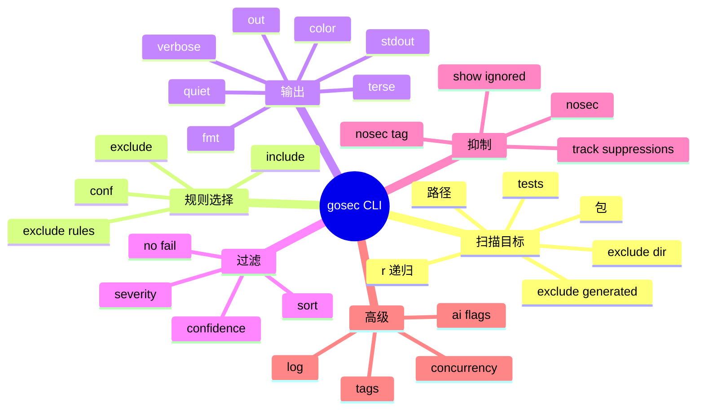

# 记忆卡片摘要（快速复习版）

## 1. 大纲（压缩版）
- `gosec` 命令的基本心智模型
- 最常用命令
- 参数按用途分组
- 每个参数的具体作用和常见搭配
- 退出码、过滤、抑制、输出格式
- 本地实测案例与排障

## 2. 思维导图（Mermaid）


## 3. 重要知识点（必须记住）
- `gosec` 的命令行不是“看到什么就做什么”，而是先解析参数，再加载配置，再装配规则和分析器，最后才真正扫描代码。[来源1][来源4]
- `-include` 和 `-exclude` 会同时影响 AST 规则和分析器，不是只影响某一侧。[来源4]
- `-severity` 和 `-confidence` 是“最小阈值过滤”，不是给 Issue 重新打分。[来源4]
- `-no-fail` 不会隐藏问题，只会让进程最终返回 `0`；这对 CI 集成很重要。[来源1][来源4][来源11]
- `-track-suppressions` 会把抑制信息放进结果里，但只有 JSON 和 SARIF 这种结构化格式最有价值。[来源1][来源4]
- 在受限环境里，`gosec` 的成败经常先取决于 Go 包加载环境，例如 `GOTOOLCHAIN`、`GOCACHE`、`GOMODCACHE` 是否可写，而不是规则本身。[来源11]

## 4. 难点 / 易混点
- `-exclude` 和 `--exclude-rules` 不是一回事。前者按规则 ID 全局排除，后者按“路径 + 规则组合”排除。
- `-nosec` 不是“启用 #nosec”，而是“忽略 #nosec 注释”，也就是把原本被压掉的问题重新报出来。
- `-verbose` 不是增加日志量，而是在 `-stdout` 场景下覆盖 stdout 的输出格式。
- `-quiet` 和 `-terse` 都会减少日志，但语义不完全一样：`-quiet` 更偏“没事就别出声”，`-terse` 更偏“只保留结果和摘要”。[来源4]

## 5. QA 快速复习卡片
- Q: 扫描整个模块最常用的写法是什么？
  A: `gosec ./...`
- Q: 想把结果写成 JSON 文件？
  A: `gosec -fmt=json -out=results.json ./...`
- Q: 想只跑某几条规则？
  A: `gosec -include=G101,G201,G401 ./...`
- Q: 想让 CI 不因为发现问题而失败？
  A: `gosec -no-fail ./...`
- Q: 想把被 `#nosec` 压掉的问题重新看出来？
  A: `gosec -nosec=true ./...`

## 6. 快速复现步骤（最短路径）
1. 先跑 `gosec -help`，确认你本机二进制有哪些参数和规则。
2. 用 `gosec ./...` 扫一次当前模块，建立默认行为印象。
3. 再试 `-fmt=json -out=results.json -stdout`，理解“写文件”和“打印到终端”的差别。
4. 用 `-include`、`-exclude`、`-severity`、`-confidence`、`-no-fail` 做几次对比。
5. 最后学 `#nosec`、`-nosec=true`、`-track-suppressions`。

---

# 学习笔记正文（详细版）

## 0. 学习目标、读者画像与假设
- 技术：`gosec` CLI
- 学习目标：理解 `gosec` 的命令行用法、参数分组、执行顺序、常见组合和工程场景中的实际效果。
- 读者水平：默认初学，知道终端命令，但未必清楚 SAST 工具常见参数设计。
- 时间预算：标准版 3 小时。
- 版本范围：命令行为以本机 `gosec -help`、`gosec -version` 与本地源码 `cmd/gosec/main.go` 为准。[来源4][来源11]
- 假设与限制：下文既引用官方文档，也引用本地实验；实验样例位于本地工作区 `.lab/sampleapp`。

## 1. 先建立一个最重要的心智模型

对于非科班读者，先不要背参数。先建立一条主线：

`gosec` 的命令执行，大致是下面这个顺序：

1. 读取命令行参数。
2. 把参数写进配置对象。
3. 根据 `include/exclude` 决定加载哪些规则和分析器。
4. 根据扫描目标收集 Go 包路径。
5. 调用 Go 包加载链路，拿到语法树、类型信息、SSA 等数据。
6. 运行 AST 规则和分析器。
7. 做路径排除、严重级别过滤、置信度过滤。
8. 生成 text/json/sarif 等报告。
9. 根据发现的问题和 `-no-fail` 决定退出码。[来源4]

这条主线很重要，因为它告诉你：很多参数并不是“扫描过程中随时生效”，而是在某个固定阶段生效。

举个例子：

- `-include=G401,G704` 是在“装配规则和分析器”阶段生效。
- `-severity=high` 是在“结果过滤”阶段生效。
- `-fmt=json` 是在“报告输出”阶段生效。

如果你理解了顺序，就不容易把参数的作用混在一起。

## 2. 最常用的基本命令

### 2.1 扫描当前模块全部包

```bash
gosec ./...
```

这是最常见的入口。`./...` 是 Go 生态里非常常见的写法，表示“当前目录及其子目录下的所有包”。[来源1]

### 2.2 生成 JSON 报告

```bash
gosec -fmt=json -out=results.json ./...
```

这适合后续自动处理，比如喂给 CI、平台、脚本或二次分析工具。

### 2.3 生成 SARIF 报告

```bash
gosec -fmt=sarif -out=results.sarif ./...
```

这是和 GitHub code scanning、一些安全平台打通时很常见的格式。[来源1]

### 2.4 只跑几条规则

```bash
gosec -include=G101,G201,G401 ./...
```

这适合做定向学习、逐步治理，或者在大仓库中先缩小范围。

### 2.5 排除几条规则

```bash
gosec -exclude=G104 ./...
```

适合临时缩小噪音。但注意，长期大面积全局排除通常不是好实践，后面最佳实践篇会详细讲。

## 3. 参数分组总览：先按“任务”记，不要按字母顺序记

官方帮助把参数按一长串列出来，但学习时更适合按用途分组：

### 3.1 扫描目标与范围
- `-r`
- `-tests`
- `-exclude-dir`
- `-exclude-generated`
- `-tags`

### 3.2 规则选择与配置
- `-include`
- `-exclude`
- `--exclude-rules`
- `-conf`
- `-enable-audit`

### 3.3 结果过滤与退出策略
- `-severity`
- `-confidence`
- `-sort`
- `-no-fail`

### 3.4 抑制与审计
- `-nosec`
- `-nosec-tag`
- `-show-ignored`
- `-track-suppressions`

### 3.5 输出与日志
- `-fmt`
- `-out`
- `-stdout`
- `-verbose`
- `-color`
- `-quiet`
- `-terse`
- `-log`

### 3.6 运行性能与高级功能
- `-concurrency`
- `-version`
- `-ai-api-provider`
- `-ai-api-key`
- `-ai-base-url`
- `-ai-skip-ssl`

## 4. 每个参数到底干什么

下面按组详细解释。为了让非科班读者能顺读，我不只写“字面意思”，还会写“它在哪个阶段生效”“什么时候该用”“容易踩什么坑”。

## 4.1 扫描目标与范围参数

### `-r`

作用：如果你没有显式写 `./...`，它会给目标目录补上递归扫描语义，也就是“在目标目录后追加 `./...`”。[来源4]

适合场景：
- 你更习惯写目录，不想每次都手打 `./...`。

容易踩坑：
- 它不是“从任何输入智能扩展一切路径”，而是一个比较简单的递归便利开关。

### `-tests`

作用：默认情况下，`gosec` 不扫描测试文件；加上这个参数后，测试文件也会进入扫描范围。[来源1][来源4]

适合场景：
- 你们测试代码也会接触真实密钥、SQL、HTTP mock、临时文件。
- 你正在做全仓安全治理，不想让测试代码成为死角。

不适合一上来就全开：
- 因为很多团队测试代码噪音很大，初期直接打开容易把真正高价值问题淹没。

### `-exclude-dir`

作用：排除目录，可重复指定多次。源码里默认已经排除了 `vendor` 和 `.git/`。[来源4]

适合场景：
- 仓库里有脚本、示例、生成产物、第三方镜像目录，不值得纳入正式治理。

常见误用：
- 把业务主目录直接排掉，短期清静，长期失真。

### `-exclude-generated`

作用：忽略带标准“generated code”注释的 Go 文件。[来源1][来源4]

适合场景：
- Protobuf、Mock、代码生成器输出太多，且你不希望把自动生成文件当成人工代码治理。

边界：
- 它依赖生成文件注释约定，不是万能“识别一切生成物”。

### `-tags`

作用：把 Go build tags 传入分析流程。[来源1][来源4]

为什么重要：
- 某些代码只在特定构建标签下编译。如果不传标签，`gosec` 看到的代码集合可能和线上真实构建不一致。

例子：

```bash
gosec -tags debug,enterprise ./...
```

## 4.2 规则选择与配置参数

### `-include`

作用：只加载指定规则 ID 列表。源码中它既会作用到 AST 规则，也会作用到分析器列表。[来源4]

适合场景：
- 做专项治理，比如先集中查硬编码密钥和 SQL 风险。
- 学习某几条规则时，降低干扰。

本地实测：
- 在实验样例里执行 `-include=G401,G114,G704`，最后只剩 1 个未被抑制的问题，因为 G401 和 G114 已被源内注释压掉，G704 仍然报出。[来源11]

### `-exclude`

作用：全局排除指定规则 ID。和 `-include` 一样，也会同步影响规则和分析器装配。[来源4]

适合场景：
- 临时屏蔽已知噪音，观察其他问题。

本地实测：
- 实验样例中 `-exclude=G104` 后，原本的 8 个问题降为 5 个，因为未处理错误这一类低优先级问题被整体去掉了。[来源11]

### `--exclude-rules`

作用：按“路径 + 规则”组合排除。格式是：

```text
path:rule1,rule2;path2:rule3
```

也可以用 `*` 表示这个路径下全排。[来源1][来源4][来源10]

这是非常重要的工程化参数，因为它允许你说：

- `cmd/` 里的 CLI 程序临时不看 G204、G304
- `scripts/` 目录全部忽略
- `test/` 目录只忽略 G101

和 `-exclude` 的区别：
- `-exclude` 是“全局把一条规则关掉”
- `--exclude-rules` 是“只在某些路径对某些规则关掉”

### `-conf`

作用：加载 JSON 配置文件。[来源1][来源4]

可放什么：
- 全局选项，例如 `nosec`、`audit`
- 规则 include/exclude
- path-based exclusions
- 某些规则的专属配置，比如 G101 的熵阈值

适合场景：
- 团队想把约定固化，而不是每次手敲一长串命令。

### `-enable-audit`

作用：开启 audit mode，也就是更“爱挑刺”的模式。官方 README 说明这会打开一些对普通代码分析来说可能过于敏感的检查。[来源1]

适合场景：
- 安全专项评估
- 发布前深度检查

不建议默认全员常开：
- 因为噪音更高，更适合阶段性审计。

## 4.3 结果过滤与退出策略

### `-severity`

作用：只保留严重级别大于等于指定值的问题。可选值是 `low`、`medium`、`high`。[来源4]

源码细节：
- 这是在结果收集后做过滤，不是影响规则本身是否运行。[来源4]

本地实测：
- `-severity=high` 后，实验样例只剩 3 个高严重级别问题：G404、G704、G701。[来源11]

### `-confidence`

作用：只保留置信度大于等于指定值的问题。可选值同样是 `low`、`medium`、`high`。[来源4]

本地实测：
- `-confidence=high` 后，实验样例中 G404 被过滤掉，因为它的置信度是 `MEDIUM`，其余高置信度问题保留。[来源11]

### `-sort`

作用：按严重级别排序输出，默认开启。[来源4]

适合场景：
- 希望先看最危险问题，而不是按文件顺序看。

### `-no-fail`

作用：就算发现问题，也让进程退出码回到 `0`。[来源1][来源4]

本地实测：
- 实验样例在 `-exclude=G104 -no-fail` 下仍打印 5 个问题，但 shell 退出码为 `0`。[来源11]

非常重要的一句话：
- `-no-fail` 不会“隐藏漏洞”，只会“改变 CI 是否红灯”。

## 4.4 抑制与审计参数

### `-nosec`

作用：忽略源代码中的 `#nosec` 注释，也就是把原来被压掉的问题重新报出来。[来源1][来源4]

这很容易误解。很多人第一次看到会以为它是“启用 nosec”。其实正好相反。

本地实测：
- 样例中 G401 和 G114 已分别被 `//gosec:disable` 与 `#nosec` 压制；执行 `-nosec=true` 后，这两条问题重新出现，问题总数从 8 回到 10。[来源11]

### `-nosec-tag`

作用：把默认的 `#nosec` 替换成你们团队自定义的标签，比如 `#falsepositive`。[来源1][来源4]

适合场景：
- 团队已有统一注释规范，不想强推 `#nosec`。

### `-show-ignored`

作用：把被忽略的问题也打印出来。[来源4]

适合场景：
- 你想做审计，看“到底有哪些问题被源内注释压掉了”。

### `-track-suppressions`

作用：把抑制信息记录进 Issue 结构，包含抑制类型和说明文字。[来源1][来源4]

本地实测：
- 实验样例里，G401 和 G114 在 JSON 输出中带上了：
  - `kind: inSource`
  - `justification: demo suppression ...`

这非常适合做安全治理审计，因为你不只知道“它被压掉了”，还知道“谁用什么理由压掉的”。[来源11]

## 4.5 输出与日志参数

### `-fmt`

作用：设置输出格式。官方帮助列出支持：
- `text`
- `json`
- `yaml`
- `csv`
- `junit-xml`
- `html`
- `sonarqube`
- `golint`
- `sarif`[来源1][来源4]

怎么选：
- 人看：`text`
- 脚本处理：`json`
- GitHub code scanning：`sarif`
- 测试平台：`junit-xml`

### `-out`

作用：把结果写到文件。

### `-stdout`

作用：在写文件的同时，也往标准输出打印。[来源1][来源4]

### `-verbose`

作用：当你同时使用 `-out` 和 `-stdout` 时，让 stdout 用另一种格式显示。[来源1][来源4]

例子：

```bash
gosec -fmt=json -out=results.json -stdout -verbose=text ./...
```

这条命令的意思是：
- 文件里保存 JSON
- 终端上打印 text

这对“机器读 JSON，人看 text”非常实用。

### `-color`

作用：当输出到 stdout 且格式是 text 时，控制是否彩色显示。[来源4]

### `-quiet`

作用：只在发现错误时显示输出；如果没有问题则安静退出。[来源4]

源码细节：
- 当 `len(issues) == 0 && quiet` 时，直接返回成功，不再打印结果。[来源4]

### `-terse`

作用：只显示结果和摘要，丢掉多余日志。[来源4]

### `-log`

作用：把日志写到文件而不是 stderr。[来源4]

适合场景：
- CI 中保留原始过程日志
- 排查包加载失败、路径收集失败等问题

## 4.6 运行性能与高级参数

### `-concurrency`

作用：控制并发度，默认是 `runtime.NumCPU()`。[来源4]

适合场景：
- 大仓库提速
- 资源受限环境降载

### `-version`

作用：打印版本并退出。[来源4][来源11]

### AI 相关参数

- `-ai-api-provider`
- `-ai-api-key`
- `-ai-base-url`
- `-ai-skip-ssl`

作用：让 `gosec` 对发现的问题请求 AI 生成修复建议。[来源1][来源4]

你可以把它理解成“扫描器 + 修复建议器”的组合模式，但要注意：

- 它不是自动修复引擎的严格证明系统。
- 在正式工程里，安全修复建议仍然要人审查。

## 5. 退出码怎么理解

官方 README 说明：

- `0`：没有未抑制的问题，也没有处理错误
- `1`：至少有一个未抑制问题，或者扫描过程有错误
- `-no-fail`：即使有问题，也返回 `0`。[来源1]

源码里更具体：只要还有未被抑制的问题，或者存在错误，而你没开 `-no-fail`，退出码就是 `1`。[来源4]

这点对 CI 很重要，因为“退出码”才是流水线是否失败的直接信号。

## 6. 本地实验：真实命令比单纯读帮助更有感觉

我在本地工作区构造了一个最小样例，包含：

- `math/rand`
- `crypto/md5`
- `http.ListenAndServe`
- `http.Get(os.Args[1])`
- `fmt.Sprintf` 拼接 SQL

在为受限环境设置了可写缓存后：

```bash
GOTOOLCHAIN=local GOCACHE=/tmp/gocache GOMODCACHE=/tmp/gomodcache gosec ./...
```

得到 10 个问题，包括：

- G404 弱随机数
- G704 taint 版 SSRF
- G701 taint 版 SQL 注入
- G401 弱加密原语
- G114 无 timeout 的 `ListenAndServe`
- G201 SQL string formatting
- G501 blocklisted import
- 3 条 G104 未处理错误

这个实验特别有教学价值，因为它展示了两件事：

第一，`gosec` 会同一处风险给出“不同层次”的报警。比如 SQL 既可能命中 G201 这种模式规则，也可能命中 G701 这种 taint 规则。

第二，真正跑起来之前，环境准备比你想象中更重要。我们一开始就遇到了：

- `go1.25` toolchain 下载失败
- `~/.cache/go-build` 无写权限

这些都不是 gosec 规则本身的问题，而是 Go 包加载环境的问题。[来源11]

## 7. 常见错误与排查路径

### 错误 1：命令一跑就报 Go 包加载错误

常见原因：
- Go toolchain 版本不匹配
- `GOTOOLCHAIN=auto` 导致尝试下载新工具链
- `GOCACHE`、`GOMODCACHE` 不可写

排查顺序：
1. 看 `go version`
2. 看 `go env GOTOOLCHAIN GOCACHE GOMODCACHE`
3. 先让 `go list ./...` 能通，再跑 `gosec`

### 错误 2：明明写了 `#nosec`，怎么还报

常见原因：
- 你开了 `-nosec=true`
- 注释没写在对应问题行
- 想压一条规则，结果语法写错

### 错误 3：JSON 文件写了，终端怎么没显示

原因：
- 你用了 `-out`，但没加 `-stdout`

### 错误 4：我只想关掉某路径的某条规则，为什么全局都没了

原因：
- 你用了 `-exclude`，而不是 `--exclude-rules`

## 8. 官方文档章节映射与重要例子保留检查

| 官方章节 / 文件 | 本文对应章节 | 说明 |
|---|---|---|
| README Quick start | 第 2 节 | 保留了基础命令 |
| README Exit codes | 第 5 节 | 保留并用源码补充 |
| README Configuration / Path-Based Rule Exclusions | 第 4.2 节 | 解释 `-conf` 与 `--exclude-rules` |
| README Annotating code / Tracking suppressions | 第 4.4 节 | 结合本地实验解释 |
| README Output formats | 第 4.5 节 | 保留各输出格式用途 |
| README Common usage patterns | 第 2、6 节 | 保留高频命令组合 |
| `cmd/gosec/main.go` | 第 1、4、5、7 节 | 用于解释真实生效顺序 |

保留的重要例子：
- `gosec ./...`
- `gosec -fmt=json -out=results.json ./...`
- `gosec -track-suppressions -fmt=sarif ...`
- `gosec -tags debug,ignore ./...`[来源1]

## 9. 最佳实践与边界条件

- 初次接入团队仓库时，不要同时打开所有高级选项。先从 `./...`、`json`、`sarif`、`severity/confidence` 开始。
- 对噪音大的仓库，优先考虑 `--exclude-rules` 做路径级精细化排除，不要一上来就 `-exclude=...` 全局关规则。
- 对 CI，优先把 `-out` 配合 `-stdout` 和 `-verbose=text` 使用，人机两端体验都更好。
- 对受限环境，把 Go 包加载环境配好：`GOTOOLCHAIN`、`GOCACHE`、`GOMODCACHE` 常常比命令本身更关键。

## 10. 延伸学习路径（官方优先）
- 先读官方 README 的 Usage、Configuration、Output formats。[来源1]
- 再读 `cmd/gosec/main.go`，确认每个参数在源码中的落点。[来源4]
- 再看 `RULES.md`，把 CLI 里提到的规则 ID 和真实规则说明对上。[来源2]
- 最后做实验：拿一个最小 Go 模块，分别尝试 `-include`、`-exclude`、`-severity`、`-nosec`、`-track-suppressions`。

---

# 练习与复习闭环

## 1. 分层练习

### 基础练习
- 写出扫描整个模块、输出 JSON、只跑三条规则的三条命令。
- 用一句话区分 `-exclude` 和 `--exclude-rules`。
- 用一句话解释 `-no-fail`。

### 应用练习
- 设计一条命令：把结果写成 SARIF 文件，同时在终端以文本格式打印。
- 设计一条命令：只看高严重级别问题。
- 设计一条命令：忽略源码中的 `#nosec`。

### 综合练习
- 给一个 monorepo 设计一组初始 gosec 命令，要求：
- 扫描全部包
- 先不扫测试
- 产出 JSON 和 SARIF
- 不因为问题让 CI 失败
- 对 `scripts/` 目录全部排除

## 2. 动手任务（带验收标准）
- 任务：在你自己的一个 Go 模块里实际运行下面五类命令：
- 默认扫描
- JSON 输出
- `-include`
- `-severity`
- `-track-suppressions`
- 验收标准：你能解释每条命令的输出差异来自“规则装配”“结果过滤”还是“报告格式”。

## 3. 常见误区纠偏
- 误区：`-nosec` 是启用注释抑制。
  正解：它是忽略注释抑制。
- 误区：`-verbose` 是更详细日志。
  正解：它主要是覆盖 stdout 报告格式。
- 误区：`-no-fail` 会把问题从结果里去掉。
  正解：不会，它只改变退出码。

## 4. 复习节奏建议
- Day 1：记住五类参数分组。
- Day 3：不看文档，口述 `gosec` 的执行顺序。
- Day 7：自己手写一套适合 CI 的命令组合。
- Day 14：把 `-include`、`-exclude`、`--exclude-rules`、`-nosec`、`-track-suppressions` 的区别讲给别人听。

## 5. 自测题与参考答案（简版）
- 题目 1：为什么 `-severity=high` 不会减少扫描时间？
  参考答案：因为它在结果过滤阶段生效，不是少跑规则。
- 题目 2：什么时候应该优先用 `--exclude-rules` 而不是 `-exclude`？
  参考答案：当你只想针对特定路径精细排除时。
- 题目 3：为什么在沙箱或 CI 里，`gosec` 跑不通时要先看 Go 缓存目录？
  参考答案：因为它底层依赖 Go 包加载和构建缓存，环境不可写时会先在加载阶段失败。

---

# 参考来源与版本说明

## 官方来源（优先）
1. [securego/gosec README](https://github.com/securego/gosec/blob/844b1703bf4fd59b110600317422f515cac6d603/README.md) - 用途：Quick start、exit codes、configuration、output formats、common usage patterns。
2. [securego/gosec RULES.md](https://github.com/securego/gosec/blob/844b1703bf4fd59b110600317422f515cac6d603/RULES.md) - 用途：规则列表与可配置规则。
3. [cmd/gosec/main.go](https://github.com/securego/gosec/blob/844b1703bf4fd59b110600317422f515cac6d603/cmd/gosec/main.go) - 用途：参数解析、规则装配、过滤、输出和退出码真实逻辑。
4. [issue/issue.go](https://github.com/securego/gosec/blob/844b1703bf4fd59b110600317422f515cac6d603/issue/issue.go) - 用途：Severity、Confidence、Issue 结构。
10. [path_filter.go](https://github.com/securego/gosec/blob/844b1703bf4fd59b110600317422f515cac6d603/path_filter.go) - 用途：`--exclude-rules` 的路径解析与匹配逻辑。
11. 本地命令与实验：`gosec -help`、`gosec -version`、以及在 `/home/nyn/Desktop/Projects/Agents/playground/Skills/tech-learning/workspace/gosec-learning/.lab/sampleapp` 下执行的 `gosec` 文本/JSON/抑制/退出码实验 - 访问日期：2026-03-28 - 用途：验证参数行为、退出码和环境排障。[来源11]

## 第三方来源（按采信程度标注）
1. [MITRE CWE](https://cwe.mitre.org/data/index.html) - 采信程度：高 - 用于解释 CLI 输出中的 CWE 含义。

## 关键结论引用映射
- [来源1] -> 官方命令示例、输出格式、抑制与跟踪说明。
- [来源3] -> 参数到底在哪个阶段生效，以及退出码计算方式。
- [来源4] -> `severity/confidence` 只是阈值过滤，不是重打分。
- [来源10] -> `--exclude-rules` 的字符串格式和路径匹配细节。
- [来源11] -> 本地实验数据：问题数量变化、抑制跟踪、退出码和环境排障。

## 冲突点与裁决（如有）
- 冲突点：帮助文本让部分参数看起来像“即时开关”，但源码显示它们分属不同执行阶段。
- 裁决依据：以 `cmd/gosec/main.go` 实际执行顺序为准。
- 采用结论：学习 CLI 时必须把参数和执行阶段绑定理解。

## 技术版本与访问日期
- 本地二进制帮助访问日期：2026-03-28
- 本地二进制版本输出：`dev`
- 本地源码 commit：`844b1703bf4fd59b110600317422f515cac6d603`
- 本地实验样例路径：`/home/nyn/Desktop/Projects/Agents/playground/Skills/tech-learning/workspace/gosec-learning/.lab/sampleapp`
