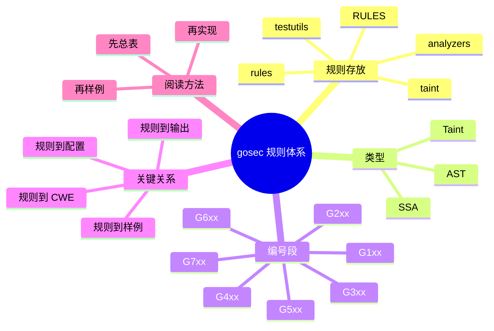

# 记忆卡片摘要（快速复习版）

## 1. 大纲（压缩版）
- `gosec` 的规则到底放在哪里
- AST、SSA、Taint 三类规则的差别
- G1xx 到 G7xx 各自检查什么
- 为什么同一风险可能报多条规则
- 规则是怎么从“文档”落到“源码”和“测试”的
- 普通使用者怎样高效读规则仓库

## 2. 思维导图（Mermaid）


## 3. 重要知识点（必须记住）
- `gosec` 的规则仓库不是单一目录，而是“文档总表 + AST 规则目录 + SSA/Taint 分析器目录 + 样例目录 + CWE 映射”的组合。[来源1][来源2][来源3][来源4][来源5]
- 本地源码中 AST 规则总表在 `rules/rulelist.go`，SSA/Taint 分析器总表在 `analyzers/analyzerslist.go`。[来源3][来源4]
- 规则编号并不是随便排的。G1xx 到 G7xx 分别对应不同风险大类和实现风格。[来源1][来源2]
- 同一业务风险可能同时命中多条规则，比如 SQL 风险既可能命中 G201，也可能命中 G701；它们不是重复，而是“从不同深度观察同一个问题”。[来源1][来源4][来源6]
- 要理解一条规则，最快的顺序不是先啃实现，而是：先看 `RULES.md` 描述，再看 `testutils` 样例，再看具体源码实现。[来源1][来源2][来源5]

## 4. 难点 / 易混点
- “规则仓库”不只指 `RULES.md`。它更像“规则生态”。
- “G107 是 SSRF，G704 也是 SSRF”，但它们不是完全重复。前者偏特定模式检查，后者偏 taint 数据流检查。
- “G401 和 G501 都在说弱密码学”，但一个检查调用使用，一个检查导入行为。
- “AST 规则简单”不等于“没价值”；很多高性价比检查恰恰来自 AST。

## 5. QA 快速复习卡片
- Q: AST 规则主要放哪里？
  A: `rules/`
- Q: SSA 和 taint 分析器主要放哪里？
  A: `analyzers/`，底层污点引擎在 `taint/`
- Q: 规则编号大类怎么记？
  A: G1xx 通用，G2xx 注入，G3xx 文件系统，G4xx 密码学/TLS，G5xx 黑名单导入，G6xx 语言运行时安全，G7xx 污点分析。[来源1][来源2]
- Q: 为什么一段 SQL 风险代码可能报两条？
  A: 因为模式规则和 taint 规则观察层级不同。

## 6. 快速复现步骤（最短路径）
1. 打开 `RULES.md` 看总表。
2. 打开 `rules/rulelist.go` 与 `analyzers/analyzerslist.go` 看真实注册列表。
3. 从 `testutils/` 中找某条规则对应样例，先理解“会报什么，不会报什么”。
4. 再回到具体实现文件，例如 `rules/sql.go` 或 `analyzers/sqlinjection.go`。

---

# 学习笔记正文（详细版）

## 0. 学习目标、读者画像与假设
- 技术：`gosec` 规则仓库与规则体系
- 学习目标：理解 `gosec` 的规则如何组织、分类、注册、测试和输出，让读者能自己顺着仓库找到一条规则的来龙去脉。
- 读者水平：初学到中级，适合不懂编译原理但想真正看懂规则体系的人。
- 时间预算：标准版。
- 版本范围：基于本地仓库 `844b170` 及对应官方文件链接。
- 假设与限制：本文重点是“规则体系如何组织”，而不是逐条详解全部 60 条规则。

## 1. 先回答最核心的问题：`gosec` 的“规则仓库”到底是什么

很多人第一次听到“规则仓库”，脑中会自动想成“一个放规则文本的目录”。在 `gosec` 里，这个理解太窄了。

更准确地说，`gosec` 的规则体系至少由五部分组成：

1. 规则文档总表
2. 规则实现代码
3. 规则测试样例
4. 规则到 CWE 的映射
5. 规则输出与 CLI 接口

也就是说，一条规则不是只有一句“描述”，而是至少包含下面这些问题的答案：

- 它的 ID 是什么？
- 它到底检查什么？
- 它用 AST、SSA 还是 taint 实现？
- 哪些代码会触发？
- 哪些代码不会触发？
- 它映射到哪个 CWE？
- 用户怎么通过 CLI 选择、排除、抑制它？

只要把这个视角建立起来，你就不会再把 `RULES.md` 当成“全部规则本体”。`RULES.md` 更像目录，真正的生命力在源码和样例里。[来源1][来源2][来源3][来源4][来源5]

## 2. 规则相关的关键文件和目录

### 2.1 `RULES.md`：规则说明总表

这里告诉你：

- 当前有哪些规则
- 每条规则属于哪一大类
- 它是 AST、SSA 还是 Taint
- 哪些规则支持配置

对普通读者来说，它像一本“规则地图”。先读它，能快速建立全局视野。[来源1]

### 2.2 `rules/rulelist.go`：AST 规则注册总表

这里是真正的 AST 规则装配中心。源码里以 `RuleDefinition` 列表形式把规则 ID、描述、构造器连起来，再根据 include/exclude 过滤后注册到 `RuleSet`。[来源3]

这意味着一条 AST 规则不是散落地存在，而是要在这里“挂号”，CLI 才能真正加载它。

### 2.3 `analyzers/analyzerslist.go`：SSA / Taint 分析器注册总表

这里对应 AST 世界的另一半。它维护默认分析器列表，也定义了多条 taint 规则的元信息，例如：

- G701 SQL injection
- G702 Command injection
- G703 Path traversal
- G704 SSRF
- G705 XSS
- G706 Log injection
- G707 SMTP injection
- G708 SSTI
- G709 Unsafe deserialization

同时也收纳一些非 taint 的 SSA 分析器，例如 G115、G118、G123、G124、G602 等。[来源4]

### 2.4 `taint/`：污点分析底层引擎

这部分不是某一条规则，而是一种“通用分析机制”。你可以把它理解成一台机器：

- 先定义不可信来源（source）
- 再定义危险落点（sink）
- 可选定义净化器（sanitizer）
- 然后让机器去追踪数据是否从 source 流到了 sink

多个 G7xx 规则都复用这台机器。[来源4][来源7]

### 2.5 `testutils/`：教学价值极高的样例库

如果你是初学者，我强烈建议把这里当成第一线学习材料。因为每个样例都在回答一个非常实用的问题：

- 什么样的代码会被报？
- 什么样的代码不会被报？
- 当前规则已覆盖哪些边界？
- 当前规则还没覆盖哪些边界？

很多“看源码看不懂”的困惑，去看样例就会立刻明白。[来源2][来源5]

### 2.6 `issue/issue.go`：规则和 CWE、输出结构的桥梁

这部分看似不是规则，其实非常关键。因为最终所有规则都要汇聚成统一的 Issue 结构，里面包含：

- severity
- confidence
- cwe
- rule_id
- details
- file / line / column
- code snippet
- suppressions

也就是说，规则不只是“判断对错”，还要把结果打包成可被人类和平台消费的数据。[来源6]

## 3. AST、SSA、Taint 三类规则到底怎么分

这是理解 gosec 规则体系的中心问题。

## 3.1 AST 规则：看代码长什么样

AST 是抽象语法树。对初学者来说，可以把它想成“代码的语法骨架”。

比如下面两段代码，在 AST 眼里不是普通文本，而是：

- 一个函数调用
- 一个字符串字面量
- 一个变量引用
- 一个二元表达式

AST 规则特别适合做下面这类事：

- 发现调用了已知危险函数
- 发现导入了弱密码学包
- 发现权限位太宽松
- 发现明显的字符串拼接模式

优势：
- 快
- 直观
- 对许多常见风险已经很够用

局限：
- 如果问题依赖复杂控制流和数据流，单看语法树往往不够

例子：
- `rules/rand.go` 通过 `callListRule` 检查 `math/rand` 和 `math/rand/v2` 的若干 API 调用，命中则报 G404。[来源8]
- `rules/http_serve.go` 检查 `net/http` 的 `ListenAndServe`、`Serve` 等无超时支持接口，命中则报 G114。[来源9]

## 3.2 SSA 分析器：看代码大概会怎么跑

SSA 可以粗略理解成一种更适合分析程序行为的中间表示，比单纯语法树更接近“执行逻辑”。[来源4][来源7]

为什么需要 SSA？

因为有些问题不是“看见某个函数名”就能判断。例如：

- 某个整数转换会不会溢出
- 某个 context cancel 是否真的被调用
- 某个切片边界是否可能越界

这类问题需要知道变量是如何传递、分支是如何合并、某个值可能从哪里来，而这些信息 AST 不够直接。

典型规则：
- G115 整数转换溢出
- G118 context 传播失败
- G123 TLS resumption 绕过验证
- G124 cookie 配置不安全
- G602 slice bounds out of range

## 3.3 Taint 规则：看“不可信输入”有没有流向“危险点”

这类规则对非科班最容易理解，因为现实意义很直接：

- 用户输入能不能流到 SQL 执行函数？
- 环境变量能不能流到命令执行？
- HTTP 请求参数能不能流到文件路径？

污点分析的三要素：

- Source：不可信来源
- Sink：危险落点
- Sanitizer：净化器

这就像查水污染：先看脏水从哪来，再看它会不会流进危险区域，中间有没有净化池。

典型规则：
- G701 SQL injection
- G702 Command injection
- G703 Path traversal
- G704 SSRF
- G705 XSS
- G709 Unsafe deserialization

## 4. 规则编号怎么记

官方 `RULES.md` 已经给出了清晰分类。[来源1]

### G1xx：通用安全编码问题

这类通常是“看上去就不太对”的广义安全编码风险，例如：

- G101 硬编码凭据
- G104 未处理错误
- G114 无超时的 HTTP serve
- G117 序列化时可能泄露秘密

它们很适合做日常基线扫描。

### G2xx：注入模式

这类更聚焦“拼接、注入、模板不安全”：

- G201 SQL format string
- G202 SQL string concatenation
- G203 HTML template 未转义数据
- G204 命令执行审计

### G3xx：文件系统与权限

- G301/G302/G306/G307 文件或目录权限不当
- G303 可预测临时文件路径
- G304 不可信文件路径
- G305 zip 解压路径穿越

### G4xx：密码学与协议安全

- G401 弱哈希
- G402 TLS 配置不安全
- G403 RSA 密钥位数过低
- G404 弱随机数
- G407 硬编码 IV/nonce

### G5xx：导入黑名单

这类检查“你是否导入了不推荐的包”，例如：

- G501 `crypto/md5`
- G505 `crypto/sha1`

它和 G401 这类“实际调用危险 API”的规则经常一起出现，但关注点不同。

### G6xx：Go 语言/运行时安全

- G601 RangeStmt 隐式别名问题
- G602 切片越界风险

### G7xx：taint 数据流规则

这是最“像安全分析器”的一组：

- SQL injection
- Command injection
- Path traversal
- SSRF
- XSS
- Log injection
- SMTP injection
- SSTI
- Unsafe deserialization

## 5. 为什么同一风险会报多条规则

这是新手最容易困惑的地方之一。

### 5.1 SQL 风险的双重报警

实验样例里：

```go
query := fmt.Sprintf("SELECT * FROM users WHERE id = %s", os.Args[2])
db.Query(query)
```

会同时出现：

- G201：SQL string formatting
- G701：SQL injection via taint analysis

为什么？

因为它们回答的问题不同：

- G201 在问：“你是不是用了危险的 SQL 格式化模式？”
- G701 在问：“不可信输入是否真的流到了 SQL sink？”

前者偏模式识别，后者偏数据流推理。它们相关，但不完全重复。[来源4][来源10][来源11]

### 5.2 弱密码学的双重报警

导入并调用 `crypto/md5` 时，可能出现：

- G501：导入黑名单
- G401：使用弱密码学原语

你可以把它理解成：

- G501 更像“你选错了材料”
- G401 更像“你真的把这个材料拿来用了”

### 5.3 这不是噪音，而是分层视角

如果你从治理视角看，多层报警有好处：

- AST 规则帮助快速定位可疑写法
- taint 规则帮助确认数据是否真的危险传播

当然，团队在落地时也要防止“层层报警造成疲劳”。所以后面最佳实践会讲如何分优先级看。

## 6. 规则如何从“文档”落到“实际执行”

一条规则从被描述到真的跑起来，大致经历这条链路：

1. 在 `RULES.md` 中有说明。[来源1]
2. 在 `rules/rulelist.go` 或 `analyzers/analyzerslist.go` 中被注册。[来源3][来源4]
3. 若需要，会在 `issue/issue.go` 中映射到 CWE。[来源6]
4. 在 `testutils/` 中有正反样例。[来源2][来源5]
5. 在 CLI 运行时被 include/exclude 过滤后装配进 analyzer。[来源10]
6. 扫描时生成 Issue，最后写入 text/json/sarif 等报告。[来源6][来源10]

这条链路特别重要，因为它让你知道：

- 规则不是“写完一个文件就算完成”
- 规则需要文档、注册、测试、映射、输出这几层一起打通

## 7. 怎样高效阅读一条规则

### 7.1 初学者最佳顺序

顺序一：
- 先看 `RULES.md` 描述
- 再看 `testutils` 样例
- 最后看源码实现

为什么这样更好？

因为直接看源码，你很容易只看到“怎么写”，看不到“为什么这样判”。样例能帮你把抽象逻辑变成可感知的边界。

### 7.2 推荐先看的三条

#### G404

代表简单 AST 规则。你能很快看懂：
- 它匹配哪些包和方法
- 为什么实现这么短

#### G114

也是 AST 规则，但业务语义很直观，适合建立“安全规则不一定复杂”的信心。

#### G701

代表 taint 规则。结合 `analyzers/sqlinjection.go` 和 `taint/analyzer.go`，能看出配置驱动的数据流分析长什么样。[来源4][来源7]

## 8. 规则体系的价值与边界

### 8.1 价值

- 分层清晰：文档、实现、样例、输出能对上。
- 分类稳定：G1xx 到 G7xx 有明确主题。
- 易于治理：可以按类别分批推进，比如先清理硬编码、再清理注入类。
- 易于扩展：官方开发文档明确支持新增 AST、SSA、Taint 规则。[来源2]

### 8.2 边界

- 不是每类漏洞都能靠静态分析准确识别。
- 不是每条规则都适合所有项目。
- 复杂业务上下文仍然需要人工判断。
- taint 分析再强，也会受到 source/sink 定义完整性的约束。

## 9. 官方文档章节映射与重要例子保留检查

| 官方章节 / 文件 | 本文对应章节 | 说明 |
|---|---|---|
| `RULES.md` Rules List | 第 2、3、4 节 | 规则全景主来源 |
| `RULES.md` Rules configuration | 第 6、7 节 | 说明规则不只是描述，还可能有配置 |
| `rules/rulelist.go` | 第 2、6 节 | AST 规则注册来源 |
| `analyzers/analyzerslist.go` | 第 2、3、4、6 节 | SSA/Taint 分析器注册来源 |
| `DEVELOPMENT.md` adding rules and analyzers | 第 6、7 节 | 解释规则如何真正落地 |
| `issue/issue.go` | 第 2、6 节 | 解释 CWE 与 Issue 统一结构 |

保留的重要例子：
- G201 / G701 的差异
- G401 / G501 的差异
- G404 / G114 的简单 AST 实现
- G701 的 taint 配置思路

## 10. 延伸学习路径（官方优先）
- 先读 `RULES.md` 全表。[来源1]
- 再读 `rules/rulelist.go` 和 `analyzers/analyzerslist.go`。[来源3][来源4]
- 再挑自己最关心的一类，比如 SQL 或 SSRF，顺着样例和实现读。[来源5]
- 最后回到 CLI，用 `-include` 只跑这几条规则，观察真实输出。

---

# 练习与复习闭环

## 1. 分层练习

### 基础练习
- 说清楚 AST、SSA、Taint 的一句话区别。
- 说出 G1xx 到 G7xx 的主题。
- 说出 AST 规则和 taint 规则各一个文件位置。

### 应用练习
- 在仓库里定位 G404、G114、G701 的实现文件。
- 找出它们分别对应的测试样例文件。
- 说明为什么 G201 和 G701 可能同时出现。

### 综合练习
- 选一条你最关心的规则，写出它的“文档 -> 样例 -> 源码 -> CWE -> 输出”链路。

## 2. 动手任务（带验收标准）
- 任务：任选一条规则，自己完整追踪一次：
- 在 `RULES.md` 找描述
- 在注册表找 ID
- 在样例目录找示例
- 在源码目录找实现
- 在 `issue/issue.go` 找 CWE
- 验收标准：你能用 5 分钟讲清楚这条规则是怎么从“规则想法”变成“扫描结果”的。

## 3. 常见误区纠偏
- 误区：规则文档就是规则本体。
  正解：文档只是入口，真正执行依赖注册、实现、测试和输出结构。
- 误区：同一处代码报两条一定是重复噪音。
  正解：很多时候是不同分析层次给出的互补视角。
- 误区：复杂规则一定更有价值。
  正解：很多高频高价值基线问题恰恰是 AST 规则先发现的。

## 4. 复习节奏建议
- Day 1：记住规则体系五件套：文档、实现、样例、CWE、输出。
- Day 3：复述 G1xx 到 G7xx 的主题。
- Day 7：独立追一条规则的完整链路。
- Day 14：解释给别人听，为什么 `gosec` 不是“几条正则脚本”。

## 5. 自测题与参考答案（简版）
- 题目 1：为什么说 `analyzers/` 也是规则仓库的一部分？
  参考答案：因为很多 SSA 和 taint 规则注册与实现都在那里。
- 题目 2：G401 和 G501 的关注点分别是什么？
  参考答案：G401 看使用弱密码学原语，G501 看是否导入被列黑名单的包。
- 题目 3：理解规则最快的方法为什么是先看样例？
  参考答案：因为样例直接展示触发边界，比先读复杂实现更容易形成直觉。

---

# 参考来源与版本说明

## 官方来源（优先）
1. [RULES.md](https://github.com/securego/gosec/blob/844b1703bf4fd59b110600317422f515cac6d603/RULES.md) - 用途：规则分类、实现类型、可配置规则总表。
2. [DEVELOPMENT.md](https://github.com/securego/gosec/blob/844b1703bf4fd59b110600317422f515cac6d603/DEVELOPMENT.md) - 用途：新增规则和分析器的开发流程。
3. [rules/rulelist.go](https://github.com/securego/gosec/blob/844b1703bf4fd59b110600317422f515cac6d603/rules/rulelist.go) - 用途：AST 规则注册总表。
4. [analyzers/analyzerslist.go](https://github.com/securego/gosec/blob/844b1703bf4fd59b110600317422f515cac6d603/analyzers/analyzerslist.go) - 用途：SSA 与 taint 分析器注册总表。
5. [testutils/g201_samples.go](https://github.com/securego/gosec/blob/844b1703bf4fd59b110600317422f515cac6d603/testutils/g201_samples.go) - 用途：G201 正反样例。
6. [issue/issue.go](https://github.com/securego/gosec/blob/844b1703bf4fd59b110600317422f515cac6d603/issue/issue.go) - 用途：规则到 CWE 的映射。
7. [taint/analyzer.go](https://github.com/securego/gosec/blob/844b1703bf4fd59b110600317422f515cac6d603/taint/analyzer.go) - 用途：taint 引擎入口。
8. [rules/rand.go](https://github.com/securego/gosec/blob/844b1703bf4fd59b110600317422f515cac6d603/rules/rand.go) - 用途：简单 AST 规则示例。
9. [rules/http_serve.go](https://github.com/securego/gosec/blob/844b1703bf4fd59b110600317422f515cac6d603/rules/http_serve.go) - 用途：简单 AST 规则示例。
10. [analyzers/sqlinjection.go](https://github.com/securego/gosec/blob/844b1703bf4fd59b110600317422f515cac6d603/analyzers/sqlinjection.go) - 用途：G701 taint 配置示例。
11. 本地实验样例与扫描结果：`/home/nyn/Desktop/Projects/Agents/playground/Skills/tech-learning/workspace/gosec-learning/.lab/sampleapp` 中的 `gosec` 运行结果 - 访问日期：2026-03-28 - 用途：展示 G201 与 G701 等多层规则同时命中的现象。[来源11]

## 第三方来源（按采信程度标注）
1. [MITRE CWE](https://cwe.mitre.org/data/index.html) - 采信程度：高 - 用于辅助理解规则编号之外的弱点分类。

## 关键结论引用映射
- [来源1] -> 编号段和规则分类。
- [来源3][来源4] -> AST 与 SSA/Taint 的真实注册位置。
- [来源5] -> 规则样例是理解触发边界的核心入口。
- [来源6] -> 规则最终不是停在“描述”，而是要落到统一 Issue 与 CWE。
- [来源7][来源10] -> taint 规则为何不是简单正则匹配。
- [来源11] -> 本地样例证明同一风险可触发不同层级规则。

## 冲突点与裁决（如有）
- 冲突点：用户常把“规则仓库”理解成 `RULES.md` 单文件。
- 裁决依据：源码显示规则还依赖注册表、样例、taint 引擎和 Issue 映射。
- 采用结论：本文将“规则仓库”定义为完整规则生态。

## 技术版本与访问日期
- 本地仓库访问日期：2026-03-28
- 本地源码 commit：`844b1703bf4fd59b110600317422f515cac6d603`
