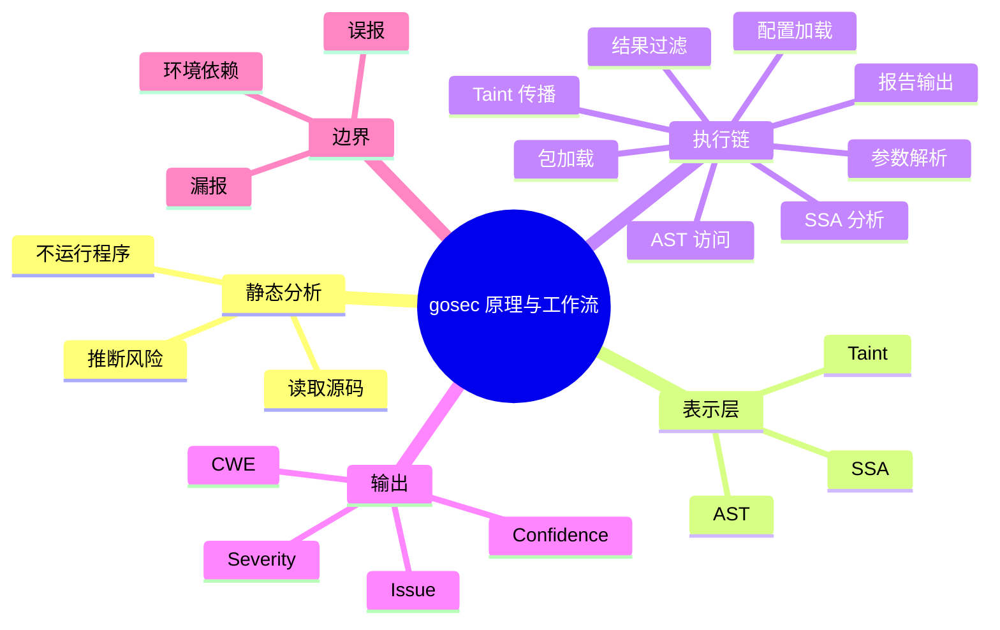

# 记忆卡片摘要（快速复习版）

## 1. 大纲（压缩版）
- 什么是静态分析
- 为什么 `gosec` 既看 AST，也看 SSA，还做 taint
- 一次 `gosec` 扫描在内部经过哪些步骤
- 本地实验如何映射到内部工作流
- 静态分析的优势、边界与误报来源
- 如何用普通人的语言理解数据流分析

## 2. 思维导图（Mermaid）

## 3. 重要知识点（必须记住）
- 静态分析的核心不是“运行你的业务”，而是“在程序执行前，通过源码结构和数据流线索判断风险”。[来源1][来源2]
- `gosec` 之所以分成 AST、SSA、Taint，是因为不同问题需要不同观察深度：有的看语法就够，有的必须看变量如何传递。[来源1][来源3][来源4][来源5]
- 一次 `gosec` 扫描并不是直接“扫文件”，而是先经过 Go 包加载链路，拿到语法树、类型信息、甚至 SSA 结果，之后才进入规则执行。[来源2][来源3]
- Issue 不是一条普通日志，而是带 `severity`、`confidence`、`cwe`、代码片段、抑制信息的结构化结果。[来源6]
- 误报和漏报不是工具失败，而是静态分析天然权衡的一部分；真正的工程能力在于你是否理解它们为何出现、如何治理。[来源1][来源2][来源6]

## 4. 难点 / 易混点
- “静态分析”不等于“正则搜索”。
- “SSA”不是把代码跑起来，而是构建一种更适合分析控制流和数据流的中间表示。
- “taint”不是给变量打永久标签，而是在 source 到 sink 之间追踪不可信数据是否传播。
- “包加载失败”属于扫描流程前半段失败，不是规则命中失败。

## 5. QA 快速复习卡片
- Q: 为什么 `gosec` 需要 Go 包加载？
  A: 因为它要拿到语法树、类型信息和可分析的程序表示，不能只看纯文本。[来源2][来源3]
- Q: AST 和 SSA 的最大区别是什么？
  A: AST 更像代码语法骨架；SSA 更像程序值和控制流的分析视图。
- Q: taint 分析最核心的问题是什么？
  A: 不可信输入有没有流到危险点。
- Q: 为什么同一段代码会报 G201 和 G701？
  A: 一个看模式，一个看数据流。

## 6. 快速复现步骤（最短路径）
1. 读 `README.md` 的 features，先知道 gosec 官方如何定义 AST / SSA / Taint。[来源1]
2. 读 `cmd/gosec/main.go`，看参数如何进入执行链。[来源2]
3. 读 `analyzer.go` 和 `goanalysis/analyzer.go`，看 AST 与 SSA 如何被调度。[来源3][来源4]
4. 读 `taint/analyzer.go` 和任意一条 G7xx 分析器配置，看 source/sink 是怎么定义的。[来源5][来源7]

---

# 学习笔记正文（详细版）

## 0. 学习目标、读者画像与假设
- 技术：`gosec` 静态分析原理与工作流
- 学习目标：让没有编译器背景的读者，也能看懂 `gosec` 为何能发现问题、扫描过程内部发生了什么、为什么有时会误报或受环境影响。
- 读者水平：初学到中级。
- 时间预算：标准版。
- 版本范围：基于本地仓库与本地实验。
- 运行环境：本地 Linux shell。
- 假设与限制：本文以“可理解性优先”，先讲直观版，再讲稍严格版。

## 1. 静态分析到底是什么

### 1.1 先讲直观版

假设你让一个资深工程师帮你审代码。他没把程序真正跑起来，但他看一眼就能说：

- 这里把用户输入直接拼进 SQL 了，不安全。
- 这里居然还在用 MD5。
- 这里 HTTP 服务没设超时。
- 这里把环境变量直接拿去拼命令了。

这就是静态分析的直觉原型：不运行程序，直接看代码结构和数据流线索，推断风险。

### 1.2 稍微严格一点的说法

静态分析是对程序源代码或中间表示进行分析，在不执行程序的前提下，推断程序可能满足的性质，比如：

- 是否存在某种 API 调用模式
- 某个变量值是否可能来源于外部输入
- 某个控制流路径上是否缺失校验或释放
- 某个函数调用点是否具有已知不安全参数

`gosec` 做的就是面向 Go 安全问题的静态分析。[来源1]

## 2. 为什么 `gosec` 不能只靠纯文本搜索

很多新手会想：“查 `md5`、查 `fmt.Sprintf` 不就好了？”

对极少数简单问题，文本搜索确实能抓到一部分。但真正有用的安全分析通常至少要知道：

- 这个 `Query` 到底是不是 `database/sql.DB.Query`
- 这段字符串是常量，还是来自 `os.Args`
- 这个 `cancel` 函数是不是已经被调用
- 这个变量经过几次赋值后最终流到了哪里

纯文本几乎回答不了这些问题。所以 `gosec` 要借助 Go 的包加载和分析框架，拿到：

- AST
- 类型信息
- types info
- 可选的 SSA 结果

这些东西就像“程序的结构化地图”，比纯文本强得多。[来源2][来源3][来源4]

## 3. AST、SSA、Taint：三层观察深度

## 3.1 AST：语法层的骨架

如果把代码比作句子，AST 很像语法树。它告诉你：

- 这里是函数调用
- 这里是二元表达式
- 这里是字符串字面量
- 这里是 if / for / switch

很多问题只靠 AST 就能发现，因为这些问题和“写法形状”强相关。

例如：
- 调用了 `math/rand.Int`
- 调用了 `http.ListenAndServe`
- 导入了 `crypto/md5`

这类规则的优点是简单、快、稳定。[来源1][来源8][来源9]

## 3.2 SSA：更接近程序行为的中间表示

SSA 的全称是 Static Single Assignment。非科班读者不需要背定义，只要先记住一句话：

它是一种比 AST 更适合分析“值如何流动、分支如何合并、变量当前可能是什么”的程序表示。

为什么这很重要？

因为很多问题不是看一个节点能定的。比如：

- 某个整数转换会不会溢出
- 某个 context cancel 是否最终被调用
- 某个 cookie 配置是不是在某条路径上少了 Secure

这类问题需要在更“行为化”的层面看程序，而不是只看语法树。[来源1][来源4][来源5]

## 3.3 Taint：专门追踪不可信输入

taint 分析特别适合安全问题，因为安全问题里最常见的套路就是：

外部输入 -> 中间变量 -> 危险 API

例如：
- 请求参数 -> SQL 查询 -> `db.Query`
- 环境变量 -> URL -> `http.Get`
- 表单输入 -> 文件路径 -> `os.Open`

`gosec` 把这类规则抽象成：

- Source：不可信来源
- Sink：危险落点
- Sanitizer：清洗或净化步骤

只要数据从 source 一路流到 sink，中间没被可信净化，它就会报问题。[来源5][来源7]

## 4. `gosec` 一次扫描到底经历了什么

下面我们沿着源码走一次真实工作流。

## 4.1 参数解析

CLI 入口在 `cmd/gosec/main.go`。一开始会定义各种 flag，例如：

- `include/exclude`
- `fmt/out`
- `severity/confidence`
- `nosec`
- `track-suppressions`

然后调用 `flag.Parse()` 读取命令行参数。[来源2]

## 4.2 配置加载

接下来会加载配置文件，并把部分命令行选项写进统一配置对象，例如：

- `nosec`
- `show-ignored`
- `audit`
- `include`
- `exclude`

这一步的意义是：后续规则和分析器不必直接依赖 CLI flag，而是读统一配置。[来源2][来源8]

## 4.3 规则和分析器装配

然后源码会分别调用：

- `loadRules(include, exclude)`
- `loadAnalyzers(include, exclude)`

把 AST 规则和分析器列表装起来。[来源2]

这也解释了为什么 `-include` 和 `-exclude` 会同时影响两边。

## 4.4 包路径收集

之后会根据你提供的路径，结合 `exclude-dir` 等规则，收集真正要分析的 Go 包。[来源2]

注意这里是“包”，不是普通文件夹。`gosec` 站在 Go 工具链视角看项目。

## 4.5 Go 包加载

这是很多人第一次用 SAST 时容易忽略的关键步骤。

`gosec` 不是自己手搓一个 Go 解析器，而是借助 Go 的包加载机制拿到：

- 文件列表
- 语法树
- 类型信息
- 编译文件
- module 信息

如果这一步失败，后面的规则几乎都跑不起来。[来源3]

这也解释了为什么本地实验里，最开始会先因为：

- `GOTOOLCHAIN` 尝试下载新工具链
- `GOCACHE` 无写权限

而卡在“包加载”阶段，而不是“规则执行”阶段。[来源11]

## 4.6 AST 遍历与规则匹配

在 `analyzer.go` 中，`astVisitor` 会遍历语法树，并针对当前节点类型取出注册在该节点上的规则，再逐条执行 `Match`。[来源3][来源9]

这一步可以理解成：

- 看到一个调用表达式，就让所有关心调用表达式的规则上来看看。
- 看到一个赋值表达式，就让相关规则看看。

只要有规则命中，就生成 Issue。

## 4.7 SSA 分析器执行

在 `goanalysis/analyzer.go` 或主分析流程中，若有可用的 `buildssa` 结果，就会运行 SSA 分析器。[来源4]

它和 AST 的差别是：

- AST 更像“遍历节点”
- SSA 更像“在程序图上做分析”

## 4.8 Taint 传播

对 G701-G709 等规则，`taint.NewGosecAnalyzer(...)` 会利用 SSA 结果建立数据传播分析。[来源5]

简化理解：

1. 标记 source
2. 跟踪变量传播
3. 看是否流到 sink
4. 命中则生成 Issue

## 4.9 抑制、路径排除、严重级别过滤

Issue 生成后，并不是立即打印，而是还会经历后处理：

- 是否被 `#nosec` 或 `//gosec:disable` 抑制
- 是否命中路径级 `exclude-rules`
- 是否达到 `severity/confidence` 阈值
- 是否需要排序

这也是为什么“规则跑了”和“最后有没有显示出来”是两回事。[来源2][来源3]

## 4.10 输出报告和退出码

最后才是 text/json/sarif 等格式输出，以及退出码计算。[来源2][来源6]

## 5. 用本地实验理解这条工作流

我在本地构造了一个最小样例，故意放入：

- `md5.New()`
- `rand.Int()`
- `http.ListenAndServe`
- `http.Get(os.Args[1])`
- `fmt.Sprintf(... os.Args[2])`

运行后得到了：

- G404
- G704
- G701
- G401
- G114
- G201
- G501
- G104 x 3

为什么这组结果很有教学意义？

### 5.1 它证明了 AST 和 taint 可以同时工作

- `md5.New()` 命中 G401，导入 `crypto/md5` 命中 G501。
- `http.Get(os.Args[1])` 命中 G704，因为 taint 看到 `os.Args` 流向了 HTTP 请求。
- `fmt.Sprintf` 拼 SQL 命中 G201，而最终 `db.Query(query)` 又命中 G701。

### 5.2 它证明了后处理的重要性

我给 G114 和 G401 加了源内抑制注释后，普通扫描里它们不再算未抑制问题；但加上 `-track-suppressions` 时，它们会作为带抑制元数据的 Issue 出现在 JSON 里。[来源11]

### 5.3 它证明了环境是工作流的一部分

如果 `go list` 跑不通，`gosec` 也跑不通。静态分析不是完全独立于语言生态存在的，它依赖 Go 分析基础设施。[来源11]

## 6. 普通人怎么理解污点分析

给一个非常接地气的比喻。

想象有一家饮料厂：

- 原水入口是 source
- 生产管道是变量传播
- 灌装口是 sink
- 净化器是 sanitizer

如果脏水在没有经过净化的情况下流到了灌装口，产品就不安全。

在代码里也是一样：

- `os.Args`、`r.FormValue(...)`、`os.Getenv(...)` 这类外部输入，就是原水入口。
- 变量赋值、拼接、函数传参、结构体字段传递，就是管道。
- `db.Query`、`http.Get`、`exec.Command` 这类危险 API，就是灌装口。

这个比喻对入门很有帮助，但一定要回到真实机制：

- 真正实现时，不是“字符串匹配箭头”，而是基于 SSA 值和 call graph 去追踪传播。[来源5][来源7]

## 7. 为什么会有误报和漏报

### 7.1 误报从哪里来

- 规则为了覆盖更多风险，故意保守一些。
- 静态分析无法总是准确知道运行时真实值。
- 项目里存在工具不了解的自定义净化逻辑。
- 某些模式虽然看起来危险，但你们业务前置校验已经保证安全。

### 7.2 漏报从哪里来

- source/sink 没定义全
- 数据经过复杂包装，当前规则没跟踪到
- 某类漏洞需要运行时信息或跨系统上下文
- 当前规则为了减少误报，做了保守裁剪

### 7.3 这不是坏事，而是要学会管理

静态分析不是数学证明工具。工程上更现实的目标是：

- 高风险、高频问题尽量早发现
- 用结构化输出支撑审计和治理
- 用抑制和基线管理控制噪音

## 8. `go/analysis` 适配器意味着什么

`goanalysis/analyzer.go` 把 `gosec` 封装成标准 `analysis.Analyzer`。[来源4]

这代表什么？

- `gosec` 不只是一个独立 CLI
- 它还能以 Go 标准分析器身份嵌入其他工具链
- 比如 Bazel 的 `nogo` 场景、其他支持 `go/analysis` 的平台

从工程角度说，这说明 gosec 不是只会“自己跑”，而是可被集成到更大分析生态里。

## 9. 官方文档章节映射与重要例子保留检查

| 官方章节 / 文件 | 本文对应章节 | 说明 |
|---|---|---|
| README Features | 第 1、2、3 节 | AST / SSA / Taint 能力定位 |
| `cmd/gosec/main.go` | 第 4 节 | 主工作流来源 |
| `analyzer.go` | 第 4 节 | AST visitor、抑制、Issue 更新逻辑 |
| `goanalysis/analyzer.go` | 第 4、8 节 | 标准 `go/analysis` 适配器 |
| `taint/analyzer.go` | 第 3、4、6 节 | Taint 机制和 Issue 生成 |
| `analyzers/sqlinjection.go` | 第 3、5、6 节 | Source / Sink / Sanitizer 教学实例 |

保留的重要例子：
- SQL 样例的 G201 + G701 双重命中
- SSRF 样例的 `os.Args -> http.Get`
- 抑制跟踪样例的 JSON suppressions 字段

## 10. 延伸学习路径（官方优先）
- 先读 README features，建立术语表。[来源1]
- 再读 `cmd/gosec/main.go`，把 CLI 和工作流对应起来。[来源2]
- 再读 `analyzer.go`，理解 AST visitor 和抑制处理。[来源3]
- 最后读 `taint/analyzer.go` 与某条 G7xx 配置，理解数据流分析。[来源5][来源7]

---

# 练习与复习闭环

## 1. 分层练习

### 基础练习
- 用自己的话解释什么是静态分析。
- 用一句话解释 AST、SSA、Taint 的区别。
- 说出一次 `gosec` 扫描至少经历的三个阶段。

### 应用练习
- 为什么 `-severity=high` 不是“少跑了规则”？
- 为什么 `go list` 失败会影响 `gosec`？
- 为什么源内抑制和路径排除要放在后处理阶段理解？

### 综合练习
- 画出你自己版本的 `gosec` 工作流图，从 CLI 到输出。
- 用实验样例解释“为什么一段代码会报两条不同层级的规则”。

## 2. 动手任务（带验收标准）
- 任务：拿一个最小 Go 项目，分别制造：
- 一个简单 AST 命中
- 一个 taint 命中
- 一个 `#nosec` 抑制
- 验收标准：你能指出它们分别在工作流的哪个阶段被产生、被抑制或被过滤。

## 3. 常见误区纠偏
- 误区：静态分析就是高级版 grep。
  正解：`gosec` 会走 Go 包加载、类型信息、SSA 和污点传播。
- 误区：报没报出问题，只取决于规则是否命中。
  正解：还受抑制、路径排除、阈值过滤、输出策略影响。
- 误区：环境错误不属于扫描问题。
  正解：环境就是扫描流程的一部分。

## 4. 复习节奏建议
- Day 1：记住 AST / SSA / Taint 三层。
- Day 3：能口述一次 `gosec` 工作流。
- Day 7：能解释实验样例每个报警来自哪一层。
- Day 14：能独立排查一次“为什么 gosec 没跑起来”。

## 5. 自测题与参考答案（简版）
- 题目 1：为什么 taint 规则比模式规则更强，但也更复杂？
  参考答案：因为它需要追踪数据传播，而不只是看单点写法。
- 题目 2：为什么 `gosec` 依赖 `buildssa`？
  参考答案：因为部分分析器和 taint 规则需要 SSA 中间表示。
- 题目 3：为什么静态分析一定会有误报和漏报？
  参考答案：因为它在不执行程序的前提下推断行为，天然存在信息不完全。

---

# 参考来源与版本说明

## 官方来源（优先）
1. [README.md](https://github.com/securego/gosec/blob/844b1703bf4fd59b110600317422f515cac6d603/README.md) - 用途：官方对 AST、SSA、Taint 三层能力的定义。
2. [cmd/gosec/main.go](https://github.com/securego/gosec/blob/844b1703bf4fd59b110600317422f515cac6d603/cmd/gosec/main.go) - 用途：CLI 到执行流程的主入口。
3. [analyzer.go](https://github.com/securego/gosec/blob/844b1703bf4fd59b110600317422f515cac6d603/analyzer.go) - 用途：AST visitor、注释抑制、Issue 更新和包处理逻辑。
4. [goanalysis/analyzer.go](https://github.com/securego/gosec/blob/844b1703bf4fd59b110600317422f515cac6d603/goanalysis/analyzer.go) - 用途：`go/analysis` 适配器。
5. [taint/analyzer.go](https://github.com/securego/gosec/blob/844b1703bf4fd59b110600317422f515cac6d603/taint/analyzer.go) - 用途：污点分析执行器。
6. [issue/issue.go](https://github.com/securego/gosec/blob/844b1703bf4fd59b110600317422f515cac6d603/issue/issue.go) - 用途：Issue 结构、Severity、Confidence、CWE。
7. [analyzers/sqlinjection.go](https://github.com/securego/gosec/blob/844b1703bf4fd59b110600317422f515cac6d603/analyzers/sqlinjection.go) - 用途：G701 的 source / sink / sanitizer 教学例子。
8. [rules/rand.go](https://github.com/securego/gosec/blob/844b1703bf4fd59b110600317422f515cac6d603/rules/rand.go) - 用途：简单 AST 规则示例。
9. [rules/http_serve.go](https://github.com/securego/gosec/blob/844b1703bf4fd59b110600317422f515cac6d603/rules/http_serve.go) - 用途：简单 AST 规则示例。
11. 本地实验与命令实测：样例工程扫描、`-track-suppressions` 输出、环境失败与修复过程 - 访问日期：2026-03-28 - 用途：把工作流映射到可观察现象。[来源11]

## 第三方来源（按采信程度标注）
1. [MITRE CWE](https://cwe.mitre.org/data/index.html) - 采信程度：高 - 用于帮助理解输出中的 CWE 概念。

## 关键结论引用映射
- [来源1] -> 官方对 AST / SSA / Taint 的功能定位。
- [来源2][来源3] -> 一次扫描的真实执行步骤。
- [来源4][来源5] -> 为什么 gosec 能嵌入 Go 标准分析生态，以及 taint 如何依赖 SSA。
- [来源6] -> 为什么结果不是简单字符串，而是结构化 Issue。
- [来源11] -> 本地实验、环境报错与成功扫描样本。

## 冲突点与裁决（如有）
- 冲突点：很多人把静态分析理解成文本搜索。
- 裁决依据：源码清楚显示 gosec 依赖包加载、类型信息、SSA 与 taint 引擎。
- 采用结论：本文把 gosec 定义为多层静态分析框架，而不是简单模式扫描器。

## 技术版本与访问日期
- 本地仓库访问日期：2026-03-28
- 本地源码 commit：`844b1703bf4fd59b110600317422f515cac6d603`
