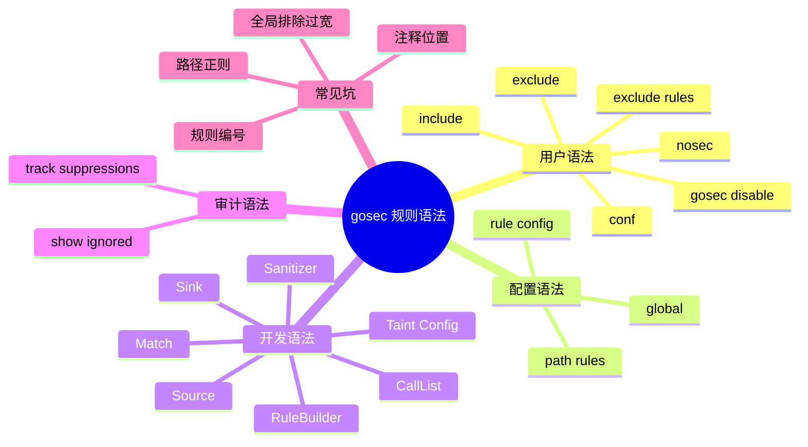

# 记忆卡片摘要（快速复习版）

## 1. 大纲（压缩版）
- 用户最常用的规则语法有哪些
- `include/exclude/exclude-rules` 怎么写
- `#nosec` 和 `//gosec:disable` 怎么写
- JSON 配置文件能配什么
- 规则开发者如何写 AST / taint 规则
- 哪些语法最容易写错

## 2. 思维导图（Mermaid）


## 3. 重要知识点（必须记住）
- “常用规则语法”至少有两层含义：用户侧的使用语法，以及开发者侧的规则定义语法。本文两层都讲清楚。[来源1][来源2][来源3][来源4]
- 用户最常用的语法包括：`-include`、`-exclude`、`--exclude-rules`、`#nosec`、`//gosec:disable`、JSON 配置文件。[来源1][来源2]
- `#nosec [RuleList] -- Justification` 的重点不只是“能压掉”，而是“最好写清理由”，方便审计。[来源1][来源3]
- taint 规则的核心语法是 `Source`、`Sink`、`Sanitizer`，它们共同描述了数据从哪来、哪里危险、什么算安全。[来源2][来源4]
- 初学者最容易写错的不是 Go 代码本身，而是路径正则、抑制注释位置、规则 ID 列表和误用全局排除。[来源1][来源3][来源5]

## 4. 难点 / 易混点
- `exclude-rules` 在 CLI 里是一串字符串，在配置文件里是结构化数组。
- `#nosec` 可以压全部规则，也可以只压指定规则；不是只有一种写法。
- `//gosec:disable` 与 `#nosec` 类似，但语法入口不同。
- “规则语法”不只是写注释和命令，还包括开发规则时的 `RuleBuilder` 与 taint `Config`。

## 5. QA 快速复习卡片
- Q: 只排除某路径下的 G204 和 G304 怎么写？
  A: `--exclude-rules="cmd/.*:G204,G304"`
- Q: 压掉一条具体规则并写理由怎么写？
  A: `// #nosec G402 -- 已人工确认安全`
- Q: 想看被压掉的问题元数据？
  A: `-track-suppressions`
- Q: 开发 taint 规则最核心的三个概念？
  A: `Source`、`Sink`、`Sanitizer`

## 6. 快速复现步骤（最短路径）
1. 读 README 的 configuration、annotating code、tracking suppressions 部分。[来源1]
2. 读 `RULES.md` 的 configurable rules 部分，理解规则专属配置长什么样。[来源2]
3. 读 `analyzer.go` 中 `findNoSecDirective` 和 `ignore` 实现，看注释到底怎么解析。[来源3]
4. 读 `DEVELOPMENT.md` 与 `analyzers/sqlinjection.go`，理解开发者侧语法。[来源4][来源5]

---

# 学习笔记正文（详细版）

## 0. 学习目标、读者画像与假设
- 技术：`gosec` 常用规则语法、配置语法、抑制语法、开发语法
- 学习目标：让读者既会“用规则”，也理解“规则是怎么被定义出来的”。
- 读者水平：初学到中级。
- 时间预算：标准版。
- 版本范围：以本地仓库和官方文档为准。
- 假设与限制：本文把“规则语法”分成用户视角和开发者视角两部分。

## 1. 为什么这里要专门讲“语法”

很多工具的学习资料只告诉你“有哪些规则”，但不告诉你“怎么精准控制这些规则”。这会导致两个问题：

- 你会用，但不会精细治理。
- 你看到误报时，不知道该写配置、写抑制，还是改规则。

`gosec` 在这方面其实设计得不错。它既有用户层语法：

- 规则选择
- 路径排除
- 配置文件
- 源内抑制

也有开发层语法：

- AST `RuleBuilder`
- taint `Config`
- `Source` / `Sink` / `Sanitizer`

把这两层打通之后，你对 gosec 的掌控力会明显提升。

## 2. 用户侧规则语法：从命令行开始

## 2.1 规则选择语法

### `-include`

语法：

```bash
gosec -include=G101,G201,G401 ./...
```

意思：
- 只跑这些规则或分析器。

适合：
- 学习专项
- 灰度接入
- 大仓库分阶段治理

### `-exclude`

语法：

```bash
gosec -exclude=G104,G304 ./...
```

意思：
- 全局排除这些规则。

风险：
- 如果你排得太宽，可能把整个团队最需要的信号一起关掉。

## 2.2 路径级规则排除语法

### CLI 形式

```bash
gosec --exclude-rules="cmd/.*:G204,G304;test/.*:G101" ./...
```

语法拆解：

- 分号 `;` 分隔多段规则
- 冒号 `:` 左边是路径正则，右边是规则列表
- 逗号 `,` 分隔多个规则 ID
- `*` 表示该路径下所有规则都排除

例子：

```bash
gosec --exclude-rules="scripts/.*:*" ./...
```

意思：
- `scripts/` 目录下全部规则都不看。[来源1][来源6]

### 配置文件形式

```json
{
  "exclude-rules": [
    {
      "path": "cmd/.*",
      "rules": ["G204", "G304"]
    },
    {
      "path": "scripts/.*",
      "rules": ["*"]
    }
  ]
}
```

这里要特别注意：

- CLI 用字符串
- 配置文件用结构化数组

两者语义一样，表达形式不同。[来源1][来源6]

## 3. 配置文件语法：把规则约定固化下来

## 3.1 全局配置

官方 README 给出过全局配置例子：

```json
{
  "global": {
    "nosec": "enabled",
    "audit": "enabled"
  }
}
```

常见全局项包括：

- `nosec`
- `show-ignored`
- `audit`
- `include`
- `exclude`

源码中这些全局键最终会被转换为 `Config` 里的全局选项。[来源1][来源8]

## 3.2 规则专属配置

并非所有规则都支持配置，但有些规则支持，而且非常实用。

### G101 硬编码凭据

支持配置：

- `pattern`
- `ignore_entropy`
- `entropy_threshold`
- `per_char_threshold`
- `truncate`
- `min_entropy_length`

这意味着你可以根据团队命名风格和误报情况微调“什么看起来像秘密”。[来源2]

### G104 未处理错误

支持函数 allowlist，例如：

```json
{
  "G104": {
    "ioutil": ["WriteFile"]
  }
}
```

这适合告诉 gosec：“这些调用我允许它不显式处理错误”。[来源2]

### G111 / G117 / G301 / G302 / G306 / G307

官方 `RULES.md` 对这些规则给出了示例配置。学习时至少要知道：

- 不是所有规则都只能开/关
- 部分规则能被精细调参

## 4. 源内抑制语法：`#nosec` 与 `//gosec:disable`

这是实际工程里最常用、也最容易乱写的部分。

## 4.1 `#nosec` 基本语法

官方推荐格式：

```text
#nosec [RuleList] [- Justification]
```

更具体地说，你会经常写成：

```go
// #nosec G402 -- 已人工确认这是测试环境特例
```

或者：

```go
value := weakButExpected() // #nosec G401 -- compatibility reason
```

## 4.2 `//gosec:disable` 语法

官方也支持：

```go
//gosec:disable G101 -- This is a false positive
```

它和 `#nosec` 的语义接近，只是入口词不同。[来源1][来源3]

## 4.3 注释到底怎么被解析

源码中的 `findNoSecDirective` 和 `ignore` 函数做了几件事：[来源3]

1. 同时检查默认 `#nosec` 和替代标签。
2. 也支持 `//gosec:disable` 前缀。
3. 如果注释后面带 `--`，会把后面的文本提取成 justification。
4. 如果没指定规则号，默认理解为“压所有规则”。
5. 如果写了形如 `G401 G402` 的规则号列表，会逐条记录。

这意味着：

- 写理由是有实际价值的，不只是文档礼仪。
- 写规则列表也是有实际价值的，不只是给人看。

## 4.4 最佳写法

推荐：

```go
http.ListenAndServe(":8080", nil) // #nosec G114 -- internal demo tool, not production server
```

不推荐：

```go
http.ListenAndServe(":8080", nil) // #nosec
```

原因：
- 后者把所有相关规则都压了，而且没有理由。
- 以后审计时，别人看不出你为什么压，也不知道是不是还能放开。

## 4.5 相关审计参数

### `-show-ignored`

用来把被忽略的问题打印出来。

### `-track-suppressions`

用来把抑制的种类和理由写进 JSON / SARIF 结果。

本地实验中，G401 和 G114 在 `-track-suppressions` 输出里都带了：

- `kind: inSource`
- `justification: ...`

这正是做审计和复盘最需要的信息。[来源11]

## 5. `-nosec=true` 到底意味着什么

这个参数很容易被误读。

它的真实含义不是“启用 nosec”，而是“忽略 nosec 注释”。[来源1][来源3]

换句话说：

- 正常扫描：尊重源码里的抑制
- `-nosec=true`：无视源码里的抑制，重新把问题报出来

适合场景：
- 安全审计复查
- 评估团队是否过度使用抑制注释

## 6. 开发者侧规则语法：AST 规则长什么样

如果你想自己给 gosec 加规则，就要看开发语法。

### 6.1 `RuleBuilder`

在 `rule.go` 里，AST 规则构造器签名是：

```go
type RuleBuilder func(id string, c Config) (Rule, []ast.Node)
```

你可以把它理解成：

- 传入规则 ID 和配置
- 返回规则实例
- 告诉框架“我关心哪些 AST 节点类型”[来源9]

### 6.2 `Match`

所有规则最终都要实现：

```go
Match(ast.Node, *Context) (*issue.Issue, error)
```

意思是：

- 给我一个 AST 节点和上下文
- 如果命中，就返回一个 Issue
- 如果没命中，返回 `nil`

### 6.3 `callListRule`

这是很多简单 AST 规则复用的基础结构。它的思路非常务实：

- 我关心一组包/方法调用
- 只要命中调用名单，就生成 Issue

比如 G404 和 G114 都是这种风格。[来源9][来源10][来源11]

这对初学者是很好的入门，因为你能很快看懂：

- 为什么规则那么短
- 为什么某些安全检查不需要复杂数据流

## 7. 开发者侧规则语法：taint 规则长什么样

## 7.1 基本结构

`DEVELOPMENT.md` 里明确了 taint 规则的开发步骤。[来源4]

核心是定义一个 `taint.Config`：

```go
return taint.Config{
  Sources: []taint.Source{...},
  Sinks: []taint.Sink{...},
  Sanitizers: []taint.Sanitizer{...},
}
```

## 7.2 Source 语法

一个 Source 描述“不可信数据从哪来”，关键字段包括：

- `Package`
- `Name`
- `Pointer`
- `IsFunc`

举例：

- `*http.Request`
- `os.Args`
- `os.Getenv`

## 7.3 Sink 语法

一个 Sink 描述“危险函数在哪里”，关键字段包括：

- `Package`
- `Receiver`
- `Method`
- `Pointer`
- `CheckArgs`

`CheckArgs` 很重要，因为它能说清“只检查第几个参数”。这能减少很多误报。[来源4][来源5]

例如 G701 会写：

- `database/sql.DB.Query` 只检查 query string 对应的参数

## 7.4 Sanitizer 语法

Sanitizer 表示“经过它之后，可以认为数据被净化过”。

这对减少误报很关键。但也要注意：

- 不是所有领域都有通用 sanitizer
- 有时真正安全做法不是“净化字符串”，而是“改用参数化 API”

G701 的注释就明确指出：SQL 没有通用 stdlib sanitizer，正确做法是参数化查询。[来源5]

## 8. 最容易写错的地方

### 8.1 注释位置不对

`#nosec` 要放在问题对应的代码行附近，不能随便漂在别处。

### 8.2 规则号写错

如果你想精准压某条规则，却把 `G401` 写成 `G410`，很可能达不到预期。

### 8.3 路径正则写错

`exclude-rules` 的路径是正则，不是简单 glob。写错一个点号、斜杠、转义，就可能完全不生效。[来源6]

### 8.4 全局排除过宽

很多团队为了先“过 CI”，会直接全局 `-exclude=G104,G204,...`。短期安静，长期失真。

更好的策略通常是：

- 先路径级排除
- 再规则配置调优
- 最后才考虑全局关规则

## 9. 官方文档章节映射与重要例子保留检查

| 官方章节 / 文件 | 本文对应章节 | 说明 |
|---|---|---|
| README Configuration | 第 3 节 | 全局配置和配置文件入口 |
| README Path-Based Rule Exclusions | 第 2 节 | `exclude-rules` 两种表达方式 |
| README Annotating code | 第 4 节 | `#nosec` 与 `//gosec:disable` |
| README Tracking suppressions | 第 4、5 节 | 审计语法 |
| `RULES.md` Rules configuration | 第 3 节 | G101/G104 等可配置规则 |
| `analyzer.go` nosec 解析逻辑 | 第 4、5 节 | 注释真正怎么解析 |
| `DEVELOPMENT.md` Creating taint analysis rules | 第 6、7 节 | 开发者侧 taint 语法 |
| `analyzers/sqlinjection.go` | 第 7 节 | 真实 source/sink 配置例子 |

保留的重要例子：
- `#nosec G402 -- Justification`
- `//gosec:disable G101 -- ...`
- `--exclude-rules="cmd/.*:G204,G304"`
- G701 的 source / sink 配置

## 10. 延伸学习路径（官方优先）
- 先读 README 中的 configuration、annotating code、tracking suppressions。[来源1]
- 再读 `RULES.md` 的 configurable rules 部分。[来源2]
- 再读 `analyzer.go` 中 nosec 解析逻辑，建立“语法不是玄学”的信心。[来源3]
- 最后读 `DEVELOPMENT.md` 和某条 G7xx 规则，理解开发者视角语法。[来源4][来源5]

---

# 练习与复习闭环

## 1. 分层练习

### 基础练习
- 写出 `-include`、`-exclude`、`--exclude-rules` 各一条示例。
- 写出一条带理由的 `#nosec`。
- 说出 taint 规则三要素。

### 应用练习
- 设计一份 JSON 配置，同时包含：
- `audit`
- 一条 path-based exclusion
- 一条 G101 自定义配置
- 解释为什么 `-track-suppressions` 比单纯 `#nosec` 更利于审计。

### 综合练习
- 选一条 taint 规则，自己写出它可能的 `Source` 和 `Sink`。
- 解释为什么某些问题更适合 AST 规则，而不是 taint 规则。

## 2. 动手任务（带验收标准）
- 任务：对一个最小 Go 样例，分别尝试：
- `#nosec`
- `//gosec:disable`
- `-nosec=true`
- `-track-suppressions`
- 验收标准：你能把结果分成三类。
- 真正被抑制的
- 被恢复显示的
- 带抑制元数据的

## 3. 常见误区纠偏
- 误区：`exclude-rules` 和 `exclude` 差不多。
  正解：一个是路径级细粒度排除，一个是全局排除。
- 误区：`#nosec` 只是一条给人看的注释。
  正解：源码会真正解析它的规则号和 justification。
- 误区：taint 规则只要写 source 和 sink 就完了。
  正解：很多时候还要考虑 sanitizer 和参数索引。

## 4. 复习节奏建议
- Day 1：记住用户侧三类语法：规则选择、路径排除、源内抑制。
- Day 3：记住开发侧三类语法：RuleBuilder、Match、taint Config。
- Day 7：自己手写一份配置文件并解释每一项。
- Day 14：复盘团队里现有 `#nosec` 写法是否足够可审计。

## 5. 自测题与参考答案（简版）
- 题目 1：为什么建议 `#nosec` 带 justification？
  参考答案：因为后续审计要知道压制原因，`-track-suppressions` 也会记录它。
- 题目 2：为什么 path exclusion 比全局 `-exclude` 更安全？
  参考答案：因为它更精细，不会把整条规则从全仓关掉。
- 题目 3：为什么 taint `Sink` 需要 `CheckArgs`？
  参考答案：因为危险参数不一定是第一个参数，明确索引可减少误报。

---

# 参考来源与版本说明

## 官方来源（优先）
1. [README.md](https://github.com/securego/gosec/blob/844b1703bf4fd59b110600317422f515cac6d603/README.md) - 用途：配置、路径排除、注释抑制、抑制跟踪。
2. [RULES.md](https://github.com/securego/gosec/blob/844b1703bf4fd59b110600317422f515cac6d603/RULES.md) - 用途：可配置规则的 JSON 例子。
3. [analyzer.go](https://github.com/securego/gosec/blob/844b1703bf4fd59b110600317422f515cac6d603/analyzer.go) - 用途：`#nosec`、`//gosec:disable` 解析逻辑。
4. [DEVELOPMENT.md](https://github.com/securego/gosec/blob/844b1703bf4fd59b110600317422f515cac6d603/DEVELOPMENT.md) - 用途：AST / SSA / taint 规则开发语法。
5. [analyzers/sqlinjection.go](https://github.com/securego/gosec/blob/844b1703bf4fd59b110600317422f515cac6d603/analyzers/sqlinjection.go) - 用途：真实 taint 配置例子。
6. [path_filter.go](https://github.com/securego/gosec/blob/844b1703bf4fd59b110600317422f515cac6d603/path_filter.go) - 用途：`exclude-rules` 的 CLI 解析与路径匹配逻辑。
7. [rule.go](https://github.com/securego/gosec/blob/844b1703bf4fd59b110600317422f515cac6d603/rule.go) - 用途：`RuleBuilder` 和 `RuleSet` 结构。
8. [config.go](https://github.com/securego/gosec/blob/844b1703bf4fd59b110600317422f515cac6d603/config.go) - 用途：全局配置和 path-based exclusions 配置载入。
9. [rules/base.go](https://github.com/securego/gosec/blob/844b1703bf4fd59b110600317422f515cac6d603/rules/base.go) - 用途：`callListRule` 语法基础。
10. [rules/http_serve.go](https://github.com/securego/gosec/blob/844b1703bf4fd59b110600317422f515cac6d603/rules/http_serve.go) - 用途：另一条简单 AST 规则示例，帮助理解 `callListRule` 风格。
11. 本地 `-track-suppressions` 实验与样例输出 - 访问日期：2026-03-28 - 用途：验证抑制理由和元数据如何进入结果文件。[来源11]

## 第三方来源（按采信程度标注）
1. [MITRE CWE](https://cwe.mitre.org/data/index.html) - 采信程度：高 - 用于理解审计结果的漏洞弱点分类。

## 关键结论引用映射
- [来源1] -> 用户侧规则语法与抑制语法。
- [来源2] -> 规则专属配置示例。
- [来源3] -> 抑制注释不是纯文本，而是有真实解析逻辑。
- [来源4][来源5] -> 开发者如何写 taint 规则。
- [来源6][来源8] -> `exclude-rules` 既支持 CLI 也支持配置文件。
- [来源9][来源10] -> 简单 AST 规则的开发语法风格。
- [来源11] -> 本地抑制跟踪实验。

## 冲突点与裁决（如有）
- 冲突点：用户常把“规则语法”理解为只是命令行参数。
- 裁决依据：开发文档和源码显示，规则语法还包含规则定义与 taint 配置语法。
- 采用结论：本文把用户侧和开发者侧语法一起纳入。

## 技术版本与访问日期
- 本地仓库访问日期：2026-03-28
- 本地源码 commit：`844b1703bf4fd59b110600317422f515cac6d603`
