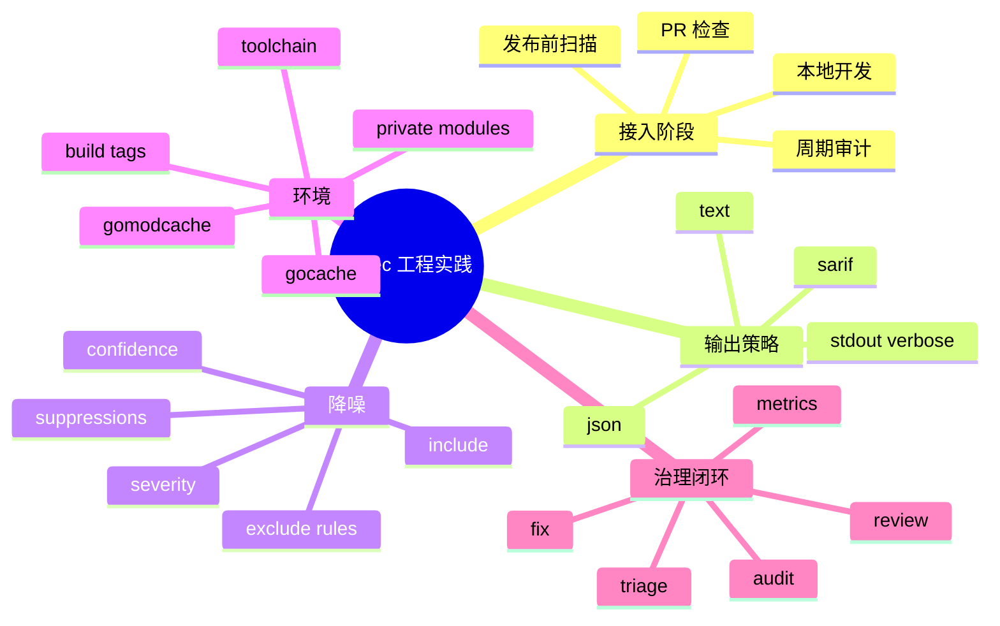

# 记忆卡片摘要（快速复习版）

## 1. 大纲（压缩版）
- 如何把 `gosec` 真正接入工程
- 本地开发、CI、定时审计三种模式
- 规则分层治理与降噪
- 报告格式选择与平台集成
- 误报处理、抑制审计与版本固定
- 受限环境、私有模块、缓存目录等实战细节

## 2. 思维导图（Mermaid）


## 3. 重要知识点（必须记住）
- 最佳实践不是“把所有规则一股脑打开”，而是“让扫描稳定、可解释、可落地、可持续”。[来源1][来源2][来源3]
- 团队第一次接入 gosec 时，优先保证包加载和报告产出稳定，再谈误报治理和阈值优化。[来源1][来源3][来源11]
- `-exclude` 应谨慎使用；更推荐 `--exclude-rules`、规则配置、带理由的源内抑制来做精细降噪。[来源1][来源2][来源4]
- 结构化输出建议至少保留 JSON 或 SARIF；终端 text 适合人看，结构化格式适合审计、趋势分析和平台集成。[来源1][来源3]
- 在 CI / 容器 / 沙箱环境中，`GOTOOLCHAIN`、`GOCACHE`、`GOMODCACHE`、私有模块认证常常决定“能不能跑”，而不是 gosec 规则本身。[来源1][来源11]

## 4. 难点 / 易混点
- “接入成功”不等于“立刻阻断所有 PR”。成熟团队一般分阶段接入。
- “误报处理”不等于“全局关规则”。
- “SARIF”不是给人看的，而是给平台吃的。
- “开发版二进制能跑”不等于“生产 CI 应该用 dev 版”。

## 5. QA 快速复习卡片
- Q: 第一次接入 gosec，最推荐的输出格式组合？
  A: 终端 `text` + 落盘 `json` 或 `sarif`
- Q: 发现很多噪音，先做什么？
  A: 先路径级排除和规则配置，不要先全局关规则。
- Q: 为什么 CI 里最好固定版本？
  A: 因为规则和检测边界会变，固定版本能保证结果稳定可追溯。
- Q: 什么时候用 `-no-fail`？
  A: 初次接入、灰度治理、保留报告但暂不阻断流程时。

## 6. 快速复现步骤（最短路径）
1. 本地先跑 `gosec ./...`，确认包加载没问题。
2. 再跑 `gosec -fmt=json -out=results.json -stdout -verbose=text ./...`，拿到人机双端结果。
3. CI 初期先用 `-no-fail`，收集几轮报告后再讨论阻断策略。
4. 对噪音高目录优先用 `--exclude-rules` 精细排除。
5. 对确认安全的个例，用带理由的 `#nosec` 并开启 `-track-suppressions` 做审计。

---

# 学习笔记正文（详细版）

## 0. 学习目标、读者画像与假设
- 技术：`gosec` 工程化扫描最佳实践
- 学习目标：把前面学到的 CLI、规则、原理，落实成“团队怎么真正用起来”的方法。
- 读者水平：面向工程负责人、平台同学、普通开发者都可读。
- 时间预算：标准版。
- 版本范围：基于本地仓库和官方文档。
- 假设与限制：默认读者希望在真实工程里长期使用 gosec，而不是只做一次演示。

## 1. 先讲一个总原则：稳定比激进更重要

很多团队第一次接入安全扫描时，最容易犯的错误是：

- 规则全开
- PR 立刻阻断
- 不做基线
- 不看误报
- 不留结构化结果

这样通常只会带来一件事：大家迅速讨厌这个工具。

更成熟的做法是分阶段：

1. 先跑通
2. 再看清
3. 再分层治理
4. 最后再决定是否阻断

为什么这样更好？

因为安全工具只有在团队愿意持续看、持续改、持续解释时，才真正创造价值。

## 2. 推荐的接入阶段

## 2.1 本地开发阶段

目标：
- 让开发者在改代码时能快速看到明显问题。

推荐做法：

```bash
gosec ./...
```

或者：

```bash
gosec -fmt=json -out=results.json -stdout -verbose=text ./...
```

为什么：
- `text` 适合人类快速浏览
- `json` 适合你留档或写脚本做二次处理

不建议：
- 本地开发阶段就强制所有人用最复杂配置

## 2.2 PR / CI 阶段

目标：
- 自动收集结果
- 不让明显高价值问题悄悄混进主干

初期推荐：

```bash
gosec -fmt=sarif -out=results.sarif -no-fail ./...
```

为什么先 `-no-fail`：
- 团队刚接入时通常会有历史问题、误报和环境噪音
- 先让报告进入系统，再讨论阻断阈值，更容易落地

官方 README 已给出 GitHub Action + SARIF 上传示例，适合直接落地到 GitHub code scanning。[来源1]

## 2.3 周期性审计阶段

目标：
- 发现长期潜在问题
- 审查是否有人滥用 `#nosec`

推荐做法：

```bash
gosec -track-suppressions -fmt=json -out=results-audit.json ./...
gosec -nosec=true -fmt=json -out=results-nosuppression.json ./...
```

这样你能看到两层信息：

- 平时真正会暴露的问题
- 被抑制但值得复查的问题

## 2.4 发布前或安全专项阶段

目标：
- 做更深度检查

可以考虑：
- `-enable-audit`
- 扫测试代码 `-tests`
- 加强阈值策略
- 和依赖漏洞扫描、SCA、DAST 结合使用

## 3. 推荐的输出策略

## 3.1 人看什么

人类最容易快速读的是 `text`。

适合：
- 本地开发
- 临时排查
- 快速沟通

## 3.2 机器看什么

推荐至少保留一种结构化结果：

- `json`
- `sarif`

为什么：
- 便于趋势分析
- 便于审计抑制
- 便于平台集成
- 便于对比不同版本扫描结果

## 3.3 一条很实用的组合命令

```bash
gosec -fmt=json -out=results.json -stdout -verbose=text ./...
```

这条命令很适合团队起步，因为：

- 终端里是易读文本
- 文件里是可处理 JSON

## 4. 降噪策略：顺序很重要

当团队说“gosec 太吵了”时，不要本能去全局关规则。推荐优先级如下。

## 4.1 第一优先：保证环境正确

如果扫描本身就因为环境问题乱报、漏报，后续所有治理都失真。

本地实验里就踩到了两个典型问题：

- `GOTOOLCHAIN=auto` 触发工具链下载
- 默认 `~/.cache/go-build` 在沙箱里不可写

把它们改成：

```bash
GOTOOLCHAIN=local
GOCACHE=/tmp/gocache
GOMODCACHE=/tmp/gomodcache
```

之后扫描才稳定输出真实结果。[来源11]

这说明一个非常工程化的道理：

先保证“能稳定复现”，再讨论“结果好不好看”。

## 4.2 第二优先：路径级排除

如果只是某些目录天然噪音高，比如：

- `scripts/`
- `cmd/demo/`
- `examples/`
- 某些生成目录

优先用：

```bash
--exclude-rules="scripts/.*:*;cmd/demo/.*:G204,G304"
```

好处：
- 影响范围可控
- 审计时容易解释
- 不会误伤全仓

## 4.3 第三优先：规则专属配置

例如 G101 的模式和熵阈值，可以根据团队代码风格微调。[来源2]

这比粗暴全局排除更专业，因为你是在调规则，而不是关规则。

## 4.4 第四优先：带理由的源内抑制

对经过人工确认安全的个例，使用：

```go
// #nosec G402 -- internal test endpoint only
```

并配合：

```bash
gosec -track-suppressions ...
```

这样以后还能追溯是谁、因为什么压掉的。

## 4.5 最后才考虑全局排除

只有当你非常明确：

- 某条规则在当前仓库阶段性完全不适用
- 且你已经评估过安全代价

才考虑 `-exclude=...`

## 5. 优先级治理：哪些问题先处理

不是所有问题都该按发现顺序处理。推荐按以下维度排序：

### 5.1 先看高严重级别、高置信度

例如本地实验中：
- G704
- G701

这类问题通常比低严重级别的 G104 更值得先看。[来源11]

### 5.2 再看“能形成真实攻击链”的

比如：
- 外部输入到 SQL / 命令 / 文件路径
- 弱随机数用于安全场景
- TLS 配置明显危险

### 5.3 最后看风格型或低风险基线问题

例如某些未处理错误场景，需要结合上下文排优先级。

## 6. 版本管理最佳实践

## 6.1 CI 中尽量固定版本

原因：
- 新版本可能新增规则
- 旧规则边界可能调整
- 结果数量和内容可能变化

如果你不固定版本，今天绿的 PR，明天可能因为工具升级突然变红。

官方 README 也建议在 GitHub Action 中使用明确版本标签，而不是长期漂在不确定构建上。[来源1]

## 6.2 不建议长期依赖 `dev` 二进制做生产扫描

你本地 PATH 里的 `gosec` 是 `dev`。这对学习和本地探索没问题，但对正式流水线不理想。

原因：
- 版本不可追溯
- 结果稳定性差
- 团队难以复现

更好的做法：
- CI 固定发布版本
- 本地探索可以用 dev

## 7. 私有模块、构建标签和大型仓库

## 7.1 私有模块

官方 README 提到，如果项目依赖私有 Go modules，需要配置认证，例如：

- `GOPRIVATE`
- GitHub token 或相应访问凭证[来源1]

这点很关键，因为很多人误以为“扫不到包”是规则问题，其实是认证问题。

## 7.2 构建标签

如果线上代码依赖 build tags，扫描时也应该传入相同标签：

```bash
gosec -tags enterprise,linux ./...
```

否则扫描到的代码集合可能和真实产物不同。

## 7.3 大型 monorepo

推荐策略：

- 先按路径拆治理批次
- 先输出结构化结果，再做平台汇总
- 对不同路径用不同 `exclude-rules`
- 保留一套审计模式命令，定期全量复查

## 8. 受限环境和缓存目录：真正的实战坑

本地实验给了一个非常好的工程案例。

一开始扫描失败，不是因为规则出错，而是因为：

- 样例 `go.mod` 声明了本机没有的 Go 版本
- `GOTOOLCHAIN=auto` 想下载工具链
- `~/.cache/go-build` 无写权限

解决后才成功得到真实扫描结果。[来源11]

这带来三条最佳实践：

第一，在 CI / 容器 / 沙箱环境里，永远先验证 `go list ./...` 是否能通。

第二，必要时显式设置：

```bash
GOTOOLCHAIN=local
GOCACHE=/tmp/gocache
GOMODCACHE=/tmp/gomodcache
```

第三，把“环境准备”写进扫描脚本，而不是靠人肉记忆。

## 9. 抑制治理：不要让 `#nosec` 变成垃圾桶

成熟团队对抑制的态度应该是：

- 允许，但要有理由
- 可以压，但要可追溯
- 定期复查，而不是永远不管

推荐组合：

- 日常扫描：尊重抑制
- 审计扫描：`-track-suppressions`
- 定期复查：`-nosec=true`

这样你既不会被误报淹没，也不会让抑制长期失控。

## 10. 一个可落地的最小实践方案

如果你要今天就把 gosec 接进团队，我建议从下面这套开始：

### 本地开发

```bash
gosec -fmt=json -out=results.json -stdout -verbose=text ./...
```

### CI 灰度阶段

```bash
gosec -fmt=sarif -out=results.sarif -no-fail ./...
```

### 周期审计

```bash
gosec -track-suppressions -fmt=json -out=results-audit.json ./...
gosec -nosec=true -fmt=json -out=results-nosuppression.json ./...
```

### 路径级降噪

```bash
gosec --exclude-rules="scripts/.*:*;cmd/demo/.*:G204,G304" ./...
```

### 受限环境

```bash
GOTOOLCHAIN=local GOCACHE=/tmp/gocache GOMODCACHE=/tmp/gomodcache gosec ./...
```

这套方案的优点是：

- 人和机器都能拿到结果
- 一开始不强制阻断
- 允许精细降噪
- 有审计闭环
- 能适配受限环境

## 11. 官方文档章节映射与重要例子保留检查

| 官方章节 / 文件 | 本文对应章节 | 说明 |
|---|---|---|
| README Quick start / Common usage patterns | 第 2、3、10 节 | 保留最常见工程命令组合 |
| README GitHub Action / SARIF integration | 第 2、3 节 | 用于 CI 集成建议 |
| README Path-Based Rule Exclusions | 第 4 节 | 降噪策略来源 |
| README Dependencies / Private Modules / Build tags | 第 7、8 节 | 真实工程环境配置 |
| README Tracking suppressions | 第 9 节 | 抑制审计闭环 |
| `cmd/gosec/main.go` | 第 3、4、5 节 | 输出、过滤、退出码与稳定性逻辑 |

保留的重要例子：
- `gosec -fmt=sarif -out=results.sarif ./...`
- GitHub Action 上传 SARIF
- `--exclude-rules="scripts/.*:*"`
- `-track-suppressions`
- `-tags debug,ignore`

## 12. 延伸学习路径（官方优先）
- 先读 README 中的 GitHub Action、SARIF、Dependencies、Path-Based Rule Exclusions。[来源1]
- 再读 `cmd/gosec/main.go`，理解参数和退出码逻辑。[来源3]
- 最后用自己的项目跑出第一份 JSON / SARIF，再开始细化规则治理。

---

# 练习与复习闭环

## 1. 分层练习

### 基础练习
- 写出一套“本地开发”“CI 灰度”“审计复查”三阶段命令。
- 说出为什么结构化结果至少要保留一种。
- 说出为什么不建议一开始就全局关规则。

### 应用练习
- 为一个含私有模块的 Go 项目设计 gosec 运行前准备项。
- 为一个 monorepo 设计一条路径级降噪策略。
- 设计一套抑制审计闭环。

### 综合练习
- 假设你们团队抱怨 gosec 噪音太高，请给出一个分阶段治理方案，而不是单纯 `-exclude` 一堆规则。

## 2. 动手任务（带验收标准）
- 任务：在一个真实 Go 仓库里完成以下四件事：
- 成功生成 text + JSON 报告
- 成功生成 SARIF
- 给某个确认安全的点写一条带理由的 `#nosec`
- 运行一次 `-track-suppressions`
- 验收标准：你能把扫描、降噪、审计、输出四个环节串成一个闭环说明。

## 3. 常见误区纠偏
- 误区：接入安全扫描就该马上阻断所有 PR。
  正解：成熟做法通常是先灰度、先建基线、先治理高价值问题。
- 误区：结构化输出可有可无。
  正解：没有 JSON/SARIF，很多审计、趋势分析和平台集成都会很难做。
- 误区：CI 跑不起来说明 gosec 不稳定。
  正解：很多时候是 Go toolchain、缓存目录、私有模块认证等环境问题。

## 4. 复习节奏建议
- Day 1：记住“先稳定，再激进”的总原则。
- Day 3：能说出接入三阶段策略。
- Day 7：自己写一套团队适用的命令组合和降噪规则。
- Day 14：复盘一次扫描结果，判断哪些问题该优先处理、哪些该配置化降噪。

## 5. 自测题与参考答案（简版）
- 题目 1：为什么 `-no-fail` 对初次接入很重要？
  参考答案：因为它允许先收集结果、建立认知，而不是立刻让流程全面红灯。
- 题目 2：为什么推荐 `exclude-rules` 胜过全局 `exclude`？
  参考答案：因为它更细粒度、更可审计、对全仓影响更小。
- 题目 3：为什么 CI 最好固定 gosec 版本？
  参考答案：因为规则边界变化会直接影响结果稳定性和可追溯性。

---

# 参考来源与版本说明

## 官方来源（优先）
1. [README.md](https://github.com/securego/gosec/blob/844b1703bf4fd59b110600317422f515cac6d603/README.md) - 用途：Quick start、GitHub Action、SARIF、Dependencies、Private Modules、Build tags、Tracking suppressions。
2. [RULES.md](https://github.com/securego/gosec/blob/844b1703bf4fd59b110600317422f515cac6d603/RULES.md) - 用途：规则类别和规则配置，支撑降噪策略。
3. [cmd/gosec/main.go](https://github.com/securego/gosec/blob/844b1703bf4fd59b110600317422f515cac6d603/cmd/gosec/main.go) - 用途：过滤、输出、退出码和参数生效逻辑。
4. [analyzer.go](https://github.com/securego/gosec/blob/844b1703bf4fd59b110600317422f515cac6d603/analyzer.go) - 用途：抑制、Issue 更新、审计理解。
5. [path_filter.go](https://github.com/securego/gosec/blob/844b1703bf4fd59b110600317422f515cac6d603/path_filter.go) - 用途：路径级排除的实现逻辑。
11. 本地实验与排障记录：`/home/nyn/Desktop/Projects/Agents/playground/Skills/tech-learning/workspace/gosec-learning/.lab/sampleapp` 下的成功扫描、失败扫描与缓存修复实验 - 访问日期：2026-03-28 - 用途：环境准备与工程落地案例。[来源11]

## 第三方来源（按采信程度标注）
1. [MITRE CWE](https://cwe.mitre.org/data/index.html) - 采信程度：高 - 用于辅助问题优先级语境。

## 关键结论引用映射
- [来源1] -> CI、SARIF、私有模块、构建标签和抑制跟踪的官方建议。
- [来源3] -> 退出码、过滤、输出逻辑的源码依据。
- [来源5] -> 为什么路径级排除是更好的降噪手段。
- [来源11] -> 受限环境中的真实缓存与 toolchain 排障案例。

## 冲突点与裁决（如有）
- 冲突点：很多团队希望“立刻阻断一切问题”，但现实中这常常让工具落地失败。
- 裁决依据：官方文档、源码逻辑与本地实验都表明，稳定输出和精细治理才是长期可持续路径。
- 采用结论：推荐分阶段接入，而不是一次性激进阻断。

## 技术版本与访问日期
- 本地仓库访问日期：2026-03-28
- 本地源码 commit：`844b1703bf4fd59b110600317422f515cac6d603`
