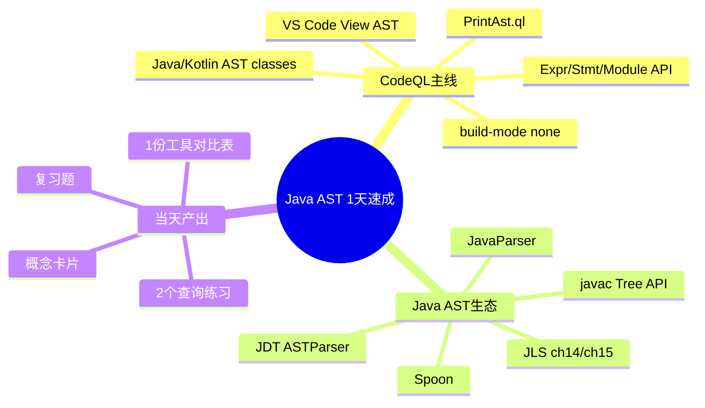

# Java AST 1天迅速入门学习计划（CodeQL主线）

> 目标：在 1 天内建立“Java AST 基础认知 + CodeQL AST 查询能力 + 主流 Java AST 工具对比视角”，并完成最小可交付练习。

## 0. 假设与范围
- 学习者水平：初学（会基础 Java，未系统学过 AST / CodeQL）。
- 时间预算：1 天（约 8-10 小时净学习）。
- 输出语言：中文。
- 环境限制：本文包含 Mermaid 思维导图，但当前环境未检测到 Mermaid CLI（`mmdc`），图语法未做编译级验证。

## 1. 记忆卡片摘要

### 1.1 一句话主线
- 先用 **CodeQL 官方 AST 视图 + 标准库文档** 建立“节点类型/语义”直觉，再用 `javac` / JavaParser / JDT / Spoon 做横向映射，最后通过 2 个小练习固化。

### 1.2 思维导图（速记）

### 1.3 必记知识点
- AST 是“语法结构树”，CodeQL 在其上提供可查询的语义模型（`Expr`、`Stmt`、`Method` 等）[S1][S2][S3]。
- CodeQL 最快入门方式：**先看 AST 视图**，再写查询；官方推荐可直接用 `CodeQL: View AST` 命令与 `PrintAst.ql` [S4][S5]。
- Java AST 工具分工：
  - `javac` Tree API：贴近编译器流程（parse/analyze/generate）[S6][S7]
  - JavaParser：工程化易用，Visitor 友好 [S8]
  - Eclipse JDT：IDE/重构生态强 [S10][S11]
  - Spoon：源码转换与分析能力强 [S12]

### 1.4 易混点
- 易混 1：Parse Tree vs AST。AST 更抽象，去掉部分语法噪声。
- 易混 2：CodeQL AST vs 编译器 AST。前者偏“查询语义模型”，后者偏“编译过程表示”。
- 易混 3：JavaParser 官网首页与 README 的版本信息不一致（首页偏旧、README 更新更快）[S8][S9]。

### 1.5 QA 快速复习
- Q：今天最先做什么？
- A：先在 VS Code 看 AST（`View AST`），再读 `Expr/Stmt` API。[S4][S2][S3]

- Q：为何先 CodeQL 再其他库？
- A：你的目标是 CodeQL 学习，先建立可查询心智模型最省时。

- Q：一天结束必须能做什么？
- A：能解释 `Expr/Stmt` 区别；能定位一个 Java 文件的关键 AST 节点并写出 2 条基础查询。

### 1.6 最短复现路径（90 分钟）
1. 阅读 `Abstract syntax tree classes` + `View AST` 官方页（20 分钟）[S1][S4]。
2. 对示例文件执行 AST 可视化（20 分钟）[S4][S5]。
3. 阅读 `Expr`、`Statement` API 页面（20 分钟）[S2][S3]。
4. 写 1 条“找指定方法调用表达式”的查询，1 条“找 if/for 语句”的查询（30 分钟）。

## 2. 1天学习计划（可直接执行）

### 09:00-09:40 模块 A：环境与主线搭建
- 任务：明确 CodeQL 工具链（CLI + VS Code 扩展）和样例工程。
- 阅读：CodeQL CLI 文档；Java/Kotlin 查询简介 [S13][S14]。
- 产出：学习清单 + 今日样例项目路径。

### 09:40-11:10 模块 B：CodeQL AST 核心（重点）
- 任务：
  1. 阅读 AST classes 文档，理解 AST 节点分类。
  2. 在 VS Code 运行 `CodeQL: View AST`。
  3. 用 `PrintAst.ql` 观察树结构。
- 阅读：[S1][S4][S5]
- 产出：
  - 记录 10 个常见节点类别（表达式、语句、声明等）。
  - 截图/笔记：1 个类、1 个方法、1 个 if 语句的 AST 路径。

### 11:10-12:10 模块 C：CodeQL AST API 快速通读
- 任务：聚焦 `Expr`、`Statement`、`java` 模块入口。
- 阅读：[S2][S3][S15]
- 产出：
  - 术语卡：`Expr` vs `Stmt` vs `Decl`。
  - 查询草稿 2 条（先不追求复杂）。

### 13:30-14:20 模块 D：Java 语言规范映射
- 任务：把 AST 节点与 JLS 章节做最小映射（语句/表达式）。
- 阅读：JLS Chapter 14/15 [S16][S17]
- 产出：`AST节点 -> JLS章节` 对照表（10 行以内）。

### 14:20-15:20 模块 E：Java AST 生态横向理解
- 任务：快速理解 4 套常见 Java AST 体系的定位差异。
- 阅读：`javac` API、JavaParser、JDT、Spoon [S6][S8][S10][S12]
- 产出：工具对比表（见第 3 节模板）。

### 15:30-17:00 模块 F：动手练习（当天核心）
- 练习 1（基础）：
  - 目标：找出项目中所有 `if`、`for`、`while` 语句节点。
  - 验收：能输出位置与节点类型。
- 练习 2（应用）：
  - 目标：找出某个敏感 API 调用表达式（例如 `Runtime.getRuntime().exec`）并关联其所在方法。
  - 验收：能输出调用点 + 所属方法 + 文件位置。

### 19:30-20:30 模块 G：复盘与巩固
- 复盘清单：
  - 能口头解释 CodeQL AST 与 javac AST 的区别。
  - 能从 AST 视图反推查询条件。
  - 能独立修改练习 2 中的 API 模式。
- 完成 10 分钟自测题（见第 5 节）。

## 3. 资源列表（分级 + 用法）

## A 级（必读，官方/一手）
1. CodeQL Java/Kotlin AST 类文档（官方）[S1]
- 用法：先读概念和入口类型，再进入 API 细节。

2. CodeQL `Expr` API 文档 [S2]
- 用法：学习表达式相关节点，做调用点查询时必查。

3. CodeQL `Statement` API 文档 [S3]
- 用法：做控制流语句扫描（if/for/while）时必查。

4. CodeQL VS Code AST 视图文档 [S4]
- 用法：入门第一小时就操作，建立“源码->AST”映射直觉。

5. CodeQL `PrintAst` 模块文档 [S5]
- 用法：快速打印 AST，验证你对节点层级的理解。

6. CodeQL CLI Java/Kotlin 文档（含 `build-mode none` 信息）[S13]
- 用法：数据库构建/分析流程参考。

7. Oracle `JavacTask` / Tree API 官方文档 [S6][S7]
- 用法：理解编译器视角 AST 生命周期（parse/analyze/generate）。

8. Java 语言规范 JLS Chapter 14/15 [S16][S17]
- 用法：给语句/表达式节点提供语义锚点。

## B 级（高质量补充）
1. JavaParser 官方 README（GitHub）[S8]
- 用法：快速上手 Visitor 与解析实践。

2. Eclipse JDT AST 包与 `ASTParser` 文档 [S10][S11]
- 用法：理解 IDE 场景下 AST 解析/重构模型。

3. Spoon 官方 Launcher 文档 [S12]
- 用法：学习基于模型的源码分析和转换。

## C 级（选读）
1. JavaParser 官网首页 [S9]
- 用法：仅作入口；版本信息以 README/Release 为准。

## 4. 官方章节映射（CodeQL主轴）

| 官方章节/页面 | 你今天对应学习环节 | 目标产出 |
|---|---|---|
| AST classes（Java/Kotlin）[S1] | 模块 B | 节点分类笔记 |
| Viewing AST in VS Code [S4] | 模块 B | 源码->AST 对应截图 |
| PrintAst module [S5] | 模块 B | 树结构观察记录 |
| `Expr` API [S2] | 模块 C/F | 调用表达式查询 |
| `Statement` API [S3] | 模块 C/F | 控制流语句查询 |
| Java/Kotlin module index [S15] | 模块 C | API 导航习惯 |

## 5. 练习与复习闭环

### 5.1 分层练习
- 基础：列出全部语句节点并按类型计数。
- 应用：定位敏感调用并关联方法/类。
- 综合：自拟一个“小型静态检查规则”（例如禁止在某包内使用某 API）。

### 5.2 验收标准
- 能解释查询中每个谓词/条件对应的 AST 含义。
- 查询结果可回溯到源码位置。
- 至少完成 1 次“结果不符合预期 -> 回看 AST 视图 -> 调整查询”的闭环。

### 5.3 复习节奏
- 1 天后：重做练习 1（不看笔记）。
- 3 天后：把练习 2 的 API 规则替换为新规则并跑通。
- 7 天后：做 1 条结合 AST + 数据流的简单查询。
- 14 天后：输出一页“CodeQL AST 常用节点字典”。

### 5.4 自测题（简版）
1. `Expr` 与 `Stmt` 的核心区别是什么？
2. 为什么官方建议先看 AST 再写查询？
3. `build-mode none` 适用于什么场景？[S13]
4. JavaParser 与 JDT ASTParser 的典型使用场景差异是什么？
5. 如何用 JLS 章节辅助理解 AST 节点边界？

## 6. 来源、版本与裁决说明

### 6.1 来源清单
- [S1] CodeQL: Abstract syntax tree classes for working with Java and Kotlin programs  
  https://codeql.github.com/docs/codeql-language-guides/abstract-syntax-tree-classes-for-working-with-java-programs/
- [S2] CodeQL Java Standard Library: Expr module  
  https://codeql.github.com/codeql-standard-libraries/java/semmle/code/java/Expr.qll/module.Expr.html
- [S3] CodeQL Java Standard Library: Statement module  
  https://codeql.github.com/codeql-standard-libraries/java/semmle/code/java/Statement.qll/module.Statement.html
- [S4] CodeQL for VS Code: Viewing the abstract syntax tree of a source file  
  https://docs.github.com/en/code-security/codeql-for-vs-code/exploring-the-structure-of-your-source-code
- [S5] CodeQL Java Standard Library: PrintAst module  
  https://codeql.github.com/codeql-standard-libraries/java/codeql/util/PrintAst.qll/module.PrintAst.html
- [S6] Oracle Java API: `JavacTask`  
  https://docs.oracle.com/en/java/javase/25/docs/api/jdk.compiler/com/sun/source/util/JavacTask.html
- [S7] Oracle Java API: `com.sun.source.tree` package summary  
  https://docs.oracle.com/en/java/javase/25/docs/api/jdk.compiler/com/sun/source/tree/package-summary.html
- [S8] JavaParser GitHub README  
  https://github.com/javaparser/javaparser
- [S9] JavaParser 官网首页  
  https://javaparser.org
- [S10] Eclipse JDT `org.eclipse.jdt.core.dom` package summary  
  https://help.eclipse.org/latest/topic/org.eclipse.jdt.doc.isv/reference/api/org/eclipse/jdt/core/dom/package-summary.html
- [S11] Eclipse JDT `ASTParser`  
  https://help.eclipse.org/latest/topic/org.eclipse.jdt.doc.isv/reference/api/org/eclipse/jdt/core/dom/ASTParser.html
- [S12] Spoon `Launcher` API  
  https://spoon.gforge.inria.fr/mvnsites/spoon-core/apidocs/spoon/Launcher.html
- [S13] CodeQL CLI: Creating databases for Java and Kotlin  
  https://docs.github.com/en/code-security/codeql-cli/codeql-cli-manual/database-create
- [S14] CodeQL Java/Kotlin queries documentation  
  https://codeql.github.com/docs/codeql-language-guides/codeql-for-java-and-kotlin/
- [S15] CodeQL Java/Kotlin module index  
  https://codeql.github.com/codeql-standard-libraries/java/java.qll/module.java.html
- [S16] JLS Chapter 14 (Blocks and Statements)  
  https://docs.oracle.com/javase/specs/jls/se21/html/jls-14.html
- [S17] JLS Chapter 15 (Expressions)  
  https://docs.oracle.com/javase/specs/jls/se21/html/jls-15.html

### 6.2 版本与访问日期
- 访问日期：2026-02-28。
- CodeQL 标准库页面显示版本区间为 `7.8.x`（页面内可见 `7.8.4` / `7.8.5-dev` 标记）[S2][S3][S15]。
- JDT 页面为 `latest`（当前显示 2025-12 / 4.38）[S10]。

### 6.3 冲突点与裁决
- 冲突：JavaParser 官网首页显示支持范围偏旧（Java 1-12）[S9]，而 GitHub README 显示已支持到更高版本（Java 1-25）[S8]。
- 裁决：以官方维护更活跃、更新更及时的 GitHub README/Release 信息为主；官网首页仅作入口参考。
