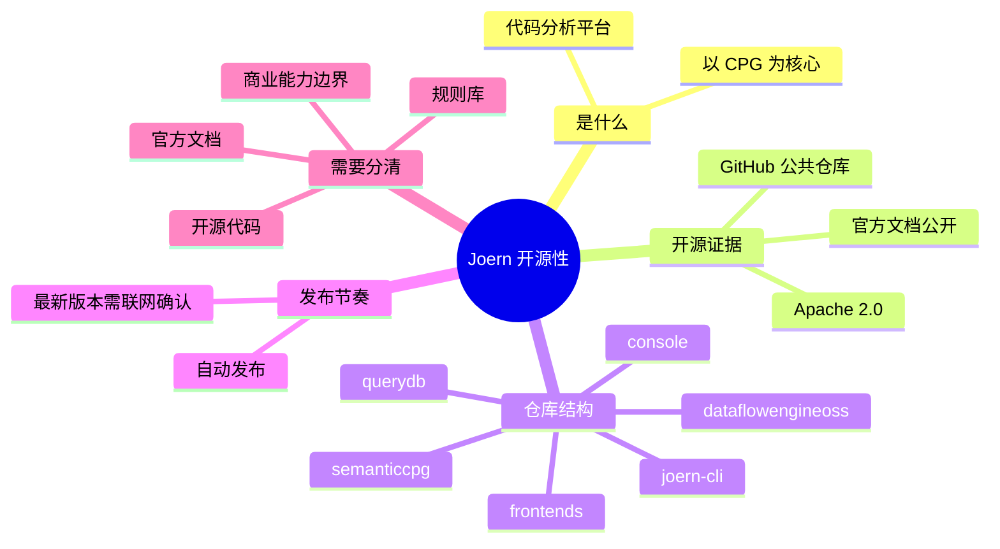

# 记忆卡片摘要（快速复习版）

## 1. 大纲（压缩版）

- Joern 是什么
- Joern 到底是不是开源软件
- 仓库、许可证、发布机制分别说明什么
- “开源”不等于“所有能力都一样”
- 怎么从仓库结构读懂 Joern
- 初学者应该怎样判断哪些信息可信

## 2. 思维导图（Mermaid）

## 3. 重要知识点（必须记住）

- Joern 是开源的，而且不是“只有客户端开源、核心闭源”的那种表面开源；它的主仓库、许可证、文档和查询数据库入口都公开可见。[来源1][来源2][来源3]
- Joern 的核心定位不是“某个单点扫描器”，而是“以 Code Property Graph 为核心的静态分析平台”。`joern-scan` 只是它上面的一种用法。[来源1][来源4][来源5]
- 官方 GitHub 仓库里不只有 CLI，还包含语义层、数据流引擎、语言前端和规则库。这说明它不是只开一个壳，而是把主要分析能力都放进了公开仓库里。[来源1][来源6]
- “开源”不代表“文档永远与最新源码完全同步”。例如安装文档仍提到 JDK 19，而最新仓库 README 已写 JDK 21；学习时必须优先看时间更新更近、上下文更具体的一手来源。[来源1][来源7]
- 最新 release 需要联网确认。按 2026-03-19 实际核对，Joern 最新稳定版为 `v4.0.506`，发布时间是 2026-03-18。[来源8]

## 4. 难点 / 易混点

- 易混点 1：Joern 开源，不等于任何基于 CPG 的产品都开源。你要分清“Joern 项目本身”与“商业版产品/历史产品名”。
- 易混点 2：GitHub 上有公开仓库，不等于仓库里的每个说明都同样新。README、docs 站点、release API 可能存在时间差。
- 易混点 3：规则库 `querydb` 虽然在主仓库里，但它既是代码目录，也是发布产物，还能被当作插件动态安装；这三层身份经常让初学者混淆。

## 5. QA 快速复习卡片

- Q：Joern 是开源的吗？
  A：是。官方 GitHub 仓库公开，许可证为 Apache License 2.0。[来源1][来源2]
- Q：Joern 开源到什么程度？
  A：主仓库包含 CLI、控制台、语言前端、数据流引擎、语义 CPG、规则仓 `querydb` 等核心模块。[来源1][来源6]
- Q：怎么确认“最新版本”？
  A：不要只看 README 里的示例版本号，要查 GitHub releases/latest 或 release 页面。[来源8]
- Q：官方文档和源码冲突时看哪个？
  A：先看更近的时间戳，再看更具体的上下文；安装运行看 release 和安装页，源码构建看仓库 README 与源码配置。[来源1][来源7][来源8]

## 6. 快速复现步骤（最短路径）

1. 打开 `https://github.com/joernio/joern`，确认仓库是公开仓库。[来源1]
2. 打开 `https://github.com/joernio/joern/blob/master/LICENSE`，确认许可证是 Apache 2.0。[来源2]
3. 打开 `https://docs.joern.io/`，确认官方文档公开可访问。[来源3]
4. 打开 `https://api.github.com/repos/joernio/joern/releases/latest`，确认最新 release 与发布日期。[来源8]
5. 浏览仓库根目录，观察 `joern-cli`、`console`、`querydb`、`semanticcpg`、`dataflowengineoss` 等核心目录。[来源1][来源6]

---

# 学习笔记正文（详细版）

## 0. 学习目标、读者画像与假设

- 技术：`Joern`
- 学习目标：理解 Joern 是否开源、开源范围有多大、官方材料之间如何交叉核实。
- 读者水平：零基础到初学。
- 时间预算：按“系统学习”处理，不做极短版压缩。
- 版本范围：以 2026-03-19 可访问的官方仓库与官方文档为准。
- 运行环境：本地阅读文档即可，不要求你已经安装 Joern。
- 假设与限制：
  - 本文重在“看懂 Joern 的开放性与资料入口”，不是安装教程。
  - 涉及“最新版本”的结论都已联网核验。
  - 个别官方文档页面存在历史内容残留，因此本文会显式指出冲突和裁决依据。

## 1. 背景与用途（从读者视角）

如果你是第一次接触 Joern，最先会冒出来的常见问题不是“怎么写查询”，而是：

- 这东西到底是不是开源？
- 我现在看到的 GitHub 仓库是不是官方主仓？
- 规则、前端、数据流这些关键能力到底在不在公开代码里？
- 文档里有些版本号看起来很旧，我该相信哪个？

这些问题很实际。因为很多安全工具都存在几种情况：

- 有公开仓库，但只开了一个很薄的外壳。
- 文档公开，但真正重要的检测能力在闭源服务端。
- 仓库公开，但长期不维护。
- README 还是旧版本，用户按它操作会踩坑。

Joern 值得单独澄清，是因为它在公开材料里同时呈现出“平台”“分析框架”“规则库”“CLI 工具”四重身份。你如果只看其中一层，很容易误判它到底开源了什么、没开什么。

## 2. Joern 到底是什么

官方 README 对 Joern 的定义非常关键：它是一个分析源码、字节码和二进制程序的代码分析平台，核心产物是 Code Property Graph，也就是 CPG。[来源1]

对非科班读者，可以把它先理解成：

- 它不是普通的关键字扫描器。
- 它不是只会跑若干固定规则的黑盒工具。
- 它更像一个“把程序翻译成可查询图结构，再允许你用 DSL 挖问题”的分析工作台。

这一定义很重要，因为它直接解释了为什么 Joern 的开源形态不是只有一个二进制包，而是会拆成很多模块：

- 生成图的前端
- 存图和访问图的核心能力
- 语义扩展与 overlay
- 数据流分析引擎
- 规则库
- 交互式 shell 与 CLI 命令

也就是说，你在判断“Joern 是否开源”时，不能只盯着 `joern` 这个命令，而要看这些关键部件是否公开。

## 3. Joern 是否开源：结论先说

结论很明确：**Joern 是开源项目**。[来源1][来源2][来源3]

证据链有四层：

### 3.1 官方 GitHub 仓库公开

官方主仓库是 `joernio/joern`，公开可访问，仓库首页直接将它描述为一个 open-source code analysis platform。[来源1]

这说明至少三件事：

- 仓库不是私有仓镜像。
- 公开代码不是第三方非官方 fork。
- 核心维护入口就在公开仓。

### 3.2 许可证公开且为 Apache License 2.0

仓库根目录存在 `LICENSE` 文件，内容为 Apache License 2.0。[来源2]

对初学者，这意味着：

- 你可以合法阅读、学习、修改、分发其开源部分。
- 商业使用通常也友好，但要遵守许可证条款。
- 它不是“只允许看源码、不允许实际用”的受限源码协议。

### 3.3 官方文档公开

官方文档站点 `https://docs.joern.io/` 可直接公开访问，并且把安装、快速开始、工作区、扫描、前端、CPGQL 参考等核心使用材料都放出来了。[来源3]

如果一个项目只开放仓库、不开放主文档，学习成本会很高。Joern 不是这种情况。

### 3.4 官方 release 公开分发

GitHub releases 页面和 `releases/latest` API 都公开可访问。按 2026-03-19 实际查询，最新稳定版为 `v4.0.506`，发布时间是 2026-03-18。[来源8]

这说明它不是“源代码给你看，但二进制和发布过程不公开”的模式。

## 4. Joern 开源到什么程度

很多人问“开源吗”，真正想问的是第二层：**核心能力开到什么程度**。

从官方仓库根目录和模块结构看，Joern 至少把以下核心能力公开了：[来源1][来源6]

### 4.1 `joern-cli`

这是用户最常接触的命令行工具集合，包含：

- `joern`
- `joern-scan`
- `joern-parse`
- `joern-export`
- `joern-flow`
- `joern-slice`
- `joern-vectors`

这意味着用户层入口不是闭源包装器。

### 4.2 `console`

这里放的是交互式 shell、workspace 管理、脚本执行桥接、插件处理等能力。[来源9]

它的重要性在于：Joern 不是单纯的批处理扫描器，它把“人和图交互”的那层也公开了。

### 4.3 `querydb`

这是规则仓，也就是很多人最关心的“漏洞规则到底放在哪里”。官方 README 明确说 QueryDB 是把 Joern 变成 ready-to-run scanner 的核心查询数据库，同时也是用户学习如何编写查询的样例集合。[来源10]

这说明“默认规则”不是一团看不见的服务端逻辑。

### 4.4 `semanticcpg`

这是语义层扩展，决定很多查询为什么能写得比较抽象、比较像领域语言，而不是只能硬拼图遍历。[来源1]

### 4.5 `dataflowengineoss`

光看目录名就能明白，这是开源数据流引擎模块。它直接回应了一个核心疑问：Joern 的 taint/data-flow 分析并不是完全黑盒。[来源6]

### 4.6 `frontends`

在 `joern-cli/frontends` 下可以看到多语言前端，包括 C/C++、Java、JavaScript、Python、PHP、Go、Kotlin、Ruby、Swift、C#、Ghidra、Jimple 等。[来源6][来源11]

这说明“把不同语言翻译成统一 CPG”的关键环节也在公开仓库中。

## 5. 为什么还会有人误以为它“不完全开源”

这通常有几个原因。

### 5.1 因为 Joern 是“平台”，不是单独一个命令

如果你只装过 `joern`，你会以为它只是一个 REPL。  
如果你只用过 `joern-scan`，你会以为它只是规则扫描器。  
如果你只看过 CPG 论文，又会以为它只是学术原型。

实际上这三者在 Joern 里是一体的。平台级工具天然更容易让初学者“只见局部，不见全貌”。

### 5.2 因为官方文档有历史内容残留

例如：

- 仓库 README 当前写的要求是 JDK 21。[来源1]
- 官方安装页仍写着 JDK 19，且示例输出里的版本号还是 `2.0.42`。[来源7]

这不是“项目闭源”，而是“文档更新时间不完全一致”。但如果你不做交叉验证，就会误判项目现状。

### 5.3 因为安全工具领域常见“开源框架 + 商业增强”

用户在看到 Joern 相关历史资料时，可能会混入别的产品名、历史公司背景或商业扩展印象，从而误以为 Joern 本体也只是演示版。

这里最稳妥的做法是：**只基于当前官方仓库、官方文档、当前 release 来下结论**。这样能避免把历史印象当成现状。

## 6. 如何从仓库结构判断“它是不是实开源”

对非科班读者，一个非常实用的方法是看仓库有没有同时公开以下五类东西：

1. 入口程序
2. 核心引擎
3. 规则/插件
4. 测试或示例
5. 发布机制

Joern 基本都满足。

### 6.1 有入口程序

`joern-cli` 明确存在。[来源6]

### 6.2 有核心引擎

`semanticcpg`、`dataflowengineoss`、`console` 都公开。[来源6]

### 6.3 有规则仓

`querydb` 公开，README 还直接讲怎么写规则、怎么测规则。[来源10]

### 6.4 有多语言前端

`joern-cli/frontends` 公开，说明不是拿公开仓做展示、实际前端放闭源处。[来源6][来源11]

### 6.5 有持续发布

官方 README 写明新 release 会自动创建；当前 latest release 也能实际查到。[来源1][来源8]

这五点合在一起，基本可以判定：Joern 的开源不是“样板式开源”，而是具备真实可学习、可构建、可扩展价值的开源。

## 7. 开源不等于“信息永远一致”：怎么裁决冲突

这是学习开源项目时非常重要的能力。

### 冲突点：JDK 19 还是 JDK 21

- 来源 A：官方安装文档写 `JDK 19`，并说更高版本“可能可用”。[来源7]
- 来源 B：仓库 README 写 `JDK 21`，并强调其他版本“可能可以，但未充分测试”。[来源1]

### 差异原因判断

- 安装文档更像“用户安装指南”，更新速度可能慢。
- README 更贴近当前仓库维护状态，尤其当它同时描述开发、测试与当前模块结构时，通常更能反映源码主线。

### 本文采用结论

- **源码构建、开发与测试优先按 JDK 21 理解。**
- **如果你只是尝试官方发行版，JDK 19+ 这条历史说明仍有参考价值，但不应把它当成最新开发基线。**

这类裁决方法比背具体数字更重要。因为你以后学任何安全工具都会碰到“release 新，文档旧”的现实问题。

## 8. 初学者应该怎么进入 Joern 的公开材料

推荐顺序如下：

### 第一步：先看仓库首页

看它怎么定义自己，看 release、license、模块目录在不在。[来源1][来源2]

### 第二步：再看文档首页

看有没有 Quickstart、Scan、Frontends、Reference Card 这些主线入口。[来源3]

### 第三步：把规则仓和 CLI 源码连起来看

这样你会理解：

- `joern-scan` 为什么能跑
- 查询是怎么被发现和加载的
- 规则是怎么从 bundle 变成扫描结果的

### 第四步：遇到版本冲突时，去查 latest release

不要让 README 里的旧截图和博客里的旧命令绑架你。[来源8]

## 9. 必须记住 / 先知道即可

### 必须记住

- Joern 是官方公开维护的开源项目。
- 主仓库里包含核心模块，不只是壳。
- 规则仓 `querydb` 也在公开代码里。
- 最新信息要以 release 和当前仓库状态为准。

### 先知道即可

- 文档站点某些页面存在版本滞后。
- 不同模块对 JDK 的要求可能呈现“运行时”和“开发时”两套语境。

## 10. 延伸学习路径（官方优先）

- 如果你刚起步：先读 Quickstart，再读 Workspace 和 Traversal Basics。[来源12][来源13][来源14]
- 如果你关心扫描：接着读 Joern Scan 与 QueryDB README。[来源5][来源10]
- 如果你关心原理：接着读 Code Property Graph 页面与 CPG 规范站点。[来源4][来源15]
- 如果你关心定制：接着读 Custom Static Analysis 与 Custom Data-Flow Semantics。[来源16][来源17]

---

# 练习与复习闭环

## 1. 分层练习

### 基础练习

- 练习 1：在 GitHub 上定位 Joern 的许可证文件，并说出许可证名称。
- 练习 2：找出仓库里至少 5 个核心目录，并用一句话解释它们做什么。
- 练习 3：找到 latest release，记下版本号和发布日期。

### 应用练习

- 练习 4：比较 README 与安装文档中对 JDK 要求的写法，写出你的裁决结论。
- 练习 5：解释为什么 `querydb` 的公开存在能增强你对“Joern 确实开源”的判断。

### 综合练习

- 练习 6：假设有人说“Joern 只是公开了一个命令行壳子”，请你用仓库结构给出反驳。

## 2. 动手任务（带验收标准）

- 任务：写一页你自己的“Joern 开源性判断清单”。
- 验收标准：
  - 至少包含仓库、许可证、release、规则仓、核心引擎五项。
  - 每项后面都要写出你准备查看的官方链接。
  - 能解释“为什么只看 README 不够”。

## 3. 常见误区纠偏

- 误区：GitHub 有仓库就等于资料不会过时。
  正解：仓库公开只说明代码可见，不说明每份文档都同步更新。

- 误区：文档里出现旧版本号，就说明项目不维护。
  正解：更可能是某些页面示例没更新，应该去查 latest release。

- 误区：只有 `joern-scan` 算功能，`querydb` 和 `semanticcpg` 不重要。
  正解：这些才是平台级能力的重要部分。

## 4. 复习节奏建议

- Day 1：记住 Joern 是开源平台，不只是扫描器。
- Day 3：复述仓库里 5 个核心目录分别做什么。
- Day 7：能独立解释“README、docs、release 冲突时怎么裁决”。
- Day 14：不看笔记，重新写出“为什么 Joern 是实开源而不是表面开源”。

## 5. 自测题与参考答案（简版）

- 题目 1：Joern 是否开源？
  参考答案：是，官方仓库公开、许可证公开、文档公开、release 公开。[来源1][来源2][来源3][来源8]

- 题目 2：为什么要看 `querydb`？
  参考答案：因为它证明默认规则和查询样例也是公开的，不是闭源服务端逻辑。[来源10]

- 题目 3：安装文档和 README 的 JDK 要求冲突时怎么办？
  参考答案：优先看时间更新更近、上下文更具体的一手来源；当前构建开发以 README 的 JDK 21 为主理解，同时保留安装页 JDK 19+ 的历史参考。[来源1][来源7]

---

# 参考来源与版本说明

## 官方来源（优先）

1. [joernio/joern GitHub 仓库](https://github.com/joernio/joern) - 访问日期：2026-03-19 - 用于确认项目定位、目录结构、README、发布说明。
2. [Joern LICENSE](https://github.com/joernio/joern/blob/master/LICENSE) - 访问日期：2026-03-19 - 用于确认开源许可证。
3. [Joern 官方文档首页](https://docs.joern.io/) - 访问日期：2026-03-19 - 用于确认官方文档入口与主线章节。
4. [Code Property Graph | Joern Documentation](https://docs.joern.io/code-property-graph/) - 访问日期：2026-03-19 - 用于确认平台核心概念。
5. [Joern Scan | Joern Documentation](https://docs.joern.io/scan/) - 访问日期：2026-03-19 - 用于确认扫描器是平台上的一层能力。
6. [Joern 仓库模块结构](https://github.com/joernio/joern) - 访问日期：2026-03-19 - 用于观察 `joern-cli`、`querydb`、`semanticcpg`、`dataflowengineoss` 等目录。
7. [Installation | Joern Documentation](https://docs.joern.io/installation/) - 访问日期：2026-03-19 - 用于确认安装页对 JDK 的表述。
8. [Joern latest release API](https://api.github.com/repos/joernio/joern/releases/latest) - 访问日期：2026-03-19 - 用于确认最新稳定版 `v4.0.506` 及发布时间 2026-03-18。
9. [BridgeBase.scala](https://github.com/joernio/joern/blob/master/console/src/main/scala/io/joern/console/BridgeBase.scala) - 访问日期：2026-03-19 - 用于确认 `joern` 顶层能力并非封闭壳。
10. [querydb/README.md](https://github.com/joernio/joern/blob/master/querydb/README.md) - 访问日期：2026-03-19 - 用于确认规则仓定位与开放方式。
11. [Projects.scala](https://github.com/joernio/joern/blob/master/project/Projects.scala) - 访问日期：2026-03-19 - 用于确认前端模块集合。
12. [Quickstart | Joern Documentation](https://docs.joern.io/quickstart/) - 访问日期：2026-03-19.
13. [Workspace | Joern Documentation](https://docs.joern.io/organizing-projects/) - 访问日期：2026-03-19.
14. [Traversal Basics | Joern Documentation](https://docs.joern.io/traversal-basics/) - 访问日期：2026-03-19.
15. [Code Property Graph Specification](https://cpg.joern.io/) - 访问日期：2026-03-19.
16. [Creating a Custom Static Analysis with Joern](https://docs.joern.io/developer-guide/custom-tool/) - 访问日期：2026-03-19.
17. [Custom Data-Flow Semantics | Joern Documentation](https://docs.joern.io/dataflow-semantics/) - 访问日期：2026-03-19.

## 第三方来源（按采信程度标注）

- 本文未依赖第三方非官方来源作为结论依据。

## 关键结论引用映射

- [来源1] `joernio/joern` 官方仓库 README 与根目录。
- [来源2] 官方许可证文件。
- [来源3] 官方文档首页。
- [来源4] 官方 Code Property Graph 文档页。
- [来源5] 官方 Joern Scan 文档页。
- [来源6] 官方仓库目录结构。
- [来源7] 官方安装页。
- [来源8] GitHub 官方 release API。
- [来源9] `BridgeBase.scala` 源码。
- [来源10] `querydb/README.md`。
- [来源11] `Projects.scala`。
- [来源12] Quickstart。
- [来源13] Workspace。
- [来源14] Traversal Basics。
- [来源15] CPG 规范站点。
- [来源16] Custom Static Analysis 文档。
- [来源17] Custom Data-Flow Semantics 文档。

## 官方文档章节映射与重要例子保留检查

- 官方首页 `Overview`：
  - 已映射到本文第 2 节和第 4 节。
- 官方 `Installation`：
  - 已映射到本文第 7 节中的版本冲突裁决。
- 官方 `Joern Scan`：
  - 已映射到本文第 2 节和第 10 节，用来说明“扫描器只是平台能力之一”。
- 官方 `Quickstart / Workspace / Traversal Basics`：
  - 已映射到本文第 10 节的学习路径。
- 重要例子保留情况：
  - 本文不以操作示例为主，因此未展开 Quickstart 的 `X42` 例子；原因是本篇主题是“开源性判断”，详细操作被保留到其他文档。

## 冲突点与裁决

- 冲突点：JDK 要求。
- 来源 A（Installation 页，访问于 2026-03-19）：JDK 19。
- 来源 B（GitHub README，访问于 2026-03-19）：JDK 21。
- 差异原因判断：安装页较旧，README 更贴近当前仓库维护基线。
- 本笔记采用结论：源码构建与开发以 JDK 21 为主；发行版运行可将 JDK 19+ 视为历史兼容参考。

## Mermaid 验证说明

- 已于 2026-03-19 在当前环境使用 `npx @mermaid-js/mermaid-cli` 对本文 Mermaid 图完成编译验证，通过。
