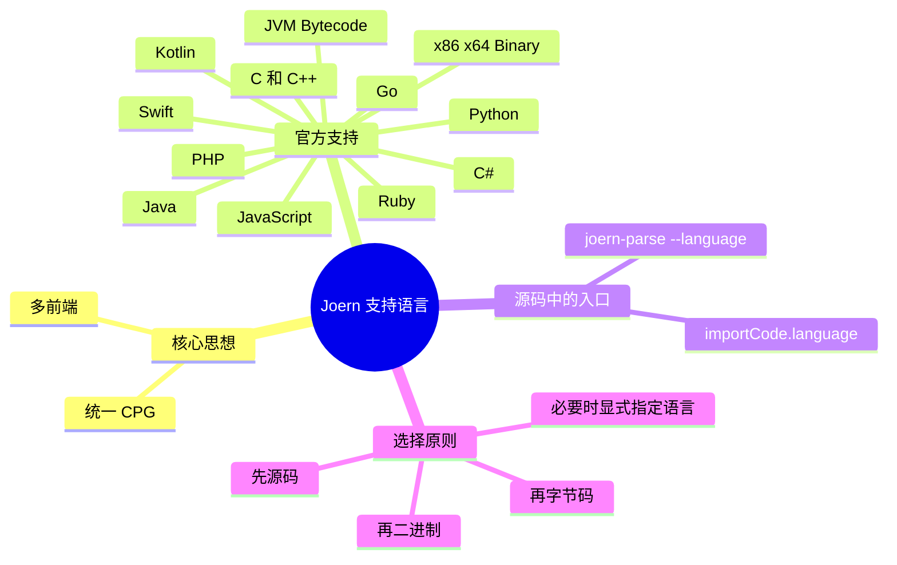

# 记忆卡片摘要（快速复习版）

## 1. 大纲（压缩版）

- Joern 为什么能做多语言分析
- 官方文档列出的支持语言有哪些
- 仓库源码里还能看到哪些前端入口
- 源码、字节码、二进制前端有什么区别
- 自动识别语言如何工作
- 真实项目中该如何选前端

## 2. 思维导图（Mermaid）

## 3. 重要知识点（必须记住）

- Joern 的多语言能力不是靠“每门语言写一套独立规则”实现的，而是靠“多个前端先把不同语言统一翻译成 CPG”。[来源1][来源2]
- 官方 Overview 页面列出了 C/C++、Java、JavaScript、Python、x86/x64、JVM bytecode、Kotlin、PHP、Go、Ruby、Swift、C# 等支持对象，并给出成熟度信息。[来源1]
- 仓库源码里的 `ImportCode.scala` 与 `Projects.scala` 还能看到更细的入口，例如 `jvm`、`ghidra`、`llvm`、`jssrc`、`swiftsrc`、`csharpsrc` 等。[来源3][来源4]
- 对初学者最重要的不是死记所有前端名字，而是先区分三类输入：源码、字节码、二进制。它们的精度、语义恢复难度和适用场景都不同。[来源1][来源3]
- 自动语言检测不是万能的；官方 Common Issues 明确提示，若自动检测失败，应显式指定 `--language` 或在 shell 里使用 `importCode.<language>`。[来源5][来源6]

## 4. 难点 / 易混点

- 易混点 1：`Java` 在 Joern 里可能指 Java 源码，也可能指 JVM bytecode/Jimple 路线。
- 易混点 2：`javascript` 与 `jssrc` 不是完全同一回事；源码里它们是不同 frontend 入口。
- 易混点 3：文档中的“支持语言”是用户视角的总览，源码里的 frontend 名称则是实现视角，二者不能机械一一照抄。
- 易混点 4：支持一种语言，不代表所有框架语义都被同样好地恢复；成熟度和语义精度是两回事。

## 5. QA 快速复习卡片

- Q：Joern 为什么能支持多语言？
  A：因为它先用不同前端把不同输入统一转换成 CPG，再在统一图上做查询和分析。[来源1][来源2]
- Q：官方文档明说支持哪些类型？
  A：源码、字节码、二进制；具体包括 C/C++、Java、JavaScript、Python、x86/x64、JVM、Kotlin、PHP、Go、Ruby、Swift、C#。[来源1]
- Q：什么时候要手动指定语言？
  A：当自动检测失败、混合仓库过多、文件类型不典型、或你明确知道想走哪条 frontend 路线时。[来源5][来源6]
- Q：扫描大型项目时该优先用什么输入？
  A：优先源码；没有源码再退到字节码；只剩程序样本时再考虑二进制前端。这是工程上最稳妥的路径。[来源1][来源3][来源7]

## 6. 快速复现步骤（最短路径）

1. 打开官方首页 `Overview`，查看支持语言和成熟度表。[来源1]
2. 打开 `Frontends` 文档，查看 `joern-parse --language` 示例及 language arg 对照表。[来源6]
3. 打开 `ImportCode.scala`，查看 shell 中 `importCode.<language>` 的实现入口。[来源3]
4. 打开 `Projects.scala`，确认仓库里的 frontend 模块清单。[来源4]
5. 打开 `Common Issues`，查看自动语言检测失败时官方建议的处理方式。[来源5]

---

# 学习笔记正文（详细版）

## 0. 学习目标、读者画像与假设

- 技术：`Joern`
- 学习目标：搞清楚 Joern 支持哪些语言、这些“支持”到底是什么意思、以及实战中如何选择正确前端。
- 读者水平：零基础到初学。
- 时间预算：标准深入版。
- 版本范围：以 2026-03-19 官方文档与官方仓库为准。
- 运行环境：不要求实际安装 Joern。
- 假设与限制：
  - 本文侧重“语言支持与前端选择”，不展开所有语言的单独语法细节。
  - 对某些 frontend 名称的关系，本文会结合文档和源码做解释性归纳；若属推断，会明确标注。

## 1. 背景与用途（从读者视角）

很多新手第一次听到 Joern，会误以为它是“专门扫 C/C++ 漏洞”的工具。这个印象有历史原因，但放到今天已经不准确。

当前官方材料很明确：Joern 是一个分析源码、字节码和二进制代码的平台。[来源2]

这句话背后其实包含三层意思：

1. 它不是只会看某一种语言。
2. 它不是只接受源码。
3. 它希望把不同输入统一变成一种中间表示，也就是 CPG。

如果你不先理解这一点，后面遇到下面这些概念就会糊：

- `importCode.java` 和 `importCode.jvm` 有什么区别？
- 为什么前端文档里既有 `javasrc2cpg` 又有 `jimple2cpg`？
- 为什么文档总览里只写了 JavaScript，但源码里还能看到 `jssrc`？
- 为什么某些语言的成熟度更高，某些更低？

## 2. Joern 的多语言原理：不是“多套工具”，而是“多前端 + 一个统一图”

### 2.1 直观版

你可以把 Joern 想成一个翻译系统：

- 第一层：不同语言的翻译器，也就是 frontend。
- 第二层：把翻译结果放进统一格式，也就是 CPG。
- 第三层：在统一格式上做查询、数据流分析、规则匹配。

这样做的好处是：

- 同一种查询思想能迁移到多门语言。
- 工具链可以复用。
- 规则编写和平台能力可以尽量统一。

### 2.2 严格版

官方文档说明，Code Property Graph 是跨语言代码分析的统一中间表示；而官方 CPG 规范站点把它定义为一种带属性的有向多重图，按 layer 组织节点、边和属性。[来源2][来源8]

这意味着：

- 每个前端只需要负责“把输入语言尽量正确地投射到 CPG schema”。
- 后续的查询、路径分析、overlay 不必为每门语言完全重写。

对非科班读者，记住一句就够：**多语言支持的本质不是会很多扫描器，而是会很多“翻译器”。**

## 3. 官方文档列出的支持语言

官方 Overview 页面给出了一张非常重要的总表，列出名称、构建基础和成熟度。[来源1]

按官方总览，当前支持对象包括：

- C/C++，构建基础是 Eclipse CDT，成熟度 Very High。
- Java，构建基础是 JavaParser，成熟度 Very High。
- JavaScript，构建基础是 GraalVM，成熟度 High。
- Python，构建基础是 JavaCC，成熟度 High。
- x86/x64，构建基础是 Ghidra，成熟度 High。
- JVM Bytecode，构建基础是 Soot，成熟度 Medium。
- Kotlin，构建基础是 IntelliJ PSI，成熟度 Medium。
- PHP，构建基础是 PHP-Parser，成熟度 Medium。
- Go，构建基础是 `go.parser`，成熟度 Medium。
- Ruby，构建基础是 ANTLR，成熟度 Medium-Low。
- Swift，构建基础是 SwiftSyntax，成熟度 Medium。
- C#，构建基础是 Roslyn，成熟度 Medium-Low。[来源1]

这张表对初学者非常有价值，因为它告诉你两件事：

### 3.1 “支持”是有层次的

不是支持了就代表效果都一样。  
官方直接把成熟度摆出来，是在提醒你：

- 某些语言路线更成熟、更稳定。
- 某些语言路线能用，但要预期更多边角情况。

### 3.2 支持对象不只限于源码语言

这里既有 Java、Python 这种源码语言，也有 JVM bytecode 和 x86/x64 这类非源码输入。

这说明你在真实工程里可以根据掌握的资产选择入口：

- 有源码，用源码路线。
- 没源码但有 JAR/bytecode，用 JVM 路线。
- 连源码和字节码都没有，只拿到样本二进制，再考虑 Ghidra/二进制路线。

## 4. 源码里的 frontend 入口比文档总览更细

文档总览是“用户视角”。  
源码里的 `ImportCode.scala` 和 `Projects.scala` 更像“实现视角”。[来源3][来源4]

从 `ImportCode.scala` 可见，shell 顶层公开的 frontend 入口包括：[来源3]

- `c`
- `cpp`
- `java`
- `jvm`
- `ghidra`
- `kotlin`
- `python`
- `golang`
- `javascript`
- `jssrc`
- `swiftsrc`
- `csharp`
- `csharpsrc`
- `llvm`
- `php`
- `ruby`

而 `Projects.scala` 中的前端模块则包括：[来源4]

- `c2cpg`
- `ghidra2cpg`
- `x2cpg`
- `pysrc2cpg`
- `php2cpg`
- `jssrc2cpg`
- `swiftsrc2cpg`
- `javasrc2cpg`
- `jimple2cpg`
- `kotlin2cpg`
- `rubysrc2cpg`
- `gosrc2cpg`
- `csharpsrc2cpg`

### 4.1 这说明什么

这说明用户看到的“支持语言”背后并不是一把万能钥匙，而是多个具体前端：

- 有些前端直接面向源码。
- 有些前端面向字节码或中间表示。
- 有些是语言专属实现。
- 有些则通过更通用的 `x2cpg` 机制共享基础参数和能力。

## 5. 最重要的三分法：源码、字节码、二进制

对新手来说，先不要被前端名淹没。先学这三分法。

### 5.1 源码前端

适用对象：

- C/C++
- Java 源码
- JavaScript
- Python
- Kotlin
- PHP
- Go
- Ruby
- Swift
- C# 源码

优点：

- 信息最完整，行号、源码片段、结构信息通常最好。
- 查询可读性强。
- 规则编写和人工复核更直观。

缺点：

- 某些语言生态复杂，框架、动态特性、宏、构建系统会影响恢复效果。

### 5.2 字节码前端

典型是 JVM bytecode / Jimple 路线。[来源1][来源6]

适用对象：

- 没有 Java 源码，但有 JAR、class、某些已编译产物。

优点：

- 在源码缺失的情况下仍然能分析。

缺点：

- 一些源码级语义已经丢失或被编译重写。
- 人工复核时没有源码直观。

### 5.3 二进制前端

典型是 x86/x64 via Ghidra，以及源码里还能看到 `llvm`、`ghidra` 等入口。[来源1][来源3]

适用对象：

- 只有二进制样本。
- 逆向分析或恶意样本分析。

优点：

- 最后兜底方案。

缺点：

- 语义恢复最困难。
- 查询和复核门槛最高。

## 6. 自动语言检测是怎么回事

`joern-parse` 源码说明，如果你不显式传 `--language`，Joern 会尝试根据输入路径内容猜语言；猜不出来就报错，让你显式指定。[来源9]

官方 `Frontends` 文档也说得很直白：

- 省略 `--language` 时，`joern-parse` 会根据输入目录中“支持文件类型数量最多”的那一类选择 frontend。[来源6]

这意味着自动识别并不是“理解你的项目”，而是更接近一种启发式判断。

### 6.1 什么时候它容易出错

- 混合仓库，比如前端 JS、后端 Java、脚本 Python 混在一起。
- 文件后缀不典型。
- 输入路径太小，只包含少数辅助文件。
- 你其实想分析字节码，但目录里同时还有源码。

### 6.2 官方建议

官方 Common Issues 明确建议：

- 对 `joern-scan` 用 `--language <language>`。
- 对 shell 用 `importCode.<language>(path)`。[来源5]

这就是工程实践里常说的：**能显式就别赌自动。**

## 7. 文档视角与源码视角的几个典型对应关系

这一节专门帮你拆掉几个容易绕晕的点。

### 7.1 Java：源码 vs JVM bytecode

- 文档总览里同时存在 `Java` 和 `JVM Bytecode` 两类支持对象。[来源1]
- 源码里则能看到 `java` 与 `jvm` 两条 shell 入口，以及 `javasrc2cpg` 与 `jimple2cpg` 两个前端模块。[来源3][来源4]

直观理解：

- 你有 `.java`，优先走 Java 源码路线。
- 你只有 `.jar/.class`，再走 JVM 路线。

### 7.2 JavaScript：`javascript` vs `jssrc`

源码里同时有 `javascript` 与 `jssrc` 入口。[来源3]

严格来说，二者背后实现并不完全等同。  
对初学者最重要的不是立刻研究内部差别，而是知道：

- 这说明 JavaScript 路线本身也存在实现/入口层的细分。
- 你在不同版本资料里看到的命令名可能不完全一样，不能简单说“写错了”。

这里我做一个谨慎推断：`javascript` 更像用户面向的常用入口，而 `jssrc` 更贴近具体 frontend 名称与实现层命名。这个推断来自 `ImportCode.scala` 中两者并存的设计，而不是官方文档直接逐字说明。[来源3]

### 7.3 C#：`csharp` vs `csharpsrc`

源码里既有 `csharp`，也有 `csharpsrc`。[来源3]

这提醒你：当你查某门语言支持时，既要看“文档里怎么说”，也要看“源码里到底公开了哪些入口”。用户文档往往偏简化，源码入口会更细。

## 8. 不同语言的成熟度意味着什么

官方给成熟度，不是让你背标签，而是给你风险预期。[来源1]

### 8.1 Very High / High

通常意味着：

- 语法覆盖更成熟。
- 社区使用更多。
- 出问题时更容易找到参考资料。

### 8.2 Medium / Medium-Low

通常意味着：

- 可以用，但需要更保守地评估结果。
- 误报、漏报、边角语法、框架适配问题更值得警惕。

### 8.3 对实战的影响

如果你做工程扫描：

- 对成熟度高的语言，可以更放心地批量扫描。
- 对成熟度低的语言，应该更强调人工复核、小范围试跑、样例回归测试。

## 9. 真实项目里怎么选前端

这是本文最实用的部分。

### 9.1 规则一：优先源码

只要有源码，先用源码。  
原因很简单：

- 更容易映射到文件和行号。
- 更容易人工确认。
- 规则写出来也更稳定。

### 9.2 规则二：没有源码再退到字节码

适合 Java 生态的供应链分析、制品分析、遗留系统排查。

### 9.3 规则三：二进制是兜底，不是首选

二进制前端很重要，但门槛也更高。  
如果你还有更高层输入，优先用更高层。

### 9.4 规则四：混合仓库时尽量分目录、分批导入

不要把一个多语言 monorepo 一把梭全交给自动检测。  
更稳妥的做法是：

- 按语言拆目录。
- 分别生成 CPG。
- 分别跑针对性规则。

### 9.5 规则五：显式指定语言是降低不确定性的最便宜手段

这在混合仓库和 CI 场景尤其重要。  
你不希望今天自动识别成 A，明天因为仓库文件数变化又识别成 B。

## 10. 初学者应该掌握到什么程度

### 必须记住

- Joern 支持的不只是源码语言。
- 官方支持语言表只是一层总览。
- 前端名字和语言名字不总是一回事。
- 自动识别会失败，必要时要显式指定。

### 先知道即可

- `jssrc`、`csharpsrc`、`swiftsrc` 这类实现层命名。
- 不同前端共用 `x2cpg` 基础参数。

## 11. 延伸学习路径（官方优先）

- 想知道怎么导入：看 `Frontends` 文档与 `joern-parse`。[来源6][来源9]
- 想知道 shell 如何选语言：看 `ImportCode.scala` 和 Workspace/Quickstart。[来源3][来源10][来源11]
- 想知道多语言为什么能统一分析：看 CPG 文档与 CPG 规范。[来源2][来源8]

---

# 练习与复习闭环

## 1. 分层练习

### 基础练习

- 练习 1：说出官方总览列出的 12 类支持对象。
- 练习 2：解释“源码前端、字节码前端、二进制前端”三者差别。
- 练习 3：解释为什么 `--language` 很重要。

### 应用练习

- 练习 4：假设你拿到一个 Java 项目，分别说明“有源码”和“只有 JAR”时你会怎么选入口。
- 练习 5：假设你拿到一个 JS + Python + Go 的 monorepo，说明为什么不建议完全依赖自动检测。

### 综合练习

- 练习 6：根据官方成熟度表，设计一套“先试跑、再扩大”的多语言扫描顺序。

## 2. 动手任务（带验收标准）

- 任务：为你自己的一个仓库写一页“Joern 前端选择说明”。
- 验收标准：
  - 明确输入类型是源码、字节码还是二进制。
  - 明确是否需要手动指定语言。
  - 说明为何该路线比其他路线更合适。

## 3. 常见误区纠偏

- 误区：支持 Java 就等于只支持 `.java`。
  正解：Joern 还支持 JVM bytecode 路线。[来源1]

- 误区：自动检测能替我做所有选择。
  正解：它只是启发式选择，混合仓库很容易出错。[来源5][来源6][来源9]

- 误区：成熟度低就完全不能用。
  正解：通常仍可用，只是你要更保守地验证结果。[来源1]

## 4. 复习节奏建议

- Day 1：背住三分法，别背所有前端名。
- Day 3：能复述官方支持语言表。
- Day 7：能独立判断一个项目该走源码、字节码还是二进制路线。
- Day 14：能解释文档名、语言名、frontend 名三者的区别。

## 5. 自测题与参考答案（简版）

- 题目 1：Joern 为什么能做跨语言分析？
  参考答案：因为不同 frontend 会把不同输入统一翻译为 CPG，再在统一图上做查询和数据流分析。[来源1][来源2]

- 题目 2：什么时候要显式指定 `--language`？
  参考答案：自动识别失败、混合仓库、输入不典型、或你明确想走特定 frontend 时。[来源5][来源6][来源9]

- 题目 3：为什么源码通常优先于字节码和二进制？
  参考答案：源码保留的信息更完整，定位和人工复核也更直观。[来源1][来源3][来源7]

---

# 参考来源与版本说明

## 官方来源（优先）

1. [Joern 文档首页 Overview](https://docs.joern.io/) - 访问日期：2026-03-19 - 用于支持语言总览与成熟度。
2. [Code Property Graph | Joern Documentation](https://docs.joern.io/code-property-graph/) - 访问日期：2026-03-19 - 用于说明统一中间表示。
3. [ImportCode.scala](https://github.com/joernio/joern/blob/master/console/src/main/scala/io/joern/console/cpgcreation/ImportCode.scala) - 访问日期：2026-03-19 - 用于 shell frontend 入口。
4. [Projects.scala](https://github.com/joernio/joern/blob/master/project/Projects.scala) - 访问日期：2026-03-19 - 用于仓库 frontend 模块清单。
5. [Common Issues | Joern Documentation](https://docs.joern.io/common-issues/) - 访问日期：2026-03-19 - 用于自动语言检测失败时的官方建议。
6. [Frontends | Joern Documentation](https://docs.joern.io/frontends/) - 访问日期：2026-03-19 - 用于 `joern-parse --language` 及 language arg 对照。
7. [README.md](https://github.com/joernio/joern/blob/master/README.md) - 访问日期：2026-03-19 - 用于源码/字节码/二进制平台定位。
8. [Code Property Graph Specification](https://cpg.joern.io/) - 访问日期：2026-03-19 - 用于严格定义 CPG。
9. [JoernParse.scala](https://github.com/joernio/joern/blob/master/joern-cli/src/main/scala/io/joern/joerncli/JoernParse.scala) - 访问日期：2026-03-19 - 用于自动语言推断与 `--list-languages`。
10. [Workspace | Joern Documentation](https://docs.joern.io/organizing-projects/) - 访问日期：2026-03-19.
11. [Quickstart | Joern Documentation](https://docs.joern.io/quickstart/) - 访问日期：2026-03-19.

## 第三方来源（按采信程度标注）

- 本文未依赖第三方非官方来源作为结论依据。

## 关键结论引用映射

- [来源1] 官方支持语言总览与成熟度表。
- [来源2] 官方 CPG 说明。
- [来源3] `ImportCode.scala`。
- [来源4] `Projects.scala`。
- [来源5] Common Issues。
- [来源6] Frontends 文档。
- [来源7] README。
- [来源8] CPG 规范站点。
- [来源9] `JoernParse.scala`。
- [来源10] Workspace。
- [来源11] Quickstart。

## 官方文档章节映射与重要例子保留检查

- `Overview -> Supported languages`：
  - 已映射到第 3 节。
- `Frontends`：
  - 已映射到第 4、6、9 节。
- `Common Issues`：
  - 已映射到第 6 节。
- `Quickstart / Workspace`：
  - 已映射到第 11 节，用于说明 shell 导入路径。
- 重要例子保留情况：
  - 保留了 `joern-parse --language ... --frontend-args` 的思路，但未逐字转抄示例命令；原因是本文更强调“如何选语言”，详细 CLI 参数放在 CLI 文档中展开。

## 冲突点与裁决（如有）

- 冲突点：无直接事实冲突，但存在“文档总览名称”与“源码 frontend 入口名称”粒度不一致。
- 裁决依据：官方文档用于用户层总览，源码用于实现层细节。
- 采用结论：对初学者先按文档总览理解，再用源码确认具体入口。

## Mermaid 验证说明

- 已于 2026-03-19 在当前环境使用 `npx @mermaid-js/mermaid-cli` 对本文 Mermaid 图完成编译验证，通过。
