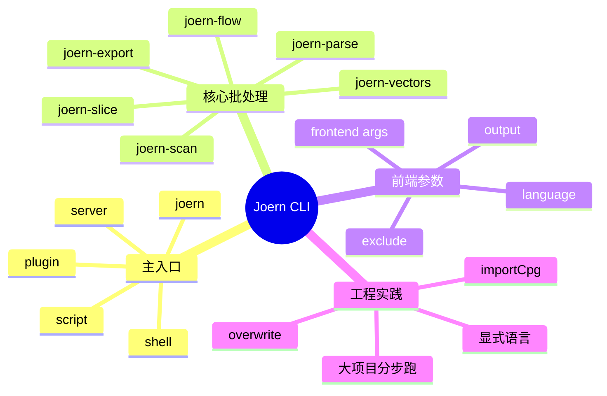

# 记忆卡片摘要（快速复习版）

## 1. 大纲（压缩版）

- Joern CLI 全家桶有哪些命令
- `joern` 主命令的运行模式是什么
- `joern-scan` 怎么筛规则、更新规则库、指定语言
- `joern-parse` 怎么只生成 CPG
- `joern-export`、`joern-flow`、`joern-slice`、`joern-vectors` 各干什么
- 语言前端共有参数与语言专有参数如何理解
- 大项目和自动化场景下的 CLI 最佳用法

## 2. 思维导图（Mermaid）



## 3. 重要知识点（必须记住）

- `joern` 不是只有交互式 shell；从源码可见，它还支持脚本执行、插件管理、HTTP server、加载已有 CPG、运行 layer creator 等模式。[来源1]
- `joern-scan` 的核心参数包括 `--overwrite`、`--store`、`--dump`、`--dump-to`、`--list-query-names`、`--updatedb`、`--dbversion`、`--names`、`--tags`、`--depth`、`--language`、`--list-languages`。[来源2]
- `joern-parse` 适合“先只生成 CPG，不马上扫描”；其关键参数包括 `-o/--output`、`--language`、`--list-languages`、`--nooverlays`、`--overlaysonly`、`--max-num-def`。[来源3]
- 前端普遍继承 `x2cpg` 的共用参数体系，例如 `--output`、`--exclude`、`--exclude-regex`、`--enable-file-content` 等；某些语言还会再加专有参数，比如 Python 的 `--venvDirs`、PHP 的 `--php-ini`、Swift 的 `--swift-build`。[来源4][来源5][来源6][来源7]
- 安装文档明确提醒：大代码库导入时，`importCode` 会额外启动 frontend JVM，内存压力会变大；此时更稳妥的做法是先单独跑 frontend 生成 CPG，再用 `importCpg` 导入。[来源8]

## 4. 难点 / 易混点

- 易混点 1：`joern` 与 `joern-scan` 不是谁替代谁，而是“工作台”和“现成扫描器”的关系。
- 易混点 2：`joern-parse` 生成的是 CPG，不会自动替你跑所有规则。
- 易混点 3：很多参数看起来像重复，例如 `--language` 在多个命令里都出现，但语义不完全相同，要看命令上下文。
- 易混点 4：文档页面常讲“最常用参数”，源码才是最精确的参数定义来源。

## 5. QA 快速复习卡片

- Q：我只想进交互式界面，应该用哪个命令？
  A：`joern`。[来源1]
- Q：我只想快速跑默认规则，应该用哪个命令？
  A：`joern-scan <src>`。[来源2][来源9]
- Q：我只想先生成 CPG 留着后面分析？
  A：`joern-parse <input> -o cpg.bin`。[来源3][来源10]
- Q：规则库没装或想更新怎么办？
  A：用 `joern-scan --updatedb`，必要时配合 `--dbversion`。[来源2][来源9]
- Q：大项目导入内存紧张怎么办？
  A：先单独运行 frontend 生成 CPG，再 `importCpg` 导入，而不是一直在 shell 内直接 `importCode`。[来源8]

## 6. 快速复现步骤（最短路径）

1. 打开 `BridgeBase.scala`，理解 `joern` 主命令的模式切换。[来源1]
2. 打开 `JoernScan.scala`，对照 `joern-scan --help` 背后的真实参数定义。[来源2]
3. 打开 `JoernParse.scala`，理解 `joern-parse` 的输入、语言和 overlay 选项。[来源3]
4. 打开 `X2Cpg.scala`，理解前端共用参数。[来源4]
5. 打开 `Installation` 文档，理解大项目下为什么要考虑单独跑 frontend。[来源8]

---

# 学习笔记正文（详细版）

## 0. 学习目标、读者画像与假设

- 技术：`Joern CLI`
- 学习目标：看懂 Joern 常用命令及参数，不再把它当成“只有一个 shell 命令”的工具。
- 读者水平：零基础到初学。
- 时间预算：深入版。
- 版本范围：以 2026-03-19 官方仓库源码为主要参数依据，官方文档为使用主线。
- 运行环境：本地，不要求已安装 Joern。
- 假设与限制：
  - 本文以参数解释为主，不逐一演示真实运行输出。
  - 部分示例根据官方文档与源码整理，未在当前环境实际运行 Joern 二进制。

## 1. 先建立全局观：Joern CLI 不止一个命令

Joern 仓库里用户最常接触的 CLI 至少有这些：[来源10]

- `joern`
- `joern-scan`
- `joern-parse`
- `joern-export`
- `joern-flow`
- `joern-slice`
- `joern-vectors`

把它们粗分，可以得到三层：

### 1.1 工作台层

- `joern`

它更像“进入分析平台”的大门。

### 1.2 批处理层

- `joern-scan`
- `joern-parse`
- `joern-export`
- `joern-flow`
- `joern-slice`
- `joern-vectors`

它们更像“拿着现成任务直接跑”的专项命令。

### 1.3 语言前端层

- `c2cpg`
- `javasrc2cpg`
- `pysrc2cpg`
- `php2cpg`
- `swiftsrc2cpg`
- 其他 frontend 可执行入口

这一层是你在大项目、内存受限、或想把“生成 CPG”和“后续分析”拆开时会用到的。

## 2. `joern`：主入口命令不是只能开 REPL

### 2.1 它到底能做什么

从 `BridgeBase.scala` 可以看到，`joern` 的配置对象里包含这些关键能力：[来源1]

- `scriptFile`：跑脚本并退出
- `command`：在脚本含多个 `@main` 时指定入口
- `params`：给脚本传参
- `predefFiles`：额外导入脚本文件
- `runBefore` / `runAfter`：启动/关闭时附加执行代码
- `additionalClasspathEntries`、`dep`、`repo`：补 classpath 与 Maven 依赖
- `addPlugin` / `remove-plugin` / `plugins` / `run`：插件管理与 layer creator 运行
- `src` / `language` / `overwrite` / `store`：配合 layer creator 或插件运行
- `server` 相关参数：启动 HTTP server
- `cpgToLoad` / `for-input-path`：加载已有 CPG 或按输入路径打开项目
- `nocolors`、`verbose`、`maxHeight`：输出与交互控制

也就是说，`joern` 本质上是“平台控制器”，交互式 shell 只是它的默认模式。

### 2.2 `joern` 常用参数详解

下面按使用频率讲。

#### `--script <file>`

作用：执行一个 Joern/Scala 脚本并退出。  
适用场景：

- 把手工查询固化成脚本
- 在 CI 中批量分析
- 复用团队内部分析模板

#### `--param key=value`

作用：给脚本的 `@main` 参数传值；源码里明确说明这个参数可多次传入。[来源1]

重要细节：

- 现在应多次写 `--param a=1 --param b=2`。
- 历史资料中可能会出现逗号拼接参数的写法，Scala 3 升级后官方 changelog 已提示改法。[来源11]

#### `--import <script.sc>`

作用：把额外脚本编译并加到 classpath，可多次传入。[来源1]

直白理解：

- 你可以把常用辅助函数拆到单独脚本，再在主脚本里调用。

#### `--runBefore` / `--runAfter`

作用：在启动时或退出时执行一段代码。[来源1]

适用场景：

- 启动时自动 `importCpg(...)`
- 预设语义、标签、工具函数
- 退出前做清理或保存

#### `--dep` / `--repo` / `--classpathEntry`

作用：

- `--dep`：加 Maven 坐标依赖
- `--repo`：增加依赖仓库
- `--classpathEntry`：加本地 classpath 条目

这让 `joern` 不只是查图工具，也能临时吸收额外 JVM 依赖。

#### `--plugins`

作用：列出可用插件和 layer creator。[来源1][来源12]

#### `--add-plugin <zip>` / `--remove-plugin <name>`

作用：安装或删除插件。[来源1][来源12]

#### `--run <plugin>`

作用：运行 layer creator。  
结合源码里的 `src`、`language`、`overwrite`、`store` 参数，可把某些分析流程作为插件运行。[来源1]

#### `--server`

作用：把 `joern` 作为 HTTP server 跑起来，而不是只在本地交互。[来源1]

配套参数：

- `--server-host`
- `--server-port`
- `--server-auth-username`
- `--server-auth-password`

#### `<cpg.bin>`

作用：直接把一个已有 CPG 当作位置参数加载。[来源1]

#### `--for-input-path <path>`

作用：按原始输入路径查找并打开对应项目，比你手输项目名更适合自动流程。[来源1]

#### `--nocolors`

作用：关闭彩色输出。  
适用：

- 日志抓取
- CI 输出
- pexpect/wexpect 自动化

#### `--verbose`

作用：打开详细输出，便于排查 predef、依赖解析、classpath 等问题。[来源1]

#### `--maxHeight <n>`

作用：限制打印输出高度，避免一次性把终端刷爆。[来源1]

### 2.3 `joern` 最常见的三种用法

#### 用法一：交互式分析

```bash
joern
```

然后在 REPL 内做：

- `importCode(...)`
- `cpg.method...`
- `workspace`
- `help`

#### 用法二：脚本自动分析

```bash
joern --script scan.sc --param inputPath=/path/to/src
```

#### 用法三：打开已有 CPG 或已有项目

```bash
joern cpg.bin
joern --for-input-path /path/to/src
```

## 3. `joern-scan`：最像“现成扫描器”的命令

如果你不想先学 REPL，只想先跑规则，`joern-scan` 是最直接入口。[来源2][来源9]

### 3.1 它默认做了什么

官方文档明确说，执行 `joern-scan simple.c` 时，背后会发生三件事：[来源9]

1. 生成目标程序的 CPG
2. 对该 CPG 运行一组预定义查询
3. 把结果打印到标准输出

也就是说，`joern-scan` 本质上是“生成图 + 跑 querydb + 打印结果”的打包命令。

### 3.2 `joern-scan` 参数详解

源码 `JoernScan.scala` 给出的参数定义如下。[来源2]

#### `src`

位置参数。  
作用：指定要扫描的源码目录或文件。

#### `--overwrite`

作用：如果对应 CPG 已存在，强制重新生成。[来源2][来源9]

什么时候要用：

- 代码改过了
- 之前的 CPG 过旧
- 你切换了前端参数或语言

#### `--store`

作用：把 scanner 造成的图变更持久化。[来源2]

对初学者可以理解为：如果扫描流程生成了新 layer 或 tag，你希望它落盘而不只是内存里看一下。

#### `--dump`

作用：把当前可用查询列表导出为 JSON 到默认路径。[来源2]

默认路径由源码常量给出，是系统临时目录下的 `querydb.json`。[来源2]

#### `--dump-to <file>`

作用：把查询元数据导出到你指定的位置。[来源2]

适用：

- 审计规则清单
- 离线查看规则元信息
- 做规则索引或版本对比

#### `--list-query-names`

作用：只打印当前可用查询名字，不执行扫描。[来源2]

非常适合：

- 快速查看规则库装没装好
- 配合 `--names` 做定点扫描

#### `--updatedb`

作用：更新 query database。[来源2][来源9]

源码显示其逻辑是：

1. 删除当前 querydb 插件
2. 从 GitHub release 下载指定版本或 latest 的 `querydb.zip`
3. 重新安装。[来源2]

#### `--dbversion <version>`

作用：配合 `--updatedb` 指定下载哪个 querydb 版本。[来源2]

#### `--names <a,b,c>`

作用：按查询名过滤，仅运行指定规则。[来源2][来源9]

适用：

- 精准验证某几条规则
- 回归测试某个规则修复前后行为

#### `--tags <a,b,c>`

作用：按标签过滤规则。[来源2][来源9]

重要细节：

- 如果不传 `--tags` 且也没传 `--names`，默认会跑带 `default` 标签的规则。
- 如果传 `--tags all`，会跑所有规则。

这是从 `Scan.filteredQueries` 源码能直接看出来的。[来源13]

#### `--depth <n>`

作用：设置跨过程数据流分析的调用深度，也就是 interprocedural analysis 的深度。[来源2]

直观理解：

- 数越大，沿调用链往外追得越深。
- 更深不总是更好，因为更慢，也可能引入更多噪声。

#### `--language <lang>`

作用：显式指定语言，避免自动识别错误。[来源2][来源14]

#### `--list-languages`

作用：列出可选语言参数。[来源2]

### 3.3 `joern-scan` 的典型命令模板

#### 扫默认规则

```bash
joern-scan ./src
```

#### 只扫某个标签

```bash
joern-scan ./src --tags sql-injection
```

#### 扫所有规则

```bash
joern-scan ./src --tags all
```

#### 只跑少数规则名

```bash
joern-scan ./src --names sql-injection,cross-site-scripting
```

#### 显式语言 + 强制重建

```bash
joern-scan ./src --language java --overwrite
```

## 4. `joern-parse`：只负责生成 CPG 的命令

有时候你并不想马上扫描，只想先拿到 CPG。  
这时用 `joern-parse` 更合适。[来源3][来源6]

### 4.1 它适合什么场景

- 你要把生成图和后续分析解耦。
- 你要先生成一次 CPG，再交给多个脚本/规则重复使用。
- 你要调试 frontend 或 overlay 生成过程。

### 4.2 `joern-parse` 参数详解

源码 `JoernParse.scala` 给出的主要参数如下。[来源3]

#### `input`

位置参数。  
作用：输入源码文件或目录。

#### `-o, --output`

作用：指定输出 CPG 文件名；默认是 `cpg.bin`。[来源3]

#### `--language`

作用：显式指定源码语言。[来源3][来源6]

#### `--list-languages`

作用：列出语言选项。[来源3]

#### `--namespaces`

作用：只包含指定命名空间，逗号分隔。[来源3]

这个参数更偏高级用法。  
可以把它理解为：只让 CPG 保留你关心的一部分命名空间。

#### `--nooverlays`

作用：生成 CPG 后不应用默认 overlay。[来源3]

适用：

- 你要研究“原始图”和“增强图”的差异
- 你想手动控制后续 pass

#### `--overlaysonly`

作用：只应用默认 overlay，而不重新生成 CPG。[来源3]

适用：

- 你已经有 CPG，只想补 overlay

#### `--max-num-def`

作用：设置每个方法数据流计算中的最大定义数限制。[来源3]

直白理解：

- 它影响 overlay/数据流增强阶段的计算边界。

#### `--frontend-args ...`

官方 `Frontends` 文档说明，分隔符之后的参数会原样传给底层 frontend。[来源6]

这很重要，因为：

- `joern-parse` 负责统一入口
- 真正某门语言特有的参数，常常要通过 frontend args 继续下传

## 5. `joern-export`：把图导出成你想看的格式

`joern-export` 适合调试、可视化、对接图工具或离线查看图结构。[来源15]

### 5.1 主要参数

根据 `JoernExport.scala`：[来源15]

- `cpg`：输入 CPG 文件名，默认 `cpg.bin`
- `-o, --out`：输出目录，必须不存在
- `--repr`：选择导出的图表示
- `--format`：选择输出格式

### 5.2 `--repr` 可选值

- `ast`
- `cfg`
- `ddg`
- `cdg`
- `pdg`
- `cpg14`
- `cpg`
- `all`

直白理解：

- `ast/cfg/ddg/cdg/pdg` 是只导某一类结构
- `cpg` 或 `all` 更接近整图导出

### 5.3 `--format` 可选值

- `dot`
- `neo4jcsv`
- `graphml`
- `graphson`

这意味着你可以把 CPG 导入其他图分析或可视化工具。

## 6. `joern-flow`：针对源汇点做数据流路径查看

`joern-flow` 是一个更轻量的命令，围绕“从哪些 source 参数能流到哪些 sink 参数”来跑。[来源16]

### 6.1 主要参数

- `src`：源方法名正则
- `dst`：目标方法名正则
- `cpg`：CPG 文件名，默认 `cpg.bin`
- `--src-param`
- `--dst-param`
- `--depth`
- `--verbose`

### 6.2 适合理解成什么

它不是完整漏洞扫描器，更像一个“快速看从某类方法参数到某类方法参数的流”的辅助命令。

## 7. `joern-slice`：提取程序切片

`joern-slice` 用来从 CPG 里提取不同类型的 slice。[来源17]

### 7.1 顶层参数

- `cpg`：输入 CPG 或源码路径
- `-o, --out`：输出文件
- `--dummy-types`
- `--file-filter`
- `--method-name-filter`
- `--method-parameter-filter`
- `--method-annotation-filter`
- `-p, --parallelism`

### 7.2 子命令

#### `data-flow`

额外参数：

- `--slice-depth`
- `--sink-filter`
- `--end-at-external-method`

#### `usages`

额外参数：

- `--min-num-calls`
- `--exclude-operators`
- `--exclude-source`

### 7.3 何时用

- 想把大图缩成更小、可解释的局部
- 想做样本抽取
- 想给下游模型或人工审计提供更聚焦的数据

## 8. `joern-vectors`：提取向量或结构化表示

源码里 `JoernVectors.scala` 的参数很少，说明它是较专门的工具。[来源18]

主要参数：

- `cpg`
- `-o, --out`
- `--features`

直白理解：

- 如果你在做研究型工作、特征工程、图表示学习，这个命令更 relevant。
- 纯漏洞扫描入门阶段可以先知道有它，不必立刻深入。

## 9. 语言前端的共用参数：`x2cpg` 基础层

很多新手学 CLI 时最痛苦的一点，是“为什么每门语言的参数看着一半一样，一半又不一样”。  
答案在 `X2Cpg.scala`：很多 frontend 共用一套基础参数。[来源4]

### 9.1 共用参数

#### `input-dir`

输入目录。

#### `--output, -o`

输出文件名。

#### `--exclude`

可多次传入，用于排除文件或目录。

#### `--exclude-regex`

用正则排除路径。

#### `--enable-early-schema-checking`

提前开启 schema 校验，偏调试和开发。

#### `--enable-file-content`

把原始源码文本放进 FILE 节点的 `content` 字段，以便后续通过 offset 取方法源码。[来源4]

#### `--server`

让 frontend 以 server 模式运行，通常是隐藏参数。

### 9.2 语言专有参数例子

#### Python `pysrc2cpg`

- `--venvDir`
- `--venvDirs`
- `--ignoreVenvDir`
- `--ignore-paths`
- `--ignore-dir-names`[来源5]

这些参数说明 Python 前端很关注虚拟环境、依赖目录和路径排除。

#### PHP `php2cpg`

- `--php-ini`
- `--php-parser-bin`[来源6]

说明 PHP 前端会依赖外部 PHP parser 生态。

#### Swift `swiftsrc2cpg`

- `--define`
- `--swift-build`
- `--build-log-path`[来源7]

说明 Swift 路线为了更完整类型信息，可能需要借助编译过程。

## 10. 大代码库与自动化场景下怎么用 CLI

这是最容易踩坑的部分。

### 10.1 大代码库先考虑“前端单独跑”

官方安装文档明确提醒，`importCode` 会启动独立 frontend JVM；对于大代码库，这意味着额外内存消耗。[来源8]

更稳妥的模式是：

1. 单独跑 frontend 生成 CPG
2. 启动 `joern`
3. `importCpg(...)`

### 10.2 自动化脚本尽量关颜色

`--nocolors` 对日志抓取、pexpect 和 CI 解析都更友好。[来源1]

### 10.3 混合仓库尽量显式语言

不要在 CI 里赌自动检测。

### 10.4 快速筛查先 `joern-scan`，深入分析再 `joern`

这是最自然的工作流：

- 先用 `joern-scan --tags ...` 找热点
- 再用 `joern --for-input-path ...` 进 REPL 深挖

这条工作流既符合官方 `joern-scan` 设计，也符合源码里扫描后提示“用 joern 打开项目继续探索”的逻辑。[来源2]

## 11. 最小命令清单：初学者先记这些就够

### 必须记住

```bash
joern
joern --script foo.sc --param inputPath=/path
joern --for-input-path /path/to/src
joern-scan /path/to/src
joern-scan /path/to/src --tags all --overwrite
joern-parse /path/to/src -o cpg.bin
joern-export cpg.bin --repr pdg --format dot -o out
```

### 先知道即可

```bash
joern-flow "sourceRegex" "sinkRegex" cpg.bin --depth 2
joern-slice cpg.bin data-flow --slice-depth 20
joern-vectors cpg.bin -o out
```

## 12. 延伸学习路径（官方优先）

- 入门操作：Quickstart、Workspace。[来源14][来源19]
- 扫描：Joern Scan 文档。[来源9]
- 参数精确语义：直接读 `BridgeBase.scala`、`JoernScan.scala`、`JoernParse.scala`、`X2Cpg.scala`。[来源1][来源2][来源3][来源4]
- 前端细节：Frontends 文档和各 frontend `Main.scala`。[来源6][来源5][来源6][来源7]

---

# 练习与复习闭环

## 1. 分层练习

### 基础练习

- 练习 1：说出 `joern`、`joern-scan`、`joern-parse` 三者差别。
- 练习 2：说出 `joern-scan` 里最常用的 5 个参数。
- 练习 3：说出一个前端共用参数和一个语言专有参数。

### 应用练习

- 练习 4：设计一条“先生成 CPG，再扫描”的命令链。
- 练习 5：设计一条“只跑 SQL 注入相关规则”的命令。

### 综合练习

- 练习 6：给一个 500 万行的大仓库设计 CLI 运行流程，要求尽量避免内存峰值过高。

## 2. 动手任务（带验收标准）

- 任务：写一份你自己的 Joern CLI cheat sheet。
- 验收标准：
  - 至少包含 8 条命令模板。
  - 每条命令都说明适用场景。
  - 至少区分交互式、批处理、前端三类命令。

## 3. 常见误区纠偏

- 误区：`joern-scan` 和 `joern` 是重复命令。
  正解：前者更像现成扫描器，后者是平台主入口。

- 误区：`joern-parse` 会自动帮我跑全部规则。
  正解：它主要负责生成 CPG。

- 误区：参数解释看文档就够了。
  正解：文档讲主线，源码才是最精确参数定义。

## 4. 复习节奏建议

- Day 1：背住命令家族和最常见的 6 个参数。
- Day 3：能说清 `joern` 和 `joern-scan` 的关系。
- Day 7：能设计一条适合大项目的“parse -> importCpg -> analyze”流程。
- Day 14：能不看笔记写出 `joern-scan` 的典型命令模板。

## 5. 自测题与参考答案（简版）

- 题目 1：哪条命令更适合先快速跑默认规则？
  参考答案：`joern-scan`。[来源2][来源9]

- 题目 2：哪条命令更适合只生成图？
  参考答案：`joern-parse`。[来源3]

- 题目 3：大项目为什么经常建议单独跑 frontend？
  参考答案：因为 `importCode` 会再启动 frontend JVM，额外占内存；官方安装文档明确给了这种建议。[来源8]

---

# 参考来源与版本说明

## 官方来源（优先）

1. [BridgeBase.scala](https://github.com/joernio/joern/blob/master/console/src/main/scala/io/joern/console/BridgeBase.scala) - 访问日期：2026-03-19 - 用于 `joern` 主命令参数定义。
2. [JoernScan.scala](https://github.com/joernio/joern/blob/master/joern-cli/src/main/scala/io/joern/joerncli/JoernScan.scala) - 访问日期：2026-03-19 - 用于 `joern-scan` 参数与行为。
3. [JoernParse.scala](https://github.com/joernio/joern/blob/master/joern-cli/src/main/scala/io/joern/joerncli/JoernParse.scala) - 访问日期：2026-03-19 - 用于 `joern-parse` 参数。
4. [X2Cpg.scala](https://github.com/joernio/joern/blob/master/joern-cli/frontends/x2cpg/src/main/scala/io/joern/x2cpg/X2Cpg.scala) - 访问日期：2026-03-19 - 用于前端共用参数。
5. [pysrc2cpg Main.scala](https://github.com/joernio/joern/blob/master/joern-cli/frontends/pysrc2cpg/src/main/scala/io/joern/pysrc2cpg/Main.scala) - 访问日期：2026-03-19.
6. [php2cpg Main.scala](https://github.com/joernio/joern/blob/master/joern-cli/frontends/php2cpg/src/main/scala/io/joern/php2cpg/Main.scala) - 访问日期：2026-03-19.
7. [swiftsrc2cpg Main.scala](https://github.com/joernio/joern/blob/master/joern-cli/frontends/swiftsrc2cpg/src/main/scala/io/joern/swiftsrc2cpg/Main.scala) - 访问日期：2026-03-19.
8. [Installation | Joern Documentation](https://docs.joern.io/installation/) - 访问日期：2026-03-19 - 用于大代码库内存建议。
9. [Joern Scan | Joern Documentation](https://docs.joern.io/scan/) - 访问日期：2026-03-19 - 用于 `joern-scan` 使用主线。
10. [joern README](https://github.com/joernio/joern/blob/master/README.md) - 访问日期：2026-03-19 - 用于 CLI 家族概览。
11. [2.0.0 Scala 3 Changelog](https://github.com/joernio/joern/blob/master/changelog/2.0.0-scala3.md) - 访问日期：2026-03-19 - 用于脚本参数变化说明。
12. [Developing Plugins | Joern Documentation](https://docs.joern.io/extensions/) - 访问日期：2026-03-19 - 用于插件管理说明。
13. [JoernScan.scala 中 Scan.filteredQueries 逻辑](https://github.com/joernio/joern/blob/master/joern-cli/src/main/scala/io/joern/joerncli/JoernScan.scala) - 访问日期：2026-03-19.
14. [Frontends | Joern Documentation](https://docs.joern.io/frontends/) - 访问日期：2026-03-19.
15. [JoernExport.scala](https://github.com/joernio/joern/blob/master/joern-cli/src/main/scala/io/joern/joerncli/JoernExport.scala) - 访问日期：2026-03-19.
16. [JoernFlow.scala](https://github.com/joernio/joern/blob/master/joern-cli/src/main/scala/io/joern/joerncli/JoernFlow.scala) - 访问日期：2026-03-19.
17. [JoernSlice.scala](https://github.com/joernio/joern/blob/master/joern-cli/src/main/scala/io/joern/joerncli/JoernSlice.scala) - 访问日期：2026-03-19.
18. [JoernVectors.scala](https://github.com/joernio/joern/blob/master/joern-cli/src/main/scala/io/joern/joerncli/JoernVectors.scala) - 访问日期：2026-03-19.
19. [Workspace | Joern Documentation](https://docs.joern.io/organizing-projects/) - 访问日期：2026-03-19.

## 第三方来源（按采信程度标注）

- 本文未依赖第三方非官方来源作为结论依据。

## 关键结论引用映射

- [来源1] `BridgeBase.scala`
- [来源2] `JoernScan.scala`
- [来源3] `JoernParse.scala`
- [来源4] `X2Cpg.scala`
- [来源5] `pysrc2cpg Main.scala`
- [来源6] `php2cpg Main.scala`
- [来源7] `swiftsrc2cpg Main.scala`
- [来源8] Installation 文档
- [来源9] Joern Scan 文档
- [来源10] README
- [来源11] Scala 3 changelog
- [来源12] Plugins 文档
- [来源13] `Scan.filteredQueries`
- [来源14] Frontends 文档
- [来源15] `JoernExport.scala`
- [来源16] `JoernFlow.scala`
- [来源17] `JoernSlice.scala`
- [来源18] `JoernVectors.scala`
- [来源19] Workspace 文档

## 官方文档章节映射与重要例子保留检查

- `Installation`：
  - 已映射到第 10 节的大项目内存建议。
- `Joern Scan`：
  - 已映射到第 3 节。
- `Frontends`：
  - 已映射到第 4 节和第 9 节。
- `Workspace`：
  - 已映射到第 2 节和第 12 节。
- `Developing Plugins`：
  - 已映射到第 2 节插件管理参数。
- 重要例子保留情况：
  - 保留了 `joern-scan simple.c`、筛 tag、按 name 过滤、更新 querydb 等官方主线例子，但改写为更教学化的命令模板。

## 冲突点与裁决（如有）

- 冲突点：官方文档对很多参数只讲常用子集，源码包含更完整定义。
- 裁决依据：参数语义以源码为准，使用场景说明以官方文档为主。
- 采用结论：本文统一使用“源码定义 + 文档解释”的组合方式。

## Mermaid 验证说明

- 已于 2026-03-19 在当前环境使用 `npx @mermaid-js/mermaid-cli` 对本文 Mermaid 图完成编译验证，通过。
