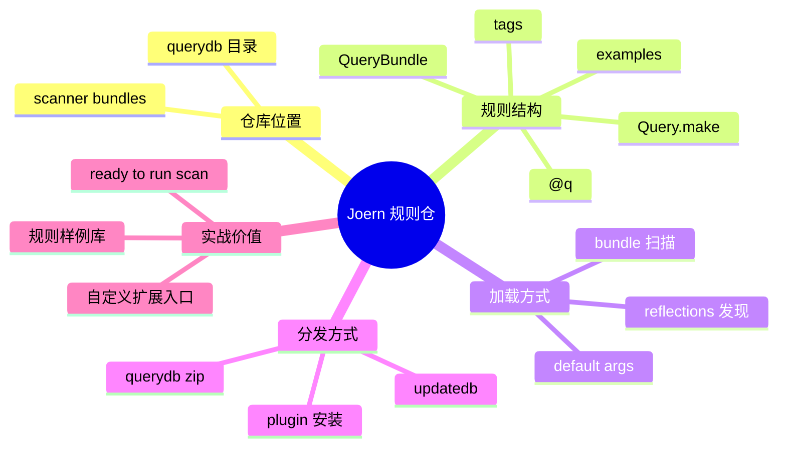

# 记忆卡片摘要（快速复习版）

## 1. 大纲（压缩版）

- Joern 的规则仓到底是什么
- `querydb` 在仓库里的位置和作用
- 规则如何被发现、加载、执行
- 一个规则由哪些字段组成
- `querydb.zip` 与 `joern-scan --updatedb` 的关系
- 怎样编写、测试、扩展自己的规则

## 2. 思维导图（Mermaid）

## 3. 重要知识点（必须记住）

- Joern 的默认规则仓就在官方主仓库里的 `querydb/` 目录，不是隐藏在外部闭源服务里。[来源1][来源2]
- 官方 `querydb/README.md` 明确说 QueryDB 有两个目的：一是把 Joern 变成 ready-to-run code scanner，二是作为编写自定义查询的样例库。[来源2]
- 规则不是写成任意脚本丢进去就行；它们需要放在 `QueryBundle` 中、用 `@q` 标注，并返回 `Query.make(...)` 构造的 `Query` 对象。[来源2][来源3][来源4]
- `QueryDatabase` 会通过反射扫描 `io.joern.scanners` 命名空间下所有 `QueryBundle`，自动找出带 `@q` 的方法并实例化查询。[来源3]
- `joern-scan --updatedb` 的本质是下载并安装 `querydb.zip` 作为插件，所以“规则仓”同时具有源码目录、发布产物、插件扩展三重身份。[来源5][来源6]

## 4. 难点 / 易混点

- 易混点 1：`querydb` 不是单一 JSON 文件，而是一套 Scala 查询代码、测试、元数据与打包流程。
- 易混点 2：规则仓在主仓库里，不代表只能和主仓一起用；官方 README 明说它也可以作为独立库分发。[来源2]
- 易混点 3：`querydb` 与 `joern-scan` 不是一回事；前者是规则内容，后者是调用这些规则的扫描器。
- 易混点 4：标签 `tags` 只是过滤和分类手段，不等于漏洞的全部语义。

## 5. QA 快速复习卡片

- Q：Joern 默认规则在哪里？
  A：在官方仓库的 `querydb/` 目录中。[来源1][来源2]
- Q：规则仓有什么用？
  A：既提供现成扫描规则，也提供编写自定义规则的样例。[来源2]
- Q：一个规则最小骨架是什么？
  A：`object Xxx extends QueryBundle`，内部用 `@q def ...: Query = Query.make(...)`。[来源2][来源3][来源4]
- Q：`joern-scan --updatedb` 到底更新了什么？
  A：更新并重新安装 `querydb.zip` 这个默认查询数据库插件。[来源5]

## 6. 快速复现步骤（最短路径）

1. 打开 `querydb/README.md`，先看规则仓的官方定位。[来源2]
2. 打开 `QueryDatabase.scala`，看规则如何被自动发现与实例化。[来源3]
3. 打开 `Query.scala`，看 `Query` 对象到底有哪些字段。[来源4]
4. 打开 `Metrics.scala`，看最简单的度量类规则长什么样。[来源7]
5. 打开 `SQLInjection.scala`，看带数据流的漏洞规则长什么样。[来源8]

---

# 学习笔记正文（详细版）

## 0. 学习目标、读者画像与假设

- 技术：`Joern QueryDB`
- 学习目标：理解 Joern 规则仓的定位、结构、加载方式和扩展方式。
- 读者水平：零基础到初学。
- 时间预算：深入版。
- 版本范围：以 2026-03-19 官方仓库当前 `querydb/` 目录与相关源码为准。
- 运行环境：本地阅读，不要求实际安装 querydb 插件。
- 假设与限制：
  - 本文主要讲默认开源规则仓，不讨论商业闭源规则集。
  - 统计数据来自当前主仓源码快照，可能随未来版本变化。

## 1. 先说结论：Joern 的“规则仓”就是 `querydb`

很多人问 Joern 的“规则仓库”在哪里，其实官方材料已经给了很直白的答案：**`querydb` 就是 Joern Query Database，也就是默认规则仓。**[来源2]

它不是外部神秘仓，不是只在 SaaS 后端存在，也不是只能通过二进制下载看不到源码。  
在官方主仓库 `joernio/joern` 里，`querydb/` 就是公开的规则实现目录。[来源1]

官方 README 对它的定位非常关键：

- 第一，它提供把 Joern 变成 ready-to-run code scanner 所需的“电池”。
- 第二，它里的查询本身就是用户学习如何写查询的示例。[来源2]

这两句话非常值得记住。它说明 `querydb` 既是：

- 生产可用的默认规则集
- 学习查询语言的官方样例库

## 2. 为什么规则仓要单独成一个模块

这不是形式主义，而是很合理的架构划分。

### 2.1 Joern 平台层和规则内容层要分开

平台层负责：

- 生成 CPG
- 维护 schema
- 提供遍历 DSL
- 执行数据流分析
- 管理 workspace 和 shell

规则内容层负责：

- 定义源、汇、模式
- 给查询命名、打标签、配分值
- 写出能复现规则意图的测试

如果这两层完全揉在一起，会很难维护，也不利于用户做自定义扩展。

### 2.2 QueryDB 既能随主仓开发，又能独立分发

官方 README 明确说，QueryDB 是 standalone library，同时把 Joern 作为依赖带进去；换句话说，理论上不必单独先装 Joern，也能用这套查询数据库。[来源2]

这意味着：

- 从工程组织看，它是一个独立模块。
- 从用户使用看，它又能被动态装进 Joern 里当扩展。

## 3. `querydb` 里到底有什么

### 3.1 目录与语言分布

当前源码统计显示：

- `querydb/src/main/scala/io/joern/scanners` 下共有约 37 个 `QueryBundle`。
- 带 `@q` 的规则约 58 条。
- 按目录粗分，当前主仓里可见的规则主要分布在：
  - `c`：27
  - `android`：10
  - `php`：9
  - `java`：7
  - `kotlin`：3
  - `ghidra`：2  
  这些数字来自对当前仓库源码的静态统计，只代表 2026-03-19 这一时点的主仓状态，后续可能变化。[来源9]

这个分布也能给你一个直观印象：

- C 规则最丰富，符合 Joern 的历史优势。
- Android、PHP、Java 也有比较成体系的规则。
- 规则数量不等于语言支持能力全部，但确实反映了默认规则投入重点。

### 3.2 规则文件长什么样

你打开 `querydb/src/main/scala/io/joern/scanners/...` 后，会发现每个文件通常就是一个 bundle 或某类漏洞主题集合，例如：

- `Metrics.scala`
- `SQLInjection.scala`
- `DangerousFunctions.scala`
- `UseAfterFree.scala`
- `CryptographyMisuse.scala`[来源7][来源8]

这比很多安全工具把规则藏进几千行 YAML 或不透明数据库更容易学习，因为：

- 你能直接看到查询遍历
- 你能直接看到标题、描述、分值、标签
- 你能直接看到示例和测试

## 4. 一个 Joern 规则最小长什么样

这是你看懂规则仓最关键的一节。

### 4.1 最外层：`QueryBundle`

`QueryDatabase.scala` 里定义了一个很轻的 `trait QueryBundle`。[来源3]

这说明 bundle 的作用主要是“让查询有一个统一容器，便于运行时发现”。

### 4.2 规则发现方式：`@q`

`QueryDatabase` 会扫描指定命名空间下所有 `QueryBundle` 子类，然后找出带 `@q` 注解的方法。[来源3]

这件事很重要，因为它解释了：

- 规则不是手工注册到某张表里
- 也不是靠文件名硬编码
- 而是靠“约定式反射发现”

### 4.3 规则对象：`Query`

`Query.scala` 里定义了 `Query` 的结构，主要字段包括：[来源4]

- `name`
- `author`
- `title`
- `description`
- `score`
- `traversal`
- `traversalAsString`
- `tags`
- `language`
- `codeExamples`
- `multiFileCodeExamples`

对新手来说，这套字段很好理解：

- `name`：给机器过滤和调用
- `title`：给人看结果标题
- `description`：解释规则含义
- `score`：给结果一个风险强弱或重要度权重
- `traversal`：真正执行的图查询
- `tags`：分类
- `examples`：帮助理解和测试

### 4.4 规则构造器：`Query.make`

虽然 `Query` 是 case class，但官方规则通常不直接手写完整对象，而是通过 `Query.make(...)` 创建。[来源4]

这样做的好处是把：

- 查询遍历
- 查询字符串表示
- 标签
- 示例

统一封装起来，写法更稳定。

### 4.5 遍历字符串：`withStrRep`

`QueryMacros.withStrRep` 会同时保留：

- 实际可执行的遍历函数
- 这段遍历的字符串表示[来源10]

这看起来像小细节，实际上很有价值，因为：

- 扫描结果和规则展示更可解释
- 调试时你能知道规则到底跑了什么
- 规则仓本身也更像“可教学资产”

## 5. 最简单的一类规则：度量型规则

`Metrics.scala` 很适合初学者入门，因为它不像 taint 规则那么绕。[来源7]

例如它有：

- `tooManyParameters`
- `tooHighComplexity`
- `tooLong`
- `multipleReturns`
- `tooManyLoops`
- `tooNested`

这类规则的特点是：

- 遍历短
- 语义直观
- 不强依赖复杂的数据流分析

例如“参数太多”本质上就是：

- 找内部方法
- 过滤掉全局
- 看 `parameter.size > n`

你一读就明白。

### 为什么先学这类规则

因为它能帮你建立一个稳定模板：

1. 规则名怎么起
2. 描述怎么写
3. 查询体怎么写
4. 标签怎么打
5. 示例怎么放

## 6. 更典型的一类规则：数据流型规则

像 `java/SQLInjection.scala` 这种规则，才更像大家想象中的“漏洞规则”。[来源8]

它的基本思路是：

1. 定义 source  
   例如某类 Spring MVC handler 的参数
2. 定义 sink  
   例如数据库 `query` 方法的参数
3. 用 `sink.reachableBy(source)` 判断数据是否能流过去

这就是 Joern 规则最核心的威力之一：  
**你写的不是“文本模式”，而是“图上的源汇可达关系”。**

对非科班读者，可以把它理解成：

- 不是搜“SQL”这个词
- 不是搜“query(”这个字串
- 而是在问：外部可控输入，能不能经过程序逻辑流进危险调用

## 7. 规则是怎么被自动发现和加载的

这一节把“规则仓为什么能自动工作”讲清楚。

### 7.1 `QueryDatabase` 的扫描逻辑

`QueryDatabase` 默认扫描命名空间 `io.joern.scanners`。[来源3]

它的逻辑大致是：

1. 找到该命名空间下所有 `QueryBundle` 子类
2. 取每个 bundle 的单例对象实例
3. 找出其中所有带 `@q` 的方法
4. 给这些方法准备默认参数
5. 通过反射调用它们，得到 `Query` 列表

这就解释了为什么：

- 规则一写到正确包里、遵守结构，就能被系统发现
- 用户不需要再手工维护注册表

### 7.2 默认参数怎么来

`DefaultArgumentProvider` 会尝试：

- 先看类型有没有专用默认值
- 没有的话再找 Scala 生成的默认参数方法 `foo$default$1` 之类[来源3]

这解释了为什么官方 README 要求“查询参数必须提供默认值”。[来源2]

因为没有默认值，运行时反射实例化就会失败。

## 8. 标签、分值、语言字段分别有什么用

### 8.1 标签 `tags`

`QueryTags.scala` 里给了很多常见标签，例如：[来源11]

- `default`
- `android`
- `metrics`
- `sql-injection`
- `xss`
- `cryptography`
- `path-traversal`
- `remote-code-execution`
- `misconfiguration`

标签的用途主要有两个：

- 给 `joern-scan --tags ...` 做筛选
- 帮人快速理解规则类型

### 8.2 分值 `score`

分值不是 CVSS，也不是漏洞是否真实存在的概率。  
它更像规则作者给出的“重要程度/提示强度”。

对工程实践来说，你可以把它当作：

- 排序参考
- 热点优先级参考

但别把它当最终风险评级。

### 8.3 语言字段 `language`

这个字段并不是规则作者手填的唯一来源。  
`QueryDatabase` 在实例化查询时，会根据 bundle 包名推断语言并回填进去。[来源3]

这说明 QueryDB 的元数据设计是有统一组织思路的，而不是每条规则各写各的。

## 9. `querydb.zip`、插件和 `updatedb` 的关系

很多新手会问：

- 规则明明就在仓库里，为什么还要 `--updatedb`？

答案是：**源码目录、打包产物、安装方式是三件事。**

### 9.1 源码目录

开发者在 `querydb/` 写 Scala 代码、写测试、跑构建。[来源2]

### 9.2 打包产物

规则仓可以被打成 `querydb.zip` 分发。[来源2][来源5]

### 9.3 插件安装

`joern-scan --updatedb` 的源码会去下载 release 对应版本的 `querydb.zip`，然后通过 `addPlugin` 机制安装进去。[来源5]

所以从用户视角看：

- 你更新的不是“一串文本规则”
- 你更新的是“一个规则数据库插件”

## 10. 如何自己写规则

官方 README 已经把最低要求说清楚了。[来源2]

### 10.1 放到正确包下

建议放在 `io.joern.scanners` 下的相应语言目录。

### 10.2 用 `QueryBundle`

把相关规则组织进一个 object。

### 10.3 每条规则都用 `@q`

否则不会被自动发现。

### 10.4 参数必须有默认值

否则反射加载时没法实例化。

### 10.5 写单元测试

官方 README 明说，测试不仅是测试，也是规则规格说明。[来源2]

这点很重要，因为安全规则最怕两种事：

- 以为命中了其实没命中
- 修了一处误报又引入另一处漏报

## 11. 如何测试规则

官方 README 说得很明确：

- 测试放在 `src/test/scala/io/joern/scanners/...`
- 可以在 IDE 中单独运行
- 也可以用 `sbt test` 跑整个数据库测试。[来源2]

对规则开发者，推荐的最小闭环是：

1. 写正例
2. 写反例
3. 跑单测
4. 再用 `joern-scan` 验证产物级效果

## 12. 规则仓的工程价值，不只是“多几条漏洞规则”

QueryDB 真正的价值有三层：

### 12.1 它让 Joern 开箱即用

如果没有 querydb，Joern 更像一个强大的分析平台，但新手难以下手。  
有了 querydb，用户至少能先扫起来。

### 12.2 它是官方最佳实践样例集

你不需要从零发明“Joern 规则长什么样”。  
官方已经把：

- 度量类
- 危险函数类
- 数据流类
- 框架类
- 安卓类

都写给你看了。

### 12.3 它是团队自定义能力的起点

你完全可以 fork 或仿照它，做企业内部规则库。

## 13. 初学者怎么读规则仓最有效

推荐顺序：

1. `querydb/README.md`
2. `Metrics.scala`
3. `DangerousFunctions.scala`
4. `SQLInjection.scala`
5. 对应测试文件

为什么这样排：

- 先看说明
- 再看最简单的结构型规则
- 再看危险函数类规则
- 最后看数据流类规则

这样认知负担最小。

## 14. 必须记住 / 先知道即可

### 必须记住

- 默认规则仓就是 `querydb`
- 规则发现依赖 `QueryBundle + @q`
- 查询对象通过 `Query.make` 构造
- `joern-scan --updatedb` 更新的是 querydb 插件

### 先知道即可

- `DefaultArgumentProvider` 的具体反射细节
- 多文件示例 `MultiFileCodeExamples`
- QueryDB 作为独立库分发的细节

## 15. 延伸学习路径（官方优先）

- 先学规则结构：`querydb/README.md`、`Query.scala`、`QueryDatabase.scala`。[来源2][来源3][来源4]
- 再学简单规则：`Metrics.scala`。[来源7]
- 再学数据流规则：`SQLInjection.scala`、`CrossSiteScripting.scala`、`Custom Data-Flow Semantics`。[来源8][来源12]
- 最后回到 `joern-scan` 文档，看规则如何在 CLI 中被调用。[来源6]

---

# 练习与复习闭环

## 1. 分层练习

### 基础练习

- 练习 1：说出 `querydb` 的两个官方定位。
- 练习 2：说出一个规则对象最少需要哪些核心字段。
- 练习 3：说出 `@q` 的作用。

### 应用练习

- 练习 4：打开 `Metrics.scala`，找出其中一个规则的 `name/title/score/tags`。
- 练习 5：打开 `SQLInjection.scala`，指出 source、sink 和 `reachableBy` 分别在哪。

### 综合练习

- 练习 6：设计一条你自己的最小规则骨架，检测“函数参数过多”或“调用危险函数”。

## 2. 动手任务（带验收标准）

- 任务：写一篇 20 行左右的伪代码，概括 QueryDB 是如何自动发现规则的。
- 验收标准：
  - 包含命名空间扫描
  - 包含 `QueryBundle`
  - 包含 `@q`
  - 包含默认参数实例化

## 3. 常见误区纠偏

- 误区：QueryDB 就是一份 JSON 规则列表。
  正解：它是 Scala 查询代码 + 测试 + 打包产物组成的完整规则模块。

- 误区：只要写个查询函数就会被 `joern-scan` 自动跑。
  正解：还要放在 `QueryBundle` 中并加 `@q`。

- 误区：标签就是漏洞的全部定义。
  正解：标签只是分类和过滤手段。

## 4. 复习节奏建议

- Day 1：记住 `querydb` 的位置和作用。
- Day 3：记住 `QueryBundle -> @q -> Query.make` 这条骨架。
- Day 7：能说清 `querydb.zip` 和 `--updatedb` 的关系。
- Day 14：能独立读懂一条简单的 `Metrics` 规则。

## 5. 自测题与参考答案（简版）

- 题目 1：Joern 默认规则仓在哪里？
  参考答案：在官方主仓的 `querydb/` 目录中。[来源1][来源2]

- 题目 2：为什么规则参数必须提供默认值？
  参考答案：因为 `QueryDatabase` 通过反射实例化规则，需要默认参数支持。[来源2][来源3]

- 题目 3：`--updatedb` 做了什么？
  参考答案：下载 release 对应的 `querydb.zip`，删除旧规则插件并安装新插件。[来源5]

---

# 参考来源与版本说明

## 官方来源（优先）

1. [joernio/joern 仓库](https://github.com/joernio/joern) - 访问日期：2026-03-19 - 用于确认 `querydb/` 位置。
2. [querydb/README.md](https://github.com/joernio/joern/blob/master/querydb/README.md) - 访问日期：2026-03-19 - 用于规则仓定位、编写与测试规则的官方说明。
3. [QueryDatabase.scala](https://github.com/joernio/joern/blob/master/macros/src/main/scala/io/joern/console/QueryDatabase.scala) - 访问日期：2026-03-19 - 用于规则发现、实例化和默认参数逻辑。
4. [Query.scala](https://github.com/joernio/joern/blob/master/macros/src/main/scala/io/joern/console/Query.scala) - 访问日期：2026-03-19 - 用于 `Query` 字段定义和 `Query.make`。
5. [JoernScan.scala](https://github.com/joernio/joern/blob/master/joern-cli/src/main/scala/io/joern/joerncli/JoernScan.scala) - 访问日期：2026-03-19 - 用于 `--updatedb` 与 querydb 下载逻辑。
6. [Joern Scan | Joern Documentation](https://docs.joern.io/scan/) - 访问日期：2026-03-19 - 用于规则仓与扫描器关系。
7. [Metrics.scala](https://github.com/joernio/joern/blob/master/querydb/src/main/scala/io/joern/scanners/c/Metrics.scala) - 访问日期：2026-03-19.
8. [Java SQLInjection.scala](https://github.com/joernio/joern/blob/master/querydb/src/main/scala/io/joern/scanners/java/SQLInjection.scala) - 访问日期：2026-03-19.
9. [当前 querydb 源码静态统计](https://github.com/joernio/joern/tree/master/querydb/src/main/scala/io/joern/scanners) - 访问日期：2026-03-19 - 用于 bundle/规则数量与语言分布说明。
10. [QueryMacros.scala](https://github.com/joernio/joern/blob/master/macros/src/main/scala/io/joern/macros/QueryMacros.scala) - 访问日期：2026-03-19.
11. [QueryTags.scala](https://github.com/joernio/joern/blob/master/querydb/src/main/scala/io/joern/scanners/QueryTags.scala) - 访问日期：2026-03-19.
12. [Custom Data-Flow Semantics | Joern Documentation](https://docs.joern.io/dataflow-semantics/) - 访问日期：2026-03-19.

## 第三方来源（按采信程度标注）

- 本文未依赖第三方非官方来源作为结论依据。

## 关键结论引用映射

- [来源1] 主仓位置
- [来源2] `querydb/README.md`
- [来源3] `QueryDatabase.scala`
- [来源4] `Query.scala`
- [来源5] `JoernScan.scala`
- [来源6] Joern Scan 文档
- [来源7] `Metrics.scala`
- [来源8] `SQLInjection.scala`
- [来源9] 当前源码统计入口
- [来源10] `QueryMacros.scala`
- [来源11] `QueryTags.scala`
- [来源12] Custom Data-Flow Semantics

## 官方文档章节映射与重要例子保留检查

- `Joern Scan`：
  - 已映射到第 9 节，说明规则仓和扫描器关系。
- `querydb/README.md`：
  - 已全程映射到第 1、2、10、11、15 节。
- 重要例子保留情况：
  - 保留了 `Metrics` 与 `SQLInjection` 两类代表性规则。
  - README 中的“too many params”示例已保留并扩展为规则结构讲解。

## 冲突点与裁决（如有）

- 冲突点：无显著冲突。
- 说明：规则数量与分布属于时间敏感统计，本文以 2026-03-19 主仓状态为准。

## Mermaid 验证说明

- 已于 2026-03-19 在当前环境使用 `npx @mermaid-js/mermaid-cli` 对本文 Mermaid 图完成编译验证，通过。
