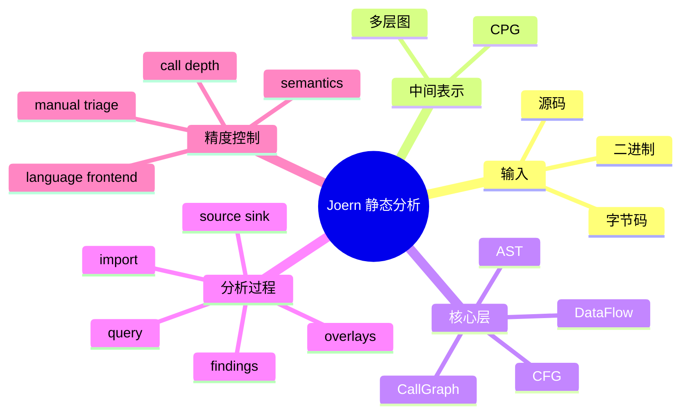

# 记忆卡片摘要（快速复习版）

## 1. 大纲（压缩版）

- Joern 静态分析在分析什么
- CPG 为什么是核心
- AST、CFG、CallGraph、DDG/PDG 分别是什么
- overlay 与数据流引擎怎么协作
- 从导入代码到发现结果的完整工作流
- 为什么 source/sink/semantics 会影响误报漏报

## 2. 思维导图（Mermaid）

## 3. 重要知识点（必须记住）

- Joern 的静态分析核心不是“搜代码文本”，而是“先把程序转成 CPG，再对图做查询和数据流分析”。[来源1][来源2]
- CPG 规范把它定义为带属性的有向多重图，并按 layer 组织；这意味着 AST、调用关系、控制流、类型、标签等信息可以叠加在同一张图里。[来源2]
- 官方文档明确说，Joern 的核心特征包括 robust parsing、Code Property Graph、taint analysis、search queries、extendable via CPG passes。[来源3]
- `importCode` 不只是“导入源码”，它会创建项目、生成 CPG、载入图、再应用默认 overlays；Workspace 文档写得很清楚。[来源4]
- 数据流分析并不神奇，它依赖 source、sink、call depth、语义定义和前端恢复质量；`Custom Data-Flow Semantics` 文档明确说明，未建模外部调用时，Joern 会采取保守但可能不够精确的传播策略。[来源5]

## 4. 难点 / 易混点

- 易混点 1：静态分析不是“跑正则”，Joern 更接近图查询和程序关系推理。
- 易混点 2：CPG 不是只有 AST；AST 只是其中一层。
- 易混点 3：overlay 不是装饰品，而是把图增强到“更适合分析”的关键步骤。
- 易混点 4：数据流结果不出来，不一定是没有漏洞，也可能是 overlay、source/sink、语义模型或语言恢复没对上。

## 5. QA 快速复习卡片

- Q：Joern 的静态分析为什么和 grep 不一样？
  A：因为它分析的是结构化图表示和图关系，不只是文本匹配。[来源1][来源3]
- Q：CPG 是什么？
  A：一种统一的代码属性图，把语法、控制流、调用关系、数据流等信息放进同一个图模型。[来源1][来源2]
- Q：overlay 是什么？
  A：是在已有图上补充更多分析层和快捷边的增强步骤，让后续查询更强更快。[来源2][来源4]
- Q：为什么外部库调用会影响数据流精度？
  A：因为如果没有额外语义定义，系统会用保守传播，可能引入误报。[来源5]

## 6. 快速复现步骤（最短路径）

1. 打开 `Code Property Graph` 文档，先建立“统一中间表示”概念。[来源1]
2. 打开 `CPG Specification`，看 AST、CallGraph、Cfg、Shortcuts、TagsAndLocation 等层。[来源2]
3. 打开 `Workspace` 文档，理解 `importCode` 创建项目和 overlay 的完整过程。[来源4]
4. 打开 `Quickstart`，看一个最小的导入、查询、关闭项目流程。[来源6]
5. 打开 `Custom Data-Flow Semantics`，理解 source/sink 外还有“语义模型”这个精度开关。[来源5]

---

# 学习笔记正文（详细版）

## 0. 学习目标、读者画像与假设

- 技术：`Joern 静态分析原理与工作流`
- 学习目标：让非科班读者能看懂 Joern 的分析链路，不再把它当成黑盒。
- 读者水平：零基础到初学。
- 时间预算：深入版。
- 版本范围：以 2026-03-19 官方文档与当前源码为准。
- 运行环境：不要求实际运行。
- 假设与限制：
  - 本文强调“先直观后严格”。
  - 不讨论编译器理论细节，而是聚焦 Joern 视角下足够用的理解。

## 1. 背景与用途：Joern 到底在分析什么

普通人想到“静态分析”，往往会先想到两种画面：

- 在代码里搜危险函数名字
- 在文件里找某些正则模式

这些方法不是完全没用，但能力有限。  
原因很简单：真实漏洞往往不只取决于某个词出现没出现，还取决于：

- 这个值从哪里来
- 经过了哪些函数
- 是否在条件分支里
- 最后是不是流进了危险位置

Joern 的价值就在这里。它不是停留在“看字符串”，而是把程序转成结构化图，再在图上问问题。[来源1][来源3]

## 2. CPG：Joern 的核心中间表示

### 2.1 直观版

可以把 CPG 理解成一张“程序关系地图”。

在这张地图里：

- 节点表示程序里的元素，比如方法、参数、调用、字面量、控制结构
- 边表示这些元素之间的关系，比如 AST 关系、调用关系、控制流关系、数据流关系

这比文本搜索强得多，因为你可以问：

- 哪些参数最终流到了数据库查询
- 哪些 `if` 条件控制了某个危险调用
- 哪个 `return` 受哪个输入影响

### 2.2 严格版

CPG 规范站点把 Code Property Graph 定义为一种 **directed, edge-labeled, attributed multigraph**，并说明 schema 是按多个 layer 组织的。[来源2]

对非科班读者，不用死背这些词。你只要知道：

- 它是图，不是表格
- 同两个节点之间可以有多种关系
- 节点和边都带属性
- 这些关系不是混乱堆着，而是分层组织

## 3. 为什么 Joern 要用“多层图”

因为单一视角不够。

### 3.1 只看 AST 不够

AST 能告诉你代码长什么样，但不一定告诉你值怎么流动。

### 3.2 只看 CFG 不够

CFG 能告诉你执行路径大致怎么走，但不一定告诉你具体语法结构和调用语义。

### 3.3 只看调用图也不够

调用图能告诉你谁调用谁，但不一定告诉你参数和返回值怎么传播。

所以 Joern 把这些层叠到一起。  
这样你可以先从一种视角定位，再切到另一种视角验证。

## 4. CPG 里最重要的几层，分别是什么

### 4.1 AST：抽象语法树层

这层回答“代码结构长什么样”。[来源2][来源7]

你可以把它看成：

- 方法里面有哪些语句
- `if` 条件是什么
- 调用有哪些参数
- 某个字面量在哪个调用下面

在 Joern 里，很多最直观的查询都从 AST 出发，比如：

- 找某个调用
- 向上找它的 `astParent`
- 向下找 `astChildren`

### 4.2 Call Graph：调用图层

这层回答“哪个调用点可能调用哪个方法”。[来源2]

如果没有这一层，你最多只能在函数内部问问题，跨函数就很难扩展。

### 4.3 CFG：控制流图层

这层回答“控制执行可能从哪里走到哪里”。[来源2]

它帮助你理解：

- 条件分支
- 循环
- 提前返回
- 异常路径

### 4.4 DDG / Data Flow：数据流层

这层回答“某个值或污点可能怎么传播”。  
这就是漏洞分析最常用的一层。

你真正关心的往往不是：

- 有没有 `query(...)`

而是：

- 外部输入能不能流到 `query(...)` 的参数里

### 4.5 PDG：程序依赖图视角

当控制依赖和数据依赖组合起来时，就更适合做复杂切片和更完整的推理。

对初学者，你先知道 PDG 是“更综合的依赖视角”就够了。

## 5. overlay：为什么导入后还要“增强”一遍

官方文档和源码都提示，Joern 不只是生成原始图，还会应用默认 overlays。[来源4][来源8]

### 5.1 直观理解

你可以把 overlay 理解成：

- 在原图上补充更多分析层
- 自动生成一些快捷边
- 把前端给出的基础信息加工成更适合查询的形式

### 5.2 为什么要这样做

因为原始前端产物不一定已经包含：

- 方便遍历的数据流层
- 全部快捷关系
- 适合规则执行的增强信息

如果不做这一步，很多查询要么写不出来，要么写得很绕，要么很慢。

### 5.3 从 Workspace 文档能看到什么

官方 Workspace 文档明确写到，`importCode` 做四件事：[来源4]

1. 创建项目
2. 生成 CPG
3. 把图加载进内存
4. 生成 overlays

这句话非常关键。  
很多新手以为“导入代码 = 读一下源码”。  
其实 Joern 在导入时已经做了相当多的分析准备。

## 6. Joern 的静态分析主线：从输入到发现

这一节把整个工作流讲顺。

### 第一步：拿到输入

输入可以是：

- 源码
- 字节码
- 二进制[来源3]

### 第二步：frontend 生成 CPG

不同 frontend 负责把不同输入翻译到统一图表示。[来源3][来源8]

### 第三步：应用 overlay

让图拥有更丰富的分析层和快捷关系。[来源4][来源8]

### 第四步：在图上执行查询

查询可以是：

- 结构查询
- 调用关系查询
- 数据流查询
- 规则仓里的现成规则

### 第五步：得到 finding 或人工结论

最后你可能得到两类结果：

- 自动 finding
- 人工调查线索

Joern 很强的一点是，它不仅能给你“最终结果”，也能给你“继续追问的入口”。

## 7. 为什么 Joern 特别强调 source 和 sink

因为很多安全问题都能抽象成：

- source：攻击者可控输入从哪里进入
- sink：敏感操作发生在哪里

例如：

- HTTP 请求参数是 source
- SQL 查询执行点是 sink
- 文件写入路径是 sink
- 模板渲染输出是 sink

在图上，你要问的就是：  
**sink 能不能被 source 到达？**

## 8. `reachableBy` 与 `reachableByFlows` 在工作流里扮演什么角色

官方 Reference Card 里明确给出这两个数据流步骤：[来源9]

- `reachableBy`：判断可达
- `reachableByFlows`：返回具体流路径

对新手来说，可以这样记：

### `reachableBy`

更像布尔型判断或候选命中判断。  
问的是：

- 这个 sink 能不能被这些 source 影响？

### `reachableByFlows`

更像解释型输出。  
问的是：

- 具体是沿哪些节点和路径流过来的？

工程上常见做法是：

1. 先用 `reachableBy` 缩小范围
2. 再用 `reachableByFlows` 做人工复核

## 9. 为什么外部库和框架会影响分析精度

这是很多初学者的第一个“大坑”。

程序里有很多调用并不在你自己代码里，例如：

- 第三方库
- 框架 API
- 系统调用
- 动态分发方法

如果这些调用的真实语义没被建模，系统就必须做一个选择：

- 激进一点，少报，但可能漏报
- 保守一点，多报，但可能误报

Joern 官方 `Custom Data-Flow Semantics` 文档明确说明：  
当外部方法没有语义定义时，Joern 会按保守方式处理，把它视为可能从所有参数传播到所有参数和返回值。[来源5]

### 这意味着什么

优点：

- 不容易把真漏洞漏掉

缺点：

- 可能多出一些其实不真实的路径

所以你看到数据流结果时，千万别想成“机器已经百分之百证明漏洞存在”。  
更准确的理解是：

- 机器给了你一条值得调查的静态可达路径

## 10. 自定义语义为什么重要

官方文档给了一个很好的例子：  
如果某个外部方法其实只把参数 1 传播到返回值，而不会传播到其他参数，那么你可以通过自定义 semantic 把这个知识告诉分析引擎。[来源5]

### 为什么这很重要

因为真实项目里：

- sanitizer
- encoder
- wrapper
- framework helper

经常决定一条数据流到底该不该继续走。

如果你不给这些函数补语义：

- 误报可能增多
- 某些“已清洗”路径会看起来仍然危险

## 11. Quickstart 示例实际上在教你什么

官方 Quickstart 表面上是在演示 X42 这个小程序，实际上它在教你一条最重要的认知路径：[来源6]

1. 启动 shell
2. 导入代码
3. 用 `cpg` 作为根对象开始查询
4. 先找节点，再沿关系扩展
5. 最后关闭项目

这就是 Joern 分析最基本的心智模型：

- 不是“先写规则”
- 而是“先会问图问题”

## 12. Workspace 在静态分析工作流里扮演什么角色

官方 Workspace 文档解释得非常清楚：  
Workspace 是本地文件系统里存放分析生成物的目录，而 Project 则是单次分析的载体。[来源4]

这意味着：

- 你的分析不是“一次性临时操作”
- 生成的 CPG、overlay、项目元数据都有落地位置

这对工程实践非常重要，因为它让你能：

- 复用已有项目
- 打开同一个输入对应的历史 CPG
- 在 shell、scan、脚本之间来回切换

## 13. Joern 的静态分析工作流，最推荐的理解方式

如果你只记一张流程图，请记下面这张文字版：

1. 选对输入和 frontend
2. 生成 CPG
3. 应用 overlays
4. 定义或选择 source/sink
5. 运行结构查询或数据流查询
6. 看 finding 或 flow path
7. 人工复核
8. 必要时补语义、调深度、重跑

这一条链路几乎就是 Joern 在实际工程里的核心闭环。

## 14. 常见失败点与排查路径

### 14.1 数据流查不到

官方 Common Issues 明确提到，历史上经常因为忘记 `run.ossdataflow` 导致查不到数据流；但从 Joern `v1.1.299` 开始，这一步默认在 CPG 创建时自动做了。[来源10]

如果你现在还是查不到，优先排查：

- 输入有没有导对
- 语言是不是选错了
- source/sink 定义是不是不匹配
- 调用深度够不够
- 外部语义是否缺失

### 14.2 自动语言识别失败

官方建议显式指定 `--language` 或 `importCode.<language>`。[来源10]

### 14.3 大项目导入太慢或内存爆

官方安装文档建议单独跑 frontend，再 `importCpg`。[来源8]

## 15. 必须记住 / 先知道即可

### 必须记住

- Joern 静态分析的对象是 CPG 上的关系，不是裸文本。
- AST、CFG、调用图、数据流只是同一图的不同层面。
- overlay 是正式工作流的一部分。
- source/sink/semantics 决定了很多结果质量。

### 先知道即可

- PDG、切片、快捷边的全部理论定义
- 每个 layer 的全部 schema 字段

## 16. 延伸学习路径（官方优先）

- 入门：Quickstart、Traversal Basics、Syntax-Tree Queries。[来源6][来源11][来源7]
- 原理：Code Property Graph、CPG Specification。[来源1][来源2]
- 工程化：Workspace、Joern Scan。[来源4][来源12]
- 精度控制：Custom Data-Flow Semantics、Common Issues。[来源5][来源10]

---

# 练习与复习闭环

## 1. 分层练习

### 基础练习

- 练习 1：用自己的话解释 CPG。
- 练习 2：解释 AST、CFG、Call Graph 的区别。
- 练习 3：解释 overlay 的作用。

### 应用练习

- 练习 4：画出一条“HTTP 参数 -> SQL 查询”的 source/sink 路径草图。
- 练习 5：说明为什么外部 sanitizer 没语义时会导致误报上升。

### 综合练习

- 练习 6：给一个真实项目设计“导入 -> 扫描 -> 复核 -> 补语义 -> 重跑”的完整闭环。

## 2. 动手任务（带验收标准）

- 任务：写一页“Joern 静态分析流程卡”。
- 验收标准：
  - 包含 8 个步骤以上。
  - 必须包含 frontend、CPG、overlay、source/sink、人工复核。
  - 每一步都说明输入与输出。

## 3. 常见误区纠偏

- 误区：静态分析就是搜关键字。
  正解：Joern 更依赖图关系和数据流。

- 误区：生成 CPG 以后就结束了。
  正解：overlay 和查询才是真正分析开始的地方。

- 误区：数据流路径一出来就说明漏洞铁定存在。
  正解：仍需人工结合语义和上下文复核。

## 4. 复习节奏建议

- Day 1：记住“前端 -> CPG -> overlay -> query -> finding”主线。
- Day 3：复述 AST、CFG、Call Graph、Data Flow 分别解决什么问题。
- Day 7：能解释为什么语义缺失会导致误报。
- Day 14：能自己讲清一条 source/sink 数据流案例。

## 5. 自测题与参考答案（简版）

- 题目 1：为什么 Joern 要把不同关系放进一张图？
  参考答案：因为单一视角不够，组合 AST、调用、控制流、数据流才能支持更强分析。[来源1][来源2]

- 题目 2：为什么 overlay 很重要？
  参考答案：因为很多分析层和快捷关系是在原始图基础上增强出来的。[来源2][来源4]

- 题目 3：为什么要补自定义语义？
  参考答案：为了减少外部调用未建模造成的误报或不精确传播。[来源5]

---

# 参考来源与版本说明

## 官方来源（优先）

1. [Code Property Graph | Joern Documentation](https://docs.joern.io/code-property-graph/) - 访问日期：2026-03-19.
2. [Code Property Graph Specification](https://cpg.joern.io/) - 访问日期：2026-03-19.
3. [Joern 文档首页 Overview](https://docs.joern.io/) - 访问日期：2026-03-19 - 用于核心特征列表。
4. [Workspace | Joern Documentation](https://docs.joern.io/organizing-projects/) - 访问日期：2026-03-19.
5. [Custom Data-Flow Semantics | Joern Documentation](https://docs.joern.io/dataflow-semantics/) - 访问日期：2026-03-19.
6. [Quickstart | Joern Documentation](https://docs.joern.io/quickstart/) - 访问日期：2026-03-19.
7. [Syntax-Tree Queries | Joern Documentation](https://docs.joern.io/c-syntaxtree/) - 访问日期：2026-03-19.
8. [Installation | Joern Documentation](https://docs.joern.io/installation/) - 访问日期：2026-03-19.
9. [Reference Card | Joern Documentation](https://docs.joern.io/cpgql/reference-card/) - 访问日期：2026-03-19.
10. [Common Issues | Joern Documentation](https://docs.joern.io/common-issues/) - 访问日期：2026-03-19.
11. [Traversal Basics | Joern Documentation](https://docs.joern.io/traversal-basics/) - 访问日期：2026-03-19.
12. [Joern Scan | Joern Documentation](https://docs.joern.io/scan/) - 访问日期：2026-03-19.

## 第三方来源（按采信程度标注）

- 本文未依赖第三方非官方来源作为结论依据。

## 关键结论引用映射

- [来源1] Code Property Graph 文档
- [来源2] CPG Specification
- [来源3] Overview
- [来源4] Workspace
- [来源5] Custom Data-Flow Semantics
- [来源6] Quickstart
- [来源7] Syntax-Tree Queries
- [来源8] Installation
- [来源9] Reference Card
- [来源10] Common Issues
- [来源11] Traversal Basics
- [来源12] Joern Scan

## 官方文档章节映射与重要例子保留检查

- `Code Property Graph`：
  - 已映射到第 2、3 节。
- `CPG Specification`：
  - 已映射到第 2、4、5 节。
- `Workspace`：
  - 已映射到第 5、12、13 节。
- `Quickstart`：
  - 已映射到第 11 节。
- `Reference Card / Traversal Basics / Syntax-Tree Queries`：
  - 已映射到第 4、8、11 节。
- `Custom Data-Flow Semantics`：
  - 已映射到第 9、10、14 节。
- 重要例子保留情况：
  - 保留了 source/sink 与外部调用语义示例的核心思想。
  - Quickstart 的 X42 示例未逐字展开，而是转写成更通用的工作流理解。

## 冲突点与裁决（如有）

- 冲突点：无显著事实冲突。
- 说明：对 overlay 的具体内部实现，本文以官方文档与公开源码的可证实部分为准，未过度推断未展示的内部细节。

## Mermaid 验证说明

- 已于 2026-03-19 在当前环境使用 `npx @mermaid-js/mermaid-cli` 对本文 Mermaid 图完成编译验证，通过。
