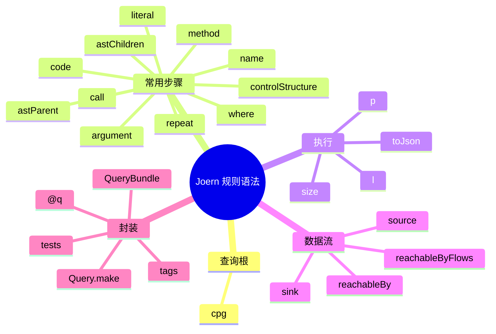

# 记忆卡片摘要（快速复习版）

## 1. 大纲（压缩版）

- Joern 规则语法分两层：查询语法层与规则封装层
- `cpg` 是所有查询的根
- 常用步骤分为 node-type、filter、map、complex、repeat、execution
- 数据流规则常见骨架是 source、sink、`reachableBy`
- 正式规则还要补 `Query.make`、标签、示例、测试
- 想减少误报，常常要补语义或缩窄 source/sink

## 2. 思维导图（Mermaid）



## 3. 重要知识点（必须记住）

- Joern 的“规则语法”至少有两层：第一层是 CPGQL 查询语法，第二层是把查询封装成可被 `joern-scan` 识别的 `Query` 规则对象。[来源1][来源2][来源3]
- 官方 `Traversal Basics` 把查询拆成根对象、Node-Type Steps、Filter/Map/Repeat Steps、Property Directives；这是学习 Joern 查询最该先建立的框架。[来源1]
- 官方 `Reference Card` 给出了大量常用步骤，其中对漏洞规则最关键的通常是 `method`、`call`、`argument`、`controlStructure`、`astParent`、`where`、`reachableBy`、`reachableByFlows`、`l`、`p`。[来源4]
- 规则封装层要求 `QueryBundle + @q + Query.make(...)`；仅会写查询，不等于能写进规则仓。[来源2][来源3]
- 数据流规则的核心不是“把 `reachableBy` 背下来”，而是先把 source 与 sink 定义得足够准，再考虑 call depth、外部语义和过滤条件。[来源5][来源6]

## 4. 难点 / 易混点

- 易混点 1：查询语法和规则封装语法是两回事。
- 易混点 2：`.l`、`.p`、`.toJson` 这类是“执行指令”，不是“筛选条件”。
- 易混点 3：`order` 和 `argumentIndex` 不一样；自定义语义里官方特别提醒要按 `argumentIndex` 理解。[来源5]
- 易混点 4：`reachableBy` 查不到，不一定说明没有漏洞，也可能是 source/sink 或 semantics 定义不对。

## 5. QA 快速复习卡片

- Q：Joern 查询的根对象是什么？
  A：通常是 `cpg`。[来源1][来源7]
- Q：最常见的结构查询入口有哪些？
  A：`method`、`call`、`argument`、`literal`、`controlStructure` 等。[来源4]
- Q：数据流规则最常见骨架是什么？
  A：先定义 `source` 和 `sink`，再对 sink 调 `reachableBy(source)` 或 `reachableByFlows(source)`。[来源6][来源8]
- Q：为什么正式规则要加 `@q`？
  A：因为 QueryDB 通过这个注解自动发现可执行规则。[来源3]

## 6. 快速复现步骤（最短路径）

1. 打开 `Traversal Basics`，先建立查询组件框架。[来源1]
2. 打开 `Reference Card`，把常见步骤与执行指令过一遍。[来源4]
3. 打开 `Syntax-Tree Queries`，学会 `astParent`、`controlStructure`、`whenTrue` 这类结构遍历。[来源7]
4. 打开 `Metrics.scala`，看“结构型规则”的最小骨架。[来源8]
5. 打开 `SQLInjection.scala`，看“数据流型规则”的最小骨架。[来源6]

---

# 学习笔记正文（详细版）

## 0. 学习目标、读者画像与假设

- 技术：`Joern 常用规则语法`
- 学习目标：让非科班读者能从“看得懂查询”走到“看得懂规则”，再走到“能写出最小规则骨架”。
- 读者水平：零基础到初学。
- 时间预算：深入版。
- 版本范围：以 2026-03-19 官方文档与主仓源码为准。
- 运行环境：不要求你已经运行 Joern。
- 假设与限制：
  - 本文默认你已接受“Joern 是基于 CPG 的图查询平台”这一前提。
  - 代码片段以教学改写为主，不保证与你本地版本逐字一致。

## 1. 先把一个最重要的误区拆掉：规则语法不是只有一种

很多初学者说“我想学 Joern 规则语法”，但其实混在一起说了两件事：

1. **怎么在 `cpg` 上写查询**
2. **怎么把查询封装成可被规则仓识别的规则**

如果你不分开学，就会出现一种典型混乱：

- 你会写 `cpg.method.call...`
- 但不知道为什么放进 `querydb` 后没被扫描器识别

所以本文先强制分成两层。

## 2. 第一层：CPGQL 查询语法

### 2.1 查询的根对象：`cpg`

Quickstart 和 Traversal Basics 都反复强调，`cpg` 是查询的根对象。[来源1][来源9]

直观理解：

- 你是在对“当前已加载的代码属性图”发问
- `cpg` 就像数据库连接后的表空间入口

所以最常见的开头都是：

```scala
cpg.method
cpg.call
cpg.literal
```

### 2.2 查询的五类基本部件

官方 `Traversal Basics` 把查询组成拆成得很清楚：[来源1]

1. Root Object
2. Node-Type Steps
3. Filter / Map / Repeat Steps
4. Property Directives
5. Execution Directives

这是学习 Joern 的总纲。后面遇到任何复杂查询，都可以倒回来套这个框架。

## 3. Node-Type Steps：先决定你在找哪一类节点

这一步可以理解为“先确定起点集合”。

官方 Reference Card 里最常见的 node-type steps 包括：[来源4]

- `all`
- `argument`
- `assignment`
- `call`
- `comment`
- `controlStructure`
- `file`
- `identifier`
- `literal`
- `local`
- `member`
- `metaData`
- `method`
- `methodRef`
- `namespace`
- `parameter`
- `tag`
- `typeDecl`

### 3.1 对漏洞规则最常用的几个

#### `method`

用来找方法。  
适合：

- 从入口函数开始
- 找 controller、service、DAO 之类的方法

#### `call`

用来找调用点。  
适合：

- 找危险 API
- 找数据库访问点
- 找模板渲染、文件操作、命令执行等 sink

#### `argument`

用来找实参。  
适合：

- 看某个调用的参数是什么
- 从参数继续往上/往下走 AST

#### `controlStructure`

用来找 `if/for/while/do` 这类结构。  
适合：

- 复杂度度量
- 判断某个危险调用是否被条件控制

#### `literal`

用来找常量字符串或数字。  
适合：

- 搜固定 SQL 片段、固定 URL、固定 magic value

## 4. Filter Steps：先缩窄，再谈精度

Node-Type Step 给你的是一大堆候选节点。  
真正让查询变“像规则”的，是过滤。

### 4.1 最常见的属性过滤

#### `.name("...")`

按名字过滤。  
例如：

```scala
cpg.method.name("main")
```

#### `.code("...")`

按代码文本过滤。  
例如：

```scala
cpg.call.argument.code("stderr")
```

这是 Quickstart 里就展示过的思路。[来源9]

### 4.2 `where(...)`

这是非常关键的高频语法。  
它的作用是：对当前遍历中的每个元素，再套一个子查询条件。

例如在数据流型规则中，你经常会看到：

```scala
cpg.method.where(_.methodReturn.evalType("..."))
```

这表示：

- 取所有方法
- 只保留那些“其返回值类型满足某条件”的方法

### 4.3 为什么过滤比“多写几个节点类型”更重要

因为很多误报并不是出在你起点找错，而是出在过滤不够窄。

例如：

- 找到了所有 `query` 调用
- 但没区分安全封装与非安全封装
- 也没限定所在框架

这样结果很容易泛滥。

## 5. Map / Complex Steps：沿图关系走动

这一步的本质是：  
你已经找到候选节点了，现在要沿着图的边走，去找上下文。

### 5.1 `astParent`

官方 Quickstart 用它从 `stderr` 参数向上找到 `fprintf` 调用。[来源9]

这很典型。  
很多时候你先找到的是参数、字面量、标识符，真正想看的却是它所在调用或语句。

### 5.2 `astChildren`

向下走 AST。  
适合：

- 看一个方法体里包含哪些节点
- 搜某个结构里的子表达式

### 5.3 `argument`

从调用走向实参。  
例如：

```scala
cpg.call.name("query").argument
```

### 5.4 `controlStructure.whenTrue`

`Syntax-Tree Queries` 文档展示了如何取 `if` 结构的条件和 `whenTrue` 分支。[来源7]

这类语法非常适合做：

- 某调用是否受条件保护
- 某校验逻辑是否出现在危险调用前

## 6. Repeat：把“多跳关系”写得更可读

如果一层一层写：

```scala
.astChildren.astChildren.astChildren
```

查询很快会又长又脆弱。  
所以官方 `Traversal Basics` 专门介绍了 `repeat`。[来源1]

### 6.1 `repeat(...)(_.times(n))`

适合固定层数的重复遍历。

### 6.2 `repeat(...)(_.until(...))`

适合“持续往下找，直到命中某类节点”。

这对复杂 AST 搜索很实用。

## 7. Execution Directives：什么时候才真正执行

Joern 的遍历通常是惰性的。  
你写了一长串，不代表它已经把结果全部算出来。

真正执行的常见指令包括：[来源4]

- `toList`
- `l`
- `p`
- `size`
- `toJson`
- `toJsonPretty`

### 7.1 最常用的几个

#### `.l`

把结果转成列表。  
适合：

- 快速看真实节点对象

#### `.p`

pretty print。  
适合：

- 看 flow path 或更人类可读的输出

#### `.size`

看匹配数量。  
适合：

- 粗筛规则效果
- 先看规模，再决定是否深挖

## 8. 结构型规则的最小骨架

先看 `Metrics.scala` 这类规则。[来源8]

典型骨架是：

```scala
object Metrics extends QueryBundle {

  @q
  def tooManyParameters(n: Int = 4): Query =
    Query.make(
      name = "too-many-params",
      author = Crew.fabs,
      title = s"Number of parameters larger than $n",
      description = "...",
      score = 1.0,
      withStrRep({ cpg =>
        cpg.method.internal.filter(_.parameter.size > n).nameNot("<global>")
      }),
      tags = List(QueryTags.metrics)
    )
}
```

你应该先从这类规则学会五件事：

1. `object Xxx extends QueryBundle`
2. `@q`
3. `def rule(...): Query`
4. `Query.make(...)`
5. `withStrRep { cpg => ... }`

## 9. 数据流型规则的最小骨架

再看 `SQLInjection.scala`。[来源6]

它的关键逻辑是：

```scala
def source = ...
def sink = ...
sink.reachableBy(source)
```

这就是 Joern 漏洞规则最经典的写法。

### 9.1 为什么先定义 source 和 sink

因为如果你直接上来写一串长遍历：

- 可读性很差
- 难以复用
- 难以调试

把 source 和 sink 拆开后，你就能分别验证：

- source 选得对不对
- sink 选得对不对
- 真正的难点只剩“路径是否可达”

### 9.2 `reachableBy` 与 `reachableByFlows` 怎么选

#### 规则仓里更常见 `reachableBy`

因为规则首先要回答“是否命中”。

#### 手工复核更常用 `reachableByFlows`

因为你需要看到一条具体路径来判断：

- 这是不是误报
- 这条路径有没有被 sanitize

## 10. 标签、标题、描述、分值该怎么理解

这一层看起来像元数据，实际非常影响规则能不能被工程化使用。

### 10.1 `name`

给机器调用和过滤。  
应短、稳定、可脚本引用。

### 10.2 `title`

给人看结果。  
应该一句话说明“命中了什么问题”。

### 10.3 `description`

给人理解规则的背景、风险和适用边界。

### 10.4 `score`

不是最终风险评级，而更像“提示强度”或优先级参考。

### 10.5 `tags`

帮助：

- `joern-scan --tags ...` 筛选
- 按漏洞大类组织规则仓

## 11. `codeExamples` 和测试为什么重要

官方 `Query.scala` 里定义了 `CodeExamples` 和 `MultiFileCodeExamples`。[来源2]

`Metrics.scala` 也能看到正例和反例示例被直接写进规则对象。[来源8]

这非常适合教学和长期维护，因为它让规则本身就携带：

- 命中长什么样
- 不命中长什么样

而 `querydb/README.md` 又强调测试是必需的。[来源3]

这说明官方对规则质量的要求并不是“能跑就行”，而是：

- 可解释
- 可回归
- 可验证

## 12. `order` 和 `argumentIndex` 为什么容易坑新手

官方 `Custom Data-Flow Semantics` 专门提醒：  
`argumentIndex` 不等于 `order`。[来源5]

### 12.1 `order`

更像 AST 兄弟节点之间的位置顺序。

### 12.2 `argumentIndex`

是调用参数语义上的顺序；面向数据流语义时要按它理解。

这意味着：

- 你在自定义 semantic 时，如果按 `order` 想当然，很容易把传播关系写错。

## 13. 一条规则怎么从“能跑”进化到“像样”

### 第一步：先写一个能命中的粗查询

例如：

```scala
cpg.call.name("exec")
```

### 第二步：再加过滤，缩小范围

例如：

- 限定所在语言/包/类型
- 限定参数形式
- 排除安全包装

### 第三步：如果是数据流规则，拆出 source 和 sink

不要把所有逻辑塞在一行里。

### 第四步：补元数据

- `title`
- `description`
- `tags`
- `score`

### 第五步：补正反例与测试

没有这一步，规则很难长期维护。

## 14. 非科班读者最实用的 8 个常用模式

### 模式 1：按方法名找入口

```scala
cpg.method.name("main").l
```

### 模式 2：按调用名找危险点

```scala
cpg.call.name("query").l
```

### 模式 3：从调用下钻到参数

```scala
cpg.call.name("query").argument.code.l
```

### 模式 4：从参数回到父调用

```scala
cpg.call.argument.code("stderr").astParent.l
```

### 模式 5：找控制结构

```scala
cpg.method.name("foo").controlStructure.l
```

### 模式 6：找满足条件的方法

```scala
cpg.method.where(_.parameter.size > 4).l
```

### 模式 7：看具体 flow

```scala
sink.reachableByFlows(source).p
```

### 模式 8：先看数量

```scala
cpg.call.name("query").size
```

## 15. 最常见的误报来源与对应语法策略

### 15.1 source 定义太宽

策略：

- 缩窄入口方法
- 缩窄参数类型
- 缩窄框架上下文

### 15.2 sink 定义太宽

策略：

- 精确到具体 API
- 限定具体参数位

### 15.3 外部调用没语义

策略：

- 补 custom semantics

### 15.4 规则只看文本不看结构

策略：

- 从 `code("...")` 升级到结构与数据流联合查询

## 16. 必须记住 / 先知道即可

### 必须记住

- `cpg` 是入口
- 先用 node-type 决定候选集合
- 再用 filter/complex 缩窄和取上下文
- 最后用 execution directive 执行
- 正式规则还要封装进 `Query.make`

### 先知道即可

- 自定义 step
- 更高级的 schema 扩展
- 多文件规则示例

## 17. 延伸学习路径（官方优先）

- 入门：`Traversal Basics`、`Reference Card`、`Syntax-Tree Queries`。[来源1][来源4][来源7]
- 规则封装：`Query.scala`、`QueryDatabase.scala`、`querydb/README.md`。[来源2][来源3]
- 数据流进阶：`SQLInjection.scala`、`Custom Data-Flow Semantics`。[来源5][来源6]

---

# 练习与复习闭环

## 1. 分层练习

### 基础练习

- 练习 1：写出一个从 `cpg` 开始、以 `.l` 结束的最小查询。
- 练习 2：说出 `call` 和 `argument` 的区别。
- 练习 3：说出 `reachableBy` 和 `reachableByFlows` 的区别。

### 应用练习

- 练习 4：写一个“找函数参数超过 4 个”的查询。
- 练习 5：写一个“找名为 `query` 的调用并打印参数代码”的查询。

### 综合练习

- 练习 6：写一个伪规则，检测“外部输入流向命令执行调用”。

## 2. 动手任务（带验收标准）

- 任务：写一条你自己的最小 Joern 规则骨架。
- 验收标准：
  - 必须包含 `QueryBundle`
  - 必须包含 `@q`
  - 必须包含 `Query.make`
  - 必须包含一个 `tags` 和一个 `description`

## 3. 常见误区纠偏

- 误区：会写查询就等于会写规则。
  正解：规则还要封装、命名、打标签、补测试。

- 误区：结果不对就继续加更多文本过滤。
  正解：很多时候更该从结构和数据流层面重写条件。

- 误区：`reachableBy` 是万能语法。
  正解：source/sink 定义和语义模型比它本身更关键。

## 4. 复习节奏建议

- Day 1：记住五类查询组件。
- Day 3：练熟 `method/call/argument/astParent/where/l`。
- Day 7：能从 `Metrics.scala` 读懂一条规则。
- Day 14：能自己写出一条最小数据流规则骨架。

## 5. 自测题与参考答案（简版）

- 题目 1：Joern 查询的根对象是什么？
  参考答案：通常是 `cpg`。[来源1][来源9]

- 题目 2：为什么 `@q` 很重要？
  参考答案：因为 QueryDB 靠它发现哪些方法是正式规则。[来源3]

- 题目 3：为什么 `source/sink` 定义常比 `reachableBy` 更重要？
  参考答案：因为如果边界定义错了，路径判断再强也只会放大误报或漏报。[来源5][来源6]

---

# 参考来源与版本说明

## 官方来源（优先）

1. [Traversal Basics | Joern Documentation](https://docs.joern.io/traversal-basics/) - 访问日期：2026-03-19.
2. [Query.scala](https://github.com/joernio/joern/blob/master/macros/src/main/scala/io/joern/console/Query.scala) - 访问日期：2026-03-19.
3. [querydb/README.md](https://github.com/joernio/joern/blob/master/querydb/README.md) - 访问日期：2026-03-19.
4. [Reference Card | Joern Documentation](https://docs.joern.io/cpgql/reference-card/) - 访问日期：2026-03-19.
5. [Custom Data-Flow Semantics | Joern Documentation](https://docs.joern.io/dataflow-semantics/) - 访问日期：2026-03-19.
6. [Java SQLInjection.scala](https://github.com/joernio/joern/blob/master/querydb/src/main/scala/io/joern/scanners/java/SQLInjection.scala) - 访问日期：2026-03-19.
7. [Syntax-Tree Queries | Joern Documentation](https://docs.joern.io/c-syntaxtree/) - 访问日期：2026-03-19.
8. [Metrics.scala](https://github.com/joernio/joern/blob/master/querydb/src/main/scala/io/joern/scanners/c/Metrics.scala) - 访问日期：2026-03-19.
9. [Quickstart | Joern Documentation](https://docs.joern.io/quickstart/) - 访问日期：2026-03-19.

## 第三方来源（按采信程度标注）

- 本文未依赖第三方非官方来源作为结论依据。

## 关键结论引用映射

- [来源1] Traversal Basics
- [来源2] Query.scala
- [来源3] querydb README
- [来源4] Reference Card
- [来源5] Custom Data-Flow Semantics
- [来源6] SQLInjection.scala
- [来源7] Syntax-Tree Queries
- [来源8] Metrics.scala
- [来源9] Quickstart

## 官方文档章节映射与重要例子保留检查

- `Traversal Basics`：
  - 已映射到第 2、6、7 节。
- `Reference Card`：
  - 已映射到第 3、7、9 节。
- `Syntax-Tree Queries`：
  - 已映射到第 5 节。
- `Quickstart`：
  - 已映射到第 4、5 节中的 `astParent` 典型思路。
- `Custom Data-Flow Semantics`：
  - 已映射到第 9、12、15 节。
- 重要例子保留情况：
  - 保留了 Quickstart 中 `cpg.call.argument.code("stderr").astParent` 的核心查询思路。
  - 保留了 `Metrics` 和 `SQLInjection` 两类官方规则示例。

## 冲突点与裁决（如有）

- 冲突点：无显著事实冲突。
- 说明：本文对“最常用模式”的归纳带有教学排序，是基于官方材料的整理，不代表官方唯一推荐顺序。

## Mermaid 验证说明

- 已于 2026-03-19 在当前环境使用 `npx @mermaid-js/mermaid-cli` 对本文 Mermaid 图完成编译验证，通过。
