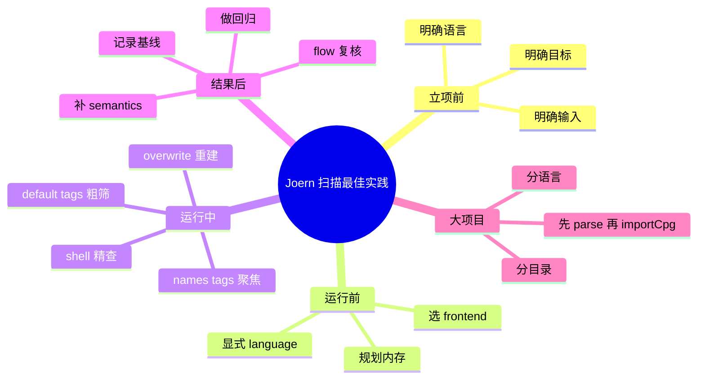

# 记忆卡片摘要（快速复习版）

## 1. 大纲（压缩版）

- 漏洞扫描不要一上来全量乱扫
- 先分输入、分语言、分目标
- 先用 `joern-scan` 粗筛，再回 `joern` 精查
- 规则过滤、语言显式指定、重建 CPG 都是基础卫生
- 误报控制靠 source/sink、语义、人工复核三件套
- 大项目要拆步骤、控内存、做基线和回归

## 2. 思维导图（Mermaid）



## 3. 重要知识点（必须记住）

- Joern 更适合“先粗筛、再深挖”的分层扫描，不适合把所有规则、所有语言、所有目录一次性胡乱堆在一起跑；这是从其平台结构与官方扫描工作流可以直接推出来的工程结论。[来源1][来源2][来源3]
- 官方文档明确建议在自动语言识别失败时显式指定 `--language`；在真实工程里，这条建议应当扩大为“混合仓库默认显式指定语言”。这部分后一句是基于官方建议的工程推断。[来源4]
- `--overwrite` 是非常重要的扫描卫生参数。官方 `Joern Scan` 文档直说：代码有显著改动后应重建 CPG，否则你可能在旧图上看新代码。[来源1]
- 对大代码库，官方安装文档已经建议把 frontend 独立运行，再 `importCpg`；工程上这几乎应视为默认最佳实践，而不是只在“特别大”时才想起。[来源5]
- 如果数据流结果异常，官方 Common Issues 和 Custom Data-Flow Semantics 已经给出方向：检查 overlays、语言、source/sink 定义和外部语义，而不是第一反应就说“Joern 不准”。[来源4][来源6][来源7]

## 4. 难点 / 易混点

- 易混点 1：扫描“跑完了”不等于“结果可直接交付”。
- 易混点 2：误报的根源往往不在规则名字，而在输入、语言、语义和上下文。
- 易混点 3：全量跑 `--tags all` 不总是最佳起点。
- 易混点 4：Joern 是研究与工程兼容的平台，所以你需要自己建立扫描节奏，而不是期待一个永远最优的默认按钮。

## 5. QA 快速复习卡片

- Q：真实项目里第一步该干什么？
  A：先搞清输入类型、目标语言、扫描目的，再选 frontends 和规则范围。
- Q：为什么不要一上来 `--tags all` 扫整个 monorepo？
  A：因为噪声和成本都会暴涨，你也更难定位问题来源。
- Q：什么时候一定要 `--overwrite`？
  A：代码或分析配置明显变化后，应优先重建 CPG。[来源1]
- Q：发现误报多，第一步怎么处理？
  A：先缩窄 source/sink、规则范围和语言，再考虑补 custom semantics。[来源6][来源7]

## 6. 快速复现步骤（最短路径）

1. 先看 `Joern Scan` 文档，理解默认扫描输出格式和 `--tags/--names/--overwrite`。[来源1]
2. 再看 `Workspace` 与 `Quickstart`，理解为什么粗筛后要回 shell 深挖。[来源2][来源3]
3. 看 `Common Issues` 与 `Custom Data-Flow Semantics`，准备误报与漏报排查手册。[来源4][来源6]
4. 看 `querydb/README.md`，理解规则如何扩展和测试。[来源8]
5. 看 `Installation`，理解大项目为什么要分步跑。[来源5]

---

# 学习笔记正文（详细版）

## 0. 学习目标、读者画像与假设

- 技术：`Joern 漏洞扫描工程最佳实践`
- 学习目标：不是教你“命令怎么打”，而是教你“真实项目里怎么把 Joern 用得稳、准、可复现”。
- 读者水平：初学到有一点实战诉求的读者。
- 时间预算：深入版。
- 版本范围：以 2026-03-19 官方文档、主仓源码和当前规则仓为准。
- 运行环境：本地或 CI 均可。
- 假设与限制：
  - 本文包含一部分基于官方材料的工程推断，我会显式标注“推断”。
  - 最佳实践不是硬性语法规则，而是降低成本、减少误报、提高复现性的策略集合。

## 1. 最先要改掉的习惯：不要把 Joern 当“一键真相机”

很多安全新手第一次接触扫描工具，会天然期待：

- 跑一次
- 出一堆结果
- 按结果修

这在简单 SAST 工具里勉强还能凑合，但在 Joern 上往往效果不好。  
原因不是 Joern 不够强，而是它太灵活。

Joern 同时提供：

- 多语言前端
- 交互式 shell
- 规则仓
- 数据流引擎
- 自定义语义

这类平台的正确打开方式通常不是“一键出答案”，而是：

1. 先粗筛
2. 再定位
3. 再复核
4. 再调优

这是本文的总原则。

## 2. 扫描前的三件事：目标、输入、语言

### 2.1 先明确目标

你要扫什么，决定你怎么扫。

常见目标：

- 快速发现明显危险函数
- 做某一类漏洞专项，比如 SQL 注入、XSS、路径穿越
- 做变体分析
- 做大仓库治理
- 做研究型探索

如果你目标不同，最佳参数组合也不同。

### 2.2 先明确输入

输入类型至少要分：

- 源码
- 字节码
- 二进制[来源9]

最佳实践：

- 优先源码
- 其次字节码
- 最后才是二进制

这不是绝对规则，而是工程上最省事、最可复核的优先级。

### 2.3 先明确语言边界

官方 Common Issues 只是在“识别失败”时建议显式指定语言。[来源4]  
但在工程场景里，我给出一个明确推断：

**只要仓库是混合语言或 monorepo，就应默认显式指定语言，并按语言拆批扫描。**

原因很直接：

- 自动识别是启发式
- 仓库文件分布会变化
- 一次扫混合目录，定位成本高

这是基于官方建议向工程场景做的扩展，不是官方逐字原文。

## 3. 第一轮扫描：先粗筛，不要立刻全量研究

### 3.1 为什么先粗筛

因为你最先需要的不是“所有可能问题”，而是“哪些区域值得投入人力”。

### 3.2 粗筛的推荐路径

推荐顺序：

1. 显式语言
2. 先用默认规则或少量标签规则
3. 看结果分布
4. 再挑热点做深挖

例如：

```bash
joern-scan ./src --language java
```

或：

```bash
joern-scan ./src --language java --tags sql-injection,cryptography
```

### 3.3 为什么不建议一上来 `--tags all`

这条不是官方硬规则，而是非常强的工程建议。

原因：

- 查询量增加
- 输出噪声增加
- 很多低优先级 finding 会淹没高价值结果
- 你更难判断问题是来自规则本身，还是来自语言/输入/语义配置

我的建议是：

- 研究场景：可以全量
- 工程落地第一轮：优先默认标签或目标标签

## 4. 第二轮：把扫描器结果带回交互式分析

官方 `joern-scan` 源码在扫描完成后会提示：

```text
Run `joern --for-input-path <src>` to explore interactively
```

这其实已经在暗示官方推荐工作流：[来源10]

1. 用 `joern-scan` 找问题
2. 用 `joern` 打开同一输入对应项目
3. 在 REPL 里深查

### 4.1 为什么这一步重要

因为扫描器输出往往只有：

- 规则标题
- 分值
- 文件
- 行号
- 函数名[来源1]

但真正修复或判定误报时，你需要：

- 上下文 AST
- 调用关系
- 具体 flow 路径
- 是否被条件保护

这些通常都要回 REPL 里看。

## 5. `--overwrite` 应当成为常态化卫生动作

官方 `Joern Scan` 文档说得很明白：程序有显著变化后，应该用 `--overwrite` 重新生成 CPG。[来源1]

### 5.1 为什么这很重要

因为 CPG 不是实时跟着源码变的，它是某一时刻生成的分析产物。

如果你：

- 修改了源码
- 切换了 frontend 参数
- 更新了规则仓
- 改了语言选项

却还在旧 CPG 上继续看结果，很容易产生“我明明改了，为什么结果不变”的错觉。

### 5.2 工程建议

对非临时性的扫描任务，把下面这条当默认心法：

- **只要输入或分析配置发生实质变化，就重建 CPG。**

## 6. 误报控制：Joern 的核心不是“少报”，而是“可解释”

这是理解 Joern 的关键。

### 6.1 误报为什么会多

常见原因：

- source 定义过宽
- sink 定义过宽
- 外部调用没语义
- 自动语言识别错了
- 混合仓库没拆批
- 调用深度太大

### 6.2 Joern 给你的不是黑盒分数，而是可追踪路径

这意味着你有机会主动降误报：

- 缩窄规则范围
- 看 flow 路径
- 加上下文过滤
- 补 custom semantics

### 6.3 最有效的三个动作

#### 动作 1：缩窄规则范围

用：

- `--tags`
- `--names`

先把问题收束到一个类别或一条规则。

#### 动作 2：回 REPL 看具体 flow

用：

- `reachableBy`
- `reachableByFlows`

区分“可达”与“具体怎么达”。

#### 动作 3：补语义

官方 `Custom Data-Flow Semantics` 已明确说明，外部方法缺语义时会采用保守传播。[来源6]

如果你的项目 heavily 依赖框架 helper、sanitizer、wrapper，不补语义几乎注定噪声会上升。

## 7. 漏报控制：不要只盯误报

有些团队一看到误报就急着把规则收得特别窄，最后把真问题也一起过滤掉。

### 7.1 常见漏报来源

- 语言选错
- 输入选错
- source 定义过窄
- sink 只写了一个 API 变体
- 自定义语义写得太激进，把传播杀掉了

### 7.2 最佳实践

- 先让规则“有机会命中”
- 再逐步降误报
- 每改一次都配正反例测试

这条是从 `querydb` 官方做法直接能学到的：  
官方规则普遍带正反例与测试，不是只追求“看起来很精确”。[来源8]

## 8. 大项目最佳实践：分步跑，而不是一口吞

官方安装文档已经给出一个非常重要的提示：大项目时，`importCode` 会额外启动 frontend JVM，内存压力大，建议单独跑 frontend 再 `importCpg`。[来源5]

### 8.1 推荐的大项目流程

1. 用 frontend 单独生成 CPG
2. 归档 CPG 产物
3. 用 `joern` 或 `joern-scan` 基于该 CPG 继续分析
4. 记录参数和版本

### 8.2 为什么这样更稳

- 更容易控内存
- 更容易复用图
- 更容易做回归
- 更适合 CI/CD

### 8.3 按目录拆批比按仓库一把梭更稳

尤其是 monorepo：

- `service-a/java`
- `service-b/go`
- `frontend/js`

分别跑，结果更干净，也更容易分责任团队。

## 9. 规则选择最佳实践：从默认到专项，再到自定义

### 9.1 第一层：默认规则

适合：

- 初次接触项目
- 快速摸底

### 9.2 第二层：专项规则

用 `--tags` 或 `--names` 聚焦某类问题。  
适合：

- SQL 注入专项
- 路径穿越专项
- 密码学误用专项

### 9.3 第三层：自定义规则

当默认 querydb 不够贴你的业务时，再做自定义。

官方 `querydb/README.md` 已经把“如何写规则、如何测规则”给出了明确入口。[来源8]

## 10. 结果管理最佳实践：做基线，不要只看单次输出

这是工程场景里经常被忽略的一点。

### 10.1 为什么要做基线

因为扫描结果是会变化的，变化来源包括：

- 代码变了
- 规则仓变了
- 语义变了
- 语言选择变了
- 版本升级了

如果没有基线，你很难回答：

- 这次新增问题是真新增，还是规则升级导致的新增？
- 这次减少问题是真修掉了，还是漏掉了？

### 10.2 推荐记录内容

- Joern 版本
- querydb 版本
- 命令行参数
- 输入路径与 commit
- 语言指定
- 规则范围

这部分是基于官方产物结构和命令行为做的工程推断，不是官方单页文档逐条规定。

## 11. CI / 批处理最佳实践

### 11.1 关颜色、显式参数、固定版本

推荐：

- `--nocolors`
- 显式 `--language`
- 固定 querydb 版本或至少记录版本

### 11.2 先小范围回归，再扩大范围

不要直接把新规则或新语义全仓上线。

推荐：

1. 小仓库试跑
2. 目标标签试跑
3. 热点目录试跑
4. 再全仓推广

### 11.3 对规则做“回归集”

`querydb` 官方做法已经说明，规则就该配测试。[来源8]  
企业内部规则同样如此。

## 12. 人工复核最佳实践：把 Joern 当“调查放大镜”

Joern 在工程里最有价值的时候，往往不是“替你自动决定一切”，而是：

- 帮你把线索集中到真正值得看的代码上
- 帮你解释一条路径为什么成立
- 帮你做变体扩展

### 12.1 复核时重点看什么

- 这条路径的 source 是不是真的外部可控
- sink 是不是真的危险 API
- 中间有没有 validate / sanitize
- 调用解析是不是可信
- 路径是不是只在不可达条件下成立

### 12.2 复核输出最好沉淀什么

- 规则名
- 路径截图或 flow 节点摘要
- 是否为真
- 若为误报，原因是什么
- 若需降噪，下次是改规则还是补语义

## 13. 对非科班读者最实用的一套扫描闭环

如果你现在就要开始，我建议这套最小流程：

1. 明确目标：例如只看 SQL 注入
2. 明确输入：Java 源码
3. 显式指定语言
4. 跑 `joern-scan --tags sql-injection`
5. 对命中项回 `joern --for-input-path ...`
6. 用 flow 路径和 AST 上下文复核
7. 如果误报多，缩窄 source/sink 或补语义
8. 重跑并记录基线

这套流程简单，但已经很接近实际工程。

## 14. 哪些建议是官方事实，哪些是工程推断

为了不把经验包装成文档原文，这里专门分开说明。

### 官方事实

- `joern-scan` 支持 `--tags`、`--names`、`--overwrite`、`--language`。[来源1][来源10]
- 自动语言识别失败时，官方建议显式指定语言。[来源4]
- 外部方法缺语义时，数据流会采用保守传播。[来源6]
- 大项目可单独运行 frontend 再 `importCpg`。[来源5]

### 基于官方事实的工程推断

- 混合仓库默认按语言拆批扫描更稳。
- 第一轮不建议直接 `--tags all`。
- 结果必须做基线管理。
- 最好的复核路径是“scan 粗筛 + shell 深挖”。

这些推断都不是拍脑袋，而是从官方架构和文档建议顺着推出来的。

## 15. 必须记住 / 先知道即可

### 必须记住

- 先粗筛，再精查
- 显式语言比赌自动稳
- 代码变了就重建 CPG
- 误报控制靠规则收束、flow 复核、语义补充
- 大项目尽量分步跑

### 先知道即可

- 所有标签的完整含义
- 全量规则一次性覆盖策略
- 复杂 CI 编排细节

## 16. 延伸学习路径（官方优先）

- `Joern Scan`：先掌握粗筛入口。[来源1]
- `Workspace` 与 `Quickstart`：掌握回 shell 深挖的路径。[来源2][来源3]
- `Common Issues`：建立排错心智。[来源4]
- `Custom Data-Flow Semantics`：学会控制精度。[来源6]
- `querydb/README.md`：学会把扫描从“使用规则”升级到“维护规则”。[来源8]

---

# 练习与复习闭环

## 1. 分层练习

### 基础练习

- 练习 1：说出你认为扫描前必须确认的三件事。
- 练习 2：解释为什么 `--overwrite` 很重要。
- 练习 3：解释为什么要把 `joern-scan` 和 `joern` 配合使用。

### 应用练习

- 练习 4：给一个 Java monorepo 设计第一轮扫描方案。
- 练习 5：给一个误报很多的 SQL 注入规则设计一轮降噪动作。

### 综合练习

- 练习 6：设计一套适合 CI 的 Joern 扫描闭环，包括版本记录和回归验证。

## 2. 动手任务（带验收标准）

- 任务：写一份你团队的 Joern 扫描 SOP。
- 验收标准：
  - 至少包含“扫描前、扫描中、扫描后”三个阶段。
  - 至少包含 10 条动作。
  - 明确哪些动作由机器完成，哪些动作必须人工复核。

## 3. 常见误区纠偏

- 误区：全量规则一次跑完最省事。
  正解：往往最吵，也最难定位问题。

- 误区：误报多说明工具没用。
  正解：很多时候是输入、规则边界或语义建模没对上。

- 误区：只要有结果就能直接提单修。
  正解：Joern 更适合作为调查平台，很多结果需要 flow 级复核。

## 4. 复习节奏建议

- Day 1：记住“目标、输入、语言”三件事。
- Day 3：记住“scan 粗筛 + shell 精查”工作流。
- Day 7：能独立说明误报控制三件套。
- Day 14：能写出适合自己项目的一页扫描 SOP。

## 5. 自测题与参考答案（简版）

- 题目 1：为什么不建议混合仓库完全依赖自动识别语言？
  参考答案：因为官方都提示自动识别会失败；工程上混合仓库更应显式指定语言并拆批处理。[来源4]

- 题目 2：为什么推荐先 `joern-scan` 再 `joern`？
  参考答案：前者擅长粗筛，后者擅长看上下文、看 flow、做人工复核。[来源1][来源2][来源3][来源10]

- 题目 3：为什么大项目推荐先跑 frontend 再 `importCpg`？
  参考答案：因为官方安装文档已指出 `importCode` 会额外启动 frontend JVM，内存压力更大。[来源5]

---

# 参考来源与版本说明

## 官方来源（优先）

1. [Joern Scan | Joern Documentation](https://docs.joern.io/scan/) - 访问日期：2026-03-19.
2. [Workspace | Joern Documentation](https://docs.joern.io/organizing-projects/) - 访问日期：2026-03-19.
3. [Quickstart | Joern Documentation](https://docs.joern.io/quickstart/) - 访问日期：2026-03-19.
4. [Common Issues | Joern Documentation](https://docs.joern.io/common-issues/) - 访问日期：2026-03-19.
5. [Installation | Joern Documentation](https://docs.joern.io/installation/) - 访问日期：2026-03-19.
6. [Custom Data-Flow Semantics | Joern Documentation](https://docs.joern.io/dataflow-semantics/) - 访问日期：2026-03-19.
7. [Reference Card | Joern Documentation](https://docs.joern.io/cpgql/reference-card/) - 访问日期：2026-03-19.
8. [querydb/README.md](https://github.com/joernio/joern/blob/master/querydb/README.md) - 访问日期：2026-03-19.
9. [Joern 文档首页 Overview](https://docs.joern.io/) - 访问日期：2026-03-19.
10. [JoernScan.scala](https://github.com/joernio/joern/blob/master/joern-cli/src/main/scala/io/joern/joerncli/JoernScan.scala) - 访问日期：2026-03-19.

## 第三方来源（按采信程度标注）

- 本文未依赖第三方非官方来源作为结论依据。

## 关键结论引用映射

- [来源1] Joern Scan 文档
- [来源2] Workspace
- [来源3] Quickstart
- [来源4] Common Issues
- [来源5] Installation
- [来源6] Custom Data-Flow Semantics
- [来源7] Reference Card
- [来源8] querydb README
- [来源9] Overview
- [来源10] `JoernScan.scala`

## 官方文档章节映射与重要例子保留检查

- `Joern Scan`：
  - 已映射到第 3、4、5、14 节。
- `Workspace`：
  - 已映射到第 4、12 节。
- `Quickstart`：
  - 已映射到第 4 节的“粗筛后回 shell”逻辑。
- `Common Issues`：
  - 已映射到第 2、6、14 节。
- `Custom Data-Flow Semantics`：
  - 已映射到第 6、7、14 节。
- `Installation`：
  - 已映射到第 8 节。
- 重要例子保留情况：
  - 保留了 `joern-scan` 的过滤和重建思路，但改写为工程化 SOP。

## 冲突点与裁决（如有）

- 冲突点：无显著事实冲突。
- 说明：关于“不要一上来 `--tags all`”和“混合仓库默认拆批扫描”等表述，属于基于官方材料的工程推断，而非官方原句。

## Mermaid 验证说明

- 已于 2026-03-19 在当前环境使用 `npx @mermaid-js/mermaid-cli` 对本文 Mermaid 图完成编译验证，通过。
