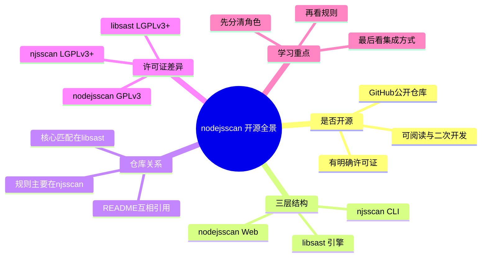

# 记忆卡片摘要（快速复习版）

## 1. 大纲（压缩版）
- `nodejsscan` 是开源的，但它不是单一仓库就能解释完的工具，而是一个“三层组合体”：`nodejsscan Web 平台`、`njsscan CLI 扫描器`、`libsast 通用静态分析引擎`。
- 从仓库入口看，真正的扫描能力主要在 `njsscan` 和 `libsast`，而 `nodejsscan` 更像“结果管理平台 + Web 界面 + Git/ZIP 接入层”。
- 开源不只是“代码公开”这么简单，还包括许可证、分工、可二次开发边界、与商业团队协作时的合规方式。
- `nodejsscan` 仓库 README 会把 CLI 明确引到 `njsscan` 仓库；如果只看最外层仓库，很容易误解它的能力边界。
- 对非科班读者来说，最重要的不是背许可证名称，而是理解：你能不能看源码、能不能改规则、能不能接进 CI、能不能做企业内部分发、修改后要不要回馈源码。

## 2. 思维导图（Mermaid）

## 3. 重要知识点（必须记住）
- `nodejsscan` 开源，这一点可以从 GitHub 公共仓库、README、LICENSE 文件直接确认。
- 但“开源项目 nodejsscan”在工程上其实分成 3 个仓库或 3 个层次来理解，否则你会把 Web 平台、CLI 和规则引擎混成一个东西。
- `nodejsscan` 的许可证是 GPL-3.0；`njsscan` 和 `libsast` 是 LGPL-3.0-or-later。这种差异对二次分发和集成方式有实际影响。
- 如果你只是想扫描 Node.js 工程，通常直接学 `njsscan` 更高效；如果你想做可视化管理、历史结果保存、误报标记、上传 ZIP/Git 仓库，那才需要看 `nodejsscan` Web 平台。
- 如果你想自定义扫描器而不仅仅是用现成规则，就必须进一步理解 `libsast`。

## 4. 难点 / 易混点
- 容易把“nodejsscan”这个名字同时当成 Web 平台、CLI 工具和整个生态的统称。实际上这 3 个层次要拆开看。
- 容易以为“开源 = 随便商用”。事实上还要看许可证条款，尤其是 GPL 与 LGPL 的差别。
- 容易以为规则仓库在 `nodejsscan` 最外层仓库里。实际上真正的规则主要打包在 `njsscan/rules/`。
- 容易以为 README 说支持某类扫描，就代表所有能力都在单一进程里完成。实际上 Web 层只是调用 `njsscan` 结果，再做持久化和展示。

## 5. QA 快速复习卡片
- Q: `nodejsscan` 到底是不是开源？
  A: 是，GitHub 公共仓库可见，且有明确 LICENSE 文件。
- Q: 为什么我要同时看 `njsscan` 和 `libsast`？
  A: 因为扫描逻辑和规则不主要在 Web 仓库里，而是在 CLI 与底层引擎里。
- Q: 为什么许可证还要分开记？
  A: 因为 Web 平台和 CLI/库的分发、嵌入、改造边界不完全一样。
- Q: 非科班初学者应该先学哪个？
  A: 想“会用扫描器”先学 `njsscan`；想“会管理扫描结果”再学 `nodejsscan`；想“自己造规则和引擎”再看 `libsast`。

## 6. 快速复现步骤（最短路径）
1. 打开 `nodejsscan` README，看它如何介绍自己以及它如何把 CLI 指向 `njsscan`。
2. 打开 `njsscan` README 和 `setup.py`，确认命令行入口、依赖和规则目录。
3. 打开 `libsast` README 与 `scanner.py`，确认真正的文件枚举、regex 匹配、semgrep 调用都在这里。
4. 对照各自 LICENSE 文件，建立“平台 / 工具 / 库”三层视图。

---

# 学习笔记正文（详细版）

## 0. 学习目标、读者画像与假设
- 技术：`nodejsscan` 及其相关仓库生态
- 学习目标：弄清它是不是开源、开源到什么程度、各仓库分别负责什么、初学者应该从哪里入手
- 读者水平：初学，默认不了解 SAST、许可证、仓库拆分
- 时间预算：3 小时以上
- 版本范围：以 2026-03-19 本地检出的公开 GitHub 仓库状态为准
- 运行环境：本地源码阅读 + 局部命令验证
- 假设与限制：本文重点是“开源属性与项目结构”。许可证解释以工程视角为主，不替代正式法律意见

## 1. 先给结论：它是不是开源？
先把结论说清楚：**是，`nodejsscan` 是开源项目，而且不是“只有代码托管在 GitHub 上”这种模糊意义上的开源，而是有公开源码仓库、明确许可证、可阅读可修改可 fork 的标准开源形态。**

为什么可以这么说？因为你从仓库入口就能看到几个非常硬的证据。

第一，`nodejsscan` 仓库是公开 GitHub 仓库，不需要企业内网、不需要登录组织权限才能看到源码、README、LICENSE、历史提交和 issue。对于开源项目而言，“代码可获得”是第一步。

第二，仓库顶层有 `LICENSE` 文件，README 徽章也直接标出许可证。`nodejsscan` README 首页标着 `GPL-3.0`，这说明作者不是“我把代码丢出来给你看，但你别碰”，而是明确给出了法律层面的使用条件。开源真正重要的不只是“能看”，而是“在什么条件下能用、能改、能再发”。

第三，配套仓库 `njsscan` 和 `libsast` 也都公开，且同样有明确许可证。这说明作者不是只开放了最表面的 Web 界面，而是把 CLI 扫描器和底层通用引擎也开放了。对学习者来说，这一点非常关键，因为你不只是能“看界面”，还能看“规则是怎么跑的”。

## 2. 为什么只看 `nodejsscan` 仓库会看不明白
很多人第一次看到 `nodejsscan` 这个名字，会自然以为“这个仓库里就装着全部能力”。但源码一看就会发现，不是这样。

`nodejsscan` README 的第一句话会说它是一个面向 Node.js 应用的静态安全扫描器，可它马上又补了一句：它是 **powered by `libsast` and `semgrep`**。再往下看 README，“CLI and Python API” 这块甚至直接把你引到了另一个仓库：`https://github.com/ajinabraham/njsscan`。

这说明什么？说明最外层 `nodejsscan` 仓库其实更像一个**扫描结果管理与展示平台**。它确实能让你“扫描”，但工程实现上它并没有把所有扫描逻辑都自己重写一遍，而是调用 `njsscan`。而 `njsscan` 本身再去调用 `libsast`，由 `libsast` 完成文件遍历、正则规则匹配和 `semgrep` 调用。

如果你把它类比成一家餐厅：
- `nodejsscan` 像前厅，负责点单、摆盘、结账、历史记录、标签管理。
- `njsscan` 像后厨主厨，负责真正把“扫描任务”组织起来。
- `libsast` 像炉灶和刀具，是更底层、更通用的烹饪能力。

所以，用户说“从 `nodejsscan` 仓库入口探索”，正确做法不是只盯着 Web 页面，而是顺着它 README 给出的线索递归下钻。你现在看到的这份文档，实际上就是按这个路径走的：`nodejsscan -> njsscan -> libsast -> semgrep 文档`。

## 3. 三层项目分别负责什么
### 3.1 `nodejsscan`：面向人的平台层
这个仓库的核心价值不是“发明规则”，而是把扫描结果组织成可操作的工作流。你从源码里能看到：
- `nodejsscan/app.py` 负责 Flask 路由和整体应用入口。
- `web/upload.py` 负责接收 ZIP、解压、调用扫描、保存结果。
- `web/git_utils.py` 负责接收 Git URL、克隆仓库、触发扫描。
- `web/dashboard.py` 负责扫描结果页面、搜索、标记误报、查看文件内容、删除扫描记录。
- `nodejsscan/models.py` 用数据库表保存扫描结果、文件列表、误报和“不适用”标记。

换句话说，`nodejsscan` 更像“漏洞管理小平台”。如果你的需求是“让安全团队上传 ZIP 或 Git 地址，扫完后在网页里看结果、做 triage、留历史记录”，这层很有价值。

### 3.2 `njsscan`：面向自动化的工具层
真正给开发者和 CI/CD 用的，是 `njsscan`。它有标准命令行参数、JSON/SARIF/SonarQube 输出、`.njsscan` 配置文件、忽略规则、退出码控制等功能。对大多数团队来说，日常把它接入 GitHub Actions、GitLab CI、Jenkins 或本地 pre-merge 检查，直接用 `njsscan` 就够了。

### 3.3 `libsast`：面向引擎和复用的库层
`libsast` 才是底层共性能力。它不局限于 Node.js，README 里直接说它是 **Generic SAST**。这意味着：
- 它有通用的 Pattern Matcher，可以做正则型规则匹配。
- 它能调 `semgrep` 做语义感知匹配。
- 它可以读取 YAML 规则、做标准映射、忽略路径、筛选文件后缀。

所以，`njsscan` 是“面向 Node.js 安全场景包装后的专用工具”，而 `libsast` 是“面向更多场景可复用的通用积木”。

## 4. 许可证为什么要重点看
初学者常见误区是：许可证只和律师有关，工程师不用管。其实不是。许可证直接决定你怎么把它放进团队流程里。

### 4.1 `nodejsscan` 是 GPL-3.0
GPL-3.0 一般被看作“更强 copyleft”的许可证。通俗理解就是：如果你修改它、再分发它，通常需要在 GPL 条件下继续开放相应源码。对内部学习、内部试用来说通常没什么问题；但如果你要做二次包装、嵌入商业产品并对外分发，就不能假装许可证不存在。

### 4.2 `njsscan` 与 `libsast` 是 LGPL-3.0-or-later
LGPL 相对 GPL 更宽松一些，尤其适合库被其他程序调用的场景。直观上可以把它理解成：**库本身的修改仍然要尊重 LGPL，但把它作为一个相对独立的库来调用时，整合方式的自由度通常比 GPL 大。**

为什么这里要强调这点？因为很多团队真正想用的是 `njsscan` CLI 或 `libsast` 库，而不是去维护一个完整的 Web 平台。那你在工程上接入 CLI/库时，就会更关心 LGPL 这一层。

### 4.3 非科班怎么理解“许可证差异”
你可以先不去死背条文，而是先回答 4 个问题：
1. 我只是本地学习和内部扫描吗？
2. 我会不会修改源码？
3. 我会不会把改造后的工具对外发给客户或用户？
4. 我是调用它，还是把它整合成产品的一部分再分发？

只要能把这 4 个问题问清楚，你就已经比很多“只会说开源真好用”的人更接近正确使用方式了。

## 5. 从提交历史看项目活跃度意味着什么
开源不等于“现在还在维护”。所以除了看 LICENSE，还要看最近提交。

我在 2026-03-19 本地克隆的最新状态里看到：
- `nodejsscan` 默认分支 `master` 最新提交是 `722e9145...`，提交时间是 **2024-11-04**。
- `njsscan` 默认分支 `master` 最新提交是 `83a95fdb...`，提交时间是 **2024-11-14**。
- `libsast` 默认分支 `master` 最新提交是 `73f3fc47...`，提交时间是 **2024-11-14**。

这组时间很重要。它说明两个事实。

第一，这不是一个十年没人动、只剩历史价值的死仓库。至少在 2024 年底这条链路还有维护痕迹，尤其 `njsscan` 最近提交甚至直接是“Explicit semgrep install”，说明维护者还在处理真实依赖问题。

第二，你不能只盯着 `nodejsscan` 这个 Web 仓库看活跃度。对于“能不能扫、规则能不能跟上、输出能不能接平台”这类关键问题，`njsscan` 和 `libsast` 的维护状态更值得看。

## 6. 开源对学习者到底有什么实际好处
很多宣传会把“开源”说成一句很大的口号，但对学习者最有价值的是下面这些很落地的能力。

### 6.1 你可以顺着调用链学，不会被黑盒堵死
闭源工具最难受的地方是：你看到告警，却不知道为什么告警；你想改规则，却没有入口；你怀疑误报，却没法证明。开源以后，你可以直接进 `njsscan/njsscan.py` 看它怎么组织扫描，再看 `libsast/scanner.py` 怎么取文件，再看 `semantic_sgrep.py` 怎么调用 `semgrep`，整个链路是透明的。

### 6.2 你可以验证 README 不是“宣传稿”
README 可能会简化事实，但源码不会轻易撒谎。比如 README 说支持 JSON/SARIF/SonarQube 输出，你可以直接去 `formatters/` 看。README 说有 `.njsscan` 配置，你可以直接读 `utils.get_config()`。README 说能检查 missing controls，你可以直接看 `missing_controls.yaml` 和 `missing_controls()`。这就是开源最大的教育价值：**你可以把“文档说了什么”与“代码实际做了什么”对照验证。**

### 6.3 你可以做渐进式定制，而不是从零重写
很多人一听“规则不完全符合我业务”，第一反应是“那我得自己做一套扫描器”。开源工具的正确打开方式不是这样。更务实的做法是：
- 先用现成工具获得 60 分能力；
- 再用配置和忽略规则修掉最明显噪声；
- 最后按自己的业务场景补规则；
- 只有当框架本身不适合时，才考虑重写。

## 7. 开源不等于无成本
说了这么多优点，也要说现实问题。

### 7.1 你要自己理解依赖链
比如我在本地验证时就遇到一个很实际的问题：只把 `njsscan` 源码拿下来还不够，`semgrep`、`sarif_om` 等依赖要装对，`HOME` 路径与 `semgrep-core` 可执行文件也要准备好。这不是缺点，而是事实。开源工具给你透明度，也把复杂度原样暴露给你。

### 7.2 你要自己管理版本兼容性
`njsscan` 在 `setup.py` 里把 `semgrep` 版本钉到了 `1.86.0`。这代表作者知道扫描语义对版本很敏感。对团队来说，开源意味着你可以自己 pin 版本；也意味着你有责任自己 pin 版本。

### 7.3 你要自己建立“项目边界感”
如果你把 Web 平台当成 CLI，或者把底层库当成成品平台，就会踩坑。真正成熟的用法是：知道每一层负责什么，只在适合的位置做改造。

## 8. 面向非科班的项目理解路线
如果你是第一次接触这类项目，我建议按下面顺序学，不要倒着来。

### 第一步：只回答“它是做什么的”
一句话版：`nodejsscan` 生态是用来做 **Node.js 应用静态安全检测** 的。

### 第二步：再回答“谁在真正干活”
- Web 界面负责交互和管理。
- CLI 负责把扫描任务组织起来。
- 底层库负责跑规则。
- `semgrep` 提供语义模式匹配能力。

### 第三步：最后再问“我应该改哪里”
- 想改页面、数据库、上传流程，去 `nodejsscan`。
- 想改命令行参数、输出格式、配置处理，去 `njsscan`。
- 想改通用匹配行为、规则加载、文件筛选，去 `libsast`。

## 9. 延伸学习路径（官方优先）
- 第一站：`nodejsscan` README，建立全景感。
- 第二站：`njsscan` README 和 `__main__.py`，理解 CLI 入口。
- 第三站：`libsast` README 和 `scanner.py`，理解引擎分工。
- 第四站：Semgrep 官方规则文档，理解语义规则为什么写成那样。

---

# 练习与复习闭环

## 1. 分层练习
### 基础练习
- 说出 `nodejsscan`、`njsscan`、`libsast` 各自主要负责什么。
- 说出 `nodejsscan` 与 `njsscan` 的许可证差异。
- 解释“为什么只看最外层仓库会误解项目结构”。

### 应用练习
- 假设你要给团队做一个“上传 ZIP 后看扫描结果”的内部工具，判断应该从哪一层开始改。
- 假设你只想在 CI 里拦截高危规则，判断应该用哪一层，以及为什么。

### 综合练习
- 画出一张从用户上传 ZIP 到页面展示结果的调用链图。
- 说明在这条链上，哪一步最适合做规则扩展，哪一步最适合做误报管理。

## 2. 动手任务（带验收标准）
- 任务：打开 3 个仓库，分别记录它们的 README 第一段在强调什么。
- 验收标准：你能用 3 句话说明这三个仓库不是重复关系，而是分层关系。

## 3. 常见误区纠偏
- 误区：`nodejsscan` 就等于命令行工具。
  正解：它更像平台层，CLI 在 `njsscan`。
- 误区：开源就不用看许可证。
  正解：许可证决定你如何修改和分发。
- 误区：规则肯定在最外层仓库里。
  正解：真正核心规则在 `njsscan/rules/`，通用引擎在 `libsast`。

## 4. 复习节奏建议
- Day 1：记住三层结构和许可证差异。
- Day 3：复述从 Web 到 CLI 到引擎的调用路径。
- Day 7：尝试用源码回答“为什么某功能不在最外层仓库实现”。
- Day 14：把项目结构讲给别人听，确认自己不是只会背名字。

## 5. 自测题与参考答案（简版）
- 题目1：`nodejsscan` 为什么不能被简单理解成“一个仓库一个工具”？
  参考答案：因为它的 Web 平台、CLI 工具和底层引擎是分层协作的，最外层仓库并不承载全部扫描逻辑。
- 题目2：为什么要同时看 `LICENSE` 和 `README`？
  参考答案：README 告诉你它想解决什么问题，LICENSE 告诉你你能在什么法律边界内使用和修改它。

---

# 参考来源与版本说明

## 官方来源（优先）
1. `nodejsscan` README: https://github.com/ajinabraham/nodejsscan/blob/master/README.md
2. `nodejsscan` LICENSE: https://github.com/ajinabraham/nodejsscan/blob/master/LICENSE
3. `njsscan` README: https://github.com/ajinabraham/njsscan/blob/master/README.md
4. `njsscan` setup.py: https://github.com/ajinabraham/njsscan/blob/master/setup.py
5. `libsast` README: https://github.com/ajinabraham/libsast/blob/master/README.md
6. `nodejsscan` Flask 入口与 Web 逻辑：`app.py`、`web/upload.py`、`web/git_utils.py`、`web/dashboard.py`

## 第三方来源（按采信程度标注）
1. Semgrep 官方文档总览：https://semgrep.dev/docs/writing-rules/overview 采信程度：高，用于解释语义规则概念

## 关键结论引用映射
- [来源1] -> `nodejsscan` 自我定位、对 `njsscan` CLI 的外链说明
- [来源2] -> `nodejsscan` 许可证为 GPL-3.0
- [来源3] -> `njsscan` 自我定位、CLI 与 Python API、配置说明
- [来源4] -> `njsscan` 同时导出 `njsscan` 与 `nodejsscan` 命令行入口
- [来源5] -> `libsast` 是 Generic SAST，并非只服务 Node.js
- [来源6] -> `nodejsscan` Web 平台负责上传、克隆、持久化、页面展示，而不直接实现所有底层扫描

## 官方章节映射与重要例子保留检查
- `nodejsscan README / Run nodejsscan` -> 本文“为什么只看最外层仓库会看不明白”与“项目分别负责什么”
- `nodejsscan README / CLI and Python API` -> 本文“三层项目分别负责什么”
- `njsscan README / nodejsscan SAST` -> 本文“平台层与工具层分工”
- `libsast README / Write your own Static Analysis tool` -> 本文“为什么还要看 libsast”
- 保留的重要例子：README 中对 `nodejsscan` 与 `njsscan` 的跳转关系、CLI 入口说明、Generic SAST 说明

## 技术版本与访问日期
- 本地访问日期：2026-03-19
- `nodejsscan` 本地检出：`master`，提交 `722e9145c05152446a355531145762e317dc7f7f`，提交时间 2024-11-04
- `njsscan` 本地检出：`master`，提交 `83a95fdb50b634dd3e86f1f51206452d53c12959`，提交时间 2024-11-14
- `libsast` 本地检出：`master`，提交 `73f3fc47feef07b4f8c0bf8bcd96aa85643959c6`，提交时间 2024-11-14

## 冲突点与裁决（如有）
- 冲突点：项目名 `nodejsscan` 在日常交流里既可指 Web 平台，也常被泛称整个生态。
- 裁决依据：以源码职责分层为准，本文明确拆分为 `nodejsscan Web`、`njsscan CLI`、`libsast 引擎` 三层。
- 采用结论：讨论“开源生态”时可统称 nodejsscan；讨论“具体实现”时必须拆层。