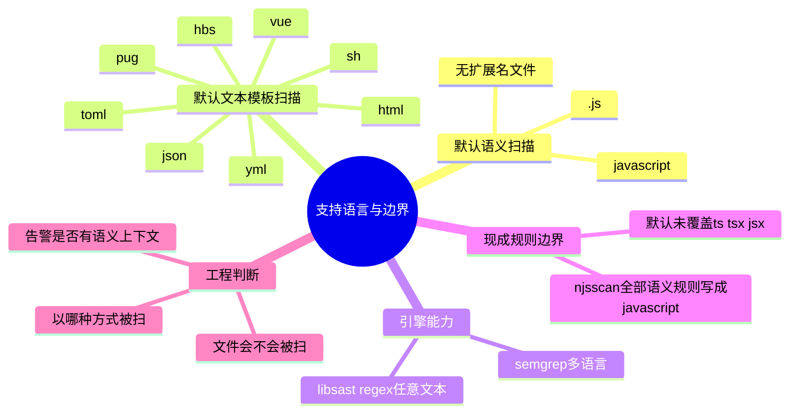

# 记忆卡片摘要（快速复习版）

## 1. 大纲（压缩版）
- `nodejsscan` 这个生态的“支持语言”要分 3 层回答：面向用户的默认扫描范围、`njsscan` 自带规则真正覆盖的语言、`libsast` 底层引擎理论上能支持的语言。
- 默认情况下，`njsscan` 的**语义规则全部写给 JavaScript**，并且默认只对 `.js` 和“无扩展名文件”走语义扫描。
- 模板和文本类扫描则走 regex 模式，默认覆盖 `.html`、`.mustache`、`.hbs`、`.vue`、`.pug`、`.json`、`.yml`、`.toml`、`.sh` 等扩展名。
- 这不等于“它完整支持所有这些语言的 AST 语义分析”，而是表示：这些文件会被某一类规则处理。
- 底层 `libsast` 的 Pattern Matcher 可以用于任何文本语言，但 `njsscan` 这套现成规则并不是“任意语言全自动适配”。

## 2. 思维导图（Mermaid）

## 3. 重要知识点（必须记住）
- “支持语言”不能只看 README 宣传语，要看规则 `languages:`、默认扩展名配置、底层引擎能力 3 个维度。
- `njsscan` 仓库里 113 条语义规则全部声明 `languages: javascript`。
- `njsscan` 默认 `NODEJS_FILE_EXTENSIONS` 是 `{'.js', ''}`，表示语义扫描默认面向 `.js` 和无扩展名脚本。
- `TEMPLATE_FILE_EXTENSIONS` 包含很多模板和文本扩展名，但它们主要走 regex 规则，不代表具备完整 JavaScript 那样的语义分析深度。
- `libsast` 本身是 Generic SAST，Pattern Matcher 理论上支持任意文本语言；但“引擎能扫”不等于“现成规则已经为该语言写好”。

## 4. 难点 / 易混点
- 容易把“文件后缀在列表里”误解成“该语言被完整支持”。
- 容易把 Semgrep 的多语言能力误解成 `njsscan` 已默认支持 TypeScript、JSX、TSX。源码和规则并没有这样声明。
- 容易把模板扫描和源码语义扫描混在一起。前者更像危险片段检索，后者更接近语义模式识别。

## 5. QA 快速复习卡片
- Q: `njsscan` 默认支持 TypeScript 吗？
  A: 默认现成规则和默认扩展名配置并没有把 TypeScript 当成标准一等公民来处理。
- Q: `.vue` 为什么会被扫？
  A: 因为它被列在模板扩展名集合里，主要走 regex 模板规则。
- Q: `libsast` 说支持任意语言，是不是 `njsscan` 也就自动支持任意语言？
  A: 不是。引擎能力和产品默认规则是两回事。

## 6. 快速复现步骤（最短路径）
1. 看 `njsscan/settings.py` 中 `NODEJS_FILE_EXTENSIONS` 与 `TEMPLATE_FILE_EXTENSIONS`。
2. 统计 `njsscan/rules/semantic_grep/**/*.yaml` 里的 `languages:` 字段。
3. 读 `libsast` README 中 Pattern Matcher 与 Semantic Grep 的能力说明。
4. 对照你要扫的文件类型，判断它会被哪类规则处理。

---

# 学习笔记正文（详细版）

## 0. 学习目标、读者画像与假设
- 技术：`nodejsscan` 生态的扫描语言与文件支持范围
- 学习目标：弄清“哪些文件会被扫”“为什么会被扫”“是被 regex 扫还是被语义规则扫”
- 读者水平：初学
- 时间预算：3 小时
- 版本范围：以 2026-03-19 本地检出的源码为准
- 运行环境：源码阅读 + 本地规则统计
- 假设与限制：本文强调默认行为与现成规则，不讨论你自己额外扩展后的无限可能

## 1. 为什么“支持语言”这个问题不能一句话回答
如果你问一个扫描器“支持什么语言”，很多宣传页会给你一个漂亮的列表。但在工程实践里，这个问题至少要拆成 3 小问。

第一，**哪些文件会被这个工具纳入扫描范围**。这由扩展名配置、路径过滤、忽略规则决定。

第二，**这些文件是被什么引擎扫描的**。是简单文本匹配，还是 AST/语义规则，结果质量会差很多。

第三，**规则是不是为这些语言专门写过**。底层引擎即便理论上支持某语言，也不代表你当前拿到的规则包已经为那个语言准备好。

`nodejsscan` 生态里，这 3 个问题恰好分散在不同层级：
- 文件纳入范围主要在 `njsscan/settings.py` 和 `.njsscan` 配置里；
- 语义扫描能力来自 `semgrep`；
- 具体规则是否真正覆盖某语言，要看 `njsscan/rules/semantic_grep` 下每个 YAML 的 `languages:` 字段；
- 更底层的“理论能力”则在 `libsast` README 里解释。

所以，如果有人只给你回答一句“它支持 Node.js”，这只是营销层面的说法，不足以指导工程决策。

## 2. 默认情况下，它主要支持什么
### 2.1 默认的语义扫描目标：JavaScript
我直接统计了 `njsscan/rules/semantic_grep/**/*.yaml`，总共 113 条规则，`languages:` 统计结果是：**全部都是 `javascript`**。

这意味着一个很关键的事实：`njsscan` 现成的语义规则包，是围绕 **Node.js / JavaScript 服务端安全场景** 写的。它擅长识别：
- Express 等框架里的输入到响应流向；
- SQL/NoSQL 注入模式；
- 文件路径拼接；
- 命令执行；
- JWT 与 Cookie 配置问题；
- Helmet 等安全控制是否启用；
- Electron、Puppeteer、Playwright 等 JavaScript 生态风险。

也就是说，它不是“一个泛 JavaScript 前端后端全场景都等价支持”的工具，而是偏**Node.js 服务端与相关 JavaScript 生态**的专用安全规则集合。

### 2.2 默认的 Node.js 源码扩展名：`.js` 与无扩展名文件
`njsscan/settings.py` 里的 `NODEJS_FILE_EXTENSIONS` 默认值是：
- `.js`
- 空字符串 `''`

空字符串非常容易被忽略。它代表“没有扩展名的文件”也可能被当作可语义扫描对象，比如某些可执行脚本或 shebang 文件。对真实工程来说，这个设计挺实用，因为不少 Node.js 脚本文件可能没有 `.js` 后缀。

### 2.3 默认的模板 / 文本扩展名集合
`TEMPLATE_FILE_EXTENSIONS` 列出的范围比较大，包括：
- `.html`
- `.mustache`
- `.hbs`
- `.vue`
- `.hdbs`
- `.ejs`
- `.dust`
- `.json`
- `.tl`
- `.tpl`
- `.tmpl`
- `.pug`
- `.haml`
- `.ect`
- `.sh`
- `.yml`
- `.toml`
- `.jade`

这组列表初看会让人误以为它“支持很多语言”。但你一定要加上半句：**这些文件主要是走 Pattern Matcher，也就是 regex/文本模式匹配，不等于都拥有 JavaScript 那样的语义规则深度。**

## 3. 为什么 `.vue`、`.json`、`.yml`、`.toml` 也会被扫描
这是很多初学者最困惑的地方：这些看起来不像 Node.js 源码的文件，为什么也在扫描范围里？

答案很简单，因为 Node.js 工程的安全风险不只出现在 `.js` 文件里。模板、配置、脚本和构建文件同样可能埋雷。

### 3.1 模板文件里的 XSS 风险
比如：
- Handlebars / Mustache 的三花括号 `{{{...}}}` 代表不转义输出；
- EJS 的 `<%- ... %>` 也是不转义输出；
- Vue 模板里的 `v-html` 会把内容当 HTML 注入；
- Pug/Jade 的 `!{...}` 代表不转义插值。

这些风险你不需要 AST 才能初步发现，regex 就足够抓到大量高价值信号。所以 `njsscan` 把这些后缀放进模板扩展名集合里，是非常符合实际的。

### 3.2 配置文件与脚本文件里的风险
`.json`、`.yml`、`.toml`、`.sh` 看起来不像模板，但它们经常包含：
- Electron webview 配置；
- 构建脚本；
- 某些静态模板片段；
- 配置里带入的危险开关；
- 不安全命令与环境变量。

因此，把它们纳入“文本型扫描”是合理的。但要清楚，这是一种**面向高价值危险片段的启发式筛查**，而不是完整语义建模。

## 4. 它默认不太支持什么
### 4.1 TypeScript、TSX、JSX：默认并不是标准支持对象
很多团队现在主要写 TypeScript，于是最容易问：“那它默认能扫 `.ts`、`.tsx`、`.jsx` 吗？”

从当前源码看，答案应该非常谨慎：**默认不应把它理解成完整支持。**

原因有两层。

第一层，默认 `NODEJS_FILE_EXTENSIONS` 里没有 `.ts`、`.tsx`、`.jsx`。

第二层，现成语义规则的 `languages:` 全部写的是 `javascript`，没有 `typescript`、`jsx`、`tsx` 这样的显式声明。

这就意味着：
- 即使底层 `semgrep` 具备更广的语言能力，`njsscan` 当前打包出来的这套默认规则与扩展名选择，并没有把 TypeScript 家族正式纳入默认工作路径。
- 你当然可以通过自定义扩展名、自己写规则、自己试配语言标签来扩展，但那已经是“你改造后的能力”，不是“开箱即用默认能力”。

### 4.2 非 Node.js 语言
`libsast` 是通用引擎，这是真的；但 `njsscan` 是 Node.js 安全扫描器，这也是真的。不要因为底层库支持任意文本 regex，就误以为 `njsscan` 可以直接拿去扫描 Java、Go、Rust，然后得到同样成熟的结果。那样做通常只会制造误报和错误预期。

## 5. 默认忽略了哪些文件
理解“支持哪些语言”时，还得同时理解“哪些文件就算看起来支持，也会被跳过”。默认忽略规则包括：
- `node_modules`
- `bower_components`
- `fixtures`
- `jquery`
- `spec`
- `example`
- `.git`
- `.svn`
- 若干常见前端库文件名，例如 `jquery.js`、`axios.js`、`react.js`、`codemirror.js` 等
- 压缩包和二进制类扩展名，如 `.zip`、`.7z`、`.rar`、`.exe`、`.o`、`.a`

这说明作者的默认策略很务实：**优先扫你自己写的、最像业务代码的部分，尽量避开第三方依赖和大块噪声。**

## 6. `.njsscan` 配置如何改变支持范围
`.njsscan` 配置允许你改动：
- `nodejs-extensions`
- `template-extensions`
- `ignore-filenames`
- `ignore-paths`
- `ignore-extensions`
- `ignore-rules`
- `severity-filter`

这意味着“支持语言”不是写死的。更准确地说，应该区分两件事：
- 作者默认给你的扫描面
- 你自己为项目调过以后的扫描面

比如你完全可以把 `.new` 加进模板扩展名列表，测试样例里就这么做了；也可以把 `.hbs` 从扩展名里保留，但在忽略扩展名里排掉，或者直接忽略某些规则。对大型单仓来说，这种可调性很重要，因为不同项目对噪声容忍度不同。

## 7. 底层 `libsast` 的能力为什么比 `njsscan` 说得更宽
`libsast` README 里明确写了：Pattern Matcher 当前支持任何语言。这里的“任何语言”你要翻译成工程语言：**任何能被当作文本读取并用 regex 表达危险片段的内容，都可以被做规则匹配。**

这跟“这个工具能语义理解任何语言”不是一回事。`

举个非常直白的类比：
- regex 扫描像“在全文搜索里找某种危险句型”；
- semantic grep 像“先理解代码结构，再找某种危险结构”。

前者范围广，后者精度高。`libsast` 同时提供两种能力，所以它作为底层库是“通用”的；但 `njsscan` 作为产品，默认只把其中一部分能力包装成 Node.js 场景的成品。

## 8. 那到底该怎么回答“nodejsscan 支持哪些语言”
对外汇报时，建议你用下面这种三层说法，而不是一句空泛的“支持 Node.js”。

### 8.1 对业务方的简版回答
它主要面向 **Node.js / JavaScript 服务端应用安全扫描**，并能对若干常见模板与配置文件做文本型风险检测。

### 8.2 对工程师的准确回答
- 默认语义规则：JavaScript
- 默认语义扫描后缀：`.js` 与无扩展名文件
- 默认 regex/模板扫描后缀：HTML、Handlebars、Vue、Pug、JSON、YAML、TOML、Shell 等
- 默认未将 TypeScript/TSX/JSX 作为完整一等公民显式支持
- 底层 `libsast` regex 引擎可扩展到更多文本语言，自定义后能力边界可变

### 8.3 对安全团队的实战回答
它最适合用来扫：
- Express / Koa / Node.js 服务端代码
- 相关模板文件
- 与 Node.js 应用强相关的配置和脚本

它不适合被当成：
- 现成的多语言统一企业级 SAST 平台
- TypeScript/React/Vue SFC 全语义默认覆盖方案
- “装上就懂我全部技术栈”的万能扫描器

## 9. 面向非科班的判断口诀
你可以用一句特别实用的话记住本文：

**先问“这个文件会不会被扫”，再问“它会被哪种方式扫”，最后再问“现成规则是不是专门为它写的”。**

只要按这个顺序思考，你就不会再把“后缀被列进去”错当成“完整语义支持”。

## 10. 延伸学习路径（官方优先）
- 先看 `njsscan/settings.py`，理解默认后缀集合。
- 再看 `njsscan/rules/semantic_grep/`，理解现成语义规则主题。
- 再看 `libsast` README 的 Pattern Matcher / Semantic Grep 章节。
- 最后再决定是否值得为 TS/JSX/TSX 自己扩展规则。

---

# 练习与复习闭环

## 1. 分层练习
### 基础练习
- 说出默认 Node.js 语义扫描后缀。
- 说出至少 5 个默认模板扫描后缀。
- 解释“底层通用能力”和“成品默认支持”的区别。

### 应用练习
- 判断 `.vue`、`.js`、`.toml`、`.tsx` 默认分别更可能走哪类扫描路径。
- 给一个 Node.js 单仓设计 `.njsscan` 扩展名策略。

### 综合练习
- 给团队写一段 150 字说明，告诉前端同学为什么“Semgrep 多语言”不等于 “njsscan 默认全支持 TypeScript”。

## 2. 动手任务（带验收标准）
- 任务：统计 `semantic_grep` 规则的 `languages:` 字段。
- 验收标准：你能明确说出当前现成语义规则都写给 JavaScript，而不是凭印象说“应该支持很多”。

## 3. 常见误区纠偏
- 误区：`.json` 在模板扩展名里，所以 JSON 被完整语义支持。
  正解：通常只是纳入文本型规则扫描。
- 误区：Semgrep 很强，所以 `njsscan` 默认支持 TS/TSX/JSX。
  正解：默认扩展名和规则语言标签没有这样声明。
- 误区：Regex 支持任意语言，所以结果质量都一样。
  正解：支持范围与检测深度是两回事。

## 4. 复习节奏建议
- Day 1：记住 3 层“支持语言”判断法。
- Day 3：默写默认 `.js` / 空扩展名 与模板扩展名大类。
- Day 7：给真实项目判断哪些文件该纳入、哪些该忽略。
- Day 14：尝试自己写一个扩展名配置并解释原因。

## 5. 自测题与参考答案（简版）
- 题目1：为什么 `.vue` 被扫描不代表 Vue 语义支持完整？
  参考答案：因为它主要是以模板文本形式进入 regex 扫描，而不是自动获得和 `.js` 一样的语义规则覆盖。
- 题目2：为什么讨论 TypeScript 支持时必须区分“底层 semgrep”与“njsscan 默认规则”？
  参考答案：因为底层引擎理论能力不等于当前产品已经为该语言提供了现成规则、扩展名配置和测试保障。

---

# 参考来源与版本说明

## 官方来源（优先）
1. `njsscan` README: https://github.com/ajinabraham/njsscan/blob/master/README.md
2. `njsscan/settings.py`: https://github.com/ajinabraham/njsscan/blob/master/njsscan/settings.py
3. `njsscan` 规则目录：https://github.com/ajinabraham/njsscan/tree/master/njsscan/rules
4. `libsast` README: https://github.com/ajinabraham/libsast/blob/master/README.md
5. Semgrep 官方规则文档：https://semgrep.dev/docs/writing-rules/rule-syntax

## 第三方来源（按采信程度标注）
1. 无额外第三方资料，本文以仓库源码与官方文档为主

## 关键结论引用映射
- [来源1] -> `njsscan` 是 Node.js 场景 SAST，而非泛语言成品扫描器
- [来源2] -> 默认 `.js`、空扩展名、模板扩展名集合、忽略项集合
- [来源3] -> 规则分类与目录结构
- [来源4] -> Pattern Matcher 支持任意文本语言这一底层能力
- [来源5] -> Semgrep 的规则语言标签与语义匹配范式

## 官方章节映射与重要例子保留检查
- `njsscan README / Configure njsscan` -> 本文“`.njsscan` 如何改变支持范围”
- `libsast README / Pattern Matcher` -> 本文“为什么 libsast 的能力更宽”
- `libsast README / Semantic Grep` -> 本文“JavaScript 语义规则与模板扫描区别”
- 保留的重要例子：默认扩展名配置、模板后缀、regex 与 semantic grep 的职责分工

## 技术版本与访问日期
- 本地访问日期：2026-03-19
- 统计结果：`semantic_grep` 规则 113 条，`languages:` 全为 `javascript`
- `pattern_matcher` 规则数：9

## 冲突点与裁决（如有）
- 冲突点：底层 `libsast` 声称 Pattern Matcher 支持任何语言，而 `njsscan` 又被定义为 Node.js 安全扫描器。
- 裁决依据：区分“引擎理论能力”和“产品默认规则覆盖范围”。
- 采用结论：讨论 `njsscan` 默认支持时，以默认扩展名和现成规则为准；讨论可扩展能力时，再引入 `libsast`。