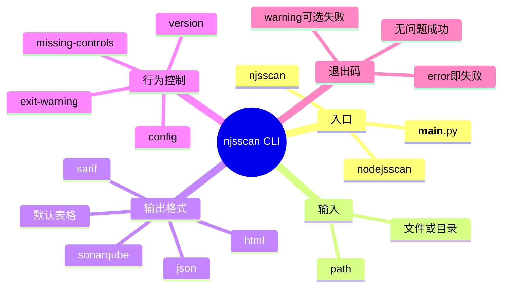

# 记忆卡片摘要（快速复习版）

## 1. 大纲（压缩版）
- 真正的命令行入口在 `njsscan` 仓库，不在 `nodejsscan` Web 仓库。
- `setup.py` 同时导出了两个 console scripts：`njsscan` 和 `nodejsscan`，它们都指向同一个 `main()`。
- CLI 参数不多，但每个参数都直接影响输出格式、退出码、配置来源和“是否把缺失安全控制也视作告警”。
- 默认不加输出格式参数时，会走表格化终端输出；加 `--json` / `--sarif` / `--sonarqube` / `--html` 则走不同 formatter。
- `-w` 非常关键：默认 WARNING 不会让退出码变成非 0；加 `-w` 后 WARNING 也会导致退出失败，适合 CI 门禁升级。

## 2. 思维导图（Mermaid）

## 3. 重要知识点（必须记住）
- `njsscan` 与 `nodejsscan` 这两个命令行名字，在 CLI 层实际上是同一个程序入口。
- `path` 可以是文件也可以是目录，而且可以给多个路径。
- `--json`、`--sarif`、`--sonarqube` 会把输出变成结构化格式，同时内部会关闭进度条以避免污染输出。
- `--missing-controls` 会把“缺失 CSRF、限流、Helmet 头”等控制项以 INFO 告警注入结果里。
- `-w/--exit-warning` 会把 WARNING 也当成失败条件；不加它时，只有 ERROR 会让退出码变成 1。

## 4. 难点 / 易混点
- 容易把 `--html` 理解成“很完整的独立 Web 报告页面”。实际上它只是 formatter 生成的 HTML table 风格字符串，不是整套 Web 平台页面。
- 容易以为 `--missing-controls` 是做动态检测。其实它是通过“好规则是否命中”来推断某些安全控制缺失。
- 容易忽略退出码规则，结果 CI 看着有 WARNING 但流水线没失败，误以为工具失效。

## 5. QA 快速复习卡片
- Q: 我应该用 `njsscan` 还是 `nodejsscan` 命令？
  A: 对 CLI 来说都行，源码里它们指向同一个入口。
- Q: JSON 输出会显示进度条吗？
  A: 不会，结构化输出时内部会关闭进度展示。
- Q: `-w` 是干什么的？
  A: 把 WARNING 也视为失败，让退出码变成非 0。
- Q: `--missing-controls` 适合什么时候开？
  A: 适合做“基线治理”或安全控制巡检，但不一定适合直接当阻断条件。

## 6. 快速复现步骤（最短路径）
1. 看 `njsscan/__main__.py` 的参数定义。
2. 本地运行 `njsscan --help` 验证帮助文本。
3. 分别运行 `--json`、`--sarif`、`--sonarqube`、`-w`、`--missing-controls` 观察输出与退出码差异。
4. 打开 `formatters/` 看每种格式到底生成什么结构。

---

# 学习笔记正文（详细版）

## 0. 学习目标、读者画像与假设
- 技术：`njsscan` CLI
- 学习目标：把参数含义、输出格式、退出码、配置方式讲明白到初学者也能独立上手
- 读者水平：初学
- 时间预算：3 小时
- 版本范围：本地验证版本 `0.4.3`
- 运行环境：Linux 命令行，已补齐 `semgrep` 依赖后完成验证
- 假设与限制：本文优先说明官方代码行为，而不是猜测未来版本可能变化

## 1. 先弄清命令入口
`njsscan` 仓库的 `setup.py` 里定义了两个 console scripts：
- `njsscan = njsscan.__main__:main`
- `nodejsscan = njsscan.__main__:main`

这意味着什么？意味着在命令行层面，`njsscan` 和 `nodejsscan` 是**两个名字，同一个入口**。如果你在文档、脚本或 CI 里看到有人写 `nodejsscan .`，从入口实现上看，它和 `njsscan .` 是同一个程序。

这件事非常容易被误解，因为最外层 GitHub 仓库也叫 `nodejsscan`。于是很多人会以为：
- `nodejsscan` 命令应该对应 Web 平台；
- `njsscan` 命令才对应 CLI。

源码给出的真实答案是：**CLI 层两者等价，Web 平台是另一套 Flask 应用，不是这个 console script。**

## 2. 官方帮助文本到底是什么
我在本地补齐依赖后实际跑出了帮助文本，帮助如下：
- `path`: 要扫描的文件或目录，可多个
- `--json`: 输出 JSON
- `--sarif`: 输出 SARIF 2.1.0
- `--sonarqube`: 输出 SonarQube 兼容 JSON
- `--html`: 输出 HTML 格式
- `-o/--output`: 把结果写到文件
- `-c/--config`: 指定 `.njsscan` 配置文件位置
- `--missing-controls`: 启用缺失安全控制检查
- `-w/--exit-warning`: WARNING 也返回非零退出码
- `-v/--version`: 显示版本

初学者要先记一句：**这个工具的参数数量不多，但每个参数都很实用，没有明显“装饰性参数”。** 这也是它适合上 CI 的原因之一。

## 3. `path`：扫描对象如何理解
### 3.1 `path` 是位置参数，不是必须和某个 flag 配对
在 `argparse` 里，`path` 被定义为 `nargs='*'`。这意味着：
- 你可以不给路径，此时如果你传了 `-v`，它只会显示版本；
- 你也可以给一个或多个路径，路径可以是文件，也可以是目录。

### 3.2 路径既可以是单文件，也可以是整个目录
这很重要。很多人第一次上手会以为 SAST 工具必须对整仓运行。实际上 `njsscan` 可以直接扫单文件，非常适合：
- 规则调试
- 教学演示
- 最小复现
- CI 中对变更文件做快速验证

我本地验证时，对单个 `header_cors_star.js` 文件运行 `--json`，可以直接得到 2 条 WARNING 规则结果；对 `tests/assets/dot_njsscan` 整个目录运行，则会同时扫出 Node.js 规则与模板规则。

### 3.3 路径会经过忽略逻辑筛选
即使你把一个目录丢进去，也不是所有文件都会被扫。`libsast.Scanner` 会先展开目录，再套用：
- 忽略路径
- 忽略文件名
- 忽略扩展名
- 匹配扩展名

所以，CLI 的 `path` 更准确地说是“扫描候选范围”，而不是“保证逐个处理的文件清单”。

## 4. 输出格式参数详解
### 4.1 默认输出：终端表格
如果你不给 `--json`、`--sarif`、`--sonarqube`、`--html`，CLI 会调用 `cli_output(..., 'fancy_grid')`，也就是在终端里打印一张比较适合人眼阅读的表格。

这种格式最适合：
- 本地人工查看
- 培训演示
- 快速 spot check

但它不适合机器消费，所以别拿它喂给 CI 平台或报告聚合器。

### 4.2 `--json`
这是最通用的结构化输出。你几乎可以把它看作“原始扫描结果的标准序列化版本”。它会包含：
- `errors`
- `njsscan_version`
- `nodejs`
- `templates`

每条规则下又会有：
- `files`
- `metadata`

`metadata` 里常见字段包括 `owasp-web`、`cwe`、`description`、`severity`。如果规则有多处命中，`files` 是列表；如果是 missing controls 这类“无具体文件”的结果，则可能只有 `metadata`。

### 4.3 `--sarif`
SARIF 适合接 GitHub Code Scanning 等平台。`sarif.py` 里做了几个值得记住的设计：
- 严重级别映射：`ERROR -> error`，`WARNING -> warning`，`INFO -> note`
- 规则文档链接会指向 `https://ajinabraham.github.io/nodejsscan/#<rule_id>`
- 只会为带 `files` 的发现创建 SARIF result

最后一点尤其重要：**缺失安全控制（missing controls）这种没有具体代码位置的条目，不会被写进 SARIF results。** 我本地验证 `--sarif --missing-controls` 时，最终 SARIF 里只有 3 条带文件位置的结果，没有 `anti_csrf_control` 这样的控制缺失条目。

### 4.4 `--sonarqube`
SonarQube 输出本质上是一个 `issues` 数组。这里也有两个非常实用的细节：
- 严重级别映射为 `CRITICAL / MAJOR / MINOR`
- 缺失控制这种无文件定位的问题会保留 `ruleId`，但 `primaryLocation` 可能是 `None`

我本地验证 `--sonarqube --missing-controls` 时，输出里确实包含 `anti_csrf_control`，但像 `helmet_header_hsts` 这种条目没有代码位置。这是合理的，因为它表达的是“整个项目缺少某控制”，而不是某一行代码有漏洞。

### 4.5 `--html`
很多人一看到这个参数，就默认以为会生成一个华丽 HTML 报告。源码告诉我们，事实没那么复杂。

`--html` 最终也是调用 `cli_output()`，只不过 table format 传的是 `unsafehtml`。也就是说，它更像是**把表格渲染成 HTML 片段或 HTML table 风格字符串**，不是 `nodejsscan` Web 平台那种完整页面、图表、筛选器、数据库历史视图。

所以如果你要的是“把结果嵌到其他页面里”，`--html` 可能有用；如果你要的是“完整报告门户”，那是 `nodejsscan` Web 平台的工作，不是 CLI 参数一键生成。

## 5. `-o/--output`：输出到文件时会发生什么
这个参数的作用非常直白：把结果写入文件，而不是只打印到标准输出。

但你要注意两点：
- 输出内容格式由你同时选择的 formatter 决定；
- 如果你没选结构化格式，只是默认终端表格，那写入文件的就是表格文本，而不是 JSON。

这意味着：
- `njsscan . --json -o result.json` 适合机器消费；
- `njsscan . -o result.txt` 更适合人工留档；
- `njsscan . --sarif -o result.sarif` 适合上传 GitHub Code Scanning；
- `njsscan . --sonarqube -o sonar.json` 适合送给 Sonar 兼容流程。

## 6. `-c/--config`：配置文件如何影响扫描
这个参数允许你显式指定 `.njsscan` 文件位置。如果你不传，程序会默认尝试到第一个扫描路径下去找 `.njsscan`。

这个设计很实用，因为真实工程里经常有两种场景：
- 配置就放仓库根目录，跟源码一起版本化；
- 组织想用一份统一安全基线，在仓库外集中维护配置。

支持显式 `--config` 后，第二种场景就能成立。

配置文件里可以管这些事情：
- 扩展名集合
- 忽略文件名
- 忽略路径
- 忽略扩展名
- 忽略规则
- 严重级别过滤

所以别把 `--config` 理解成“只是小修小补的参数外置化”。它实际上能显著改变扫描面和噪声水平。

## 7. `--missing-controls`：它到底在查什么
这个参数很容易被误解成“自动检查你项目缺了哪些安全控制”。这个理解只对了一半。

更准确地说，`njsscan` 的做法是：先在 `semantic_grep/good/` 目录里定义一些“好控制存在时应命中的规则”，例如：
- anti CSRF
- rate limiting
- Helmet 相关 header

然后在 `missing_controls()` 里做一个反向判断：
- 如果这些“好规则”命中了，说明控制存在，于是把它们从结果中移除；
- 如果这些“好规则”没命中，且你开启了 `--missing-controls`，就从 `missing_controls.yaml` 里补出一条“缺失控制”的 INFO 结果。

这是一种**基于存在性证据的启发式检查**，不是全知全能的安全审计。

优点是简单直接，适合治理基线；缺点是：
- 它依赖规则是否覆盖到了你项目的实际写法；
- 它表达的是“没看见控制存在”，不必然等于“绝对不存在”；
- 它更适合做提醒，不一定适合直接阻断构建。

## 8. `-w/--exit-warning`：CI 里最容易忽略的参数
`handle_exit()` 的逻辑很清楚：
- 任何 `ERROR` 都会导致退出码 1
- `WARNING` 只有在你开启 `-w` 时才会导致退出码 1
- 没有 ERROR，且未要求 warning fail，则退出码 0

我本地做了验证：
- 扫一个只有 `express_cors` / `generic_cors` 两条 WARNING 的样例文件，不加 `-w` 时退出码是 0；
- 同样文件加 `-w` 后，退出码变成 1。

这个细节对 CI 特别重要。因为很多团队想要的是两阶段门禁：
- 阶段 1：ERROR 阻断，WARNING 只提示
- 阶段 2：成熟后 WARNING 也阻断

`-w` 正好就是这个升级开关。

## 9. `-v/--version`
这个参数很简单，但很值得在流水线里记录。它会打印类似：
`njsscan: v0.4.3 | Ajin Abraham | opensecurity.in`

为什么值得记录？因为 SAST 结果是强依赖版本的。今天和下个月多一条少一条规则，不一定是代码变了，也可能是扫描器版本变了。所以把版本记进构建日志，是一种非常朴素但很有价值的可追溯性实践。

## 10. 结构化输出时为什么没有进度条
在 `main()` 里，程序会把 `is_json = args.json or args.sonarqube or args.sarif` 传给 `NJSScan`。而 `NJSScan` 又会把 `show_progress` 设成 `not json`。

这意味着当你选择机器输出格式时，进度条会被自动关闭，避免把终端动画混入 JSON/SARIF 内容。这是一个小设计，但体现了工具作者对自动化场景的理解。

## 11. 运行中的几个实战细节
### 11.1 没配好依赖时，连 `--help` 都可能失败
由于 `__main__.py` 顶层直接导入了 `sarif` formatter，而 `sarif.py` 又依赖 `sarif_om`，所以在依赖没装好的环境里，哪怕你只是执行 `--help`，也可能因为模块导入失败而崩掉。这是一个现实的工程细节，提醒我们：CLI 不只是“语法”，还依赖完整运行时。

### 11.2 `semgrep` 是语义规则的硬依赖
如果 regex 规则能跑、语义规则跑不出来，第一时间要怀疑 `semgrep` 是否安装正确、`semgrep-core` 是否可达、环境变量与 HOME 是否可写。别急着先怪规则本身。

### 11.3 默认命令行输出是“人类友好”，不是“平台友好”
如果你准备把结果交给其他系统，优先用 JSON / SARIF / SonarQube。默认表格输出更适合给人看。

## 12. 推荐的参数组合
- 本地人工看结果：`njsscan .`
- 本地排查或教学：`njsscan --json path/to/file.js`
- GitHub Code Scanning：`njsscan . --sarif -o results.sarif || true`
- SonarQube 兼容流程：`njsscan . --sonarqube -o sonar.json || true`
- 安全基线巡检：`njsscan . --json --missing-controls`
- 严格 CI：`njsscan . --json -w`
- 团队统一配置：`njsscan . --config /path/to/.njsscan --json`

## 13. 延伸学习路径（官方优先）
- 先看 `__main__.py`，把参数定义与退出码看明白。
- 再看 `formatters/`，理解每种输出给谁用。
- 再看 `utils.get_config()`，理解配置如何覆盖默认行为。
- 最后结合 CI 文档，把参数组合成适合团队阶段的策略。

---

# 练习与复习闭环

## 1. 分层练习
### 基础练习
- 说出 5 个最常用参数及作用。
- 解释 `-w` 与默认退出码的区别。
- 解释 `--missing-controls` 的本质。

### 应用练习
- 为 GitHub Code Scanning 写一条命令。
- 为“只想人工看结果”的本地场景写一条命令。
- 为“WARNING 也阻断”的 CI 写一条命令。

### 综合练习
- 设计一份从开发机到 CI 到平台聚合的参数策略表。

## 2. 动手任务（带验收标准）
- 任务：分别跑一次 `--json`、`--sarif`、`--sonarqube`、`-w`。
- 验收标准：你能解释“为什么同一份代码在不同参数下，输出内容和退出码都可能不同”。

## 3. 常见误区纠偏
- 误区：`--html` 会生成完整 Web 报告门户。
  正解：它只是 HTML 风格 formatter，不是 Web 平台页面。
- 误区：WARNING 一定会让 CI 失败。
  正解：只有加 `-w` 才会。
- 误区：`--missing-controls` 看到 INFO 就等于绝对缺失。
  正解：它是基于规则命中情况推断的启发式结果。

## 4. 复习节奏建议
- Day 1：记住参数分组与退出码逻辑。
- Day 3：能口述 4 种输出格式分别给谁用。
- Day 7：把一个项目接入 JSON/SARIF/`-w` 三种模式。
- Day 14：回看 CI 日志，确认自己能看懂输出差异。

## 5. 自测题与参考答案（简版）
- 题目1：为什么只看终端输出不足以做平台集成？
  参考答案：因为终端表格是给人看的，平台集成更需要 JSON/SARIF/SonarQube 这种结构化格式。
- 题目2：为什么 `-w` 很适合做成熟度升级开关？
  参考答案：因为它允许团队先只阻断 ERROR，后续再把 WARNING 纳入阻断，而不需要换工具。

---

# 参考来源与版本说明

## 官方来源（优先）
1. `njsscan` README: https://github.com/ajinabraham/njsscan/blob/master/README.md
2. CLI 入口源码：https://github.com/ajinabraham/njsscan/blob/master/njsscan/__main__.py
3. 输出格式源码：`njsscan/formatters/cli.py`、`json_out.py`、`sarif.py`、`sonarqube.py`
4. 配置处理源码：`njsscan/utils.py`
5. 缺失控制定义：`njsscan/rules/missing_controls.yaml`

## 第三方来源（按采信程度标注）
1. 无额外第三方资料，本文以源码与本地命令验证为主

## 关键结论引用映射
- [来源1] -> 官方帮助参数、使用方式、配置说明
- [来源2] -> 参数定义、出口逻辑、`njsscan`/`nodejsscan` 共用入口
- [来源3] -> JSON / SARIF / SonarQube / CLI / HTML 输出细节
- [来源4] -> `.njsscan` 文件加载与覆盖逻辑
- [来源5] -> 缺失控制项目及其元数据来源

## 官方章节映射与重要例子保留检查
- `README / Command Line Options` -> 本文“官方帮助文本”“参数详解”
- `README / Example Usage` -> 本文“推荐的参数组合”
- `README / Configure njsscan` -> 本文“--config 与配置覆盖”
- `README / Suppress Findings` -> 本文在 CLI 实战说明中保留了忽略与配置思路
- 重要例子保留：单文件扫描、JSON 输出、CI 集成思路、SARIF/ SonarQube 输出路径

## 技术版本与访问日期
- 本地访问日期：2026-03-19
- `njsscan` 版本验证：`0.4.3`
- 本地实测：
  - 仅 WARNING 的样例文件，不加 `-w` 退出码为 0
  - 同样文件加 `-w` 退出码为 1
  - `--sarif --missing-controls` 不包含 file-less controls 结果
  - `--sonarqube --missing-controls` 会保留 controls，但部分 `primaryLocation` 为 `None`

## 冲突点与裁决（如有）
- 冲突点：README 容易让人把 `--html` 理解成完整 HTML 报告。
- 裁决依据：以 `cli.py` 中 `unsafehtml` formatter 的真实实现为准。
- 采用结论：`--html` 是 HTML 风格表格输出，不等于 Web 平台页面。