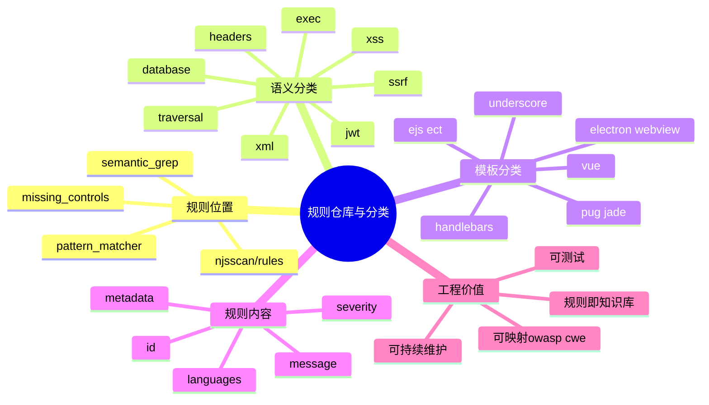

# 记忆卡片摘要（快速复习版）

## 1. 大纲（压缩版）
- `nodejsscan` 生态没有把规则单独拆成一个完全独立的“规则专用仓库”；默认规则主要随 `njsscan` 一起打包发布。
- 规则主要分 3 类：`semantic_grep` 语义规则、`pattern_matcher` 文本/模板规则、`missing_controls.yaml` 缺失安全控制规则。
- 语义规则当前共有 113 条，分类分布在 `xss`、`sql`、`jwt`、`headers`、`ssrf`、`xml`、`traversal`、`crypto`、`eval` 等目录下。
- 模板 regex 规则有 9 条，聚焦 Handlebars、Dust、Pug/Jade、EJS/ECT、Vue、Underscore、Squirrelly、Electron webview 等高风险模式。
- 规则不是只给机器看的。目录命名、本地测试样例、OWASP/CWE 映射、规则 ID 命名，本身就是一套“如何管理安全知识”的工程实践。

## 2. 思维导图（Mermaid）

## 3. 重要知识点（必须记住）
- 真正规则仓库位置在 `njsscan/rules/`，不是 `nodejsscan` Web 仓库的顶层页面逻辑里。
- `semantic_grep` 主要处理 JavaScript 代码语义模式；`pattern_matcher` 主要处理模板与文本危险片段。
- `missing_controls.yaml` 不是“漏洞规则”，而是“项目缺少某类安全控制”的补充元数据来源。
- 规则目录按漏洞主题组织，这比单纯按框架或库名组织更方便安全团队做知识映射。
- 每条规则都尽量带 `metadata`，把 OWASP 和 CWE 绑定上，便于统一汇报与治理。

## 4. 难点 / 易混点
- 容易误以为“规则仓库”一定指一个单独的 GitHub 仓库。这里更准确的说法是：规则作为 `njsscan` 包的一部分被维护。
- 容易把 `good/` 目录当成“安全样板代码”。实际上它主要服务 missing controls 判断。
- 容易以为模板规则价值低。其实大量 XSS 风险恰恰更容易在模板层被快速发现。

## 5. QA 快速复习卡片
- Q: 规则主要在哪？
  A: `njsscan/rules/`。
- Q: 为什么要把规则分成 `semantic_grep` 和 `pattern_matcher`？
  A: 因为两类问题适合不同匹配方式，一个偏语义，一个偏文本。
- Q: `missing_controls.yaml` 算漏洞规则吗？
  A: 更像补充基线治理规则的元数据来源，不是普通的“某段代码命中即漏洞”。

## 6. 快速复现步骤（最短路径）
1. 打开 `njsscan/rules/semantic_grep` 看分类目录。
2. 打开 `pattern_matcher/template_rules.yaml` 看 9 条模板规则。
3. 打开 `missing_controls.yaml` 看缺失控制定义。
4. 再看 `tests/unit/test_nodejs.py` 和 `test_templates.py`，理解规则如何被回归测试保护。

---

# 学习笔记正文（详细版）

## 0. 学习目标、读者画像与假设
- 技术：`njsscan` 规则仓库与规则分类体系
- 学习目标：知道规则放哪、怎么分、为什么这么分、怎么从规则目录快速理解工具能力边界
- 读者水平：初学
- 时间预算：3 小时
- 版本范围：以 2026-03-19 本地检出内容为准
- 运行环境：本地源码与规则目录阅读
- 假设与限制：本文聚焦官方自带规则，不讨论企业私有规则库

## 1. 先回答最直接的问题：规则仓库在哪
很多人问“规则仓库”时，脑子里想的是“有没有一个独立 GitHub repo 专门放规则”。以当前 `nodejsscan` 生态来看，更准确的答案是：**默认规则主要作为 `njsscan` 仓库的一部分维护和分发。**

具体位置是：`njsscan/rules/`。

这套设计有两个直接后果。

第一，用户安装 `njsscan` 时，规则会和工具版本一起被打包，减少“工具版本和规则版本错位”的概率。`MANIFEST.in` 也明确把 `pattern_matcher`、`semantic_grep` 和其他 YAML 规则都包含进发布包里。

第二，规则更新通常跟着 `njsscan` 仓库节奏走，而不是单独升级一个远端规则源。对于稳定性来说这很好；对于想“只升级规则、不动工具”的团队来说，则意味着你要自己做更细的版本管理。

## 2. 为什么规则不放在 `nodejsscan` Web 仓库里
这是理解生态分层的关键。`nodejsscan` Web 仓库主要负责：
- 上传 ZIP / Git 仓库
- 调用扫描
- 存数据库
- 页面展示与 triage

而规则是扫描器本体的一部分，最自然就应该和 `njsscan` CLI 放在一起。这样 CLI、Python API、CI 集成、Web 平台都能复用同一份规则包。

如果规则反过来放在 Web 仓库里，CLI 反而会变成“依赖 Web 仓库才能工作”，这在工程上不划算。现在这种结构更合理：**规则属于扫描器，平台只是扫描器的消费者。**

## 3. 规则大类一：`semantic_grep`
### 3.1 它是什么
`semantic_grep` 目录里放的是基于 Semgrep 语法的 YAML 规则。它们不是简单搜字符串，而是尽量用“代码结构”来表达危险模式。举个直观例子：
- 不是只找 `res.send(` 这几个字符；
- 而是找“在请求处理函数里，把来自 `req.query`、`req.body`、`req.foo` 等不可信输入一路送到 `res.send` / `res.write` / `render` / 危险 API”。

这类规则更接近“我理解你在干什么”，而不是“我看到你写了某个词”。

### 3.2 分类目录长什么样
我统计到的目录分类有：
- `traversal` 4 个文件
- `redirect` 1 个文件
- `headers` 6 个文件
- `good` 3 个文件
- `exec` 2 个文件
- `jwt` 6 个文件
- `memory` 1 个文件
- `database` 7 个文件
- `generic` 4 个文件
- `dos` 4 个文件
- `electronjs` 1 个文件
- `xss` 4 个文件
- `crypto` 3 个文件
- `eval` 9 个文件
- `ssrf` 6 个文件
- `xml` 6 个文件

你会发现它不是按“框架名字”整理，而更像按“漏洞问题域”整理。这种组织方式对安全团队特别友好，因为它天然能映射到漏洞类型和治理专题。

### 3.3 这些目录分别在管什么
- `xss`：响应输出、模板逃逸、序列化注入导致的 XSS
- `database`：SQL 注入、NoSQL 注入、TLS 配置问题
- `exec`：系统命令执行、shelljs 执行
- `eval`：`eval`、`vm`、`vm2`、反序列化、SSTI 等代码执行面
- `jwt`：硬编码 secret、none 算法、未吊销、暴露凭据/数据
- `headers`：Cookie 安全属性、CORS、Host Header、Helmet 等头部问题
- `ssrf`：Node、Puppeteer、Playwright、PhantomJS、wkhtmltopdf 等 SSRF 场景
- `xml`：XXE、XPath 注入、实体膨胀
- `traversal`：路径拼接、本地文件读取、压缩包路径覆盖
- `crypto`：弱算法、ECB、TLS 验证关闭、时序攻击
- `dos`：regex dos、body parser dos、对象层 DoS

这份目录结构本身就很适合作为安全知识地图来学。

## 4. 规则大类二：`pattern_matcher`
### 4.1 它为什么存在
有些风险并不需要 AST 级理解，或者很难稳定地做语义建模，此时 regex/文本规则反而更直接、更稳妥。模板层 XSS 就是典型场景。

### 4.2 当前自带的 9 条模板规则
`template_rules.yaml` 里当前有 9 条规则，分别覆盖：
- `handlebar_mustache_template`
- `dust_template`
- `pug_jade_template`
- `ejs_ect_template`
- `vue_template`
- `underscore_template`
- `squirrelly_template`
- `electronjs_node_integration`
- `electronjs_disable_websecurity`

你能看出一个非常鲜明的倾向：这不是泛模板 lint，而是专门盯着**不转义输出**和**Electron 危险配置**这两类安全热点。

### 4.3 为什么这类规则价值很高
很多人低估 regex 规则，是因为把它理解成“低级字符串搜索”。其实在模板安全里，regex 非常有生产力。原因是模板语法往往高度固定：
- `{{{...}}}`
- `<%- ... %>`
- `!{...}`
- `v-html="..."`

这些写法非常稳定，业务团队也容易理解。你给开发者解释“为什么这条规则报你”时，成本也比解释复杂数据流低得多。

## 5. 规则大类三：`missing_controls.yaml`
### 5.1 它和普通漏洞规则有什么区别
普通漏洞规则的特点是：
- 往往会命中某个文件、某一段代码、某个位置
- 结果里通常有 `files`

`missing_controls.yaml` 不一样。它的条目更像“项目级事实声明”：
- 没有 anti CSRF
- 没有 rate limiting
- 没有某些 Helmet header

它本身不直接扫描代码，而是配合 `good/` 目录中的“正向控制存在规则”使用。只有当那些好控制规则没命中，CLI 又开启了 `--missing-controls`，这些元数据项才会补充进结果。

### 5.2 为什么把控制缺失和漏洞规则放一起
因为在真实安全治理里，“代码里有危险点”和“项目缺少基础安全控制”都属于你要修的问题。只是前者更像漏洞，后者更像基线缺项。把它们放进同一结果集，能让团队从“漏洞视角”逐步走向“安全能力视角”。

## 6. 规则文件通常长什么样
无论是 regex 规则还是 semantic 规则，你都会反复看到这些信息：
- `id`
- `message`
- `severity`
- `metadata`

在 semantic 规则里还会看到：
- `rules:`
- `languages:`
- `pattern`
- `pattern-either`
- `pattern-inside`
- `pattern-not-inside`

在 pattern matcher 规则里会看到：
- `type`
- `pattern`
- `input_case`

这套结构的好处是：**规则不仅告诉机器怎么匹配，也告诉人类这条规则为什么存在、严重度多高、对应什么 OWASP/CWE 语义。**

## 7. 规则 ID、目录名、元数据为什么重要
### 7.1 规则 ID 是自动化系统的主键
规则 ID 决定了：
- 告警如何聚合
- 忽略规则如何生效
- SARIF / SonarQube 如何识别 issue 类型
- 误报抑制如何指向具体规则

所以规则 ID 一定要稳定、可读、可区分。

### 7.2 目录名是团队知识索引
如果你接手一个陌生项目，只看目录名就能大致知道这个扫描器擅长发现什么。这对 onboarding 很重要。相比把所有 YAML 平铺在一个目录里，现在这种分类方式更适合长期维护。

### 7.3 元数据是治理汇报接口
没有 `cwe`、`owasp-web` 这些映射，扫描结果就只能停留在“有个告警”。有了映射后，你就能：
- 按 OWASP Top 10 汇总
- 按 CWE 做漏洞分类
- 做季度安全报告
- 做管理层汇报

这也是为什么规则仓库不仅是技术资产，还是治理资产。

## 8. 测试如何保护规则仓库
规则仓库不是“写完 YAML 就结束”。`njsscan` 里有完整的单元测试保护：
- `tests/unit/test_nodejs.py` 会校验大量规则 ID 是否都能命中预期样例
- `test_templates.py` 会校验模板规则
- `test_dotfile.py` 会校验 `.njsscan` 配置对规则和扩展名的影响

这很关键，因为安全规则最怕两件事：
- 加新规则把老规则打坏
- 升依赖后命中数量悄悄变化但没人知道

通过测试样例把规则行为固定下来，是成熟规则库必须具备的习惯。

## 9. 如何像工程师一样阅读规则仓库
给初学者一个非常实用的路径：
1. 先看目录树，建立全景图。
2. 选一个自己熟悉的漏洞主题，比如 XSS。
3. 先读 `xss_node.yaml` 之类的语义规则。
4. 再读 `template_rules.yaml` 看模板层补充。
5. 再去测试样例里找 `ruleid:` 注释，理解作者希望规则命中什么、不命中什么。

这样读，比一开始就硬啃 100 多条规则高效得多。

## 10. 规则仓库背后的设计哲学
如果把这套规则仓库当作一个“产品知识库”，你会发现它体现了几条很务实的设计哲学：
- 先覆盖高危、常见、可解释的模式
- 优先和 Node.js 实战生态贴近
- 用 OWASP/CWE 元数据保证治理可汇总
- 用测试保证规则不是“一次性脚本”
- 用分类目录保证维护者能持续扩展

这也是为什么它对学习者很有价值：你看到的不只是“若干 YAML”，而是一种安全工程组织知识的方式。

## 11. 延伸学习路径（官方优先）
- 从 `pattern_matcher/template_rules.yaml` 入门，最快获得直观感。
- 再看 `xss`、`database`、`exec` 三个最常见目录。
- 再看 `good/` 和 `missing_controls.yaml`，理解基线治理思想。
- 最后再把测试目录一起读，建立“规则 + 样例 + 验证”的闭环视角。

---

# 练习与复习闭环

## 1. 分层练习
### 基础练习
- 说出 3 类规则目录及职责。
- 说出至少 5 个 `semantic_grep` 分类目录。
- 解释 `good/` 与 `missing_controls.yaml` 的配合关系。

### 应用练习
- 从规则目录中选一个专题，说明它适合治理哪类业务风险。
- 设计一个你团队内部的规则目录分层方案，参考当前仓库做法。

### 综合练习
- 写一段总结，解释为什么“规则仓库其实是安全知识库”。

## 2. 动手任务（带验收标准）
- 任务：统计语义规则目录分类数量，并挑 1 个目录看完。
- 验收标准：你能说出这个目录重点在防什么，以及为什么用语义规则而不是简单 regex。

## 3. 常见误区纠偏
- 误区：规则仓库就是一堆 YAML，不需要工程化。
  正解：规则需要分类、元数据、测试和版本管理。
- 误区：模板规则没啥技术含量。
  正解：模板层风险往往高频且可解释，是极有价值的规则资产。
- 误区：缺失控制不属于规则仓库。
  正解：它属于基线治理规则的一部分，只是表达方式不同。

## 4. 复习节奏建议
- Day 1：记住 3 类规则位置。
- Day 3：说出语义规则分类地图。
- Day 7：选一个目录深入读 3 条规则。
- Day 14：把规则仓库当知识库重新梳理一遍。

## 5. 自测题与参考答案（简版）
- 题目1：为什么规则应该和 `njsscan` 放在一起，而不是 Web 仓库？
  参考答案：因为规则属于扫描器本体能力，CLI、Python API、Web 平台都应复用同一套规则，而不是倒过来依赖平台层。
- 题目2：为什么元数据对规则仓库很重要？
  参考答案：因为它让规则不仅能检测，还能被统一分类、汇报和治理。

---

# 参考来源与版本说明

## 官方来源（优先）
1. `njsscan` 规则目录：https://github.com/ajinabraham/njsscan/tree/master/njsscan/rules
2. `template_rules.yaml`: https://github.com/ajinabraham/njsscan/blob/master/njsscan/rules/pattern_matcher/template_rules.yaml
3. `missing_controls.yaml`: https://github.com/ajinabraham/njsscan/blob/master/njsscan/rules/missing_controls.yaml
4. 测试用例：`tests/unit/test_nodejs.py`、`tests/unit/test_templates.py`、`tests/unit/test_dotfile.py`
5. `MANIFEST.in`: https://github.com/ajinabraham/njsscan/blob/master/MANIFEST.in

## 第三方来源（按采信程度标注）
1. 无额外第三方资料

## 关键结论引用映射
- [来源1] -> 规则目录结构与分类
- [来源2] -> 模板规则具体内容与 9 条规则清单
- [来源3] -> 缺失控制元数据定义
- [来源4] -> 规则回归测试机制
- [来源5] -> 规则被打包进发布物而非散落在仓库外

## 官方章节映射与重要例子保留检查
- `README / Command Line Options` 间接映射到规则如何产出结果
- `README / Configure njsscan` -> 本文规则忽略与配置影响的说明
- `README / Python API` -> 本文解释规则作为扫描器核心资产被 API 复用
- 保留的重要例子：模板 XSS 规则、缺失控制规则、测试断言中的规则 ID 列表

## 技术版本与访问日期
- 本地访问日期：2026-03-19
- `semantic_grep` 规则数：113
- `pattern_matcher` 规则数：9
- 目录分类统计基于本地检出版本完成

## 冲突点与裁决（如有）
- 冲突点：“规则仓库”是否一定意味着独立 GitHub 仓库。
- 裁决依据：以工程现实为准，本文采用“规则主要存放与维护位置”的定义。
- 采用结论：当前 `nodejsscan` 生态的默认规则仓库位置是 `njsscan/rules/`。