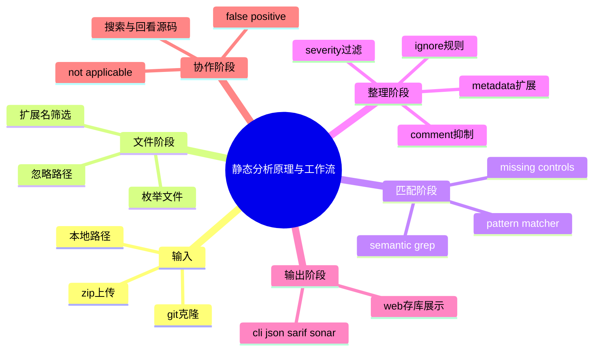

# 记忆卡片摘要（快速复习版）

## 1. 大纲（压缩版）
- `nodejsscan` 的静态分析不是“一个黑盒命令扫完就出结果”，而是一条可拆开的流水线：文件收集 -> 忽略筛选 -> regex 扫描 -> semgrep 语义扫描 -> 元数据扩展 -> 规则/严重级别过滤 -> 输出格式化 -> Web 平台持久化与 triage。
- `libsast.Scanner` 负责枚举文件和调度不同匹配器；`PatternMatcher` 负责文本规则；`SemanticGrep` 负责调用 `semgrep`。
- `njsscan` 在 `NJSScan.format_output()` 里把两类结果整理成 `nodejs` 与 `templates` 两个大结果桶，并补充 missing controls、忽略规则、严重级别过滤。
- `nodejsscan` Web 平台再进一步把结果存数据库、生成文件级哈希、支持误报/不适用标记、支持按文件查看和搜索。
- 初学者要把“扫描原理”和“平台工作流”分开理解：前者解释为什么能找到问题，后者解释为什么适合团队协作。

## 2. 思维导图（Mermaid）

## 3. 重要知识点（必须记住）
- 静态分析的核心不是“运行程序”，而是“读代码与相关文本，按规则寻找危险结构”。
- `nodejsscan` 之所以能同时发现模板问题和源码问题，是因为它并行使用了两种不同风格的规则引擎。
- `semgrep` 负责更接近代码结构的匹配；regex 引擎负责更轻量但广覆盖的文本匹配。
- Web 平台并不重新扫描一遍，而是把 `njsscan` 结果二次包装成可追踪、可 triage 的资产。
- comment 忽略、配置文件忽略、严重级别过滤、missing controls 补充，都是结果后处理，不是底层匹配引擎本身的“发现能力”。

## 4. 难点 / 易混点
- 容易把“发现问题”和“结果整理”混成一步。实际上命中规则只是开始，后面还有很多过滤和包装。
- 容易以为 missing controls 是静态分析引擎直接发现的。实际上它是基于好控制规则没命中后的反向补充。
- 容易把 Web 平台误以为只是 UI。其实它还负责哈希、存库、文件搜索、误报状态管理。

## 5. QA 快速复习卡片
- Q: 静态分析为什么不运行程序也能发现漏洞？
  A: 因为很多危险模式可以从代码结构、配置文本和调用关系中直接判断。
- Q: 为什么还要两种引擎？
  A: 因为有的问题适合语义规则，有的问题用 regex 更直接更稳。
- Q: Web 平台和 CLI 的关系是什么？
  A: CLI 负责扫描，Web 平台负责管理、展示和 triage。

## 6. 快速复现步骤（最短路径）
1. 看 `libsast/scanner.py`，理解文件是怎么被收集和过滤的。
2. 看 `PatternMatcher` 与 `SemanticGrep`，理解两类引擎分工。
3. 看 `njsscan/njsscan.py`，理解结果如何被合并、过滤、补充 missing controls。
4. 看 `nodejsscan/nodejsscan.py`、`web/upload.py`、`web/dashboard.py`，理解平台层怎么使用这些结果。

---

# 学习笔记正文（详细版）

## 0. 学习目标、读者画像与假设
- 技术：`nodejsscan` / `njsscan` / `libsast` 的静态分析原理和端到端工作流
- 学习目标：让初学者能把“代码怎么被扫、结果怎么产生、平台怎么管理”串成一张完整图
- 读者水平：初学
- 时间预算：3 小时以上
- 版本范围：以 2026-03-19 本地检出代码为准
- 运行环境：源码阅读 + 局部 CLI 验证
- 假设与限制：本文讲“静态分析实现原理”，不涉及动态运行时探针、模糊测试或污点引擎的高级学术细节

## 1. 先把“静态分析”讲人话
如果你不是科班，最容易把“静态分析”听成一个很玄的黑科技。其实可以把它理解成：**程序还没跑起来，工具先像一个特别有经验的审阅者一样去读你的代码和模板，看看里面有没有危险写法。**

它之所以可行，是因为很多漏洞模式在“文本和结构”层面就已经暴露了，比如：
- 用户输入直接拼进 SQL
- 用户输入直接进 `res.send`
- 路径用 `req.query` 直接拼接后喂给 `readFile`
- `Access-Control-Allow-Origin` 被设成 `*`
- 模板里使用了不转义输出的语法

这些问题不一定非得把程序跑起来才能看见。很多时候，**读代码就够了**。这就是静态分析的基础逻辑。

## 2. `nodejsscan` 的总体流水线
你可以把整个生态的工作流想成 8 步：
1. 用户提供输入：本地路径、ZIP、Git 仓库
2. 系统收集候选文件
3. 系统按忽略规则和扩展名筛掉不该扫的文件
4. regex 引擎扫描模板与文本危险模式
5. `semgrep` 语义引擎扫描 JavaScript 代码模式
6. `njsscan` 把结果整理、过滤、补充控制缺失
7. CLI 直接输出，或者 Web 平台把结果入库
8. 平台支持搜索、误报标记、不适用标记与历史回看

把这 8 步记住，你以后再看任何函数名都不会慌，因为你知道它大概属于哪一层。

## 3. 第一步：输入从哪里来
### 3.1 CLI 直接给路径
这是最简单的模式。你在命令行里给 `njsscan path/to/project`，扫描器就把这个路径列表传给 `NJSScan`，再传给 `libsast.Scanner`。

### 3.2 Web 上传 ZIP
`web/upload.py` 做的事很直白：
- 检查是不是 ZIP MIME
- 保存到上传目录
- 算文件 SHA256
- 如果之前扫过同一个 ZIP，就直接复用已有结果
- 没扫过就解压到按哈希命名的目录
- 调 `nodejsscan.scan(app_dir)` 开始分析
- 扫完保存数据库结果、发 Slack/Email 通知

### 3.3 Web 提交 Git URL
`web/git_utils.py` 会：
- 做 `ls-remote`，拿远端 HEAD
- 用 HEAD 哈希算一个本地识别值
- 没扫过就 clone 仓库
- 再调用同一个扫描入口

这说明平台层在“输入接入方式”上很灵活，但**真正的扫描入口最后都会汇聚到同一个扫描调用链。**

## 4. 第二步：如何决定哪些文件要扫
这一步主要在 `libsast/scanner.py`。

### 4.1 目录展开
如果传进来的是目录，`Scanner.get_scan_files()` 会递归遍历所有文件。

### 4.2 忽略条件
每个文件会经过 `validate_file()` 判断，主要看：
- 路径里是否包含忽略路径
- 文件名是否匹配忽略文件名模式
- 扩展名是否在忽略扩展名里

只有通过这些过滤后，文件才进入后续引擎。

### 4.3 为什么这一步很重要
初学者最容易忽略的一个事实是：**静态分析结果的质量，很大程度上取决于你让它扫了什么。**

如果你把 `node_modules`、压缩包、构建产物、第三方库全丢进去，结果就会变成噪声海洋。作者默认帮你避开了很多坑，这其实是工具实用性的重要来源。

## 5. 第三步：为什么要分两类引擎
### 5.1 Pattern Matcher
`PatternMatcher` 来自 `libsast/core_matcher/pattern_matcher.py`。它的做法大致是：
- 先加载 YAML 规则
- 过滤出符合扩展名与大小限制的文件
- 读取文件内容
- 适当去掉注释
- 用不同匹配策略跑 regex
- 把命中的文件、位置、行号、字符串片段组装成结果

它适合：
- 模板层 XSS
- Electron webview 配置
- 某些高置信度文本片段
- 一些不值得做复杂语义建模的问题

### 5.2 Semantic Grep
`SemanticGrep` 来自 `libsast/core_sgrep/semantic_sgrep.py`。它会：
- 先按 `sgrep_extensions` 过滤文件
- 然后调用 `invoke_semgrep()` 启动 `semgrep`
- 要求 `semgrep` 返回 JSON
- 把 JSON 里的 `results` 和 `errors` 整理成 `matches` / `errors`

它适合：
- 请求输入到危险 sink 的传播型模式
- 要结合函数结构、调用片段、局部变量、上下文的规则
- 需要 `pattern-inside`、`pattern-either` 等代码结构表达能力的规则

### 5.3 为什么不统一成一个引擎
因为现实里没有哪一种匹配方式对所有问题都最优。
- 全靠 regex，会误报多、难表达上下文。
- 全靠语义规则，会更复杂、规则编写成本更高、某些模板场景没必要。

把两种引擎并用，是一种非常务实的工程折中。

## 6. 第四步：regex 引擎具体怎么工作
### 6.1 规则如何加载
`PatternMatcher` 会通过 `get_rules()` 读 YAML 规则，支持文件、目录，甚至 URL。规则必须至少包含：
- `type`
- `pattern`

### 6.2 匹配策略有哪些
底层 `matchers.py` 定义了：
- `Regex`
- `RegexAnd`
- `RegexOr`
- `RegexAndNot`
- `RegexAndOr`

这很好理解：有的规则只要命中一个片段，有的要同时命中多个片段，有的要求“命中 A 且不能命中 B”。

### 6.3 为什么还会去注释
`PatternMatcher._format_content()` 里会对内容做 `strip_comments()`。这说明作者不希望你在注释里随便写了个危险 API 名称，就被当成真实漏洞。这个细节很朴素，但能显著减少噪声。

## 7. 第五步：语义引擎具体怎么工作
### 7.1 如何调用 `semgrep`
`invoke_semgrep()` 最终执行的是：
- `semgrep --metrics=off --no-rewrite-rule-ids --json -q --config <rules> <paths>`

这里几个参数都很有含义：
- `--json` 方便程序消费
- `-q` 减少噪声
- `--no-rewrite-rule-ids` 保留原始规则 ID，不让平台映射错乱
- `--config` 指向规则目录

### 7.2 输出如何变成 `njsscan` 可用结果
`SemanticGrep.format_output()` 会把 semgrep 的每条 result 转成：
- `file_path`
- `match_position`
- `match_lines`
- `match_string`
- `metadata`

然后再按 `rule_id` 聚合。这一步很重要，因为后面的 JSON、SARIF、Web 平台都依赖这种统一结构。

### 7.3 元变量为什么会被删掉
在 `njsscan/njsscan.py` 的 `format_sgrep()` 里，作者把每条 finding 的 `metavars` 删掉了。原因很现实：
- 元变量对规则开发者有用
- 对普通用户和平台展示来说，噪声太大

这是一种典型的“内部调试信息”和“最终用户结果”分离。

## 8. 第六步：`njsscan` 如何做结果后处理
`NJSScan.format_output()` 做了好几件事：
- 格式化 semgrep 结果
- 格式化 pattern matcher 结果
- 按忽略规则删除结果
- 按严重级别过滤结果
- 按代码注释抑制结果
- 在需要时补充 missing controls

这意味着命中规则并不是最终结果。最后用户看到的，是经过多轮整理后的“成品”。

### 8.1 严重级别过滤
如果 `.njsscan` 配置只允许 `WARNING` 和 `ERROR`，那么 `INFO` 会被删掉。这能显著降低噪声。

### 8.2 规则级忽略
你可以在配置里写 `ignore-rules`，直接把某些规则结果整体去掉。

### 8.3 注释级忽略
对于源码文件，可以在触发行附近写：
`// njsscan-ignore: rule_id1, rule_id2`

这样即使底层规则命中，最终结果也会被抑制。这对误报治理非常有用。

## 9. 第七步：为什么 Web 平台还要再加工一次
CLI 到这里其实已经能工作了。但平台协作还需要更多能力，`nodejsscan/nodejsscan.py` 和 Web 层就负责这部分。

### 9.1 为每个发现生成哈希 ID
`add_ids()` 会给每个结果生成稳定哈希：
- 文件级发现按 `file + rule` 生成 ID
- 没有具体文件的控制缺失按规则内容生成 ID

这样平台就能对单条发现做误报标记和状态跟踪。

### 9.2 保存可浏览的文件列表
`scan()` 最终还会把项目里所有被认为“可查看”的文件路径收集出来，便于 Web 页面里做文件查看与搜索。

### 9.3 进数据库
`web/db_operations.py` 会把：
- `nodejs` 结果
- `templates` 结果
- `files` 列表
- `false_positive`
- `not_applicable`
- 时间戳

一起保存进数据库。这样结果不再只是“命令行一闪而过”，而是变成可沉淀的资产。

## 10. 第八步：误报、非适用、搜索与回看
### 10.1 Triage 的必要性
真实团队使用静态分析时，最重要的不是“永远零误报”，而是“误报能不能被低成本管理”。平台层通过：
- `false_positive`
- `not_applicable`

给每个发现建立状态，避免同一告警反复折磨团队。

### 10.2 文件搜索和安全查看
`search_file()` 允许你在项目文件里搜索关键词；`view_file()` 则会在路径安全检查后返回文件内容。它甚至专门做了 `is_safe_path()` 检测，避免查看文件接口自己变成路径穿越漏洞。

这一点非常值得学习：**安全工具本身也要防自己的安全问题。**

## 11. 用一个具体例子把整条链串起来
假设你上传一个 ZIP。

1. 平台保存 ZIP 并算哈希。
2. 如果哈希没扫过，就解压到对应目录。
3. 平台调用 `nodejsscan.scan()`。
4. `nodejsscan.scan()` 调 `call_njsscan()`。
5. `call_njsscan()` 创建 `NJSScan([node_source], json=True, check_controls=...)`。
6. `NJSScan` 调 `libsast.Scanner`。
7. `Scanner` 找出有效文件。
8. `PatternMatcher` 扫模板与文本。
9. `SemanticGrep` 调 semgrep 扫 JavaScript 语义规则。
10. `NJSScan` 做 missing controls、忽略、严重级别过滤。
11. 平台为结果加哈希、收集文件列表。
12. 结果入库。
13. 页面展示，并允许 triage。

你看，整件事并不神秘。它只是被清晰地拆成了一串小步骤。

## 12. 这套工作流的优点与局限
### 12.1 优点
- 结构清楚，便于扩展
- CLI 与 Web 平台职责分离
- 两类引擎互补
- 规则、元数据、测试、输出格式形成闭环
- 易于集成 CI 和平台管理

### 12.2 局限
- 语义规则依赖 semgrep 运行环境
- 不是全语言统一深度支持
- 数据流理解主要靠规则表达，不是重型跨文件全程序分析
- missing controls 属于启发式基线检查，不是绝对证明

这些局限不是缺陷，而是工具定位带来的边界。知道边界，才能用得对。

## 13. 延伸学习路径（官方优先）
- 先读 `libsast/scanner.py`，搞懂文件流。
- 再读 `PatternMatcher` 和 `SemanticGrep`，搞懂匹配流。
- 再读 `njsscan/njsscan.py`，搞懂结果流。
- 最后读 `nodejsscan` Web 代码，搞懂平台流。

---

# 练习与复习闭环

## 1. 分层练习
### 基础练习
- 说出端到端工作流的 8 个步骤。
- 解释 regex 引擎与语义引擎的区别。
- 解释 Web 平台为什么要为发现生成哈希 ID。

### 应用练习
- 画出从 ZIP 上传到数据库保存的链路图。
- 说明在哪一步最适合加新规则，在哪一步最适合做误报治理。

### 综合练习
- 向非技术同事解释“为什么平台显示的结果不等于引擎原始输出”。

## 2. 动手任务（带验收标准）
- 任务：按源码追一次 `njsscan . --json` 的调用链。
- 验收标准：你能从命令行入口一路说到格式化输出，而不是只停留在“它会调用 semgrep”。

## 3. 常见误区纠偏
- 误区：工具发现告警就是一次性完成。
  正解：发现、聚合、过滤、抑制、格式化、存库是多阶段流程。
- 误区：平台层只是 UI 壳子。
  正解：平台还负责 ID、存库、状态、搜索、回看等协作能力。
- 误区：missing controls 是引擎直接扫出来的漏洞。
  正解：它是基于正向控制规则未命中的结果补充。

## 4. 复习节奏建议
- Day 1：记住 8 步工作流。
- Day 3：能画出 CLI 与 Web 分层图。
- Day 7：复述每一步对应的源码模块。
- Day 14：尝试自己给流程补一条新后处理规则。

## 5. 自测题与参考答案（简版）
- 题目1：为什么说 `nodejsscan` 的静态分析是“流水线”而不是“单点魔法”？
  参考答案：因为它包含输入接入、文件筛选、两类引擎匹配、结果后处理、输出格式化和平台管理多个独立步骤。
- 题目2：为什么 comment ignore 属于后处理？
  参考答案：因为底层规则先命中，后面才根据注释决定是否在最终结果里保留。