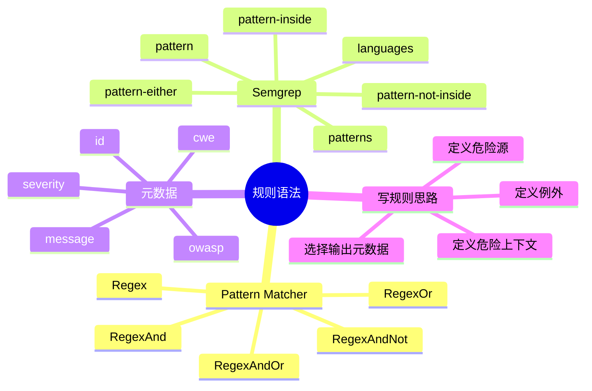

# 记忆卡片摘要（快速复习版）

## 1. 大纲（压缩版）
- `nodejsscan` 生态常用规则语法分两大类：`libsast` 的 Pattern Matcher YAML 语法，以及 `Semgrep` 的 rule syntax。
- Pattern Matcher 适合写模板 / 文本 / 配置类规则，核心字段是 `id`、`message`、`input_case`、`pattern`、`severity`、`type`、`metadata`。
- Pattern Matcher 支持 `Regex`、`RegexAnd`、`RegexOr`、`RegexAndNot`、`RegexAndOr`。
- Semgrep 规则核心在 `rules:`、`id`、`patterns`、`pattern`、`pattern-either`、`pattern-inside`、`pattern-not-inside`、`languages`、`severity`、`metadata`。
- 学规则语法最好的方式不是死记字段，而是把“我想抓什么危险结构”翻译成“必须出现什么、可以二选一出现什么、必须不出现在什么上下文里”。

## 2. 思维导图（Mermaid）

## 3. 重要知识点（必须记住）
- 好规则不是“写得复杂”，而是“表达的风险边界清楚”。
- Pattern Matcher 更像文本模式语言；Semgrep 更像代码结构模式语言。
- `pattern-inside` 常用来限定上下文，`pattern-either` 常用来表示多个危险变体，`pattern-not-inside` 常用来排除缓解场景。
- `metadata` 不是装饰，它决定规则结果如何被汇报和理解。
- 自定义规则前，先拿官方现成样例改，比从空白 YAML 开始快得多。

## 4. 难点 / 易混点
- 容易把“匹配到关键词”误当成“表达了风险条件”。
- 容易只会写正样例，不会写排除条件，导致误报多。
- 容易忘了给规则加 `metadata`，结果后面不好做治理汇总。

## 5. QA 快速复习卡片
- Q: 什么场景优先用 Pattern Matcher？
  A: 模板语法、配置片段、文本模式稳定但没必要做 AST 语义时。
- Q: 什么场景优先用 Semgrep？
  A: 需要限定函数上下文、变量传递、危险 API 组合时。
- Q: `pattern-inside` 是干嘛的？
  A: 用来限定“只有在某种代码上下文里才算命中”。

## 6. 快速复现步骤（最短路径）
1. 打开 `template_rules.yaml` 看 Pattern Matcher 真实样例。
2. 打开 `xss_node.yaml` 看 Semgrep 真实样例。
3. 打开 `libsast` README 中的 Pattern Matcher 示例与 Semgrep 示例。
4. 再对照 Semgrep 官方 `rule-syntax` 文档，把样例字段和官方术语一一对应起来。

---

# 学习笔记正文（详细版）

## 0. 学习目标、读者画像与假设
- 技术：`nodejsscan` 生态常用规则语法
- 学习目标：让初学者能看懂官方规则，敢于改规则，知道从哪里下手写自定义规则
- 读者水平：初学
- 时间预算：3 小时以上
- 版本范围：以本地检出规则与官方 Semgrep 文档为准
- 运行环境：本地源码阅读 + 规则样例学习
- 假设与限制：本文强调“常用语法”，不追求覆盖 Semgrep 所有高级特性

## 1. 先建立一个正确心智模型
很多人第一次看规则，会有两个极端：
- 要么觉得 YAML 很简单，随便写几个关键词就行；
- 要么觉得 YAML 很可怕，看见一堆 `pattern-inside` 就头大。

其实正确心智模型是：**规则语法只是你表达安全判断的语言。**

你真正要先想清楚的是：
1. 我要抓什么危险行为？
2. 这种危险行为必须出现在什么上下文里？
3. 有哪些看起来像但其实不算危险的例外？
4. 报出来时我要告诉使用者什么？

一旦这 4 件事想清楚，再回头选 Pattern Matcher 还是 Semgrep，语法反而没那么难。

## 2. Pattern Matcher 规则语法：适合“看文本就够”的问题
### 2.1 基本结构
`libsast` README 给出的典型结构是：
- `id`
- `message`
- `input_case`
- `pattern`
- `severity`
- `type`
- `metadata`（可选但强烈建议）

在 `njsscan` 的模板规则里，你会看到几乎同样的结构。例如 `handlebar_mustache_template`：
- `id`: 规则唯一标识
- `message`: 告诉用户为什么危险
- `type`: `Regex`
- `pattern`: `{{{...}}}` 等不转义输出模式
- `severity`: `ERROR`
- `metadata`: `cwe`、`owasp-web`

### 2.2 `input_case` 是什么
它控制匹配前是否把文本转成 `exact`、`lower`、`upper`。这看似小，但很实用。比如有些规则你不想区分大小写，就可以统一转成小写再匹配。这样比把正则写得特别复杂更容易维护。

### 2.3 `pattern` 到底长什么样
在 `Regex` 类型下，`pattern` 就是一条正则表达式。

例如：
- Handlebars 的 `{{{...}}}`
- Pug/Jade 的 `!{...}`
- Vue 的 `v-html="..."`

这些都属于“危险语法片段非常稳定”的情况，用 regex 很合适。

## 3. Pattern Matcher 的 5 种常用类型
### 3.1 `Regex`
最简单，命中一个 regex 就算告警。适合单一危险片段，比如 `v-html`。

### 3.2 `RegexAnd`
要求多个 regex 都存在，适合“必须同时出现两个条件”才危险的场景。比如文件里既要出现某危险 API，又要出现某上下文标志。

### 3.3 `RegexOr`
多个 regex 任意一个命中即可。适合同一类风险的不同写法变体。

### 3.4 `RegexAndNot`
要求命中 A，同时不能命中 B。非常适合“危险写法存在，且没有看到缓解措施”的规则。

### 3.5 `RegexAndOr`
要求先满足一个 and 条件，再满足一组选项中的一个。它适合稍复杂但仍然主要靠文本判断的场景。

对初学者来说，最重要的不是死背名字，而是会把现实安全判断翻译成逻辑：
- 必须同时满足 -> `And`
- 满足一个即可 -> `Or`
- 有危险但没缓解 -> `AndNot`

## 4. 为什么模板规则适合用 Pattern Matcher
模板规则是理解 Pattern Matcher 的最好入口。因为模板语法的危险边界通常很清楚：
- 三花括号是“不转义输出”
- `!{}` 是“不转义输出”
- `<%-` 是“不转义输出”
- `v-html=` 是“把字符串当 HTML 注入”

这些场景没必要上复杂语义建模。你只要稳定识别这些语法，就能抓住很多高价值 XSS 风险。初学者写自定义规则时，最建议先从这种“风险形态高度稳定”的问题练手。

## 5. Semgrep 规则语法：适合“要看代码结构”的问题
### 5.1 基本结构
Semgrep 官方文档里，最基础的顶层结构是：
- `rules:`
- 每条规则下有 `id`
- `message`
- `severity`
- `languages`
- 以及一个或多个匹配操作符，如 `pattern`、`patterns`、`pattern-either` 等

在 `njsscan` 规则里，你会频繁看到这样的组合：
- 先用 `pattern-inside` 约束必须发生在某种函数上下文里
- 再用 `pattern-either` 罗列多种危险 sink 写法
- 有时再用 `pattern-not-inside` 排除缓解场景

### 5.2 `pattern`
最基本的代码结构匹配。你可以理解成“找长得像这段代码的结构”。它比纯字符串强，因为它是代码感知的，不只是文本感知。

### 5.3 `patterns`
表示多个条件要同时成立。官方文档明确说，`patterns` 是做交集：正向条件都满足，再扣掉负向条件。很多高质量安全规则都离不开它。

### 5.4 `pattern-either`
表示多个变体任意一个成立即可。比如同样是 XSS，可能既有 `res.send(...)`，也有 `res.write(...)`，都应该算同类风险。

### 5.5 `pattern-inside`
这是最值得初学者优先学会的一个。它不是找最终危险点，而是限定“只有在某种上下文里我们才讨论这个危险点”。

例如：
- 在 Express 路由处理函数里
- 在 `require('serialize-javascript')` 已存在的上下文里
- 在变量已从 `req.query` 取值的函数范围里

它能有效减少误报，因为不是所有长得像危险语句的代码都真在危险上下文里。

### 5.6 `pattern-not-inside`
这是排除条件，用来表达“如果已经在某种缓解上下文里，就不报”。这对控制误报特别关键。初学者最容易忽略这个维度，导致规则一上来就报一大片。

## 6. 用官方规则读懂“危险源、上下文、危险 sink”
以 `xss_node.yaml` 的 `express_xss` 为例，它大概在表达这么一件事：
1. 代码处于请求处理函数内部；
2. 用户输入来自 `req.query` 或其属性；
3. 这个输入可能直接或经过局部变量、中间对象、数组、字符串拼接，最终进入 `res.send` 或 `res.write`；
4. 满足这些条件时，报告“反射型 XSS 风险”。

你看，规则语法其实就是把人类安全判断拆成几块：
- 在哪儿
- 来自哪儿
- 流到哪儿
- 什么时候算风险

一旦你学会从这 4 块去看 YAML，规则就不再像天书。

## 7. 用 `xss_serialize_js.yaml` 理解“例外排除”
这条规则有几个很适合教学的点：
- 先要求 `require('serialize-javascript')` 存在
- 再要求不可信输入流入 `serialize-javascript`
- 还用 `pattern-not-inside` 排除 `escape(...)`、`encodeURI(...)` 之类的缓解包裹场景

这告诉我们：**高质量规则不仅会写“命中的条件”，还会写“不要误报的条件”。**

## 8. 元数据怎么写才像工程资产
无论哪种规则，`metadata` 都应该被认真对待。至少建议包含：
- `cwe`
- `owasp-web` 或你团队自己的分类
- 任何有助于说明规则上下文的信息

这样做的好处是：
- 扫描结果更可解释
- 平台更容易汇总
- 安全团队更容易按主题治理
- 告警更容易被业务方接受

如果你只写一个 `message`，规则能跑，但很难规模化治理。

## 9. 初学者自定义规则的正确起手式
### 9.1 不要从空白 YAML 开始
最快的方法是：
- 找一个最接近你需求的官方规则
- 复制出来改 ID
- 先改 message 和 metadata
- 再微调 pattern
- 最后加测试样例

### 9.2 先写高价值、低歧义规则
比如：
- 内部模板引擎的“不转义输出”语法
- 内部包装过的危险重定向函数
- 某个组织明确禁止的配置开关

不要一开始就试图写“全公司任意数据流污点分析规则”，那太容易挫败。

### 9.3 一定要配样例与回归测试
规则不是写出来能跑就结束。最基本的工程闭环是：
- 写正样例
- 写负样例
- 确认命中数量
- 固化到测试里

`njsscan` 自带测试目录已经给了你很好的模板。

## 10. 写规则时最常见的 6 个错误
1. 只写正样例，不写负样例，误报爆炸。
2. 把“某个关键词出现”误当成风险本身，缺少上下文限制。
3. 规则 ID 随便起名，后续难维护。
4. 不写元数据，结果平台上只有一堆裸告警。
5. 想一次覆盖所有变体，规则复杂到自己都不敢改。
6. 不做版本验证，升级 `semgrep` 后结果变化却毫无感知。

## 11. 如何把“安全判断”翻译成规则语言
给你一个通用翻译模板：
- 如果我要找“某个危险 API 被调用” -> 从 `pattern` 或 `Regex` 开始
- 如果我要找“输入来自哪里” -> 加 `pattern-inside` 或多步 `patterns`
- 如果我要覆盖多种 API 写法 -> 加 `pattern-either` 或 `RegexOr`
- 如果我要排除安全包裹场景 -> 加 `pattern-not-inside` 或 `RegexAndNot`
- 如果我要让报告能汇总 -> 补 `metadata`

这套模板足够覆盖很多 80 分规则。

## 12. 延伸学习路径（官方优先）
- 先看 `template_rules.yaml`，练 Pattern Matcher。
- 再看 `xss_node.yaml`、`sql_injection.yaml`，练 Semgrep 结构思维。
- 再看 Semgrep 官方 `rule-syntax` 文档，把字段与官方定义对齐。
- 最后给自己业务写 1 条小规则，走完“规则 + 样例 + 验证”闭环。

---

# 练习与复习闭环

## 1. 分层练习
### 基础练习
- 说出 Pattern Matcher 的 5 种类型。
- 解释 `pattern-inside`、`pattern-either`、`pattern-not-inside` 的作用。
- 说出为什么 `metadata` 很重要。

### 应用练习
- 为一个模板不转义输出场景设计 Pattern Matcher 规则。
- 为一个内部重定向 helper 设计 Semgrep 规则草稿。

### 综合练习
- 选一条官方规则，用自己的话解释它的安全判断逻辑，而不是逐字翻译 YAML 字段名。

## 2. 动手任务（带验收标准）
- 任务：仿照官方规则写 1 条最小自定义规则。
- 验收标准：规则包含 ID、描述、严重度、元数据，并且至少有 1 个正样例和 1 个负样例。

## 3. 常见误区纠偏
- 误区：规则越长越高级。
  正解：规则边界清楚、误报可控才高级。
- 误区：只要命中危险 API 就算好规则。
  正解：上下文和例外同样重要。
- 误区：元数据可有可无。
  正解：没有元数据，结果很难治理和汇报。

## 4. 复习节奏建议
- Day 1：记住两类规则语言的分工。
- Day 3：能读懂 1 条模板规则和 1 条语义规则。
- Day 7：自己改 1 条官方规则。
- Day 14：给团队总结一份规则编写清单。

## 5. 自测题与参考答案（简版）
- 题目1：为什么初学者写规则时最好从官方规则改起？
  参考答案：因为官方规则已经帮你踩过很多上下文、误报和元数据设计的坑，复用它能大幅降低起步难度。
- 题目2：为什么 `pattern-not-inside` 对高质量规则很重要？
  参考答案：因为它能表达“有缓解措施时不要报”，直接影响误报率。