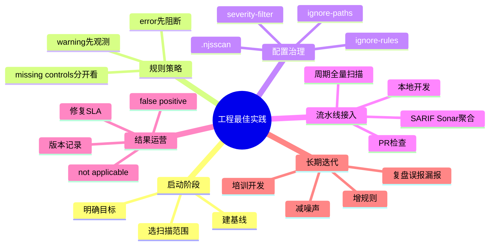

# 记忆卡片摘要（快速复习版）

## 1. 大纲（压缩版）
- 在真实项目里，`nodejsscan`/`njsscan` 最佳实践不是“扫一下就完”，而是把扫描器放进一个持续闭环：范围收敛、规则分层、基线建立、CI 门禁、误报治理、结果复盘、规则迭代。
- 最重要的不是把所有规则都打开，而是先让结果可用、可解释、可落地修复。
- 一开始通常建议：默认只阻断 ERROR，WARNING 先观测；等团队适应后，再考虑 `-w`。
- 对大仓或老仓，先做基线与抑制策略，再推进严格门禁，否则会直接淹没团队。
- `nodejsscan` Web 平台适合做结果留存和 triage；CLI 更适合上自动化与本地开发流程。

## 2. 思维导图（Mermaid）

## 3. 重要知识点（必须记住）
- 最佳实践首先是“让团队愿意持续使用”，而不是“第一次就扫得最严”。
- `.njsscan` 配置和误报治理机制，是工程落地的必要条件，不是可有可无的附属品。
- 缺失控制检查更适合做治理看板，不一定适合直接阻断 PR。
- `SARIF` 和 `SonarQube` 输出适合平台聚合；默认 CLI 表格适合本地理解。
- 定期回顾扫描器版本、规则版本和噪声变化，是避免安全工具逐渐失信的关键。

## 4. 难点 / 易混点
- 容易把“安全效果最大化”和“组织阻力最小化”对立起来。其实好的落地要兼顾两者。
- 容易一上来就全量阻断，结果开发团队直接绕过工具。
- 容易把忽略规则当成偷懒。实际上，经过审计的忽略是维持工具可信度的一部分。

## 5. QA 快速复习卡片
- Q: 新团队第一次接 `njsscan`，该不该立刻 `-w`？
  A: 通常不建议，先让 WARNING 可见，再逐步升级门禁更稳妥。
- Q: 老项目问题太多怎么办？
  A: 先建基线和分阶段清债，不要直接把历史包袱变成每次 PR 都失败。
- Q: missing controls 适合放在哪里看？
  A: 更适合治理报表、周期扫描或平台看板，而不是所有 PR 的硬门禁。

## 6. 快速复现步骤（最短路径）
1. 先对一个真实仓库跑 `njsscan --json` 建初始基线。
2. 把明显第三方路径和无意义规则先写进 `.njsscan`。
3. CI 第 1 阶段只阻断 ERROR；第 2 阶段再考虑 `-w`。
4. 定期产出 SARIF / SonarQube 报告，把结果送到统一平台里做趋势管理。

---

# 学习笔记正文（详细版）

## 0. 学习目标、读者画像与假设
- 技术：真实工程里如何落地 `nodejsscan` / `njsscan`
- 学习目标：不是只会“跑命令”，而是知道怎样让工具长期有效、少被团队反感、能逐步变成工程习惯
- 读者水平：初学到进阶过渡
- 时间预算：3 小时以上
- 版本范围：以当前官方仓库行为和本地验证结果为准
- 运行环境：本地 + CI/CD + 可选 Web 平台
- 假设与限制：最佳实践会随团队规模、代码债务和组织文化不同而调整，本文给的是高适用性默认路线

## 1. 最重要的第一原则：先追求“可持续”，再追求“最严格”
很多团队推安全扫描失败，不是因为工具能力不够，而是因为上来就太激进：
- 一次性全仓扫描
- 把所有 WARNING 都阻断
- 不区分第三方代码和业务代码
- 不给误报治理机制
- 不给开发者解释与修复路径

结果就是：
- PR 每次都红
- 开发者只想关掉工具
- 安全团队自己也被噪声淹没

所以第一原则是：**让工具先变成团队愿意长期使用的东西。** 你只有做到这一点，后面才谈得上逐步变严。

## 2. 真实项目上线的推荐路线
### 2.1 阶段一：建立可见性，不急着全面阻断
建议先做这些事：
- 跑一次全量 `--json` 扫描，了解噪声和热点
- 建 `.njsscan`，收敛第三方目录和明显无意义规则
- 在 CI 里只对 ERROR 阻断，WARNING 先观察
- 把结果发到平台或产出文件留档

这一步的目标不是“问题清零”，而是搞清楚：
- 这工具对你们代码库到底报什么
- 哪些是真问题，哪些是噪声
- 哪些目录压根不该扫

### 2.2 阶段二：建立基线
老项目往往已经有一堆历史问题。如果你不做基线，开发者每次改 2 行代码都要背整个项目的历史债，工具很快就会被讨厌。

更好的做法是：
- 先保存一次初始扫描结果当“历史基线”
- 新 PR 重点看新增问题
- 历史问题按专题逐步还债

`nodejsscan` Web 平台在这一步很有帮助，因为它天生支持历史留存和 triage。

### 2.3 阶段三：逐步提升门禁强度
等团队对结果有基本信任后，再考虑：
- 开启 `-w`
- 把某些 WARNING 提升成必须处理
- 把 missing controls 纳入周期治理指标
- 把高价值自定义规则加入默认规则集

这种方式比“一步到位全阻断”稳得多。

## 3. 范围控制：什么该扫，什么不该扫
### 3.1 先扫业务核心代码
最优先应该覆盖的是：
- API 路由
- 认证鉴权
- 文件上传下载
- 模板渲染
- 管理后台
- 对外网络请求
- 数据库访问

这些地方的安全问题既高风险，又最可能被 `njsscan` 命中。

### 3.2 别让第三方依赖淹没你
默认忽略 `node_modules`、压缩包、常见前端库文件名是很合理的。真实工程里，你通常还应该进一步：
- 忽略自动生成代码目录
- 忽略前端编译产物目录
- 忽略测试 fixture
- 忽略 vendor 或 snapshot 目录

工具能扫并不代表你应该扫。扫描范围过宽，结果质量就会显著下降。

## 4. 配置治理：`.njsscan` 不是可选项
### 4.1 为什么几乎所有真实项目都需要 `.njsscan`
默认配置是“作者的最佳猜测”，不是“你项目的真相”。真实项目总会有：
- 特殊模板后缀
- 自定义脚本后缀
- 不该扫描的目录
- 当前阶段不想启用的规则
- 只想保留 ERROR / WARNING 的策略

这时 `.njsscan` 就是你把工具从“别人写的通用工具”变成“适合自己项目的工作配置”的关键。

### 4.2 忽略规则不是羞耻，而是治理动作
有些团队一看到 `ignore-rules` 就觉得这像“作弊”。其实不是。真正成熟的做法是：
- 明确记录为什么忽略
- 优先忽略稳定误报，而不是随手忽略所有烦人的规则
- 定期回看忽略列表，避免历史包袱永久化

经过审计的忽略策略，反而能提升团队对工具的信任。

## 5. 结果分层：ERROR、WARNING、INFO 应该怎么用
### 5.1 ERROR：适合直接阻断
像命令执行、路径穿越、明显 XSS、JWT 硬编码 secret 这类问题，通常适合直接阻断或至少强提醒。

### 5.2 WARNING：适合先观察，再分阶段收紧
比如 CORS 过宽、某些弱配置、部分时序攻击与弱密码学模式，很多时候需要结合上下文判断。默认先观察，待团队熟悉后再决定是否 `-w`，会更稳。

### 5.3 INFO：更适合治理看板
missing controls 就很典型。它们很重要，但并不总适合作为每个 PR 的硬阻断条件。更好的方式通常是：
- 周期全量扫描
- 治理看板跟踪
- 专题整改

## 6. PR 检查、周期全量扫描、平台聚合要分工
### 6.1 PR 检查
目标是“快”和“能阻止新增高风险问题”。建议：
- 结构化输出
- ERROR 阻断
- WARNING 先观察
- 优先关注新增问题

### 6.2 周期全量扫描
目标是“发现存量债务”和“监控安全控制覆盖率”。建议：
- 开 `--missing-controls`
- 产出 JSON / SARIF / SonarQube 报告
- 放到安全周报或月报里

### 6.3 平台聚合
目标是“长期趋势”和“团队协作”。这时可以考虑：
- `nodejsscan` Web 平台
- GitHub Code Scanning
- SonarQube
- 内部安全数据仓或报表系统

不要让一个命令承担所有场景的目标。场景分工明确，工具才更好用。

## 7. 如何处理误报和“不适用”
### 7.1 误报一定会存在
静态分析没有误报，几乎是不现实的。关键不是追求零误报，而是让误报有正规出口。

### 7.2 区分 false positive 和 not applicable
`nodejsscan` Web 平台支持：
- `false_positive`
- `not_applicable`

这两个状态别混用。
- `false_positive` 更像“工具判断错了”
- `not_applicable` 更像“从规则角度看像风险，但在我们业务语境里不成立”

这个区分长期来看很有价值，因为它能帮助你判断：到底是该调规则，还是该记录业务例外。

### 7.3 误报要能复盘
如果一个规则经常被标成误报，那它就需要被：
- 调整配置
- 增加排除条件
- 降低严重度
- 或在你们场景下干脆移除

否则团队会慢慢失去对工具的信任。

## 8. 如何把扫描结果转化为修复行动
扫描器的价值不在“报了多少条”，而在“推动修了多少风险”。建议把结果至少按下面几个维度管理：
- 漏洞主题：XSS、注入、路径、命令执行、认证配置等
- 严重度：ERROR / WARNING / INFO
- 责任归属：哪个服务、哪个团队、哪个模块
- 处理状态：待确认、误报、计划修复、已修复
- SLA：多长时间内应该关闭

没有这些治理视角，扫描结果很容易变成“安全团队自己看的列表”。

## 9. 为什么要记录版本和规则变化
今天扫 10 条，明天扫 15 条，不一定代表代码更差了，也可能是：
- `njsscan` 版本升级了
- `semgrep` 版本升级了
- 新规则加入了
- 配置变了

所以建议至少记录：
- `njsscan` 版本
- 规则版本来源
- CI 命令行参数
- `.njsscan` 配置变更

这能显著减少“结果为什么变了”的扯皮成本。

## 10. 如何做团队教育，避免工具被当成“安全部门玩具”
最好的教育方式不是念 PPT，而是把工具结果翻译成开发语言：
- 这条规则报的是哪种实际攻击面
- 为什么它会误报或不会误报
- 这个修复建议如何落到代码
- 为什么这个规则在你们业务里优先级高

如果开发者只看到“又红了一个 CI”，很快就会抵触；如果他知道“这是因为用户输入直接进了 `readFile`”，理解成本就低很多。

## 11. 一个适合大多数团队的落地模板
你可以直接拿下面这个模板起步：

### 本地开发
- 开发者用 `njsscan path/to/file.js --json` 做局部验证

### PR 阶段
- 跑 `njsscan . --json`
- ERROR 阻断
- WARNING 先注释或平台展示，不阻断

### 每日或每周定时任务
- 跑 `njsscan . --json --missing-controls`
- 输出 SARIF / SonarQube 到统一平台
- 安全团队看趋势与专题热点

### 平台协作
- 对需要持续 triage 的项目，用 `nodejsscan` Web 平台保留结果、标记误报和不适用项

## 12. 延伸学习路径（官方优先）
- 先把 CLI 用顺，别急着上平台。
- 再把 `.njsscan` 配好，让结果变得可用。
- 再接入 CI，先做 ERROR 阻断。
- 最后引入平台或聚合系统，做长期运营和规则迭代。

---

# 练习与复习闭环

## 1. 分层练习
### 基础练习
- 说出 3 个为什么不要“一上来全阻断”的理由。
- 说出 PR 检查和周期全量扫描的不同目标。
- 解释为什么 `.njsscan` 是工程落地必需品。

### 应用练习
- 为一个老项目制定 30 天导入计划。
- 为一个新项目制定“ERROR 阻断、WARNING 观察”的 CI 策略。

### 综合练习
- 设计一份团队内部静态扫描治理流程：输入、输出、责任人、SLA、误报复盘机制。

## 2. 动手任务（带验收标准）
- 任务：给一个真实仓库写出一份 `.njsscan` 初稿和 3 条落地策略。
- 验收标准：你能解释每条忽略、每个严重度策略背后的工程原因，而不是“感觉这样方便”。

## 3. 常见误区纠偏
- 误区：安全扫描越严越好。
  正解：团队能持续执行、结果能被消化更重要。
- 误区：误报说明工具没用。
  正解：关键是是否有规范的误报治理与规则迭代机制。
- 误区：missing controls 应该阻断所有 PR。
  正解：更常见的做法是把它作为治理指标或周期检查项。

## 4. 复习节奏建议
- Day 1：记住导入三阶段。
- Day 3：能写出基本 CI 策略。
- Day 7：能解释 false positive 与 not applicable 的区别。
- Day 14：复盘一次扫描结果，提出降噪与升级建议。

## 5. 自测题与参考答案（简版）
- 题目1：为什么老项目要先建基线而不是直接全阻断？
  参考答案：因为否则每次改动都会背负全部历史债务，工具很容易被团队绕过或弃用。
- 题目2：为什么说忽略规则也是治理的一部分？
  参考答案：因为经过审计的忽略能减少噪声、提升信任，让团队把注意力集中在真正值得处理的问题上。