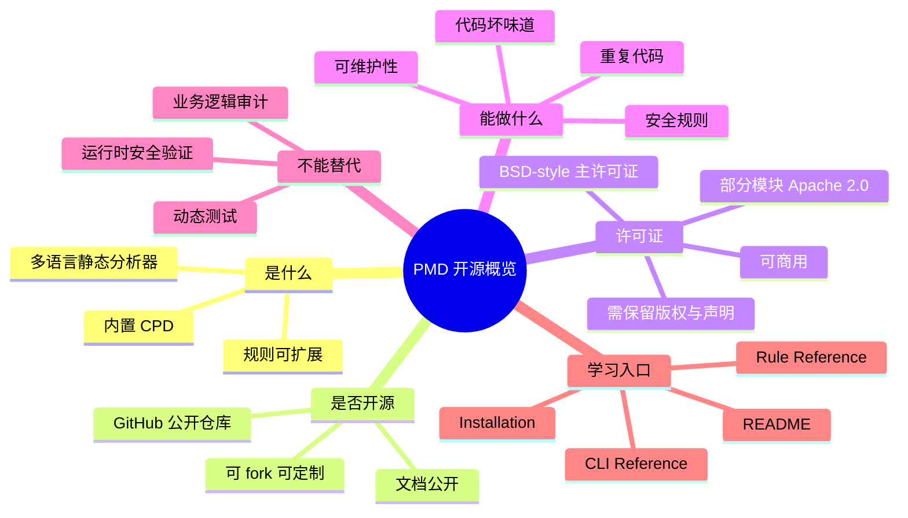

# PMD 是否开源、项目定位与生态全解

## 记忆卡片摘要（快速复习版）

### 1. 大纲（压缩版）

- PMD 是什么
- 它是不是开源
- 它的许可证到底怎么理解
- 官方仓库和官方文档分别看什么
- PMD 和 CPD 的关系
- PMD 适合解决什么问题，不适合解决什么问题
- 一个普通工程团队怎么把 PMD 用起来

### 2. 思维导图（Mermaid）

### 3. 重要知识点（必须记住）

- PMD 是开源项目，官方 GitHub 仓库公开可见，官方 README 直接把它定义为“可扩展的多语言静态代码分析器”。[来源1]
- PMD 主体采用 BSD-style license，且部分代码尤其是 `net.sourceforge.pmd.lang.vm` 大多采用 Apache License 2.0。[来源2][来源3]
- “开源”不等于“随便用”。你可以商用、修改、分发，但分发时要保留许可证文本和相关声明。[来源2][来源3]
- PMD 本体主要做静态规则检查；CPD 是它内置的复制粘贴检测器，负责发现重复代码，两者相关但不是一回事。[来源1][来源4]
- PMD 的核心资产不只是二进制工具，还有规则体系、规则定制能力、AST/符号表/类型解析能力和官方文档生态。[来源1][来源4][来源5]

### 4. 难点 / 易混点

- “PMD 支持某语言”有时指能做完整规则分析，有时只指能做 CPD 重复检测，不能混为一谈。[来源1][来源6]
- “BSD-style license”不是“完全没有义务”，而是义务比较轻，重点是保留版权、免责声明和归属说明。[来源2]
- PMD 能查安全问题，但它不是 SAST 大一统平台，也不是 IAST、DAST 或 RASP。

### 5. QA 快速复习卡片

- Q: PMD 是闭源商业工具吗？
  A: 不是。它是公开托管在 GitHub 上的开源项目，文档和源码都可访问。[来源1]
- Q: PMD 能不能商用？
  A: 可以，但分发时要遵守许可证要求，保留版权与许可说明。[来源2][来源3]
- Q: PMD 和 CPD 是不是同一个东西？
  A: CPD 是 PMD 发行包里一起提供的重复代码检测工具，目标与 PMD 规则分析不同。[来源1][来源4]
- Q: PMD 最强的点是什么？
  A: 可扩展、多语言、规则丰富、可写 XPath/Java 自定义规则，适合纳入工程流水线。[来源1][来源4][来源5]

### 6. 快速复现步骤（最短路径）

1. 打开 PMD 官方 README，先确认项目定位与能力边界。[来源1]
2. 打开 License 页面，确认主许可证与例外模块。[来源2]
3. 打开 Installation、CLI Reference 和 How PMD Works 三页，建立“安装 -> 使用 -> 原理”的主线。[来源4][来源5][来源7]
4. 再进入各语言规则页和 Ruleset 文档，开始定制自己的扫描策略。[来源8][来源9]

---

## 学习笔记正文（详细版）

## 0. 学习目标、读者画像与假设

- 技术：PMD
- 学习目标：从官方资料出发，搞清 PMD 的开源属性、许可方式、项目能力边界、生态组成和工程使用价值
- 读者水平：初学到中级，默认非科班也能读懂
- 时间预算：长文深入版
- 版本范围：以 PMD latest 文档对应的 `7.22.0` 为主，访问日期 `2026-03-19`
- 运行环境：当前环境未安装 PMD 二进制分发包，因此本文中的命令不宣称“已本地运行”
- 假设与限制：主要依据官方文档与官方 GitHub 仓库，不依赖社区二手解读

## 1. 背景与用途（从读者视角）

如果你刚接触静态分析，可以把 PMD 先理解成“代码审查机器人”。它不会真的运行你的程序，而是先把源码读进来，变成结构化语法树，再按规则检查有没有可疑写法、坏味道、可维护性问题、性能问题、部分安全问题，以及明显不规范的代码。[来源1][来源5]

为什么很多团队会用它？因为人工 code review 有三个天然限制。第一，人会疲劳，机械性问题容易漏。第二，人更关注业务逻辑时，格式、惯用法、空 catch、未使用变量这类基础问题往往被忽略。第三，人工 review 很难每天、每次提交都稳定执行。PMD 这种工具的价值就在于：它把“重复、机械、可规则化”的审查动作自动化，让人把时间放在真正复杂的设计和业务判断上。

从官方 README 看，PMD 的定位非常清楚：它是一个“extensible multilanguage static code analyzer”，也就是“可扩展的多语言静态代码分析器”；除了内置四百多条规则，还能让你写自定义规则。[来源1] 这句话里有四个关键词必须记住：

- 可扩展：不是只能吃官方规则，你可以自己写。
- 多语言：不是只看 Java。
- 静态：不运行程序，只分析源代码或结构化表示。
- 规则驱动：它不是大模型审计器，也不是模糊匹配器，而是基于一组明确定义的规则工作。

## 2. PMD 到底是不是开源

是，而且不只是“源码放出来”这么简单。

最直观的证据有三层。

第一层，官方 GitHub 仓库 `pmd/pmd` 是公开仓库，README、Issues、Pull Requests、Discussions、Releases 都面向公众开放。[来源1]

第二层，官方文档网站 `docs.pmd-code.org` 公开提供用户文档、开发文档、规则参考、许可证、发布说明等内容，而且每页都带有 “Edit on GitHub” 入口，说明文档本身也是和源码仓库协同维护的。[来源2][来源4][来源5]

第三层，README 明确写出“Pull requests are welcome”，还给出贡献入口和开发文档。这意味着 PMD 不是“只能看不能碰”的源码展示，而是真正接受社区贡献的开源项目。[来源1]

对非科班读者来说，可以这样理解“开源”：

- 你能看它怎么实现。
- 你能下载、使用、修改。
- 你能 fork 一份自己维护。
- 你能给它提 issue 或者提交 PR。
- 你不需要先向官方购买授权才能开始使用。

但也要注意，开源不等于零规则。真正决定你能怎么用的，是许可证。

## 3. 许可证怎么理解

PMD 官方 License 页面明确写到：该产品采用 “BSD-style” license；同时产品的一部分，主要是 `net.sourceforge.pmd.lang.vm` 包，采用 Apache License 2.0。[来源2] 仓库根目录 `LICENSE` 文件也给出了相同信息。[来源3]

对普通工程团队来说，这意味着什么？

### 3.1 主体是宽松许可证

BSD-style 属于宽松型开源许可证。宽松的意思不是“毫无限制”，而是相对 GPL 这类强 copyleft 来说，你在闭源商用、内部定制、二次分发方面压力更小。通常只要保留版权声明、许可证文本和免责声明，就可以比较顺畅地用于企业环境。[来源2][来源3]

### 3.2 需要保留声明

License 文本要求在源码或二进制再分发时保留版权与许可说明。这件事最容易在两类场景被忽略：

- 你把 PMD 集成进自己的开发工具链并向客户分发
- 你把修改后的 PMD 或带自定义插件的打包结果再次发布

如果只是团队内部下载官方二进制包运行，合规压力通常不高；但只要涉及“分发”，就应把许可证审查纳入发布流程。

### 3.3 部分模块另有 Apache 2.0

官方说明中提到“mostly the package net.sourceforge.pmd.lang.vm”采用 Apache 2.0。[来源2] 这说明 PMD 并不是全仓一张许可证覆盖到底。对绝大部分普通使用者，这并不构成实际障碍；但如果你在做许可证审计、法律合规、开源清单（SBOM）整理，就要把“主许可证 + 局部例外”一起记录。

### 3.4 能不能商用

从许可证性质和官方公开分发方式看，PMD 可以商用。你可以在企业项目、CI 流水线、质量平台、IDE 插件链路中使用它，也可以围绕它做内部平台封装。但如果你把它与自己的产品打包分发，要把许可证文本、归属与免责声明处理好。[来源2][来源3]

## 4. PMD 项目到底由什么组成

很多人第一次接触 PMD，只把它看成一条命令：`pmd check`。这是远远不够的。

从官方 README、Installation、CLI Reference 和开发文档综合看，PMD 至少由六层组成。[来源1][来源4][来源5]

### 4.1 命令行工具层

你真正运行的是分发包里的 `bin/pmd` 或 Windows 下的 `pmd.bat`。官方安装文档说明，PMD 提供多个命令行实用工具，不只有 `check`，还有 `cpd`、`designer`、`ast-dump` 等。[来源4]

### 4.2 规则层

规则是 PMD 的核心。官方内置大量规则，按语言和类别组织。README 写的是 “400+ built-in rules”。[来源1] 这意味着 PMD 的价值不只来自“能扫”，还来自“扫什么”和“怎么扫”。

### 4.3 语言前端层

README 说明 PMD 使用 JavaCC 和 ANTLR 把源码解析成 AST。[来源1] 这表示它不是简单正则查找，而是先理解代码结构，再做结构化分析。

### 4.4 语义分析层

How PMD Works 文档说明，分析过程中会构建符号表（scope / declaration / usage），按需执行数据流分析 DFA 和类型解析 Type Resolution。[来源5] 这一步让 PMD 能做比“文本匹配”更靠谱的检查。

### 4.5 输出与集成层

CLI Reference 说明 PMD 支持多种报告格式，可以把结果输出到标准输出或文件，也能通过属性定制渲染器。[来源7] 这就是它能嵌进 CI、IDE、平台报表的原因。

### 4.6 扩展层

官方扩展文档明确说明，规则可以用 Java 写，也可以用 XPath 写，还能借助 Rule Designer 和 AST dump 辅助开发。[来源9][来源10][来源11][来源12]

## 5. PMD 和 CPD 是什么关系

这个点初学者最容易混。

PMD 是静态规则分析器，核心问题是“这段代码有没有违反某条规则”。CPD 是复制粘贴检测器，核心问题是“这段代码是不是和别处高度重复”。README 明确写道：PMD 发行包“Additionally, it includes CPD, the copy-paste-detector”。[来源1] 安装文档也区分了 `pmd check` 和 `pmd cpd` 两套命令入口。[来源4]

你可以把它们理解为一套工具箱里的两把不同扳手：

- PMD：抓空 catch、未使用变量、硬编码密钥、不安全写法、设计问题
- CPD：抓复制粘贴的大段相似代码

为什么要一起学？因为工程里它们往往一起落地。团队通常既想防止代码质量持续恶化，也想减少复制粘贴带来的维护成本。

## 6. PMD 适合解决什么，不适合解决什么

### 6.1 适合

- 统一基础代码质量基线
- 在提交前或 CI 中自动发现常见问题
- 约束代码风格和基础设计习惯
- 对部分安全规则做早期筛查
- 通过自定义规则固化团队规范

### 6.2 不适合

- 证明程序“绝对安全”
- 发现所有业务逻辑漏洞
- 代替单元测试、集成测试、动态测试
- 代替人工架构审查
- 单独承担完整 AppSec 流水线

这并不是 PMD 的缺点，而是任何规则型静态分析器都存在的边界。你应该把 PMD 放在“前置门禁”和“日常质量守门员”的位置，而不是把它神化成万能安全平台。

## 7. 官方资料应该怎么读

非科班读者常见问题不是“资料太少”，而是“资料太多，不知道顺序”。建议按这条顺序读：

### 7.1 先看 README

README 解决“这项目是什么、支持什么、怎么安装、去哪求助”的问题。[来源1]

### 7.2 再看 Installation and basic CLI usage

这页解决“我怎么把它跑起来、基本命令长什么样”的问题。[来源4]

### 7.3 再看 CLI Reference

这页解决“参数到底是什么意思、退出码怎么理解、怎么调性能”的问题。[来源7]

### 7.4 然后看 Rule Reference 和 Making rulesets

这两页解决“到底扫什么、怎么挑规则、怎么配置规则”的问题。[来源8][来源9]

### 7.5 最后看 How PMD Works 与 Extending 文档

这组资料解决“它为什么能这样工作、我怎样写自己的规则”的问题。[来源5][来源10][来源11][来源12]

## 8. 一个普通团队如何判断要不要采用 PMD

判断标准不要太玄，直接看下面五件事：

### 8.1 代码库是不是长期维护

短命脚本项目未必值得投入复杂规则体系。长期维护项目、多人协作项目很适合。

### 8.2 语言是不是 PMD 的强项

PMD 的主战场长期仍是 Java 和 Apex，这在 README 里说得很明确。[来源1] 其他语言支持要具体看规则覆盖度，不能只看“有这个语言页面”。

### 8.3 团队能不能接受渐进落地

官方 Best Practices 明确提醒，不要一上来跑全部规则，否则会得到巨大且多数无关的报告；应该从最有价值的一小部分开始，逐步扩展。[来源13]

### 8.4 团队有没有能力维护 ruleset

不用维护规则集，就不算真正把 PMD 用起来。官方也明确建议从一开始就创建自己的 ruleset，而不是长期依赖笼统的默认集合。[来源4][来源9]

### 8.5 团队有没有自动化入口

如果不能进 CI、不能进 IDE、不能在 pre-commit 或 nightly 中运行，工具价值会大幅下降。PMD 适合与这些入口结合，而不是当成偶尔手工跑一次的孤立脚本。

## 9. 必须记住的工程判断

如果你只记住一句话，那就是：

PMD 是一个开源、可扩展、适合工程化落地的静态分析基础设施，但它真正的价值不在“安装成功”，而在“规则治理成功”。

换句话说：

- 会下载，不代表会用
- 会跑命令，不代表会落地
- 会看报告，不代表能持续改进
- 真正成熟的使用方式，是把它变成团队约定、CI 门禁和代码审查习惯的一部分

## 10. 延伸学习路径（官方优先）

- 先读：README、Installation、CLI Reference。[来源1][来源4][来源7]
- 再读：Making rulesets、Best Practices。[来源9][来源13]
- 进阶：How PMD Works、Your first rule、Writing XPath rules、Writing a custom rule、AST dump。[来源5][来源10][来源11][来源12]

---

## 练习与复习闭环

## 1. 分层练习

### 基础练习

- 用自己的话解释“PMD 是静态分析器”和“CPD 是重复检测器”的区别。
- 说出 PMD 开源的三个直接证据。
- 说出 PMD 主许可证和局部例外模块各是什么。

### 应用练习

- 站在企业研发经理视角，写一段 200 字建议：为什么应该把 PMD 纳入 CI。
- 站在法务合规视角，写一段 200 字提醒：商用 PMD 时最需要注意什么。

### 综合练习

- 给一个 20 人 Java 团队设计 PMD 引入方案，包含试点范围、规则分层、CI 阈值和治理节奏。

## 2. 动手任务（带验收标准）

- 任务：浏览 PMD 官方文档首页，画出“项目定位 -> 安装 -> CLI -> 规则 -> 扩展”的五步学习路径。
- 验收标准：每一步都能对应到一个官方页面，并写出该页面解决的问题。

## 3. 常见误区纠偏

- 误区：开源工具就不适合企业。
  正解：很多企业级基础设施就是开源的，关键在于许可证、治理成本和适配度。
- 误区：装上 PMD 就等于代码质量治理完成。
  正解：真正难的是规则选择、例外处理和持续落地。
- 误区：PMD 能查所有漏洞。
  正解：它只能覆盖规则可表达的那部分问题，不能代替完整安全体系。

## 4. 复习节奏建议

- Day 1：只记项目定位、开源状态、许可证、PMD 与 CPD 的区别。
- Day 3：回顾官方资料入口顺序。
- Day 7：尝试向别人讲清 PMD 的价值与边界。
- Day 14：结合自己的项目，判断是否值得引入，以及从哪类规则开始。

## 5. 自测题与参考答案（简版）

- 题目1：PMD 为什么说自己是“extensible”？
  参考答案：因为它支持自定义规则，可用 Java 或 XPath 扩展。[来源1][来源10][来源11]
- 题目2：为什么说 PMD 和 CPD 不能混用概念？
  参考答案：前者做规则分析，后者做重复代码检测，目标不同。[来源1][来源4]
- 题目3：PMD 开源但仍要注意什么？
  参考答案：注意许可证、分发义务、局部模块例外、企业合规归档。[来源2][来源3]

---

## 参考来源与版本说明

## 官方来源（优先）

1. PMD GitHub README: https://github.com/pmd/pmd
2. PMD License 页面: https://docs.pmd-code.org/latest/license.html
3. PMD 仓库 LICENSE: https://github.com/pmd/pmd/blob/main/LICENSE
4. Installation and basic CLI usage: https://docs.pmd-code.org/latest/pmd_userdocs_installation.html
5. How PMD Works: https://docs.pmd-code.org/latest/pmd_devdocs_how_pmd_works.html
6. Language configuration / overview 导航入口: https://docs.pmd-code.org/latest/
7. PMD CLI reference: https://docs.pmd-code.org/latest/pmd_userdocs_cli_reference.html
8. Rule Reference 导航入口: https://docs.pmd-code.org/latest/
9. Making rulesets: https://docs.pmd-code.org/latest/pmd_userdocs_making_rulesets.html
10. Writing a custom rule: https://docs.pmd-code.org/latest/pmd_userdocs_extending_writing_java_rules.html
11. Writing XPath rules: https://docs.pmd-code.org/latest/pmd_userdocs_extending_writing_xpath_rules.html
12. Creating XML dump of the AST: https://docs.pmd-code.org/latest/pmd_userdocs_extending_ast_dump.html
13. Best Practices: https://docs.pmd-code.org/latest/pmd_userdocs_best_practices.html

## 第三方来源（按采信程度标注）

- 无。本文刻意只采用官方文档与官方仓库。

## 关键结论引用映射

- [来源1] -> PMD 的项目定位、语言与规则数量、CPD 的存在、贡献与支持入口
- [来源2] -> 官方站点许可证说明、BSD-style 与 Apache 2.0 局部例外
- [来源3] -> 仓库根目录许可证文本
- [来源4] -> 安装方式、命令入口、PMD/CPD 区分
- [来源5] -> 分析处理流程、AST、符号表、DFA、类型解析
- [来源7] -> CLI 作为工程化接口的重要性
- [来源9] -> 自定义 ruleset 的必要性
- [来源10][来源11][来源12] -> 可扩展性来自 Java/XPath 规则与 AST 工具链
- [来源13] -> 渐进采用而不是一次性启用所有规则

## 官方文档章节映射与重要例子保留检查

- README -> 本文第 1、2、4、5 节
- License -> 本文第 3 节
- Installation -> 本文第 4、5、7 节
- How PMD Works -> 本文第 4 节
- Best Practices -> 本文第 8、9 节
- 重要例子保留说明：本主题以概念解释为主，没有复刻长命令示例，而是保留了其用途与入口说明

## 冲突点与裁决（如有）

- 冲突点：README 中“mainly concerned with Java and Apex, but supports 16 other languages”的表述，容易与规则参考页的语言数量理解冲突。
- 裁决依据：本文采用“README 用于项目定位，具体支持矩阵以后续语言和规则参考页为准”的原则。
- 采用结论：PMD 是多语言项目，但不同语言的支持深度不一致，必须分开看“完整规则分析支持”和“CPD 支持”。
