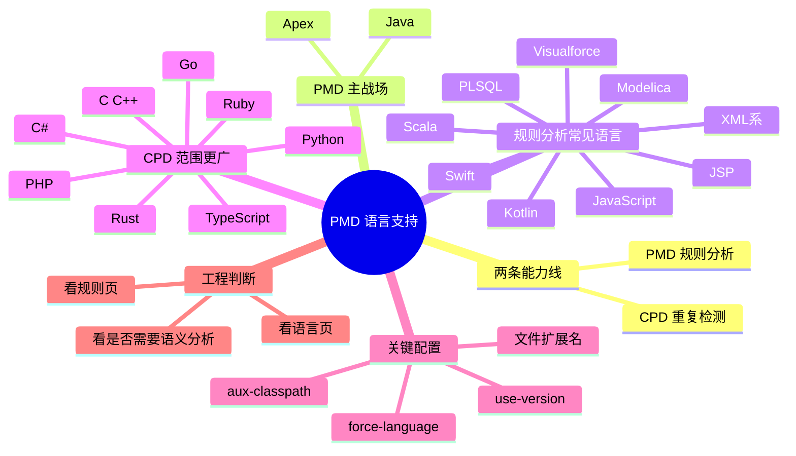

# PMD 支持语言全景图：哪些能做规则分析，哪些只能做重复检测

## 记忆卡片摘要（快速复习版）

### 1. 大纲（压缩版）

- “支持语言”为什么最容易看混
- PMD 规则分析语言和 CPD 语言不是一回事
- Java / Apex 为什么是主战场
- 各语言支持深度怎么判断
- 语言版本、文件后缀、强制语言参数怎么配合
- 企业落地时怎么选语言范围

### 2. 思维导图（Mermaid）

### 3. 重要知识点（必须记住）

- PMD 的“语言支持”至少要分成两类看：`PMD` 规则分析支持，和 `CPD` 重复检测支持。[来源1][来源2][来源3]
- 官方 README 明确说 PMD 主要关注 Java 和 Apex，但支持多语言；这句话的意思更接近“生态成熟度”而不是“只有这两门能用”。[来源4]
- CLI Reference 说明语言通常由文件扩展名自动识别，也可以用 `--force-language` 强制指定，用 `--use-version` 指定语言版本。[来源3]
- Language configuration 说明自 PMD 7 起，语言属性可以通过环境变量或程序化方式设置，公共属性包括 `suppressMarker` 和 `version`。[来源5]
- 选择某语言是否值得启用 PMD，不应只看“官网有这个语言页面”，而要看：有无规则参考页、规则数量、是否有类型解析/语义能力、与你的项目风险是否匹配。

### 4. 难点 / 易混点

- “有语言页面”不一定等于“有很多规则”。
- “CPD 支持”不等于“PMD 规则支持”。
- “支持某版本”不等于“默认就按该版本解析”，版本可能需要显式配置。

### 5. QA 快速复习卡片

- Q: PMD 支持 Python 吗？
  A: 若说 CPD，支持；若说完整 PMD 规则分析，要看官方规则与语言页面的实际深度，不能直接从 README 的 CPD 列表推断。[来源4]
- Q: 文件扩展名不标准怎么办？
  A: 用 `--force-language` 强制按某语言解析。[来源3]
- Q: 一个仓库里混多种语言怎么办？
  A: PMD 会先根据 ruleset 和文件扩展名识别语言，也可为不同语言重复指定 `--use-version`。[来源3][来源6]

### 6. 快速复现步骤（最短路径）

1. 先看 README，建立“PMD vs CPD”双能力线。[来源4]
2. 再看 latest 文档左侧导航里的 Rule Reference 与 Language-Specific Documentation。[来源1]
3. 最后看 CLI Reference 和 Language configuration，搞清语言识别、版本和属性配置。[来源3][来源5]

---

## 学习笔记正文（详细版）

## 0. 学习目标、读者画像与假设

- 技术：PMD 语言支持矩阵
- 学习目标：读懂 PMD 到底支持哪些语言、支持到什么程度、怎么配置，以及工程上如何正确选型
- 读者水平：初学
- 版本范围：PMD latest，对应 7.22.0 文档体系
- 假设与限制：当前基于官方文档导航、CLI 参考、README 与规则页摘要整理；不依赖第三方博客表格

## 1. 先把最容易混的概念拆开

很多人第一次查 PMD，会在三个地方看到三套看起来不一样的语言列表：

- README 里写一套
- 文档导航里语言页面又是一套
- CPD 文档和 CLI 里还能看到更长的一套

这不是官方自相矛盾，而是因为它们讨论的不是同一层能力。

最简单的理解方式是：

- `PMD`：规则分析器，关注 AST、语义、规则执行。
- `CPD`：重复代码检测器，关注 token 序列相似性。

因此，某语言可能：

- 同时支持 PMD 和 CPD
- 只支持 CPD
- 有语言文档页，但规则较少
- 有解析支持，但没有丰富的官方规则库

这就是为什么“支持语言”不能只答一个长名单，必须解释支持深度。

## 2. PMD 官方把语言能力分成什么层次

从 latest 文档导航和语言总览入口可以看出，PMD 官方至少把语言分成两条主线：

- `PmdCapableLanguages`
- `CpdCapableLanguages`[来源2]

虽然语言总览页本身很短，但它已经清楚表明：官方自己都在把“可做 PMD 分析的语言”和“可做 CPD 检测的语言”分开。[来源2]

再结合 CLI Reference，可以看到 PMD 规则分析当前常见语言包含：

- apex
- ecmascript（JavaScript）
- html
- java
- jsp
- kotlin
- modelica
- plsql
- pom
- scala
- swift
- velocity
- visualforce
- xml
- xsl

而 `ast-dump` 帮助页还显示了 `vf`、`vm`、`wsdl` 等语言标识，说明 XML 系和模板系语言在 PMD 内部也有更细的方言入口。[来源3][来源6]

## 3. README 里的语言表述应该怎么读

官方 README 的表述很关键。它说 PMD “mainly concerned with Java and Apex”，但也支持其他语言；随后列出了 Java、JavaScript、Apex、Visualforce、Kotlin、Swift、Modelica、PL/SQL、Velocity、JSP、WSDL、Maven POM、HTML、XML、XSL，并说明 Scala 受支持但目前没有 Scala 规则。[来源4]

这段话透露出三个重要信号：

### 3.1 Java 和 Apex 是成熟主战场

“mainly concerned with Java and Apex” 不是随便说说。它意味着：

- 官方长期投入更多
- 规则更完整
- 语义能力通常更成熟
- 社区使用面更广

如果你是第一次在企业里引入 PMD，而主语言是 Java 或 Apex，成功率通常更高。

### 3.2 其他语言支持是真实存在的，但深度不同

比如：

- JavaScript / JSP / Kotlin / PLSQL / XML 系，都有较明确的官方规则或语言说明入口
- Scala 被明确写出“支持，但目前没有 Scala 规则”，这就是典型的“解析或语言支持不等于规则丰富”案例。[来源4]

### 3.3 XML 系语言经常被误读

官方文档里你会看到 XML、XSL、WSDL、POM、Visualforce、Velocity 等看起来不像传统“编程语言”的项目。对 PMD 来说，只要它能解析、建树、挂规则，就能被纳入“语言支持”体系。也就是说，PMD 不只面向 `.java` 这类源代码文件，也适合处理模板、配置和标记语言的结构化检查。

## 4. 哪些语言有官方规则参考页

从 latest 文档的 Rule Reference 导航可以直接看到，当前有内置规则参考页的语言包括：

- Apex
- HTML
- Java
- Java Server Pages
- JavaScript
- Kotlin
- Maven POM
- Modelica
- PLSQL
- Salesforce Visualforce
- Scala
- Swift
- Velocity Template Language
- WSDL
- XML
- XSL[来源1]

这比单纯看 README 更有工程意义，因为“有规则参考页”至少说明：

- 该语言在官方规则体系里有明确目录
- 你能按类别查看已有规则
- 你可以在 ruleset 里用标准 `category/<language>/<category>.xml/<RuleName>` 引用规则

但仍要注意差异。比如 Scala 有索引页，但 README 说明当前没有 Scala 规则，这种情况就意味着“语言入口存在，但规则能力很弱或为空”。[来源1][来源4]

## 5. 哪些语言更像 CPD 主场

README 对 CPD 的列举更长，包括：

- Coco
- C / C++
- C#
- CSS
- Dart
- Fortran
- Gherkin
- Go
- Groovy
- HTML
- Java
- JavaScript
- JSP
- Julia
- Kotlin
- Lua
- Matlab
- Modelica
- Objective-C
- Perl
- PHP
- PLSQL
- Python
- Ruby
- Apex
- Visualforce
- Scala
- Swift
- T-SQL
- TypeScript
- Velocity
- WSDL
- XML
- XSL[来源4]

这说明一件非常实际的事：如果你的目标是“找复制粘贴”，PMD 生态能覆盖的语言范围往往比“完整规则分析”更广。对多语言平台团队来说，这是非常有价值的，因为你可以先用 CPD 做广覆盖，再对 Java / Apex / JSP / PLSQL 等重点语言启用更深入的 PMD 规则分析。

## 6. 语言是怎么被识别的

CLI Reference 明确说明：

- 默认根据文件扩展名自动识别语言
- `--force-language <lang>` 可以强制对所有输入文件使用指定语言
- `--use-version <lang-version>` 可以指定语言版本，但它不改变文件与语言的匹配关系，只影响被识别为该语言的文件如何解析[来源3]

对初学者，最容易记错的是 `--force-language` 和 `--use-version` 的区别。

### 6.1 `--force-language`

它解决的是“这是什么语言”的问题。

典型场景：

- 你的 XML 文件扩展名不是 `.xml`
- 你的模板文件用了公司内部扩展名
- 你只想临时把一批文件当成某种语言解析

### 6.2 `--use-version`

它解决的是“按这个语言的哪个版本规则来解析”的问题。

典型场景：

- 你的 Java 项目还是 1.8，不想让 PMD 按更新语言特性误判或给出不合适建议
- 同一仓库里不同模块语言版本不同

## 7. 语言属性还能怎么配

Language configuration 文档指出，自 PMD 7.0.0 起，语言可以通过属性配置，既可以用环境变量，也可以程序化设置。[来源5]

通用语言属性里有两个最重要：

- `suppressMarker`
- `version`

这意味着从工程治理角度看，语言配置并不只是命令行参数。你还可以在更上层的集成中统一注入策略，比如：

- 某团队统一把抑制标记从 `NOPMD` 改成自己的标准注释
- 某语言统一锁定版本，避免分析结果飘动

对于 Java，文档还列出 `auxClasspath` 以及一些更偏内部或高级的属性，比如类型推断日志配置。[来源5] 这也进一步说明：不同语言支持深度不同，Java 的工程化能力通常更成熟。

## 8. 如何判断某语言在 PMD 中“支持得深不深”

不要只看官网导航，按这五个问题判断更靠谱：

### 8.1 有没有独立规则参考页

有的话，说明至少内置规则有明确目录。

### 8.2 规则页里有没有多个类别

比如 Java 有 Best Practices、Code Style、Design、Documentation、Error Prone、Multithreading、Performance、Security，多类别往往代表生态更成熟。[来源1]

### 8.3 有没有语言专项文档

如果某语言有语言说明页、专门的 API、类型解析或度量框架文档，通常说明不只是“能解析一下”。

### 8.4 CLI 或 AST dump 是否把它列为有效语言

如果能被 `ast-dump` 指定，说明至少在解析和 AST 观察层面可用。[来源6]

### 8.5 是否有典型安全规则或高价值规则

比如 Java Security、Apex Security、JSP Security 都有相对明确的安全规则页面，这对实际工程落地非常重要。[来源7][来源8][来源9]

## 9. 对非科班最有用的一个认识：不要追求“一把梭全语言”

PMD 是多语言，但治理一定要分层。

一个现实可行的策略通常是：

- 第 1 层：对核心主语言做完整规则治理
- 第 2 层：对次重点语言启用少量高价值规则
- 第 3 层：对更多语言至少启用 CPD 或轻量结构检查

比如一个典型企业仓库可能这样做：

- Java：启用完整 ruleset + security + performance + design
- JSP / XML / POM：启用与 Web 页面和配置质量相关的规则
- JavaScript：启用基础规则，但不过度依赖 PMD 解决所有前端问题
- 其他语言：先使用 CPD 或另配更专业的专用静态分析器

这样做不是保守，而是成熟。因为不同语言的规则密度、语义深度和误报情况本来就不同。

## 10. 典型场景讲解

### 10.1 纯 Java 仓库

这是 PMD 最舒服的场景。你可以用完整 ruleset、`--aux-classpath`、`--use-version java-...`、增量分析和自定义规则。

### 10.2 Java + JSP + XML 多层 Web 老项目

这是 PMD 很有价值的场景。因为它不仅能看 Java，还能对 JSP 和 XML 系文件做结构检查，特别适合治理老系统里模板页、配置文件和页面表达式风险。

### 10.3 大型多语言 monorepo

这种场景最容易犯错：一上来想用 PMD 统管全部语言。更好的方式是把 PMD 当成“其中一个语言家族的质量引擎”，而不是一把统一大锤。

### 10.4 只有 Python / Go / Rust 的现代仓库

这时要很谨慎。PMD 在这些语言上更可能只适合作 CPD 或边缘用途，真正规则分析可能更适合语言原生生态工具。

## 11. 你到底该怎么选

如果你问“PMD 支持哪些语言”，更成熟的回答应该是：

它支持多个语言家族，但请先分清：

- 你的目标是规则分析还是重复检测
- 你的主语言是不是 PMD 的成熟主战场
- 你的项目是否需要语义级分析
- 你是否愿意维护自定义 ruleset

真正的工程选型从来不是“官网写支持，所以直接上”，而是“官方支持 + 规则深度 + 误报成本 + 团队维护能力”四项一起看。

## 12. 延伸学习路径（官方优先）

- 先读：README 与 Installation。[来源4][来源10]
- 再读：CLI Reference 的 Supported Languages 段落与 Language configuration。[来源3][来源5]
- 再读：各语言 Rule Reference 索引页，尤其是 Java、Apex、JSP、JavaScript、PLSQL、XML 系。[来源1]

---

## 练习与复习闭环

## 1. 分层练习

### 基础练习

- 用一句话解释 PMD 支持语言和 CPD 支持语言的区别。
- 说出 `--force-language` 与 `--use-version` 的区别。

### 应用练习

- 为“Java + JSP + XML”项目设计一套 PMD 语言启用范围。
- 为“Python + Go + Rust”项目说明为什么不应盲目把 PMD 当主静态分析器。

### 综合练习

- 画一个三层语言治理模型：主语言完整治理、次重点语言轻治理、其余语言仅做重复检测。

## 2. 动手任务（带验收标准）

- 任务：打开 latest 文档导航，手工区分哪些属于 Rule Reference，哪些属于 Language-Specific Documentation，哪些更像 CPD 范围。
- 验收标准：至少列出 10 个 PMD 规则分析语言和 10 个更偏 CPD 的语言。

## 3. 常见误区纠偏

- 误区：官网有语言名字，说明规则很多。
  正解：要看是否有规则页、规则类别和实际规则数量。
- 误区：CPD 支持这个语言，所以 PMD 规则分析也支持。
  正解：两者不是一个能力层。
- 误区：指定 `--use-version` 就能把任意文件当成该语言。
  正解：真正改变语言判定的是扩展名或 `--force-language`。[来源3]

## 4. 复习节奏建议

- Day 1：牢记 PMD 与 CPD 的区别。
- Day 3：回忆 README 与 Rule Reference 的语言清单差异。
- Day 7：把自己的项目语言按“主战场 / 次重点 / 仅 CPD”分层。
- Day 14：结合项目仓库，写出具体启用计划。

## 5. 自测题与参考答案（简版）

- 题目1：为什么 Java 和 Apex 常被视为 PMD 主战场？
  参考答案：README 明确强调主要关注这两门语言，相关规则和生态更成熟。[来源4]
- 题目2：为什么语言识别不能只靠 `--use-version`？
  参考答案：因为它只影响已识别为该语言的文件的版本解析，不改变语言归属。[来源3]
- 题目3：如何判断一门语言在 PMD 中支持是否成熟？
  参考答案：看规则参考页、规则类别、语言文档、AST/语义能力和实际应用价值。

---

## 参考来源与版本说明

## 官方来源（优先）

1. PMD latest 文档导航首页: https://docs.pmd-code.org/latest/
2. Language overview: https://docs.pmd-code.org/latest/pmd_languages_index.html
3. PMD CLI reference: https://docs.pmd-code.org/latest/pmd_userdocs_cli_reference.html
4. PMD GitHub README: https://github.com/pmd/pmd
5. Language configuration: https://docs.pmd-code.org/pmd-doc-7.18.0/pmd_languages_configuration.html
6. AST dump 文档: https://docs.pmd-code.org/latest/pmd_userdocs_extending_ast_dump.html
7. Java Security rules: https://docs.pmd-code.org/latest/pmd_rules_java_security.html
8. Apex Security rules: https://docs.pmd-code.org/latest/pmd_rules_apex_security.html
9. JSP Security rules: https://docs.pmd-code.org/latest/pmd_rules_jsp_security.html
10. Installation and basic CLI usage: https://docs.pmd-code.org/latest/pmd_userdocs_installation.html

## 第三方来源（按采信程度标注）

- 无。本文只使用官方资料。

## 关键结论引用映射

- [来源1] -> 最新文档中规则参考与语言页面的实际导航结构
- [来源2] -> 官方用 `PmdCapableLanguages` 与 `CpdCapableLanguages` 区分语言能力
- [来源3] -> 语言识别、强制语言、版本指定
- [来源4] -> README 对多语言、主战场和 CPD 清单的官方表述
- [来源5] -> 语言属性配置方式
- [来源6] -> AST dump 可选语言标识
- [来源7][来源8][来源9] -> 安全规则存在性体现支持深度

## 官方文档章节映射与重要例子保留检查

- README -> 本文第 3、5 节
- CLI Reference -> 本文第 2、6 节
- Language configuration -> 本文第 7 节
- AST dump -> 本文第 2 节中语言标识说明
- Java/Apex/JSP Security rules -> 本文第 8 节中支持深度判断
- 重要例子保留说明：本文保留了 `--force-language`、`--use-version`、`ast-dump` 等关键例子含义，但未长篇复制帮助输出

## 冲突点与裁决（如有）

- 冲突点：README、语言页和规则页里的列表长度不同。
- 裁决依据：将其拆解为“PMD 规则分析支持”和“CPD 支持”后不存在真正冲突。
- 采用结论：凡涉及工程启用范围，优先以规则参考页和语言配置说明判断，不只看 README 的总括描述。
