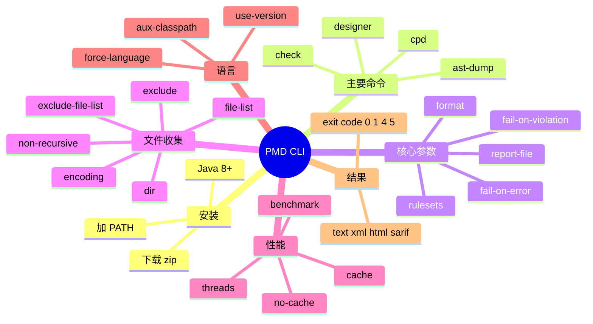

# PMD CLI 用法详解：命令、参数、退出码、性能与工程集成

## 记忆卡片摘要（快速复习版）

### 1. 大纲（压缩版）

- 安装和命令入口
- `pmd check`、`pmd cpd`、`pmd designer`、`pmd ast-dump`
- PMD 核心参数一张图
- 文件收集参数怎么配
- 输出、退出码、缓存、线程怎么理解
- Java 特有参数和运行时环境变量
- 实战命令模板

### 2. 思维导图（Mermaid）



### 3. 重要知识点（必须记住）

- PMD 官方安装文档要求 Java 8 或更高版本，分发形式为 zip 包，`bin/pmd` 是统一入口。[来源1]
- `pmd check` 是做 PMD 规则分析，`pmd cpd` 做重复检测，`pmd designer` 用于规则开发，`pmd ast-dump` 用于导出 AST。[来源1][来源2]
- 运行 `pmd check` 至少需要两类输入：规则集 `-R/--rulesets` 与待分析源 `-d/--dir` 或 `--file-list` 或 `--uri`。[来源1][来源2]
- `--cache` 会启用增量分析，官方明确说这能极大提升性能，而且生成的报告与全量扫描“完全一致”。[来源2][来源3]
- 退出码很重要：发现违规默认会返回 4；出现可恢复错误默认会返回 5；异常退出为 1；一切正常为 0。[来源2]

### 4. 难点 / 易混点

- `--no-fail-on-violation` 和 `--no-fail-on-error` 都会影响流水线结果，但针对的问题不同。
- `--use-version` 不会改变语言识别，`--force-language` 才会。
- `--cache` 是性能优化，不是结果折中；官方明确说结果应与全量扫描一致。[来源3]

### 5. QA 快速复习卡片

- Q: 最小可运行命令长什么样？
  A: `pmd check -R <ruleset> -d <src>`，格式 `-f` 可不写，默认是 `text`。[来源1][来源2]
- Q: CI 不想因为违规而失败怎么办？
  A: 用 `--no-fail-on-violation`；如果也不想因可恢复错误失败，再配 `--no-fail-on-error`。[来源2]
- Q: Java 项目为什么常常还要配 `--aux-classpath`？
  A: 因为类型解析依赖类路径，不配对某些规则会降低准确性。[来源1][来源2]

### 6. 快速复现步骤（最短路径）

1. 下载官方 zip 并加入 `PATH`。[来源1]
2. 先执行 `pmd check --help` 看当前分发版可用命令与参数。[来源2]
3. 用 `pmd check -R rulesets/java/quickstart.xml -d src/main/java -f text` 建立最小心智模型。[来源1]
4. 再把 `--cache`、`--report-file`、`--threads`、`--no-fail-on-violation` 加进工程模板。[来源2][来源3]

---

## 学习笔记正文（详细版）

## 0. 学习目标、读者画像与假设

- 技术：PMD CLI
- 学习目标：把 PMD 命令行真正用明白，知道每个关键参数的作用、默认值、风险与典型搭配
- 读者水平：初学到进阶
- 版本范围：latest 文档，PMD 7.22.0 体系
- 运行环境：当前环境未安装 PMD，因此本文解释以官方文档为准，命令模板未在本地执行验证

## 1. PMD CLI 从哪里开始

官方 Installation 页面给出最基础的事实：

- PMD 通过 zip 分发
- 需要 Java 8 或以上
- 解压后可通过 `bin/pmd` 或 Windows 下 `pmd.bat` 运行
- 建议把 `bin/` 加入 `PATH`
- 还提供 Bash / Zsh 补全生成能力 `pmd generate-completion`。[来源1]

对非科班读者，可以把 PMD CLI 想成一个“多功能总控脚本”。你不需要分别找 `pmd-check`、`pmd-cpd`、`pmd-designer`。统一入口就是 `pmd`，第一个参数是子命令。

## 2. 主要子命令各干什么

### 2.1 `pmd check`

这是最常用的命令。作用是读取规则集，扫描指定源码路径，输出违规报告。[来源1][来源2]

### 2.2 `pmd cpd`

做 copy-paste detection，也就是重复代码检测。它不依赖 PMD 规则集，而是依赖 `--minimum-tokens` 等 CPD 参数。[来源1]

### 2.3 `pmd designer`

规则开发工具，特别适合写 XPath 规则。你可以在里面输入代码片段，看 AST，并试 XPath 表达式。[来源4]

### 2.4 `pmd ast-dump`

把源码解析成 AST 结构输出为 `xml` 或 `text`，用于学习语法树、调试规则、辅助 XPath 编写。[来源5]

## 3. `pmd check` 的最小必需参数

官方安装文档写得很清楚，做 PMD 分析至少要有：

- `-R <path>`：规则集
- `<source>` 或 `-d/--dir <path>`：输入源[来源1]

CLI Reference 进一步细化为：

- 至少提供 `--dir`、`--file-list` 或 `--uri` 之一
- `--rulesets/-R` 为必需项[来源2]

所以最小心智模型其实就一句话：

`PMD = 用哪些规则，扫哪些文件`

只要你把这两件事说清楚，命令就跑得起来。

## 4. 核心参数详解

下面按“从最常用到最容易踩坑”的顺序解释。

### 4.1 `--rulesets` / `-R <refs>`

这是 PMD 的心脏。它指定要使用的 ruleset XML。官方说明可接受：

- classpath 资源路径
- 本地文件路径
- URL
- 可重复指定
- 单次出现也可用逗号传多个值[来源2]

详细作用：

- 决定启用哪些规则
- 决定分析的语言范围
- 决定分析结果是否适合你的项目

实战提醒：

- 初学不要直接“全量规则”
- 官方 Best Practices 建议从少量高价值规则开始，再逐步扩展。[来源6]

### 4.2 `--format` / `-f <format>`

决定报告格式，默认是 `text`。[来源2]

为什么重要：

- 人工阅读常用 `text`
- 机器集成常用 `xml`、`sarif` 等
- 有些格式支持额外属性，可通过 `-P` 传入

### 4.3 `--report-file` / `-r <path>`

把报告写到文件而不是标准输出。[来源2]

为什么推荐：

- PMD 日志写到 `stderr`
- 若你只重定向控制台，日志和报告容易混在一起
- 写文件更利于 CI 留档、制品上传和后处理

### 4.4 `--property` / `-P name=value`

这是给“报告渲染器”传属性，不是给规则本身传属性。[来源2]

初学者常误解成“规则自定义参数”。实际上它更常用于输出格式的细调，例如某格式的缩进、引号、路径渲染方式等。规则属性配置一般在 ruleset XML 里完成。

### 4.5 `--minimum-priority <priority>`

控制优先级阈值，默认 `Low`，也就是 1 到 5 全收。[来源2]

直白解释：

- 数值越小优先级越高
- 你把阈值设高，就只保留更重要的问题

典型用法：

- 初期推广 PMD 时，用它先压缩噪音
- 例如只扫 `1-3` 优先级，把最明显的问题先治理

### 4.6 `--fail-on-violation` / `--no-fail-on-violation`

默认开启。发现违规时退出码为 4。[来源2]

适用场景：

- CI 门禁时保持默认
- 本地探索或生成报告时可关闭，避免命令失败中断脚本

### 4.7 `--fail-on-error` / `--no-fail-on-error`

针对“可恢复错误”，默认出现时退出码为 5。[来源2]

什么叫可恢复错误？

- 某些文件解析失败
- 某些配置项有局部问题，但 PMD 仍能产出部分报告

工程意义：

- 严格门禁：保持默认
- 渐进接入旧项目：可临时关闭，但要把错误数量纳入治理清单，而不是长期忽略

### 4.8 `--debug` / `--verbose`

输出更多日志。[来源2]

适合：

- 排查为什么某文件没被分析
- 排查 ruleset 引用、缓存失效、语言识别问题

不适合：

- 作为 CI 常态默认输出，太吵

### 4.9 `--threads` / `-t <num>`

控制线程数，默认 `1C`，也就是按 CPU 核数自动计算。[来源2]

官方支持：

- 整数
- 类似 `0.5C`、`1C` 的按核心倍数表达式
- `0` 表示全部走主线程

实战理解：

- 大仓库、充足 CPU：可以提高吞吐
- IO 很多或机器紧张时，盲目开太高未必更快
- 自定义规则如果逻辑特别重，也要注意资源占用

### 4.10 `--benchmark`

输出基准报告到 `stderr`。[来源2]

适合做什么：

- 找出瓶颈规则
- 估算开启新规则后的成本
- 为 CI 时间预算做依据

### 4.11 `--cache <filepath>`

启用增量分析缓存。官方明确说“highly recommended”。[来源2]

它的真正价值不是“偷懒”，而是：

- 扫描新改文件更快
- 未变文件若已有缓存，可直接复用违规结果
- 最终报告与全量分析应完全一致[来源3]

### 4.12 `--no-cache`

强制禁用缓存，并丢弃 `--cache` 参数效果。[来源2][来源3]

什么时候用：

- 怀疑缓存受污染时
- 临时全量复核时
- 你不想看到未配置缓存的警告建议时

### 4.13 `--force-language <lang>`

强制把全部输入按某语言解析。[来源2]

典型场景：

- 文件扩展名不标准
- XML 方言文件不叫 `.xml`
- 只做某种特定格式的实验性扫描

### 4.14 `--use-version <lang-version>`

指定语言版本，可重复设置多个语言。[来源2]

典型场景：

- Java 8 项目避免按更高版本语法环境解释
- 多语言仓库里分别锁定不同语言版本

### 4.15 `--aux-classpath <cp>`

Java 特有的重要参数。[来源1][来源2]

作用：

- 提供项目依赖库类路径
- 帮助 PMD 做更准确的类型解析

为什么重要：

- 一些 Java 规则高度依赖类型信息
- 类路径不全时可能导致误报、漏报或规则失效

## 5. 文件收集参数详解

CLI Reference 把文件收集参数单独成节，这非常合理，因为“扫哪些文件”本身就是治理重点。[来源2]

### 5.1 `--dir` / `-d <path>`

最常用。可以是文件、目录，甚至直接指定 zip/jar 包。[来源2]

### 5.2 `--file-list <filepath>`

把待分析文件列表放进文本文件，一行一个路径。[来源2]

适合：

- 只扫 Git diff 文件
- 与上层平台联动

### 5.3 `--exclude <filepath+>`

直接在命令行排除一个或多个路径。会覆盖 `--dir`、`--file-list`、`--uri` 引入的文件。[来源2]

### 5.4 `--exclude-file-list <filepath>`

把排除列表写进文件，适合长期维护。[来源2]

### 5.5 `--ignore-list <filepath>`

已弃用，官方说明从 7.14.0 起改名为 `--exclude-file-list`。[来源2]

### 5.6 `--non-recursive`

目录只扫当前层，不递归子目录。[来源2]

适合：

- 模块化试跑
- 排查目录边界问题

### 5.7 `--relativize-paths-with` / `-z <path>`

控制报告里路径如何相对化显示。[来源2]

工程价值：

- 报告更短
- CI 输出更清晰
- 多个根路径场景更可控

### 5.8 `--encoding` / `-e <charset>`

指定源文件编码，默认 `UTF-8`。[来源2]

老项目非常关键。编码不对，解析一开始就可能偏掉。

## 6. Java 运行时相关参数

CLI Reference 还有两类容易被忽略但很实用的配置。

### 6.1 `PMD_JAVA_OPTS`

用于给 Java 运行时传额外参数，例如开启 preview features。[来源2]

这不是 PMD 规则参数，而是 JVM 运行参数。适合高级 Java 项目。

### 6.2 `CLASSPATH`

若你开发自定义规则并打成 jar，可通过把该 jar 放进 `lib/`，或设置 `CLASSPATH`，让 PMD 在运行时加载它。[来源2]

这说明 CLI 不只是“跑内置规则”，而是整个扩展生态的入口。

## 7. 退出码一定要搞懂

这是 CI 接入的核心。

CLI Reference 给出的退出码语义可以概括为：

- `0`：无违规且无可恢复错误
- `1`：异常退出
- `4`：发现违规
- `5`：出现可恢复错误[来源2]

工程上怎么理解：

- 你想把 PMD 当硬门禁，就保留默认失败语义
- 你想先上报不拦截，可加 `--no-fail-on-violation`
- 你想兼容旧仓库的历史问题，可阶段性关掉某些失败条件，但必须有后续收敛计划

## 8. 增量分析如何工作

Incremental Analysis 文档给出非常关键的保证：

- 第一次运行会缓存分析数据与结果
- 后续只重点处理新增或变化文件
- 最终生成的报告与不使用增量分析时“完全一样”[来源3]

缓存会在以下变化时整体失效：

- PMD 版本变化
- ruleset 变化
- auxclasspath 变化
- 执行类路径变化[来源3]

对工程团队，这意味着：

- 日常开发、PR 检查很适合开缓存
- 升级 PMD 或改规则后，缓存重建是正常现象
- 缓存不是“风险优化”，而是“正确前提下的性能优化”

## 9. `designer` 和 `ast-dump` 怎么配合用

这两个命令经常被忽略，但它们是规则开发与误报排查的利器。

### 9.1 `pmd designer`

适合做：

- 看代码片段 AST
- 试 XPath
- 导出 XPath 规则 XML[来源4]

### 9.2 `pmd ast-dump`

适合做：

- 将 AST 导出为 XML 或文本
- 脱离 GUI 做自动化查看
- 用其他工具进一步查询 AST，例如文档示例中的 `xmlstarlet`。[来源5]

如果你写 XPath 规则，最稳的流程常常是：

`设计器看树 -> ast-dump 核实属性 -> XPath 规则定稿 -> ruleset 落盘`

## 10. 推荐命令模板

### 10.1 本地开发最小模板

```bash
pmd check -R rulesets/java/quickstart.xml -d src/main/java -f text
```

用途：快速感受 PMD 输出。

### 10.2 CI 报告模板

```bash
pmd check \
  -R config/pmd/pmd-ruleset.xml \
  -d src/main/java \
  -f sarif \
  -r build/reports/pmd.sarif \
  --cache build/cache/pmd.cache \
  --threads 1C
```

用途：产出机器可消费报告并启用缓存。

### 10.3 旧项目宽松接入模板

```bash
pmd check \
  -R config/pmd/pmd-ruleset.xml \
  -d src/main/java \
  -f text \
  --no-fail-on-violation \
  --cache build/cache/pmd.cache
```

用途：先看问题，不立刻拦截流水线。

### 10.4 Java 深度分析模板

```bash
pmd check \
  -R config/pmd/pmd-ruleset.xml \
  -d src/main/java \
  --aux-classpath "build/classes/java/main:libs/*" \
  --use-version java-17 \
  --cache build/cache/pmd.cache
```

用途：提高依赖类型信息的规则准确度。

## 11. 常见错误与排查路径

### 11.1 “没有找到违规，但我明明知道有问题”

排查顺序：

1. ruleset 是否真的启用了那条规则
2. 文件是否被包含
3. 语言是否识别正确
4. Java 是否缺少 `--aux-classpath`
5. 规则是否被 suppress

### 11.2 “CI 直接失败，但报告看起来正常”

排查：

- 是否是退出码 4 导致
- 是否存在可恢复错误导致退出码 5
- 是否需要暂时使用 `--no-fail-on-violation` 或 `--no-fail-on-error`

### 11.3 “跑得太慢”

排查：

- 是否启用了 `--cache`
- 线程数是否合理
- 是否启用了过多低价值规则
- 是否用 `--benchmark` 分析瓶颈

## 12. 延伸学习路径（官方优先）

- Installation and basic CLI usage。[来源1]
- CLI Reference。[来源2]
- Incremental Analysis。[来源3]
- AST dump 与 Rule Designer 文档。[来源4][来源5]

---

## 练习与复习闭环

## 1. 分层练习

### 基础练习

- 解释 `-R`、`-d`、`-f`、`-r` 各干什么。
- 解释退出码 `0/1/4/5` 的含义。

### 应用练习

- 写一条适合本地开发的 PMD 命令。
- 写一条适合 CI 的 PMD 命令，要求带缓存和报告文件。

### 综合练习

- 为一个 Java 17 单仓项目设计完整 PMD CLI 模板，并解释每个参数的存在理由。

## 2. 动手任务（带验收标准）

- 任务：自己整理一张“参数分组表”，分成规则、输入文件、输出、性能、语言、失败策略。
- 验收标准：每组至少写出三个参数及其作用。

## 3. 常见误区纠偏

- 误区：`-P` 是给规则传属性。
  正解：它主要是给报告格式渲染器传属性。[来源2]
- 误区：缓存会让结果变少。
  正解：官方明确说报告应与全量运行完全一致。[来源3]
- 误区：`--use-version` 能替代 `--force-language`。
  正解：前者改版本，后者改语言识别。[来源2]

## 4. 复习节奏建议

- Day 1：记最小命令模板和退出码。
- Day 3：记文件收集参数。
- Day 7：记缓存与线程参数。
- Day 14：闭眼写出一条适合 CI 的 PMD 命令。

## 5. 自测题与参考答案（简版）

- 题目1：为什么官方推荐 `--cache`？
  参考答案：因为增量分析能显著提速，同时结果与全量分析一致。[来源2][来源3]
- 题目2：为什么很多 Java 项目需要 `--aux-classpath`？
  参考答案：因为类型解析依赖依赖库类路径，缺失会影响分析精度。[来源1][来源2]
- 题目3：为什么 `--report-file` 常比重定向标准输出更稳？
  参考答案：因为日志写 `stderr`，报告单独写文件更清晰。[来源2]

---

## 参考来源与版本说明

## 官方来源（优先）

1. Installation and basic CLI usage: https://docs.pmd-code.org/latest/pmd_userdocs_installation.html
2. PMD CLI reference: https://docs.pmd-code.org/latest/pmd_userdocs_cli_reference.html
3. Incremental analysis: https://docs.pmd-code.org/latest/pmd_userdocs_incremental_analysis.html
4. Your first rule / Rule Designer: https://docs.pmd-code.org/latest/pmd_userdocs_extending_your_first_rule.html
5. AST dump: https://docs.pmd-code.org/latest/pmd_userdocs_extending_ast_dump.html
6. Best Practices: https://docs.pmd-code.org/latest/pmd_userdocs_best_practices.html

## 第三方来源（按采信程度标注）

- 无。

## 关键结论引用映射

- [来源1] -> 安装、命令入口、最小命令模板、Java 环境要求
- [来源2] -> 参数定义、默认值、退出码、文件收集与性能参数
- [来源3] -> 缓存工作原理和等价性保证
- [来源4] -> `designer` 的定位
- [来源5] -> `ast-dump` 的用途与参数
- [来源6] -> 不要一上来启用所有规则

## 官方文档章节映射与重要例子保留检查

- Installation -> 本文第 1、2、3 节
- CLI Reference -> 本文第 4、5、6、7 节
- Incremental Analysis -> 本文第 8 节
- Your first rule / AST dump -> 本文第 9 节
- Best Practices -> 本文第 4 和第 10 节中的渐进启用建议
- 重要例子保留说明：保留了 quickstart、aux-classpath、preview features、ast-dump 的核心命令思想

## 冲突点与裁决（如有）

- 冲突点：Installation 页面只展示常用参数，而 CLI Reference 给出完整参数表。
- 裁决依据：本文以 CLI Reference 为准，Installation 用于建立最小心智模型。
- 采用结论：先用 Installation 上手，再用 CLI Reference 完整治理。
